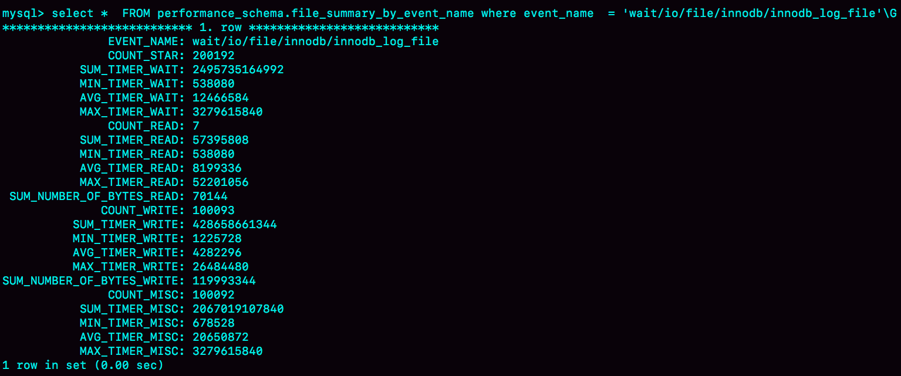

# 29讲如何判断一个数据库是不是出问题了

我在第[25](https://time.geekbang.org/column/article/76795)和[27](https://time.geekbang.org/column/article/77427)篇文章中，和你介绍了主备切换流程。通过这些内容的讲解，你应该已经很清楚了：在一主一备的双M架构里，主备切换只需要把客户端流量切到备库；而在一主多从架构里，主备切换除了要把客户端流量切到备库外，还需要把从库接到新主库上。

主备切换有两种场景，一种是主动切换，一种是被动切换。而其中被动切换，往往是因为主库出问题了，由 HA 系统发起的。

这也就引出了我们今天要讨论的问题：怎么判断一个主库出问题了？

你一定会说，这很简单啊，连上 MySQL，执行个 select 1 就好了。但是 select 1 成功返回了，就表示主库没问题吗？

## 一、select 1 判断

实际上，**select 1 成功返回，只能说明这个库的进程还在，并不能说明主库没问题**。现在，我们来看一下这个场景。

```mysql
set global innodb_thread_concurrency=3;

CREATE TABLE `t` (
  `id` int(11) NOT NULL,
  `c` int(11) DEFAULT NULL,
  PRIMARY KEY (`id`)
) ENGINE=InnoDB;

 insert into t values(1,1)
```

| Session A                 | Session B                 | Session C                 | Session D                                                    |
| ------------------------- | ------------------------- | ------------------------- | ------------------------------------------------------------ |
| select sleep(100) from t; | select sleep(100) from t; | select sleep(100) from t; |                                                              |
|                           |                           |                           | select 1;<br />(Query OK)<br /><br />select * from t;<br />(blocked) |

图1 查询 blocked

**设置 `innodb_thread_concurrency` 参数的目的是，控制 InnoDB 的并发线程上限。也就是说，一旦并发线程数达到这个值，InnoDB 在接收到新请求的时候，就会进入等待状态，直到有线程退出**。

这里 `innodb_thread_concurrency` 设置成 3，表示 InnoDB 只允许 3 个线程并行执行。而在我们的例子中，前三个 session 中的 `sleep(100)`，使得这三个语句都处于“执行”状态，以此**来模拟大查询**。

在 session D 里面，`select 1` 是能执行成功的，但是查询表 t 的语句会被堵住。也就是说，如果这时候用 select 1 来检测实例是否正常的话，是检测不出问题的。

**在 InnoDB 中，`innodb_thread_concurrency` 这个参数的默认值是 0，表示不限制并发线程数量**。但是，不限制并发线程数肯定是不行的。因为，一个机器的CPU 核数有限，线程全冲进来，上下文切换的成本就会太高。所以，通常情况下，**建议把 `innodb_thread_concurrency` 设置为 64~128 之间的值**。这时，你一定会有疑问，并发线程上限数设置为 128 够干啥，线上的并发连接数动不动就上千了。

产生这个疑问的原因，是搞混了**并发连接和并发查询。**

**并发连接和并发查询，并不是同一个概念。在 `show processlist` 的结果里，看到的几千个连接，指的就是并发连接。而「当前正在执行」的语句，才是我们所说的并发查询。**

并发连接数达到几千个影响并不大，就是多占一些内存而已。我们应该关注的是并发查询，因为并发查询太高才是 CPU 杀手。这也是为什么我们需要设置`innodb_thread_concurrency` 参数的原因。

然后，你可能还会想起我们在[第7篇文章](https://time.geekbang.org/column/article/70215)中讲到的热点更新和死锁检测的时候，如果把 `innodb_thread_concurrency` 设置为 128 的话，那么出现同一行热点更新的问题时，是不是很快就把 128 消耗完了，这样整个系统是不是就挂了呢？

实际上，**在线程进入锁等待以后，并发线程的计数会减一**，也就是说等行锁（也包括间隙锁）的线程是不算在 128 里面的。

MySQL 这样设计是非常有意义的。因为，进入锁等待的线程已经不吃 CPU 了；更重要的是，必须这么设计，才能避免整个系统锁死。

为什么呢？假设处于锁等待的线程也占并发线程的计数，你可以设想一下这个场景：

1. 线程 1 执行 `begin; update t set c=c+1 where id=1`, 启动了事务 trx1， 然后保持这个状态。这时候，线程处于空闲状态，不算在并发线程里面。
2. 线程 2 到线程 129 都执行 `update t set c=c+1 where id=1;` 由于等行锁，进入等待状态。这样就有 128 个线程处于等待状态；
3. 如果处于锁等待状态的线程计数不减一，InnoDB 就会认为线程数用满了，会阻止其他语句进入引擎执行，这样线程 1 不能提交事务。而另外的 128 个线程又处于锁等待状态，整个系统就堵住了。

下图 2 显示的就是这个状态。


图2 系统锁死状态（假设等行锁的语句占用并发计数）

这时候 InnoDB 不能响应任何请求，整个系统被锁死。而且，由于所有线程都处于等待状态，此时占用的 CPU 却是 0，而这明显不合理。所以，我们说 InnoDB 在设计时，遇到进程进入锁等待的情况时，将并发线程的计数减 1 的设计，是合理而且是必要的。

虽然说等锁的线程不算在并发线程计数里，但如果它在真正地执行查询，就比如我们上面例子中前三个事务中的 `select sleep(100) from t`，还是要算进并发线程的计数的。

在这个例子中，同时在执行的语句超过了设置的 `innodb_thread_concurrency` 的值，这时候系统其实已经不行了，但是通过 select 1 来检测系统，会认为系统还是正常的。

因此，我们使用 select 1 的判断逻辑要修改一下。

## 二、查表判断

为了能够检测 InnoDB 并发线程数过多导致的系统不可用情况，我们需要找一个访问 InnoDB 的场景。一般的做法是，在系统库（mysql 库）里创建一个表，比如命名为 `health_check`，里面只放一行数据，然后定期执行：

```mysql
mysql> select * from mysql.health_check; 
```

使用这个方法，我们可以检测出由于并发线程过多导致的数据库不可用的情况。

但是，我们马上还会碰到下一个问题，即：空间满了以后，这种方法又会变得不好使。

我们知道，更新事务要写binlog，而一旦binlog所在磁盘的空间占用率达到100%，那么所有的更新语句和事务提交的commit语句就都会被堵住。但是，系统这时候还是可以正常读数据的。

因此，我们还是把这条监控语句再改进一下。接下来，我们就看看把查询语句改成更新语句后的效果。

# 更新判断

既然要更新，就要放个有意义的字段，常见做法是放一个timestamp字段，用来表示最后一次执行检测的时间。这条更新语句类似于：

```
mysql> update mysql.health_check set t_modified=now();
```

节点可用性的检测都应该包含主库和备库。如果用更新来检测主库的话，那么备库也要进行更新检测。

但，备库的检测也是要写binlog的。由于我们一般会把数据库A和B的主备关系设计为双M结构，所以在备库B上执行的检测命令，也要发回给主库A。

但是，如果主库A和备库B都用相同的更新命令，就可能出现行冲突，也就是可能会导致主备同步停止。所以，现在看来mysql.health_check 这个表就不能只有一行数据了。

为了让主备之间的更新不产生冲突，我们可以在mysql.health_check表上存入多行数据，并用A、B的server_id做主键。

```
mysql> CREATE TABLE `health_check` (
  `id` int(11) NOT NULL,
  `t_modified` timestamp NOT NULL DEFAULT CURRENT_TIMESTAMP,
  PRIMARY KEY (`id`)
) ENGINE=InnoDB;

/* 检测命令 */
insert into mysql.health_check(id, t_modified) values (@@server_id, now()) on duplicate key update t_modified=now();
```

由于MySQL规定了主库和备库的server_id必须不同（否则创建主备关系的时候就会报错），这样就可以保证主、备库各自的检测命令不会发生冲突。

更新判断是一个相对比较常用的方案了，不过依然存在一些问题。其中，“判定慢”一直是让DBA头疼的问题。

你一定会疑惑，**更新语句，如果失败或者超时，就可以发起主备切换了，为什么还会有判定慢的问题呢？**

其实，这里涉及到的是服务器IO资源分配的问题。

首先，所有的检测逻辑都需要一个超时时间N。执行一条update语句，超过N秒后还不返回，就认为系统不可用。

你可以设想一个日志盘的IO利用率已经是100%的场景。这时候，整个系统响应非常慢，已经需要做主备切换了。

但是你要知道，IO利用率100%表示系统的IO是在工作的，每个请求都有机会获得IO资源，执行自己的任务。而我们的检测使用的update命令，需要的资源很少，所以可能在拿到IO资源的时候就可以提交成功，并且在超时时间N秒未到达之前就返回给了检测系统。

检测系统一看，update命令没有超时，于是就得到了“系统正常”的结论。

也就是说，这时候在业务系统上正常的SQL语句已经执行得很慢了，但是DBA上去一看，HA系统还在正常工作，并且认为主库现在处于可用状态。

之所以会出现这个现象，根本原因是我们上面说的所有方法，都是基于外部检测的。外部检测天然有一个问题，就是随机性。

因为，外部检测都需要定时轮询，所以系统可能已经出问题了，但是却需要等到下一个检测发起执行语句的时候，我们才有可能发现问题。而且，如果你的运气不够好的话，可能第一次轮询还不能发现，这就会导致切换慢的问题。

所以，接下来我要再和你介绍一种在MySQL内部发现数据库问题的方法。

# 内部统计

针对磁盘利用率这个问题，如果MySQL可以告诉我们，内部每一次IO请求的时间，那我们判断数据库是否出问题的方法就可靠得多了。

其实，MySQL 5.6版本以后提供的performance_schema库，就在file_summary_by_event_name表里统计了每次IO请求的时间。

file_summary_by_event_name表里有很多行数据，我们先来看看event_name='wait/io/file/innodb/innodb_log_file’这一行。



图3 performance_schema.file_summary_by_event_name的一行

图中这一行表示统计的是redo log的写入时间，第一列EVENT_NAME 表示统计的类型。

接下来的三组数据，显示的是redo log操作的时间统计。

第一组五列，是所有IO类型的统计。其中，COUNT_STAR是所有IO的总次数，接下来四列是具体的统计项， 单位是皮秒；前缀SUM、MIN、AVG、MAX，顾名思义指的就是总和、最小值、平均值和最大值。

第二组六列，是读操作的统计。最后一列SUM_NUMBER_OF_BYTES_READ统计的是，总共从redo log里读了多少个字节。

第三组六列，统计的是写操作。

最后的第四组数据，是对其他类型数据的统计。在redo log里，你可以认为它们就是对fsync的统计。

在performance_schema库的file_summary_by_event_name表里，binlog对应的是event_name = "wait/io/file/sql/binlog"这一行。各个字段的统计逻辑，与redo log的各个字段完全相同。这里，我就不再赘述了。

因为我们每一次操作数据库，performance_schema都需要额外地统计这些信息，所以我们打开这个统计功能是有性能损耗的。

我的测试结果是，如果打开所有的performance_schema项，性能大概会下降10%左右。所以，我建议你只打开自己需要的项进行统计。你可以通过下面的方法打开或者关闭某个具体项的统计。

如果要打开redo log的时间监控，你可以执行这个语句：

```
mysql> update setup_instruments set ENABLED='YES', Timed='YES' where name like '%wait/io/file/innodb/innodb_log_file%';
```

假设，现在你已经开启了redo log和binlog这两个统计信息，那要怎么把这个信息用在实例状态诊断上呢？

很简单，你可以通过MAX_TIMER的值来判断数据库是否出问题了。比如，你可以设定阈值，单次IO请求时间超过200毫秒属于异常，然后使用类似下面这条语句作为检测逻辑。

```
mysql> select event_name,MAX_TIMER_WAIT  FROM performance_schema.file_summary_by_event_name where event_name in ('wait/io/file/innodb/innodb_log_file','wait/io/file/sql/binlog') and MAX_TIMER_WAIT>200*1000000000;
```

发现异常后，取到你需要的信息，再通过下面这条语句：

```
mysql> truncate table performance_schema.file_summary_by_event_name;
```

把之前的统计信息清空。这样如果后面的监控中，再次出现这个异常，就可以加入监控累积值了。

# 小结

今天，我和你介绍了检测一个MySQL实例健康状态的几种方法，以及各种方法存在的问题和演进的逻辑。

你看完后可能会觉得，select 1这样的方法是不是已经被淘汰了呢，但实际上使用非常广泛的MHA（Master High Availability），默认使用的就是这个方法。

MHA中的另一个可选方法是只做连接，就是 “如果连接成功就认为主库没问题”。不过据我所知，选择这个方法的很少。

其实，每个改进的方案，都会增加额外损耗，并不能用“对错”做直接判断，需要你根据业务实际情况去做权衡。

我个人比较倾向的方案，是优先考虑update系统表，然后再配合增加检测performance_schema的信息。

最后，又到了我们的思考题时间。

今天，我想问你的是：业务系统一般也有高可用的需求，在你开发和维护过的服务中，你是怎么判断服务有没有出问题的呢？

你可以把你用到的方法和分析写在留言区，我会在下一篇文章中选取有趣的方案一起来分享和分析。感谢你的收听，也欢迎你把这篇文章分享给更多的朋友一起阅读。

# 上期问题时间

上期的问题是，如果使用GTID等位点的方案做读写分离，在对大表做DDL的时候会怎么样。

假设，这条语句在主库上要执行10分钟，提交后传到备库就要10分钟（典型的大事务）。那么，在主库DDL之后再提交的事务的GTID，去备库查的时候，就会等10分钟才出现。

这样，这个读写分离机制在这10分钟之内都会超时，然后走主库。

这种预期内的操作，应该在业务低峰期的时候，确保主库能够支持所有业务查询，然后把读请求都切到主库，再在主库上做DDL。等备库延迟追上以后，再把读请求切回备库。

通过这个思考题，我主要想让关注的是，大事务对等位点方案的影响。

当然了，使用gh-ost方案来解决这个问题也是不错的选择。

评论区留言点赞板：

> @曾剑、@max 同学提到的备库先做，再切主库的方法也是可以的。

## 精选留言

- 

    某、人

    目前是只有一台服务器来做判断,是否数据库出问题了,就是采用的update的方式。如果是主从架构就一条语句,如果是双主的话就是两条update语句。但是这种方式有很大的弊端,只有一个进程来判断数据库出问题的话,会出现单点判断的问题。所以后续准备多个单数进程来做判断,如果超过了半数以上的监控进程都认为数据库出问题,才做切换。
    老师我有两个问题:
    1.innodb_thread_concurrency的设置是不是应该跟计算机核数成正比,一般是1.5倍-2倍左右？
    2.怎么之前遇到空间满了,数据库都登不上了,所有的连接都连不上,更不用执行select语句了,这个是什么原因啊？

    2019-01-20 20:57

    作者回复

    \1. 虽然理论上是核数的2倍左右最好，但是现在很多人把MySQL创建在虚拟机上，就分1~2个核，我怕那么写，有同学会认为innodb_thread_concurrency建议设置成4。。

    \2. 空间满本身是不会导致连不上的。但是因为空间满，事务无法提交，可能会导致接下来外部事务重试，新重试的业务还是堵在提交阶段，持续累积可能会把连接数用满

    2019-01-21 02:18

- 

    heat nan

    老师，一直有个疑问，想咨询下。innodb buffer 会缓存表的数据页和索引页。现在我想知道如何确认一个查询的行已经被缓存在内存中了。 我想了一下，第一种方法是直接去内存中遍历这个表相关的数据页。这样的话，因为内存中的页可能是分散的，可能不构成一个完成的索引结构，可能不能利用b+树叶子节点的路由功能。 这里有点模糊，希望老师有空可以解释一下

    2019-01-19 10:13

    作者回复

    “因为内存中的页可能是分散的，可能不构成一个完成的索引结构，可能不能利用b+树叶子节点的路由功能。”

    这里不对哈

    放在内存里是b+树组织的，可以利用b+树叶子节点的路由功能的

    2019-01-19 11:05

- 

    小橙橙

    老师，我工作中遇到一个奇怪的问题，java客户端执行查询语句报错：ResultSet is from UPDATE. No Data。用navicat执行相同语句，很快就查询结束，但是没有结果显示。请问可能什么问题造成的呢？

    2019-01-18 16:13

    作者回复

    ？这两个不是一致的吗

    意思就是你要upate的语句找不到呀
    你把update改成select，先确定一下是不是能看到你要更新的数据（根据你这个描述，应该是没有）

    2019-01-18 17:17

- 

    悟空

    可以大致从DB监控图上判断业务有没有问题：
    QPS/连接数/慢查询/查询响应时间(query_response_time插件)等........

    老师请教一个问题：
    物理机器是128G内存，DB实例数据量是1.2T，磁盘是pcie ssd
    业务查询场景是简单的select * from table where id in (1,2,3....);
    实例QPS在1000以下时,数据库看上去一切正常
    当QPS大于2000+时, %util持续90+, r/s持续2W左右, rMB/s持续600+, 伴随着连接数/慢查询等报警
    这个时候这个数据库实例可以说是出问题了吧，这类问题该怎么排查根因呢？
    是由于buffer pool与磁盘大量换入换出冷数据导致的吗，有相关的状态值监控项可以查吗？

    innodb buffer pool是mysql很重要的一个模块，老师后面有单独的章节来解惑吗，期待 ！！

    2019-01-18 15:45

    作者回复

    有的， 敬请期待

    不过buffer pool内部细节很多，只能挑大家使用的时候，可能会用到的知识点来讲哈

    2019-01-18 17:15

- 

    One day

    作为一个开发我也很想了解一下我们自己生产库上的监控情况，接触到最多的就是Datasource,以及user，password,port（基本上是基于连接那种级别，最多就是加锁），等等参数，大部分都是基于业务开发。站在个人层面或者业务开发层面（很少能接触到DBA，以及看到DBA是怎么设置这些参数情况，除非库挂掉了就会和DBA一起看这些）怎么去修改和观看以及使用这些参数鸭

    2019-01-18 14:29

    作者回复

    有DBA就不要自己去修改线上的参数啦

    如果说观察，一个比较好的管控系统，是会能够让你看到这些值的

    如果没有，就让dba给你一份线上的my.cnf的配置，然后你在测试环境自己用这个配置启动实例来观察

    2019-01-18 17:12

- 

    老杨同志

    现在很多公司都是使用dubbo或者类似dubbo的rpc调用。说说我对dubbo的理解
    dubbo 存活检测感觉分为下面三个层面
    服务端与注册中心的链接状态
    通常注册中心是zookeeper，服务端注册临时节点，客户端注册这个节点的watch事件，一但服务端失联，
    客户端将把该服务从自己可用服务列表中移除。（一个服务通常有多个提供者，只是把失联的提供者移除）。
    zookeeper是通过心跳发现服务提供者失联的，心跳实际上就是以固定的频率（比如每秒）发送检测的数据包；

    客户端与注册中心的链接状态
    客户端与zookeeper失联，会暂时使用自己缓存的服务提供者列表。如果每个提供者多次调不通，把它移除。

    客户端与服务单的链接状态
    服务端提供类似于echo的方法，客户定时调用。部分返回正常，认为服务处于亚健康状态，如果超过阀值，会被降级
    从服务提供者列表移除。被移除的方法可能会在超过一定时间后，拿回来重试，可以恢复成正常服务，也可能继续降级。

    2019-01-18 09:53

    作者回复

    很好的实践分享。
    是不是还有配套一些服务的RT时间的报告？
    毕竟echo是一个比较轻量的调用，正确率可能比实际业务调用的正确率高

    2019-01-20 13:36

- 

    强哥

    1.基础监控，包括硬盘，CPU，网络，内存等。
    2.服务监控，包括jvm，服务端口，接入上下游服务的超时监控等。
    3.业务监控，主要是监控业务的流程是否出现问题。

    2019-01-18 09:18

    作者回复

    ，这里的“超时监控”，是怎么得到的？
    是单独有命令检测，还是去看业务请求的返回时间？

    2019-01-18 11:39

- 

    Ryoma

    现在的服务中只加了一个healthCheck的接口，和MySQL中使用select判断比较类似。当服务依赖的MySQL及Redis等第三方资源发生问题时，还是不能有效的判断

    2019-01-18 09:11

- 

    长杰

    老师请教一个问题，在gtid模式下，对于大的ddl操作，采用在备库执行sql_log_bin=0的方式先执行，然后再切换主备的方式在主库再执行，这种情况下，ddl操作是不记录binlog的，不知道对gtid的计数有什么影响，是按顺序递增还是会跳过这个序列号？
    另外补充一下有些dl操作是不适合这个主备切换的方式，比如drop一个列，如果先在备库执行就可能导致主备同步异常。这个场景适合osc方式或把读请求切到主库，先在主库执行这两种方案。

    2019-01-18 09:07

    作者回复

    如果set sql_log_bin=0， 就不记录binlog，就不会给这个事务分配gtid。

    你说得对，drop列是很麻烦的，尽量不做。毕竟业务代码直接无视这个列就好了。。

    2019-01-18 11:36

- 

    爸爸回来了

    之前也用select 1。后来发现，硬盘意外塞满时，本地链接很有可能超时导致判断失败。
    想问问老师，mysqladmin ping这个机制用来判断如何？

    2019-01-18 08:30

    作者回复

    跟select 1 属于一类

    2019-01-18 11:32