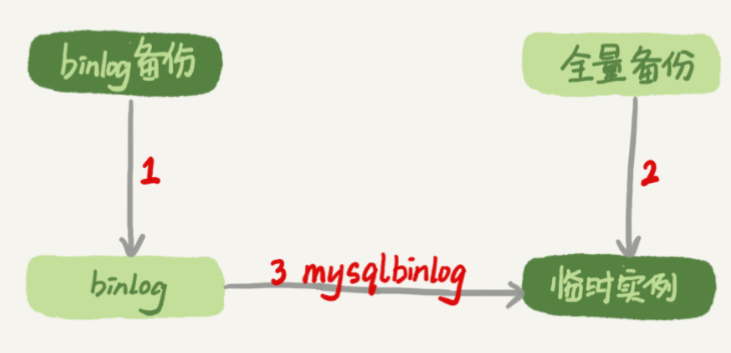
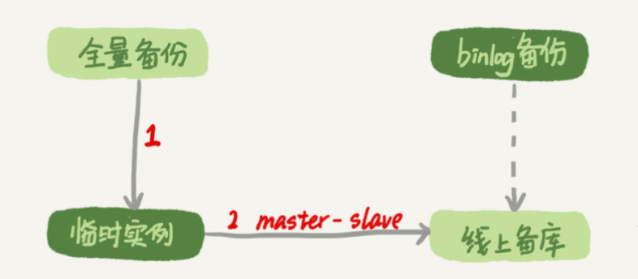
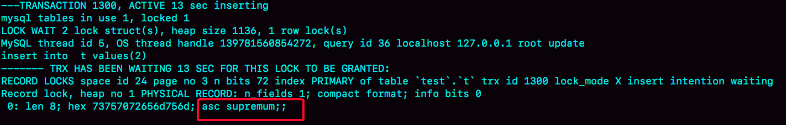

# 31讲误删数据后除了跑路，还能怎么办

今天我要和你讨论的是一个沉重的话题：误删数据。

在前面几篇文章中，我们介绍了MySQL的高可用架构。当然，传统的高可用架构是不能预防误删数据的，因为主库的一个drop table命令，会通过binlog传给所有从库和级联从库，进而导致整个集群的实例都会执行这个命令。

虽然我们之前遇到的大多数的数据被删，都是运维同学或者DBA背锅的。但实际上，只要有数据操作权限的同学，都有可能踩到误删数据这条线。

今天我们就来聊聊误删数据前后，我们可以做些什么，减少误删数据的风险，和由误删数据带来的损失。

为了找到解决误删数据的更高效的方法，我们需要先对和MySQL相关的误删数据，做下分类：

1. 使用delete语句误删数据行；
2. 使用drop table或者truncate table语句误删数据表；
3. 使用drop database语句误删数据库；
4. 使用rm命令误删整个MySQL实例。

# 误删行

在[第24篇文章](https://time.geekbang.org/column/article/76446)中，我们提到如果是使用delete语句误删了数据行，可以用Flashback工具通过闪回把数据恢复回来。

Flashback恢复数据的原理，是修改binlog的内容，拿回原库重放。而能够使用这个方案的前提是，需要确保binlog_format=row 和 binlog_row_image=FULL。

具体恢复数据时，对单个事务做如下处理：

1. 对于insert语句，对应的binlog event类型是Write_rows event，把它改成Delete_rows event即可；
2. 同理，对于delete语句，也是将Delete_rows event改为Write_rows event；
3. 而如果是Update_rows的话，binlog里面记录了数据行修改前和修改后的值，对调这两行的位置即可。

如果误操作不是一个，而是多个，会怎么样呢？比如下面三个事务：

```
(A)delete ...
(B)insert ...
(C)update ...
```

现在要把数据库恢复回这三个事务操作之前的状态，用Flashback工具解析binlog后，写回主库的命令是：

```
(reverse C)update ...
(reverse B)delete ...
(reverse A)insert ...
```

也就是说，如果误删数据涉及到了多个事务的话，需要将事务的顺序调过来再执行。

**需要说明的是，我不建议你直接在主库上执行这些操作。**

恢复数据比较安全的做法，是恢复出一个备份，或者找一个从库作为临时库，在这个临时库上执行这些操作，然后再将确认过的临时库的数据，恢复回主库。

为什么要这么做呢？

这是因为，一个在执行线上逻辑的主库，数据状态的变更往往是有关联的。可能由于发现数据问题的时间晚了一点儿，就导致已经在之前误操作的基础上，业务代码逻辑又继续修改了其他数据。所以，如果这时候单独恢复这几行数据，而又未经确认的话，就可能会出现对数据的二次破坏。

当然，**我们不止要说误删数据的事后处理办法，更重要是要做到事前预防**。我有以下两个建议：

1. 把sql_safe_updates参数设置为on。这样一来，如果我们忘记在delete或者update语句中写where条件，或者where条件里面没有包含索引字段的话，这条语句的执行就会报错。
2. 代码上线前，必须经过SQL审计。

你可能会说，设置了sql_safe_updates=on，如果我真的要把一个小表的数据全部删掉，应该怎么办呢？

如果你确定这个删除操作没问题的话，可以在delete语句中加上where条件，比如where id>=0。

但是，delete全表是很慢的，需要生成回滚日志、写redo、写binlog。所以，从性能角度考虑，你应该优先考虑使用truncate table或者drop table命令。

使用delete命令删除的数据，你还可以用Flashback来恢复。而使用truncate /drop table和drop database命令删除的数据，就没办法通过Flashback来恢复了。为什么呢？

这是因为，即使我们配置了binlog_format=row，执行这三个命令时，记录的binlog还是statement格式。binlog里面就只有一个truncate/drop 语句，这些信息是恢复不出数据的。

那么，如果我们真的是使用这几条命令误删数据了，又该怎么办呢？

# 误删库/表

这种情况下，要想恢复数据，就需要使用全量备份，加增量日志的方式了。这个方案要求线上有定期的全量备份，并且实时备份binlog。

在这两个条件都具备的情况下，假如有人中午12点误删了一个库，恢复数据的流程如下：

1. 取最近一次全量备份，假设这个库是一天一备，上次备份是当天0点；
2. 用备份恢复出一个临时库；
3. 从日志备份里面，取出凌晨0点之后的日志；
4. 把这些日志，除了误删除数据的语句外，全部应用到临时库。

这个流程的示意图如下所示：



图1 数据恢复流程-mysqlbinlog方法

关于这个过程，我需要和你说明如下几点：

1. 为了加速数据恢复，如果这个临时库上有多个数据库，你可以在使用mysqlbinlog命令时，加上一个–database参数，用来指定误删表所在的库。这样，就避免了在恢复数据时还要应用其他库日志的情况。
2. 在应用日志的时候，需要跳过12点误操作的那个语句的binlog：
    - 如果原实例没有使用GTID模式，只能在应用到包含12点的binlog文件的时候，先用–stop-position参数执行到误操作之前的日志，然后再用–start-position从误操作之后的日志继续执行；
    - 如果实例使用了GTID模式，就方便多了。假设误操作命令的GTID是gtid1，那么只需要执行set gtid_next=gtid1;begin;commit; 先把这个GTID加到临时实例的GTID集合，之后按顺序执行binlog的时候，就会自动跳过误操作的语句。

不过，即使这样，使用mysqlbinlog方法恢复数据还是不够快，主要原因有两个：

1. 如果是误删表，最好就是只恢复出这张表，也就是只重放这张表的操作，但是mysqlbinlog工具并不能指定只解析一个表的日志；
2. 用mysqlbinlog解析出日志应用，应用日志的过程就只能是单线程。我们在[第26篇文章](https://time.geekbang.org/column/article/77083)中介绍的那些并行复制的方法，在这里都用不上。

**一种加速的方法是，**在用备份恢复出临时实例之后，将这个临时实例设置成线上备库的从库，这样：

1. 在start slave之前，先通过执行
    change replication filter replicate_do_table = (tbl_name) 命令，就可以让临时库只同步误操作的表；
2. 这样做也可以用上并行复制技术，来加速整个数据恢复过程。

这个过程的示意图如下所示。



图2 数据恢复流程-master-slave方法

可以看到，图中binlog备份系统到线上备库有一条虚线，是指如果由于时间太久，备库上已经删除了临时实例需要的binlog的话，我们可以从binlog备份系统中找到需要的binlog，再放回备库中。

假设，我们发现当前临时实例需要的binlog是从master.000005开始的，但是在备库上执行show binlogs 显示的最小的binlog文件是master.000007，意味着少了两个binlog文件。这时，我们就需要去binlog备份系统中找到这两个文件。

把之前删掉的binlog放回备库的操作步骤，是这样的：

1. 从备份系统下载master.000005和master.000006这两个文件，放到备库的日志目录下；
2. 打开日志目录下的master.index文件，在文件开头加入两行，内容分别是 “./master.000005”和“./master.000006”;
3. 重启备库，目的是要让备库重新识别这两个日志文件；
4. 现在这个备库上就有了临时库需要的所有binlog了，建立主备关系，就可以正常同步了。

不论是把mysqlbinlog工具解析出的binlog文件应用到临时库，还是把临时库接到备库上，这两个方案的共同点是：误删库或者表后，恢复数据的思路主要就是通过备份，再加上应用binlog的方式。

也就是说，这两个方案都要求备份系统定期备份全量日志，而且需要确保binlog在被从本地删除之前已经做了备份。

但是，一个系统不可能备份无限的日志，你还需要根据成本和磁盘空间资源，设定一个日志保留的天数。如果你的DBA团队告诉你，可以保证把某个实例恢复到半个月内的任意时间点，这就表示备份系统保留的日志时间就至少是半个月。

另外，我建议你不论使用上述哪种方式，都要把这个数据恢复功能做成自动化工具，并且经常拿出来演练。为什么这么说呢？

这里的原因，主要包括两个方面：

1. 虽然“发生这种事，大家都不想的”，但是万一出现了误删事件，能够快速恢复数据，将损失降到最小，也应该不用跑路了。
2. 而如果临时再手忙脚乱地手动操作，最后又误操作了，对业务造成了二次伤害，那就说不过去了。

# 延迟复制备库

虽然我们可以通过利用并行复制来加速恢复数据的过程，但是这个方案仍然存在“恢复时间不可控”的问题。

如果一个库的备份特别大，或者误操作的时间距离上一个全量备份的时间较长，比如一周一备的实例，在备份之后的第6天发生误操作，那就需要恢复6天的日志，这个恢复时间可能是要按天来计算的。

那么，我们有什么方法可以缩短恢复数据需要的时间呢？

如果有非常核心的业务，不允许太长的恢复时间，我们可以考虑**搭建延迟复制的备库。**这个功能是MySQL 5.6版本引入的。

一般的主备复制结构存在的问题是，如果主库上有个表被误删了，这个命令很快也会被发给所有从库，进而导致所有从库的数据表也都一起被误删了。

延迟复制的备库是一种特殊的备库，通过 CHANGE MASTER TO MASTER_DELAY = N命令，可以指定这个备库持续保持跟主库有N秒的延迟。

比如你把N设置为3600，这就代表了如果主库上有数据被误删了，并且在1小时内发现了这个误操作命令，这个命令就还没有在这个延迟复制的备库执行。这时候到这个备库上执行stop slave，再通过之前介绍的方法，跳过误操作命令，就可以恢复出需要的数据。

这样的话，你就随时可以得到一个，只需要最多再追1小时，就可以恢复出数据的临时实例，也就缩短了整个数据恢复需要的时间。

# 预防误删库/表的方法

虽然常在河边走，很难不湿鞋，但终究还是可以找到一些方法来避免的。所以这里，我也会给你一些减少误删操作风险的建议。

第一条建议是，账号分离。这样做的目的是，避免写错命令。比如：

- 我们只给业务开发同学DML权限，而不给truncate/drop权限。而如果业务开发人员有DDL需求的话，也可以通过开发管理系统得到支持。
- 即使是DBA团队成员，日常也都规定只使用只读账号，必要的时候才使用有更新权限的账号。

第二条建议是，制定操作规范。这样做的目的，是避免写错要删除的表名。比如：

- 在删除数据表之前，必须先对表做改名操作。然后，观察一段时间，确保对业务无影响以后再删除这张表。
- 改表名的时候，要求给表名加固定的后缀（比如加_to_be_deleted)，然后删除表的动作必须通过管理系统执行。并且，管理系删除表的时候，只能删除固定后缀的表。

# rm删除数据

其实，对于一个有高可用机制的MySQL集群来说，最不怕的就是rm删除数据了。只要不是恶意地把整个集群删除，而只是删掉了其中某一个节点的数据的话，HA系统就会开始工作，选出一个新的主库，从而保证整个集群的正常工作。

这时，你要做的就是在这个节点上把数据恢复回来，再接入整个集群。

当然了，现在不止是DBA有自动化系统，SA（系统管理员）也有自动化系统，所以也许一个批量下线机器的操作，会让你整个MySQL集群的所有节点都全军覆没。

应对这种情况，我的建议只能是说尽量把你的备份跨机房，或者最好是跨城市保存。

# 小结

今天，我和你讨论了误删数据的几种可能，以及误删后的处理方法。

但，我要强调的是，预防远比处理的意义来得大。

另外，在MySQL的集群方案中，会时不时地用到备份来恢复实例，因此定期检查备份的有效性也很有必要。

如果你是业务开发同学，你可以用show grants命令查看账户的权限，如果权限过大，可以建议DBA同学给你分配权限低一些的账号；你也可以评估业务的重要性，和DBA商量备份的周期、是否有必要创建延迟复制的备库等等。

数据和服务的可靠性不止是运维团队的工作，最终是各个环节一起保障的结果。

今天的课后话题是，回忆下你亲身经历过的误删数据事件吧，你用了什么方法来恢复数据呢？你在这个过程中得到的经验又是什么呢？

你可以把你的经历和经验写在留言区，我会在下一篇文章的末尾选取有趣的评论和你一起讨论。感谢你的收听，也欢迎你把这篇文章分享给更多的朋友一起阅读。

# 上期问题时间

我在上一篇文章给你留的问题，是关于空表的间隙的定义。

一个空表就只有一个间隙。比如，在空表上执行：

```
begin;
select * from t where id>1 for update;
```

这个查询语句加锁的范围就是next-key lock (-∞, supremum]。

验证方法的话，你可以使用下面的操作序列。你可以在图4中看到显示的结果。


图3 复现空表的next-key lock



图4 show engine innodb status 部分结果

评论区留言点赞板：

> @老杨同志 给出了正确的分析和SQL语句验证方法；
> @库淘淘 指出了show engine innodb status验证结论。

赞这些思考和反馈。

## 精选留言

- 

    苍茫

    有一次，我维护一张表，需要手动修改大量数据的状态，sql就很多，然后我保存到txt文件中以附件的形式发给部门老大审批，部门老大审批后转发邮件给运维，然后运维这哥们用的是360浏览器，他预览的sql，然后全部复制到客户端执行，但是问题也在这，360浏览器预览的时候由于文本偏长，到了某一条语句只有前半部分的update语句，没有后面的条件，然后就悲剧了。全表的状态都变成同一个。然后我就特别莫名其妙，还被老大批了一顿。说我写的脚本有问题。这锅我可不背，我把脚本在本地备份库跑了一遍又一遍就是没有问题。然后我再去运维哥们那，叫他再复制一下脚本就发现问题了。好在执行脚本前进行了表备份。扩展一下，如果你用谷歌浏览器就不会出现这种问题！发现问题后，立马恢复了数据

    2019-01-23 23:46

    作者回复

    这个是血泪经验

    拷贝文本执行，这个操作还可能存在字符集隐患。

    这个事情更深一层逻辑，是你做了创造性的事情，非常优秀。
    而这个运维同学认为他只是一个”复制粘贴执行的人”， 这种思路下是迟早会出问题的。

    2019-01-24 08:14

- 

    linhui0705

    对生产数据库操作，公司DBA提出的编写脚本方法，个人觉得还是值得分享，虽说可能大部分公司也可能有这样的规范。
    修改生产的数据，或者添加索引优化，都要先写好四个脚本：备份脚本、执行脚本、验证脚本和回滚脚本。备份脚本是对需要变更的数据备份到一张表中，固定需要操作的数据行，以便误操作或业务要求进行回滚；执行脚本就是对数据变更的脚本，为防Update错数据，一般连备份表进行Update操作；验证脚本是验证数据变更或影响行数是否达到预期要求效果；回滚脚本就是将数据回滚到修改前的状态。
    虽说分四步骤写脚本可能会比较繁琐，但是这能够很大程度避免数据误操作。

    2019-01-23 20:40

    作者回复

    非常好的经验
    如果能够切实执行，即使有出问题，也是可以很快恢复的
    把这些脚本当做开发代码来维护，是一个很好的实践

    2019-01-23 23:34

- 

    某、人

    总结下今天的知识点:
    我觉得DBA的最核心的工作就是保证数据的完整性
    今天老师也讲到了先要做好预防,预防的话大概是通过这几个点：
    1.权限控制与分配(数据库和服务器权限)
    2.制作操作规范
    3.定期给开发进行培训
    4.搭建延迟备库
    5.做好sql审计,只要是对线上数据有更改操作的语句(DML和DDL)都需要进行审核
    6.做好备份。备份的话又分为两个点.
    (1)如果数据量比较大,用物理备份xtrabackup。定期对数据库进行全量备份,也可以做增量备份。
    (2)如果数据量较少,用mysqldump或者mysqldumper。再利用binlog来恢复或者搭建主从的方式来恢复数据。
    定期备份binlog文件也是很有必要的
    还需要定期检查备份文件是否可用,如果真的发生了误操作,需要恢复数据的时候,发生备份文件不可用,那就更悲剧了

    如果发生了数据删除的操作,又可以从以下几个点来恢复:
    1.DML误操作语句造成数据不完整或者丢失。可以通过flashback,不过我们目前用的是美团的myflash,也是一个不错的工具，本质都差不多.都是先解析binlog event,然后在进行反转。把delete反转为insert,insert反转为delete,update前后image对调。所以必须设置binlog_format=row 和 binlog_row_image=full.
    切记恢复数据的时候,应该先恢复到临时的实例,然后在恢复回主库上。
    2.DDL语句误操作(truncate和drop),由于DDL语句不管binlog_format是row还是statement.在binlog里都只记录语句,不记录image所以恢复起来相对要麻烦得多。只能通过全量备份+应用binlog的方式来恢复数据。一旦数据量比较大,那么恢复时间就特别长,
    对业务是个考验。所以就涉及到老师在第二讲提到的问题了，全量备份的周期怎么去选择

    2019-01-23 14:14

    作者回复

    

    2019-01-23 18:22

- 

    亮

    CREATE TABLE `t` (
    `id` int(11) NOT NULL,
    `city` varchar(16) NOT NULL,
    `name` varchar(16) NOT NULL,
    `age` int(11) NOT NULL,
    `addr` varchar(128) DEFAULT NULL,
    PRIMARY KEY (`id`),
    KEY `city` (`city`)
    ) ENGINE=InnoDB;

    老师请教您16章的问题，您提到“city、name、age 这三个字段的定义总长度是36”，这个是怎么算出来的呢，varchar(16)是可以保存16个字符，占用了49个字节（utf8），所以我没想明白36是怎么来的。

    第二个问题是max_length_for_sort_data参数系统默认是1024，是1024个字节的意思吗？

    2019-01-23

    作者回复

    \1. age(11)其实是4个字节哈
    \2. 对，单位是字节

    谢谢老师，不过还是没明白，age是4个字节，city和name分别是49个字节，49+49+4=102字节，36是怎么来的呢？再次感谢

    

    2019-01-23 16:55

    作者回复

    哦 抱歉哈，我这边验证的时候默认用的latin1，是16+16+4

    2019-01-23 18:28

- 

    技术人成长

    我只想说，作者功力过于深厚了！

    2019-01-25 12:15

- 

    Cranliu

    个人觉得，预防同样很重要，一般的dml操作，我是先ctas要操作的数据，drop/truncate 的时候先逻辑备份。

    2019-01-23 08:37

    作者回复

    对的，备份的意识很重要。

    
    不过“drop/truncate 的时候先逻辑备份”这么做的不多^_^
    主要的原因是逻辑备份可能会对系统有额外消耗。（全表扫描）

    

    2019-01-23 09:00

- 

    511

    早~

    2019-01-23 08:35

- 

    Long

    又到了讲故事(事故)的时候了，历史上遇到过很多次事故。全表误删除，误更新不下于8次，有MySQL 的DB也有memory DB. 有一次同事比较搞笑的是，有一次一张重要的权限控制表更新，由于用的是workbench 界面工具当时写了where条件，但是在选中执行行的时候where条件在第二行，没选中，还在执行前的时候手动把session 级的sql_safe_updates=0了，也没有点开那个autocommit取消的按钮。然后一执行，全表更新了，导致全网只有一个用户可以正常登录。还有其他的误操作，总结历史遇到过的这类问题基本就是几类
    \1. 登错环境，以为是测试环境，一顿操作猛如虎，一看环境是生产，回头一看，表已经drop了……
    \2. sql写的有问题，逻辑错误，或者条件缺失，常见的如不带where；or关键字的逻辑没有用括号括好
    \3. 还有一些奇葩的，比如where 字段1=字段2写成了字段1+字段2，逻辑等于判断变成了是否为1的判断了，大概率全表更新了。

    错误解决大部分都是用备份恢复或者根据错误的逻辑来逻辑恢复。

    
    还有一个，最近在尝试的，就是ibd文件中有坏页，只要一读到那个坏页，就会crash，报错spaceid page no should be多少多少，尝试了copy frm, ibd，ibdata, iblogfile这些表结构，数据文件，数据字典，undo redo 日志，也尝试用了undrop的工具也解析不出来。这个表比较特殊，是一个特殊库，没备份，表没有索引没法通过走索引跳过那个坏页的那些行，现在的状态是，只能用nysqldump恢复一部分数据。 我想通过16进制，自己慢慢找到那个脏写的数据，然后修改一下文件……
    老师有什么比较好的建议吗？或者后面会说到ibd文件的物理结构之类的吗？ 感谢

    2019-01-28 04:32

    作者回复

    感谢你的分享，都是血泪教训。。
    我看有几个是用的可视化工具导致的，后面还是尽量用MySQL客户端敲命令吧

    ibd文件坏页我之前有回答过其他同学的，看下这个
    https://weibo.com/1933424965/H3qIu0JYo?from=page_1005051933424965_profile&wvr=6&mod=weibotime

    2019-01-28 08:41

- 

    PengfeiWang

    老师，您好，有个问题请教一下：
    关于MySQL备份有效性的验证，你有什么好的方法可以推荐吗？目前只能通过不定期的备份恢复来验证。

    2019-01-25 15:46

    作者回复

    大家都是这么做的

    2019-01-25 18:47

- 

    AI杜嘉嘉

    老师，接着上面问题。是删表，线上rename，有什么风险吗？需要注意什么？rename是不是ddl操作

    2019-01-25 15:42

    作者回复

    是，不过rename的执行速度很快

    2019-01-25 18:47

- 

    还一棵树

    我遇到过一个线上误truncate表的，最终选择的处理过程如下：
    1、创建一个同版本的空mysql实例，建一个名字+结构一模一样的表
    2、discard这个表的tablespace
    3、从之前的备份集中 innobackupex --apply-log 并记录binlog位置（用innobackupex备份的）。还原后找到误操作表的.ibd文件，copy到新实例对应的位置
    4、在之前创建的mysql实例上import tablespace
    5、利用mysqlbinlog 处理增量数据
    6、最后导出 再导入

    2019-01-24 20:19

    作者回复

    
    这基本上是最快的恢复步骤了

    2019-01-24 20:46

- 

    苍茫

    有一次我在查询数据倒数报表给业务方，那个脚本是我写的，关联了很多表，还跨了库，一个主表有一万多条纪录，关联另一张操作记录表好像是10万条数据。因为要统计多步操作步骤，所以每一步的操作记录我就得按照不同的条件关联产生临时表（关联中有group 还有max（）聚合函数，这个是需求导致的），一开始写好的查询很快有了结果。那天11点多的时候，我执行那个脚本，发现很慢没有反应，然后我就把连接关了，重复几次操作，然后生产库就被我搞挂了。后面运维的同学操作了一波才恢复过来。这次也是运维同学背的锅。后面，还把我的操作给贴出来了，做通报批评。我想问下为啥会出现这种情况呢？
    后续我的组长对我写的sql进行了优化，主要是把联表操作需要的信息放在子查询中，然后再操作记录表中加了索引，有了备份库，每次执行脚本导出数据都是在备份库中导出，就再也没有发生这个问题了。

    2019-01-24 19:42

    作者回复

    后面有一篇专门说这个，敬请期待哈

    2019-01-24 20:17

- 

    xishuai

    老师，麻烦问一下，5.7.21上innodb的表两列（有中文有英文）建的全文索引，最小分词1，按中文可以查询，按英文有些查询不出来，您知道原因吗？

    2019-01-24 18:52

    作者回复

    全文索引有stop words的，你看看是不是落在stop words里了

    2019-01-24 20:18

- 

    catalina

    老师，我们现在需要将一个库下面的所有表的数据同步到另外一个库，每个表有几百万数据吧，大约十多张表。有什么好的方法吗？

    2019-01-24 18:22

    作者回复

    原库的这几个表还会继续更新吗？ 如果会继续更新，就用搭主备的方法；
    如果没更新了，后面有一个文章专门讲这个问题哈

    2019-01-24 20:21

- 

    hua168

    大神，有亲戚小公司搞DBA一年，我想问一下：
    1.DBA一般发展方向是怎样的呀？运维和开发我了解，DBA没接触过，无法给建议，一般的升级过程是怎样的？
    2.以后发展方向是怎样？现在都是开源、大数据时代时代，阿里又搞“去IOE”，一般oracle DBA发展前景不好吧？

    能帮指一个大概的方向吗？谢谢~~

    2019-01-24 15:24

- 

    aliang

    老师好。这是第6讲评论区Tony Du的评论：
    session A: begin; select * from t limit 1; 最先启动sessionA
    session B: begin; select * from t limit 1; 紧接着启动sessionB
    session C: alter table t add f int; 然后再是启动sessionC
    session D: begin; select * from t limit 1; 最后是启动sessionD
    他说session C会被A和B阻塞，D会被C阻塞；当A和B提交后，D是可以继续执行得到查询结果的，但是C仍然被阻塞，只有D提交后C才能执行成功。我自己在5.6和5.7按他的步骤做了试验，结果和他一样。
    然后我再做了一次试验，这次把D的begin;去掉，变成了：
    session A: begin; select * from t limit 1; 最先启动sessionA
    session B: begin; select * from t limit 1; 紧接着启动sessionB
    session C: alter table t add f int; 然后再是启动sessionC
    session D: select * from t limit 1; 最后是启动sessionD
    结果是当A和B提交后，D和C都能执行成功了（和老师的结果一样）。我的问题是：为什么第一次session D显式开启事务，和第二次不显式开启的结果不一样呢？

    2019-01-24 11:12

- 

    太福

    因为时间原因，前面的课程没跟上，在这里请教个最近线上mysql遇到的问题：
    一个从库mysql5.6版本,正常情况下只有3到5个并发sql在查询，每分钟用下面的sql查看一次检测到的
    SELECT t1.* FROM information_schema.`PROCESSLIST` t1 WHERE info is not null ORDER BY time desc;
    前一次检测还是几个sql在查询，下1分钟查到2000多个sql在跑，很多堆积了几十秒的sql，状态“Sending data” “Creating sort index”
    ，而这些sql在正常情况下是不到1秒就查到结果了的，且cpu使用率与io很低，看起来mysql僵死的了。
    有两个问题：1）问题突然出现
    2）大量sql在跑，而cpu与磁盘io反而比正常下降；这是从库，写只有主从同步，其它都是读查询。
    配置：64G内存，bp分配40G，io使用不高
    ,业务量没大变动，也没新版本发布，大体排除业务并发加大导致的。

    2019-01-24 10:24

- 

    风二中

    老师，您好。如何设置binlog 的备份时间呢，感觉RPO 时间总是不能为零，如果是informix 可以只丢一个逻辑日志。对于需要保证mysql恢复 RPO 时间为零，有什么建议吗？备库延迟1小时，加每小时备份一次binlog 。

    2019-01-23 19:36

    作者回复

    嗯 对于核心业务，使用延迟复制的备份

    RPO时间为0？有这么凶残的业务需求吗。。我能想到的就是多套延迟备份的库。
    比如开3个， 一个是10分钟，一个20分钟，一个30分钟（主要考虑成本）
    RPO这么敏感的，应该有对应敏感的监控，误操作要是30分钟还不能发现，可以挑战一下，这个业务是不是值得这么高的指标^_^

    

    2019-01-23 20:09

- 

    700

    老师，请教。假如我有数据库的物理备份和逻辑备份（mydumper），因为 mydumper 导出的数据是按表名分开存放的，那么表误删数据的时候优先考虑逻辑备份（误删数据表的备份集）+binlog 恢复比物理备份恢复会快点？基于此，我总感觉物理备份只是在要恢复整个实例时才会优先考虑，而恢复整个实例的场景又是比较少的，毕竟一般大家的线上架构至少都是主从模式。所以逻辑备份被物理备份更实用。这种想法算是说得通吗？

    2019-01-23 18:23

    作者回复

    其实是要看表的大小

    如果是一个大表，逻辑恢复还是比较慢的，毕竟用物理备份来恢复出实例，相对会快些。

    当然如果你已经有了一个成熟系统用逻辑恢复来实现，也不用改它，主要关注一下是否满足SLA就可以了^_^
    facebook就是主要用逻辑备份的

    2019-01-23 19:16

- 

    高强

    老师你好，问个带子查询的delete/update/insert问题，Delete from A where name in(
    Select name from B where time<’2019-01-23 11:11:12’
    ) 这条语句删除A表记录之前是不是也会把表 B满足条件的记录也会给锁住呢?
    我试验了一下会锁住B表记录的，有没有其他办法不让锁B表呢?

    2019-01-23 16:38

    作者回复

    改成RC隔离级别试试

    2019-01-23 18:25