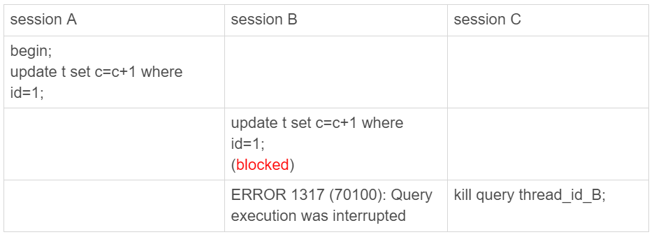

# 32讲为什么还有kill不掉的语句

在MySQL中有两个kill命令：一个是kill query +线程id，表示终止这个线程中正在执行的语句；一个是kill connection +线程id，这里connection可缺省，表示断开这个线程的连接，当然如果这个线程有语句正在执行，也是要先停止正在执行的语句的。

不知道你在使用MySQL的时候，有没有遇到过这样的现象：使用了kill命令，却没能断开这个连接。再执行show processlist命令，看到这条语句的Command列显示的是Killed。

你一定会奇怪，显示为Killed是什么意思，不是应该直接在show processlist的结果里看不到这个线程了吗？

今天，我们就来讨论一下这个问题。

其实大多数情况下，kill query/connection命令是有效的。比如，执行一个查询的过程中，发现执行时间太久，要放弃继续查询，这时我们就可以用kill query命令，终止这条查询语句。

还有一种情况是，语句处于锁等待的时候，直接使用kill命令也是有效的。我们一起来看下这个例子：



图1 kill query 成功的例子

可以看到，session C 执行kill query以后，session B几乎同时就提示了语句被中断。这，就是我们预期的结果。

# 收到kill以后，线程做什么？

但是，这里你要停下来想一下：session B是直接终止掉线程，什么都不管就直接退出吗？显然，这是不行的。

我在[第6篇文章](https://time.geekbang.org/column/article/69862)中讲过，当对一个表做增删改查操作时，会在表上加MDL读锁。所以，session B虽然处于blocked状态，但还是拿着一个MDL读锁的。如果线程被kill的时候，就直接终止，那之后这个MDL读锁就没机会被释放了。

这样看来，kill并不是马上停止的意思，而是告诉执行线程说，这条语句已经不需要继续执行了，可以开始“执行停止的逻辑了”。

> 其实，这跟Linux的kill命令类似，kill -N pid并不是让进程直接停止，而是给进程发一个信号，然后进程处理这个信号，进入终止逻辑。只是对于MySQL的kill命令来说，不需要传信号量参数，就只有“停止”这个命令。

**实现上，当用户执行kill query thread_id_B时，MySQL里处理kill命令的线程做了两件事：**

1. 把session B的运行状态改成THD::KILL_QUERY(将变量killed赋值为THD::KILL_QUERY)；
2. 给session B的执行线程发一个信号。

为什么要发信号呢？

因为像图1的我们例子里面，session B处于锁等待状态，如果只是把session B的线程状态设置THD::KILL_QUERY，线程B并不知道这个状态变化，还是会继续等待。发一个信号的目的，就是让session B退出等待，来处理这个THD::KILL_QUERY状态。

上面的分析中，隐含了这么三层意思：

1. 一个语句执行过程中有多处“埋点”，在这些“埋点”的地方判断线程状态，如果发现线程状态是THD::KILL_QUERY，才开始进入语句终止逻辑；
2. 如果处于等待状态，必须是一个可以被唤醒的等待，否则根本不会执行到“埋点”处；
3. 语句从开始进入终止逻辑，到终止逻辑完全完成，是有一个过程的。

到这里你就知道了，原来不是“说停就停的”。

接下来，我们**再看一个kill不掉的例子**，也就是我们在前面[第29篇文章](https://time.geekbang.org/column/article/78134)中提到的 innodb_thread_concurrency 不够用的例子。

首先，执行set global innodb_thread_concurrency=2，将InnoDB的并发线程上限数设置为2；然后，执行下面的序列：


图2 kill query 无效的例子

可以看到：

1. sesssion C执行的时候被堵住了；
2. 但是session D执行的kill query C命令却没什么效果，
3. 直到session E执行了kill connection命令，才断开了session C的连接，提示“Lost connection to MySQL server during query”，
4. 但是这时候，如果在session E中执行show processlist，你就能看到下面这个图。


图3 kill connection之后的效果

这时候，id=12这个线程的Commnad列显示的是Killed。也就是说，客户端虽然断开了连接，但实际上服务端上这条语句还在执行过程中。

**为什么在执行kill query命令时，这条语句不像第一个例子的update语句一样退出呢？**

在实现上，等行锁时，使用的是pthread_cond_timedwait函数，这个等待状态可以被唤醒。但是，在这个例子里，12号线程的等待逻辑是这样的：每10毫秒判断一下是否可以进入InnoDB执行，如果不行，就调用nanosleep函数进入sleep状态。

也就是说，虽然12号线程的状态已经被设置成了KILL_QUERY，但是在这个等待进入InnoDB的循环过程中，并没有去判断线程的状态，因此根本不会进入终止逻辑阶段。

而当session E执行kill connection 命令时，是这么做的，

1. 把12号线程状态设置为KILL_CONNECTION；
2. 关掉12号线程的网络连接。因为有这个操作，所以你会看到，这时候session C收到了断开连接的提示。

那为什么执行show processlist的时候，会看到Command列显示为killed呢？其实，这就是因为在执行show processlist的时候，有一个特别的逻辑：

```
如果一个线程的状态是KILL_CONNECTION，就把Command列显示成Killed。
```

所以其实，即使是客户端退出了，这个线程的状态仍然是在等待中。那这个线程什么时候会退出呢？

答案是，只有等到满足进入InnoDB的条件后，session C的查询语句继续执行，然后才有可能判断到线程状态已经变成了KILL_QUERY或者KILL_CONNECTION，再进入终止逻辑阶段。

到这里，我们来小结一下。

**这个例子是kill无效的第一类情况，即：线程没有执行到判断线程状态的逻辑。**跟这种情况相同的，还有由于IO压力过大，读写IO的函数一直无法返回，导致不能及时判断线程的状态。

**另一类情况是，终止逻辑耗时较长。**这时候，从show processlist结果上看也是Command=Killed，需要等到终止逻辑完成，语句才算真正完成。这类情况，比较常见的场景有以下几种：

1. 超大事务执行期间被kill。这时候，回滚操作需要对事务执行期间生成的所有新数据版本做回收操作，耗时很长。
2. 大查询回滚。如果查询过程中生成了比较大的临时文件，加上此时文件系统压力大，删除临时文件可能需要等待IO资源，导致耗时较长。
3. DDL命令执行到最后阶段，如果被kill，需要删除中间过程的临时文件，也可能受IO资源影响耗时较久。

之前有人问过我，如果直接在客户端通过Ctrl+C命令，是不是就可以直接终止线程呢？

答案是，不可以。

这里有一个误解，其实在客户端的操作只能操作到客户端的线程，客户端和服务端只能通过网络交互，是不可能直接操作服务端线程的。

而由于MySQL是停等协议，所以这个线程执行的语句还没有返回的时候，再往这个连接里面继续发命令也是没有用的。实际上，执行Ctrl+C的时候，是MySQL客户端另外启动一个连接，然后发送一个kill query 命令。

所以，你可别以为在客户端执行完Ctrl+C就万事大吉了。因为，要kill掉一个线程，还涉及到后端的很多操作。

# 另外两个关于客户端的误解

在实际使用中，我也经常会碰到一些同学对客户端的使用有误解。接下来，我们就来看看两个最常见的误解。

**第一个误解是：如果库里面的表特别多，连接就会很慢。**

有些线上的库，会包含很多表（我见过最多的一个库里有6万个表）。这时候，你就会发现，每次用客户端连接都会卡在下面这个界面上。


图4 连接等待

而如果db1这个库里表很少的话，连接起来就会很快，可以很快进入输入命令的状态。因此，有同学会认为是表的数目影响了连接性能。

从[第一篇文章](https://time.geekbang.org/column/article/68319)你就知道，每个客户端在和服务端建立连接的时候，需要做的事情就是TCP握手、用户校验、获取权限。但这几个操作，显然跟库里面表的个数无关。

但实际上，正如图中的文字提示所说的，当使用默认参数连接的时候，MySQL客户端会提供一个本地库名和表名补全的功能。为了实现这个功能，客户端在连接成功后，需要多做一些操作：

1. 执行show databases；
2. 切到db1库，执行show tables；
3. 把这两个命令的结果用于构建一个本地的哈希表。

在这些操作中，最花时间的就是第三步在本地构建哈希表的操作。所以，当一个库中的表个数非常多的时候，这一步就会花比较长的时间。

也就是说，**我们感知到的连接过程慢，其实并不是连接慢，也不是服务端慢，而是客户端慢。**

图中的提示也说了，如果在连接命令中加上-A，就可以关掉这个自动补全的功能，然后客户端就可以快速返回了。

这里自动补全的效果就是，你在输入库名或者表名的时候，输入前缀，可以使用Tab键自动补全表名或者显示提示。

实际使用中，如果你自动补全功能用得并不多，我建议你每次使用的时候都默认加-A。

其实提示里面没有说，除了加-A以外，加–quick(或者简写为-q)参数，也可以跳过这个阶段。但是，这个**–quick是一个更容易引起误会的参数，也是关于客户端常见的一个误解。**

你看到这个参数，是不是觉得这应该是一个让服务端加速的参数？但实际上恰恰相反，设置了这个参数可能会降低服务端的性能。为什么这么说呢？

MySQL客户端发送请求后，接收服务端返回结果的方式有两种：

1. 一种是本地缓存，也就是在本地开一片内存，先把结果存起来。如果你用API开发，对应的就是mysql_store_result 方法。
2. 另一种是不缓存，读一个处理一个。如果你用API开发，对应的就是mysql_use_result方法。

MySQL客户端默认采用第一种方式，而如果加上–quick参数，就会使用第二种不缓存的方式。

采用不缓存的方式时，如果本地处理得慢，就会导致服务端发送结果被阻塞，因此会让服务端变慢。关于服务端的具体行为，我会在下一篇文章再和你展开说明。

那你会说，既然这样，为什么要给这个参数取名叫作quick呢？这是因为使用这个参数可以达到以下三点效果：

- 第一点，就是前面提到的，跳过表名自动补全功能。
- 第二点，mysql_store_result需要申请本地内存来缓存查询结果，如果查询结果太大，会耗费较多的本地内存，可能会影响客户端本地机器的性能；
- 第三点，是不会把执行命令记录到本地的命令历史文件。

所以你看到了，–quick参数的意思，是让客户端变得更快。

# 小结

在今天这篇文章中，我首先和你介绍了MySQL中，有些语句和连接“kill不掉”的情况。

这些“kill不掉”的情况，其实是因为发送kill命令的客户端，并没有强行停止目标线程的执行，而只是设置了个状态，并唤醒对应的线程。而被kill的线程，需要执行到判断状态的“埋点”，才会开始进入终止逻辑阶段。并且，终止逻辑本身也是需要耗费时间的。

所以，如果你发现一个线程处于Killed状态，你可以做的事情就是，通过影响系统环境，让这个Killed状态尽快结束。

比如，如果是第一个例子里InnoDB并发度的问题，你就可以临时调大innodb_thread_concurrency的值，或者停掉别的线程，让出位子给这个线程执行。

而如果是回滚逻辑由于受到IO资源限制执行得比较慢，就通过减少系统压力让它加速。

做完这些操作后，其实你已经没有办法再对它做什么了，只能等待流程自己完成。

最后，我给你留下一个思考题吧。

如果你碰到一个被killed的事务一直处于回滚状态，你认为是应该直接把MySQL进程强行重启，还是应该让它自己执行完成呢？为什么呢？

你可以把你的结论和分析写在留言区，我会在下一篇文章的末尾和你讨论这个问题。感谢你的收听，也欢迎你把这篇文章分享给更多的朋友一起阅读。

# 上期问题时间

我在上一篇文章末尾，给你留下的问题是，希望你分享一下误删数据的处理经验。

**@苍茫 同学提到了一个例子**，我觉得值得跟大家分享一下。运维的同学直接拷贝文本去执行，SQL语句截断，导致数据库执行出错。

从浏览器拷贝文本执行，是一个非常不规范的操作。除了这个例子里面说的SQL语句截断问题，还可能存在乱码问题。

一般这种操作，如果脚本的开发和执行不是同一个人，需要开发同学把脚本放到git上，然后把git地址，以及文件的md5发给运维同学。

这样就要求运维同学在执行命令之前，确认要执行的文件的md5，跟之前开发同学提供的md5相同才能继续执行。

另外，我要特别点赞一下@苍茫 同学复现问题的思路和追查问题的态度。

**@linhui0705 同学提到的“四个脚本”的方法，我非常推崇**。这四个脚本分别是：备份脚本、执行脚本、验证脚本和回滚脚本。如果能够坚持做到，即使出现问题，也是可以很快恢复的，一定能降低出现故障的概率。

不过，这个方案最大的敌人是这样的思想：这是个小操作，不需要这么严格。

**@Knight^2o^1 给了一个保护文件的方法**，我之前没有用过这种方法，不过这确实是一个不错的思路。

为了数据安全和服务稳定，多做点预防方案的设计讨论，总好过故障处理和事后复盘。方案设计讨论会和故障复盘会，这两种会议的会议室气氛完全不一样。经历过的同学一定懂的。

## 精选留言

- 

    夹心面包

    对于结尾的问题,我觉得肯定是等待,即便是mysql重启,也是需要对未提交的事务进行回滚操作的,保证数据库的一致性

    2019-01-25 10:14

- 

    Mr.sylar

    老师，我想问下这些原理的"渔"的方法除了看源码，还有别的建议吗

    2019-01-25 15:04

    作者回复

    不同的知识点不太一样哈，
    有些可以看文档；
    有些可以自己验证；
    还有就是看其他人文章，加验证；（就是我们这个专栏的方法^_^）

    2019-01-25 15:42

- 

    Ryoma

    想得简单点：既然事务处于回滚状态了，重启MySQL这部分事务还是需要回滚。私以为让它执行完成比较好。

    2019-01-25 09:46

- 

    斜面镜子 Bill

    “采用不缓存的方式时，如果本地处理得慢，就会导致服务端发送结果被阻塞，因此会让服务端变慢” 这个怎么理解？

    2019-01-28 18:08

    作者回复

    堵住了不就变慢了

    2019-01-28 21:35

- 

    700

    老师，您好。客户端版本如下：
    mysql Ver 14.14 Distrib 5.7.24, for linux-glibc2.12 (x86_64) using EditLine wrapper

    老师，再请教另一个问题。并非所有的 DDL 操作都可以通过主从切换来实现吧？不适用的场景有哪些呢？

    2019-01-27 22:24

    作者回复

    对，其实只有 改索引、 加最后一列、删最后一列
    其他的大多数不行，比如删除中间一列这种

    2019-01-28 01:03

- 

    千年孤独

    可能不是本章讨论的问题，我想请问老师“MySQL使用自增ID和UUID作为主键的优劣”，基于什么样的业务场景用哪种好?

    2019-01-27 18:34

    作者回复

    后面会有文章会提到这个问题哈：）

    2019-01-27 20:58

- 

    Geek_a67865

    老师好，我猜发条橙子的问题 因为很多日志监控会统计error日志，这样并不很优雅，觉得他是想有什么办法规避这种并发引起的问题，

    2019-01-26 15:14

    作者回复

    嗯嗯 不过我也确实没有想到更好的方法
    毕竟两个线程要同时发起一个insert操作，这个服务端也拦不住呀

    2019-01-26 23:09

- 

    路过

    老师，kill语法是：
    KILL [CONNECTION | QUERY] processlist_id
    processlist_id是conn_id，不是thd_id.通过对比sys.processlist表中的信息就可以知道了。
    通过查询官方文档也说明了：
    thd_id：The thread ID.
    conn_id：The connection ID.
    所以，这篇文章开头的：
    在 MySQL 中有两个 kill 命令：一个是 kill query + 线程 id
    感觉有点不对。请老师指正。谢谢！

    2019-01-26 14:08

    作者回复

    这两个是一样的吧？
    都是对应show processlist这个命令结果里的第一列

    2019-01-26 23:15

- 

    HuaMax

    课后题。我认为需要看当时的业务场景。重启会导致其他的连接也断开，返回给其他业务连接丢失的错误。如果有很多事务在等待该事务的锁，则应该重启，让其他事务快速重试获取锁。另外如果是RR的事务隔离级别，长事务会因为数据可见性的问题，对于多版本的数据需要找到正确的版本，对读性能是不是也会有影响，这时候重启也更好。个人理解，请老师指正。

    2019-01-26 12:21

    作者回复

    有考虑到对其他线程的影响，这个

    其实这种时候往往是要先考虑切换（当然重启也是切换的）
    如果只看恢复时间的话，等待会更快

    2019-01-26 14:26

- 

    Geek_a67865

    也遇到@发条橙子一样的问题，例如队列两个消息同时查询库存，发现都不存在，然后就都执行插入语句，一条成功，一条报唯一索引异常，这样程序日志会一直显示一个唯一索引报错，然后重试执行更新，我暂时是强制查主库

    2019-01-26 09:46

    作者回复

    “我暂时是强制查主库” 从这就看你是因为读是读的备库，才出现这个问题的是吧。

    发条橙子的问题是，他都是操作主库。

    其实如果索引有唯一键，就直接上insert。
    然后碰到违反唯一键约束就报错，这个应该就是唯一键约束正常的用法吧

    2019-01-26 14:28

- 

    gaohueric

    老师您好，一个表中 1个主键，2个唯一索引，1个普通索引 4个普通字段，当插入一条全部字段不为空的数据时，此时假设有4个索引文件，分别对应 主键 唯一性索引，普通索引，假设内存中没有这个数据页，那么server是直接调用innodb的接口，然后依次校验 （读取磁盘数据，验证唯一性）主键，唯一性索引，然后确认无误A时刻之后，吧主键和唯一性索引的写入内存，再把普通索引写入change buffer？那普通数据呢，是不是跟着主键一块写入内存了？

    2019-01-26 07:11

    作者回复

    \1. 是的，如果普通索引上的数据页这时候没有在内存中，就会使用change buffer
    \2. “那普通数据呢，是不是跟着主键一块写入内存了？” 你说的是无索引的字段是吧，这些数据就在主键索引上，其实改的就是主键索引。

    2019-01-26 16:41

- 

    700

    老师，您好。我继续接着我上条留言。
    关于2），因为是测试机，我是直接 tail -0f 观察 general log 输出的。确实没看到 KILL QUERY 等字眼。数据库版本是 MySQL 5.7.24。
    关于4），文中您不是这样说的吗？
    2.但是 session D 执行的 kill query C 命令却没什么效果，
    3.直到 session E 执行了 kill connection 命令，才断开了 session C 的连接，提示“Lost connection to MySQL server during query”，

    感谢您的解答。

    

    2019-01-26 01:03

    作者回复

    \1. 你的客户端版本是什么 mysql --version 看看
    \3. 嗯，是的，连接会断开，但是这个语句在server端还是会继续执行 （如果kill query 无效的话）

    2019-01-26 16:37

- 

    700

    老师，请教。
    1）文中开头说“当然如果这个线程有语句正在执行，也是要先停止正在执行的语句的”。我个人在平时使用中就是按默认的执行，不管这个线程有无正在执行语句。不知这样会有什么潜在问题？
    2）文中说“实际上，执行 Ctrl+C 的时候，是 MySQL 客户端另外启动一个连接，然后发送一个 kill query 命令“。这个怎么解释呢？
    我开启 general log 的时候执行 Ctrl+C 或 Ctrl+D 并没有看到有另外启动一个连接，也没有看到 kill query 命令。general log 中仅看到对应线程 id 和 Quit。
    3）MySQL 为什么要同时存在 kill query 和 kill connection，既然 kill query 有无效的场景，干嘛不直接存在一个 kill connection 命令就好了？那它俩分别对应的适用场景是什么，什么时候考虑 kill query，什么时候考虑 kill connection？我个人觉得连接如果直接被 kill 掉大不了再重连一次好了。也没啥损失。
    4）小小一个总结，不知对否？
    kill query - 会出现无法 kill 掉的情况，只能再次执行 kill connection。
    kill connection - 会出现 Command 列显示成 Killed 的情况。

    2019-01-25 23:04

    作者回复

    \1. 一般你执行kill就是要停止正在执行的语句，所以问题不大
    \2. 不应该呀， KILL QUERY 是大写哦，你再grep一下日志；
    \3. 多提供一种方法嘛。kill query是指你只是想停止这个语句，但是事务不会回滚。一般kill query是发生在客户端执行ctrl+c的时候啦。平时紧急处理确实直接用kill + thread_id。 好问题
    \4. 对，另外，在kill query无效的时候，其实kill connection也是无效的

    2019-01-26 00:30

- 

    Justin

    想咨询一个问题 如果走索引找寻比如age=11的人的时候是只会锁age=10到age=12吗 如果那个索引页包含了从5到13的数据 是只会锁离11最近的还是说二分查找时候每一个访问到的都会锁呢

    2019-01-25 21:54

    作者回复

    只会锁左右。

    2019-01-26 00:31

- 

    往事随风，顺其自然

    12 号线程的等待逻辑是这样的：每 10 毫秒判断一下是否可以进入 InnoDB 执行，如果不行，如果不行，就调用 nanosleep 函数进入 sleep状态。这里为什么是10毫秒判断一下？怎么查看和设置这个参数？

    2019-01-25 20:24

- 

    发条橙子 。

    老师我这里问一下唯一索引的问题 ，希望老师能给点思路

    背景 ： 一张商品库存表 ， 如果表里没这个商品则插入 ，如果已经存在就更新库存 。同步这个库存表是异步的 ，每次添加商品库存成功后会发消息 ， 收到消息后会去表里新增/更新库存

    问题 ：
    商品库存表会有一个 商品的唯一索引。
    当我们批量添加同一商品库存后会批量发消息 ，消息同时生效后去处理就有了并发的问题 。这时候两个消息都判断表里没有该商品记录， 但是插入的时候就会有一个消息插入成功，另一个消息执行失败报唯一索引的错误， 之后消息重试走更新的逻辑。

    这个这样做对业务没有影响 ，但是现在批量添加的需求量上来了 ，线上一直报这种错误日志也不是个办法， 我能想到的除了 catch 掉这个异常就没什么其他思路了。

    老师能给一些其他的思路么

    2019-01-25 16:09

    作者回复

    有唯一索引了，就直接插入，然后出现唯一性约束就放弃，这个逻辑的问题是啥，我感觉挺好的呀
    是不是我没有get到问题的点

    2019-01-25 17:29

- 

    AI杜嘉嘉

    我想请问下老师，一个事务执行很长时间，我去kill。那么，执行这个事务过程中的数据会不会回滚？

    2019-01-25 15:41

    作者回复

    这个事务执行过程中新生成的数据吗？ 会回滚的

    2019-01-25 16:58

- 

    曾剑

    今天的问题，我觉得得让他自己执行完成后自动恢复。因为强制重启后该做的回滚还是会继续做。

    2019-01-25 10:12

- 

    Dkey

    老师，请教一个 第八章 的问题。关于可见性判断，文中都是说事务id大于高水位都不可见。如果等于是不是也不可见。还有一个，readview中是否不包含当前事务id。谢谢老师

    2019-01-25 09:48

    作者回复

    代码实现上，事务生成trxid后，trxid的分配器会+1，以这个加1以后的数作为高水位，所以“等于”是不算的。

    其实有没有包含是一样的，实现上没有包含。

    2019-01-25 15:05

- 

    wljs

    老师分库分表用shardingsphere怎么样？

    2019-01-25 09:11