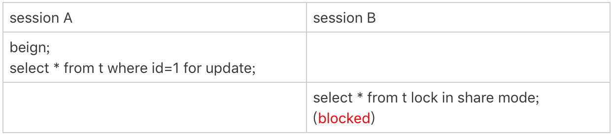
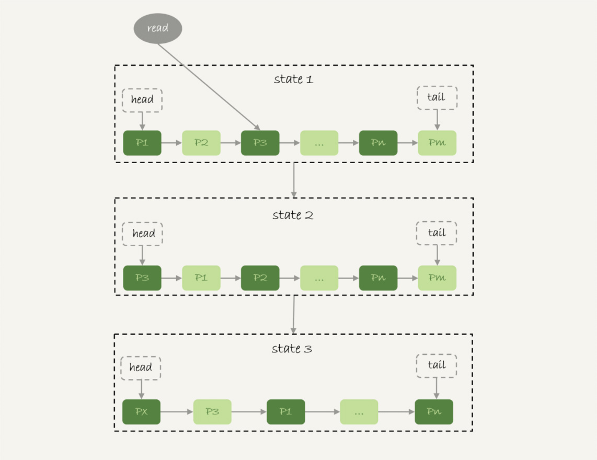
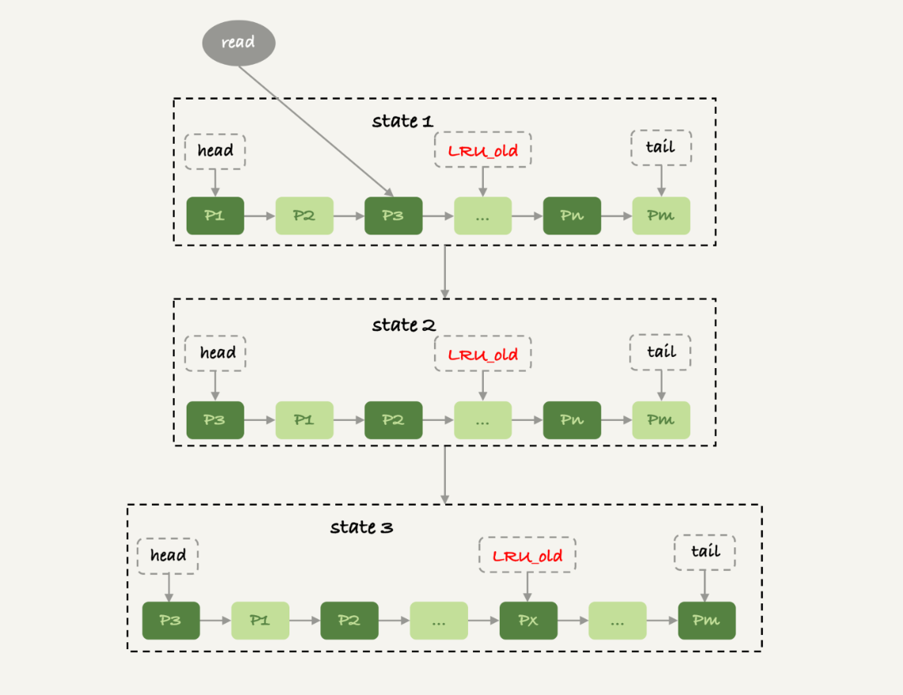

# 33讲我查这么多数据，会不会把数据库内存打爆

问题：我的主机内存只有 100G，现在要对一个 200G 的大表做全表扫描，会不会把数据库主机的内存用光了？

这个问题确实值得担心，被系统 OOM 可不是闹着玩的。但是，反过来想想，逻辑备份的时候，可不就是做整库扫描吗？如果这样就会把内存吃光，逻辑备份不是早就挂了？

所以说，对大表做全表扫描，看来应该是没问题的。但是，这个流程到底是怎么样的呢？

## 一、全表扫描对 server 层的影响

假设，我们现在要对一个 200G 的 InnoDB 表 `db1. t`，执行一个全表扫描。当然，你要把扫描结果保存在客户端，会使用类似这样的命令：

```mysql
mysql -h$host -P$port -u$user -p$pwd -e "select * from db1.t" > $target_file
```

**InnoDB 的数据是保存在主键索引上的，所以全表扫描实际上是直接扫描表 t 的主键索引**。这条查询语句由于没有其他的判断条件，所以查到的每一行都可以直接放到结果集里面，然后返回给客户端。

**实际上，服务端并不需要保存一个完整的结果集。取数据和发数据的流程是这样的**：

- 获取一行，写到 `net_buffer` 中。这块内存的大小是由参数 `net_buffer_length` 定义的，默认是 16k。

- 重复获取行，直到 `net_buffer` 写满，调用网络接口发出去。

- 如果发送成功，就清空 `net_buffer`，然后继续取下一行，并写入 `net_buffer`。

- 如果发送函数返回 `EAGAIN` 或 `WSAEWOULDBLOCK`，就表示本地网络栈（socket send buffer）写满了，进入等待。直到网络栈重新可写，再继续发送。

整个查询结果过程对应的流程图如下所示。


从这个流程中，你可以看到：

- 一个查询在发送过程中，占用的 MySQL 内部的内存最大就是 `net_buffer_length` 这么大，并不会达到 200G；

- `socket send buffer` 也不可能达到 200G（默认定义 `/proc/sys/net/core/wmem_default` ），如果 `socket send buffer` 被写满，就会暂停读数据的流程。

也就是说，**MySQL 是“边读边发的”**。这就意味着，如果客户端接收得慢，会导致 MySQL 服务端由于结果发不出去，这个事务的执行时间变长。

比如下面这个状态，就是我故意让客户端不去读 `socket receive buffer` 中的内容，然后在服务端 `show processlist` 看到的结果，即服务端发送阻塞：


如果你看到 `State` 的值一直处于 `Sending to client`，就表示服务器端的网络栈写满了。

上一篇文章中曾提到，如果客户端使用 `–quick` 参数，会使用 `mysql_use_result` 方法。这个方法是读一行处理一行。你可以想象一下，假设有一个业务的逻辑比较复杂，每读一行数据以后要处理的逻辑如果很慢，就会导致客户端要过很久才会去取下一行数据，可能就会出现如图 2 所示的这种情况。

因此，**对于正常的线上业务来说，如果一个查询的返回结果不会很多的话，我都建议你使用 `mysql_store_result` 这个接口，直接把查询结果保存到本地内存。**

当然前提是查询返回结果不多。在[第30篇文章](https://time.geekbang.org/column/article/78427)评论区，有同学说到自己因为执行了一个大查询导致客户端占用内存近 20G，这种情况下就需要改用 `mysql_use_result` 接口了。

另一方面，如果你在自己负责维护的 MySQL 里看到很多个线程都处于 `Sending to client` 这个状态，就意味着你要让业务开发同学优化查询结果，并评估这么多的返回结果是否合理。

而如果要快速减少处于这个状态的线程的话，将 `net_buffer_length`参数设置为一个更大的值是一个可选方案。

与 `Sending to client` 长相很类似的一个状态是 `Sending data`，这是一个经常被误会的问题。有同学问我说，在自己维护的实例上看到很多查询语句的状态是 `Sending data`，但查看网络也没什么问题啊，为什么 Sending data 要这么久？

实际上，一个查询语句的状态变化是这样的（注意：这里，我略去了其他无关的状态）：

- MySQL 查询语句进入执行阶段后，首先把状态设置成“Sending data”；
- 然后，发送执行结果的列相关的信息（meta data) 给客户端；
- 再继续执行语句的流程；
- 执行完成后，把状态设置成空字符串。

也就是说，“Sending data”并不一定是指“正在发送数据”，而可能是处于执行器过程中的任意阶段。比如，你可以构造一个锁等待的场景，就能看到 Sending data 状态。



图 3 读全表被锁


图 4 Sending data 状态

可以看到，session B 明显是在等锁，状态显示为 Sending data。

也就是说，仅当一个线程处于“等待客户端接收结果”的状态，才会显示"Sending to client"；而如果显示成“Sending data”，它的意思只是“正在执行”。

现在你知道了，查询的结果是分段发给客户端的，因此扫描全表，查询返回大量的数据，并不会把内存打爆。

在 server 层的处理逻辑我们都清楚了，在 InnoDB 引擎里面又是怎么处理的呢？ 扫描全表会不会对引擎系统造成影响呢？

## 二、全表扫描对InnoDB的影响

在[第2](https://time.geekbang.org/column/article/68633)和[第15篇](https://time.geekbang.org/column/article/73161)文章中，我介绍 WAL 机制的时候，和你分析了 InnoDB 内存的一个作用，是保存更新的结果，再配合 redo log，就避免了随机写盘。

内存的数据页是在 Buffer Pool (BP)中管理的，在 WAL 里 Buffer Pool 起到了加速更新的作用。而实际上，Buffer Pool 还有一个更重要的作用，就是加速查询。

在第 2 篇文章的评论区有同学问道，由于有 WAL 机制，当事务提交的时候，磁盘上的数据页是旧的，那如果这时候马上有一个查询要来读这个数据页，是不是要马上把 redo log 应用到数据页呢？

答案是不需要。因为这时候内存数据页的结果是最新的，直接读内存页就可以了。你看，这时候查询根本不需要读磁盘，直接从内存拿结果，速度是很快的。所以说，Buffer Pool 还有加速查询的作用。

而 Buffer Pool 对查询的加速效果，依赖于一个重要的指标，即：**内存命中率**。

你可以在 `show engine innodb status` 结果中，查看一个系统当前的 BP 命中率。一般情况下，一个稳定服务的线上系统，要保证响应时间符合要求的话，内存命中率要在 99% 以上。

执行 `show engine innodb status`，可以看到“Buffer pool hit rate”字样，显示的就是当前的命中率。比如图 5 这个命中率，就是 99.0%。

```mysql
Buffer pool hit rate 990 / 1000
```

图 5 show engine innodb status 显示内存命中率

如果所有查询需要的数据页都能够直接从内存得到，那是最好的，对应的命中率就是 100%。但，这在实际生产上是很难做到的。

InnoDB Buffer Pool 的大小是由参数 `innodb_buffer_pool_size` 确定的，一般建议设置成可用物理内存的 60%~80%。

在大约十年前，单机的数据量是上百个 G，而物理内存是几个 G；现在虽然很多服务器都能有 128G 甚至更高的内存，但是单机的数据量却达到了 T 级别。

所以，`innodb_buffer_pool_size` 小于磁盘的数据量是很常见的。如果一个 Buffer Pool 满了，而又要从磁盘读入一个数据页，那肯定是要淘汰一个旧数据页的。

InnoDB 内存管理用的是最近最少使用 (Least Recently Used, LRU)算法，这个算法的核心就是淘汰最久未使用的数据。

下图是一个 LRU 算法的基本模型。



图 6 基本 LRU 算法

InnoDB 管理 Buffer Pool 的 LRU 算法，是用链表来实现的。

1. 在图 6 的状态 1 里，链表头部是 P1，表示 P1 是最近刚刚被访问过的数据页；假设内存里只能放下这么多数据页；
2. 这时候有一个读请求访问 P3，因此变成状态 2，P3 被移到最前面；
3. 状态 3 表示，这次访问的数据页是不存在于链表中的，所以需要在 Buffer Pool 中新申请一个数据页 Px，加到链表头部。但是由于内存已经满了，不能申请新的内存。于是，会清空链表末尾 Pm 这个数据页的内存，存入 Px 的内容，然后放到链表头部。
4. 从效果上看，就是最久没有被访问的数据页 Pm，被淘汰了。

这个算法乍一看上去没什么问题，但是如果考虑到要做一个全表扫描，会不会有问题呢？

假设按照这个算法，我们要扫描一个 200G 的表，而这个表是一个历史数据表，平时没有业务访问它。

那么，按照这个算法扫描的话，就会把当前的 Buffer Pool 里的数据全部淘汰掉，存入扫描过程中访问到的数据页的内容。也就是说 Buffer Pool 里面主要放的是这个历史数据表的数据。

对于一个正在做业务服务的库，这可不妙。你会看到，Buffer Pool 的内存命中率急剧下降，磁盘压力增加，SQL 语句响应变慢。

所以，InnoDB 不能直接使用这个 LRU 算法。实际上，InnoDB 对 LRU 算法做了改进。



图 7 改进的 LRU 算法

在 InnoDB 实现上，按照 5:3 的比例把整个 LRU 链表分成了 young 区域和 old 区域。图中 LRU_old 指向的就是 old 区域的第一个位置，是整个链表的 5/8 处。也就是说，靠近链表头部的 5/8 是 young 区域，靠近链表尾部的 3/8 是 old 区域。

改进后的 LRU 算法执行流程变成了下面这样。

1. 图 7 中状态 1，要访问数据页 P3，由于 P3 在 young 区域，因此和优化前的 LRU 算法一样，将其移到链表头部，变成状态 2。
2. 之后要访问一个新的不存在于当前链表的数据页，这时候依然是淘汰掉数据页 Pm，但是新插入的数据页 Px，是放在 LRU_old 处。
3. 处于 old 区域的数据页，每次被访问的时候都要做下面这个判断：
    - 若这个数据页在 LRU 链表中存在的时间超过了 1 秒，就把它移动到链表头部；
    - 如果这个数据页在 LRU 链表中存在的时间短于 1 秒，位置保持不变。1 秒这个时间，是由参数 innodb_old_blocks_time 控制的。其默认值是 1000，单位毫秒。

这个策略，就是为了处理类似全表扫描的操作量身定制的。还是以刚刚的扫描 200G 的历史数据表为例，我们看看改进后的 LRU 算法的操作逻辑：

1. 扫描过程中，需要新插入的数据页，都被放到 old 区域;
2. 一个数据页里面有多条记录，这个数据页会被多次访问到，但由于是顺序扫描，这个数据页第一次被访问和最后一次被访问的时间间隔不会超过 1 秒，因此还是会被保留在 old 区域；
3. 再继续扫描后续的数据，之前的这个数据页之后也不会再被访问到，于是始终没有机会移到链表头部（也就是 young 区域），很快就会被淘汰出去。

可以看到，这个策略最大的收益，就是在扫描这个大表的过程中，虽然也用到了 Buffer Pool，但是对 young 区域完全没有影响，从而保证了 Buffer Pool 响应正常业务的查询命中率。

# 小结

今天，我用“大查询会不会把内存用光”这个问题，和你介绍了 MySQL 的查询结果，发送给客户端的过程。

由于 MySQL 采用的是边算边发的逻辑，因此对于数据量很大的查询结果来说，不会在 server 端保存完整的结果集。所以，如果客户端读结果不及时，会堵住 MySQL 的查询过程，但是不会把内存打爆。

而对于 InnoDB 引擎内部，由于有淘汰策略，大查询也不会导致内存暴涨。并且，由于 InnoDB 对 LRU 算法做了改进，冷数据的全表扫描，对 Buffer Pool 的影响也能做到可控。

当然，我们前面文章有说过，全表扫描还是比较耗费 IO 资源的，所以业务高峰期还是不能直接在线上主库执行全表扫描的。

最后，我给你留一个思考题吧。

我在文章中说到，如果由于客户端压力太大，迟迟不能接收结果，会导致 MySQL 无法发送结果而影响语句执行。但，这还不是最糟糕的情况。

你可以设想出由于客户端的性能问题，对数据库影响更严重的例子吗？或者你是否经历过这样的场景？你又是怎么优化的？

你可以把你的经验和分析写在留言区，我会在下一篇文章的末尾和你讨论这个问题。感谢你的收听，也欢迎你把这篇文章分享给更多的朋友一起阅读。

# 上期问题时间

上期的问题是，如果一个事务被 kill 之后，持续处于回滚状态，从恢复速度的角度看，你是应该重启等它执行结束，还是应该强行重启整个 MySQL 进程。

因为重启之后该做的回滚动作还是不能少的，所以从恢复速度的角度来说，应该让它自己结束。

当然，如果这个语句可能会占用别的锁，或者由于占用 IO 资源过多，从而影响到了别的语句执行的话，就需要先做主备切换，切到新主库提供服务。

切换之后别的线程都断开了连接，自动停止执行。接下来还是等它自己执行完成。这个操作属于我们在文章中说到的，减少系统压力，加速终止逻辑。

评论区留言点赞板：

> @HuaMax 的回答中提到了对其他线程的影响；
> @夹心面包 @Ryoma @曾剑 同学提到了重启后依然继续做回滚操作的逻辑。

## 精选留言

- 

    700

    老师，您好。根据文章内容，提炼如下信息：
    如果你看到 State 的值一直处于“Sending to client”，就表示服务器端的网络栈写满了。
    如何处理？
    1)使用 mysql_store_result 这个接口，直接把查询结果保存到本地内存。
    2)优化查询结果，并评估这么多的返回结果是否合理。
    3)而如果要快速减少处于这个状态的线程的话，将 net_buffer_length 参数设置为一个更大的值是一个可选方案。
    对于第3)方案不是很懂，“Sending to client” 表示服务器端的网路栈写满了，那不是应该加大 socket send buffer 吗？跟加大 net_buffer_length 有什么关系？net_buffer_length 加再大，但 socket send buffer 很小的话，网络栈不还是处于写满状态？

    2019-01-28 11:31

    作者回复

    好问题 很好的思考

    是这样的，net_buffer_length 的最大值是 1G，这个值比 socket send buffer大（一般是几M）

    比如假设一个业务，他的平均查询结果都是10M （当然这个业务有有问题，最终是要通过业务解决）

    但是如果我把net_buffer_length 改成10M，就不会有“Sending to client” 的情况。虽然网络栈还是慢慢发的，但是那些没发完的都缓存在net_buffer中，对于执行器来说，都是“已经写出去了”。

    2019-01-28 14:11

- 

    Long

    最近没时间看，今天终于补完了几天的课。

    2019-01-28 05:10

- 

    长杰

    遇到过一个场景，用mysqldump对业务db做逻辑备份保存在客户端，客户端是虚拟机，磁盘很快满了，导致server端出现sending to client状态，更糟糕的是业务db更新频繁，导致undo表空间变大，db服务堵塞，服务端磁盘空间不足。

    2019-01-28 23:16

    作者回复

    非常好，正是我要说明的一个场景呢，直接用你的例子放在下篇答疑部分哈

    2019-01-29 17:44

- 

    700

    老师，您好。感谢解答。
    接上个问题。
    Sending to client 是发生在下面哪个阶段的事件呢？
    1)是 “获取一行，写到 net_buffer 中。”
    2)还是“直到 net_buffer 写满，调用网络接口发出去。” //即数据从 net_buffer 发到 socket send buffer？
    3)还是“将 socket send buffer 的数据发送给 socket receive buffer”

    从您的回答“但是如果我把net_buffer_length 改成10M，就不会有“Sending to client” 的情况。”，我感觉应该是属于第1)阶段的事件。但感觉这又与您说的“Sending to client 表示的是服务器端的网络栈写满了”相矛盾。

    2019-01-28 16:35

    作者回复

    写net_buffer -- > net_buffer满了，调用网络接口发 -->发不出去
    这个是同一个调用链条呀

    “哪个阶段”没看懂，是同一个时刻

    2019-01-28 23:41

- 

    Richie

    老师，怎么才能了解什么地方占用内存，查了很多资料都没有这方面的信息，MySQL5.6

    2019-01-30 05:31

- 

    changshan

    老师好，咨询一个于之前文章有关的问题，在rr隔离级别下会产生幻读，然而这个幻读mysql是通过什么机制来解决的呢？有的说是mvcc，有的说是next-key锁。有点疑惑了。另外，怎么能够验证mysql使用具体的哪种技术解决了幻读？

    2019-01-29 16:41

    作者回复

    看一下20和21篇哈

    2019-01-29 17:01

- 

    天使梦泪

    老师好，针对我上次问您的mysql缓存中的数据储存问题，您回答可以一直保存的，具体是怎么实现一直保存的（也不是储存在磁盘上，是使用的内存）？内存重启了之后，缓存不就也丢失了，是怎么做到持久化保存的，老师可以帮忙详细解答下么？

    

    2019-01-29 12:38

    作者回复

    InnoDB 的是buffer pool，是在内存里。

    ”内存重启了之后，缓存不就也丢失了，是怎么做到持久化保存的，老师可以帮忙详细解答下么？“
    没有保存，重启就没有了，要访问的时候需要重新去磁盘读

    2019-01-29 13:48

- 

    Sinyo

    @700 的置顶提问
    老师你说："但是如果把 net_buffer_length 改成 10M，就不会有“Sending to client”的情况。虽然网络栈还是慢慢发的，但是那些没发完的都缓存在net_buffer中，对于执行器来说，都是“已经写出去了”。"

    假如数据量有1G，而如果要快速减少处于这个状态的线程的话，我们把net_buffer_length 从10M改成1G，快速减少的那部分操作是不是只有服务端发送到net_buffer的这部分？这样就不会有“Sending to client”的情况么？

    2019-01-29 12:23

    作者回复

    还是会显示为“Sending to client”，但是语句已经执行完了。
    不会占着资源（比如MDL读锁）

    2019-01-29 13:50

- 

    有铭

    感觉mysql的做法有点流式读取的意思。
    但是，老师，虽然这篇文章讲述了Mysql是如何“边读边发”。但是更复杂的情况没有说明，比如我现在要执行一个复杂的查询，而且查询是排序的，这意味着mysql需要对整个结构排序，然后才能一条条的发出去，如果数据量极大的情况，Mysql如何完成排序过程，需要把数据全部载入内存吗？还是存储在缓存文件里搞分而治之的排序，然后再“边读边发”

    2019-01-29 10:09

    作者回复

    看一下 https://time.geekbang.org/column/article/73479 这篇文章的图5哈
    有说到哦

    2019-01-29 11:18

- 

    Max

    林Sir,你好。
    曾经发生过二个问题
    第一个问题是show columns from table带来的临时表产生和移除
    大量的session opening tmp tables 和removing tmp tables
    也kill不掉会话，首先主从先切，让原主停止对外服务。在kill掉所有用户会话。
    问题解决，同时修改innodb_thread_concurrency参数数量。

    另外一个感觉是mysql bug引起的。
    当时环境是percona-mysql-20-21主从环境
    没有高并发所，所有的用户会话状态都是query end，会话不释放。
    造成会话连接数暴涨。撑满了所有的会话。
    查看engine innodb status，发现latch等待非常高
    OS WAIT ARRAY INFO: signal count 5607657
    RW-shared spins 0, rounds 2702261, OS waits 70377
    RW-excl spins 0, rounds 216191633, OS waits 1802414
    RW-sx spins 1588, rounds 5965, OS waits 70

    Spin rounds per wait: 2702261.00 RW-shared, 216191633.00 RW-excl, 3.76 RW-sx
    MySQL thread id 79467374, OS thread handle 140327525230336, query id 949505008 10.0.2.6 apirwuser query end
    INSERT INTO `xxxxxx` (`xxxx`,`xxxx`,`xxxx`,`xxxx`) VALUES ('c2aab326-adf9-470b-940e-133fa2c7f685','android','862915033153129',1535597836)
    ---TRANSACTION 1154797559, ACTIVE (PREPARED) 1 sec
    mysql tables in use 1, locked 1

    第二个问题一直没有解决，后来把mysql 5.7 降到mysql 5.6

    还有一个关于out of memory问题
    sql如下: a是父表，b是子表
    select a.id,a.name,b.title from a inner join b on a.id=b.aid
    where a.create_time>'2010-08-01 00:00:00' and a.create_time<'2010-08-10 23:59:59'
    它的执行计划应该是
    1 a表和b表生产迪卡集产生虚列集合T。2从集合T筛选出 a.id(主键)=b.aid(外键)产生虚集合V 3最后从集合v筛选出where条件，得到最终结果。
    如果二个表都超过千万条记录，产生的集合数据应该是放到内存中。如果是这样会不会打暴内存

    2019-01-29 09:33

- 

    PHP-SICUN

    老师，您好，有两个问题麻烦解惑一下
    1.扫描200G的表时数据会先放到InnoDB buffer pool,然后发送时在读取到net_buffer吗？
    2.如果是的话，异常情况导致socket send buffer被写满，是不是会出现InnoDB buffer中的某一页有可能出现读取后面的行时，超过1s，而被放到yong区域的情况？
    不知道这样表述或者理解的对吗

    2019-01-29 08:52

    作者回复

    \1. 是 ，但是也不是“全部放到buffer pool以后”才发，读的时候是一个page 一个page 地读的
    \2. 会，好在这个是“某一页”而已，量不大。 好问题

    很好的思考

    2019-01-29 11:11

- 

    Ryoma

    有两个问题：
    0：MySQL 中的新生代和老生代的名字这么反人类的么
    1：我在使用show engine innodb status看Buffer Pool时，发现Buffer Pool有8个（0~8），请问老师这个是什么策略呢？

    2019-01-28 21:35

    作者回复

    0

    \1. 搜一下 innodb_buffer_pool_instances 这个参数的解释哈

    2019-01-28 23:39

- 

    老杨同志

    老师提示考虑两个客户端都进行update的情况。
    如果第一个客户端执行select * from t for update 而迟迟不读取返回的数据，会造成server端长期占用记录的行锁，如果其他线程要更新被锁定的记录，会报锁等待超时的错误

    

    2019-01-28 21:34

    作者回复

    

    2019-01-28 23:38

- 

    天使梦泪

    老师，我有个问题不明白，mysql从缓存中取数据，缓存里的数据是怎么实现可以保存一段时间的？

    2019-01-28 18:17

    作者回复

    “保存一段时间”是啥意思，LRU算法不是按照时间的哈，如果没人来淘汰，是可以一直保存的。

    2019-01-28 19:09

- 

    如明如月

    之前有特殊功能需要从主要业务库拉取指定范围的数据到另外同一个库的其他数据表的动作（insert into xxxxx select xxx from xxx 这种操作）数据量在万级或者十万级，对于这种操作，和本文讲的应该有些不同吧？能否帮分析一下这种场景的大致情况呢？或者有什么好的建议吗？

    2019-01-28 15:27

    作者回复

    嗯，这个不会返回结果到客户端，所以网络上不会有问题

    引擎内部的扫描机制是差不多的

    唯一不同是这个过程可能对原表有行锁（如果设置的是RR）

    万或者十万还好，是小数据，可以考虑拿到客户端再写回去，避免锁的问题

    

    2019-01-28 16:11

- 

    garming

    老师你好，如果是MyISAM存储引擎，大查询会导致内存暴涨吗？如果过，是什么原因呢？

    2019-01-28 11:36

    作者回复

    也是不会的，跟InnoDB一样

    2019-01-28 14:05

- 

    Zzz

    林老师，有几个问题想请教以下：
    1、哪种查询语句下MySQL 是“边读边发的”的呢？对于order by这种语句肯定是需要先全部拿到内存再做排序处理最后返回结果。
    2、MySQL是怎么判断出可以“边读边发的”，是不是看下语句是否带order by这种关键字？
    3、我有办法知道该执行语句是否“边读边发的”吗？

    2019-01-28 11:35

    作者回复

    这三个问题其实是同一个

    “边读边发”的意思是，算出来的结果才能发
    像order by，得先排序得到结果，然后才发出去，如果读了数据直接发，那肯定不行，那是错误的结果。

    所以要排序了以后再发，这时候就需要中间数据结构，sort buffer

    2019-01-28 14:07

- 

    AI杜嘉嘉

    收获很大，老师的课程一直很用心。想问下后续会不会单独讲备份恢复章节，比如xtrabackup这种

    2019-01-28 11:32

    作者回复

    不会专门讲一个工具哈，
    可以说下你碰到的问题，然后我在答疑文章中展开，这样比较好哦

    2019-01-28 14:07

- 

    lochen

    才一百多万条数据 为啥查个总数花了30来秒哦 算正常吗 select count(id) from table;

    2019-01-28 11:13

    作者回复

    不正常
    执行过程中show processlist和show engine innodb status 看看在干啥

    2019-01-28 14:05

- 

    Zzz

    改进后的 LRU 算法的思路有点像JVM GC里面分代回收的思想，把数据分成新生代和老年代，一个用于存储短时间内就会被清理的对象，一个用于存储存活时间长的对象。不过有趣的是对于两种区域的叫法，刚好相反：JVM里面把短时间内被清除的区域叫做”young“，InnoDB里面却是叫做”old"。

    2019-01-28 11:06

    作者回复

    

    被你一说我赶紧再去翻了下代码，嗯嗯，InnoDB确实是最近访问的叫做young

    2019-01-28 16:14