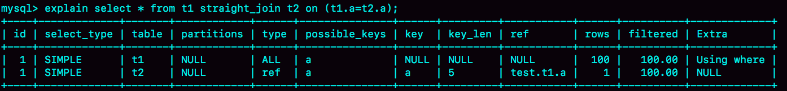
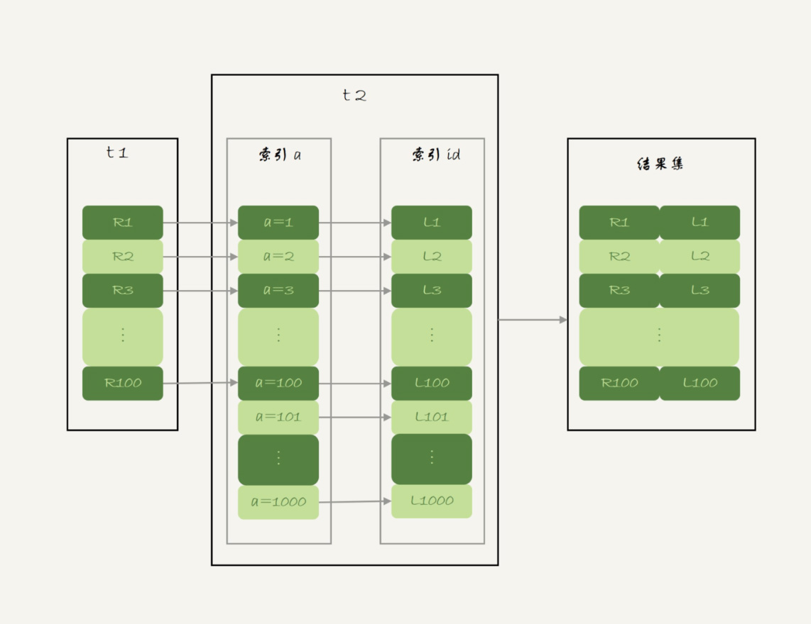

# 34讲到底可不可以使用join

在实际生产中，关于join语句使用的问题，一般会集中在以下两类：

1. 我们DBA不让使用join，使用join有什么问题呢？
2. 如果有两个大小不同的表做join，应该用哪个表做驱动表呢？

今天这篇文章，我就先跟你说说join语句到底是怎么执行的，然后再来回答这两个问题。

为了便于量化分析，我还是创建两个表t1和t2来和你说明。

```
CREATE TABLE `t2` (
  `id` int(11) NOT NULL,
  `a` int(11) DEFAULT NULL,
  `b` int(11) DEFAULT NULL,
  PRIMARY KEY (`id`),
  KEY `a` (`a`)
) ENGINE=InnoDB;

drop procedure idata;
delimiter ;;
create procedure idata()
begin
  declare i int;
  set i=1;
  while(i<=1000)do
    insert into t2 values(i, i, i);
    set i=i+1;
  end while;
end;;
delimiter ;
call idata();

create table t1 like t2;
insert into t1 (select * from t2 where id<=100)
```

可以看到，这两个表都有一个主键索引id和一个索引a，字段b上无索引。存储过程idata()往表t2里插入了1000行数据，在表t1里插入的是100行数据。

# Index Nested-Loop Join

我们来看一下这个语句：

```
select * from t1 straight_join t2 on (t1.a=t2.a);
```

如果直接使用join语句，MySQL优化器可能会选择表t1或t2作为驱动表，这样会影响我们分析SQL语句的执行过程。所以，为了便于分析执行过程中的性能问题，我改用straight_join让MySQL使用固定的连接方式执行查询，这样优化器只会按照我们指定的方式去join。在这个语句里，t1 是驱动表，t2是被驱动表。

现在，我们来看一下这条语句的explain结果。



图1 使用索引字段join的 explain结果

可以看到，在这条语句里，被驱动表t2的字段a上有索引，join过程用上了这个索引，因此这个语句的执行流程是这样的：

1. 从表t1中读入一行数据 R；
2. 从数据行R中，取出a字段到表t2里去查找；
3. 取出表t2中满足条件的行，跟R组成一行，作为结果集的一部分；
4. 重复执行步骤1到3，直到表t1的末尾循环结束。

这个过程是先遍历表t1，然后根据从表t1中取出的每行数据中的a值，去表t2中查找满足条件的记录。在形式上，这个过程就跟我们写程序时的嵌套查询类似，并且可以用上被驱动表的索引，所以我们称之为“Index Nested-Loop Join”，简称NLJ。

它对应的流程图如下所示：



图2 Index Nested-Loop Join算法的执行流程

在这个流程里：

1. 对驱动表t1做了全表扫描，这个过程需要扫描100行；
2. 而对于每一行R，根据a字段去表t2查找，走的是树搜索过程。由于我们构造的数据都是一一对应的，因此每次的搜索过程都只扫描一行，也是总共扫描100行；
3. 所以，整个执行流程，总扫描行数是200。

现在我们知道了这个过程，再试着回答一下文章开头的两个问题。

先看第一个问题：**能不能使用join?**

假设不使用join，那我们就只能用单表查询。我们看看上面这条语句的需求，用单表查询怎么实现。

1. 执行`select * from t1`，查出表t1的所有数据，这里有100行；
2. 循环遍历这100行数据：
    - 从每一行R取出字段a的值$R.a；
    - 执行`select * from t2 where a=$R.a`；
    - 把返回的结果和R构成结果集的一行。

可以看到，在这个查询过程，也是扫描了200行，但是总共执行了101条语句，比直接join多了100次交互。除此之外，客户端还要自己拼接SQL语句和结果。

显然，这么做还不如直接join好。

我们再来看看第二个问题：**怎么选择驱动表？**

在这个join语句执行过程中，驱动表是走全表扫描，而被驱动表是走树搜索。

假设被驱动表的行数是M。每次在被驱动表查一行数据，要先搜索索引a，再搜索主键索引。每次搜索一棵树近似复杂度是以2为底的M的对数，记为log2M，所以在被驱动表上查一行的时间复杂度是 2*log2M。

假设驱动表的行数是N，执行过程就要扫描驱动表N行，然后对于每一行，到被驱动表上匹配一次。

因此整个执行过程，近似复杂度是 N + N*2*log2M。

显然，N对扫描行数的影响更大，因此应该让小表来做驱动表。

> 如果你没觉得这个影响有那么“显然”， 可以这么理解：N扩大1000倍的话，扫描行数就会扩大1000倍；而M扩大1000倍，扫描行数扩大不到10倍。

到这里小结一下，通过上面的分析我们得到了两个结论：

1. 使用join语句，性能比强行拆成多个单表执行SQL语句的性能要好；
2. 如果使用join语句的话，需要让小表做驱动表。

但是，你需要注意，这个结论的前提是“可以使用被驱动表的索引”。

接下来，我们再看看被驱动表用不上索引的情况。

# Simple Nested-Loop Join

现在，我们把SQL语句改成这样：

```
select * from t1 straight_join t2 on (t1.a=t2.b);
```

由于表t2的字段b上没有索引，因此再用图2的执行流程时，每次到t2去匹配的时候，就要做一次全表扫描。

你可以先设想一下这个问题，继续使用图2的算法，是不是可以得到正确的结果呢？如果只看结果的话，这个算法是正确的，而且这个算法也有一个名字，叫做“Simple Nested-Loop Join”。

但是，这样算来，这个SQL请求就要扫描表t2多达100次，总共扫描100*1000=10万行。

这还只是两个小表，如果t1和t2都是10万行的表（当然了，这也还是属于小表的范围），就要扫描100亿行，这个算法看上去太“笨重”了。

当然，MySQL也没有使用这个Simple Nested-Loop Join算法，而是使用了另一个叫作“Block Nested-Loop Join”的算法，简称BNL。

# Block Nested-Loop Join

这时候，被驱动表上没有可用的索引，算法的流程是这样的：

1. 把表t1的数据读入线程内存join_buffer中，由于我们这个语句中写的是select *，因此是把整个表t1放入了内存；
2. 扫描表t2，把表t2中的每一行取出来，跟join_buffer中的数据做对比，满足join条件的，作为结果集的一部分返回。

这个过程的流程图如下：


图3 Block Nested-Loop Join 算法的执行流程

对应地，这条SQL语句的explain结果如下所示：


图4 不使用索引字段join的 explain结果

可以看到，在这个过程中，对表t1和t2都做了一次全表扫描，因此总的扫描行数是1100。由于join_buffer是以无序数组的方式组织的，因此对表t2中的每一行，都要做100次判断，总共需要在内存中做的判断次数是：100*1000=10万次。

前面我们说过，如果使用Simple Nested-Loop Join算法进行查询，扫描行数也是10万行。因此，从时间复杂度上来说，这两个算法是一样的。但是，Block Nested-Loop Join算法的这10万次判断是内存操作，速度上会快很多，性能也更好。

接下来，我们来看一下，在这种情况下，应该选择哪个表做驱动表。

假设小表的行数是N，大表的行数是M，那么在这个算法里：

1. 两个表都做一次全表扫描，所以总的扫描行数是M+N；
2. 内存中的判断次数是M*N。

可以看到，调换这两个算式中的M和N没差别，因此这时候选择大表还是小表做驱动表，执行耗时是一样的。

然后，你可能马上就会问了，这个例子里表t1才100行，要是表t1是一个大表，join_buffer放不下怎么办呢？

join_buffer的大小是由参数join_buffer_size设定的，默认值是256k。**如果放不下表t1的所有数据话，策略很简单，就是分段放。**我把join_buffer_size改成1200，再执行：

```
select * from t1 straight_join t2 on (t1.a=t2.b);
```

执行过程就变成了：

1. 扫描表t1，顺序读取数据行放入join_buffer中，放完第88行join_buffer满了，继续第2步；
2. 扫描表t2，把t2中的每一行取出来，跟join_buffer中的数据做对比，满足join条件的，作为结果集的一部分返回；
3. 清空join_buffer；
4. 继续扫描表t1，顺序读取最后的12行数据放入join_buffer中，继续执行第2步。

执行流程图也就变成这样：


图5 Block Nested-Loop Join -- 两段

图中的步骤4和5，表示清空join_buffer再复用。

这个流程才体现出了这个算法名字中“Block”的由来，表示“分块去join”。

可以看到，这时候由于表t1被分成了两次放入join_buffer中，导致表t2会被扫描两次。虽然分成两次放入join_buffer，但是判断等值条件的次数还是不变的，依然是(88+12)*1000=10万次。

我们再来看下，在这种情况下驱动表的选择问题。

假设，驱动表的数据行数是N，需要分K段才能完成算法流程，被驱动表的数据行数是M。

注意，这里的K不是常数，N越大K就会越大，因此把K表示为λ*N，显然λ的取值范围是(0,1)。

所以，在这个算法的执行过程中：

1. 扫描行数是 N+λ*N*M；
2. 内存判断 N*M次。

显然，内存判断次数是不受选择哪个表作为驱动表影响的。而考虑到扫描行数，在M和N大小确定的情况下，N小一些，整个算式的结果会更小。

所以结论是，应该让小表当驱动表。

当然，你会发现，在N+λ*N*M这个式子里，λ才是影响扫描行数的关键因素，这个值越小越好。

刚刚我们说了N越大，分段数K越大。那么，N固定的时候，什么参数会影响K的大小呢？（也就是λ的大小）答案是join_buffer_size。join_buffer_size越大，一次可以放入的行越多，分成的段数也就越少，对被驱动表的全表扫描次数就越少。

这就是为什么，你可能会看到一些建议告诉你，如果你的join语句很慢，就把join_buffer_size改大。

理解了MySQL执行join的两种算法，现在我们再来试着**回答文章开头的两个问题**。

第一个问题：能不能使用join语句？

1. 如果可以使用Index Nested-Loop Join算法，也就是说可以用上被驱动表上的索引，其实是没问题的；
2. 如果使用Block Nested-Loop Join算法，扫描行数就会过多。尤其是在大表上的join操作，这样可能要扫描被驱动表很多次，会占用大量的系统资源。所以这种join尽量不要用。

所以你在判断要不要使用join语句时，就是看explain结果里面，Extra字段里面有没有出现“Block Nested Loop”字样。

第二个问题是：如果要使用join，应该选择大表做驱动表还是选择小表做驱动表？

1. 如果是Index Nested-Loop Join算法，应该选择小表做驱动表；
2. 如果是Block Nested-Loop Join算法：
    - 在join_buffer_size足够大的时候，是一样的；
    - 在join_buffer_size不够大的时候（这种情况更常见），应该选择小表做驱动表。

所以，这个问题的结论就是，总是应该使用小表做驱动表。

当然了，这里我需要说明下，**什么叫作“小表”**。

我们前面的例子是没有加条件的。如果我在语句的where条件加上 t2.id<=50这个限定条件，再来看下这两条语句：

```
select * from t1 straight_join t2 on (t1.b=t2.b) where t2.id<=50;
select * from t2 straight_join t1 on (t1.b=t2.b) where t2.id<=50;
```

注意，为了让两条语句的被驱动表都用不上索引，所以join字段都使用了没有索引的字段b。

但如果是用第二个语句的话，join_buffer只需要放入t2的前50行，显然是更好的。所以这里，“t2的前50行”是那个相对小的表，也就是“小表”。

我们再来看另外一组例子：

```
select t1.b,t2.* from  t1  straight_join t2 on (t1.b=t2.b) where t2.id<=100;
select t1.b,t2.* from  t2  straight_join t1 on (t1.b=t2.b) where t2.id<=100;
```

这个例子里，表t1 和 t2都是只有100行参加join。但是，这两条语句每次查询放入join_buffer中的数据是不一样的：

- 表t1只查字段b，因此如果把t1放到join_buffer中，则join_buffer中只需要放入b的值；
- 表t2需要查所有的字段，因此如果把表t2放到join_buffer中的话，就需要放入三个字段id、a和b。

这里，我们应该选择表t1作为驱动表。也就是说在这个例子里，“只需要一列参与join的表t1”是那个相对小的表。

所以，更准确地说，**在决定哪个表做驱动表的时候，应该是两个表按照各自的条件过滤，过滤完成之后，计算参与join的各个字段的总数据量，数据量小的那个表，就是“小表”，应该作为驱动表。**

# 小结

今天，我和你介绍了MySQL执行join语句的两种可能算法，这两种算法是由能否使用被驱动表的索引决定的。而能否用上被驱动表的索引，对join语句的性能影响很大。

通过对Index Nested-Loop Join和Block Nested-Loop Join两个算法执行过程的分析，我们也得到了文章开头两个问题的答案：

1. 如果可以使用被驱动表的索引，join语句还是有其优势的；
2. 不能使用被驱动表的索引，只能使用Block Nested-Loop Join算法，这样的语句就尽量不要使用；
3. 在使用join的时候，应该让小表做驱动表。

最后，又到了今天的问题时间。

我们在上文说到，使用Block Nested-Loop Join算法，可能会因为join_buffer不够大，需要对被驱动表做多次全表扫描。

我的问题是，如果被驱动表是一个大表，并且是一个冷数据表，除了查询过程中可能会导致IO压力大以外，你觉得对这个MySQL服务还有什么更严重的影响吗？（这个问题需要结合上一篇文章的知识点）

你可以把你的结论和分析写在留言区，我会在下一篇文章的末尾和你讨论这个问题。感谢你的收听，也欢迎你把这篇文章分享给更多的朋友一起阅读。

# 上期问题时间

我在上一篇文章最后留下的问题是，如果客户端由于压力过大，迟迟不能接收数据，会对服务端造成什么严重的影响。

这个问题的核心是，造成了“长事务”。

至于长事务的影响，就要结合我们前面文章中提到的锁、MVCC的知识点了。

- 如果前面的语句有更新，意味着它们在占用着行锁，会导致别的语句更新被锁住；
- 当然读的事务也有问题，就是会导致undo log不能被回收，导致回滚段空间膨胀。

评论区留言点赞板：

> @老杨同志 提到了更新之间会互相等锁的问题。同一个事务，更新之后要尽快提交，不要做没必要的查询，尤其是不要执行需要返回大量数据的查询；
> @长杰 同学提到了undo表空间变大，db服务堵塞，服务端磁盘空间不足的例子。

## 精选留言

- 

    抽离の

    早上听老师一节课感觉获益匪浅

    2019-01-30 08:21

- 

    萤火虫

    年底了有一种想跳槽的冲动 身在武汉的我想出去看看 可一想到自身的能力和学历 又不敢去了 苦恼...

    2019-01-30 08:50

- 

    liao xueqiang

    最后一个例子，关于驱动表的选择，怎么知道是选了t1表还是t2表?会不会像oracle一样，优化器自动选择结果集少的行源作为驱动表？

    2019-01-30 08:46