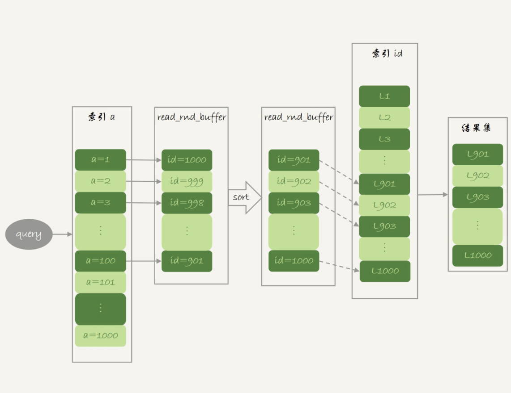
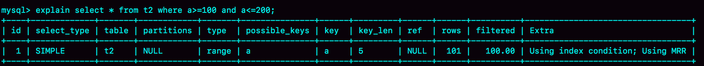

# 35讲join语句怎么优化

在上一篇文章中，我和你介绍了join语句的两种算法，分别是Index Nested-Loop Join(NLJ)和Block Nested-Loop Join(BNL)。

我们发现在使用NLJ算法的时候，其实效果还是不错的，比通过应用层拆分成多个语句然后再拼接查询结果更方便，而且性能也不会差。

但是，BNL算法在大表join的时候性能就差多了，比较次数等于两个表参与join的行数的乘积，很消耗CPU资源。

当然了，这两个算法都还有继续优化的空间，我们今天就来聊聊这个话题。

为了便于分析，我还是创建两个表t1、t2来和你展开今天的问题。

```
create table t1(id int primary key, a int, b int, index(a));
create table t2 like t1;
drop procedure idata;
delimiter ;;
create procedure idata()
begin
  declare i int;
  set i=1;
  while(i<=1000)do
    insert into t1 values(i, 1001-i, i);
    set i=i+1;
  end while;
  
  set i=1;
  while(i<=1000000)do
    insert into t2 values(i, i, i);
    set i=i+1;
  end while;

end;;
delimiter ;
call idata();
```

为了便于后面量化说明，我在表t1里，插入了1000行数据，每一行的a=1001-id的值。也就是说，表t1中字段a是逆序的。同时，我在表t2中插入了100万行数据。

# Multi-Range Read优化

在介绍join语句的优化方案之前，我需要先和你介绍一个知识点，即：Multi-Range Read优化(MRR)。这个优化的主要目的是尽量使用顺序读盘。

在[第4篇文章](https://time.geekbang.org/column/article/69236)中，我和你介绍InnoDB的索引结构时，提到了“回表”的概念。我们先来回顾一下这个概念。回表是指，InnoDB在普通索引a上查到主键id的值后，再根据一个个主键id的值到主键索引上去查整行数据的过程。

然后，有同学在留言区问到，回表过程是一行行地查数据，还是批量地查数据？

我们先来看看这个问题。假设，我执行这个语句：

```
select * from t1 where a>=1 and a<=100;
```

主键索引是一棵B+树，在这棵树上，每次只能根据一个主键id查到一行数据。因此，回表肯定是一行行搜索主键索引的，基本流程如图1所示。


图1 基本回表流程

如果随着a的值递增顺序查询的话，id的值就变成随机的，那么就会出现随机访问，性能相对较差。虽然“按行查”这个机制不能改，但是调整查询的顺序，还是能够加速的。

**因为大多数的数据都是按照主键递增顺序插入得到的，所以我们可以认为，如果按照主键的递增顺序查询的话，对磁盘的读比较接近顺序读，能够提升读性能。**

这，就是MRR优化的设计思路。此时，语句的执行流程变成了这样：

1. 根据索引a，定位到满足条件的记录，将id值放入read_rnd_buffer中;
2. 将read_rnd_buffer中的id进行递增排序；
3. 排序后的id数组，依次到主键id索引中查记录，并作为结果返回。

这里，read_rnd_buffer的大小是由read_rnd_buffer_size参数控制的。如果步骤1中，read_rnd_buffer放满了，就会先执行完步骤2和3，然后清空read_rnd_buffer。之后继续找索引a的下个记录，并继续循环。

另外需要说明的是，如果你想要稳定地使用MRR优化的话，需要设置`set optimizer_switch="mrr_cost_based=off"`。（官方文档的说法，是现在的优化器策略，判断消耗的时候，会更倾向于不使用MRR，把mrr_cost_based设置为off，就是固定使用MRR了。）

下面两幅图就是使用了MRR优化后的执行流程和explain结果。



图2 MRR执行流程



图3 MRR执行流程的explain结果

从图3的explain结果中，我们可以看到Extra字段多了Using MRR，表示的是用上了MRR优化。而且，由于我们在read_rnd_buffer中按照id做了排序，所以最后得到的结果集也是按照主键id递增顺序的，也就是与图1结果集中行的顺序相反。

到这里，我们小结一下。

**MRR能够提升性能的核心**在于，这条查询语句在索引a上做的是一个范围查询（也就是说，这是一个多值查询），可以得到足够多的主键id。这样通过排序以后，再去主键索引查数据，才能体现出“顺序性”的优势。

# Batched Key Access

理解了MRR性能提升的原理，我们就能理解MySQL在5.6版本后开始引入的Batched Key Acess(BKA)算法了。这个BKA算法，其实就是对NLJ算法的优化。

我们再来看看上一篇文章中用到的NLJ算法的流程图：


图4 Index Nested-Loop Join流程图

NLJ算法执行的逻辑是：从驱动表t1，一行行地取出a的值，再到被驱动表t2去做join。也就是说，对于表t2来说，每次都是匹配一个值。这时，MRR的优势就用不上了。

那怎么才能一次性地多传些值给表t2呢？方法就是，从表t1里一次性地多拿些行出来，一起传给表t2。

既然如此，我们就把表t1的数据取出来一部分，先放到一个临时内存。这个临时内存不是别人，就是join_buffer。

通过上一篇文章，我们知道join_buffer 在BNL算法里的作用，是暂存驱动表的数据。但是在NLJ算法里并没有用。那么，我们刚好就可以复用join_buffer到BKA算法中。

如图5所示，是上面的NLJ算法优化后的BKA算法的流程。


图5 Batched Key Acess流程

图中，我在join_buffer中放入的数据是P1~P100，表示的是只会取查询需要的字段。当然，如果join buffer放不下P1~P100的所有数据，就会把这100行数据分成多段执行上图的流程。

那么，这个BKA算法到底要怎么启用呢？

如果要使用BKA优化算法的话，你需要在执行SQL语句之前，先设置

```
set optimizer_switch='mrr=on,mrr_cost_based=off,batched_key_access=on';
```

其中，前两个参数的作用是要启用MRR。这么做的原因是，BKA算法的优化要依赖于MRR。

# BNL算法的性能问题

说完了NLJ算法的优化，我们再来看BNL算法的优化。

我在上一篇文章末尾，给你留下的思考题是，使用Block Nested-Loop Join(BNL)算法时，可能会对被驱动表做多次扫描。如果这个被驱动表是一个大的冷数据表，除了会导致IO压力大以外，还会对系统有什么影响呢？

在[第33篇文章](https://time.geekbang.org/column/article/79407)中，我们说到InnoDB的LRU算法的时候提到，由于InnoDB对Bufffer Pool的LRU算法做了优化，即：第一次从磁盘读入内存的数据页，会先放在old区域。如果1秒之后这个数据页不再被访问了，就不会被移动到LRU链表头部，这样对Buffer Pool的命中率影响就不大。

但是，如果一个使用BNL算法的join语句，多次扫描一个冷表，而且这个语句执行时间超过1秒，就会在再次扫描冷表的时候，把冷表的数据页移到LRU链表头部。

这种情况对应的，是冷表的数据量小于整个Buffer Pool的3/8，能够完全放入old区域的情况。

如果这个冷表很大，就会出现另外一种情况：业务正常访问的数据页，没有机会进入young区域。

由于优化机制的存在，一个正常访问的数据页，要进入young区域，需要隔1秒后再次被访问到。但是，由于我们的join语句在循环读磁盘和淘汰内存页，进入old区域的数据页，很可能在1秒之内就被淘汰了。这样，就会导致这个MySQL实例的Buffer Pool在这段时间内，young区域的数据页没有被合理地淘汰。

也就是说，这两种情况都会影响Buffer Pool的正常运作。

**大表join操作虽然对IO有影响，但是在语句执行结束后，对IO的影响也就结束了。但是，对Buffer Pool的影响就是持续性的，需要依靠后续的查询请求慢慢恢复内存命中率。**

为了减少这种影响，你可以考虑增大join_buffer_size的值，减少对被驱动表的扫描次数。

也就是说，BNL算法对系统的影响主要包括三个方面：

1. 可能会多次扫描被驱动表，占用磁盘IO资源；
2. 判断join条件需要执行M*N次对比（M、N分别是两张表的行数），如果是大表就会占用非常多的CPU资源；
3. 可能会导致Buffer Pool的热数据被淘汰，影响内存命中率。

我们执行语句之前，需要通过理论分析和查看explain结果的方式，确认是否要使用BNL算法。如果确认优化器会使用BNL算法，就需要做优化。优化的常见做法是，给被驱动表的join字段加上索引，把BNL算法转成BKA算法。

接下来，我们就具体看看，这个优化怎么做？

# BNL转BKA

一些情况下，我们可以直接在被驱动表上建索引，这时就可以直接转成BKA算法了。

但是，有时候你确实会碰到一些不适合在被驱动表上建索引的情况。比如下面这个语句：

```
select * from t1 join t2 on (t1.b=t2.b) where t2.b>=1 and t2.b<=2000;
```

我们在文章开始的时候，在表t2中插入了100万行数据，但是经过where条件过滤后，需要参与join的只有2000行数据。如果这条语句同时是一个低频的SQL语句，那么再为这个语句在表t2的字段b上创建一个索引就很浪费了。

但是，如果使用BNL算法来join的话，这个语句的执行流程是这样的：

1. 把表t1的所有字段取出来，存入join_buffer中。这个表只有1000行，join_buffer_size默认值是256k，可以完全存入。
2. 扫描表t2，取出每一行数据跟join_buffer中的数据进行对比，
    - 如果不满足t1.b=t2.b，则跳过；
    - 如果满足t1.b=t2.b, 再判断其他条件，也就是是否满足t2.b处于[1,2000]的条件，如果是，就作为结果集的一部分返回，否则跳过。

我在上一篇文章中说过，对于表t2的每一行，判断join是否满足的时候，都需要遍历join_buffer中的所有行。因此判断等值条件的次数是1000*100万=10亿次，这个判断的工作量很大。


图6 explain结果


图7 语句执行时间

可以看到，explain结果里Extra字段显示使用了BNL算法。在我的测试环境里，这条语句需要执行1分11秒。

在表t2的字段b上创建索引会浪费资源，但是不创建索引的话这个语句的等值条件要判断10亿次，想想也是浪费。那么，有没有两全其美的办法呢？

这时候，我们可以考虑使用临时表。使用临时表的大致思路是：

1. 把表t2中满足条件的数据放在临时表tmp_t中；
2. 为了让join使用BKA算法，给临时表tmp_t的字段b加上索引；
3. 让表t1和tmp_t做join操作。

此时，对应的SQL语句的写法如下：

```
create temporary table temp_t(id int primary key, a int, b int, index(b))engine=innodb;
insert into temp_t select * from t2 where b>=1 and b<=2000;
select * from t1 join temp_t on (t1.b=temp_t.b);
```

图8就是这个语句序列的执行效果。


图8 使用临时表的执行效果

可以看到，整个过程3个语句执行时间的总和还不到1秒，相比于前面的1分11秒，性能得到了大幅提升。接下来，我们一起看一下这个过程的消耗：

1. 执行insert语句构造temp_t表并插入数据的过程中，对表t2做了全表扫描，这里扫描行数是100万。
2. 之后的join语句，扫描表t1，这里的扫描行数是1000；join比较过程中，做了1000次带索引的查询。相比于优化前的join语句需要做10亿次条件判断来说，这个优化效果还是很明显的。

总体来看，不论是在原表上加索引，还是用有索引的临时表，我们的思路都是让join语句能够用上被驱动表上的索引，来触发BKA算法，提升查询性能。

# 扩展-hash join

看到这里你可能发现了，其实上面计算10亿次那个操作，看上去有点儿傻。如果join_buffer里面维护的不是一个无序数组，而是一个哈希表的话，那么就不是10亿次判断，而是100万次hash查找。这样的话，整条语句的执行速度就快多了吧？

确实如此。

这，也正是MySQL的优化器和执行器一直被诟病的一个原因：不支持哈希join。并且，MySQL官方的roadmap，也是迟迟没有把这个优化排上议程。

实际上，这个优化思路，我们可以自己实现在业务端。实现流程大致如下：

1. `select * from t1;`取得表t1的全部1000行数据，在业务端存入一个hash结构，比如C++里的set、PHP的dict这样的数据结构。
2. `select * from t2 where b>=1 and b<=2000;` 获取表t2中满足条件的2000行数据。
3. 把这2000行数据，一行一行地取到业务端，到hash结构的数据表中寻找匹配的数据。满足匹配的条件的这行数据，就作为结果集的一行。

理论上，这个过程会比临时表方案的执行速度还要快一些。如果你感兴趣的话，可以自己验证一下。

# 小结

今天，我和你分享了Index Nested-Loop Join（NLJ）和Block Nested-Loop Join（BNL）的优化方法。

在这些优化方法中：

1. BKA优化是MySQL已经内置支持的，建议你默认使用；
2. BNL算法效率低，建议你都尽量转成BKA算法。优化的方向就是给被驱动表的关联字段加上索引；
3. 基于临时表的改进方案，对于能够提前过滤出小数据的join语句来说，效果还是很好的；
4. MySQL目前的版本还不支持hash join，但你可以配合应用端自己模拟出来，理论上效果要好于临时表的方案。

最后，我给你留下一道思考题吧。

我们在讲join语句的这两篇文章中，都只涉及到了两个表的join。那么，现在有一个三个表join的需求，假设这三个表的表结构如下：

```
CREATE TABLE `t1` (
 `id` int(11) NOT NULL,
 `a` int(11) DEFAULT NULL,
 `b` int(11) DEFAULT NULL,
 `c` int(11) DEFAULT NULL,
  PRIMARY KEY (`id`)
) ENGINE=InnoDB;

create table t2 like t1;
create table t3 like t2;
insert into ... //初始化三张表的数据
```

语句的需求实现如下的join逻辑：

```
select * from t1 join t2 on(t1.a=t2.a) join t3 on (t2.b=t3.b) where t1.c>=X and t2.c>=Y and t3.c>=Z;
```

现在为了得到最快的执行速度，如果让你来设计表t1、t2、t3上的索引，来支持这个join语句，你会加哪些索引呢？

同时，如果我希望你用straight_join来重写这个语句，配合你创建的索引，你就需要安排连接顺序，你主要考虑的因素是什么呢？

你可以把你的方案和分析写在留言区，我会在下一篇文章的末尾和你讨论这个问题。感谢你的收听，也欢迎你把这篇文章分享给更多的朋友一起阅读。

# 上期问题时间

我在上篇文章最后留给你的问题，已经在本篇文章中解答了。

这里我再根据评论区留言的情况，简单总结下。根据数据量的大小，有这么两种情况：

- @长杰 和 @老杨同志 提到了数据量小于old区域内存的情况；
- @Zzz 同学，很认真地看了其他同学的评论，并且提了一个很深的问题。对被驱动表数据量大于Buffer Pool的场景，做了很细致的推演和分析。

给这些同学点赞，非常好的思考和讨论。

## 精选留言

- 

    郭健

    老师，有几个问题还需要请教一下:
    1.上一章t1表100条数据，t21000条数据，mysql会每次都会准确的找出哪张表是合理的驱动表吗？还是需要人为的添加straight_join。
    2.像left join这种，左边一定是驱动表吧？以左边为标准查看右边有符合的条件，拼成一条数据，看到你给其他同学的评论说可能不是，这有些疑惑。
    3.在做join的时候，有些条件是可以放在on中也可以放在where中，比如(t1.yn=1 和t2.yn=1)这种简单判断是否删除的。最主要的是，需要根据两个条件才能join的(productCode和custCode),需要两个都在on里，还是一个在on中，一个在where中更好呢？

    2019-02-07 00:05

    作者回复

    \1. 正常是会自己找到合理的，但是用前explain是好习惯哈
    \2. 这个问题的展开我放到答疑文章中哈
    \3. 这也是好问题，需要分析是使用哪种算法，也放到答疑文章展开哈。

    新年快乐~

    2019-02-07 09:32

- 

    Mr.Strive.Z.H.L

    老师你好，今天在回顾这篇文章做总结的时候，突然有一个疑惑：

    我们假设t2的b上面有索引，该语句是左连接

    select * from t1 left join t2 on (t1.b=t2.b) where t2.b>=1 and t2.b<=2000;

    和

    select * from t1 left join t2 on (t1.b=t2.b) and t2.b>=1 and t2.b<=2000;

    到底在内部执行流程上到底有什么区别？？
    因为实际工作中左连接用得挺多的。
    （这篇文章都是直连，所以使用on和where最后的结果都一样，但是左连接就不是了）

    

    2019-02-13 11:21

- 

    Geek_02538c

    过年了，还有新文章，给个赞。 另，where 和 order 与索引的关系，都讲过了，group by 是否也搞个篇章说一下。

    2019-02-02 21:12

    作者回复

    你说得对^_^ 第37篇就是，新年快乐

    2019-02-03 09:14

- 

    Ryoma

    read_rnd_buffer_length 参数应该是 read_rnd_buffer_size，见文档：https://dev.mysql.com/doc/refman/8.0/en/server-system-variables.html#sysvar_read_rnd_buffer_size

    2019-02-02 20:21

    作者回复

    你说得对，多谢

    发起勘误了

    新年快乐

    2019-02-03 09:13

- 

    Mr.Strive.Z.H.L

    老师您好，新年快乐~~

    关于三表join有一个疑惑点需要确认：

    老师您在评论中说到，三表join不会是前两个表join后得到结果集，再和第三张表join。
    针对这句话，我的理解是：
    假设我们不考虑BKA，就按照一行行数据来判断的话，流程应该如下（我会将server端和innodb端分的很清楚）：
    表是t1 ,t2 ,t3。 t1 straight_join t2 straight_join t3，这样的join顺序。
    \1. 调用innodb接口，从t1中取一行数据，数据返回到server端。
    \2. 调用innodb接口，从t2中取满足条件的数据，数据返回到server端。
    \3. 调用innodb接口，从t3中取满足条件的数据，数据返回到server端。
    上面三步之后，驱动表 t1的一条数据就处理完了，接下来重复上述过程。
    （如果采用BKA进行优化，可以理解为不是一行行数据的提取，而是一个范围内数据的提取）。

    按照我上面的描述，确实没有前两表先join得结果集，然后再join第三张表的过程。
    不知道我上面的描述的流程对不对？（我个人觉得，将innodb的处理和server端的处理分隔清晰，对于sql语句的理解，会透彻很多）

    2019-02-02 13:18

    作者回复

    新年快乐，分析得很好。

    可以再补充一句，会更好理解你说的这个过程 ：
    如果采用BKA进行优化,每多一个join，就多一个join_buffer

    2019-02-02 16:59

- 

    LY

    刚刚凌乱了的那个问题，经explain验证，explain SELECT a.* FROM sys_xxtx a JOIN baq_ryxx r ON a.ryid = r.ID WHERE a.dwbh = '7E0A13A14101D0A8E0430A0F23BCD0A8' ORDER BY txsj DESC LIMIT 0,20;
    使用的索引是txsj ；
    explain SELECT a.* FROM sys_xxtx a JOIN baq_ryxx r ON a.ryid = r.ID WHERE a.dwbh = '7E0A13A14101D0A8E0430A0F23BCD0A8' ORDER BY txsj DESC LIMIT 5000,20;使用的索引是dwbh ；
    然后回忆起了第10张：MySQL为什么有时候会选错索引？
    但是从扫描行数、是否使用排序等来看在 LIMIT 5000,20时候也应该优选txsj ?可是这个时候选择的索引是dwbh, 查询时间也大大缩短

    2019-02-01 16:30

    作者回复

    嗯，这个跟我们第十篇那个例子挺像的

    我们把limit 1 改成limit 100的时候，MySQL认为，要扫描到“100行那么多”，
    你这里是limit 5000，200， 这个5000会让优化器认为，选txsj会要扫“很多行，可能很久”

    这个确实是优化器还不够完善的地方，有时候不得不用force index~

    2019-02-02 00:49

- 

    LY

    order by cjsj desc limit 0,20 explain Extra只是显示 Using where ，执行时间 7秒钟
    order by cjsj desc limit 5000,20 explain Extra只是显示 Using index condition; Using where; Using filesort, 执行时间 0.1 秒
    有些许的凌乱了@^^@

    2019-02-01 13:32

    作者回复

    这正常的，一种可能是这样的：
    Using where 就是顺序扫，但是这个上要扫很久才能扫到满足条件的20个记录；
    虽然有filesort，但是如果参与排序的行数少，可能速度就更快，而且limit 有堆排序优化哦

    2019-02-01 16:12

- 

    憶海拾貝

    节后开工宜补课.

    按照文中说明的MRR设计思路, 是否可以反推出: 被驱动表使用非递增主键(比如UUID作为主键),就没有必要开启MRR?

    2019-02-13 11:43

    作者回复

    如果是非随机的主键，确实没必要了

    优化第一步还是应该把主键处理一下

    2019-02-13 16:44

- 

    天王

    BNL算法优化，BNL算法，如果读取的是冷表，而且量比较大，循环读取，第一次数据会进入old区域，如果一秒之后没有访问，不会移到LRU头部，大表join对io影响查询完就结束了，但是buffer pool需要大量的查询把冷数据冲掉。BNL算法有3个问题，1 多次扫描被驱动表，占用磁盘io 2 判断join会耗费大量的cpu资源 3 会热数据淘汰，影响buffer pool的命中率

    2019-02-13 09:19

    作者回复

    

    2019-02-13 17:11

- 

    天王

    join语句的优化，NLJ算法的优化，MRR优化器会在join_buffer进行主键的排序，然后去主键索引树上一个个的查找，因为按照主键顺序去主键索引树上查找，性能会比较高，MRR优化接近顺序读，性能会比较高。BKA算法是对NLJ算法的优化，一次取出一批数据的字段到join_buffer中，然后批量join，性能会比较好。BKA算法依赖于MRR，因为批量join找到被驱动表的非聚集索引字段通过MRR去查找行数据

    2019-02-13 08:54

- 

    WL

    请教老师两个问题:
    \1. 通过主键索引找到的数据会会不会先在内存中查询, 如果没有再去磁盘查询?
    \2. 为什么在通过主键索引查询数据时, 符合条件的数据以单条数据的方式读到内存中而不是以一整个数据页的方式读到内存中?

    2019-02-11 15:00

    作者回复

    \1. 通过普通索引也会，InnoDB的访问模式都是先内存，不在内存中，才到磁盘找；
    \2. 是以数据页的方式读到内存的，然后在从内存的这个数据页（默认16k）里面找到数据。

    2019-02-11 16:30

- 

    郭健

    老师，新年快乐！！看到您给我提问的回答，特别期待您之后的答疑，因为dba怕我们查询数据库时连接时间过长，影响线上实际运行。所以就开发出一个网页，让我们进行查询，但是超过几秒(具体不知道，查询一个200w的数据，条件没有加索引有时候都会)就会返回time out，所以当查询大表并join的时候，就会很吃力！想法设法的缩小单位，一般我们都不会为createTime建一个索引，所以在根据时间缩小范围的时候有时候也并不是很好的选择。我们线上做统计sql的时候，因为数据量比较大，筛选条件也比较多，一个sql可能在0.4s多，这已经是属于慢sql了。感谢老师对我提问的回答！！

    2019-02-09 21:14

    作者回复

    嗯，首先DBA开发这个界面工具还是很有必要的，这样可以控制输入的语句，避免人工查询对库造成太大的影响。

    如果这类查询比较多，并且人工查询的条件很复杂，经常容易用不上索引的话， 在createTime创建索引还是挺有必要的。。

    2019-02-11 16:34

- 

    磊

    一直对多表的join有些迷惑，希望老师后面专门把这块给讲的透彻些

    2019-02-03 10:40

    作者回复

    这一期45篇 join差不多就讲这些了

    有问题在评论区提出来哈

    2019-02-03 12:06

- 

    bluefantasy3

    请教老师一个问题：innodb的Buffer Pool的内存是innodb自己管理还是使用OS的page cache? 我理解应该是innodb自己管理。我在另一个课程里看到如果频繁地把OS的/proc/sys/vm/drop_caches 改成 1会影响MySQL的性能，如果buffer pool是MySQL自己管理，应该不受这个参数影响呀？请解答。

    2019-02-02 17:05

    作者回复

    \1. 是MySQL 自己管理的
    \2. 一般只有数据文件是o_direct的，redo log 和 binlog 都是有用到文件系统的page cache, 因此多少有影响的

    好问题

    2019-02-03 09:05

- 

    信信

    老师好，有两点疑问请老师解惑：
    1、图8上面提到的关于临时表的第三句是不是还是使用straight_join好一些？不然有可能temp_t被选为驱动表？
    2、图8下面提到join过程中做了1000次带索引的查询，这里的1000也是在打开mrr的情况下的吗？是进行了1000次树搜索，还是找到第一个后，依次挨着读呢？

    

    2019-02-02 15:12

    作者回复

    \1. 写straight_join能确定顺序，也可以的，这里写join 也ok的

    \2. 是进行了1000次树搜索

    2019-02-02 16:57

- 

    HuaMax

    前提假设：t1.c>=X可以让t1成为小表。同时打开BKA和MRR。
    1、t1表加（c,a)索引。理由：A、t1.c>=X可以使用索引；B、加上a的联合索引，join buffer里放入的是索引（c,a）而不是去主键表取整行，用于与表t2的t1.a = t2.a的join查询，不过返回SELECT * 最终还是需要回表。
    2、t2表加(a,b,c)索引。理由：A、加上a避免与t1表join查询的BNL；B、理由同【1-B】；C、加上c不用回表判断t2.c>=Y的筛选条件
    3、t3表加（b,c）索引。理由：A、避免与t2表join查询的BNL;C、理由同【2-C】

    问题：
    1、【1-B】和【2-B】由于select *要返回所有列数据，不敢肯定join buffer里是回表的整行数据还是索引（c,a)的数据，需要老师解答一下；不过值得警惕的是，返回的数据列对sql的执行策略有非常大的影响。
    2、在有join查询时，被驱动表是先做join连接查询，还是先筛选数据再从筛选后的临时表做join连接？这将影响上述的理由【2-C】和【3-C】

    使用straight_join强制指定驱动表，我会改写成这样:select * from t2 STRAIGHT_JOIN t1 on(t1.a=t2.a) STRAIGHT_JOIN t3 on (t2.b=t3.b) where t1.c>=X and t2.c>=Y and t3.c>=Z;
    考虑因素包括：
    1、驱动表使用过滤条件筛选后的数据量，使其成为小表，上面的改写也是基于t2是小表
    2、因为t2是跟t1,t3都有关联查询的，这样的话我猜测对t1,t3的查询是不是可以并行执行，而如果使用t1,t3作为主表的话，是否会先跟t2生成中间表，是个串行的过程？
    3、需要给t1加（a,c)索引，给t2加（c,a,b）索引。

    2019-02-02 11:42

    作者回复

    很深入的思考哈
    \1. select * ，所以放整行；你说得对，select * 不是好习惯；
    \2. 第一次join后就筛选；第二次join再筛选；
    新春快乐~

    2019-02-04 17:03

- 

    库淘淘

    set optimizer_switch='mrr=on,mrr_cost_based=off,batched_key_access=on';
    create index idx_c on t2(c);
    create index idx_a_c on t1(a,c);
    create index idx_b_c on t3(b,c);
    mysql> explain select * from t2
    -> straight_join t1 on(t1.a=t2.a)
    -> straight_join t3 on(t2.b=t3.b)
    -> where t1.c> 800 and t2.c>=600 and t3.c>=500;
    +----+-------------+-------+------------+---------------------------------------
    | id | select_type | table | partitions | type | possible_keys | key | key_len | ref | rows | filtered | Extra +----------------------------------------
    | 1 | SIMPLE | t2 | NULL | range | idx_c | idx_c | 5 | NULL | 401 | 100.00 | Using index condition; Using where; Using MRR |
    | 1 | SIMPLE | t1 | NULL | ref | idx_a_c | idx_a_c | 5 | test.t2.a | 1 | 33.33 | Using index condition; Using join buffer (Batched Key Access) |
    | 1 | SIMPLE | t3 | NULL | ref | idx_b_c | idx_b_c | 5 | test.t2.b | 1 | 33.33 | Using index condition; Using join buffer (Batched Key Access) |
    +----+-------------+-------+------------+-----+---------------------------------------
    3 rows in set, 1 warning (0.00 sec)
    以自己理解如下，有问题请老师能够指出
    1.根据查询因是select * 肯定回表的，其中在表t2创建索引idx_c,为了能够使用ICP,MRR，如果c字段重复率高或取值行数多，可以考虑不建索引
    2.已t2 作为驱动表，一方面考虑其他两表都有关联,t2表放入join buffer后关联t1后，再关联t2 得出结果 再各回t2,t3表取出 得到结果集（之前理解都是t1和t2join得结果集再与t3join，本次理解太确定）
    3.t2、t3表建立联合查询目的能够使用ICP

    2019-02-01 16:42

    作者回复

    

    BKA是从Index Nexted-Loop join 优化而来的，并不是“t1和t2join得结果集再与t3join”，而是直接嵌套循环执行下去。

    这个效果相当不错了，MRR，BKA都用上

    2019-02-02 00:51

- 

    dzkk

    老师，对于关联查询（inner join），个人有几点理解，请帮助审核是否正确，谢了。
    正确选择：
    结果集小的为驱动表，且被驱动表有索引
    未知效果选择：
    1）结果集小的为驱动表，但是被驱动表没有索引
    2）结果集大的为驱动表，但是被驱动表有索引
    最差选择：
    结果集大的为驱动表，且被驱动表没有索引

    

    2019-02-01 15:51

    作者回复

    未知效果选择 是啥意思^_^

    2019-02-02 00:36

- 

    老杨同志

    我准备给
    t1增加索引c
    t2增加组合索引b,c
    t3增加组合索引b,c
    select * from t1 straight_join t2 on(t1.a=t2.a) straight_join t3 on (t2.b=t3.b) where t1.c>=X and t2.c>=Y and t3.c>=Z;

    另外我还有个问题，开篇提到的这句sql select * from t1 where a>=1 and a<=100;
    a是索引列，如果这句索引有order by a，不使用MRR 优化，查询出来就是按a排序的，使用了mrr优化，是不是要额外排序

    

    2019-02-01 15:36

    作者回复

    对，好问题，用了order by就不用MRR了

    2019-02-02 00:37

- 

    poppy

    select * from t1 join t2 on(t1.a=t2.a) join t3 on (t2.b=t3.b) where t1.c>=X and t2.c>=Y and t3.c>=Z;
    老师，我的理解是真正做join的三张表的大小实际上是t1.c>=X、t2.c>=Y、t3.c>=Z对应满足条件的行数，为了方便快速定位到满足条件的数据，t1、t2和t3的c字段最好都建索引。对于join操作，按道理mysql应该会优先选择join之后数量比较少的两张表先来进行join操作，例如满足t1.a=t2.a的行数小于满足t2.b=t3.b的行数，那么就会优先将t1和t2进行join，选择t1.c>=X、t2.c>=Y中行数少的表作为驱动表，另外一张作为被驱动表，在被驱动表的a的字段上建立索引，这样就完成了t1和t2的join操作并把结果放入join_buffer准备与t3进行join操作，则在作为被驱动表的t3的b字段上建立索引。不知道举的这个例子分析得是否正确，主要是这里不知道t1、t2、t3三张表的数据量，以及满足t1.c>=X ，t2.c>=Y ，t3.c>=Z的数据量，还有各个字段的区分度如何，是否适合建立索引等。

    2019-02-01 15:24

    作者回复

    嗯 这个问题就是留给大家自己设定条件然后分析的，分析得不错哦

    2019-02-02 00:52