# 37讲什么时候会使用内部临时表

今天是大年初二，在开始我们今天的学习之前，我要先和你道一声春节快乐！

在[第16](https://time.geekbang.org/column/article/73479)和[第34](https://time.geekbang.org/column/article/79700)篇文章中，我分别和你介绍了 sort buffer、内存临时表和 join buffer。这三个数据结构都是用来存放语句执行过程中的中间数据，以辅助 SQL 语句的执行的。其中，我们在排序的时候用到了 sort buffer，在使用 join 语句的时候用到了 join buffer。

然后，你可能会有这样的疑问，MySQL 什么时候会使用内部临时表呢？

今天这篇文章，我就先给你举两个需要用到内部临时表的例子，来看看内部临时表是怎么工作的。然后，我们再来分析，什么情况下会使用内部临时表。

# union 执行流程

为了便于量化分析，我用下面的表 t1 来举例。

```
create table t1(id int primary key, a int, b int, index(a));
delimiter ;;
create procedure idata()
begin
  declare i int;

  set i=1;
  while(i<=1000)do
    insert into t1 values(i, i, i);
    set i=i+1;
  end while;
end;;
delimiter ;
call idata();
```

然后，我们执行下面这条语句：

```
(select 1000 as f) union (select id from t1 order by id desc limit 2);
```

这条语句用到了 union，它的语义是，取这两个子查询结果的并集。并集的意思就是这两个集合加起来，重复的行只保留一行。

下图是这个语句的 explain 结果。

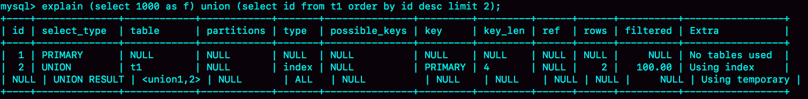

图 1 union 语句 explain 结果

可以看到：

- 第二行的 key=PRIMARY，说明第二个子句用到了索引 id。
- 第三行的 Extra 字段，表示在对子查询的结果集做 union 的时候，使用了临时表(Using temporary)。

这个语句的执行流程是这样的：

1. 创建一个内存临时表，这个临时表只有一个整型字段 f，并且 f 是主键字段。
2. 执行第一个子查询，得到 1000 这个值，并存入临时表中。
3. 执行第二个子查询：
    - 拿到第一行 id=1000，试图插入临时表中。但由于 1000 这个值已经存在于临时表了，违反了唯一性约束，所以插入失败，然后继续执行；
    - 取到第二行 id=999，插入临时表成功。
4. 从临时表中按行取出数据，返回结果，并删除临时表，结果中包含两行数据分别是 1000 和 999。

这个过程的流程图如下所示：

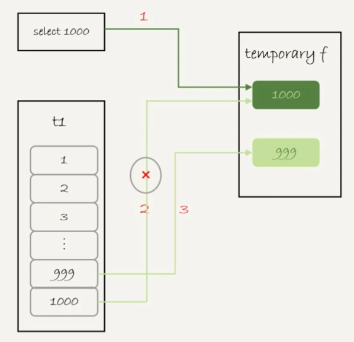

图 2 union 执行流程

可以看到，这里的内存临时表起到了暂存数据的作用，而且计算过程还用上了临时表主键 id 的唯一性约束，实现了 union 的语义。

顺便提一下，如果把上面这个语句中的 union 改成 union all 的话，就没有了“去重”的语义。这样执行的时候，就依次执行子查询，得到的结果直接作为结果集的一部分，发给客户端。因此也就不需要临时表了。

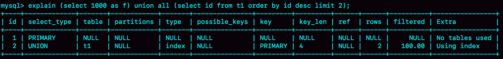

图 3 union all 的 explain 结果

可以看到，第二行的 Extra 字段显示的是 Using index，表示只使用了覆盖索引，没有用临时表了。

# group by 执行流程

另外一个常见的使用临时表的例子是 group by，我们来看一下这个语句：

```
select id%10 as m, count(*) as c from t1 group by m;
```

这个语句的逻辑是把表 t1 里的数据，按照 id%10 进行分组统计，并按照 m 的结果排序后输出。它的 explain 结果如下：

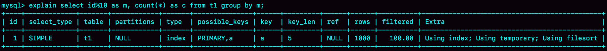

图 4 group by 的 explain 结果

在 Extra 字段里面，我们可以看到三个信息：

- Using index，表示这个语句使用了覆盖索引，选择了索引 a，不需要回表；
- Using temporary，表示使用了临时表；
- Using filesort，表示需要排序。

这个语句的执行流程是这样的：

1. 创建内存临时表，表里有两个字段 m 和 c，主键是 m；
2. 扫描表 t1 的索引 a，依次取出叶子节点上的 id 值，计算 id%10 的结果，记为 x；
    - 如果临时表中没有主键为 x 的行，就插入一个记录(x,1);
    - 如果表中有主键为 x 的行，就将 x 这一行的 c 值加 1；
3. 遍历完成后，再根据字段 m 做排序，得到结果集返回给客户端。

这个流程的执行图如下：

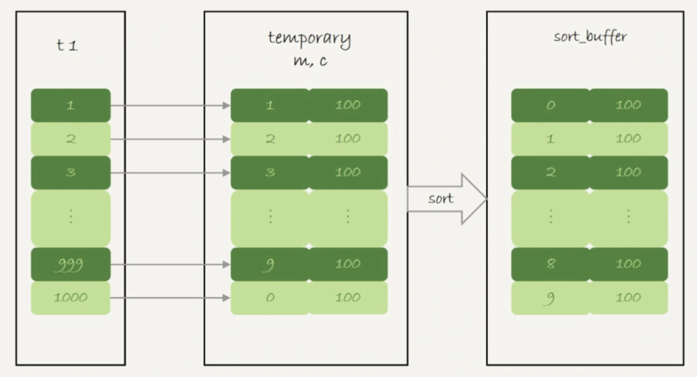

图 5 group by 执行流程

图中最后一步，对内存临时表的排序，在[第17篇文章](https://time.geekbang.org/column/article/73795)中已经有过介绍，我把图贴过来，方便你回顾。

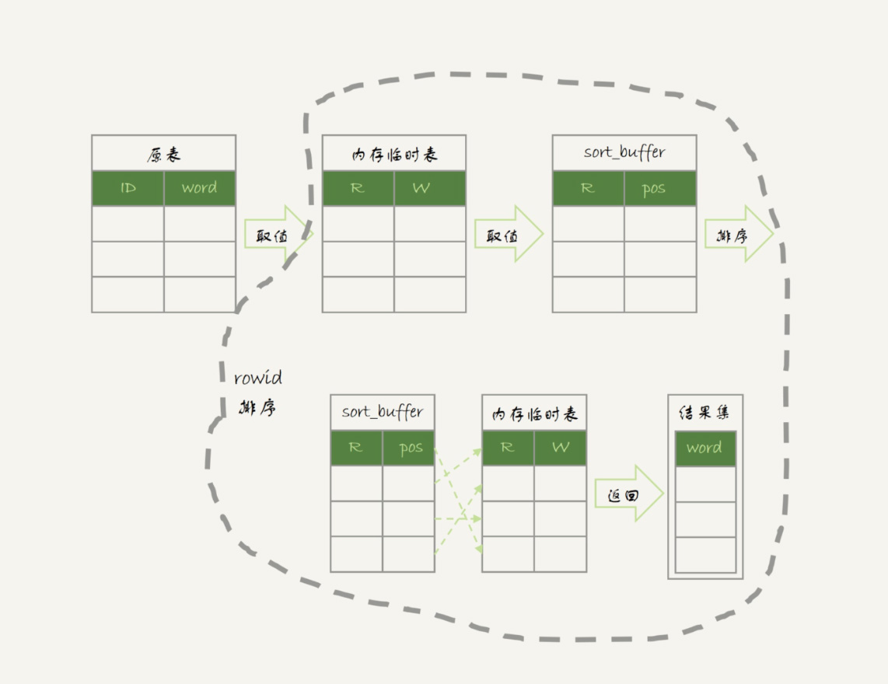

图 6 内存临时表排序流程

其中，临时表的排序过程就是图 6 中虚线框内的过程。

接下来，我们再看一下这条语句的执行结果：

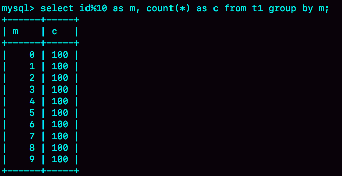

图 7 group by 执行结果

如果你的需求并不需要对结果进行排序，那你可以在 SQL 语句末尾增加 order by null，也就是改成：

```
select id%10 as m, count(*) as c from t1 group by m order by null;
```

这样就跳过了最后排序的阶段，直接从临时表中取数据返回。返回的结果如图 8 所示。

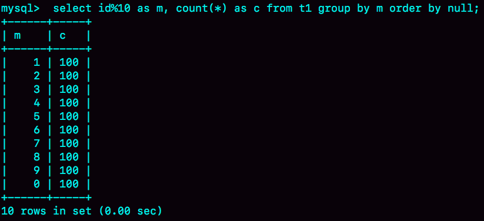

图 8 group + order by null 的结果（内存临时表）

由于表 t1 中的 id 值是从 1 开始的，因此返回的结果集中第一行是 id=1；扫描到 id=10 的时候才插入 m=0 这一行，因此结果集里最后一行才是 m=0。

这个例子里由于临时表只有 10 行，内存可以放得下，因此全程只使用了内存临时表。但是，内存临时表的大小是有限制的，参数 tmp_table_size 就是控制这个内存大小的，默认是 16M。

如果我执行下面这个语句序列：

```
set tmp_table_size=1024;
select id%100 as m, count(*) as c from t1 group by m order by null limit 10;
```

把内存临时表的大小限制为最大 1024 字节，并把语句改成 id % 100，这样返回结果里有 100 行数据。但是，这时的内存临时表大小不够存下这 100 行数据，也就是说，执行过程中会发现内存临时表大小到达了上限（1024 字节）。

那么，这时候就会把内存临时表转成磁盘临时表，磁盘临时表默认使用的引擎是 InnoDB。 这时，返回的结果如图 9 所示。

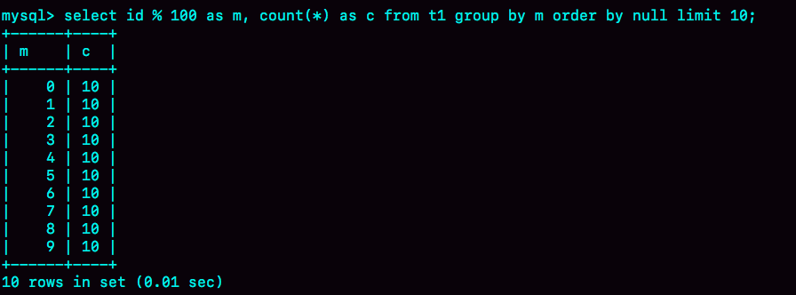

图 9 group + order by null 的结果（磁盘临时表）

如果这个表 t1 的数据量很大，很可能这个查询需要的磁盘临时表就会占用大量的磁盘空间。

# group by 优化方法 --索引

可以看到，不论是使用内存临时表还是磁盘临时表，group by 逻辑都需要构造一个带唯一索引的表，执行代价都是比较高的。如果表的数据量比较大，上面这个 group by 语句执行起来就会很慢，我们有什么优化的方法呢？

要解决 group by 语句的优化问题，你可以先想一下这个问题：执行 group by 语句为什么需要临时表？

group by 的语义逻辑，是统计不同的值出现的个数。但是，由于每一行的 id%100 的结果是无序的，所以我们就需要有一个临时表，来记录并统计结果。

那么，如果扫描过程中可以保证出现的数据是有序的，是不是就简单了呢？

假设，现在有一个类似图 10 的这么一个数据结构，我们来看看 group by 可以怎么做。


图 10 group by 算法优化-有序输入

可以看到，如果可以确保输入的数据是有序的，那么计算 group by 的时候，就只需要从左到右，顺序扫描，依次累加。也就是下面这个过程：

- 当碰到第一个 1 的时候，已经知道累积了 X 个 0，结果集里的第一行就是(0,X);
- 当碰到第一个 2 的时候，已经知道累积了 Y 个 1，结果集里的第二行就是(1,Y);

按照这个逻辑执行的话，扫描到整个输入的数据结束，就可以拿到 group by 的结果，不需要临时表，也不需要再额外排序。

你一定想到了，InnoDB 的索引，就可以满足这个输入有序的条件。

在 MySQL 5.7 版本支持了 generated column 机制，用来实现列数据的关联更新。你可以用下面的方法创建一个列 z，然后在 z 列上创建一个索引（如果是 MySQL 5.6 及之前的版本，你也可以创建普通列和索引，来解决这个问题）。

```
alter table t1 add column z int generated always as(id % 100), add index(z);
```

这样，索引 z 上的数据就是类似图 10 这样有序的了。上面的 group by 语句就可以改成：

```
select z, count(*) as c from t1 group by z;
```

优化后的 group by 语句的 explain 结果，如下图所示：

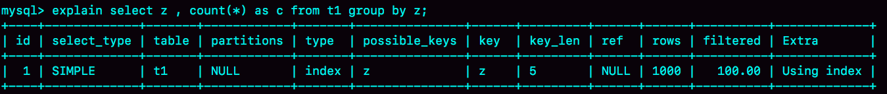

图 11 group by 优化的 explain 结果

从 Extra 字段可以看到，这个语句的执行不再需要临时表，也不需要排序了。

# group by优化方法 --直接排序

所以，如果可以通过加索引来完成 group by 逻辑就再好不过了。但是，如果碰上不适合创建索引的场景，我们还是要老老实实做排序的。那么，这时候的 group by 要怎么优化呢？

如果我们明明知道，一个 group by 语句中需要放到临时表上的数据量特别大，却还是要按照“先放到内存临时表，插入一部分数据后，发现内存临时表不够用了再转成磁盘临时表”，看上去就有点儿傻。

那么，我们就会想了，MySQL 有没有让我们直接走磁盘临时表的方法呢？

答案是，有的。

在 group by 语句中加入 SQL_BIG_RESULT 这个提示（hint），就可以告诉优化器：这个语句涉及的数据量很大，请直接用磁盘临时表。

MySQL 的优化器一看，磁盘临时表是 B+树存储，存储效率不如数组来得高。所以，既然你告诉我数据量很大，那从磁盘空间考虑，还是直接用数组来存吧。

因此，下面这个语句

```
select SQL_BIG_RESULT id%100 as m, count(*) as c from t1 group by m;
```

的执行流程就是这样的：

1. 初始化 sort_buffer，确定放入一个整型字段，记为 m；
2. 扫描表 t1 的索引 a，依次取出里面的 id 值, 将 id%100 的值存入 sort_buffer 中；
3. 扫描完成后，对 sort_buffer 的字段 m 做排序（如果 sort_buffer 内存不够用，就会利用磁盘临时文件辅助排序）；
4. 排序完成后，就得到了一个有序数组。

根据有序数组，得到数组里面的不同值，以及每个值的出现次数。这一步的逻辑，你已经从前面的图 10 中了解过了。

下面两张图分别是执行流程图和执行 explain 命令得到的结果。


图 12 使用 SQL_BIG_RESULT 的执行流程图

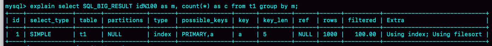

图 13 使用 SQL_BIG_RESULT 的 explain 结果

从 Extra 字段可以看到，这个语句的执行没有再使用临时表，而是直接用了排序算法。

基于上面的 union、union all 和 group by 语句的执行过程的分析，我们来回答文章开头的问题：MySQL 什么时候会使用内部临时表？

1. 如果语句执行过程可以一边读数据，一边直接得到结果，是不需要额外内存的，否则就需要额外的内存，来保存中间结果；
2. join_buffer 是无序数组，sort_buffer 是有序数组，临时表是二维表结构；
3. 如果执行逻辑需要用到二维表特性，就会优先考虑使用临时表。比如我们的例子中，union 需要用到唯一索引约束， group by 还需要用到另外一个字段来存累积计数。

# 小结

通过今天这篇文章，我重点和你讲了 group by 的几种实现算法，从中可以总结一些使用的指导原则：

1. 如果对 group by 语句的结果没有排序要求，要在语句后面加 order by null；
2. 尽量让 group by 过程用上表的索引，确认方法是 explain 结果里没有 Using temporary 和 Using filesort；
3. 如果 group by 需要统计的数据量不大，尽量只使用内存临时表；也可以通过适当调大 tmp_table_size 参数，来避免用到磁盘临时表；
4. 如果数据量实在太大，使用 SQL_BIG_RESULT 这个提示，来告诉优化器直接使用排序算法得到 group by 的结果。

最后，我给你留下一个思考题吧。

文章中图 8 和图 9 都是 order by null，为什么图 8 的返回结果里面，0 是在结果集的最后一行，而图 9 的结果里面，0 是在结果集的第一行？

你可以把你的分析写在留言区里，我会在下一篇文章和你讨论这个问题。感谢你的收听，也欢迎你把这篇文章分享给更多的朋友一起阅读。

# 上期问题时间

上期的问题是：为什么不能用 rename 修改临时表的改名。

在实现上，执行 rename table 语句的时候，要求按照“库名/表名.frm”的规则去磁盘找文件，但是临时表在磁盘上的 frm 文件是放在 tmpdir 目录下的，并且文件名的规则是“#sql{进程 id}_{线程 id}_序列号.frm”，因此会报“找不到文件名”的错误。

评论区留言点赞板：

> @poppy 同学，通过执行语句的报错现象推测了这个实现过程。

## 精选留言

- 

    老杨同志

    请教一个问题：如果只需要去重，不需要执行聚合函数，distinct 和group by那种效率高一些呢？

    课后习题:
    图8，把统计结果存内存临时表，不排序。id是从1到1000，模10的结果顺序就是1、2、3、4、5。。。
    图9，老师把tmp_table_size改小了，内存临时表装不下，改用磁盘临时表。根据老师讲的流程，id取模的结果，排序后存入临时表，临时的数据应该是0,0,0,0,0,0,0,0,0,0,1,1,1,1,1,1,1,1,1,1,2,......
    从这个磁盘临时表读取数据汇总的结果的顺序就是0,1,2,3,4,5。。。

    2019-02-06 22:03

    作者回复

    新年好

    好问题，我加到后面文章中。
    简单说下结论，只需要去重的话，如果没有limit，是一样的；
    有limit的话，distinct 快些。

    漂亮的回答

    

    2019-02-07 09:25

- 

    Li Shunduo

    请问Group By部分的第一个语句 explain select id%10 as m, count(*) as c from t1 group by m；为什么选择的是索引a，而不是primary key？如果字段a上有空值，使用索引a岂不是就不能取到所有的id值了？

    2019-02-07 12:23

    作者回复

    因为索引c的信息也足够，而且比主键索引小，使用索引c更会好。

    “如果字段a上有空值，使用索引a岂不是就不能取到所有的id值了？”，不会的

    2019-02-07 17:34

- 

    夜空中最亮的星（华仔）

    过年好，老师。这周 补补落下的课

    2019-02-13 15:30

- 

    Long

    老师可能没看到，再发下。
    老师，新年好！ :-)

    有几个版本差异的问题：
    （1）图1中的执行计划应该是5.7版本以后的吧，貌似没找到说在哪个环境，我在5.6和5.7分别测试了，id = 2的那个rows，在5.6版本（5.6.26）是1000，在5.7版本是2行。应该是5.7做的优化吧？

    （2）图 9 group + order by null 的结果（此盘临时表），这里面mysql5.6里面执行的结果是（1，10），（2，10）...(10，10)，执行计划都是只有一样，没找到差异。
    跟踪下了下optimizer trace，发现问题应该是在临时表空间满的的时候，mysql5.7用的是：converting_tmp_table_to_ondisk "location": "disk (InnoDB)",，而mysql 5.6用的是converting_tmp_table_to_myisam "location": "disk (MyISAM)"的原因导致的。
    查了下参数：
    default_tmp_storage_engine。（5.6，5.7当前值都是innodb）
    internal_tmp_disk_storage_engine（只有5.7有这个参数，当前值是innodb），5.6应该是默认磁盘临时表就是MyISAM引擎的了，由于本地测试环境那个临时表的目录下找不到临时文件，也没法继续分析了。。。

    至于为什么MySQL 5.6中结果展示m字段不是0-9而是1-10，还得请老师帮忙解答下了。

    
    还有几个小问题，为了方便解答，序号统一了：
    （3）在阅读mysql执行计划的时候，看了网上有很多说法，也参考了mysql官网对id（select_id）的解释：
    id (JSON name: select_id)
    The SELECT identifier. This is the sequential number of the SELECT within the query.（感觉这个读起来也有点歧义，这个sequential字面解释感觉只有顺序的号码，并咩有说执行顺序）
    比如图1，文中解释就是从ID小的往大的执行的，网上有很多其他说法，有的是说ID从大到小执行，遇到ID一样的，就从上往下执行。有的说是从小往大顺序执行。不知道老师是否可以官方讲解下。

    （4）我发现想搞懂一个原理，并且讲清楚让别人明白，真的是很有难度，非常感谢老师的分享。这次专栏结束，还会推出的新的专栏吗？ 非常期待。

    2019-02-13 14:28

- 

    还一棵树

    group by 执行流程里面，为什么有最后排序操作，感觉这一步是多余的，扫描完最后一行数据后 ，完全可以直接从temporary表返回数据

    2019-02-12 14:28

    作者回复

    嗯 语义就是这么定义的，如果不需要排序，要手动加上 order by null 哈

    2019-02-12 21:28

- 

    梦康

    实践发现文中描述的 group by 执行过程中解释不通。案例如下

    select `aid`,sum(`pv`) as num from article_rank force index(idx_day_aid_pv) where `day`>20190115 group by aid order by num desc LIMIT 10;

    内存临时表不够，需要写入磁盘

    select `aid`,sum(`pv`) as num from article_rank force index(idx_aid_day_pv) where `day`>20190115 group by aid order by num desc LIMIT 10;

    内存临时表足够。

    选的索引不一样，但是最后筛选出来的总行应该是一样的呀，所以现在更加困惑了。

    2019-02-11 17:27

- 

    梦康

    有一张表article_rank 里面有是个字段（id,aid,pv,day），都是 int 类型。现执行如下 sql
    select `aid`,sum(`pv`) as num from article_rank where `day`>20190115 group by aid order by num desc limit 10;

    optimizer_trace 结果中关于执行阶段数据解读还是有些问题。
    {
    "creating_tmp_table": {
    "tmp_table_info": {
    "table": "intermediate_tmp_table",
    "row_length": 20,
    "key_length": 4,
    "unique_constraint": false,
    "location": "memory (heap)",
    "row_limit_estimate": 838860
    }
    }
    },
    {
    "converting_tmp_table_to_ondisk": {
    "cause": "memory_table_size_exceeded",
    "tmp_table_info": {
    "table": "intermediate_tmp_table",
    "row_length": 20,
    "key_length": 4,
    "unique_constraint": false,
    "location": "disk (InnoDB)",
    "record_format": "fixed"
    }
    }
    }

    \1. row_length 为什么是20呢？我 gdb 调试确认临时表里存放的是 aid，num。 aid 4个字节，num 因为是 sum 的结果是 DECIMAL 类型，所以是15个字节，不知道为什么总长度是20字节了。测试其他 sql 均发现row_length会比临时表种的字段所占长度多1字节，这是为何呢？
    \2. 创建临时表提示内存超出限制，但是根据第一步行数限制是 838860 行，实际总共符合条件的行数为 649091 通过 select count(distinct aid) from article_rank where `day`>20190115 查询得到。为什么会超出内存呢？

    麻烦老师帮忙解答下。谢谢啦。

    2019-02-11 15:40

- 

    兔斯基

    老师，关于排序有几个问题。
    order by id，主键
    order by null，
    不加order by
    这三种写法哪种执行效率更高一些？后面两者是不是等价的？

    2019-02-11 07:55

    作者回复

    这三种写法语义上不一样。。

    如果对返回结果没有顺序要求，那写上order by null肯定是好的。

    “order by null”和“不加order by”不等价，咱们文中有说哈

    2019-02-11 16:29

- 

    Smile

    当碰到第一个 2 的时候，已经知道累积了 Y 个 1，结果集里的第一行就是 (1,Y);
    \----
    应该是 结果集里的第 二 行 吧

    

    

    2019-02-11 00:30

    作者回复

    对的，细致

    发起勘误了，新年快乐

    2019-02-11 11:09

- 

    Long

    老师，新年好！ :-)

    有几个版本差异的问题：
    （1）图1中的执行计划应该是5.7版本以后的吧，貌似没找到说在哪个环境，我在5.6和5.7分别测试了，id = 2的那个rows，在5.6版本（5.6.26）是1000，在5.7版本是2行。应该是5.7做的优化吧？

    （2）图 9 group + order by null 的结果（此盘临时表），这里面mysql5.6里面执行的结果是（1，10），（2，10）...(10，10)，执行计划都是只有一样，没找到差异。
    跟踪下了下optimizer trace，发现问题应该是在临时表空间满的的时候，mysql5.7用的是：converting_tmp_table_to_ondisk "location": "disk (InnoDB)",，而mysql 5.6用的是converting_tmp_table_to_myisam "location": "disk (MyISAM)"的原因导致的。
    查了下参数：
    default_tmp_storage_engine。（5.6，5.7当前值都是innodb）
    internal_tmp_disk_storage_engine（只有5.7有这个参数，当前值是innodb），5.6应该是默认磁盘临时表就是MyISAM引擎的了，由于本地测试环境那个临时表的目录下找不到临时文件，也没法继续分析了。。。

    至于为什么MySQL 5.6中结果展示m字段不是0-9而是1-10，还得请老师帮忙解答下了。

    
    还有几个小问题，为了方便解答，序号统一了：
    （3）在阅读mysql执行计划的时候，看了网上有很多说法，也参考了mysql官网对id（select_id）的解释：
    id (JSON name: select_id)
    The SELECT identifier. This is the sequential number of the SELECT within the query.（感觉这个读起来也有点歧义，这个sequential字面解释感觉只有顺序的号码，并咩有说执行顺序）
    比如图1，文中解释就是从ID小的往大的执行的，网上有很多其他说法，有的是说ID从大到小执行，遇到ID一样的，就从上往下执行。有的说是从小往大顺序执行。不知道老师是否可以官方讲解下。

    （4）我发现想搞懂一个原理，并且讲清楚让别人明白，真的是很有难度，非常感谢老师的分享。这次专栏结束，还会推出的新的专栏吗？ 非常期待。

    2019-02-10 08:24

- 

    Laputa

    老师好，文中说的不需要排序为什么不直接把orderby去掉而是写order by null

    2019-02-08 17:36

    作者回复

    MySQL 语义上这么定义的…

    2019-02-08 22:53

- 

    HuaMax

    课后题解答。图8是用内存临时表，文中已经提到，是按照表t1的索引a顺序取出数据，模10得0的id是最后一行；图9是用硬盘临时表，默认用innodb 的索引，主键是id%10，因此存入硬盘后再按主键树顺序取出，0就排到第一行了。

    2019-02-07 21:17

- 

    牛牛

    新年快乐～、感谢有您～^_^～

    2019-02-06 22:30

    作者回复

    新年快乐~

    2019-02-07 09:22

- 

    poppy

    老师，春节快乐，过年还在更新，辛苦辛苦。
    关于思考题，我的理解是图8中的查询是使用了内存临时表，存储的顺序就是id%10的值的插入顺序，而图9中的查询，由于内存临时表大小无法满足，所以使用了磁盘临时表，对于InnoDB来说，就是对应B+树这种数据结构，这里会按照id%100(即m)的大小顺序来存储的，所以返回的结果当然也是有序的

    2019-02-06 20:17

    作者回复

    新年好~

    

    2019-02-07 09:26

- 

    张八百

    春节快乐，老师。谢谢你让我学到不少知识

    2019-02-06 13:17

    作者回复

    新年快乐

    2019-02-06 16:28

- 

    某、人

    老师春节快乐，辛苦了

    2019-02-06 09:59

    作者回复

    春节快乐，

    2019-02-06 12:33

- 

    长杰

    图九使用的是磁盘临时表，磁盘临时表使用的引擎是innodb，innodb是索引组织表，按主键顺序存储数据，所以是按照m字段有序的。

    2019-02-06 08:38

    作者回复

    
    春节快乐

    2019-02-06 12:34