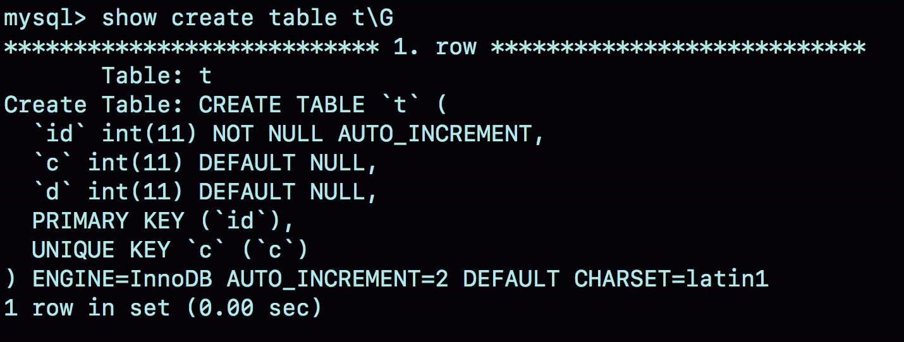
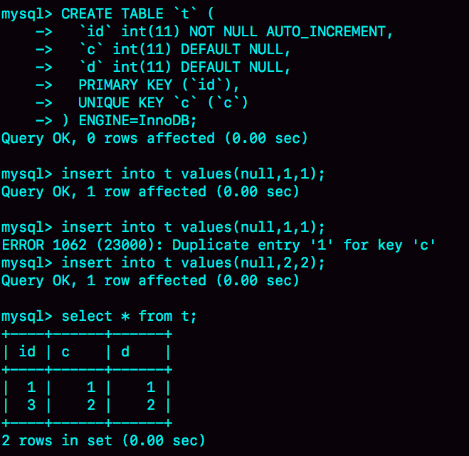

# 39讲自增主键为什么不是连续的

在[第4篇文章](https://time.geekbang.org/column/article/69236)中，我们提到过自增主键，由于自增主键可以让主键索引尽量地保持递增顺序插入，避免了页分裂，因此索引更紧凑。之前我见过有的业务设计依赖于自增主键的连续性，即这个设计假设自增主键是连续的。但实际上，这样的假设是错的，因为**自增主键不能保证连续递增**。

为了便于说明，我们创建一个表 t，其中 id 是自增主键字段、c 是唯一索引。

```sql
CREATE TABLE `t` (
  `id` int(11) NOT NULL AUTO_INCREMENT,
  `c` int(11) DEFAULT NULL,
  `d` int(11) DEFAULT NULL,
  PRIMARY KEY (`id`),
  UNIQUE KEY `c` (`c`)
) ENGINE=InnoDB;
```

## 一、自增值保存位置

在这个空表 t 里面执行 `insert into t values(null, 1, 1);` 插入一行数据，再执行 `show create table` 命令，就可以看到如下图所示的结果：



图1 自动生成的 `AUTO_INCREMENT` 值

可以看到，表定义里面出现了一个 `AUTO_INCREMENT=2`，表示下一次插入数据时，如果需要自动生成自增值，会生成 `id=2`。

其实，这个输出结果容易引起这样的误解：自增值是保存在表结构定义里的。实际上，**表的结构定义存放在后缀名为 `.frm` 的文件中，但是并不会保存自增值。**

不同的引擎对于自增值的保存策略不同。

- MyISAM 引擎的自增值保存在数据文件中。

- InnoDB 引擎的自增值，其实是保存在了内存里，并且到了 MySQL 8.0 版本后，才有了「自增值持久化」的能力，也就是才实现了「如果发生重启，表的自增值可以恢复为 MySQL 重启前的值」，具体情况是：
    - 在 MySQL 5.7 及之前的版本，自增值保存在内存里，并没有持久化。每次重启后，第一次打开表的时候，都会去找自增值的最大值 `max(id)`，然后将 `max(id)+1`作为这个表当前的自增值。
    
        举例来说，如果一个表当前数据行里最大的 `id` 是 10，`AUTO_INCREMENT=11`。这时候，我们删除 id=10 的行，`AUTO_INCREMENT` 还是 11。但如果马上重启实例，重启后这个表的 `AUTO_INCREMENT` 就会变成 10。
        也就是说，`MySQL` 重启可能会修改一个表的 `AUTO_INCREMENT` 的值。
    
    - 在 MySQL 8.0 版本，将自增值的变更记录在了 redo log 中，重启的时候依靠 redo log 恢复重启之前的值。

理解了 MySQL 对自增值的保存策略以后，我们再看看自增值修改机制。

## 二、自增值修改机制

在 MySQL 里面，如果字段 id 被定义为 `AUTO_INCREMENT`，在插入一行数据的时候，自增值的行为如下：

- 如果插入数据时 id 字段指定为 0、null 或未指定值，那么就把这个表当前的 `AUTO_INCREMENT` 值填到自增字段；

- 如果插入数据时 id 字段指定了具体的值，就直接使用语句里指定的值。

根据要插入的值和当前自增值的大小关系，自增值的变更结果也会有所不同。假设，某次要插入的值是 X，当前的自增值是 Y。

- 如果 `X<Y`，那么这个表的自增值不变；

- 如果 `X≥Y` ，就需要把当前自增值修改为新的自增值。

**新的自增值生成算法是**：从 `auto_increment_offset` 开始，以 `auto_increment_increment`为步长，持续叠加，直到找到第一个大于 X 的值，作为新的自增值。

其中，`auto_increment_offset` 和 `auto_increment_increment` 是两个系统参数，分别用来表示自增的初始值和步长，默认值都是1。

> 备注：在一些场景下，使用的就不全是默认值。比如，双 M 的主备结构里要求双写的时候，我们就可能会设置成`auto_increment_increment=2`，让一个库的自增 id 都是奇数，另一个库的自增 id 都是偶数，避免两个库生成的主键发生冲突。

当 `auto_increment_offset` 和 `auto_increment_increment` 都是 1 的时候，新的自增值生成逻辑很简单，就是：

- 如果准备插入的值>=当前自增值，新的自增值就是“准备插入的值+1”；

- 否则，自增值不变。

这就引入了我们文章开头提到的问题，在这两个参数都设置为 1 的时候，自增主键 id 却不能保证是连续的，这是什么原因呢？

## 三、自增值的修改时机

要回答这个问题，我们就要看一下自增值的修改时机。

假设，表 t 里面已经有了 `(1,1,1)` 这条记录，这时我再执行一条插入数据命令：

```sql
insert into t values(null, 1, 1); 
```

这个语句的执行流程就是：

- 执行器调用 InnoDB 引擎接口写入一行，传入的这一行的值是 (0,1,1);

- InnoDB 发现用户没有指定自增 id 的值，获取表 t 当前的自增值 2；

- 将传入的行的值改成 (2,1,1);

- **将表的自增值改成 3；**

- **继续执行插入数据操作，由于已经存在 c=1 的记录，所以报 Duplicate key error，语句返回。**

对应的执行流程图如下：


图2 insert(null, 1,1) 唯一键冲突

可以看到，这个表的自增值改成 3，是在真正执行插入数据的操作之前。这个语句真正执行的时候，因为碰到唯一键 c 冲突，所以 `id=2`这一行并没有插入成功，但也没有将自增值再改回去。

**所以，在这之后，再插入新的数据行时，拿到的自增 id 就是 3。也就是说，出现了自增主键不连续的情况。**

如图3所示就是完整的演示结果。



图3 一个自增主键id不连续的复现步骤

可以看到，这个操作序列复现了一个自增主键 id 不连续的现场(没有 `id=2` 的行）。可见，**唯一键冲突是导致自增主键 id 不连续的第一种原因。**

同样地，**事务回滚也会产生类似的现象，这就是第二种原因。**

下面这个语句序列就可以构造不连续的自增 id，你可以自己验证一下。

```sql
insert into t values(null,1,1);
begin;
insert into t values(null,2,2);
rollback;
insert into t values(null,2,2);
//插入的行是(3,2,2)
```

你可能会问，为什么在出现唯一键冲突或者回滚的时候，MySQL 没有把表 t 的自增值改回去呢？如果把表 t 的当前自增值从 3 改回2，再插入新数据的时候，不就可以生成 `id=2`的一行数据了吗？

其实，MySQL 这么设计是为了提升性能。接下来，我就跟你分析一下这个设计思路，看看**自增值为什么不能回退。**

假设有两个并行执行的事务，在申请自增值的时候，为了避免两个事务申请到相同的自增 id，肯定要加锁，然后顺序申请。

1. 假设事务 A 申请到了 `id=2`， 事务 B 申请到 `id=3`，那么这时候表 t 的自增值是 4，之后继续执行。
2. 事务 B 正确提交了，但事务 A 出现了唯一键冲突。
3. 如果允许事务 A 把自增 id 回退，也就是把表 t 的当前自增值改回 2，那么就会出现这样的情况：表里面已经有 id=3 的行，而当前的自增 id 值是 2。
4. 接下来，继续执行的其他事务就会申请到 `id=2`，然后再申请到 `id=3`。这时，就会出现插入语句报错“主键冲突”。

而为了解决这个主键冲突，有两种方法：

- 每次申请 id 之前，先判断表里面是否已经存在这个 id。如果存在，就跳过这个 id。但是，这个方法的成本很高。因为，本来申请 id 是一个很快的操作，现在还要再去主键索引树上判断 id 是否存在。

- 把自增 id 的锁范围扩大，必须等到一个事务执行完成并提交，下一个事务才能再申请自增 id。这个方法的问题，就是锁的粒度太大，系统并发能力大大下降。

可见，这两个方法都会导致性能问题。造成这些麻烦的罪魁祸首，就是我们假设的这个“允许自增id回退”的前提导致的。

因此，InnoDB 放弃了这个设计，语句执行失败也不回退自增id。也正是因为这样，所以才只保证了自增id是递增的，但不保证是连续的。

## 四、自增锁的优化

可以看到，**自增 id 锁并不是一个事务锁，而是每次申请完就马上释放**，以便允许别的事务再申请。其实，在 MySQL 5.1 版本之前，并不是这样的。

接下来，我会先给你介绍下自增锁设计的历史，这样有助于你分析接下来的一个问题。

在 MySQL 5.0 版本的时候，自增锁的范围是语句级别。也就是说，如果一个语句申请了一个表自增锁，这个锁会等语句执行结束以后才释放。显然，这样设计会影响并发度。

MySQL 5.1.22 版本引入了一个新策略，新增参数 `innodb_autoinc_lock_mode`，默认值是 1。

- 这个参数的值被设置为 0 时，表示采用之前 MySQL 5.0 版本的策略，即语句执行结束后才释放锁；

- 值被设置为 1 时：

    - 普通 `insert` 语句，自增锁在申请之后就马上释放；

    - 类似 `insert … select` 这样的批量插入数据的语句，自增锁还是要等语句结束后才被释放；

- 值被设置为 2 时，所有的申请自增主键的动作都是申请后就释放锁。

**为什么默认设置下，insert … select 要使用语句级的锁？为什么这个参数的默认值不是2？**

答案是，这么设计还是为了数据的一致性。

我们一起来看一下这个场景：


图4 批量插入数据的自增锁

在这个例子里，我往表t1中插入了4行数据，然后创建了一个相同结构的表t2，然后两个session同时执行向表t2中插入数据的操作。

你可以设想一下，如果session B是申请了自增值以后马上就释放自增锁，那么就可能出现这样的情况：

- session B先插入了两个记录，(1,1,1)、(2,2,2)；
- 然后，session A来申请自增id得到id=3，插入了（3,5,5)；
- 之后，session B继续执行，插入两条记录(4,3,3)、 (5,4,4)。

你可能会说，这也没关系吧，毕竟session B的语义本身就没有要求表t2的所有行的数据都跟session A相同。

是的，从数据逻辑上看是对的。但是，如果我们现在的binlog_format=statement，你可以设想下，binlog会怎么记录呢？

由于两个session是同时执行插入数据命令的，所以binlog里面对表t2的更新日志只有两种情况：要么先记session A的，要么先记session B的。

但不论是哪一种，这个binlog拿去从库执行，或者用来恢复临时实例，备库和临时实例里面，session B这个语句执行出来，生成的结果里面，id都是连续的。这时，这个库就发生了数据不一致。

你可以分析一下，出现这个问题的原因是什么？

其实，这是因为原库session B的insert语句，生成的id不连续。这个不连续的id，用statement格式的binlog来串行执行，是执行不出来的。

而要解决这个问题，有两种思路：

1. 一种思路是，让原库的批量插入数据语句，固定生成连续的id值。所以，自增锁直到语句执行结束才释放，就是为了达到这个目的。
2. 另一种思路是，在binlog里面把插入数据的操作都如实记录进来，到备库执行的时候，不再依赖于自增主键去生成。这种情况，其实就是innodb_autoinc_lock_mode设置为2，同时binlog_format设置为row。

因此，**在生产上，尤其是有insert … select这种批量插入数据的场景时，从并发插入数据性能的角度考虑，我建议你这样设置：innodb_autoinc_lock_mode=2 ，并且 binlog_format=row**.这样做，既能提升并发性，又不会出现数据一致性问题。

需要注意的是，我这里说的**批量插入数据，包含的语句类型是insert … select、replace … select和load data语句。**

但是，在普通的insert语句里面包含多个value值的情况下，即使innodb_autoinc_lock_mode设置为1，也不会等语句执行完成才释放锁。因为这类语句在申请自增id的时候，是可以精确计算出需要多少个id的，然后一次性申请，申请完成后锁就可以释放了。

也就是说，批量插入数据的语句，之所以需要这么设置，是因为“不知道要预先申请多少个id”。

既然预先不知道要申请多少个自增id，那么一种直接的想法就是需要一个时申请一个。但如果一个select … insert语句要插入10万行数据，按照这个逻辑的话就要申请10万次。显然，这种申请自增id的策略，在大批量插入数据的情况下，不但速度慢，还会影响并发插入的性能。

因此，对于批量插入数据的语句，MySQL有一个批量申请自增id的策略：

1. 语句执行过程中，第一次申请自增id，会分配1个；
2. 1个用完以后，这个语句第二次申请自增id，会分配2个；
3. 2个用完以后，还是这个语句，第三次申请自增id，会分配4个；
4. 依此类推，同一个语句去申请自增id，每次申请到的自增id个数都是上一次的两倍。

举个例子，我们一起看看下面的这个语句序列：

```
insert into t values(null, 1,1);
insert into t values(null, 2,2);
insert into t values(null, 3,3);
insert into t values(null, 4,4);
create table t2 like t;
insert into t2(c,d) select c,d from t;
insert into t2 values(null, 5,5);
```

insert…select，实际上往表t2中插入了4行数据。但是，这四行数据是分三次申请的自增id，第一次申请到了id=1，第二次被分配了id=2和id=3， 第三次被分配到id=4到id=7。

由于这条语句实际只用上了4个id，所以id=5到id=7就被浪费掉了。之后，再执行insert into t2 values(null, 5,5)，实际上插入的数据就是（8,5,5)。

**这是主键id出现自增id不连续的第三种原因。**

## 小结

今天，我们从“自增主键为什么会出现不连续的值”这个问题开始，首先讨论了自增值的存储。

在MyISAM引擎里面，自增值是被写在数据文件上的。而在InnoDB中，自增值是被记录在内存的。MySQL直到8.0版本，才给InnoDB表的自增值加上了持久化的能力，确保重启前后一个表的自增值不变。

然后，我和你分享了在一个语句执行过程中，自增值改变的时机，分析了为什么MySQL在事务回滚的时候不能回收自增id。

MySQL 5.1.22版本开始引入的参数innodb_autoinc_lock_mode，控制了自增值申请时的锁范围。从并发性能的角度考虑，我建议你将其设置为2，同时将binlog_format设置为row。我在前面的文章中其实多次提到，binlog_format设置为row，是很有必要的。今天的例子给这个结论多了一个理由。

最后，我给你留一个思考题吧。

在最后一个例子中，执行insert into t2(c,d) select c,d from t;这个语句的时候，如果隔离级别是可重复读（repeatable read），binlog_format=statement。这个语句会对表t的所有记录和间隙加锁。

你觉得为什么需要这么做呢？

你可以把你的思考和分析写在评论区，我会在下一篇文章和你讨论这个问题。感谢你的收听，也欢迎你把这篇文章分享给更多的朋友一起阅读。

## 上期问题时间

上期的问题是，如果你维护的MySQL系统里有内存表，怎么避免内存表突然丢数据，然后导致主备同步停止的情况。

我们假设的是主库暂时不能修改引擎，那么就把备库的内存表引擎先都改成InnoDB。对于每个内存表，执行

```
set sql_log_bin=off;
alter table tbl_name engine=innodb;
```

这样就能避免备库重启的时候，数据丢失的问题。

由于主库重启后，会往binlog里面写“delete from tbl_name”，这个命令传到备库，备库的同名的表数据也会被清空。

因此，就不会出现主备同步停止的问题。

如果由于主库异常重启，触发了HA，这时候我们之前修改过引擎的备库变成了主库。而原来的主库变成了新备库，在新备库上把所有的内存表（这时候表里没数据）都改成InnoDB表。

所以，如果我们不能直接修改主库上的表引擎，可以配置一个自动巡检的工具，在备库上发现内存表就把引擎改了。

同时，跟业务开发同学约定好建表规则，避免创建新的内存表。

评论区留言点赞板：

> 大家在春节期间还坚持看专栏，并且深入地思考和回复，给大家点赞。
> @长杰 同学提到的将数据保存到InnoDB表用来持久化，也是一个方法。不过，我还是建议釜底抽薪，直接修改备库的内存表的引擎。
> @老杨同志 提到的是主库异常重启的场景，这时候是不会报主备不一致的，因为主库重启的时候写了delete from tbl_name，主备的内存表都清空了。

## 精选留言

- 

    长杰

    在最后一个例子中，执行 insert into t2(c,d) select c,d from t; 这个语句的时候，如果隔离级别是可重复读（repeatable read），binlog_format=statement。这个语句会对表 t 的所有记录和间隙加锁。
    你觉得为什么需要这么做呢？
    假如原库不对t表所有记录和间隙加锁，如果有其他事物新增数据并先与这个批量操作提交，由于事物的隔离级别是可重复读，t2是看不到新增的数据的。但是记录的binlog是statement格式，备库或基于binlog恢复的临时库，t2会看到新增的数据，出现数据不一致的情况。

    2019-02-11 15:57

    作者回复

    这是一个典型的场景

    2019-02-11 18:04

- 

    Ryoma

    在8.0.3版本后，innodb_autoinc_lock_mode默认值已是2，在binlog_format默认值为row的前提下，想来也是为了增加并发。

    https://dev.mysql.com/doc/refman/8.0/en/innodb-parameters.html#sysvar_innodb_autoinc_lock_mode

    2019-02-14 22:21

- 

    帽子掉了

    老师您好，我有一个时序问题，想请教一下。
    从这篇文章的介绍来看，获取自增id和写binlog是有先后顺序的。
    那么在binlog为statement的情况下。
    语句A先获取id=1，然后B获取id=2，接着B提交，写binlog，再A写binlog。
    这个时候如果binlog重放，是不是会发生B的id为1，而A的id为2的不一致的情况？

    2019-02-13 20:49

    作者回复

    好问题，不会
    因为binlog在记录这种带自增值的语句之前，会在前面多一句，用于指定“接下来这个语句要需要的 自增ID值是多少”，而这个值，是在主库上这一行插入成功后对应的自增值，所以是一致的

    2019-02-14 14:58

- 

    aliang

    老师，我们这边有的开发不喜欢用mysql自带的主键自增功能，而是在程序中控制主键（时间+业务+机器+序列，bigint类型，实际长度有17位，其中序列保存在内存中，每次递增，主键值不连续）。理由是
    （1）通过这样的主键可以直接定位数据，减少索引（2）如果自增，必须先存数据得到主键才可继续下面的程序，如果自己计算主键，可以在入库前进行异步处理
    （3）a表要insert得到主键，然后处理b表，然后根据条件还要update a表。如果程序自己控制，就不用先insert a表，数据可以在内存中，直到最后一次提交。（对于a表，本来是insert+update，最后只是一条insert，少一次数据库操作）
    我想请问的是：
    （1）针对理由1，是否可以用组合索引替代？
    （2）针对理由2，是否mysql自身的主键自增分配逻辑就已经能实现了？
    （3）针对理由3，主键更长意味着更大的索引（主键索引和普通索引），你觉得怎样做会更好呢

    2019-02-12 16:34

    作者回复

    “（时间+业务+机器+序列，bigint类型，实际长度有17位，其中序列保存在内存中，每次递增，主键值不连续）。” ----bigint就是8位，这个你需要确定一下。如果是8位的还好，如果是17位的字符串，就比较耗费空间；

    （1）如果“序列”是递增的，还是不能直接用来体现业务逻辑吧？ 创建有业务意义的字段索引估计还是省不了的 ？
    （2）mysql确实做不到“插入之前就先算好接下来的id是多少”，一般都是insert执行完成后，再执行select last_insert_id
    (3) 先insert a再update b再update a，确实看上去比较奇怪，不过感觉这个逻辑应该是可以优化的，不应该作为“主键选择”的一个依据。你可否脱敏一下，把模拟的表结构和业务逻辑说下，看看是不是可以优化的。

    总之，按照你说的“时间+业务+机器+序列”这种模式，有点像用uuid，主要的问题还是，如果这个表的索引多，占用的空间比较大

    2019-02-12 21:45

- 

    郭烊千玺

    请教老师个额外话题 select concat(truncate(sum(data_length)/1024/1024,2),'MB') as data_size,
    concat(truncate(sum(max_data_length)/1024/1024,2),'MB') as max_data_size,
    concat(truncate(sum(data_free)/1024/1024,2),'MB') as data_free,
    concat(truncate(sum(index_length)/1024/1024,2),'MB') as index_size
    from information_schema.tables where TABLE_SCHEMA = 'databasename'; 网上广为流传的这个统计的表大小的方法准确吗 mysql内部是怎么统计的？并且data_free这个mydql内部又是怎么统计的 是采样8个页来评估整表吗 并且实验总感觉这样统计不准啊 到底靠谱吗 求赐教求赐教啊 困惑好久了

    2019-02-12 15:17

- 

    悟空

    赶上了进度，把春节期间的补回来了

    2019-02-12 11:49

    作者回复

    

    2019-02-12 21:26

- 

    we

    insert into t values(null,1,1);
    begin;
    insert into t values(null,2,2);
    rolllack;
    insert into t values(null,2,2);
    // 插入的行是 (3,2,2)

    老师 里面是 rollback 吧

    2019-02-12 10:09

    作者回复

    是的，我手残了。。

    多谢指出，发起勘误了哈

    2019-02-12 21:33

- 

    牛在天上飞

    老师，请问产生大量的event事件会对mysql服务器有什么影响？主要是哪几个方面的影响？

    2019-02-12 09:00

    作者回复

    也没啥，主要就是不好管理。。
    毕竟event是写在MySQL里的，写程序的同学不一定会记得。
    比较建议将这类逻辑写在应用程序里面

    2019-02-12 21:31

- 

    aliang

    老师，执行SELECT `ID`, `USER`, `HOST`, `DB`, `COMMAND`, `TIME`, `STATE`, LEFT(`INFO`, 51200) AS `Info` FROM `information_schema`.`PROCESSLIST`;后不时有COMMAND为killed但info为null的进程，请问是怎么回事呢

    2019-02-11 16:30

    作者回复

    就表示还在“killed”状态，看一下32篇哈

    2019-02-11 18:07

- 

    陈华应

    防止insert语句执行过程中，原表有新增数据，进而导致的插入新表的数据比原表少

    2019-02-11 11:29

    作者回复

    确实是考虑并发 , 不过并不会有这个现象哦，因为一个语句执行期间还是有一致性视图的。

    把binlog加进去考虑下哈

    2019-02-11 16:22