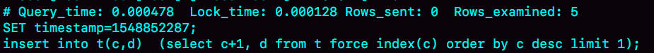
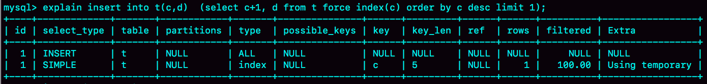

# 40讲insert语句的锁为什么这么多

在上一篇文章中，我提到MySQL对自增主键锁做了优化，尽量在申请到自增id以后，就释放自增锁。

因此，insert语句是一个很轻量的操作。不过，这个结论对于“普通的insert语句”才有效。也就是说，还有些insert语句是属于“特殊情况”的，在执行过程中需要给其他资源加锁，或者无法在申请到自增id以后就立马释放自增锁。

那么，今天这篇文章，我们就一起来聊聊这个话题。

# insert … select 语句

我们先从昨天的问题说起吧。表t和t2的表结构、初始化数据语句如下，今天的例子我们还是针对这两个表展开。

```
CREATE TABLE `t` (
  `id` int(11) NOT NULL AUTO_INCREMENT,
  `c` int(11) DEFAULT NULL,
  `d` int(11) DEFAULT NULL,
  PRIMARY KEY (`id`),
  UNIQUE KEY `c` (`c`)
) ENGINE=InnoDB;

insert into t values(null, 1,1);
insert into t values(null, 2,2);
insert into t values(null, 3,3);
insert into t values(null, 4,4);

create table t2 like t
```

现在，我们一起来看看为什么在可重复读隔离级别下，binlog_format=statement时执行：

```
insert into t2(c,d) select c,d from t;
```

这个语句时，需要对表t的所有行和间隙加锁呢？

其实，这个问题我们需要考虑的还是日志和数据的一致性。我们看下这个执行序列：


图1 并发insert场景

实际的执行效果是，如果session B先执行，由于这个语句对表t主键索引加了(-∞,1]这个next-key lock，会在语句执行完成后，才允许session A的insert语句执行。

但如果没有锁的话，就可能出现session B的insert语句先执行，但是后写入binlog的情况。于是，在binlog_format=statement的情况下，binlog里面就记录了这样的语句序列：

```
insert into t values(-1,-1,-1);
insert into t2(c,d) select c,d from t;
```

这个语句到了备库执行，就会把id=-1这一行也写到表t2中，出现主备不一致。

# insert 循环写入

当然了，执行insert … select 的时候，对目标表也不是锁全表，而是只锁住需要访问的资源。

如果现在有这么一个需求：要往表t2中插入一行数据，这一行的c值是表t中c值的最大值加1。

此时，我们可以这么写这条SQL语句 ：

```
insert into t2(c,d)  (select c+1, d from t force index(c) order by c desc limit 1);
```

这个语句的加锁范围，就是表t索引c上的(4,supremum]这个next-key lock和主键索引上id=4这一行。

它的执行流程也比较简单，从表t中按照索引c倒序，扫描第一行，拿到结果写入到表t2中。

因此整条语句的扫描行数是1。

这个语句执行的慢查询日志（slow log），如下图所示：


图2 慢查询日志--将数据插入表t2

通过这个慢查询日志，我们看到Rows_examined=1，正好验证了执行这条语句的扫描行数为1。

那么，如果我们是要把这样的一行数据插入到表t中的话：

```
insert into t(c,d)  (select c+1, d from t force index(c) order by c desc limit 1);
```

语句的执行流程是怎样的？扫描行数又是多少呢？

这时候，我们再看慢查询日志就会发现不对了。



图3 慢查询日志--将数据插入表t

可以看到，这时候的Rows_examined的值是5。

我在前面的文章中提到过，希望你都能够学会用explain的结果来“脑补”整条语句的执行过程。今天，我们就来一起试试。

如图4所示就是这条语句的explain结果。



图4 explain结果

从Extra字段可以看到“Using temporary”字样，表示这个语句用到了临时表。也就是说，执行过程中，需要把表t的内容读出来，写入临时表。

图中rows显示的是1，我们不妨先对这个语句的执行流程做一个猜测：如果说是把子查询的结果读出来（扫描1行），写入临时表，然后再从临时表读出来（扫描1行），写回表t中。那么，这个语句的扫描行数就应该是2，而不是5。

所以，这个猜测不对。实际上，Explain结果里的rows=1是因为受到了limit 1 的影响。

从另一个角度考虑的话，我们可以看看InnoDB扫描了多少行。如图5所示，是在执行这个语句前后查看Innodb_rows_read的结果。


图5 查看 Innodb_rows_read变化

可以看到，这个语句执行前后，Innodb_rows_read的值增加了4。因为默认临时表是使用Memory引擎的，所以这4行查的都是表t，也就是说对表t做了全表扫描。

这样，我们就把整个执行过程理清楚了：

1. 创建临时表，表里有两个字段c和d。
2. 按照索引c扫描表t，依次取c=4、3、2、1，然后回表，读到c和d的值写入临时表。这时，Rows_examined=4。
3. 由于语义里面有limit 1，所以只取了临时表的第一行，再插入到表t中。这时，Rows_examined的值加1，变成了5。

也就是说，这个语句会导致在表t上做全表扫描，并且会给索引c上的所有间隙都加上共享的next-key lock。所以，这个语句执行期间，其他事务不能在这个表上插入数据。

至于这个语句的执行为什么需要临时表，原因是这类一边遍历数据，一边更新数据的情况，如果读出来的数据直接写回原表，就可能在遍历过程中，读到刚刚插入的记录，新插入的记录如果参与计算逻辑，就跟语义不符。

由于实现上这个语句没有在子查询中就直接使用limit 1，从而导致了这个语句的执行需要遍历整个表t。它的优化方法也比较简单，就是用前面介绍的方法，先insert into到临时表temp_t，这样就只需要扫描一行；然后再从表temp_t里面取出这行数据插入表t1。

当然，由于这个语句涉及的数据量很小，你可以考虑使用内存临时表来做这个优化。使用内存临时表优化时，语句序列的写法如下：

```
create temporary table temp_t(c int,d int) engine=memory;
insert into temp_t  (select c+1, d from t force index(c) order by c desc limit 1);
insert into t select * from temp_t;
drop table temp_t;
```

# insert 唯一键冲突

前面的两个例子是使用insert … select的情况，接下来我要介绍的这个例子就是最常见的insert语句出现唯一键冲突的情况。

对于有唯一键的表，插入数据时出现唯一键冲突也是常见的情况了。我先给你举一个简单的唯一键冲突的例子。


图6 唯一键冲突加锁

这个例子也是在可重复读（repeatable read）隔离级别下执行的。可以看到，session B要执行的insert语句进入了锁等待状态。

也就是说，session A执行的insert语句，发生主键冲突的时候，并不只是简单地报错返回，还在冲突的索引上加了锁。我们前面说过，一个next-key lock就是由它右边界的值定义的。这时候，session A持有索引c上的(5,10]共享next-key lock（读锁）。

至于为什么要加这个读锁，其实我也没有找到合理的解释。从作用上来看，这样做可以避免这一行被别的事务删掉。

这里[官方文档](https://dev.mysql.com/doc/refman/8.0/en/innodb-locks-set.html)有一个描述错误，认为如果冲突的是主键索引，就加记录锁，唯一索引才加next-key lock。但实际上，这两类索引冲突加的都是next-key lock。

> 备注：这个bug，是我在写这篇文章查阅文档时发现的，已经[发给官方](https://bugs.mysql.com/bug.php?id=93806)并被verified了。

有同学在前面文章的评论区问到，在有多个唯一索引的表中并发插入数据时，会出现死锁。但是，由于他没有提供复现方法或者现场，我也无法做分析。所以，我建议你在评论区发问题的时候，尽量同时附上复现方法，或者现场信息，这样我才好和你一起分析问题。

这里，我就先和你分享一个经典的死锁场景，如果你还遇到过其他唯一键冲突导致的死锁场景，也欢迎给我留言。


图7 唯一键冲突--死锁

在session A执行rollback语句回滚的时候，session C几乎同时发现死锁并返回。

这个死锁产生的逻辑是这样的：

1. 在T1时刻，启动session A，并执行insert语句，此时在索引c的c=5上加了记录锁。注意，这个索引是唯一索引，因此退化为记录锁（如果你的印象模糊了，可以回顾下[第21篇文章](https://time.geekbang.org/column/article/75659)介绍的加锁规则）。
2. 在T2时刻，session B要执行相同的insert语句，发现了唯一键冲突，加上读锁；同样地，session C也在索引c上，c=5这一个记录上，加了读锁。
3. T3时刻，session A回滚。这时候，session B和session C都试图继续执行插入操作，都要加上写锁。两个session都要等待对方的行锁，所以就出现了死锁。

这个流程的状态变化图如下所示。


图8 状态变化图--死锁

# insert into … on duplicate key update

上面这个例子是主键冲突后直接报错，如果是改写成

```
insert into t values(11,10,10) on duplicate key update d=100; 
```

的话，就会给索引c上(5,10] 加一个排他的next-key lock（写锁）。

**insert into … on duplicate key update 这个语义的逻辑是，插入一行数据，如果碰到唯一键约束，就执行后面的更新语句。**

注意，如果有多个列违反了唯一性约束，就会按照索引的顺序，修改跟第一个索引冲突的行。

现在表t里面已经有了(1,1,1)和(2,2,2)这两行，我们再来看看下面这个语句执行的效果：


图9 两个唯一键同时冲突

可以看到，主键id是先判断的，MySQL认为这个语句跟id=2这一行冲突，所以修改的是id=2的行。

需要注意的是，执行这条语句的affected rows返回的是2，很容易造成误解。实际上，真正更新的只有一行，只是在代码实现上，insert和update都认为自己成功了，update计数加了1， insert计数也加了1。

# 小结

今天这篇文章，我和你介绍了几种特殊情况下的insert语句。

insert … select 是很常见的在两个表之间拷贝数据的方法。你需要注意，在可重复读隔离级别下，这个语句会给select的表里扫描到的记录和间隙加读锁。

而如果insert和select的对象是同一个表，则有可能会造成循环写入。这种情况下，我们需要引入用户临时表来做优化。

insert 语句如果出现唯一键冲突，会在冲突的唯一值上加共享的next-key lock(S锁)。因此，碰到由于唯一键约束导致报错后，要尽快提交或回滚事务，避免加锁时间过长。

最后，我给你留一个问题吧。

你平时在两个表之间拷贝数据用的是什么方法，有什么注意事项吗？在你的应用场景里，这个方法，相较于其他方法的优势是什么呢？

你可以把你的经验和分析写在评论区，我会在下一篇文章的末尾选取有趣的评论来和你一起分析。感谢你的收听，也欢迎你把这篇文章分享给更多的朋友一起阅读。

# 上期问题时间

我们已经在文章中回答了上期问题。

有同学提到，如果在insert … select 执行期间有其他线程操作原表，会导致逻辑错误。其实，这是不会的，如果不加锁，就是快照读。

一条语句执行期间，它的一致性视图是不会修改的，所以即使有其他事务修改了原表的数据，也不会影响这条语句看到的数据。

评论区留言点赞板：

> @长杰 同学回答得非常准确。

## 精选留言

- 

    huolang

    老师，死锁的例子，关于sessionA拿到的c=5的记录锁，sessionB和sessionC发现唯一键冲突会加上读锁我有几个疑惑：
    \1. sessionA拿到的c=5的记录锁是写锁吗？
    \2. 为什么sessionB和sessionC发现唯一键冲突会加上读锁？
    \3. 如果sessionA拿到c=5的记录所是写锁，那为什么sessionB和sessionC还能加c=5的读锁，写锁和读锁不应该是互斥的吗？
    \4. sessionA还没有提交，为什么sessionB和sessionC能发现唯一键冲突？

    2019-02-13 17:33

    作者回复

    \1. 是的
    \2. 这个我觉得是为了防止这个记录再被删除（不过这个理由不是很硬，我还没有找到其他解释
    \3. 互斥的，所以这两个语句都在等待。注意next-key lock是由间隙锁和记录锁组成的哦， 间隙锁加成功了的。好问题。
    \4. 还没有提交，但是这个记录已经作为最新记录写进去了，复习一下08篇哈

    2019-02-14 10:45

- 

    滔滔

    老师，之前提到的一个有趣的问题"A、B两个用户，如果互相喜欢，则成为好友。设计上是有两张表，一个是like表，一个是friend表，like表有user_id、liker_id两个字段，我设置为复合唯一索引即uk_user_id_liker_id。语句执行顺序是这样的：
    以A喜欢B为例：
    1、先查询对方有没有喜欢自己（B有没有喜欢A）
    select * from like where user_id = B and liker_id = A
    2、如果有，则成为好友
    insert into friend
    3、没有，则只是喜欢关系
    insert into like"，这个问题中如果把select语句改成"当前读"，则当出现A,B两个人同时喜欢对方的情况下，是不是会出现由于"当前读"加的gap锁导致后面insert语句阻塞，从而发生死锁？

    2019-02-13 14:28

    作者回复

    好问题

    这种情况下一般是造成锁等待，不会造成死锁吧

    2019-02-14 10:18

- 

    夹心面包

    
    1 关于insert造成死锁的情况,我之前做过测试,事务1并非只有insert,delete和update都可能造成死锁问题,核心还是插入唯一值冲突导致的.我们线上的处理办法是 1 去掉唯一值检测 2减少重复值的插入 3降低并发线程数量
    2 关于数据拷贝大表我建议采用pt-archiver,这个工具能自动控制频率和速度,效果很不错,提议在低峰期进行数据操作

    2019-02-13 10:50

    作者回复

    ，这两点都是很有用的建议

    2019-02-13 15:39

- 

    sonic

    你好，
    我想问下文章中关于为什么需要创建临时表有这一句话：
    如果读出来的数据直接写回原表，就可能在遍历过程中，读到刚刚插入的记录，新插入的记录如果参与计算逻辑，就跟语义不符。

    我的疑问是：既然隔离级别是可重复读，照理来说新插入的的记录应该不会参与计算逻辑呀。

    2019-02-14 18:17

- 

    信信

    老师好，
    图6下方“发生主键冲突的时候”是不是应该改为“发生唯一键冲突的时候”？因为c不是主键。
    还有，图7下方：T2时刻session b 发现“唯一键冲突”，这里为啥不是锁冲突？因为如果没有锁冲突，仅有唯一键冲突，就对应图6的情况，这时加的是next-key lock，而不仅仅是记录锁了。

    2019-02-14 17:45

- 

    cyberbit

    在表件迁移拷贝数据，用的pt-archiver工具做的，但是它不支持utf8mb4字符集，这个问题一直困扰我，不知道怎么解决。

    2019-02-14 16:17

- 

    老杨同志

    课后问题：
    我用的最多还是insert into select 。如果数量比较大，会加上limit 100,000这种。并且看看后面的select条件是否走索引。缺点是会锁select的表。方法二：导出成excel，然后拼sql 成 insert into values(),(),()的形式。方法3，写类似淘宝调动的定时任务，任务的逻辑是查询100条记录，然后多个线程分到几个任务执行，比如是个线程，每个线程10条记录，插入后，在查询新的100条记录处理。

    

    2019-02-13 21:52

    作者回复

    

    2019-02-14 14:59

- 

    颜海航

    [Note] Multi-threaded slave: Coordinator has waited 8551 times hitting slave_pending_jobs_
    size_max; current event size = 8198. 老师 我们数据库一直报这个错，然后数据库就进行crash recovery，是是什么状况。。

    2019-02-13 19:39

- 

    夜空中最亮的星（华仔）

    老师威武。
    终于追上更新了。

    2019-02-13 18:54

- 

    lionetes

    mysql> insert into t select null,5,5; 已经又4条记录
    mysql> select * from t;
    | 1 | 1 | 1 |
    | 2 | 2 | 100 |
    | 3 | 3 | 3 |
    | 4 | 4 | 4 |
    | 5 | 5 | 5 |
    +----+------+------+
    5 rows in set (0.00 sec)

    mysql> select last_insert_id();
    +------------------+
    | last_insert_id() |
    +------------------+
    | 5 |
    +------------------+
    1 row in set (0.00 sec)

    mysql> select * from t2; 已经有三条记录
    +----+------+------+
    | id | c | d |
    +----+------+------+
    | 5 | 1 | NULL |
    | 6 | 6 | 6 |
    | 7 | 7 | 7 |
    +----+------+------+
    3 rows in set (0.01 sec)
    mysql> select last_insert_id(); 此处的自增ID 是否理解为 最近一次的 insert 操作的 获取的ID
    +------------------+
    | last_insert_id() |
    +------------------+
    | 5 |
    +------------------+
    1 row in set (0.00 sec)

    mysql> insert into t2 select null,8,8;
    Query OK, 1 row affected (0.01 sec)
    Records: 1 Duplicates: 0 Warnings: 0

    mysql> select last_insert_id();
    +------------------+
    | last_insert_id() |
    +------------------+
    | 8 |
    +------------------+
    1 row in set (0.00 sec)

    mysql> select * from t2;
    +----+------+------+
    | id | c | d |
    +----+------+------+
    | 5 | 1 | NULL |
    | 6 | 6 | 6 |
    | 7 | 7 | 7 |
    | 8 | 8 | 8 |
    +----+------+------+
    4 rows in set (0.00 sec)
    mysql> select last_insert_id(); 此处的自增ID 是否理解为 最近一次的 insert 操作的 获取的ID
    +------------------+
    | last_insert_id() |
    +------------------+
    | 8 |
    +------------------+
    1 row in set (0.00 sec)
    上面的 ID 与那个表没有关系, 至于当前session insert 最新一次记录为准
    mysql> select last_insert_id();
    | 8 |
    +------------------+
    1 row in set (0.00 sec)
    mysql> insert into t2 select 19,19,19;
    mysql> select last_insert_id();
    +------------------+
    | last_insert_id() |
    +------------------+
    | 8 |
    +------------------+
    1 row in set (0.00 sec)
    mysql> insert into t2 select null,20,20;
    Query OK, 1 row affected (0.01 sec)
    Records: 1 Duplicates: 0 Warnings: 0

    mysql> select last_insert_id();
    +------------------+
    | last_insert_id() |
    +------------------+
    | 20 |
    +------------------+
    ID 除非为空的时候 才能获取到新的last_insert_id

    2019-02-13 17:28

    作者回复

    很好的验证
    你再试试一个insert插入多行的例子，就完整了

    2019-02-14 10:32

- 

    郭烊千玺

    有个问题想请教下大神 information_schema.tables 表里的这三个字段data_length data_free index_length的值准确吗，mysql内部是怎么计算每个表的这个三个值的？在没有碎片的情况下，实践上用du 命令统计的ibd的大小和这几个字段的值感觉差别很大，所以很想知道这几个字段的值得准确度如何，还是仅供参考，因为实践中可能需要知道是否有碎片，如果date_free值不准确，而盲目的alter table一下，表大的话代价很高啊 求回答啊 感觉这也是很多dba关心的一个问题

    2019-02-13 17:26

- 

    roaming

    MySQL8.0.12环境下，
    执行insert into t(c,d) (select c+1, d from t force index(c) order by c desc limit 1);
    slow log Rows_examined: 2
    Innodb_rows_read 的值增加1

    是不是MySQL8进行了优化，先把子查询的结果读出来，再写入临时表？

    2019-02-13 16:28

    作者回复

    看来是的了，

    ，很好的验证，我加到明天文章末尾说明

    2019-02-14 16:41

- 

    一大只

    老师，我想问下：insert 语句出现唯一键冲突，会加next-key lock，而产生死锁的例子中，同样也是唯一键冲突却只加了记录锁，然后我按照唯一键冲突中的两个例子试了试
    1、比如t表中有两条记录(19,19,19)，(22,22,22)，这时候我再insert (22,22,22)造成了主键冲突，这时候加的就是(19,22]的next-key lock，这个insert为啥不是等值查询？
    2、根据死锁的例子，我又在t表中准备插入一行
    session A :begin; insert into t values (25,25,25)
    session B :insert into t values (25,25,25) 这时候sessionB锁等待
    session C：insert into t values (24,24,24) 锁等待，等B锁等待超时，session C插入成功
    那这里的session B应该是加了个(22,25]的next-key lock，并没有因为是唯一键退化成记录锁
    我想死锁的例子中t表已经有了(1,1,1),(2,2,2),(3,3,3),(4,4,4)4条记录，这时候insert (null,5,5)，是不是加的(4,5]这个next-key lock，由于是整型并且间隙非常小，所以将他当成记录锁？

    2019-02-13 14:26

    作者回复

    “那这里的session B应该是加了个(22,25]的next-key lock，并没有因为是唯一键退化成记录锁” 由于insert主键冲突导致的锁，是不会退化的。

    session B 加了next-key lock，
    这样session C插入也要等待，然后等session B超时，释放了这个next-key lock，session C就可以执行了。
    跟我们文中说的是一致的哦。

    
    你这个验证挺合理的呀，

    不会有因为“间隙非常小，所以将他当成记录锁”这种逻辑哈, a和a+1之间也是有间隙的。

    不过这个是个好的实验和好问题

    2019-02-14 16:40

- 

    滔滔

    老师您好，想问一下next key lock是gap锁和行锁的组合，但究竟是gap锁和共享锁还是排它锁的组合是不是要看具体的sql语句？具体哪些sql语句中的next key lock是由共享锁组成，哪些是由排它锁组成呢？

    2019-02-13 13:03

    作者回复

    一般select ...lock in share mode就是共享锁；
    select ... for update 和 IUD语句，就是排他锁。

    2019-02-14 10:15

- 

    K先生

    表结构
    CREATE TABLE `PushTask` (
    `Id` int(11) NOT NULL AUTO_INCREMENT COMMENT '主键ID，自增长',
    `DpId` varchar(100) NOT NULL DEFAULT '',
    `DetailId` int(11) NOT NULL,
    `SceneType` tinyint(1) DEFAULT NULL,
    `DataId` int(11) DEFAULT NULL,
    `SendTime` datetime NOT NULL,
    `AddTime` datetime NOT NULL DEFAULT CURRENT_TIMESTAMP,
    `UpdateTime` timestamp NOT NULL DEFAULT CURRENT_TIMESTAMP ON UPDATE CURRENT_TIMESTAMP,
    `Status` tinyint(1) DEFAULT '0',
    `SendDate` date DEFAULT NULL,
    PRIMARY KEY (`Id`),
    UNIQUE KEY `IX_DpId_SendDate_DetailId` (`DpId`,`SendDate`,`DetailId`),
    KEY `IX_UpdateTime` (`UpdateTime`),
    KEY `IX_SendTime` (`SendTime`)
    ) ENGINE=InnoDB DEFAULT CHARSET=utf8;

    请问老师，为啥insert ... ON DUPLICATE KEY UPDATE
    UpdateTime = now()的时候会出现死锁？

    2019-02-13 10:22

    作者回复

    show engine innodb status\G
    里面lastest deadlock那一段发来看下哈

    2019-02-13 16:41