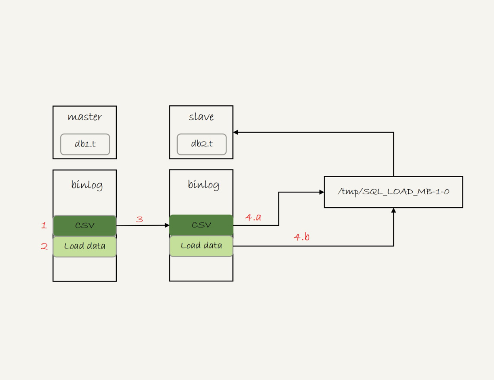
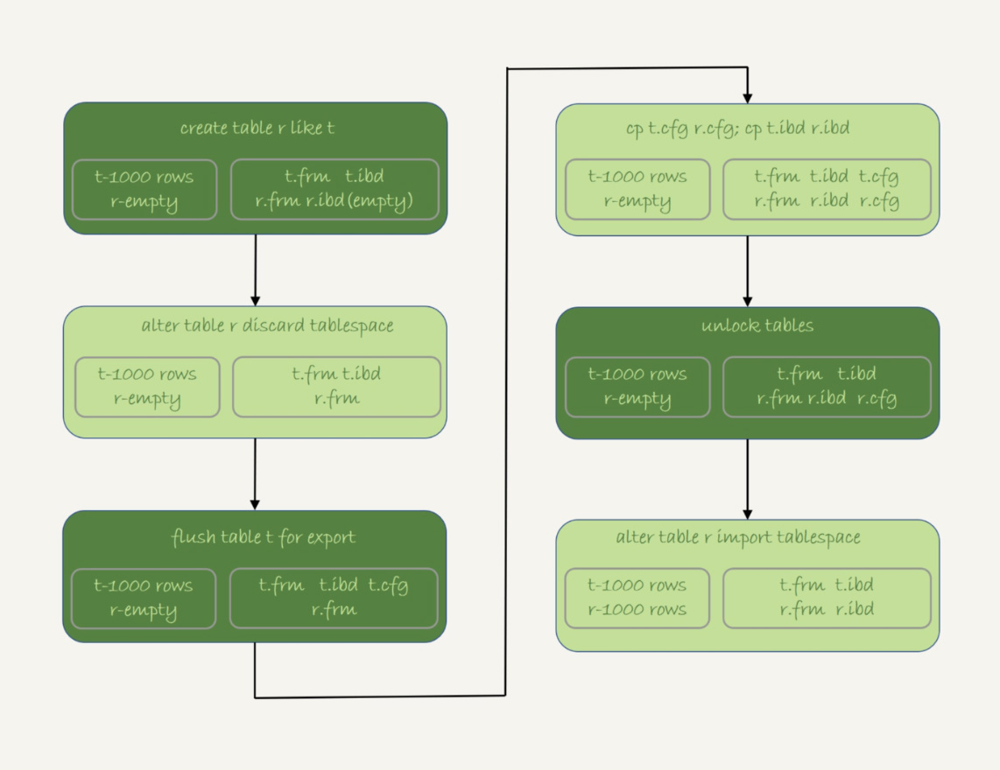

# 41讲怎么最快地复制一张表

我在上一篇文章最后，给你留下的问题是怎么在两张表中拷贝数据。如果可以控制对源表的扫描行数和加锁范围很小的话，我们简单地使用insert … select 语句即可实现。

当然，为了避免对源表加读锁，更稳妥的方案是先将数据写到外部文本文件，然后再写回目标表。这时，有两种常用的方法。接下来的内容，我会和你详细展开一下这两种方法。

为了便于说明，我还是先创建一个表db1.t，并插入1000行数据，同时创建一个相同结构的表db2.t。

```
create database db1;
use db1;

create table t(id int primary key, a int, b int, index(a))engine=innodb;
delimiter ;;
  create procedure idata()
  begin
    declare i int;
    set i=1;
    while(i<=1000)do
      insert into t values(i,i,i);
      set i=i+1;
    end while;
  end;;
delimiter ;
call idata();

create database db2;
create table db2.t like db1.t
```

假设，我们要把db1.t里面a>900的数据行导出来，插入到db2.t中。

# mysqldump方法

一种方法是，使用mysqldump命令将数据导出成一组INSERT语句。你可以使用下面的命令：

```
mysqldump -h$host -P$port -u$user --add-locks --no-create-info --single-transaction  --set-gtid-purged=OFF db1 t --where="a>900" --result-file=/client_tmp/t.sql
```

把结果输出到临时文件。

这条命令中，主要参数含义如下：

1. –single-transaction的作用是，在导出数据的时候不需要对表db1.t加表锁，而是使用START TRANSACTION WITH CONSISTENT SNAPSHOT的方法；
2. –add-locks设置为0，表示在输出的文件结果里，不增加" LOCK TABLES `t` WRITE;" ；
3. –no-create-info的意思是，不需要导出表结构；
4. –set-gtid-purged=off表示的是，不输出跟GTID相关的信息；
5. –result-file指定了输出文件的路径，其中client表示生成的文件是在客户端机器上的。

通过这条mysqldump命令生成的t.sql文件中就包含了如图1所示的INSERT语句。


图1 mysqldump输出文件的部分结果

可以看到，一条INSERT语句里面会包含多个value对，这是为了后续用这个文件来写入数据的时候，执行速度可以更快。

如果你希望生成的文件中一条INSERT语句只插入一行数据的话，可以在执行mysqldump命令时，加上参数–skip-extended-insert。

然后，你可以通过下面这条命令，将这些INSERT语句放到db2库里去执行。

```
mysql -h127.0.0.1 -P13000  -uroot db2 -e "source /client_tmp/t.sql"
```

需要说明的是，source并不是一条SQL语句，而是一个客户端命令。mysql客户端执行这个命令的流程是这样的：

1. 打开文件，默认以分号为结尾读取一条条的SQL语句；
2. 将SQL语句发送到服务端执行。

也就是说，服务端执行的并不是这个“source t.sql"语句，而是INSERT语句。所以，不论是在慢查询日志（slow log），还是在binlog，记录的都是这些要被真正执行的INSERT语句。

# 导出CSV文件

另一种方法是直接将结果导出成.csv文件。MySQL提供了下面的语法，用来将查询结果导出到服务端本地目录：

```
select * from db1.t where a>900 into outfile '/server_tmp/t.csv';
```

我们在使用这条语句时，需要注意如下几点。

1. 这条语句会将结果保存在服务端。如果你执行命令的客户端和MySQL服务端不在同一个机器上，客户端机器的临时目录下是不会生成t.csv文件的。
2. into outfile指定了文件的生成位置（/server_tmp/），这个位置必须受参数secure_file_priv的限制。参数secure_file_priv的可选值和作用分别是：
    - 如果设置为empty，表示不限制文件生成的位置，这是不安全的设置；
    - 如果设置为一个表示路径的字符串，就要求生成的文件只能放在这个指定的目录，或者它的子目录；
    - 如果设置为NULL，就表示禁止在这个MySQL实例上执行select … into outfile 操作。
3. 这条命令不会帮你覆盖文件，因此你需要确保/server_tmp/t.csv这个文件不存在，否则执行语句时就会因为有同名文件的存在而报错。
4. 这条命令生成的文本文件中，原则上一个数据行对应文本文件的一行。但是，如果字段中包含换行符，在生成的文本中也会有换行符。不过类似换行符、制表符这类符号，前面都会跟上“\”这个转义符，这样就可以跟字段之间、数据行之间的分隔符区分开。

得到.csv导出文件后，你就可以用下面的load data命令将数据导入到目标表db2.t中。

```
load data infile '/server_tmp/t.csv' into table db2.t;
```

这条语句的执行流程如下所示。

1. 打开文件/server_tmp/t.csv，以制表符(\t)作为字段间的分隔符，以换行符（\n）作为记录之间的分隔符，进行数据读取；
2. 启动事务。
3. 判断每一行的字段数与表db2.t是否相同：
    - 若不相同，则直接报错，事务回滚；
    - 若相同，则构造成一行，调用InnoDB引擎接口，写入到表中。
4. 重复步骤3，直到/server_tmp/t.csv整个文件读入完成，提交事务。

你可能有一个疑问，**如果binlog_format=statement，这个load语句记录到binlog里以后，怎么在备库重放呢？**

由于/server_tmp/t.csv文件只保存在主库所在的主机上，如果只是把这条语句原文写到binlog中，在备库执行的时候，备库的本地机器上没有这个文件，就会导致主备同步停止。

所以，这条语句执行的完整流程，其实是下面这样的。

1. 主库执行完成后，将/server_tmp/t.csv文件的内容直接写到binlog文件中。
2. 往binlog文件中写入语句load data local infile ‘/tmp/SQL_LOAD_MB-1-0’ INTO TABLE `db2`.`t`。
3. 把这个binlog日志传到备库。
4. 备库的apply线程在执行这个事务日志时：
    a. 先将binlog中t.csv文件的内容读出来，写入到本地临时目录/tmp/SQL_LOAD_MB-1-0 中；
    b. 再执行load data语句，往备库的db2.t表中插入跟主库相同的数据。

执行流程如图2所示：



图2 load data的同步流程

注意，这里备库执行的load data语句里面，多了一个“local”。它的意思是“将执行这条命令的客户端所在机器的本地文件/tmp/SQL_LOAD_MB-1-0的内容，加载到目标表db2.t中”。

也就是说，**load data命令有两种用法**：

1. 不加“local”，是读取服务端的文件，这个文件必须在secure_file_priv指定的目录或子目录下；
2. 加上“local”，读取的是客户端的文件，只要mysql客户端有访问这个文件的权限即可。这时候，MySQL客户端会先把本地文件传给服务端，然后执行上述的load data流程。

另外需要注意的是，**select …into outfile方法不会生成表结构文件**, 所以我们导数据时还需要单独的命令得到表结构定义。mysqldump提供了一个–tab参数，可以同时导出表结构定义文件和csv数据文件。这条命令的使用方法如下：

```
mysqldump -h$host -P$port -u$user ---single-transaction  --set-gtid-purged=OFF db1 t --where="a>900" --tab=$secure_file_priv
```

这条命令会在$secure_file_priv定义的目录下，创建一个t.sql文件保存建表语句，同时创建一个t.txt文件保存CSV数据。

# 物理拷贝方法

前面我们提到的mysqldump方法和导出CSV文件的方法，都是逻辑导数据的方法，也就是将数据从表db1.t中读出来，生成文本，然后再写入目标表db2.t中。

你可能会问，有物理导数据的方法吗？比如，直接把db1.t表的.frm文件和.ibd文件拷贝到db2目录下，是否可行呢？

答案是不行的。

因为，一个InnoDB表，除了包含这两个物理文件外，还需要在数据字典中注册。直接拷贝这两个文件的话，因为数据字典中没有db2.t这个表，系统是不会识别和接受它们的。

不过，在MySQL 5.6版本引入了**可传输表空间**(transportable tablespace)的方法，可以通过导出+导入表空间的方式，实现物理拷贝表的功能。

假设我们现在的目标是在db1库下，复制一个跟表t相同的表r，具体的执行步骤如下：

1. 执行 create table r like t，创建一个相同表结构的空表；
2. 执行alter table r discard tablespace，这时候r.ibd文件会被删除；
3. 执行flush table t for export，这时候db1目录下会生成一个t.cfg文件；
4. 在db1目录下执行cp t.cfg r.cfg; cp t.ibd r.ibd；这两个命令；
5. 执行unlock tables，这时候t.cfg文件会被删除；
6. 执行alter table r import tablespace，将这个r.ibd文件作为表r的新的表空间，由于这个文件的数据内容和t.ibd是相同的，所以表r中就有了和表t相同的数据。

至此，拷贝表数据的操作就完成了。这个流程的执行过程图如下：



图3 物理拷贝表

关于拷贝表的这个流程，有以下几个注意点：

1. 在第3步执行完flsuh table命令之后，db1.t整个表处于只读状态，直到执行unlock tables命令后才释放读锁；
2. 在执行import tablespace的时候，为了让文件里的表空间id和数据字典中的一致，会修改t.ibd的表空间id。而这个表空间id存在于每一个数据页中。因此，如果是一个很大的文件（比如TB级别），每个数据页都需要修改，所以你会看到这个import语句的执行是需要一些时间的。当然，如果是相比于逻辑导入的方法，import语句的耗时是非常短的。

# 小结

今天这篇文章，我和你介绍了三种将一个表的数据导入到另外一个表中的方法。

我们来对比一下这三种方法的优缺点。

1. 物理拷贝的方式速度最快，尤其对于大表拷贝来说是最快的方法。如果出现误删表的情况，用备份恢复出误删之前的临时库，然后再把临时库中的表拷贝到生产库上，是恢复数据最快的方法。但是，这种方法的使用也有一定的局限性：
    - 必须是全表拷贝，不能只拷贝部分数据；
    - 需要到服务器上拷贝数据，在用户无法登录数据库主机的场景下无法使用；
    - 由于是通过拷贝物理文件实现的，源表和目标表都是使用InnoDB引擎时才能使用。
2. 用mysqldump生成包含INSERT语句文件的方法，可以在where参数增加过滤条件，来实现只导出部分数据。这个方式的不足之一是，不能使用join这种比较复杂的where条件写法。
3. 用select … into outfile的方法是最灵活的，支持所有的SQL写法。但，这个方法的缺点之一就是，每次只能导出一张表的数据，而且表结构也需要另外的语句单独备份。

后两种方式都是逻辑备份方式，是可以跨引擎使用的。

最后，我给你留下一个思考题吧。

我们前面介绍binlog_format=statement的时候，binlog记录的load data命令是带local的。既然这条命令是发送到备库去执行的，那么备库执行的时候也是本地执行，为什么需要这个local呢？如果写到binlog中的命令不带local，又会出现什么问题呢？

你可以把你的分析写在评论区，我会在下一篇文章的末尾和你讨论这个问题。感谢你的收听，也欢迎你把这篇文章分享给更多的朋友一起阅读。

# 上期问题时间

我在上篇文章最后给你留下的思考题，已经在今天这篇文章的正文部分做了回答。

上篇文章的评论区有几个非常好的留言，我在这里和你分享一下。

@huolang 同学提了一个问题：如果sessionA拿到c=5的记录锁是写锁，那为什么sessionB和sessionC还能加c=5的读锁呢？

这是因为next-key lock是先加间隙锁，再加记录锁的。加间隙锁成功了，加记录锁就会被堵住。如果你对这个过程有疑问的话，可以再复习一下[第30篇文章](https://time.geekbang.org/column/article/78427)中的相关内容。

@一大只 同学做了一个实验，验证了主键冲突以后，insert语句加间隙锁的效果。比我在上篇文章正文中提的那个回滚导致死锁的例子更直观，体现了他对这个知识点非常好的理解和思考，很赞。

@roaming 同学验证了在MySQL 8.0版本中，已经能够用临时表处理insert … select写入原表的语句了。

@老杨同志 的回答提到了我们本文中说到的几个方法。


## 精选留言

- 

    ☆appleう

    老师，我想问一个关于事务的问题，一个事务中有3个操作，插入一条数据(本地操作),更新一条数据(本地操作)，然后远程调用，通知对方更新上面数据(如果远程调用失败会重试，最多3次，如果遇到网络等问题，远程调用时间会达到5s,极端情况3次会达到15s)，那么极端情况事务将长达5-15s，这样会带来什么影响吗？

    2019-02-15 08:36

- 

    尘封

    老师mysqldump导出的文件里，单条sql里的value值有什么限制吗默认情况下，假如一个表有几百万，那mysql会分为多少个sql导出？
    问题：因为从库可能没有load的权限，所以local

    2019-02-15 08:40