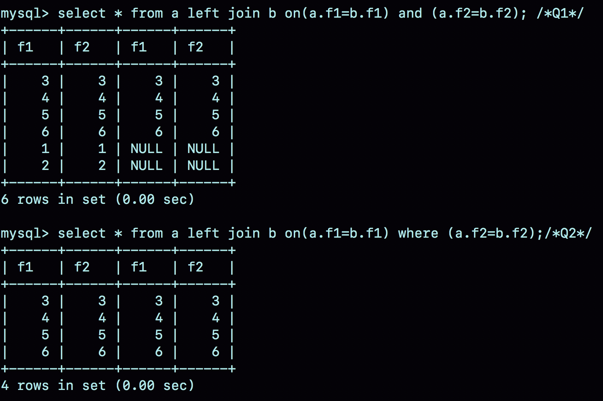
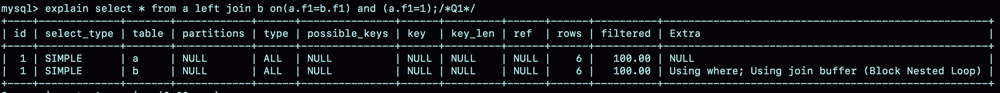
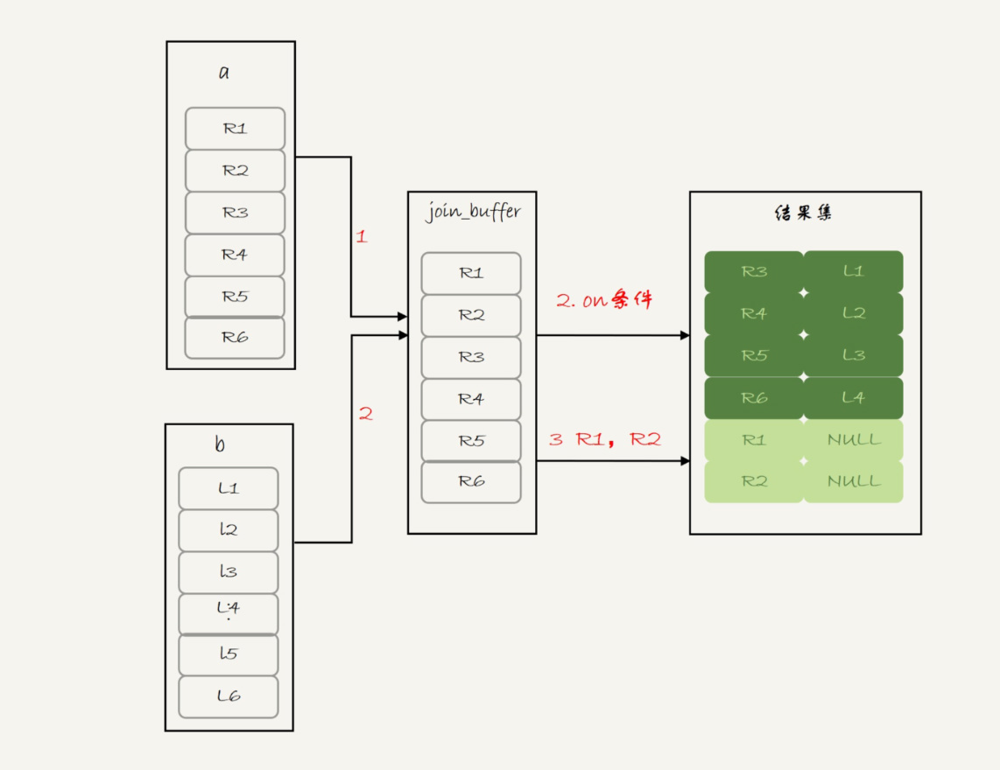
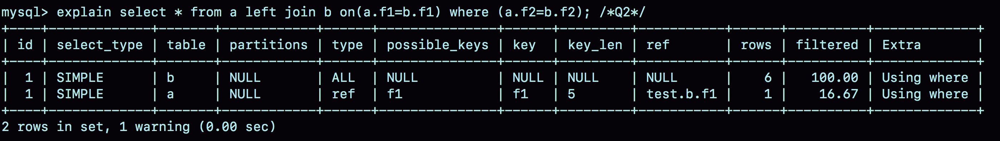
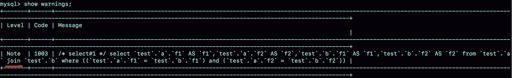
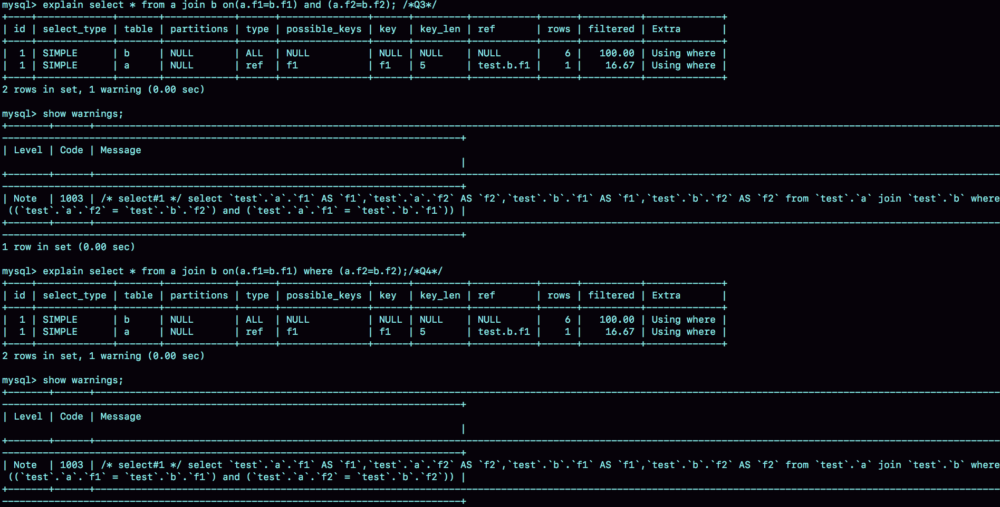
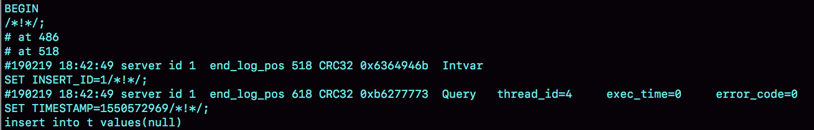

# 44讲答疑文章（三）：说一说这些好问题

这是我们专栏的最后一篇答疑文章，今天我们来说说一些好问题。

在我看来，能够帮我们扩展一个逻辑的边界的问题，就是好问题。因为通过解决这样的问题，能够加深我们对这个逻辑的理解，或者帮我们关联到另外一个知识点，进而可以帮助我们建立起自己的知识网络。

在工作中会问好问题，是一个很重要的能力。

经过这段时间的学习，从评论区的问题我可以感觉出来，紧跟课程学习的同学，对 SQL 语句执行性能的感觉越来越好了，提出的问题也越来越细致和精准了。

接下来，我们就一起看看同学们在评论区提到的这些好问题。在和你一起分析这些问题的时候，我会指出它们具体是在哪篇文章出现的。同时，在回答这些问题的过程中，我会假设你已经掌握了这篇文章涉及的知识。当然，如果你印象模糊了，也可以跳回文章再复习一次。

# join的写法

在第 35 篇文章[《join语句怎么优化？》](https://time.geekbang.org/column/article/80147)中，我在介绍 join 执行顺序的时候，用的都是 straight_join。@郭健 同学在文后提出了两个问题：

1. 如果用 left join 的话，左边的表一定是驱动表吗？
2. 如果两个表的 join 包含多个条件的等值匹配，是都要写到 on 里面呢，还是只把一个条件写到 on 里面，其他条件写到 where 部分？

为了同时回答这两个问题，我来构造两个表 a 和 b：

```
create table a(f1 int, f2 int, index(f1))engine=innodb;
create table b(f1 int, f2 int)engine=innodb;
insert into a values(1,1),(2,2),(3,3),(4,4),(5,5),(6,6);
insert into b values(3,3),(4,4),(5,5),(6,6),(7,7),(8,8);
```

表 a 和 b 都有两个字段 f1 和 f2，不同的是表 a 的字段 f1 上有索引。然后，我往两个表中都插入了 6 条记录，其中在表 a 和 b 中同时存在的数据有 4 行。

@郭健 同学提到的第二个问题，其实就是下面这两种写法的区别：

```
select * from a left join b on(a.f1=b.f1) and (a.f2=b.f2); /*Q1*/
select * from a left join b on(a.f1=b.f1) where (a.f2=b.f2);/*Q2*/
```

我把这两条语句分别记为 Q1 和 Q2。

首先，需要说明的是，这两个 left join 语句的语义逻辑并不相同。我们先来看一下它们的执行结果。



图 1 两个 join 的查询结果

可以看到：

- 语句 Q1 返回的数据集是 6 行，表 a 中即使没有满足匹配条件的记录，查询结果中也会返回一行，并将表 b 的各个字段值填成 NULL。
- 语句 Q2 返回的是 4 行。从逻辑上可以这么理解，最后的两行，由于表 b 中没有匹配的字段，结果集里面 b.f2 的值是空，不满足 where 部分的条件判断，因此不能作为结果集的一部分。

接下来，我们看看实际执行这两条语句时，MySQL 是怎么做的。

我们先一起看看语句 Q1 的 explain 结果：



图 2 Q1 的 explain 结果

可以看到，这个结果符合我们的预期：

- 驱动表是表 a，被驱动表是表 b；
- 由于表 b 的 f1 字段上没有索引，所以使用的是 Block Nexted Loop Join（简称 BNL） 算法。

看到 BNL 算法，你就应该知道这条语句的执行流程其实是这样的：

1. 把表 a 的内容读入 join_buffer 中。因为是 select * ，所以字段 f1 和 f2 都被放入 join_buffer 了。
2. 顺序扫描表 b，对于每一行数据，判断 join 条件（也就是 a.f1=b.f1 and a.f2=b.f2)是否满足，满足条件的记录, 作为结果集的一行返回。如果语句中有 where 子句，需要先判断 where 部分满足条件后，再返回。
3. 表 b 扫描完成后，对于没有被匹配的表 a 的行（在这个例子中就是(1,1)、(2,2)这两行），把剩余字段补上 NULL，再放入结果集中。

对应的流程图如下：



图 3 left join -BNL 算法

可以看到，这条语句确实是以表 a 为驱动表，而且从执行效果看，也和使用 straight_join 是一样的。

你可能会想，语句 Q2 的查询结果里面少了最后两行数据，是不是就是把上面流程中的步骤 3 去掉呢？我们还是先看一下语句 Q2 的 expain 结果吧。



图 4 Q2 的 explain 结果

这里先和你说一句题外话，专栏马上就结束了，我也和你一起根据 explain 结果“脑补”了很多次一条语句的执行流程了，所以我希望你已经具备了这个能力。今天，我们再一起分析一次 SQL 语句的 explain 结果。

可以看到，这条语句是以表 b 为驱动表的。而如果一条 join 语句的 Extra 字段什么都没写的话，就表示使用的是 Index Nested-Loop Join（简称 NLJ）算法。

因此，语句 Q2 的执行流程是这样的：顺序扫描表 b，每一行用 b.f1 到表 a 中去查，匹配到记录后判断 a.f2=b.f2 是否满足，满足条件的话就作为结果集的一部分返回。

那么，**为什么语句 Q1 和 Q2 这两个查询的执行流程会差距这么大呢？**其实，这是因为优化器基于 Q2 这个查询的语义做了优化。

为了理解这个问题，我需要再和你交代一个背景知识点：在 MySQL 里，NULL 跟任何值执行等值判断和不等值判断的结果，都是 NULL。这里包括， select NULL = NULL 的结果，也是返回 NULL。

因此，语句 Q2 里面 where a.f2=b.f2 就表示，查询结果里面不会包含 b.f2 是 NULL 的行，这样这个 left join 的语义就是“找到这两个表里面，f1、f2 对应相同的行。对于表 a 中存在，而表 b 中匹配不到的行，就放弃”。

这样，这条语句虽然用的是 left join，但是语义跟 join 是一致的。

因此，优化器就把这条语句的 left join 改写成了 join，然后因为表 a 的 f1 上有索引，就把表 b 作为驱动表，这样就可以用上 NLJ 算法。在执行 explain 之后，你再执行 show warnings，就能看到这个改写的结果，如图 5 所示。



图 5 Q2 的改写结果

这个例子说明，即使我们在 SQL 语句中写成 left join，执行过程还是有可能不是从左到右连接的。也就是说，**使用left join时，左边的表不一定是驱动表。**

这样看来，**如果需要 left join 的语义，就不能把被驱动表的字段放在 where 条件里面做等值判断或不等值判断，必须都写在 on 里面。**那如果是 join 语句呢？

这时候，我们再看看这两条语句：

```
select * from a join b on(a.f1=b.f1) and (a.f2=b.f2); /*Q3*/
select * from a join b on(a.f1=b.f1) where (a.f2=b.f2);/*Q4*/
```

我们再使用一次看 explain 和 show warnings 的方法，看看优化器是怎么做的。



图 6 join 语句改写

可以看到，这两条语句都被改写成：

```
select * from a join b where (a.f1=b.f1) and (a.f2=b.f2);
```

执行计划自然也是一模一样的。

也就是说，在这种情况下，join 将判断条件是否全部放在 on 部分就没有区别了。

# Simple Nested Loop Join 的性能问题

我们知道，join 语句使用不同的算法，对语句的性能影响会很大。在第 34 篇文章[《到底可不可以使用join？》](https://time.geekbang.org/column/article/79700)的评论区中，@书策稠浊 和 @朝夕心 两位同学提了一个很不错的问题。

我们在文中说到，虽然 BNL 算法和 Simple Nested Loop Join 算法都是要判断 M*N 次（M 和 N 分别是 join 的两个表的行数），但是 Simple Nested Loop Join 算法的每轮判断都要走全表扫描，因此性能上 BNL 算法执行起来会快很多。

为了便于说明，我还是先为你简单描述一下这两个算法。

BNL 算法的执行逻辑是：

1. 首先，将驱动表的数据全部读入内存 join_buffer 中，这里 join_buffer 是无序数组；
2. 然后，顺序遍历被驱动表的所有行，每一行数据都跟 join_buffer 中的数据进行匹配，匹配成功则作为结果集的一部分返回。

Simple Nested Loop Join 算法的执行逻辑是：顺序取出驱动表中的每一行数据，到被驱动表去做全表扫描匹配，匹配成功则作为结果集的一部分返回。

这两位同学的疑问是，Simple Nested Loop Join 算法，其实也是把数据读到内存里，然后按照匹配条件进行判断，为什么性能差距会这么大呢？

解释这个问题，需要用到 MySQL 中索引结构和 Buffer Pool 的相关知识点：

1. 在对被驱动表做全表扫描的时候，如果数据没有在 Buffer Pool 中，就需要等待这部分数据从磁盘读入；
    从磁盘读入数据到内存中，会影响正常业务的 Buffer Pool 命中率，而且这个算法天然会对被驱动表的数据做多次访问，更容易将这些数据页放到 Buffer Pool 的头部（请参考[第35篇文章](https://time.geekbang.org/column/article/80147)中的相关内容)；
2. 即使被驱动表数据都在内存中，每次查找“下一个记录的操作”，都是类似指针操作。而 join_buffer 中是数组，遍历的成本更低。

所以说，BNL 算法的性能会更好。

# distinct 和 group by的性能

在第 37 篇文章[《什么时候会使用内部临时表？》](https://time.geekbang.org/column/article/80477)中，@老杨同志 提了一个好问题：如果只需要去重，不需要执行聚合函数，distinct 和 group by 哪种效率高一些呢？

我来展开一下他的问题：如果表 t 的字段 a 上没有索引，那么下面这两条语句：

```
select a from t group by a order by null;
select distinct a from t;
```

的性能是不是相同的?

首先需要说明的是，这种 group by 的写法，并不是 SQL 标准的写法。标准的 group by 语句，是需要在 select 部分加一个聚合函数，比如：

```
select a,count(*) from t group by a order by null;
```

这条语句的逻辑是：按照字段 a 分组，计算每组的 a 出现的次数。在这个结果里，由于做的是聚合计算，相同的 a 只出现一次。

> 备注：这里你可以顺便复习一下[第37篇文章](https://time.geekbang.org/column/article/80477)中关于group by的相关内容。

没有了 count(*)以后，也就是不再需要执行“计算总数”的逻辑时，第一条语句的逻辑就变成是：按照字段 a 做分组，相同的 a 的值只返回一行。而这就是 distinct 的语义，所以不需要执行聚合函数时，distinct 和 group by 这两条语句的语义和执行流程是相同的，因此执行性能也相同。

这两条语句的执行流程是下面这样的。

1. 创建一个临时表，临时表有一个字段 a，并且在这个字段 a 上创建一个唯一索引；
2. 遍历表 t，依次取数据插入临时表中：
    - 如果发现唯一键冲突，就跳过；
    - 否则插入成功；
3. 遍历完成后，将临时表作为结果集返回给客户端。

# 备库自增主键问题

除了性能问题，大家对细节的追问也很到位。在第 39 篇文章[《自增主键为什么不是连续的？》](https://time.geekbang.org/column/article/80531)评论区，@帽子掉了 同学问到：在 binlog_format=statement 时，语句 A 先获取 id=1，然后语句 B 获取 id=2；接着语句 B 提交，写 binlog，然后语句 A 再写 binlog。这时候，如果 binlog 重放，是不是会发生语句 B 的 id 为 1，而语句 A 的 id 为 2 的不一致情况呢？

首先，这个问题默认了“自增 id 的生成顺序，和 binlog 的写入顺序可能是不同的”，这个理解是正确的。

其次，这个问题限定在 statement 格式下，也是对的。因为 row 格式的 binlog 就没有这个问题了，Write row event 里面直接写了每一行的所有字段的值。

而至于为什么不会发生不一致的情况，我们来看一下下面的这个例子。

```
create table t(id int auto_increment primary key);
insert into t values(null);
```



图 7 insert 语句的 binlog

可以看到，在 insert 语句之前，还有一句 SET INSERT_ID=1。这条命令的意思是，这个线程里下一次需要用到自增值的时候，不论当前表的自增值是多少，固定用 1 这个值。

这个 SET INSERT_ID 语句是固定跟在 insert 语句之前的，比如@帽子掉了同学提到的场景，主库上语句 A 的 id 是 1，语句 B 的 id 是 2，但是写入 binlog 的顺序先 B 后 A，那么 binlog 就变成：

```
SET INSERT_ID=2;
语句B；
SET INSERT_ID=1;
语句A；
```

你看，在备库上语句 B 用到的 INSERT_ID 依然是 2，跟主库相同。

因此，即使两个 INSERT 语句在主备库的执行顺序不同，自增主键字段的值也不会不一致。

# 小结

今天这篇答疑文章，我选了 4 个好问题和你分享，并做了分析。在我看来，能够提出好问题，首先表示这些同学理解了我们文章的内容，进而又做了深入思考。有你们在认真的阅读和思考，对我来说是鼓励，也是动力。

说实话，短短的三篇答疑文章无法全部展开同学们在评论区留下的高质量问题，之后有的同学还会二刷，也会有新的同学加入，大家想到新的问题就请给我留言吧，我会继续关注评论区，和你在评论区交流。

老规矩，答疑文章也是要有课后思考题的。

在[第8篇文章](https://time.geekbang.org/column/article/70562)的评论区， @XD 同学提到一个问题：他查看了一下 innodb_trx，发现这个事务的 trx_id 是一个很大的数（281479535353408），而且似乎在同一个 session 中启动的会话得到的 trx_id 是保持不变的。当执行任何加写锁的语句后，trx_id 都会变成一个很小的数字（118378）。

你可以通过实验验证一下，然后分析看看，事务 id 的分配规则是什么，以及 MySQL 为什么要这么设计呢？

你可以把你的结论和分析写在留言区，我会在下一篇文章和你讨论这个问题。感谢你的收听，也欢迎你把这篇文章分享给更多的朋友一起阅读。

# 上期问题时间

上期的问题是，怎么给分区表 t 创建自增主键。由于 MySQL 要求主键包含所有的分区字段，所以肯定是要创建联合主键的。

这时候就有两种可选：一种是(ftime, id)，另一种是(id, ftime)。

如果从利用率上来看，应该使用(ftime, id)这种模式。因为用 ftime 做分区 key，说明大多数语句都是包含 ftime 的，使用这种模式，可以利用前缀索引的规则，减少一个索引。

这时的建表语句是：

```
CREATE TABLE `t` (
  `id` int(11) NOT NULL AUTO_INCREMENT,
  `ftime` datetime NOT NULL,
  `c` int(11) DEFAULT NULL,
  PRIMARY KEY (`ftime`,`id`)
) ENGINE=MyISAM DEFAULT CHARSET=latin1
PARTITION BY RANGE (YEAR(ftime))
(PARTITION p_2017 VALUES LESS THAN (2017) ENGINE = MyISAM,
 PARTITION p_2018 VALUES LESS THAN (2018) ENGINE = MyISAM,
 PARTITION p_2019 VALUES LESS THAN (2019) ENGINE = MyISAM,
 PARTITION p_others VALUES LESS THAN MAXVALUE ENGINE = MyISAM);
```

当然，我的建议是你要尽量使用 InnoDB 引擎。InnoDB 表要求至少有一个索引，以自增字段作为第一个字段，所以需要加一个 id 的单独索引。

```
CREATE TABLE `t` (
  `id` int(11) NOT NULL AUTO_INCREMENT,
  `ftime` datetime NOT NULL,
  `c` int(11) DEFAULT NULL,
  PRIMARY KEY (`ftime`,`id`),
  KEY `id` (`id`)
) ENGINE=InnoDB DEFAULT CHARSET=latin1
PARTITION BY RANGE (YEAR(ftime))
(PARTITION p_2017 VALUES LESS THAN (2017) ENGINE = InnoDB,
 PARTITION p_2018 VALUES LESS THAN (2018) ENGINE = InnoDB,
 PARTITION p_2019 VALUES LESS THAN (2019) ENGINE = InnoDB,
 PARTITION p_others VALUES LESS THAN MAXVALUE ENGINE = InnoDB);
```

当然把字段反过来，创建成：

```
  PRIMARY KEY (`id`,`ftime`),
  KEY `id` (`ftime`)
```

也是可以的。

评论区留言点赞板：

> @夹心面包 、@郭江伟 同学提到了最后一种方案。

> @aliang 同学提了一个好问题，关于open_files_limit和innodb_open_files的关系，我在回复中做了说明，大家可以看一下。

> @万勇 提了一个好问题，实际上对于现在官方的版本，将字段加在中间还是最后，在性能上是没差别的。但是，我建议大家养成习惯（如果你是DBA就帮业务开发同学养成习惯），将字段加在最后面，因为这样还是比较方便操作的。这个问题，我也在评论的答复中做了说明，你可以看一下。

## 精选留言

- 

    发条橙子 。

    啧啧， 原来我写的 left join 一直都不是标准的，每次后面都会加上 where ， 还一直以为左面是驱动表 。既然实际上 left join 后加上 where 的话， 肯定会被优化器优化成 join where 的形式， 那是否下次写 left join ..where 的时候， 不如直接写成 join .. where ，省去优化器自己去优化，这样是不是稍稍快些

    2019-02-23 15:12

- 

    千木

    老师您好，join使用join_buffer和内存区别那个问题的第一点解释我还是有些纳闷，你说由于从磁盘拿数据到内存里面会导致等等的性能问题我能够理解，但是说即使使用nbl算法也会涉及到从磁盘拿数据到内存吧，所以这点导致两种算法执行差异貌似不太合理，您觉得呢？

    2019-02-23 13:16

- 

    龙文

    老师你好，我在第21讲求助了一个死锁问题，当时你回复说后面会解答，不过我浏览了下后续文章没找到解答，所以再次求助下。ps:用的阿里云的rds,提了工单没效果啊
    作者回复: 有的，你看一下第40篇 “insert 唯一键冲突”这一段

    ps:我已经离开阿里云挺久的了

    \---------------------------------------------
    谢谢老师,我看了第40篇,还是有地方不太明白,再打扰下
    mysql 版本5.6
    隔离级别为rc
    CREATE TABLE `uk_test` (
    `id` bigint(20) NOT NULL AUTO_INCREMENT,
    `a` int(11) NOT NULL,
    `b` int(11) NOT NULL,
    `c` int(11) NOT NULL,
    PRIMARY KEY (`id`),
    UNIQUE KEY `uk_a_b` (`a`,`b`) USING BTREE
    ) ENGINE=InnoDB AUTO_INCREMENT=7 DEFAULT CHARSET=utf8mb4
    表中数据：
    +----+---+---+---+
    | id | a | b | c |
    +----+---+---+---+
    | 1 | 1 | 1 | 2 |
    | 6 | 1 | 2 | 1 |
    +----+---+---+---+
    sql:执行顺序
    session1:begin;
    session2:begin;
    session1:select * from uk_test where a = 1 and b = 1 for update;
    session2:select * from uk_test where a = 1 and b = 1 for update;
    session1:insert into uk_test (a,b,c) values(1,1,2) on duplicate key update c = 2;
    session2:ERROR 1213 (40001): Deadlock found when trying to get lock; try restarting transaction

    我的疑问是:
    1.rc隔离级别下对唯一键的insert也会加next-key lock吗？

    2.死锁日志显示
    session 1已经成功加上行锁(lock_mode X locks rec but not gap),

    session 2在等待同一个行锁(lock_mode X locks rec but not gap waiting),

    session1这时因为等待lock_mode X waiting而死锁。
    这里的lock_mode X waiting是指next-key lock吗？
    如果是的话，没想明白这里怎么形成资源循环等待了？
    我的猜测是session1 这时持有行锁，要next-key lock 所以要去加gap锁。session 2持有gap锁在等行锁。但如果是这样为什么session2 在rc下select for update，且记录存在时会加gap锁?还有gap锁加锁不是不互斥吗？

    

    2019-02-23 11:31

- 

    龙文

    老师你好，我在第21讲求助了一个死锁问题，当时你回复说后面会解答，不过我浏览了下后续文章没找到解答，所以再次求助下。ps:用的阿里云的rds,提了工单没效果啊

    2019-02-23 00:40

    作者回复

    有的，你看一下第40篇 “insert 唯一键冲突”这一段

    ps:我已经离开阿里云挺久的了

    2019-02-23 09:46

- 

    夜空中最亮的星（华仔）

    订阅了好几个专栏 mysql这个是最优先看的，别的专栏可以跟不上 这个必须跟上，老师计划出第二季吗？

    2019-02-22 18:42

- 

    夜空中最亮的星（华仔）

    这么快就要结束，好快啊

    2019-02-22 15:26

    作者回复

    跟进得很快啊大家

    2019-02-22 18:01

- 

    一大只

    老师好，我做了下课后题的实验，不清楚为啥设计，下面记录了我看到的现象，不一定对哈。
    使用start transaction with consistent snapshot;
    同一个session的开启快照事务后的trx_id很大并且一致，如果关闭这个session，开启另一个session使用snapshot，初始值的trx_id也是与之前的session一致的。

    如果再打开第二个session使用snapshot，第一次查询trx表，会发现第一个session还是很大只，第二个打开的trx_id会很小，但这个很小的trx_id是第一个打开的session的最小trx_id+1。这时，如果commit；再start snapshot，那么将会出现一个比第一个session还要大一点的trx_id，我开了几个session，第一次是+24，随后都是加12，如下图：
    +---------------------+-----------------+
    | trx_mysql_thread_id | trx_id |
    +---------------------+-----------------+
    | 14672 | 421259275839776 |
    | 14661 | 421259275838864 |
    | 14645 | 421259275837952 |
    | 14587 | 421259275837040 |
    | 14578 | 421259275835216 |
    +---------------------+-----------------+

    只有一个session打开snapshot情况下，trx_id在commit后会增加，但在事务内不会看到trx_id增加,使用select,select lock in share mode不会导致trx_id增加。

    一个ddl操作应该是 trx_id+18

    不在事务内的dml操作：
    delete 1条 trx_id+2
    delete 多条 trx_id+6
    insert 1条 trx_id+1
    insert values (),()...多条trx_id+5
    update 1条 trx_id+2
    update 多条 trx_id+6

    snapshot事务内的dml操作：
    事务内先select * from tb for update;再delete from tb where id=xxx;这样的delete trx_id+1
    如果是事务内直接delete from tb where id=xxx;或delete from tb;这样的delete trx_id+6

    事务内update 1条 trx_id+2，如果先select * fom tb for update;再update 1条，有时候是trx_id+2，有时候是trx_id+5
    事务内update 多条 trx_id+6

    

    2019-02-22 14:13

    作者回复

    很好的验证
    下一篇文章会讲到哈

    2019-02-23 10:38

- 

    万勇

    感谢老师上一期的解答，还请教一个分区表的问题，分区表创建的聚集索引是分区本地维护的吧，但是主键索引要保证全局唯一性。那分区和主键索引之间是不是要建立一种关系？另外分区表如果我们创建普通索引，按道理可以分区创建的，分区维护自己的普通索引，各分区之间互不影响。

    2019-02-22 12:00

    作者回复

    就是我这篇末尾建议的几种建表方法,就是建立联系了

    2019-02-22 14:06

- 

    克劳德

    老师好，如果group by用作数据去重，根据文章中描述的，流程2会遍历表依次插入进临时表。
    我理解的遍历表是通过扫描主键索引来做的，因此同一组的记录只会留下主键值最小的那个，是否正确？
    能否通过扫描其他索引，来达到去重后的记录不按照主键值来决定？

    

    2019-02-22 10:44

    作者回复

    1.对,就是扫描这个索引的过程中,第一个碰到的值
    \2. 可以,你用force index试试

    2019-02-22 14:08

- 

    白永伟

    老师，关于备库自增id我有一个问题。既然binlog不管是statement模式还是row模式，里面的insert语句跟着的自增id都是固定的。那假如发生主备切换，备库变成主库后，客户端往新主库里插入数据时，自增id的起始值是多少，有没有可能跟已有的记录id冲突？尤其是备库还没有处理完同步过来的binlog就开始接受客户端请求时。如果要求备库必须处理完binlog才能接受客户端请求，那么怎么保证主备切换的过程中，不影响用户使用。谢谢。

    2019-02-22 09:56

- 

    孟晓冬

    老师，你好，这是表结构
    CREATE TABLE `graph` (
    `id` int(11) NOT NULL AUTO_INCREMENT,
    `name` varchar(20) NOT NULL COMMENT '报表名称',
    `ip` varchar(50) DEFAULT NULL COMMENT '报表来自于哪台cat-client机器ip, NULL表示合并同domain所有ip',
    `domain` varchar(50) NOT NULL COMMENT '报表处理的Domain信息',
    `period` datetime NOT NULL COMMENT '报表时间段',
    `type` tinyint(4) NOT NULL COMMENT '报表数据格式, 1/xml, 2/json, 3/csv, 默认3',
    `detail_content` mediumtext NOT NULL COMMENT '详细绘图内容',
    `summary_content` mediumtext NOT NULL COMMENT '概要绘图内容',
    `creation_date` datetime NOT NULL COMMENT '报表创建时间',
    PRIMARY KEY (`id`),
    UNIQUE KEY `graph_period_ip_domain_name` (`period`,`ip`,`domain`,`name`)
    ) ENGINE=InnoDB AUTO_INCREMENT=5913464 DEFAULT CHARSET=utf8 COMMENT='小时图表曲线'
    差不多有600万条记录，我删除完550万条记录后，执行select min(id) from graph;比较慢
    root@localhost:cat 09:01:06> select min(id) from graph;
    +---------+
    | min(id) |
    +---------+
    | 5513664 |
    +---------+
    1 row in set (8.27 sec)
    然后做了alter table graph ENGINE=InnoDB;这个操作后，就快了，
    root@localhost:cat 09:06:20> select min(id) from graph;
    +---------+
    | min(id) |
    +---------+
    | 5513664 |
    +---------+
    1 row in set (0.00 sec)
    这是为什么呀？

    

    2019-02-22 09:44

    作者回复

    看下13篇

    2019-02-22 10:57