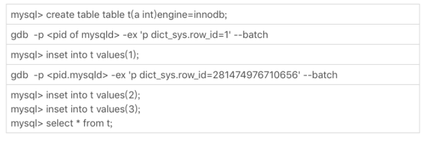
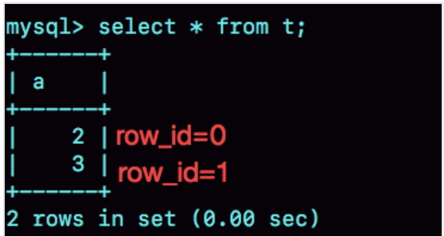
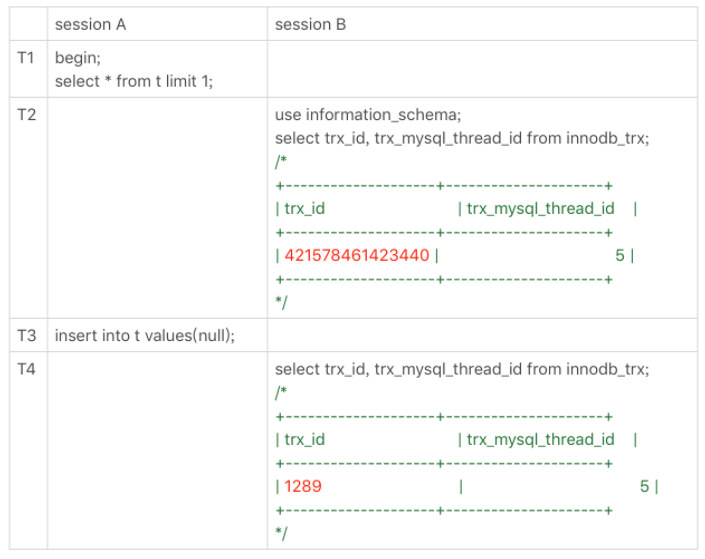
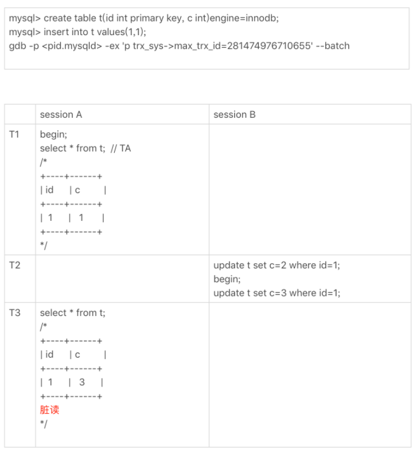

# 45 | 自增id用完怎么办？

MySQL 里有很多自增的 id，每个自增 id 都是定义了初始值，然后不停地往上加步长。虽然自然数是没有上限的，但是在计算机里，只要定义了表示这个数的字节长度，那它就有上限。比如，无符号整型 (unsigned int) 是 4 个字节，上限就是 232-1。

既然自增 id 有上限，就有可能被用完。但是，自增 id 用完了会怎么样呢？

今天这篇文章，我们就来看看 MySQL 里面的几种自增 id，一起分析一下它们的值达到上限以后，会出现什么情况。

# 表定义自增值 id

说到自增 id，你第一个想到的应该就是表结构定义里的自增字段，也就是我在第 39 篇文章[《自增主键为什么不是连续的？》](https://time.geekbang.org/column/article/80531)中和你介绍过的自增主键 id。

表定义的自增值达到上限后的逻辑是：再申请下一个 id 时，得到的值保持不变。

我们可以通过下面这个语句序列验证一下：

```
create table t(id int unsigned auto_increment primary key) auto_increment=4294967295;
insert into t values(null);
// 成功插入一行 4294967295
show create table t;
/* CREATE TABLE `t` (
  `id` int(10) unsigned NOT NULL AUTO_INCREMENT,
  PRIMARY KEY (`id`)
) ENGINE=InnoDB AUTO_INCREMENT=4294967295;
*/
 
insert into t values(null);
//Duplicate entry '4294967295' for key 'PRIMARY'
```

可以看到，第一个 insert 语句插入数据成功后，这个表的 AUTO_INCREMENT 没有改变（还是 4294967295），就导致了第二个 insert 语句又拿到相同的自增 id 值，再试图执行插入语句，报主键冲突错误。

232-1（4294967295）不是一个特别大的数，对于一个频繁插入删除数据的表来说，是可能会被用完的。因此在建表的时候你需要考察你的表是否有可能达到这个上限，如果有可能，就应该创建成 8 个字节的 bigint unsigned。

# InnoDB 系统自增 row_id

如果你创建的 InnoDB 表没有指定主键，那么 InnoDB 会给你创建一个不可见的，长度为 6 个字节的 row_id。InnoDB 维护了一个全局的 dict_sys.row_id 值，所有无主键的 InnoDB 表，每插入一行数据，都将当前的 dict_sys.row_id 值作为要插入数据的 row_id，然后把 dict_sys.row_id 的值加 1。

实际上，在代码实现时 row_id 是一个长度为 8 字节的无符号长整型 (bigint unsigned)。但是，InnoDB 在设计时，给 row_id 留的只是 6 个字节的长度，这样写到数据表中时只放了最后 6 个字节，所以 row_id 能写到数据表中的值，就有两个特征：

1. row_id 写入表中的值范围，是从 0 到 248-1；
2. 当 dict_sys.row_id=248时，如果再有插入数据的行为要来申请 row_id，拿到以后再取最后 6 个字节的话就是 0。

也就是说，写入表的 row_id 是从 0 开始到 248-1。达到上限后，下一个值就是 0，然后继续循环。

当然，248-1 这个值本身已经很大了，但是如果一个 MySQL 实例跑得足够久的话，还是可能达到这个上限的。在 InnoDB 逻辑里，申请到 row_id=N 后，就将这行数据写入表中；如果表中已经存在 row_id=N 的行，新写入的行就会覆盖原有的行。

要验证这个结论的话，你可以通过 gdb 修改系统的自增 row_id 来实现。注意，用 gdb 改变量这个操作是为了便于我们复现问题，只能在测试环境使用。



图 1 row_id 用完的验证序列



图 2 row_id 用完的效果验证

可以看到，在我用 gdb 将 dict_sys.row_id 设置为 248之后，再插入的 a=2 的行会出现在表 t 的第一行，因为这个值的 row_id=0。之后再插入的 a=3 的行，由于 row_id=1，就覆盖了之前 a=1 的行，因为 a=1 这一行的 row_id 也是 1。

从这个角度看，我们还是应该在 InnoDB 表中主动创建自增主键。因为，表自增 id 到达上限后，再插入数据时报主键冲突错误，是更能被接受的。

毕竟覆盖数据，就意味着数据丢失，影响的是数据可靠性；报主键冲突，是插入失败，影响的是可用性。而一般情况下，可靠性优先于可用性。

# Xid

在第 15 篇文章[《答疑文章（一）：日志和索引相关问题》](https://time.geekbang.org/column/article/73161)中，我和你介绍 redo log 和 binlog 相配合的时候，提到了它们有一个共同的字段叫作 Xid。它在 MySQL 中是用来对应事务的。

那么，Xid 在 MySQL 内部是怎么生成的呢？

MySQL 内部维护了一个全局变量 global_query_id，每次执行语句的时候将它赋值给 Query_id，然后给这个变量加 1。如果当前语句是这个事务执行的第一条语句，那么 MySQL 还会同时把 Query_id 赋值给这个事务的 Xid。

而 global_query_id 是一个纯内存变量，重启之后就清零了。所以你就知道了，在同一个数据库实例中，不同事务的 Xid 也是有可能相同的。

但是 MySQL 重启之后会重新生成新的 binlog 文件，这就保证了，同一个 binlog 文件里，Xid 一定是惟一的。

虽然 MySQL 重启不会导致同一个 binlog 里面出现两个相同的 Xid，但是如果 global_query_id 达到上限后，就会继续从 0 开始计数。从理论上讲，还是就会出现同一个 binlog 里面出现相同 Xid 的场景。

因为 global_query_id 定义的长度是 8 个字节，这个自增值的上限是 264-1。要出现这种情况，必须是下面这样的过程：

1. 执行一个事务，假设 Xid 是 A；
2. 接下来执行 264次查询语句，让 global_query_id 回到 A；
3. 再启动一个事务，这个事务的 Xid 也是 A。

不过，264这个值太大了，大到你可以认为这个可能性只会存在于理论上。

# Innodb trx_id

Xid 和 InnoDB 的 trx_id 是两个容易混淆的概念。

Xid 是由 server 层维护的。InnoDB 内部使用 Xid，就是为了能够在 InnoDB 事务和 server 之间做关联。但是，InnoDB 自己的 trx_id，是另外维护的。

其实，你应该非常熟悉这个 trx_id。它就是在我们在第 8 篇文章[《事务到底是隔离的还是不隔离的？》](https://time.geekbang.org/column/article/70562)中讲事务可见性时，用到的事务 id（transaction id）。

InnoDB 内部维护了一个 max_trx_id 全局变量，每次需要申请一个新的 trx_id 时，就获得 max_trx_id 的当前值，然后并将 max_trx_id 加 1。

InnoDB 数据可见性的核心思想是：每一行数据都记录了更新它的 trx_id，当一个事务读到一行数据的时候，判断这个数据是否可见的方法，就是通过事务的一致性视图与这行数据的 trx_id 做对比。

对于正在执行的事务，你可以从 information_schema.innodb_trx 表中看到事务的 trx_id。

我在上一篇文章的末尾留给你的思考题，就是关于从 innodb_trx 表里面查到的 trx_id 的。现在，我们一起来看一个事务现场：、



图 3 事务的 trx_id

session B 里，我从 innodb_trx 表里查出的这两个字段，第二个字段 trx_mysql_thread_id 就是线程 id。显示线程 id，是为了说明这两次查询看到的事务对应的线程 id 都是 5，也就是 session A 所在的线程。

可以看到，T2 时刻显示的 trx_id 是一个很大的数；T4 时刻显示的 trx_id 是 1289，看上去是一个比较正常的数字。这是什么原因呢？

实际上，在 T1 时刻，session A 还没有涉及到更新，是一个只读事务。而对于只读事务，InnoDB 并不会分配 trx_id。也就是说：

1. 在 T1 时刻，trx_id 的值其实就是 0。而这个很大的数，只是显示用的。一会儿我会再和你说说这个数据的生成逻辑。
2. 直到 session A 在 T3 时刻执行 insert 语句的时候，InnoDB 才真正分配了 trx_id。所以，T4 时刻，session B 查到的这个 trx_id 的值就是 1289。

需要注意的是，除了显而易见的修改类语句外，如果在 select 语句后面加上 for update，这个事务也不是只读事务。

在上一篇文章的评论区，有同学提出，实验的时候发现不止加 1。这是因为：

1. update 和 delete 语句除了事务本身，还涉及到标记删除旧数据，也就是要把数据放到 purge 队列里等待后续物理删除，这个操作也会把 max_trx_id+1， 因此在一个事务中至少加 2；
2. InnoDB 的后台操作，比如表的索引信息统计这类操作，也是会启动内部事务的，因此你可能看到，trx_id 值并不是按照加 1 递增的。

那么，**T2 时刻查到的这个很大的数字是怎么来的呢？**

其实，这个数字是每次查询的时候由系统临时计算出来的。它的算法是：把当前事务的 trx 变量的指针地址转成整数，再加上 248。使用这个算法，就可以保证以下两点：

1. 因为同一个只读事务在执行期间，它的指针地址是不会变的，所以不论是在 innodb_trx 还是在 innodb_locks 表里，同一个只读事务查出来的 trx_id 就会是一样的。
2. 如果有并行的多个只读事务，每个事务的 trx 变量的指针地址肯定不同。这样，不同的并发只读事务，查出来的 trx_id 就是不同的。

那么，**为什么还要再加上 248呢？**

在显示值里面加上 248，目的是要保证只读事务显示的 trx_id 值比较大，正常情况下就会区别于读写事务的 id。但是，trx_id 跟 row_id 的逻辑类似，定义长度也是 8 个字节。因此，在理论上还是可能出现一个读写事务与一个只读事务显示的 trx_id 相同的情况。不过这个概率很低，并且也没有什么实质危害，可以不管它。

另一个问题是，**只读事务不分配 trx_id，有什么好处呢？**

- 一个好处是，这样做可以减小事务视图里面活跃事务数组的大小。因为当前正在运行的只读事务，是不影响数据的可见性判断的。所以，在创建事务的一致性视图时，InnoDB 就只需要拷贝读写事务的 trx_id。
- 另一个好处是，可以减少 trx_id 的申请次数。在 InnoDB 里，即使你只是执行一个普通的 select 语句，在执行过程中，也是要对应一个只读事务的。所以只读事务优化后，普通的查询语句不需要申请 trx_id，就大大减少了并发事务申请 trx_id 的锁冲突。

由于只读事务不分配 trx_id，一个自然而然的结果就是 trx_id 的增加速度变慢了。

但是，max_trx_id 会持久化存储，重启也不会重置为 0，那么从理论上讲，只要一个 MySQL 服务跑得足够久，就可能出现 max_trx_id 达到 248-1 的上限，然后从 0 开始的情况。

当达到这个状态后，MySQL 就会持续出现一个脏读的 bug，我们来复现一下这个 bug。

首先我们需要把当前的 max_trx_id 先修改成 248-1。注意：这个 case 里使用的是可重复读隔离级别。具体的操作流程如下：



图 4 复现脏读

由于我们已经把系统的 max_trx_id 设置成了 248-1，所以在 session A 启动的事务 TA 的低水位就是 248-1。

在 T2 时刻，session B 执行第一条 update 语句的事务 id 就是 248-1，而第二条 update 语句的事务 id 就是 0 了，这条 update 语句执行后生成的数据版本上的 trx_id 就是 0。

在 T3 时刻，session A 执行 select 语句的时候，判断可见性发现，c=3 这个数据版本的 trx_id，小于事务 TA 的低水位，因此认为这个数据可见。

但，这个是脏读。

由于低水位值会持续增加，而事务 id 从 0 开始计数，就导致了系统在这个时刻之后，所有的查询都会出现脏读的。

并且，MySQL 重启时 max_trx_id 也不会清 0，也就是说重启 MySQL，这个 bug 仍然存在。

那么，**这个 bug 也是只存在于理论上吗？**

假设一个 MySQL 实例的 TPS 是每秒 50 万，持续这个压力的话，在 17.8 年后，就会出现这个情况。如果 TPS 更高，这个年限自然也就更短了。但是，从 MySQL 的真正开始流行到现在，恐怕都还没有实例跑到过这个上限。不过，这个 bug 是只要 MySQL 实例服务时间够长，就会必然出现的。

当然，这个例子更现实的意义是，可以加深我们对低水位和数据可见性的理解。你也可以借此机会再回顾下第 8 篇文章[《事务到底是隔离的还是不隔离的？》](https://time.geekbang.org/column/article/70562)中的相关内容。

# thread_id

接下来，我们再看看线程 id（thread_id）。其实，线程 id 才是 MySQL 中最常见的一种自增 id。平时我们在查各种现场的时候，show processlist 里面的第一列，就是 thread_id。

thread_id 的逻辑很好理解：系统保存了一个全局变量 thread_id_counter，每新建一个连接，就将 thread_id_counter 赋值给这个新连接的线程变量。

thread_id_counter 定义的大小是 4 个字节，因此达到 232-1 后，它就会重置为 0，然后继续增加。但是，你不会在 show processlist 里看到两个相同的 thread_id。

这，是因为 MySQL 设计了一个唯一数组的逻辑，给新线程分配 thread_id 的时候，逻辑代码是这样的：

```
do {
  new_id= thread_id_counter++;
} while (!thread_ids.insert_unique(new_id).second);
```

这个代码逻辑简单而且实现优雅，相信你一看就能明白。

# 小结

今天这篇文章，我给你介绍了 MySQL 不同的自增 id 达到上限以后的行为。数据库系统作为一个可能需要 7*24 小时全年无休的服务，考虑这些边界是非常有必要的。

每种自增 id 有各自的应用场景，在达到上限后的表现也不同：

1. 表的自增 id 达到上限后，再申请时它的值就不会改变，进而导致继续插入数据时报主键冲突的错误。
2. row_id 达到上限后，则会归 0 再重新递增，如果出现相同的 row_id，后写的数据会覆盖之前的数据。
3. Xid 只需要不在同一个 binlog 文件中出现重复值即可。虽然理论上会出现重复值，但是概率极小，可以忽略不计。
4. InnoDB 的 max_trx_id 递增值每次 MySQL 重启都会被保存起来，所以我们文章中提到的脏读的例子就是一个必现的 bug，好在留给我们的时间还很充裕。
5. thread_id 是我们使用中最常见的，而且也是处理得最好的一个自增 id 逻辑了。

当然，在 MySQL 里还有别的自增 id，比如 table_id、binlog 文件序号等，就留给你去验证和探索了。

不同的自增 id 有不同的上限值，上限值的大小取决于声明的类型长度。而我们专栏声明的上限 id 就是 45，所以今天这篇文章也是我们的最后一篇技术文章了。

既然没有下一个 id 了，课后也就没有思考题了。今天，我们换一个轻松的话题，请你来说说，读完专栏以后有什么感想吧。

这个“感想”，既可以是你读完专栏前后对某一些知识点的理解发生的变化，也可以是你积累的学习专栏文章的好方法，当然也可以是吐槽或者对未来的期望。

欢迎你给我留言，我们在评论区见，也欢迎你把这篇文章分享给更多的朋友一起阅读。

## 精选留言(64)

- 

    Continue

    2019-02-25

    **13

    跟着学了三个多月，受益匪浅，学到了很多新的知识和其中的原理！

    作者回复: 早🤝

- 

    克劳德

    2019-02-25

    **7

    本人服务端工程师，在学习这门课之前数据库一直是我的短板，曾听朋友说MySQL或数据库中涉及了很多方面的知识点，每一个拿出来展开讲几乎都能出一本书了，对数据库是越来越忌惮，同时也因为工作上并没有过多接触，水平便一直停留在编写简单SQL层面。
    在面试中被问到数据库问题，只能无奈的说这块不太清楚，也曾在网上自学过，但网上的文章知识点比较零散，很多都是给出一些结论性的观点，由于不了解其内部原理，记忆很难深刻。
    老实说，当初报这门课的时候就像买技术书籍一样，我相信大家都有这样的体会，以为买到了就等于学到了，所以有一段时间没有点开看过，以至于后面开始学的时候都是在追赶老师和大家的进度，唯一遗憾的地方就是没能跟老师及时留言互动。
    这门课虽然是文字授课，但字里行间给我的感觉就是很亲切很舒服，为什么呢，因为老师可以把晦涩的知识变得通俗易懂，有时我在思考，如果让我来讲一个自己擅长的领域是否也能做到这一点，如果要做到的话需要什么样的知识储备呢。
    最后真要感谢老师的这门课，让我从心里不再惧怕数据库问题，不管是工作还是面试中信心倍增，现在时不时都敢和我们DBA“切磋切磋“了，哈哈。
    祝好~

    展开**

    作者回复: 👍“切磋切磋“

    留言不会“过时”哈，在对应的章节下面提出相关的问题，我会持续关注评论区

- 

    三胖

    2019-02-25

    **4

    老师，我才学了四分之一的课程，但是这门课已经更新完了，我是直接跑到最后一节技术篇来留言的！很想知道，后来者比如我在学到后面的课程时遇到问题留言，老师还会看会回复吗？（老师的课程超值！！）

    作者回复: 会看的

    后台系统是按照留言时间显示的
    而且我在这事情上有强迫症，一定会让“未处理问题”变成0的😆

    只是说如果是其他同学评论区问过的问题，我可能就不会重复回复了

- 

    极客时间

    2019-02-25

    **3

    通過這個專欄的系統學習，梳理很多知識點、擴展了我對MySQL的認識及以後使用。感謝老師的諄諄教導！

- 

    某、人

    2019-02-26

    **2

    很遗憾没能坚持到最后,但是也很庆幸能遇到这么好的专栏。以前了解mysql都是一些零散的知识点,通过学习完专栏,不论是mysql整体架构还是基础的知识点,都有了更深的认识。以后就把老师的文档当官方文档查,出现问题先来看看专栏。
    感触特别深的是,老师对于提到的每一个问题,都会严谨又认真的去回答,尽量帮助每一位同学都能有所收获。要做到这一点，是特别耗费精力的。
    感谢老师的传道授业解惑,希望以后有机会能当面向老师请教问题。期待老师下一部杰作

    展开**

    作者回复: 刚过完年都是很忙的， 找时间补上哈，等你的评论区留言^_^

- 

    夜空中最亮...

    2019-02-25

    **2

    不知道是最后一篇，否则的话就慢些读完了；
    我是一名运维，公司也没有DBA，所以MySQL库也归我收拾；
    读了老师的专栏，操作起数据库来，心情更好了；
    老师的课，让我有了想看完《高性能MySQL》的兴趣；
    听了老师的课，开发都来问我数据库的问题了，高兴；
    老师你会有返场吗？我猜会 😄
    可否透漏下接下来的安排，会有续集吗？进阶吗？
    不想这一别就是一生。
    您的从未谋面的学生。

    展开**

    作者回复: 谢谢你

    “开发都来问我数据库的问题了”，当年我也是这么开始“入坑”，加油

- 

    IceGeek17

    2019-02-25

    **2

    感谢老师，课程受益匪浅，
    课程结束后，如果有问题，是继续在这里的评论区提问，还是会有另外一条答疑通道？

    另外，在第35篇我提了几个问题，老师还没有回答，我这里再贴一下，老师看一下
    问题一：
    对于BKA算法的流程理解，用文中的例子，先把t1表（小表）中查询需要的字段放入join_buffer, 然后把join_buffer里的字段值批量传给t2表，先根据索引a查到id，然后得到一批主键id，再根据主键id排序，然后再根据排完序的id去主键索引查数据（这里用到MRR）
    理解是否正确？
    这里对于主键id排序是在哪里做的，是在join_buffer里，还是另外再开辟一块临时内存？如果在join_buffer里，那join_buffer里的每行内容是不是：t2.id + t1查询必须的字段，并且join_buffer里是根据id排序的？

    问题二：
    虽然MySQL官方没有支持hash join，但是之前看到文章说，MariaDB已经支持hash join，能不能后续在答疑文章中简单总结下mariaDB支持的join算法

    问题三：
    在实际项目中，一个比较困惑的问题，看到过这样的类似写法：
    select xxx from t1 join t2 on t1.id = t2.id for update （目的是获取几个表上最新的数据，并且加上锁，防止数据被更新）
    这里有几个问题：
    \1) 像这样 join + for update，表上的加锁规则是怎么样的？是不是在需要join的两个表上根据具体的查询执行过程都加上锁？
    2）像这样 join + for update 的用法是否合理？碰到这样的场景，应该怎么去做？

    问题四：
    看过阿里输出的开发手册里，强调 “最多不超过三表join”，实际项目中，给我感觉很难做到所有业务都不超过三表join，那这里的问题就是，有什么相关的经验方法，可以尽量降低参与join的数据表？
    比如，在数据表里添加冗余字段，可以降低参与join的数据表数量，还有什么其他好的方法？

    展开**

    作者回复: 就在我们评论区，提跟文章相关的内容，会继续关注。

    问题一、前面的过程理解正确，MRR过程用的是read_rnd_buffer

    问题二、其实我们文中最后那个过程，你把他设想成在MySQL内部执行。。

    问题三、这种复杂的语句，你要把我们两部分知识点连起来看。一个原则：for update的话，执行语句过程中扫到的间隙和记录都要加锁。 当然最好是不这么做，拆成两个语句会好些。

    问题四、还是我文中的建议，如果都用NLJ或BKA算法的join其实还好，所以看看explain。
    降低join表数量的方法，基本上行就是冗余字段和拆成多个语句这两个方向了

- 

    NoDBA

    2019-02-27

    **1

    低版本thread_id超过2^32-1后，在general log显示是负数，高版本貌似没有这个问题，是否高版本的thread_id是8字节呢？

    作者回复: 主要不是定义的问题，而是打印的时候代码问题，按照这个代码输出的：
    "%5ld ", (long) thread_id

    是个bug， 超过2^31就变成负数了，
    新版本改了

    好问题😆

- 

    封建的风

    2019-02-27

    **1

    之前很多知识点有点粗浅，尤其在行版本可见性，redo log&bin log关系，加锁的原理章节，深入浅出，受益匪浅。感谢老师精品专栏，后期再二刷

- 

    kun

    2019-02-26

    **1

    感觉戛然而止哈 没学够，后面还会再回顾，老师辛苦！

- 

    星辰大海

    2019-02-26

    **1

    终于追上来了，很感谢老师的付出。

- 

    长杰

    2019-02-26

    **1

    感谢老师，通过本课程的学习，加深了mysql原理上的理解，特别是间隙锁，nextkeylock，join操作上，事物的一致性以及binlog和redolog的配合。感觉还意犹未尽，希望后续还能在这里和老师互动，为我们答疑解惑，再次感谢老师！

    作者回复: 会的，
    也感谢你们一路相伴🤝

- 

    亮

    2019-02-25

    **1

    老师，sql 的where里 < 10001 和 <= 10000有什么区别吗？

    作者回复: 这要看你关注的是什么
    你这么问，应该这个字段是整型吧？

    从查询结果可能是一样的，
    不过锁的范围不同，你可以看下21篇

- 

    Leon📷

    2019-02-25

    **1

    跟着老师终于学到了最后，每天的地铁时间无比充实，我对mysql的基本原理和工作流程大致有了初步的了解，而不是以前的增删查改，打算以后抽时间再二刷三刷，等全部搞懂后，再去看看高性能mysql这本书，如果时间允许，打算再去自己参照教程实现一个简易的DB，课程虽然结束了，仍然感觉意犹未尽，希望老师拉一个倍洽群，大家一起在里面讨论和学习

    作者回复: 👍
    评论区一直会开放

    大家到对应的文章去提相关问题 🤝
    二刷三刷我也一直在哦😆

- 

    Dkey

    2019-02-25

    **1

    当前系统并无其他事务存在时，启动一个只读事务时（意味没有事务id），它的低高水位是怎么样的老师。

    作者回复: 假设当前没有其他事务存在，假设当前的max_trx_id=N,
    这时候启动一个只读事务，它的高低水位就都是N。

- 

    shawn

    2019-02-25

    **1

    受益匪浅，最后几讲还想了解下null值如何建立索引，由于null直接不能比较和排序，MySQL能区分出每一个null值吗

    作者回复: 可以，因为普通索引上都有主键值对吧，

    所以其实是 (null, id1), (null, id2) ....

- 

    长杰

    2019-02-25

    **1

    对于一个特大的表加字段，字段的属性设置为Null和设置为not null并指定默认值，在执行时间和性能上是否有区别？在sqlserver是我记得是有区别的。

    作者回复: 在MySQL里没有区别😆

    都是要重建表的

    如果特大，考虑到省空间，还是设置为not null吧

- 

    路过

    2019-03-30

    **

    请教：
    innodb表的隐含row id和手动创建的primary key，有什么区别？仅仅是有无索引吗？如果是，则给row id默认创建上索引岂不更好？谢谢！

- 

    独孤

    2019-03-28

    **

    通过gdb修改运行时系统变量怎么做的？要编译安装mysql源码吗？我在ubuntu18.04.1上apt安装了mysql 5.7和gdb，按照文稿中的操作修改不了

- 

    Archer

    2019-03-21

    **

    断断续续的学了这么久,今天学完了,以前工作中只需要能写sql就好了,完全不知道为什么要这么写,常常纠结要不要写索引,join这么写性能会不会差,偶尔出现死锁都不知道咋办,现在虽然不敢说都懂了,但是能看懂一部分的explain,准备二刷三刷巩固一下

    作者回复: 👍