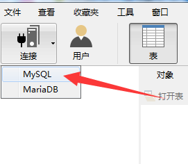
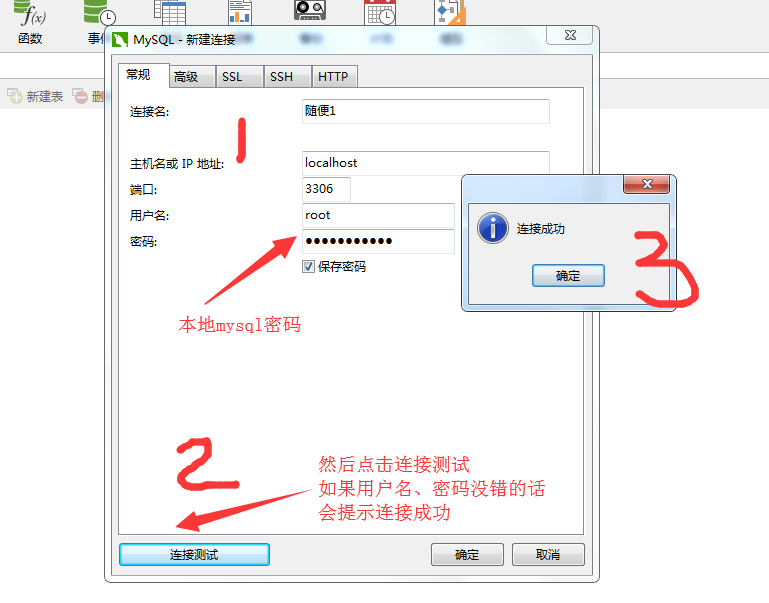
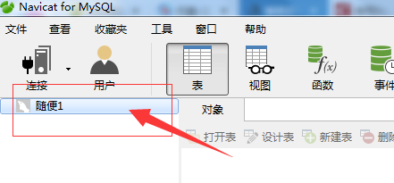
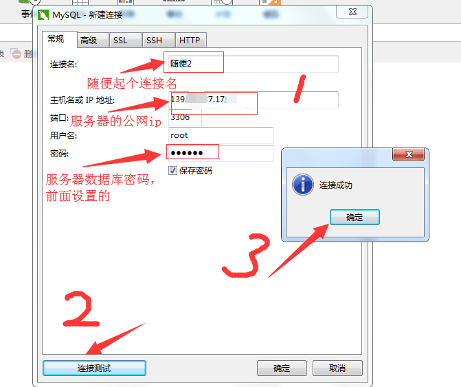
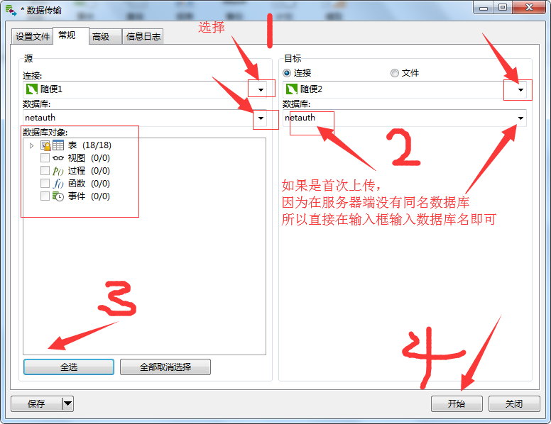
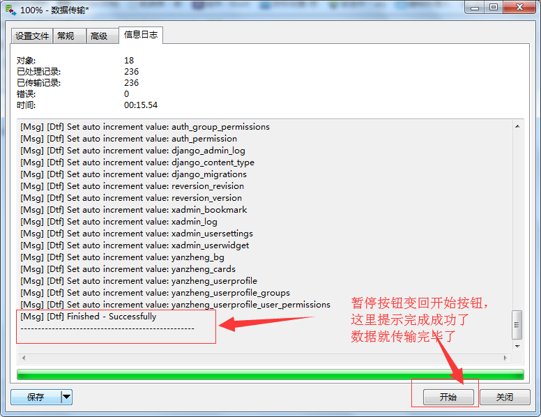
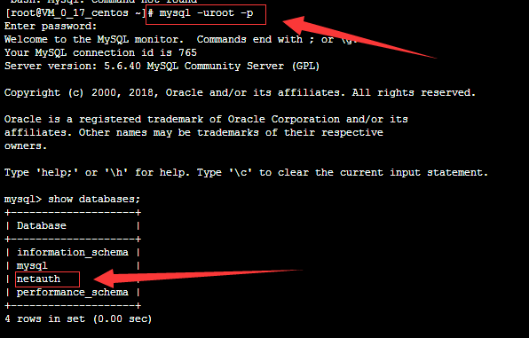

# 用 Navicat for MySQL 把本地数据库上传到服务器

服务器系统基本都是基于 linux 的，这个数据库上传的方式适用于 linux 的各种版本，当然本地数据库上传到服务器的前提是，服务器也已经安装好了MySQL数据库

## 一、在服务器端：

给远程访问设置权限

```sql
#其中123456是用于连接的密码，根据自己定义
GRANT ALL PRIVILEGES ON *.* TO 'root'@'%' IDENTIFIED BY '123456' WITH GRANT OPTION;

FLUSH PRIVILEGES; #设置密码，如果是新安装的mysql需要在这里把密码设置了，如果已经有密码了就不用了
set password =password('123456');
flush privileges;
```

## 二、在本地：

### 建立连接

先新建连接，跟本地数据库连上，连接名随便起一个就可以，如图









再新建连接，跟服务器数据库连上，连接名也随便起一个就可以，如图

 


数据传输，如图




图3



至此，完成了本地数据库传输到服务器的过程

可以到服务器端，进入mysql查看一下，是否已经上传成功：



