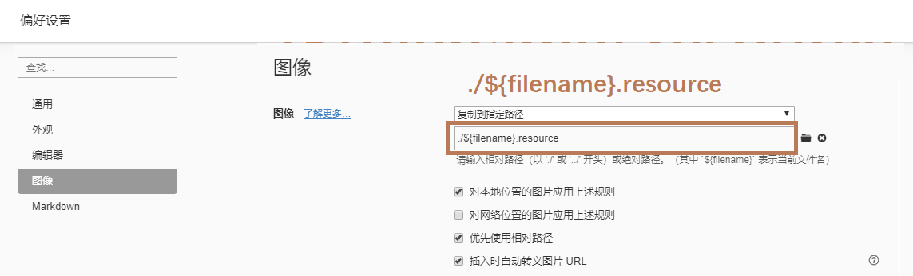

🟥🟧🟨🟩🟦🟪🟫🟥🟧🟨🟩🟦🟪🟫🟥🟧🟨🟩🟦🟪🟫🟥🟧🟨🟩🟦🟪🟫🟥🟧🟨🟩🟦🟪🟫🟥

## :bulb:使用说明

### 🎨Git 和 GitHub 基本使用

对 Git 和 GitHub 使用过程中有疑问的可以先看看[这里](https://github.com/GJXAIOU/Notes/blob/master/Tools/GitWithGithub/Git%26Github%E4%BD%BF%E7%94%A8%E8%AF%B4%E6%98%8E.md)。

### 🎨图片加载失败方法

- 【推荐】**方法一**：使用 Typora 时候，需要设置：文件 -> 偏好设置 -> 图像 -> 选择“复制到指定路径” -> 路径格式为：`./${filename}.resource`，正逐步将文件中图片链接更改为此种方式；
  
    
    
    - 软件下载地址： https://www.typora.io/ 
    
- **方法二**：因为笔记软件的原因，造成上传的笔记中图片无法加载，会逐渐将笔记中的图片链接从本地更改为图库的链接，在此过程中，如果想完整的查看笔记中的插图，请使用软件：Yu Writer ，将整个目录放入笔记默认的文件夹下：即可，当然也可也使用软件导入外部文件进行查看。

    - 软件下载地址：https://ivarptr.github.io/yu-writer.site/

-  **方法三**：当然也可以直接打开仓库中每个文件对应的 `.resources` 文件查看文件中包含的图片；

### 🎨完整笔记获取

- 如果需要完整笔记，或者需要 PDF 版本，可以提交 issue 或者发送邮件到上面邮箱，说明需要具体的笔记名即可，一般晚上会查看 Github 和查阅邮箱。

### 🎨Fork 之后保证笔记更新

- 因为笔记一直**处于更新和修改过程中**，所以大家可以采用以下方式保证 Fork 到自己仓库的笔记能够保持最新。

    - 合并步骤一

    

    - 合并步骤二、三、四

    

    - 合并步骤五、六

    

### 🎨排版规范

- **Java 代码规范参照** ：[AlibabaJavaCodeGuide](https://github.com/GJXAIOU/Notes/blob/master/Java/CodeGuide/AlibabaJavaCodeGuide1.3.0.md)
- **中文排版参照**：[ChineseCopywritingGuidelines](https://github.com/GJXAIOU/Notes/blob/master/Java/CodeGuide/ChineseCopywritingGuidelines.md)

## :notebook_with_decorative_cover:笔记目录

- Algorithm 📖
    - AlgorithmNotes
    - Books ：算法导论（笔记整理中）
- C++ :open_file_folder:
    - C 基础/进阶 : C 语言知识巩固
    - C++ 基础
- ComputerNetwork  :open_file_folder:
- DataStructure :open_file_folder:
- DesignPattrens:open_file_folder:
    - DesignPatternsNotes 
    - Books： 预定 GOF 中
- Java :open_file_folder:
    - JavaEE 
    - MySQL
    - HTML、CSS、JSP、JQuery
    - Spring、SpringMVC、Mybatis、Hibernate、Struts2、SpringBoot
    - Redis、Shiro
- JavaVirtualMachine【已基本完成】:open_file_folder:
    - JVM 内存结构
    - 类加载机制
    - 垃圾回收
    - 字节码结构
- Linux :open_file_folder:
    - LinuxNotes：linux 日常学习笔记整理
    - 鸟哥：鸟哥的私房菜（笔记在整理中）
- MATLAB:open_file_folder:
    - MATLAB 日常仿真笔记（整理中）
- MPLS_VPN:open_file_folder:
    - MPLS_VPN 实验
- MySQL :open_file_folder:
    - MySQLNotes ：MySQL 学习笔记，主要笔记见 JavaNotes ->MySQL 
    - Books：《MySQL 必知必会》学习笔记
- NS3
    - NS3 网络仿真器（使用 python/C++）课程作业
- Python :open_file_folder:
    - PythonNotes：python 使用笔记
    - Books：《跟老齐学 python 轻松入门》笔记
- Tools:open_file_folder:
    - EclipseWithIDEA
    - GitWithGitHub
    - Markdown
    - Maven
    - SublimeText3
    - Tomcat

## :notebook_with_decorative_cover:参考书目

- 算法导论
- 鸟哥的 Linux 私房菜
- 大话数据结构
- 数据结构与算法分析（Java 语言描述）
- 计算机网络
- TCP/IP 详解（卷一）
- Java 编程思想
- MySQL 必知必会
- 高性能 MySQL
- 深入理解 Java 虚拟机
- Java 并发编程实战
- 重构
- 大话设计模式
- 设计模式：可复用面向对象软件的基础
- 跟老齐学 Python
- Python 编程：从入门到实践
- 深入理解计算机系统