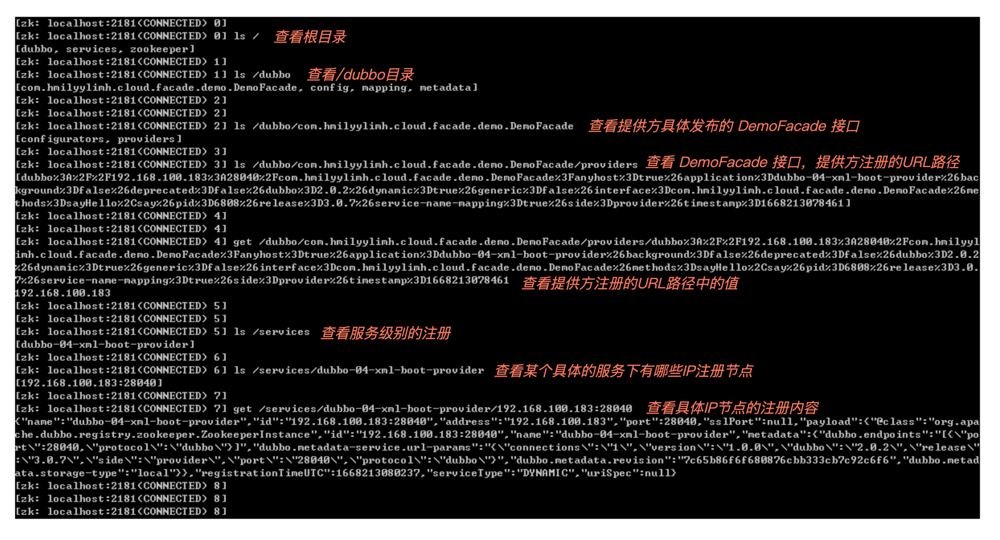
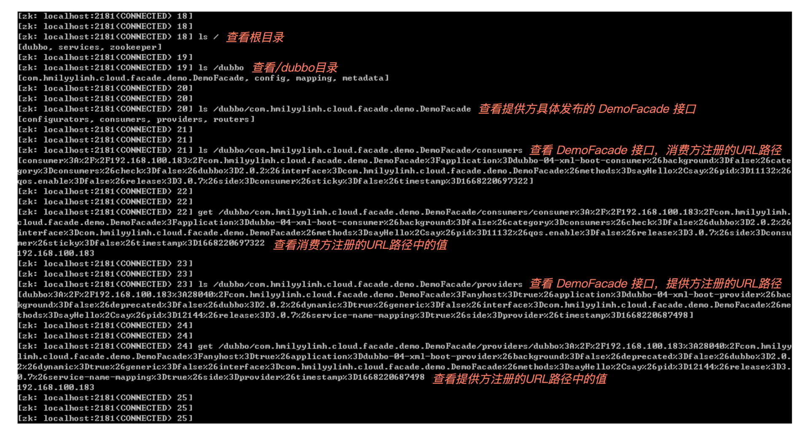

# 01｜温故知新：Dubbo基础知识你掌握得如何？
任何一门学科都有它基本的知识结构，而Dubbo作为一款优秀的微服务框架，自然也有着其领域的基础知识。所谓万丈高楼平地起，想把Dubbo用得游刃有余，对基础知识的深刻理解就尤为重要了。

举一个最基础的问题：Dubbo的总体架构是什么样？一定有初学者或者面试官问过你吧，但常年忙着写业务代码逻辑，对于这样的提问，想必你是既熟悉又陌生，有种欲言又止的感觉，心里清楚却又无法一气呵成地向他人讲清楚。

没关系，今天，我们就一起来回顾Dubbo的基础知识体系，温故知新，之后我们碰到的一些异常或者问题时，就能快速定位问题归属于Dubbo的哪个角色，找准方向力求解决。

## 总体架构

我们知道，Dubbo的主要节点角色有五个：

- Container：服务运行容器，为服务的稳定运行提供运行环境。
- Provider：提供方，暴露接口提供服务。
- Consumer：消费方，调用已暴露的接口。
- Registry：注册中心，管理注册的服务与接口。
- Monitor：监控中心，统计服务调用次数和调用时间。

我们画一张Dubbo的总体架构示意图，你可以清楚地看到每个角色大致的交互方式：


**对于一个Dubbo项目来说，我们首先会从提供方进行工程创建（第 1 步），并启动工程（第 2 步）来进行服务注册（第 3 步），接着会进行消费方的工程创建（第 4 步）并启动订阅服务（第 5 步）来发起调用（第 6 步），到这里，消费方就能顺利调用提供方了。**

**消费方在运行的过程中，会感知注册中心的服务节点变更（第 7 步），最后消费方和提供方将调用的结果指标同步至监控中心（第 8/9步）**。

在这样的完整流程中， **每个角色在Dubbo架构体系中具体起到了什么样的作用？每一步我们有哪些操作注意点呢？** 带着问题，我们通过实操来仔细分析。

### 1\. Container 服务运行容器

首先，提供方、消费方的正常运转，离不开一个大前提——运行的环境。

我们需要一个容器来承载应用的运行，可以是 Tomcat 容器，也可以是 Jetty 容器，还可以是 Undertow 容器等等，只要能负责启动、加载，并运行服务提供者来提供服务就可以了。

### 2\. Provider 提供方

有了Container为服务的稳定运行提供环境后，我们就可以开始新建工程了。

**第 1 步**，先自己新建一个提供方的工程，引用一个 facade.jar 包来对外暴露服务，编写的关键代码如下：

```java
///////////////////////////////////////////////////
// 提供方应用工程的启动类
///////////////////////////////////////////////////
// 导入启动提供方所需要的Dubbo XML配置文件
@ImportResource("classpath:dubbo-04-xml-boot-provider.xml")
// SpringBoot应用的一键式启动注解
@SpringBootApplication
public class Dubbo04XmlBootProviderApplication {
    public static void main(String[] args) {
        // 调用最为普通常见的应用启动API
        SpringApplication.run(Dubbo04XmlBootProviderApplication.class, args);
        // 启动成功后打印一条日志
        System.out.println("【【【【【【 Dubbo04XmlBootProviderApplication 】】】】】】已启动.");
    }
}
```

提供方应用工程的Dubbo XML配置文件内容：dubbo-04-xml-boot-provider.xml 如下：

```xml
<?xml version="1.0" encoding="UTF-8"?>
<beans xmlns="http://www.springframework.org/schema/beans"
       xmlns:xsi="http://www.w3.org/2001/XMLSchema-instance"
       xmlns:dubbo="http://dubbo.apache.org/schema/dubbo"
       xsi:schemaLocation="http://www.springframework.org/schema/beans
       http://www.springframework.org/schema/beans/spring-beans-4.3.xsd
       http://dubbo.apache.org/schema/dubbo
       http://dubbo.apache.org/schema/dubbo/dubbo.xsd">
    <!-- 注册中心的地址，通过 address 填写的地址提供方就可以联系上 zk 服务 -->
    <dubbo:registry address="zookeeper://127.0.0.1:2181"></dubbo:registry>
    <!-- 提供者的应用服务名称 -->
    <dubbo:application name="dubbo-04-xml-boot-provider"></dubbo:application>
    <!-- 提供者需要暴露服务的协议，提供者需要暴露服务的端口 -->
    <dubbo:protocol name="dubbo" port="28040"></dubbo:protocol>
    <!-- 提供者暴露服务的全路径为 interface 里面的内容 -->
    <dubbo:service interface="com.hmilyylimh.cloud.facade.demo.DemoFacade"
                   ref="demoFacade"></dubbo:service>
    <!-- 提供者暴露服务的业务实现逻辑的承载体 -->
    <bean id="demoFacade" class="com.hmilyylimh.cloud.xml.demo.DemoFacadeImpl"></bean>
</beans>
```

将提供方应用启动的代码、Dubbo配置文件内容编写好后，就准备 **第 2 步** 启动了。

如果你现在运行 Dubbo04XmlBootProviderApplication 启动类，会直接遇到非法状态异常：

```shell
java.lang.IllegalStateException: java.lang.IllegalStateException: zookeeper not connected
	at org.apache.dubbo.config.deploy.DefaultApplicationDeployer.prepareEnvironment(DefaultApplicationDeployer.java:678) ~[dubbo-3.0.7.jar:3.0.7]
	at org.apache.dubbo.config.deploy.DefaultApplicationDeployer.startConfigCenter(DefaultApplicationDeployer.java:261) ~[dubbo-3.0.7.jar:3.0.7]
	at org.apache.dubbo.config.deploy.DefaultApplicationDeployer.initialize(DefaultApplicationDeployer.java:185) ~[dubbo-3.0.7.jar:3.0.7]
```

这是因为不做任何超时时间设置时，ConfigCenterConfig#checkDefault 方法中会默认超时时间为 **30秒**，然后将“30秒”传给 CuratorFramework 让它在有限的时间内连接上注册中心，若30秒还没有连接上的话，就抛出了这里你看到的非法状态异常，提示 `zookeeper not connected`，表示注册中心没有连接上。

所以接下来我们需要做的就是，自己启动一个 ZooKeeper 注册中心，然后再次运行启动类，就能看到启动成功的打印信息：

```markdown
2022-11-11 23:57:27.261  INFO 12208 --- [           main] .h.c.x.Dubbo04XmlBootProviderApplication : Started Dubbo04XmlBootProviderApplication in 5.137 seconds (JVM running for 6.358)
2022-11-11 23:57:27.267  INFO 12208 --- [pool-1-thread-1] .b.c.e.AwaitingNonWebApplicationListener :  [Dubbo] Current Spring Boot Application is await...
【【【【【【 Dubbo04XmlBootProviderApplication 】】】】】】已启动.
```

接下来的 **第 3 步** 是在提供方启动的过程中进行的。启动成功后，你可以通过 ZooKeeper 中自带的 zkCli.cmd 或 zkCli.sh 连上注册中心，查看提供方在注册中心留下了哪些痕迹，如图：



通过 `ls /` 查看根目录，我们发现 Dubbo 注册了两个目录，/dubbo 和 /services 目录：


这是 Dubbo 3.x 推崇的一个应用级注册新特性，在不改变任何 Dubbo 配置的情况下，可以兼容一个应用从 2.x 版本平滑升级到 3.x 版本，这个新特性主要是为了将来能支持十万甚至百万的集群实例地址发现，并且可以与不同的微服务体系实现地址发现互联互通。

但这里有个小问题了，控制提供方应用到底应该接口级注册，还是应用级注册，还是两个都注册呢？

你可以通过在提供方设置 `dubbo.application.register-mode` 属性来自由控制，设置的值有3 种：

- interface：只接口级注册。
- instance：只应用级注册。
- all：接口级注册、应用级注册都会存在，同时也是默认值。

==》JSF 是接口级别的注册，所以启动里只有很多接口信息。

> 在Dubbo框架中，“接口级注册”和“应用级注册”是指用于注册和发现服务的不同方法。
>
> 1. 接口级注册： 在Dubbo中，接口级注册意味着每个服务接口都会单独注册和发现。当提供者暴露一个服务时，它会使用特定的接口将自己注册到服务注册表（例如ZooKeeper或Consul）。这使得消费者可以根据其所需的接口查找服务。
>
> 主要特点：
>
> - 每个服务接口都会单独注册。
> - 消费者根据希望使用的接口查找服务。
> - 可以根据单独接口进行精细化的服务发现。
>
> 1. 应用级注册： 相比之下，应用级注册意味着一个应用程序提供的所有服务会作为一个单独的单元进行注册。应用程序本身向服务注册表注册，它提供的所有服务都与该注册关联。
>
> 主要特点：
>
> - 一个应用程序提供的所有服务都会一起注册。
> - 消费者根据应用程序的注册查找服务。
> - 当多个服务与一个应用程序紧密相关时，简化了服务发现。
>
> 选择接口级和应用级注册取决于系统的架构和需求：
>
> 当服务具有特定且独立的目的，并且消费者需要精确控制所使用的服务时，接口级注册更合适。这种方法更加细粒度和灵活，但管理许多单独的服务注册可能会导致额外的开销。
>
> 当多个服务与一个应用程序密切相关，或者应用程序提供了一个有机的功能集时，应用级注册非常有用。这种方法简化了服务发现和管理，因为所有服务都在应用程序的注册下分组。然而，当服务需要独立消费或应用程序跨越多个团队或项目时，可能会缺乏灵活性。
>
> 总之，选择接口级和应用级注册取决于服务管理的粒度和系统中服务之间的关系。

### 3\. Consumer 消费方

提供方启动完成后，我们就可以接着新建消费方的工程了。

**第 4 步**，在新建的消费方工程中，同样需要引用 facade.jar 来进行后续的远程调用，你可以参考要编写的关键代码：

```java
///////////////////////////////////////////////////
// 消费方应用工程的启动类
///////////////////////////////////////////////////
// 导入启动消费方所需要的Dubbo XML配置文件
@ImportResource("classpath:dubbo-04-xml-boot-consumer.xml")
// SpringBoot应用的一键式启动注解
@SpringBootApplication
public class Dubbo04XmlBootConsumerApplication {
    public static void main(String[] args) {
        // 调用最为普通常见的应用启动API
        ConfigurableApplicationContext ctx =
                SpringApplication.run(Dubbo04XmlBootConsumerApplication.class, args);
        // 启动成功后打印一条日志
        System.out.println("【【【【【【 Dubbo04XmlBootConsumerApplication 】】】】】】已启动.");
        // 然后向提供方暴露的 DemoFacade 服务进行远程RPC调用
        DemoFacade demoFacade = ctx.getBean(DemoFacade.class);
        // 将远程调用返回的结果进行打印输出
        System.out.println(demoFacade.sayHello("Geek"));
    }
}
```

消费方应用工程的Dubbo XML配置文件内容：dubbo-04-xml-boot-consumer.xml 如下：

```xml
<?xml version="1.0" encoding="UTF-8"?>
<beans xmlns="http://www.springframework.org/schema/beans"
       xmlns:xsi="http://www.w3.org/2001/XMLSchema-instance"
       xmlns:dubbo="http://dubbo.apache.org/schema/dubbo"
       xsi:schemaLocation="http://www.springframework.org/schema/beans
       http://www.springframework.org/schema/beans/spring-beans-4.3.xsd
       http://dubbo.apache.org/schema/dubbo
       http://dubbo.apache.org/schema/dubbo/dubbo.xsd">
    <!-- 消费者的应用服务名称，最好是大家当前应用归属的系统名称 -->
    <dubbo:application name="dubbo-04-xml-boot-consumer"></dubbo:application>
    <!-- 注册中心的地址，通过 address 填写的地址提供方就可以联系上 zk 服务 -->
    <dubbo:registry address="zookeeper://127.0.0.1:2181"></dubbo:registry>
    <!-- 引用远程服务 -->
    <dubbo:reference id="demoFacade"
            interface="com.hmilyylimh.cloud.facade.demo.DemoFacade">
    </dubbo:reference>
</beans>

```

把消费方应用启动的代码、Dubbo配置文件内容编写好后，我们就准备启动了。

不过在启动之前，如果提供方还没有启动，也就是说提供方还没有发布 DemoFacade 服务，这个时候，我们启动消费方会看到这样的报错信息：

```markdown
java.lang.IllegalStateException: Failed to check the status of the service com.hmilyylimh.cloud.facade.demo.DemoFacade. No provider available for the service com.hmilyylimh.cloud.facade.demo.DemoFacade from the url consumer://192.168.100.183/com.hmilyylimh.cloud.facade.demo.DemoFacade?application=dubbo-04-xml-boot-consumer&background=false&dubbo=2.0.2&interface=com.hmilyylimh.cloud.facade.demo.DemoFacade&methods=sayHello,say&pid=11876&qos.enable=false&register.ip=192.168.100.183&release=3.0.7&side=consumer&sticky=false&timestamp=1668219196431 to the consumer 192.168.100.183 use dubbo version 3.0.7
	at org.apache.dubbo.config.ReferenceConfig.checkInvokerAvailable(ReferenceConfig.java:545) ~[dubbo-3.0.7.jar:3.0.7]
	at org.apache.dubbo.config.ReferenceConfig.init(ReferenceConfig.java:293) ~[dubbo-3.0.7.jar:3.0.7]
	at org.apache.dubbo.config.ReferenceConfig.get(ReferenceConfig.java:219) ~[dubbo-3.0.7.jar:3.0.7]
```

又看到了非法状态异常的类，告诉我们检查 DemoFacade 的状态失败了，并提示 `No provider available` 说明还暂时没有提供者，导致消费方无法启动成功。

怎么解决这个问题呢？我们可以考虑 3 种方案：

- 方案1：将提供方应用正常启动起来即可。
- 方案2：可以考虑在消费方的Dubbo XML配置文件中，为 DemoFacade 服务添加 `check="false"` 的属性，来达到**启动不检查服务**的目的，即：

```xml
<!-- 引用远程服务 -->
<dubbo:reference id="demoFacade" check="false"
        interface="com.hmilyylimh.cloud.facade.demo.DemoFacade">
</dubbo:reference>
```

- 方案3：也可以考虑在消费方的Dubbo XML配置文件中，为整个消费方添加 `check="false"` 的属性，来达到启动不检查服务的目的，即：

```xml
<!-- 为整个消费方添加启动不检查提供方服务是否正常 -->
<dubbo:consumer check="false"></dubbo:consumer>
```

这 3 种方法，我们结合实际日常开发过程分析一下。

方案1，耦合性太强，因为提供方没有发布服务而导致消费方无法启动，有点说不过去。

方案2，需要针对指定的服务级别设置“启动不检查”，但一个消费方工程，会有几十上百甚至上千个提供方服务配置，一个个设置起来特别麻烦，而且一般我们也很少会逐个设置。

方案3，是我们比较常用的一种设置方式，保证不论提供方的服务处于何种状态，都不能影响消费方的启动，而且只需要一条配置，没有方案2需要给很多个提供方服务挨个配置的困扰。

不过这里为了正常演示，我们还是按照方案1中规中矩的方式来，先把提供方应用启动起来，再启动消费方，接下来你就能看到消费方启动成功的日志打印信息，并且也成功调用了提供方的服务，日志信息就是这样：

```markdown
2022-11-12 10:38:18.758  INFO 11132 --- [pool-1-thread-1] .b.c.e.AwaitingNonWebApplicationListener :  [Dubbo] Current Spring Boot Application is await...
【【【【【【 Dubbo04XmlBootConsumerApplication 】】】】】】已启动.
Hello Geek, I'm in 'dubbo-04-xml-boot-provider' project.
```

现在，消费方能成功启动了，接下来就要去注册中心订阅服务了，也就是 **第 5 步**，这一步也是在消费方启动的过程中进行的。启动成功后，你可以通过 ZooKeeper 中自带的 zkCli.cmd 或 zkCli.sh 连上注册中心，查看消费方在注册中心留下了哪些痕迹：



我们发现消费方也会向注册中心写数据，通过 `ls /dubbo/metadata/com.hmilyylimh.cloud.facade.demo.DemoFacade` 可以看到，有 consumer 目录，还有对应的消费方 URL 注册信息， **所以通过一个 interface，我们就能从注册中心查看有哪些提供方应用节点、哪些消费方应用节点**。

而前面提到 Dubbo 3.x 推崇的一个应用级注册新特性，在消费方侧也存在如何抉择的问题，到底是订阅接口级注册信息，还是订阅应用级注册信息呢，还是说有兼容方案？


其实Dubbo也为我们提供了过渡的兼容方案，你可以通过在消费方设置 `dubbo.application.service-discovery.migration` 属性来兼容新老订阅方案，设置的值同样有 3 种：

- FORCE\_INTERFACE：只订阅消费接口级信息。
- APPLICATION\_FIRST：注册中心有应用级注册信息则订阅应用级信息，否则订阅接口级信息，起到了智能决策来兼容过渡方案。
- FORCE\_APPLICATION：只订阅应用级信息。

到现在提供方完成了启动和注册，消费方完成了启动和订阅，接下来消费方就可以向提供方发起调用了，也就是 **第 ⑥ 步**。

==问题：JSF页面上提供的注册和订阅，是为了鉴权吗？那他们启动过程中不会注册吗？==

消费方向提供方发起远程调用的环节，调用的代码也非常简单：

```java
// 然后向提供方暴露的 DemoFacade 服务进行远程RPC调用
DemoFacade demoFacade = ctx.getBean(DemoFacade.class);
// 将远程调用返回的结果进行打印输出
System.out.println(demoFacade.sayHello("Geek"));
```

区区两行代码，就跨越了网络从提供方那边拿到了结果，非常方便简单。

不过总有调用不顺畅的时候，尤其是在提供方服务有点耗时的情况下，你可能会遇到这样的异常信息：

```java
Exception in thread "main" org.apache.dubbo.rpc.RpcException: Failed to invoke the method sayHello in the service com.hmilyylimh.cloud.facade.demo.DemoFacade. Tried 3 times of the providers [192.168.100.183:28040] (1/1) from the registry 127.0.0.1:2181 on the consumer 192.168.100.183 using the dubbo version 3.0.7. Last error is: Invoke remote method timeout. method: sayHello, provider: DefaultServiceInstance{serviceName='dubbo-04-xml-boot-provider', host='192.168.100.183', port=28040, enabled=true, healthy=true, metadata={dubbo.endpoints=[{"port":28040,"protocol":"dubbo"}], dubbo.metadata-service.url-params={"connections":"1","version":"1.0.0","dubbo":"2.0.2","release":"3.0.7","side":"provider","port":"28040","protocol":"dubbo"}, dubbo.metadata.revision=7c65b86f6f680876cbb333cb7c92c6f6, dubbo.metadata.storage-type=local}}, service{name='com.hmilyylimh.cloud.facade.demo.DemoFacade',group='null',version='null',protocol='dubbo',params={side=provider, application=dubbo-04-xml-boot-provider, release=3.0.7, methods=sayHello,say, background=false, deprecated=false, dubbo=2.0.2, dynamic=true, interface=com.hmilyylimh.cloud.facade.demo.DemoFacade, service-name-mapping=true, generic=false, anyhost=true},}, cause: org.apache.dubbo.remoting.TimeoutException: Waiting server-side response timeout by scan timer. start time: 2022-11-12 13:50:44.215, end time: 2022-11-12 13:50:45.229, client elapsed: 1 ms, server elapsed: 1013 ms, timeout: 1000 ms, request: Request [id=3, version=2.0.2, twoway=true, event=false, broken=false, data=RpcInvocation [methodName=sayHello, parameterTypes=[class java.lang.String], arguments=[Geek], attachments={path=com.hmilyylimh.cloud.facade.demo.DemoFacade, remote.application=dubbo-04-xml-boot-consumer, interface=com.hmilyylimh.cloud.facade.demo.DemoFacade, version=0.0.0, timeout=1000}]], channel: /192.168.100.183:57977 -> /192.168.100.183:28040
	at org.apache.dubbo.rpc.cluster.support.FailoverClusterInvoker.doInvoke(FailoverClusterInvoker.java:114)
	at org.apache.dubbo.rpc.cluster.support.AbstractClusterInvoker.invoke(AbstractClusterInvoker.java:340)
	... 36 more
Caused by: java.util.concurrent.ExecutionException: org.apache.dubbo.remoting.TimeoutException: Waiting server-side response timeout by scan timer. start time: 2022-11-12 13:50:44.215, end time: 2022-11-12 13:50:45.229, client elapsed: 1 ms, server elapsed: 1013 ms, timeout: 1000 ms, request: Request [id=3, version=2.0.2, twoway=true, event=false, broken=false, data=RpcInvocation [methodName=sayHello, parameterTypes=[class java.lang.String], arguments=[Geek], attachments={path=com.hmilyylimh.cloud.facade.demo.DemoFacade, remote.application=dubbo-04-xml-boot-consumer, interface=com.hmilyylimh.cloud.facade.demo.DemoFacade, version=0.0.0, timeout=1000}]], channel: /192.168.100.183:57977 -> /192.168.100.183:28040
	at java.base/java.util.concurrent.CompletableFuture.reportGet(CompletableFuture.java:395)
	at java.base/java.util.concurrent.CompletableFuture.get(CompletableFuture.java:2093)
	... 24 more
Caused by: org.apache.dubbo.remoting.TimeoutException: Waiting server-side response timeout by scan timer. start time: 2022-11-12 13:50:44.215, end time: 2022-11-12 13:50:45.229, client elapsed: 1 ms, server elapsed: 1013 ms, timeout: 1000 ms, request: Request [id=3, version=2.0.2, twoway=true, event=false, broken=false, data=RpcInvocation [methodName=sayHello, parameterTypes=[class java.lang.String], arguments=[Geek], attachments={path=com.hmilyylimh.cloud.facade.demo.DemoFacade, remote.application=dubbo-04-xml-boot-consumer, interface=com.hmilyylimh.cloud.facade.demo.DemoFacade, version=0.0.0, timeout=1000}]], channel: /192.168.100.183:57977 -> /192.168.100.183:28040
	at org.apache.dubbo.remoting.exchange.support.DefaultFuture.doReceived(DefaultFuture.java:212)
	at org.apache.dubbo.remoting.exchange.support.DefaultFuture.received(DefaultFuture.java:176)
	... 29 more

```

首先是 RpcException 远程调用异常，发现 `Tried 3 times` 尝试了 3 次调用仍然拿不到结果。再看 TimeoutException 异常类， `client elapsed: 1 ms, server elapsed: 1013 ms, timeout: 1000 ms`，提示消费方在有限的 1000ms 时间内未拿到提供方的响应而超时了。

源码中默认的超时时间，可以从这段代码中查看，是 1000ms：

```java
private DefaultFuture(Channel channel, Request request, int timeout) {
    // 省略了其他逻辑代码
    // 源码中 int DEFAULT_TIMEOUT = 1000 是这样的默认值
    // 重点看这里，这里当任何超时时间未设置时，就采用源码中默认的 1000ms 为超时时效
    this.timeout = timeout > 0 ? timeout : channel.getUrl().getPositiveParameter(TIMEOUT_KEY, DEFAULT_TIMEOUT);
    // 省略了其他逻辑代码
}

```

对于这种情况，如果你预估可以稍微把超时时间设置长一点，可以在消费方的 Dubbo XML 配置文件中，为 DemoFacade 服务添加 `timeout="5000"` 的属性，来达到设置超时时间为5000ms 的目的，即：

```xml
<!-- 引用远程服务 -->
<dubbo:reference id="demoFacade" timeout="5000"
        interface="com.hmilyylimh.cloud.facade.demo.DemoFacade">
</dubbo:reference>
```

正常情况下5000ms足够了，但有些时候网络抖动延时增大，需要稍微重试几次，你可以继续设置 `retries="3"` 来多重试3次，即：

```xml
<!-- 引用远程服务 -->
<dubbo:reference id="demoFacade" timeout="5100" retries="3"
        interface="com.hmilyylimh.cloud.facade.demo.DemoFacade">
</dubbo:reference>
```

除了网络抖动影响调用，更多时候可能因为有些服务器故障了，比如消费方调着调着，提供方突然就挂了，消费方如果换台提供方，继续重试调用一下也许就正常了，所以你可以继续设置 `cluster="failover"` 来进行**故障转移**，比如：

```xml
<!-- 引用远程服务 -->
<dubbo:reference id="demoFacade" cluster="failover" timeout="5000" retries="3"
        interface="com.hmilyylimh.cloud.facade.demo.DemoFacade">
</dubbo:reference>

```

当然故障转移只是一种手段，目的是当调用环节遇到一些不可预估的故障时，尽可能保证服务的正常运行，就好比这样的调用形式：


Dubbo 框架为了尽可能保障运行，除了有 failover 故障转移策略，还有许多的容错策略，我们常用的比如：


容错设置帮我们尽可能保障服务稳定调用，但调用也有流量高低之分，流量低的时候可能你发现不了什么特殊情况，一旦流量比较高，你可能会发现提供方总是有那么几台服务器流量特别高，另外几个服务器流量特别低。

这是因为Dubbo默认使用的是 `loadbalance="random"` 随机类型的负载均衡策略，为了尽可能雨露均沾调用到提供方各个节点，你可以继续设置 `loadbalance="roundrobin"` 来进行轮询调用，比如：

```xml
<!-- 引用远程服务 -->
<dubbo:reference id="demoFacade" loadbalance="roundrobin"
        interface="com.hmilyylimh.cloud.facade.demo.DemoFacade">
</dubbo:reference>
```

你发现了吗，一个简单的远程RPC调用，我们在梳理的过程中联想到了各式各样的考量因素。感兴趣的话，你可以研究 <dubbo:reference/>、<dubbo:method/> 这 2 个标签，能发现很多让你意想不到的有趣属性。

到这里调用就完成了，很多人会认为，当消费方能调用提供方就没其他角色什么事了。如果这样想，可就大错特错。我们继续看最后两个关键节点：Registry 注册中心、Monitor 监控中心。

### 4\. Registry 注册中心

前面我们只是新增并注册了一个提供方，当我们逐渐增加节点的时候：


提供方节点在增加，/dubbo 和 /services 目录的信息也会随之增多**，那消费方怎么知道提供方有新节点增加**了呢？

这就需要注册中心出场了。注册中心之所以成为一个注册的集中地带，有着它不可或缺的责任。当服务新增或减少，其实，Dubbo默认的注册中心ZooKeeper有另外一层通知机制，也就是 **第 7 步。**

比如 DemoFacade 有新的提供方节点启动了，那么 `/dubbo/com.hmilyylimh.cloud.facade.demo.DemoFacade/providers` 目录下会留下新节点的 URL 痕迹，也就相当于 `/dubbo/com.hmilyylimh.cloud.facade.demo.DemoFacade` 目录节点有变更。

**ZooKeeper 会将目录节点变更的事件通知给到消费方，然后消费方去 ZooKeeper 中拉取 DemoFacade 最新的所有提供方的节点信息放到消费方的本地，这样消费方就能自动感知新的提供方节点的存在了**。

### 5\. Monitor 监控中心

服务调用失败不可避免，当服务的调用成功或者失败时，机器本身或者使用功能的用户是能感知到的，那我们怎么在第一时间察觉某些服务是否出了问题了呢？


不管是提供方服务，还是消费方服务，如果在处理调用过程中发生了异常，可以将服务的调用成功数、失败数、服务调用的耗时时间上送给监控中心，也就是 **第 8/9 步**。

这样一来，我们通过在监控中心设置不同的告警策略，就能在第一时间感知到一些异常问题的存在，争取在用户上报问题之前尽可能最快解决异常现象。

## 总结

我们通过新建一个Dubbo项目回顾了Dubbo的总体架构，主要有五个角色，Provider 暴露接口提供服务，Consumer 调用已暴露的接口，Registry 管理注册的服务与接口，Monitor 统计服务调用次数和调用时间，Container 为服务的稳定运行提供运行环境。

今天只是把各个环节涉及的基础知识点粗略过了一遍，如果你对每个环节的细节存有疑问，也不用担心，后面我们会深入学习。


这里也总结一下今天涉及的基础知识点，你可以边看边回顾：


### 思考题

现在再有人问你Dubbo的总体架构是怎样的，相信你一定能从容回答。还记得今天有一段调用超时的异常信息吗？

```java
Exception in thread "main" org.apache.dubbo.rpc.RpcException: Failed to invoke the method sayHello in the service com.hmilyylimh.cloud.facade.demo.DemoFacade. Tried 3 times of the providers [192.168.100.183:28040] (1/1) from the registry 127.0.0.1:2181 on the consumer 192.168.100.183 using the dubbo version 3.0.7. Last error is: Invoke remote method timeout. method: sayHello, provider: DefaultServiceInstance{serviceName='dubbo-04-xml-boot-provider', host='192.168.100.183', port=28040, enabled=true, healthy=true, metadata={dubbo.endpoints=[{"port":28040,"protocol":"dubbo"}], dubbo.metadata-service.url-params={"connections":"1","version":"1.0.0","dubbo":"2.0.2","release":"3.0.7","side":"provider","port":"28040","protocol":"dubbo"}, dubbo.metadata.revision=7c65b86f6f680876cbb333cb7c92c6f6, dubbo.metadata.storage-type=local}}, service{name='com.hmilyylimh.cloud.facade.demo.DemoFacade',group='null',version='null',protocol='dubbo',params={side=provider, application=dubbo-04-xml-boot-provider, release=3.0.7, methods=sayHello,say, background=false, deprecated=false, dubbo=2.0.2, dynamic=true, interface=com.hmilyylimh.cloud.facade.demo.DemoFacade, service-name-mapping=true, generic=false, anyhost=true},}, cause: org.apache.dubbo.remoting.TimeoutException: Waiting server-side response timeout by scan timer. start time: 2022-11-12 13:50:44.215, end time: 2022-11-12 13:50:45.229, client elapsed: 1 ms, server elapsed: 1013 ms, timeout: 1000 ms, request: Request [id=3, version=2.0.2, twoway=true, event=false, broken=false, data=RpcInvocation [methodName=sayHello, parameterTypes=[class java.lang.String], arguments=[Geek], attachments={path=com.hmilyylimh.cloud.facade.demo.DemoFacade, remote.application=dubbo-04-xml-boot-consumer, interface=com.hmilyylimh.cloud.facade.demo.DemoFacade, version=0.0.0, timeout=1000}]], channel: /192.168.100.183:57977 -> /192.168.100.183:28040
	at org.apache.dubbo.rpc.cluster.support.FailoverClusterInvoker.doInvoke(FailoverClusterInvoker.java:114)
	at org.apache.dubbo.rpc.cluster.support.AbstractClusterInvoker.invoke(AbstractClusterInvoker.java:340)
	... 36 more
Caused by: java.util.concurrent.ExecutionException: org.apache.dubbo.remoting.TimeoutException: Waiting server-side response timeout by scan timer. start time: 2022-11-12 13:50:44.215, end time: 2022-11-12 13:50:45.229, client elapsed: 1 ms, server elapsed: 1013 ms, timeout: 1000 ms, request: Request [id=3, version=2.0.2, twoway=true, event=false, broken=false, data=RpcInvocation [methodName=sayHello, parameterTypes=[class java.lang.String], arguments=[Geek], attachments={path=com.hmilyylimh.cloud.facade.demo.DemoFacade, remote.application=dubbo-04-xml-boot-consumer, interface=com.hmilyylimh.cloud.facade.demo.DemoFacade, version=0.0.0, timeout=1000}]], channel: /192.168.100.183:57977 -> /192.168.100.183:28040
	at java.base/java.util.concurrent.CompletableFuture.reportGet(CompletableFuture.java:395)
	at java.base/java.util.concurrent.CompletableFuture.get(CompletableFuture.java:2093)
	... 24 more
Caused by: org.apache.dubbo.remoting.TimeoutException: Waiting server-side response timeout by scan timer. start time: 2022-11-12 13:50:44.215, end time: 2022-11-12 13:50:45.229, client elapsed: 1 ms, server elapsed: 1013 ms, timeout: 1000 ms, request: Request [id=3, version=2.0.2, twoway=true, event=false, broken=false, data=RpcInvocation [methodName=sayHello, parameterTypes=[class java.lang.String], arguments=[Geek], attachments={path=com.hmilyylimh.cloud.facade.demo.DemoFacade, remote.application=dubbo-04-xml-boot-consumer, interface=com.hmilyylimh.cloud.facade.demo.DemoFacade, version=0.0.0, timeout=1000}]], channel: /192.168.100.183:57977 -> /192.168.100.183:28040
	at org.apache.dubbo.remoting.exchange.support.DefaultFuture.doReceived(DefaultFuture.java:212)
	at org.apache.dubbo.remoting.exchange.support.DefaultFuture.received(DefaultFuture.java:176)
	... 29 more

```

你能从异常信息中搜集出哪些有用的信息？

期待在留言区见到你，02讲文末我会给出今天思考题的参考。如果觉得今天的内容对你有帮助，也欢迎分享给身边的朋友一起讨论。我们下一讲见。

课程的代码仓库 [https://gitee.com/ylimhhmily/GeekDubbo3Tutorial](https://gitee.com/ylimhhmily/GeekDubbo3Tutorial) 。

## 留言

- 老师，关于注册中心部分，确实有很多选择，相对于zookeeper等，用阿里自家孵化出的nacos来做注册中心是不是更好
  作者回复: 你好，可以参考我之前对etcd的一些理解，没有更好，只有适合自己当前项目的才是最好的。
  比如etcd是一个年轻的go项目，同样是解决分布式协调问题，并且吸收zookeeper实现上的经验，在api的使用、实例的动态增减、数据体量的存储，且对外部语言的支持也更加友好。但是他的年轻和高
  速的迭代开发不免在稳定性上会使得一些大项目望而却步的考量因素。
  其次还得看公司的运维能力，如果运维擅长zookeeper的话那大概率就使用zookeeper了，如果运维擅长etcd的话那正好可以借此机会狠狠与真实业务实战一把。两者都擅长的话，项目求稳还是可以考虑使用传统的zookeeper的，激进的话可以考虑etcd。不过大多数项目对于好多新特性都用不着，基本的增删改查和灵活的通知机制就非常够用了。  

- 老师，你好，dubbo有没有这样的功能，一个接口多种实现，根据参数(标识渠道不同)来区分最终路由到哪个实现？再或者有没有在客户端可以知道有哪几种实现？
  作者回复: 你好，熊猫：顺着你的意思，在客户端就知道有哪几种实现，是不是可以再继续抽象一层，通过 “路由标识” 到不同的实现（甚至都可以不用关心是哪个实现，只要路由标识能找到就
  行）。至于这个 “路由标识” 可以通过查找存储媒介形式（比如：数据库、配置中心等）来寻找对应的 “接口中具体的方法”，这样应该就可以做成一套通用的分发调用框架了（比如：智能网关）。详细
  的话可以去看看 “泛化调用”、“点点直连” 章节  

- 老师，您好，看完课程有两个疑问，1.监控中心是存在于哪里 2.注册中心的消息推送是主动推送的吗？希望老师看到可以帮忙解答，谢谢！
  作者回复: 
  1.监控中心，是一个模块，可以是和应用运行在同一个进程的模块，也可以是和应用隔离开的另外一个进程(或另外一台服务器)。而监控中心，是针对数据监控的，那就势必有数据上报，既然需要上报
  数据，那就得分为监控中心客户端模块(负责收集监控数据上报至监控中心服务端)，监控中心服务端模块(负责分析处理监控中心客户端上报的数据)。
  2.**注册中心的消息推送是zk服务端主动推送至zk客户端，主要是基于zk客户端与zk服务端建立了长连接机制**。  

- 异常信息可以看出
  1 超时机制是通过completeFutrue  2 failover策略
  作者回复: 你好，java小霸王：你的眼睛很犀利，看出了两个具有代表性的特征，非常好，为你的认真仔细点赞。
  异常信息中，还有蛮多的，详细可以见“02 异步化实践”章节的解答，熟悉这个异常是基本，灵活根据异常分析出问题是关键，可以多多体会一下  

- 补充一点：负载均衡策略，源码里面还有ShorestResponseLoadBalance
  异常信息获取: 1) 重试次数为3，取的默认值 正常调用+重试2次
  2） providers [192.168.100.183:28040] (1/1) providers列表为1，第一次调用就失败了
  3）集群容错策略为failOver故障转移
  4）超时时间为1000ms
  5）调用DemoFacade的sayHello方法超时
  作者回复: 慎独明强，你好：补充的非常棒，补充了我遗漏的一个，为你的细心点赞，细心是好事，可以抠出很多自己未知的细节因素，很好很棒 。

  异常信息中，还有蛮多的，详细可以见“02 异步化实践”章节的解答，熟悉这个异常是基本，灵活根据
  异常分析出问题是关键，可以多多体会一下～  

- Dubbo 3.x 推崇的一个应用级注册新特性，主要是为了将来能支持十万甚至百万的集群实例地址发现，并且可以与不同的微服务体系实现地址发现互联互通。
  这段话该怎么理解呢？
  作者回复: 你好，杨老师：2.x 主要是基于【接口】粒度的服务发现机制，而 3.x 主要是基于【应用】粒度的服务发现机制，而这个【应用】粒度恰好为 Dubbo 连通其他微服务体系（SpringCloud、
  Kubernetes Service 等）提供了一个友好的扩展方案，打通不同微服务体系之间应用与应用注册发现机制的互联互通。 
- 请问下老师 ，代码中的 Facade 可以理解为一些公用的接口和实体类声明吗？
  作者回复: 你好，张申傲：你理解是正确的，facade 含义是外观，外表的意思，在系统接口定义层面，就可以理解为系统对外暴露的 Dubbo 接口。  
- 老师您好，一直有一个关于dubbo的疑问，就是如果provider和consumer分别设置了超时时间，那么实际上以谁为准？
  作者回复: 你好，YueShi：消费方优先级高于提供方优先级，以消费方为准。具体其实还有蛮多层级的配置的，详细的话，你可以去看看第11章节《配置加载顺序》章节，里面有根据源码进行详细的分析与解释  
- 1.调用信息，生产者、消费者的地址，重试次数，超时时间；
  2.dubbo的信息，版本号、协议、端口号，调用的接口；
  3.异常信息，具体的异常、出现异常的代码行；
  作者回复: 你好，阿昕：回答的非常漂亮，想当齐全了。我也在“02 异步化实践”章节的解答中写了答案，可以参考以下。熟悉这个异常是基本，灵活根据异常分析出问题是关键，可以多多体会一下～  

- dubbo rpc应该是不依赖tomcat或者jetty容器
  作者回复: 你好，Cha：嗯，你理解的没错。这里你别误解了，容器只是借用Tomcat或者Jetty来举例，以此来说明 Dubbo 也是运行在一个环境容器下的，并不是说 Dubbo 运行在 Tomcat 或者 Jetty 容器下的。  