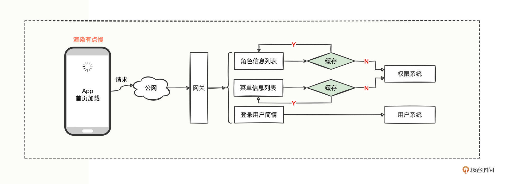
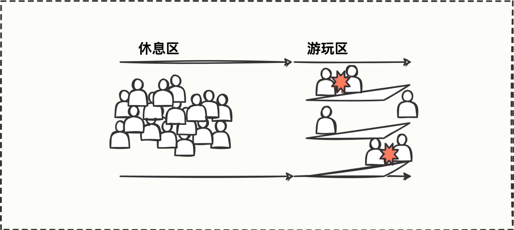
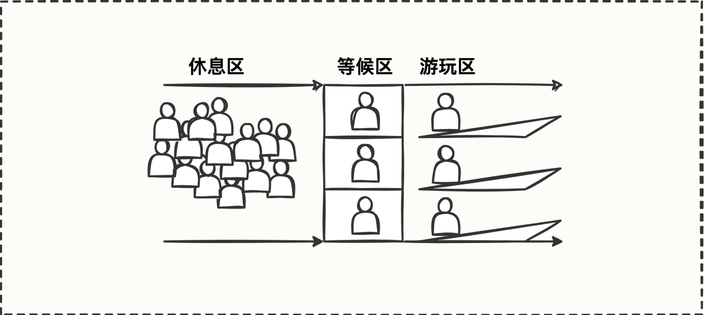
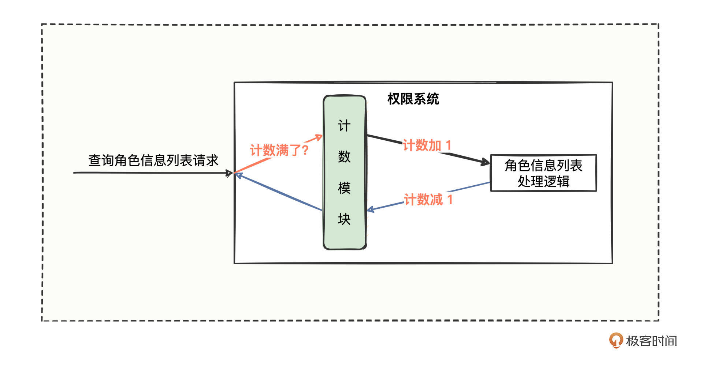

# 09｜流量控制：控制接口调用请求流量的三个秘诀
你好，我是何辉。今天我们探索Dubbo框架的第八道特色风味，流量控制。

在上一讲中，我们通过增加缓存解决App首页加载缓慢的问题，再来回顾下整体调用链路：



每当上下班的时候，App被打开的频率非常高，首页加载的请求流量在短时间内居高不下，随之出现页面打开卡顿、渲染慢的情况。身为架构师团队中的一员，为了保住用户体验，保住流量，你提议采取以空间换时间的方式增加一层缓存，解决了问题。

然而随着时间的推移，平台在慢慢做大，不能再像前期快速增长的阶段那样，无限接收用户请求，力保有求必应，而是需要在系统的健壮性、稳定性层面做一定考量，要对访问的流量进行有效的控制，保证哪天网关的QPS流量出现前所未有的暴增时，不会引发一系列服务的雪崩效应。

对于这样的需求，在消费方和提供方如何进行流量控制呢？我们开始今天的学习。

## 生活限流案例

对于这样一种从未接触过的流量控制，到底怎么做才算控制住了？这是我们首先要思考清楚的问题。

联想一下生活中的流量控制场景，我们可以类比成小朋友玩滑梯的例子：



游玩区有三个滑梯可以玩，每个滑梯一次只能上一个小朋友，但休息区有一堆小朋友都想玩，于是很多小朋友还没有看清滑梯是否空闲，就冲上去了，经常发生碰撞。机智的你会怎么办呢？



没错，可以在休息区和游玩区之间增加一个等候区，等游玩区的小朋友下滑梯了，等候区的小朋友接续上去玩，保证游玩区每个小朋友都能有单独玩滑梯的机会，这样一来，游玩区的秩序也维护了，小朋友被撞伤的风险也极大降低了。

流量控制也是一样的，休息区就像源源不断的请求流量，等候区就是控制流量的逻辑，游玩区就是Dubbo接口的业务逻辑，因为业务逻辑（游玩区）目前只能容纳 3 个请求（小朋友），就需要把多余的请求控制住或者遣散回去，直到一个请求离场了，那下一个请求就可以进去玩了。

简单理解就是在知道标准容量的前提下，比大小。游玩区只有 3 个滑梯，因此 **标准容量** 是 3，如果游玩区目前有2个小朋友在玩， **实时使用量** 是2，标准容量3>实时使用量2，说明可以再来一个小朋友。

现在你应该知道如何进行流量控制了吧？只需要找到标准容量和实时容量两个数值，比大小就可以了。

## 1.单机限流

我们先从最简单的单机开始。

大概逻辑就是把每个请求当作一个小朋友，把最细粒度Dubbo服务中的方法当作游乐场，每个方法设计出一个 **标准容量参数**，然后在方法开始执行业务逻辑时进行计数加1，最后在方法结束执行业务时进行计数减1，而这个计数加1、计数减1就是我们需要的 **实时容量参数**。

于是权限系统的流程图变成这样：



查询请求进入权限系统后，正常情况是先经过计数模块，计数模块进行加1操作，再去处理业务逻辑，待业务逻辑处理完成后返回时，再进行计数减1操作。如果请求进来时，计数模块发现实时容量已满，就拒绝或者等待一会。

### 计数模块的核心逻辑

逻辑梳理完，准备编码了。

到这里，你是不是已经想起了前两讲编码前我们重点提到的思想， **但凡新写一个功能模块，一定要多思考一步是否会多处复用，如果会，就要考虑抽象出来**。

在这里，若代码中其他几个接收请求的方法也需要进行计数操作，就得考虑抽象提炼出来，不能再把计数模块的逻辑写到各个方法里面了，而是需要采用拦截思想，利用过滤器来承载计数模块的逻辑。这样一来，每个方法在接收请求的时候都会经过过滤器，我们就可以很好地利用过滤器拦截机制来进行统一计数处理。

**那计数逻辑该怎么进行加减操作，对谁进行加减操作呢？**

对照流程图我们思索下，查询请求发到权限系统，最终由Dubbo服务的方法来处理业务逻辑的，难道对方法名计数么？

好像不太行，一个系统有那么多服务，每个服务的方法名可能相同，若按照方法名来计数，有可能会出现计数bug而错杀其他无辜的方法。

既然方法名可能相同，那我们再增加一层服务属性的维度呢，服务名称+方法名称，两个维度叠加拼接应该不会重复了？在日常真实项目中，服务名加方法名确实基本够用，但还是有重复概率。

那用什么指标计数呢？我们回忆下，定义一个方法，一般会涉及哪些因子变量？方法名、方法参数列表、方法返回值类型、修饰词，再加方法体，总共五要素。

对于 Dubbo服务这样的 interface 而言， **如果里面定义多个方法具有相同的方法名，通过修改哪个要素可以使得 interface 编译通过呢？**

这难不倒你，把方法参数列表改改就行，即使同名也还是可以编译通过。所以为了计数，难道我们在定义服务方法的时候，还要定义多个同样的方法但方法参数列表不同么？这，是不是有点太麻烦了？

确实。一般来说，功能越强大当然是越好，特别是这种方法相同、方法参数列表不同的重载功能，它比较适合系统内部对于模板的扩充，但是暴露接口给外部的话，我们在设计功能层面最好规避一些复杂的因素，让暴露给到外部的概念尽可能清晰简单易懂，让接口尽可能短小精悍。

像计数逻辑，我们完全可以在设计层面规避掉方法参数列表的概念，形成一种规范约束，通过服务名加方法名构成唯一，这也符合平时说的“约定大于配置”的理念。

### 多线程加减

到这里，计数模块的核心逻辑弄明白了，那在多线程的方式下，用哪个类来进行加减操作，并且保证计数的精准呢？

有Java并发相关知识的你，这个问题难度并不大，既然是多线程，就一定要考虑线程安全、加减原子性概念（有需要可以参考 [《Java并发编程实战课》](https://time.geekbang.org/column/intro/100023901?tab=catalog)）。

这里，我们可以考虑采用 ConcurrentMap + AtomicInteger 来进行加减操作，ConcurrentMap 中的 key 存储的是服务名加方法名，value 是目前已使用次数，ConcurrentMap 保证同一个 key 在并发时计数不相互覆盖，AtomicInteger 保证原子性的加减计数。

这下要点都梳理通了，可以尽情写代码了，来定义一个限流过滤器：

```java
///////////////////////////////////////////////////
// 提供方：自定义限流过滤器
///////////////////////////////////////////////////
@Activate(group = PROVIDER)
public class CustomLimitFilter implements Filter {
    /** <h2>存储计数资源的Map数据结构，预分配容量64，避免无畏的扩容消耗</h2> **/
    private static final ConcurrentMap<String, AtomicInteger> COUNT_MAP = new ConcurrentHashMap<>(64);
    /** <h2>标识启动QPS限流检测，{@code true}：标识开启限流检测，{@code false 或 null}：标识不开启限流检测</h2> **/
    public static final String KEY_QPS_ENABLE = "qps.enable";
    /** <h2>每个方法开启的限流检测值</h2> **/
    public static final String KEY_QPS_VALUE = "qps.value";
    /** <h2>默认的限流检测值，默认为 30</h2> **/
    public static final long DEFAULT_QPS_VALUE = 30;

    @Override
    public Result invoke(Invoker<?> invoker, Invocation invocation) throws RpcException {
        // 获取限流资源的结果，acquired 有三种值：
        // true：获取到计数资源；false：计数已满，无法再获取计数资源；null：不需要限流
        Boolean acquired = null;
        try {
            // 尝试是否能获取到限流计数资源
            acquired = tryAcquire(invoker.getUrl(), invocation);
            // 若获取不到计数资源的话，则直接抛出异常即可，告知调用方限流了
            if (acquired != null && !acquired) {
                throw new RuntimeException(
                    "Failed to acquire service " +
                     String.join(".", invoker.getInterface().getName(), invocation.getMethodName()) +
                     " because of overload.");
            }

            // 能来到这里，要么是不需要限流，要么就是获取到了计数资源，那就直接继续下一步调用即可
            return invoker.invoke(invocation);
        } finally {
            // 调用不管是成功还是失败，都是需要进行计数资源释放的
            release(acquired, invoker.getUrl(), invocation);
        }
    }

    private Boolean tryAcquire(URL url, Invocation invocation) {
        // 从方法层面获取 qps.enable 参数值，如果为 true 则表示开启限流控制，否则不需要限流
        String qpsEnableFlag = url.getMethodParameter(invocation.getMethodName(), KEY_QPS_ENABLE);
        if (!Boolean.TRUE.toString().equals(qpsEnableFlag)) {
            return null;
        }

        // 从方法层面获取 qps.value 限流的标准容量，如果没配置则默认为 30
        long qpsValue = url.getMethodParameter(invocation.getMethodName(), KEY_QPS_VALUE, DEFAULT_QPS_VALUE);
        // 服务名加方法名构建Map的Key
        String serviceKey = String.join("_", url.getServiceKey(), invocation.getMethodName());
        // 尝试看看该服务是否有对应的计数对象
        AtomicInteger currentCount = COUNT_MAP.get(serviceKey);
        if (currentCount == null) {
            // 若没有对应的计数对象的话，则 putIfAbsent 会进行加锁控制，内部有并发锁控制
            COUNT_MAP.putIfAbsent(serviceKey, new AtomicInteger());
            currentCount = COUNT_MAP.get(serviceKey);
        }

        // 若当前的计数值大于或等于已配置的限流值的话，那么返回 false 表示无法获取计数资源
        if (currentCount.get() >= qpsValue) {
            return false;
        }

        // 能来到这里说明是可以获取锁资源的，那么就正常的加锁即可
        currentCount.incrementAndGet();
        return true;
    }

    private void release(Boolean acquired, URL url, Invocation invocation) {
        // 若不需要限流，或者没有获取到计数资源，都不需要进行计数资源释放
        if(acquired == null || !acquired){
            return;
        }
        // 释放计数资源
        String serviceKey = String.join("_", url.getServiceKey(), invocation.getMethodName());
        AtomicInteger currentCount = COUNT_MAP.get(serviceKey);
        currentCount.decrementAndGet();
    }
}

///////////////////////////////////////////////////
// 提供方：查询角色信息列表方法
// 配合限流过滤器而添加的限流参数 qps.enable、qps.value
///////////////////////////////////////////////////
@DubboService(methods = {@Method(
        name = "queryRoleList",
        parameters = {"qps.enable", "true", "qps.value", "3"})}
)
@Component
public class RoleQueryFacadeImpl implements RoleQueryFacade {
    @Override
    public String queryRoleList(String userId) {
        // 睡眠 1 秒，模拟一下查询数据库需要耗费时间
        TimeUtils.sleep(1000);
        String result = String.format(TimeUtils.now() + ": Hello %s, 已查询该用户【角色列表信息】", userId);
        System.out.println(result);
        return result;
    }
}

```

我们顺着代码依次看下在提供方的改造要点：

1. 定义了一个自定义限流过滤器，并设置为主要在提供方生效。
2. 定义了 qps.enable、qps.value 两个方法级别的参数，qps.enable 参数主要表示是否开启流量控制，qps.value 参数主要表示流量的标准容量上限值，这里设置了标准容量的上限值为 3。
3. 在 invoke 方法中先尝试能否获取计数资源，如果不需要限流或已获取限流计数资源，则拦截放行继续向后调用，否则会抛出无法获取计数资源的运行时异常。
4. 在 invoke 的 finally 代码块中处理释放计数资源的逻辑。
5. 在提供方的 @DubboService 注解中，为方法增加了 qps.enable=true、qps.value=3 两个配置，来应用我们刚刚写的限流过滤器。

提供方的代码写的差不多了，马上编写消费方的代码来启动验证看看情况：

```java
@Component
public class InvokeLimitFacade {
    // 引用下游查询角色信息列表的接口
    @DubboReference(timeout = 10000)
    private RoleQueryFacade roleQueryFacade;
    // 引用下游查询菜单信息列表的接口
    @DubboReference(timeout = 10000)
    private MenuQueryFacade menuQueryFacade;
    // 引用下游查询菜单信息列表的接口
    @DubboReference
    private UserQueryFacade userQueryFacade;
    // 定义的一个线程池，来模拟网关接收了很多请求
    ExecutorService executorService = Executors.newCachedThreadPool();

    public void invokeFilter(){
        // 循环 5 次，模拟网关被 App 请求调用了 5 次
        for (int i = 1; i <= 5; i++) {
            int idx = i;
            executorService.execute(() -> invokeCacheInner(idx));
        }
    }

    private void invokeCacheInner(int i){
        // 查询角色信息列表
        String roleRespMsg = roleQueryFacade.queryRoleList("Geek");
        // 查询菜单信息列表
        String menuRespMsg = menuQueryFacade.queryAuthorizedMenuList("Geek");
        // 查询登录用户简情
        String userRespMsg = userQueryFacade.queryUser("Geek");

        // 打印远程调用的结果，看看是走缓存还是走远程
        String idx = new DecimalFormat("00").format(i);
        System.out.println("第 "+ idx + " 次调用【角色信息列表】结果为: " + roleRespMsg);
        System.out.println("第 "+ idx + " 次调用【菜单信息列表】结果为: " + menuRespMsg);
        System.out.println("第 "+ idx + " 次调用【登录用户简情】结果为: " + userRespMsg);
        System.out.println();
    }
}

```

消费方的代码和上一讲中“ [缓存操作](https://time.geekbang.org/column/article/613346)”消费方的代码差不多，只不过这里用线程池的方式来模拟网关接收了很多次请求。

运行 invokeFilter 方法后，网关发起的 5 次请求，3 次是成功的，另外 2 次被拒绝了并且打印了拒绝异常信息如下：

```java
Caused by: org.apache.dubbo.remoting.RemotingException: java.lang.RuntimeException: Failed to acquire service com.hmilyylimh.cloud.facade.role.RoleQueryFacade.queryRoleList because of overload.
java.lang.RuntimeException: Failed to acquire service com.hmilyylimh.cloud.facade.role.RoleQueryFacade.queryRoleList because of overload.
	at com.hmilyylimh.cloud.limit.config.CustomLimitFilter.invoke(CustomLimitFilter.java:38)
	at org.apache.dubbo.rpc.cluster.filter.FilterChainBuilder$CopyOfFilterChainNode.invoke(FilterChainBuilder.java:321)

```

运行的结果非常符合预期，也就是说，通过纯粹的单机限流，我们有效控制住了流量。

## 2.分布式限流

单机限流实现了，我们再上一个难度，毕竟目前部署的服务基本上是集群形式的，如果要控制某个接口在所有集群中的流量次数，单机还能做到么？

很多人直觉这还不简单，如果某个方法需要按照 qps = 100 进行限流，集群中有 4 台机器，那么只要设置 qps.value = 100/4 = 25 不就可以了么，轻松搞定。

这，也不是不可以，只是前提得保证所有机器都正常运转。如果现在有 1 台机器宕机了，那一段时间内，我们岂不是只能提供 qps.size = 25\*3 = 75 的能力了，不满足添加或减少机器方法总 QPS 不变的诉求。

所以 **这是一个分布式的问题**，我们还真不能在每台机器的 JVM 内存中控制流量，得找个第三方存储媒介，让总数的加减操作在第三方存储媒介中完成，应该就可以了。

第三方的存储媒介，联想上一讲“缓存操作”中，我们也用过 Redis 来进行缓存处理，而 Redis 正好也是一个第三方的存储媒介，既然可以缓存数据了，自然也能进行逻辑运算。那我们将提供方的代码稍微改造为用 Redis 来计数处理，代码如下：

```java
///////////////////////////////////////////////////
// 提供方：自定义限流过滤器， jvm + redis 的支持
///////////////////////////////////////////////////
@Activate(group = PROVIDER)
public class CustomLimitFilter implements Filter {
    /** <h2>存储计数资源的Map数据结构，预分配容量64，避免无畏的扩容消耗</h2> **/
    private static final ConcurrentMap<String, AtomicInteger> COUNT_MAP = new ConcurrentHashMap<>(64);
    /** <h2>标识启动QPS限流检测，{@code true}：标识开启限流检测，{@code false 或 null}：标识不开启限流检测</h2> **/
    public static final String KEY_QPS_ENABLE = "qps.enable";
    /** <h2>处理限流的工具，枚举值有：jlimit-JVM限流；rlimit-Redis限流。</h2> **/
    public static final String KEY_QPS_TYPE = "qps.type";
    /** <h2>处理限流的工具，jlimit-JVM限流</h2> **/
    public static final String VALUE_QPS_TYPE_OF_JLIMIT = "jlimit";
    /** <h2>处理限流的工具，rlimit-Redis限流。</h2> **/
    public static final String VALUE_QPS_TYPE_OF_RLIMIT = "rlimit";
    /** <h2>每个方法开启的限流检测值</h2> **/
    public static final String KEY_QPS_VALUE = "qps.value";
    /** <h2>默认的限流检测值</h2> **/
    public static final long DEFAULT_QPS_VALUE = 30;
    /** <h2>策略分发，通过不同的 qps.type 值来选择不同的限流工具进行获取计数资源处理</h2> **/
    private static final Map<String, BiFunction<URL, Invocation, Boolean>> QPS_TYPE_ACQUIRE_MAP = new HashMap<>(4);
    /** <h2>策略分发，通过不同的 qps.type 值来选择不同的限流工具进行释放计数资源处理</h2> **/
    private static final Map<String, BiConsumer<URL, Invocation>> QPS_TYPE_RELEASE_MAP = new HashMap<>(4);
    /** <h2>这里得想办法采取扫描机制简单支持 @Autowired、@Resource 两个注解即可</h2> **/
    @Autowired
    private RedisTemplate redisTemplate;

    /** <h2>利用默认的构造方法在创建的时候，顺便把两个策略Map初始化一下</h2> **/
    public CustomLimitFilter() {
        init();
    }

    private void init() {
        QPS_TYPE_ACQUIRE_MAP.put(VALUE_QPS_TYPE_OF_JLIMIT, (url, invocation) -> tryAcquireOfJvmLimit(url, invocation));
        QPS_TYPE_ACQUIRE_MAP.put(VALUE_QPS_TYPE_OF_RLIMIT, (url, invocation) -> tryAcquireOfRedisLimit(url, invocation));
        QPS_TYPE_RELEASE_MAP.put(VALUE_QPS_TYPE_OF_JLIMIT, (url, invocation) -> releaseOfJvmLimit(url, invocation));
        QPS_TYPE_RELEASE_MAP.put(VALUE_QPS_TYPE_OF_RLIMIT, (url, invocation) -> releaseOfRedisLimit(url, invocation));
    }

    @Override
    public Result invoke(Invoker<?> invoker, Invocation invocation) throws RpcException {
        // 获取限流资源的结果，acquired 有三种值：
        // true：获取到计数资源；false：计数已满，无法再获取计数资源；null：不需要限流
        Boolean acquired = null;
        try {
            // 尝试是否能获取到限流计数资源
            acquired = tryAcquire(invoker.getUrl(), invocation);
            // 若获取不到计数资源的话，则直接抛出异常即可，告知调用方限流了
            if (acquired != null && !acquired) {
                throw new RuntimeException(
                    "Failed to acquire service " +
                     String.join(".", invoker.getInterface().getName(), invocation.getMethodName()) +
                     " because of overload.");
            }
            // 能来到这里，要么是不需要限流，要么就是获取到了计数资源，那就直接继续下一步调用即可
            return invoker.invoke(invocation);
        } finally {
            // 调用不管是成功还是失败，都是需要进行计数资源释放的
            release(acquired, invoker.getUrl(), invocation);
        }
    }

    // 尝试是否能获取到限流计数资源
    private Boolean tryAcquire(URL url, Invocation invocation) {
        // 从方法层面获取 qps.enable 参数值，如果为 true 则表示开启限流控制，否则不需要限流
        String qpsEnableFlag = url.getMethodParameter(invocation.getMethodName(), KEY_QPS_ENABLE);
        if (!Boolean.TRUE.toString().equals(qpsEnableFlag)) {
            return null;
        }

        // 从方法层面获取 qps.type 参数值，默认采用 JVM 内存来处理限流，若设置的类型从 Map 中找不到则当作不需要限流处理
        String qpsTypeVal = url.getMethodParameter
                (invocation.getMethodName(), KEY_QPS_TYPE, VALUE_QPS_TYPE_OF_JLIMIT);
        BiFunction<URL, Invocation, Boolean> func = QPS_TYPE_ACQUIRE_MAP.get(qpsTypeVal);
        if (func == null) {
            return null;
        }

        // 根据 qps.type 找到对应的工具进行策略分发按照不同的工具进行限流处理
        return func.apply(url, invocation);
    }

    // 进行计数资源释放
    private void release(Boolean acquired, URL url, Invocation invocation) {
        // 若不需要限流，或者没有获取到计数资源，都不需要进行计数资源释放
        if(acquired == null || !acquired){
            return;
        }

        // 从方法层面获取 qps.type 参数值，默认采用 JVM 内存来处理限流，若设置的类型从 Map 中找不到则当作不需要限流处理
        String qpsTypeVal = url.getMethodParameter
                (invocation.getMethodName(), KEY_QPS_TYPE, VALUE_QPS_TYPE_OF_JLIMIT);
        BiConsumer<URL, Invocation> func = QPS_TYPE_RELEASE_MAP.get(qpsTypeVal);
        if (func == null) {
            return;
        }

        // 根据 qps.type 找到对应的工具进行策略分发按照不同的工具进行释放计数资源处理
        func.accept(url, invocation);
    }

    // 通过JVM内存的处理方式，来尝试是否能获取到限流计数资源
    private Boolean tryAcquireOfJvmLimit(URL url, Invocation invocation) {
        // 从方法层面获取 qps.value 限流的标准容量，如果没配置则默认为 30
        long qpsValue = url.getMethodParameter
                (invocation.getMethodName(), KEY_QPS_VALUE, DEFAULT_QPS_VALUE);
        // 服务名加方法名构建Map的Key
        String serviceKey = String.join("_", url.getServiceKey(), invocation.getMethodName());

        // 尝试看看该服务是否有对应的计数对象
        AtomicInteger currentCount = COUNT_MAP.get(serviceKey);
        if (currentCount == null) {
            // 若没有对应的计数对象的话，则 putIfAbsent 会进行加锁控制，内部有并发锁控制
            COUNT_MAP.putIfAbsent(serviceKey, new AtomicInteger());
            currentCount = COUNT_MAP.get(serviceKey);
        }

        // 若当前的计数值大于或等于已配置的限流值的话，那么返回 false 表示无法获取计数资源
        if (currentCount.get() >= qpsValue) {
            return false;
        }
        // 能来到这里说明是可以获取锁资源的，那么就正常的加锁即可
        currentCount.incrementAndGet();
        return true;
    }

    // 通过JVM内存的处理方式，来进行计数资源释放
    private void releaseOfJvmLimit(URL url, Invocation invocation) {
        // 释放计数资源
        String serviceKey = String.join("_", url.getServiceKey(), invocation.getMethodName());
        AtomicInteger currentCount = COUNT_MAP.get(serviceKey);
        currentCount.decrementAndGet();
    }

    // 通过Redis的处理方式，来尝试是否能获取到限流计数资源
    private Boolean tryAcquireOfRedisLimit(URL url, Invocation invocation) {
        // 从方法层面获取 qps.value 限流的标准容量，如果没配置则默认为 30
        long qpsValue = url.getMethodParameter
                (invocation.getMethodName(), KEY_QPS_VALUE, DEFAULT_QPS_VALUE);
        // 服务名加方法名构建Map的Key
        String serviceKey = String.join("_", url.getServiceKey(), invocation.getMethodName());

        // 尝试看看该服务在 redis 中当前计数值是多少
        int currentCount = NumberUtils.toInt(redisTemplate.opsForValue().get(serviceKey));
        // 若当前的计数值大于或等于已配置的限流值的话，那么返回 false 表示无法获取计数资源
        if (currentCount.get() >= qpsValue) {
            return false;
        }

        // 能来到这里说明是可以获取锁资源的，那么就正常的加锁即可
        redisTemplate.opsForValue().increment(serviceKey, 1);
        return true;
    }

    // 通过Redis的处理方式，来进行计数资源释放
    private void releaseOfRedisLimit(URL url, Invocation invocation) {
        // 释放计数资源
        String serviceKey = String.join("_", url.getServiceKey(), invocation.getMethodName());
        redisTemplate.opsForValue().increment(serviceKey, -1);
    }
}

///////////////////////////////////////////////////
// 提供方：查询角色信息列表方法
// 配合限流过滤器而添加的限流参数 qps.enable、qps.value
///////////////////////////////////////////////////
@DubboService(methods = {@Method(
        name = "queryRoleList",
        parameters = {
                "qps.enable", "true",
                "qps.value", "3",
                "qps.type", "redis"
        })}
)
@Component
public class RoleQueryFacadeImpl implements RoleQueryFacade {
    @Override
    public String queryRoleList(String userId) {
        // 睡眠 1 秒，模拟一下查询数据库需要耗费时间
        TimeUtils.sleep(1000);
        String result = String.format(TimeUtils.now() + ": Hello %s, 已查询该用户【角色列表信息】", userId);
        System.out.println(result);
        return result;
    }
}

```

引入了Redis来处理分布式限流，主要 4 个改造点：

1. 新增了 qps.type 方法级别的参数，主要表示处理限流的工具，有 jlimit、rlimit 两种，jlimit 表示采用JVM限流，rlimit 表示采用Redis限流，qps.type 不配置的情况下默认为JVM限流。
2. 根据 qps.type 不同的值需要用不同的工具进行限流处理，这里采用了 Map 结构引入了策略模式来做分发，并把策略模式应用到 invoke 方法的主体逻辑中。
3. 新增了一套关于 Redis 的计数累加、计数核减的逻辑实现。
4. 在提供方的 @DubboService 注解中，继续为方法增加了 qps.type=redis 的配置，表示需要使用分布式限流。

就这样，在JVM限流的基础之上扩充了分布式限流，很巧妙的是，我们在编写代码应用的时候非常简单，添加几个参数而已，就实现了单机、分布式的流量控制，是不是很神奇，有没有体会到做底层设计的一种快乐，既能满足诉求，也能简单好用。

有了实操经验打底，你再看 Dubbo 框架的一套 TPS 限流过滤器，就会发现和你的设计思路大同小异，比如在单位时间60秒内，标准容量参数值为100，如果在这60秒内请求次数大于100次，就会抛出异常。只不过 TPS 限流过滤器会考虑时间段的因素概念，并且采用的是JVM来处理限流。

只要思路正确了，大体实现逻辑没问题，代码中更多的细节因素就因人而异了，毕竟这些细节因素都是由相应的问题暴露或诉求衍生出来的，当你遇到类似的问题，你也能很好地应对。其实，如果你设计的功能，别人用的舒服，一旦推广起来，你写的代码也会自然成为了别人眼中了不起的源码。

## 流量控制的应用

通过一番改造后，我们知道了可以采用JVM或Redis来进行限流，防止哪天首页加载流量过高引发雪崩效应。在实际应用开发过程中，还有许多的应用场景也在使用限流。

第一，合法性限流，比如验证码攻击、恶意IP爬虫、恶意请求参数，利用限流可以有效拦截这些恶意请求，保证正常业务的运转。

第二，业务限流，比如App案例中的权限系统，参考接口的业务调用频率，我们要合理地评估功能的并发支撑能力。

第三，网关限流，比如App案例中的网关，当首页加载流量异常爆炸时，也可以进行有效的限流控制。

第四，连接数限流，比如利用线程池的数量来控制流量。

## 总结

今天，我们继续探讨App首页加载渲染缓慢的例子，考虑用户增长时如何从流量层面进行一定的控制。限流，其实就是在标准容量与实时容量之间比大小。

单机限流，在应用程序的JVM内存中进行流量控制，只能局限于当前进程，无法对多进程进行流量控制，分布式限流，弥补了这一短板，但是引入了第三方存储媒介，一定程度增加了应用的复杂度。

我们复习一下自定义限流过滤器的关键步骤：

- 首先，定义了一个自定义限流过滤器，并设置为主要在提供方生效。
- 其次，定义了 qps.enable、qps.value、qps.type 三个方法级别的参数来支持单机限流和分布式限流。
- 最后，实现限流逻辑，并在提供方应用的时候，需要在 @DubboService 注解中添加对应的参数配置。

控制请求流量的三个秘诀也分享给你：

- 第一，寻找请求流经的必经之路，并在必经之路上找到可扩展的接口。
- 第二，找到该接口的众多实现类，研究在触发调用的入口可以拿到哪些数据，再研究关于方法的入参数据、方法本身信息以及方法归属类的信息可以通过哪些 API 拿到。
- 第三，根据限流的核心计算模块，逐渐横向扩展，从单个方法到多个方法，从单个服务到多个服务，从单个节点到集群节点，来尽可能周全地考虑通用处理方式，同时站在使用者的角度做到简单易用的效果。


  流量控制的应用场景有四类，合法性限流、业务限流、网关限流、连接数限流。

### 思考题

通过限流过滤器进行单机限流和分布式限流的改造，相信你已经掌握了，这里留 2 个作业给你：

1. 我们只是在提供方实现了限流解决方案，在此基础之上你能继续实现消费方的限流解决方案吗？
2. Dubbo 框架也有像 CustomCacheFilter 类似实现思路的支撑能力，研究下 ActiveLimitFilter、ExecuteLimitFilter 该如何应用。

记得通过练习巩固今天所学哦，欢迎在留言区分享你的思考和学习心得。我们下节课再见。

### 08思考题参考

上一期的问题是尝试把 CacheFilter 稍微改造一下，既支持所有参数值拼接作为缓存Key，也能挑选某些参数值拼接作为缓存Key。

解决这个问题，我们还是得从 CacheFilter 着手，在拼接所有参数值的这个地方，可以开个分支，若有部分参数值拼接的诉求，那么就直接取用，否则还是走老逻辑。代码可以这样修改下：

```java
// 自定义缓存过滤器，在消费方、提供方都能生效使用
@Activate(group = {CONSUMER, PROVIDER})
public class CustomCacheFilter implements Filter {
    private CacheFactory cacheFactory;
    public void setCacheFactory(CacheFactory cacheFactory) {
        this.cacheFactory = cacheFactory;
    }
    @Override
    public Result invoke(Invoker<?> invoker, Invocation invocation) throws RpcException {
        // 先看下有没有 cacheFactory 这个扩展点
        // 然后看下方法级别上有没有一个叫做 cache 的标识键
        if (cacheFactory != null &&
                "true".equals(invoker.getUrl().getMethodParameter(invocation.getMethodName(), "cache.enable"))) {
            // 既然有 cache 标识键的话，那么就弄出一个 Cache 对象出来，后续需要用这个 Cache 对象来装结果的
            Cache cache = cacheFactory.getCache(invoker.getUrl(), invocation);
            if (cache != null) {
                // 将方法接口调用的参数值想办法变成一个组合的字符串 key，作为标识缓存结果是否存在的 key
                // nodes样例值情况：
                // 1、id
                // 2、id,name
                // 3、id,name,sex
                // 4、list[0].id,list[1].name,list[2].sex
                String nodes = invoker.getUrl().getMethodParameter
                        (invocation.getMethodName(), "cache.unique.nodes");
                String key = null;
                if(StringUtils.isBlank(nodes)){
                    key = StringUtils.toArgumentString(invocation.getArguments());
                } else {
                    // 该方法的重点逻辑就是根据 nodes 里面的路径，
                    // 从 invocation.getArguments() 取出对应的路径值
                    // 然后将参数值拼接在一起构成key
                    key = extraNodeValueToArgumentString(nodes);
                }
                // 通过 key 从缓存对象 cache 里面获取缓存结果
                Object value = cache.get(key);
                // 如果获取到的 value 缓存结果不为空，说明是有缓存的，那么就直接返回
                if (value != null) {
                    if (value instanceof ValueWrapper) {
                        return AsyncRpcResult.newDefaultAsyncResult(((ValueWrapper) value).get(), invocation);
                    } else {
                        return AsyncRpcResult.newDefaultAsyncResult(value, invocation);
                    }
                }
                // 如果 value 为空说明并没有缓存起来，于是继续发起下一步远程调用，并拿到结果
                Result result = invoker.invoke(invocation);
                // 如果拿到的 result 结果没有异常的话，那么就把缓存结果放到 cache 中去
                if (!result.hasException()) {
                    cache.put(key, new ValueWrapper(result.getValue()));
                }
                return result;
            }
        }
        // 如果连 cacheFactory 这个扩展点都没有，说明并不需要缓存，原来该怎么调用就还是接着怎么调用
        return invoker.invoke(invocation);
    }
    static class ValueWrapper implements Serializable {
        private static final long serialVersionUID = -1777337318019193256L;
        private final Object value;
        public ValueWrapper (Object value) {
            this.value = value;
        }
        public Object get() {
            return this.value;
        }
    }
}

```

代码的改造逻辑主要有 3 步：

- 第一，定义一个自己的缓存过滤器 CustomCacheFilter，定义成消费方、提供方均可使用，并且定义两个属性，cache.enable 表示是否启用自定义缓存，cache.unique.nodes 表示部分字段值需要构成缓存Key即可。
- 第二，在自定义的缓存过滤器中实现上述 invoke 方法的核心代码逻辑。
- 第三，将自己写的自定义过滤器的全类名添加到 META-INF\\dubbo\\internal\\org.apache.dubbo.rpc.Filter 配置文件中，内容为：

```java
customCache=com.hmilyylimh.cloud.cache.config.CustomCacheFilter

```

最终使用的时候就不用再配置 cache 属性了，直接使用自定义的 cache.enable、cache.unique.nodes 两个属性即可。

如果你实在觉得 Redisson 框架过于臃肿，还可以考虑在 CustomCacheFilter 的 invoke 方法中，根据现有的 key 和 value 自己直接使用 Redis 相关的 API 进行存储。