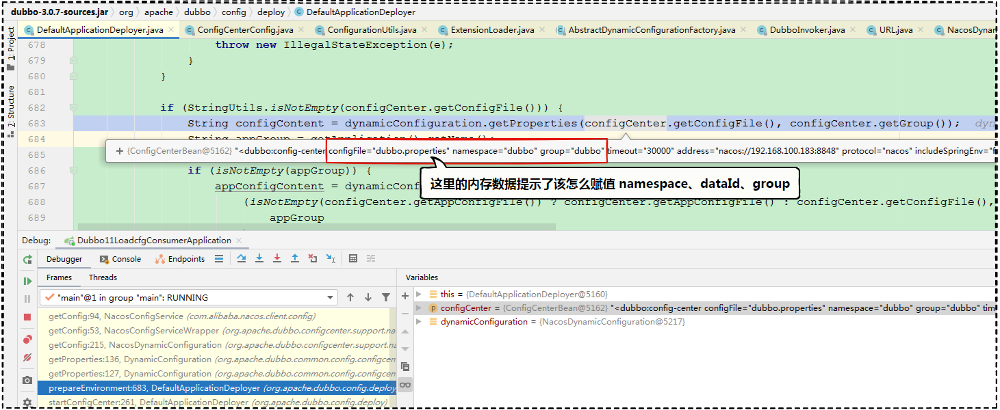

# 12｜源码框架：框架在源码层面如何体现分层？
你好，我是何辉。从今天起我们进入Dubbo源码的学习。

经过前面十道Dubbo特色风味的探索，相信你对Dubbo的高级特性已经了如指掌了，也一定程度上具备了针对Dubbo框架进行二次开发的能力。

招式，已经学的炉火纯青，接下来我们就要学习Dubbo的内功心法了，做到知其然知其所以然，才能以不变的底层源码理解应万变，灵活解决各色各样的未知问题。

不过在深入研究底层源码之前，我们得先窥其全貌，站在上帝视角来俯视一番，看看框架在代码层面到底是如何分层搭建的，掌握Dubbo框架的骨骼构成，在未来的实战过程中，我们才能有目的的针对不同的关节添砖加瓦。

## 模块流程图

要讲Dubbo框架在代码层面是如何分层搭建的，最官方的图肯定逃不开这张（ [Dubbo 官网的整体设计图](https://dubbo.apache.org/imgs/dev/dubbo-framework.jpg)），不过，这张图一看就非常复杂，涉及太多细节，不便理解。


我们重点看左侧的10个模块，分别是和business紧密相关的 Service 层，和RPC紧密相关的Config、Proxy、Registry、Cluster、Monitor和Protocol，以及和Remoting 紧密相关的Exchange、Transport、Serialize。

这10个模块各自的作用是什么，之间又有着怎样的联系？


今天，我们将会从消费方发起一次调用开始，尝试把这十个模块串联起来，看看在调用过程中一步步会涉及哪些模块。好，话不多说，我们马上开始。

### 1\. Service

作为消费方或提供方，引用一个 facade.jar 包是一件非常简单的事情，但是 jar 包里面其实有很多接口，不过在实际开发中通过编码发起远程调用时，你会发现，消费方只是引用了 jar 包中的接口来进行调用，就可以拿到想要的结果了，非常简单。

比如这样一段消费方调用提供方的简短代码：

```java
// 消费方通过Spring的上下文对象工具类拿到 CryptoFacade 接口的实例对象
CryptoFacade cryptoFacade = SpringCtxUtils.getBean(CryptoFacade.class);
// 然后调用接口的解密方法，并打印结果
System.out.println(cryptoFacade.decrypt("Geek"));

```

其实就是上一讲提到消费方调用提供方的加解密服务进行解密，消费方只简单调用了一个接口，而提供方通过定义 CryptoFacadeImpl 实现 CryptoFacade 接口的所有方法，承担起了真正提供服务的能力。

像这些接口（CryptoFacade）和接口实现类（CryptoFacadeImpl），都与实际业务息息相关的，和底层框架没有太多的牵连， **Dubbo 把这样与业务逻辑关联紧密的一层称为服务层，即 Service。**

### 2\. Config

现在有了Service服务层的代码编写，不过，在消费方发起远程调用前，为了更周全地考虑调用过程中可能会发生的一些状况，我们一般都会考虑为远程调用配置一些参数：


比如调用接口应该设置多少超时时间、调用接口发生 RpcException 时应该自动重试多少次、调用接口频次比较高的话应该怎么设置缓存参数等等。

调用是相互的，调用方有一堆的配置要设置，提供方也一样，同样会需要针对方法、接口、实例设置一堆的配置。

这些配置，站在代码层面来说，就是平常接触的标签、注解、API，更实际点说，落地到类层面就是代码中各种 XxxConfig 类，比如 ServiceConfig、ReferenceConfig，都是我们比较熟悉的配置类， **Dubbo 把这样专门存储与读取配置打交道的层次称为配置层，即 Config。**

### 3\. Proxy

现在 facade.jar 包引用了，Config 也配置了，接下来是时候准备调用远程了。

可是，消费方都是拿着 facade.jar 包里面的接口进行远程调用的，即便你是一个刚学过 Java 的初学者，也肯定疑惑过一个接口怎么就能调用远程拿到结果的？既然接口无法发起远程调用，那又是谁做着中间商的角色，帮助消费方悄悄实现了调用远程的逻辑呢？

想一下，接口在消费方又没有实现类，然后有一位中间商悄悄干完了所有的事情，这个所谓的“中间商”不就是像代理商一样么，消费方有什么诉求，代理商就实现这个诉求，至于这个诉求如何实现，是坐船还是坐飞机，那都是代理商的事情，和消费方无关。


到这里，我们就想到了代理，还不是静态代理，必须是动态代理。因为静态代理需要事先知道代理什么，并按一定的规则进行相应的业务逻辑编写，但是动态代理就不一样，动态代理不需要知道要代理什么东西，只需要在运行时根据业务逻辑实现远程调用。

这也是为什么消费方统一拿着 facade.jar 包里面的接口就能发起远程调用，因为它们背地里都利用了动态代理，为实现远程调用穿了一层马甲，这也势必迫使提供方按照统一的代理逻辑接收处理，然后想办法分发调用不同的实现类。 **因此 Dubbo 把这种代理接口发起远程调用，或代理接收请求进行实例分发处理的层次，称为服务代理层，即 Proxy。**

### 4\. Registry

facade.jar引用，Config，Proxy，万事俱备，只欠 IP。

代理逻辑都要发起远程调用了，但发起远程调用是需要知道目标 IP 地址的，可是，提供方的 IP 地址在哪里呢？谁又可以完好地给出一份关于该调用接口的所有提供方 IP 地址列表呢？或者说，作为消费方，应该从哪里拿到或者感知到该接口的所有提供方 IP 地址列表呢？


这就衍生出了一个专门和注册中心打交道的模块，来帮我们注册服务、发现服务， **因此 Dubbo 把这种专门与注册中心打交道的层次，称为注册中心层，即 Registry。**

### 5\. Cluster

现在，消费方的 Registry 拿到一堆提供方的 IP 地址列表，每个 IP 地址就相当于一个提供方。

那么想调用一个接口，还得想办法从众多提供方列表中按照一定的算法选择一个，选择的时候又得考虑是否需要过滤一些不想要的，最终筛选出一个符合逻辑的提供方。


而这一堆的逻辑，我们总得有一个东西来承载吧，总不至于向面向过程那样从上到下平铺开来， **因此 Dubbo 将这种封装多个提供者并承担路由过滤和负载均衡的层次，称为路由层，即 Cluster。**

### 6\. Monitor

通过 Cluster 选择到了一个具体的提供者，总可以发起远程调用了吧。

然而一次远程调用，总归是要有结果的，正常也好，异常也好，都是一种结果。比如某个方法调用成功了多少次，失败了多少次，调用前后所花费的时间是多少。这些看似和业务逻辑无关紧要，实际，对我们开发人员在分析问题或者预估未来趋势时有着无与伦比的价值。

但是，谁来做这个上报调用结果的事情呢？


于是诞生了一个监控模块来专门处理这种事情， **Dubbo 将这种同步调用结果的层次称为监控层，即 Monitor。**

### 7\. Protocol

然而远程调用也是一个过程，出于增强框架灵活扩展业务的需求，我们有时候需要在调用之前做点什么，在调用之后做点什么，我们前面接触过很多次的过滤器就是过程中的一个环节。

如果把远程调用看作一个“实体对象”，拿着这个“实体对象”就能调出去拿到结果，就好像“实体对象”封装了 RPC 调用的细节，我们只需要感知“实体对象”的存在就好了。


那么封装调用细节，取回调用结果， **Dubbo 将这种封装调用过程的层次称为远程调用层，即 Protocol。**

### 8\. Exchange

对于我们平常接触的HTTP请求来说，开发人员感知的是调用五花八门的URL地址，但发送 HTTP 报文的逻辑最终归到一个抽象的发送数据的口子，统一处理。


对 Dubbo 框架来说也是一样，消费方的五花八门的业务请求数据最终会封装为 Request、Response 对象，至于拿着 Request 对象是进行同步调用，还是直接转异步调用通过 Future.get 拿结果，那是底层要做的事情， **因此 Dubbo 将这种封装请求并根据同步异步模式获取响应结果的层次，称为信息交换层，即 Exchange。**

### 9\. Transport

当 Request 请求对象准备好了，不管是同步发送，还是异步发送，最终都是需要发送出去的，但是对象通过谁来发到网络中的呢？


这就需要网络通信框架出场了。

网络通信框架，封装了网络层面的各种细节，只暴露一些发送对象的简单接口，上层只需要放心把 Request 对象交给网络通信框架就可以了， **因此 Dubbo 把这种能将数据通过网络发送至对端服务的层次称为网络传输层，即 Transport。**

### 10\. Serialize

了解过七层网络模型的你也知道，网络通信框架最终要把对象转成二进制才能往网卡中发送，那么谁来将这些实打实的 Request、Response 对象翻译成网络中能识别的二进制数据呢？


这就衍生出了一个将对象转成二进制或将二进制转成对象的模块， **Dubbo 将这种能把对象与二进制进行相互转换的正反序列化的层次称为数据序列化层，即 Serialize。**

### 十层模块

不知不觉，我们已经梳理了 Dubbo 代码框架的十层模块，现在，一个流程的调用，想必你已经有整体轮廓的了解了：


再去研究那张 [Dubbo 官网的整体设计图](https://dubbo.apache.org/imgs/dev/dubbo-framework.jpg)，你一定会有意想不到的收获。


从这张图中，沿着红色箭头从上往下看，紧抓主干流程，忽略箭头的横向细节分支，你有没有发现这张图其实并不难。

现在你已经理解了调用的正向流程，其实被动调用的提供方接收流程也就呼之欲出了。而且我们在脑海中建立起了整个主干流程体系，之后再研究每个层次模块中涉及的接口或类，会更得心应手，离掌握Dubbo的设计精髓也不远了。

## 代码分包架构

整体了解了十层模块，可能你还不是很尽兴，毕竟没有一种触摸代码的踏实感。那接下来我们就以 [Dubbo 3.0.7 版本](https://github.com/apache/dubbo/archive/refs/tags/dubbo-3.0.7.zip) 为例，看看在工程的实际目录中，每层模块落在源码层面的哪个 Module 中。


图中10个模块都对号入座了，结合每一层的作用，不知道你有没有发现，在源码层面，每层模块都有着与之对应的 Module 来承载，每个 Module 都是极聚焦的层次，见名知意。

还有些未圈出来的模块，这里我们也举 3 个平常比较关注的 Module：

1. **dubbo-common** 是 Dubbo 的公共逻辑模块，包含了许多工具类和一些通用模型对象。
2. **dubbo-configcenter** 是专门来与外部各种配置中心进行交互的，在上一讲“ [配置加载](https://time.geekbang.org/column/article/615345)”中，我们配置过 `<dubbo:config-center/>` 标签，标签内容填写的 address 是 nacos 配置中心的地址， 其实就是该模块屏蔽了与外部配置中心的各种交互的细节逻辑。
3. **dubbo-filter** 是一些与过滤器有着紧密关联的功能，目前有缓存过滤器、校验过滤器两个功能。

看到 Dubbo 这样 Module 层次分明的代码架构，不由得心生感慨，特别是发现 dubbo-compatible 模块中放的都是一些历史版本要废弃的类，里面基本上打上 @Deprecated 注解，表明虽然在新版本已经不用了，但也不会直接删除掉导致不能向下兼容，考虑了老版本的用户，非常贴心。

我们之后设计自己的系统代码，或者设计自己的框架时，也可以学习 Dubbo 的一些风格，尽量命名见名知意，分层架构清晰，独立 Module 做聚焦独立的事情，分门别类撇清业务界限，站在高度，抽象视角思考问题，在落地低处，踏实写好实现逻辑。

## 总结

今天，我们从消费方发起调用开始介入，逐步分析Dubbo的每层模块的由来以及承担的职责，形成对Dubbo的整体了解，最后在 Dubbo 3.0.7 源码层面上标识出每个模块与工程的 Module 对号入座。

一个简简单单的调用，居然有这么多需要关注的层次模块，即便是你自己写的RPC调用框架壮大成型后，代码层次结构设计以及每层可能遇到的问题，和 Dubbo 框架其实会有着相似的解决套路。


最后也总结下十层模块的作用：


### 思考题

了解了十大模块和对应的代码分包架构，你可能有一种要把源码翻个底朝天的跃跃欲试感觉吧。留个作业给你，除了今天从发起调用切入的思路外，想建立起对模块的整体认知，还可以通过一次简单调用展开来，你可以试试用一次简单调用，串联起尽可能多的模块。

欢迎在留言区分享你的思考和实践结果。我们下节课再见。

### 11思考题参考

上一期留了 2 个问题。

第一个问题：再次添加同样的 dataId 和 group 值时，为什么会报错？

如果平常没使用过 Nacos，你也不用慌，我们还是按照惯例从报错开始，慢慢了解 Nacos 为什么不能按照“dataId = dubbo.properties，group = dubbo”这样的内容，添加两条同样的记录。

接下来我们关闭 Nacos 服务，配置 Dubbo 的配置从 Nacos 读取：

```java
<dubbo:config-center address="nacos://192.168.100.183:8848"/>

```

这里一定要关闭 Nacos 服务，我们目的就是要看到消费方启动报错的异常日志，当消费方启动后，结果如预期所料，报错信息如下：

```java
java.util.concurrent.ExecutionException: com.alibaba.nacos.shaded.io.grpc.StatusRuntimeException: UNAVAILABLE: io exception
	at com.alibaba.nacos.shaded.com.google.common.util.concurrent.AbstractFuture.getDoneValue(AbstractFuture.java:566) ~[nacos-client-2.0.4.jar:na]
	at com.alibaba.nacos.shaded.com.google.common.util.concurrent.AbstractFuture.get(AbstractFuture.java:445) ~[nacos-client-2.0.4.jar:na]
	at com.alibaba.nacos.common.remote.client.grpc.GrpcClient.serverCheck(GrpcClient.java:148) ~[nacos-client-2.0.4.jar:na]
	at com.alibaba.nacos.common.remote.client.grpc.GrpcClient.connectToServer(GrpcClient.java:264) ~[nacos-client-2.0.4.jar:na]
	at com.alibaba.nacos.common.remote.client.RpcClient.start(RpcClient.java:390) ~[nacos-client-2.0.4.jar:na]
	at com.alibaba.nacos.client.config.impl.ClientWorker$ConfigRpcTransportClient.ensureRpcClient(ClientWorker.java:885) ~[nacos-client-2.0.4.jar:na]
	at com.alibaba.nacos.client.config.impl.ClientWorker$ConfigRpcTransportClient.getOneRunningClient(ClientWorker.java:1044) ~[nacos-client-2.0.4.jar:na]
	at com.alibaba.nacos.client.config.impl.ClientWorker$ConfigRpcTransportClient.queryConfig(ClientWorker.java:940) ~[nacos-client-2.0.4.jar:na]
	at com.alibaba.nacos.client.config.impl.ClientWorker.getServerConfig(ClientWorker.java:397) ~[nacos-client-2.0.4.jar:na]
	at com.alibaba.nacos.client.config.NacosConfigService.getConfigInner(NacosConfigService.java:166) ~[nacos-client-2.0.4.jar:na]
	at com.alibaba.nacos.client.config.NacosConfigService.getConfig(NacosConfigService.java:94) ~[nacos-client-2.0.4.jar:na]
	at org.apache.dubbo.configcenter.support.nacos.NacosConfigServiceWrapper.getConfig(NacosConfigServiceWrapper.java:53) ~[dubbo-3.0.7.jar:3.0.7]
	at org.apache.dubbo.configcenter.support.nacos.NacosDynamicConfiguration.getConfig(NacosDynamicConfiguration.java:215) ~[dubbo-3.0.7.jar:3.0.7]
	at org.apache.dubbo.common.config.configcenter.DynamicConfiguration.getProperties(DynamicConfiguration.java:136) ~[dubbo-3.0.7.jar:3.0.7]
	at org.apache.dubbo.common.config.configcenter.DynamicConfiguration.getProperties(DynamicConfiguration.java:127) ~[dubbo-3.0.7.jar:3.0.7]
	at org.apache.dubbo.config.deploy.DefaultApplicationDeployer.prepareEnvironment(DefaultApplicationDeployer.java:683) ~[dubbo-3.0.7.jar:3.0.7]
	at org.apache.dubbo.config.deploy.DefaultApplicationDeployer.startConfigCenter(DefaultApplicationDeployer.java:261) ~[dubbo-3.0.7.jar:3.0.7]
	at org.apache.dubbo.config.deploy.DefaultApplicationDeployer.initialize(DefaultApplicationDeployer.java:185) ~[dubbo-3.0.7.jar:3.0.7]

```

从报错日志中寻找和 nacos 关键字相关的类，看到第 12 行时，直觉这里应该是去获取配置文件内容，于是进入到 NacosConfigService.java 的 94 行代码：

```java
@Override
public String getConfig(String dataId, String group, long timeoutMs) throws NacosException {
    return getConfigInner(namespace, dataId, group, timeoutMs);
}

```

从 getConfig 代码中，我们发现调用了一个 getConfigInner 的方法，并且使用了 namespace、dataId、group 三个维度去查询配置，既然底层 API 需要按照这样的维度去查询，那也就意味着这三个维度能构成唯一关系。

而再次填写 dataId = dubbo.properties，group = dubbo 的内容，还有一个 namespace 是默认的 public 值，我们根本没有改动过这个 namespace 字段值，也在一定程度上说明了 namespace、dataId、group 三个字段可以构建唯一关系。

不过接下来用 namespace = basic（真实代码中这里应该填写 basic 对应的唯一序列号值）、dataId = dubbo.properties，group = dubbo 这样的值试一试就知道了，试出来的结果如下：


我们从 basic 的命名空间下再次看到了同样的 dataId 和 group，也就证实了 namespace、dataId、group 三个字段确实可以构建唯一关系。

第二个问题：怎么遵循 Nacos 的规范正确填写 `<dubbo:config-center/>` 标签里面的内容？

这个问题比较简单，我们刚刚找到了 getConfig 方法，试着在该方法中打个断点，看看内存中到底是怎样的传参就知道了，断点如下：


再次重新继续 Debug 运行消费方，




找到了赋值 namespace、dataId、group 的源头就是 `<dubbo:config-center/>` 标签。

于是修改消费方的 config-center 标签内容：

```java
<dubbo:config-center address="nacos://192.168.100.183:8848"
                     namespace="8fe69e06-3f5b-4455-9567-c3fbe8bdad10"
                     config-file="dubbo.properties"
                     group="dubbo"/>

```

按照这样的方式，每个应用就都能拿到对应各自的 dubbo.properties 内容了，毕竟有了 3 个维度的约束，总能按照一定的方式找到对应的配置文件。