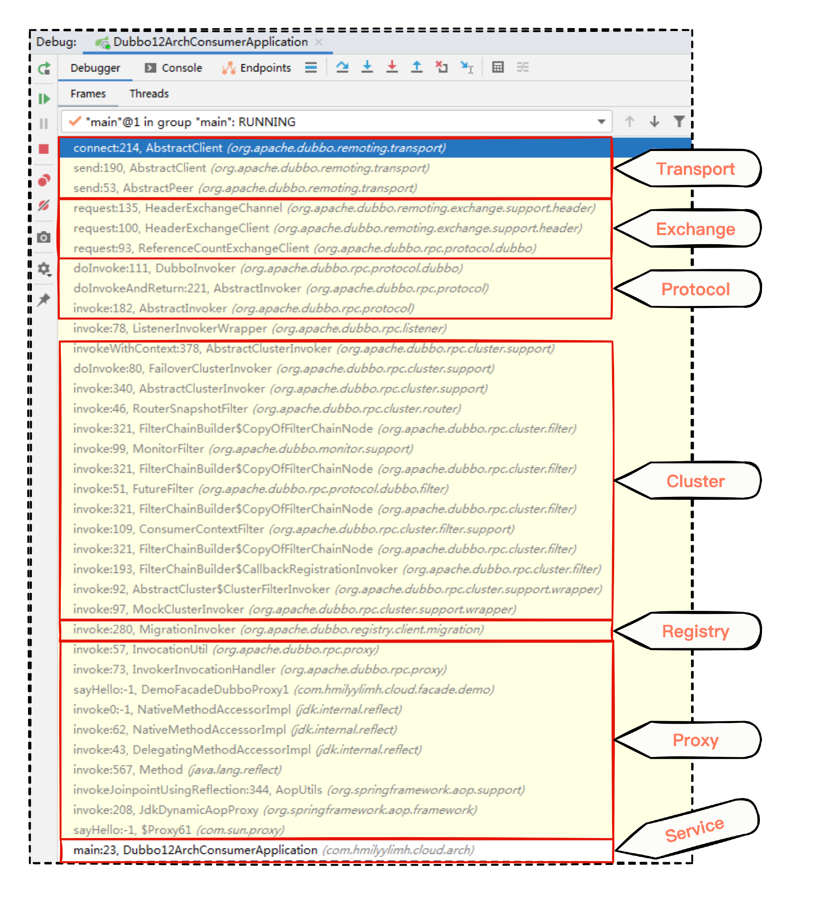

# 13｜集成框架：框架如何与Spring有机结合？
你好，我是何辉。上一讲我们纵览了框架在源码中是怎么体现的，今天来学习框架的集成。

如果你开发过以 Spring 框架为基础的应用，就会知道 Dubbo 框架常被当作第三方框架集成到应用中，这也是为什么你会经常看到 Spring 集成 Dubbo 框架、Spring Boot 集成 Dubbo 框架。

然而当 Spring 集成 Dubbo 框架后，为什么你在编写代码时，只用了 @DubboReference 注解就可以调用提供方的服务了呢？就像使用 Spring 的 @Autowired、@Resource 注解一样方便，究竟 Dubbo 框架是怎么与 Spring 无缝结合的呢？带着这个问题，我们开始今天的学习。

一切都要从日常开发过程中编写代码调用远程接口讲起。

## 现状 integration 层代码编写形式

假设我们正在开发一个已经集成了 Dubbo 框架的消费方系统，你需要编写代码远程调用下游提供方系统，获取业务数据。这是很常见的需求了。

当系统设计的层次比较鲜明，我们一般会把调用下游提供方系统的功能都放在 integration 层，也就意味着当前系统调用下游提供方系统的引用关系都封装在 integration 层。那你的代码可能会这么写：

```java
public interface SamplesFacade {
    QueryOrderRes queryOrder(QueryOrderReq req);
}

```

```java
public interface SamplesFacadeClient {
    QueryOrderResponse queryRemoteOrder(QueryOrderRequest req);
}

public class SamplesFacadeClientImpl implements SamplesFacadeClient {
    @DubboReference
    private SamplesFacade samplesFacade;
    @Override
    public QueryOrderResponse queryRemoteOrder(QueryOrderRequest req){
        // 构建下游系统需要的请求入参对象
        QueryOrderReq integrationReq = buildIntegrationReq(req);

        // 调用 Dubbo 接口访问下游提供方系统
        QueryOrderRes resp = samplesFacade.queryOrder(integrationReq);

        // 判断返回的错误码是否成功
        if(!"000000".equals(resp.getRespCode())){
            throw new RuntimeException("下游系统 XXX 错误信息");
        }

        // 将下游的对象转换为当前系统的对象
        return convert2Response(resp);
    }
}

```

大思路很清晰：

- SamplesFacade 是下游提供方系统定义的一个接口，该接口中有一个 queryOrder 的方法。
- SamplesFacadeClient 是在 integration 层中定义的一个接口，并且也定义了一个 queryRemoteOrder 方法，专门负责与 SamplesFacade 的 queryOrder 打交道。
- SamplesFacadeClientImpl 也是定义在 integration 层中，并且实现了 SamplesFacadeClient 接口，重写了 queryRemoteOrder 方法。

重点看封装了调用下游接口逻辑的 queryRemoteOrder 方法，我们先构建调用下游系统的对象，然后把对象传入下游系统的接口中，再接收返参并针对错误码判断一下，最后转成自己的 Bean 对象。

封装起来是好事，目的也是想利用 integration 层来屏蔽下游提供方各种接口的差异性。

然而，当我们在 integration 层中需要对接很多下游提供方系统的接口时，就意味着需要写很多和 queryRemoteOrder 调用流程相似的代码，基本结构都是 **请求对象组装、远程调用、返参数据的判断与转换**。

一想到要写一堆相似的代码，你也许就有点烦躁了，这些都是重复性的机械劳动啊，为什么 integration 层的代码不能简单点呢？

## 如何改善 integration 层代码

想简化 integration 层的代码编写，首先我们要解决的问题是：integration 层中有很多和 SamplesFacadeClientImpl 相似的类，而且每个方法的实现逻辑都和 queryRemoteOrder 差不多，该怎么简化呢？

“简化”这个词我们日常开发不太常用，但简化代码，最终都是需要通过创建类、方法、变量来编写各种业务逻辑，这么说你是不是很熟悉了。

那我们再细想一下，创建类、方法、变量，又在面向谁进行编码呢？眼前一亮的你迅速说出“面向对象”。那面向对象的特征又是什么？你在脑海里迅速回顾了一遍 Java 入门级别的八股文，说出了“抽象、封装、继承、多态”。

没错，那对于今天的问题，很多代码都是相似流程，我们又该用面向对象的哪个特征进行思考呢？

你试着一个个套用，发现可以将相似流程的骨架抽象出来，也可以将相似流程中变化的因素提取为变量，并最终调用一个统一的封装方法。发现没，你一下就用到了 **“抽象”“封装”** 两个特征。

接下来就是怎么把这两个特征的思路落地了。我们不妨先来看看如何封装。

### 1\. 封装

封装，可以把相似流程中变化的因素提取为变量，那么在统一的封装方法中，有哪些变量因素呢？我们顺着调用链继续思考：


- 因素1：怎么知道调用下游提供方的哪个接口呢？这说明下游的接口类名、方法名、方法入参类名是变量因素。
- 因素2：怎么区分各个调用方的 timeout、retries、cache、loadbalance 等参数属性呢？这说明消费方接口级别的Dubbo参数属性也是变量因素。
- 因素3：调用下游提供方接口后拿到返回，有些接口需要判断错误码，有些接口不需要判断，而且不同接口的错误码字段、错误码字段的值也可能不一样。这说明返参错误码的判断形式也是一个变量因素。
- 因素4：拿到下游接口的返回数据后，怎么转成各个调用方想要的对象呢？这说明将数据转成各个调用方期望的对象类型，也是一个变量因素。

如果把这四种因素都变成相应对象，就相当于 **在统一的封装方法中接收四大对象，而在 SamplesFacadeClientImpl 这样的实现类中，最终就只需要调用统一的封装方法**，只是在构建方法参数需要的四大对象有区别罢了：


分析一下现在的方案，看起来是把逻辑封装好了，可是仍然会建立好多像 SamplesFacadeClientImpl 的实现类，而且在实现类中还得组装各种参数凑齐4个大对象，有点繁琐，不尽如人意。但勉强用也还凑合，暂时也没能想到更好的封装方式。

我们不妨接着探索抽象思路看看。

### 2\. 抽象

抽象，是把相似流程的骨架抽象出来，可是到底该怎么抽象呢？

我理解的抽象就是去掉表象保留相对不变的，好比树叶去掉表皮和叶肉，最后留下了相对稳定的叶脉结构，或者大象去掉皮和肉，最后留下了相对稳定的骨骼结构。

就代码来说，什么是相对稳定不变的呢？其实就是流程。

一段代码的流程，可以是业务流程，也可以是代码流程，还可以是调用流程，当然本质都是一小块相对聚焦的业务逻辑的核心主干流程，把不变的流程固化下来变成模板，然后把变化的因素交给各个调用方，意在求同存异，追求“不变”的稳定，放任“变化”的自由。

那我们目前的代码，相对不变的流程又是什么呢？

机智的你一下想到不变的流程就是要重复写的那段逻辑：先构建调用下游系统的请求对象，并将请求对象传入下游系统的接口中，然后接收返参并针对错误码进行判断，最后转成自己的 Bean 对象。

逻辑是抽象出来了，但接下来怎么办呢？

其实这里的关键在于换位思考，代码调用流程我们知道了，也已经封装了四大变量，所以 **目前最关心的是怎么利用四个变化的因素，促使开发者在编写这段代码调用流程时更加简单**，换言之就是在固化流程为模板时，怎么把变化的因素给到各个调用方的实现类来做。

到这里，问题就转向了怎么将变化的因素分发给各个具体功能业务的实现类，我们继续琢磨。

如果继续把变化的因素放在实现类中，岂不是又在走之前的老路？不可行。但要是把实现类干掉的话，就剩下一个孤零零的接口了，又能干啥呢？

突然你眼前一亮，是不是可以在接口上做点文章呢？翻看了Dubbo源码中的一些已有接口相关类的设计思路，一堆堆的注解让你若有所悟，是不是可以在 SamplesFacadeClient 接口上自定义一些注解，由注解来消化变化的因素呢？

我们沿着注解的方向继续思考前面的4大变化因素：


- 因素1是下游的接口类名、方法名、方法入参类名，涉及的类可以放在 **类注解** 上，方法名、方法入参可以放在 **方法注解** 上。
- 因素2中消费方接口级别的 timeout、retries、loadbalance 等属性，也可以放在 **方法注解** 上。
- 因素3中的错误码，理论上下游提供方一个类中多个方法返回的格式应该是一样的，所以如何判断错误码的变量因素可以放在 **类注解** 上。
- 因素4中如何将下游数据类型转换为本系统的 Bean 类型，其实最终还是接口级别的事，貌似还是可以放到 **方法注解** 上。

把变化的因素往注解方向套用时，我们突然发现问题都迎刃而解了。兴奋的你一定迫不及待想去把 SamplesFacadeClient 接口设计一番了：

```java
@DubboFeignClient(
        remoteClass = SamplesFacade.class,
        needResultJudge = true,
        resultJudge = (remoteCodeNode = "respCode", remoteCodeSuccValueList = "000000", remoteMsgNode = "respMsg")
)
public interface SamplesFacadeClient {
    @DubboMethod(
            timeout = "5000",
            retries = "3",
            loadbalance = "random",
            remoteMethodName = "queryRemoteOrder",
            remoteMethodParamsTypeName = {"com.hmily.QueryOrderReq"}
     )
    QueryOrderResponse queryRemoteOrderInfo(QueryOrderRequest req);
}

```

我们针对 SamplesFacadeClient 定义了两个注解，@DubboFeignClient 是类注解，@DubboMethod 是方法注解。

- 类注解中的参数体现了调用系统方接口归属的类，以及怎么处理这个类中所有方法的返参错误码情况。
- 方法注解中的参数体现了下游提供方的方法名和方法入参、返参对象类型转换、接口级别的 timeout、retries、loadbalance 等属性情况。

把 SamplesFacadeClient 设计好后，开发者用起来也特别舒服，之前调用下游提供方接口时要写的一堆代码，现在只需要自己定义一个接口并添加两种注解就完事了。

可是要想在代码中使用这个接口，该怎么实现呢？我们还得继续想办法。

### 3\. 仿照 Spring 类扫描

我们按照接口最舒服的使用方式，来反推该如何实现。

按照这个接口的设计方式，我们能想到将来 integration 层肯定会有一堆像 SamplesFacadeClient 这样的接口，每个接口上还有 @DubboFeignClient 和 @DubboMethod 两个注解。举个具体例子更容易思考，在使用接口时可能会这么写：

```java
@Autowired
private SamplesFacadeClient samplesClient;

```

代码在使用 SamplesFacadeClient 接口时，会在字段 samplesClient 上加一个 @Autowired 注解，然后就可以直接使用 samplesClient.queryRemoteOrderInfo 这样的方式调用方法了。

那么第一个问题来了，samplesClient 要想在运行时调用方法，首先 samplesClient 必须得是一个实例化的对象。 **可是我们代码里根本就不存在 SamplesFacadeClient 接口的任何实现类，那该怎么把一个接口变成运行时的实例对象呢？** 在这个具体例子里就是：如何使变量 samplesClient 被 @Autowired 注解修饰后就变成实例对象？@Autowired 是谁，从哪里冒出来的，谁赋予了 @Autowired 这神奇的功能呢？

我们一下子就联想到了 Spring 框架，因为 @Autowired 是在 Spring 框架中定义的，在 Spring 框架中被注解修饰变量可能是原型实例对象，也可能是代理对象。所以怎么把接口变成实例对象现在就有了答案，可以想办法 **把接口变成运行时的代理对象**。

还有一个问题值得思考：Spring 框架是怎么知道 @Component、@Configuration 等注解的存在呢，关键是这些注解遍布在工程代码的各个角落，Spring 又是怎么找到的呢？

这就需要你了解 Spring 源码里的一个类 org.springframework.context.annotation.ClassPathBeanDefinitionScanner，它是 Spring 为了扫描一堆的 BeanDefinition 而设计，目的就是要 **从 @SpringBootApplication 注解中设置过的包路径及其子包路径中的所有类文件中，扫描出含有 @Component、@Configuration 等注解的类，并构建 BeanDefinition 对象**。

那么我们是不是可以利用 Spring 的这套扫描机制，自定义一个扫描器类，然后在自定义扫描器类中自己手动构建 BeanDefinition 对象并且后续创建代理对象呢？

借鉴了源码思想，我们写下了这样的代码：

```java
public class DubboFeignScanner extends ClassPathBeanDefinitionScanner {
    // 定义一个 FactoryBean 类型的对象，方便将来实例化接口使用
    private DubboClientFactoryBean<?> factoryBean = new DubboClientFactoryBean<>();
    // 重写父类 ClassPathBeanDefinitionScanner 的构造方法
    public DubboFeignScanner(BeanDefinitionRegistry registry) {
        super(registry);
    }
    // 扫描各个接口时可以做一些拦截处理
    // 但是这里不需要做任何扫描拦截，因此内置消化掉返回true不需要拦截
    public void registerFilters() {
        addIncludeFilter((metadataReader, metadataReaderFactory) -> true);
    }
    // 重写父类的 doScan 方法，并将 protected 修饰范围放大为 public 属性修饰
    @Override
    public Set<BeanDefinitionHolder> doScan(String... basePackages) {
        // 利用父类的doScan方法扫描指定的包路径
        // 在此，DubboFeignScanner自定义扫描器就是利用Spring自身的扫描特性，
        // 来达到扫描指定包下的所有类文件，省去了自己写代码去扫描这个庞大的体力活了
        Set<BeanDefinitionHolder> beanDefinitions = super.doScan(basePackages);
        if(beanDefinitions == null || beanDefinitions.isEmpty()){
            return beanDefinitions;
        }
        processBeanDefinitions(beanDefinitions);
        return beanDefinitions;
    }
    // 自己手动构建 BeanDefinition 对象
    private void processBeanDefinitions(Set<BeanDefinitionHolder> beanDefinitions) {
        GenericBeanDefinition definition = null;
        for (BeanDefinitionHolder holder : beanDefinitions) {
            definition = (GenericBeanDefinition)holder.getBeanDefinition();
            definition.getConstructorArgumentValues().addGenericArgumentValue(definition.getBeanClassName());
            // 特意针对 BeanDefinition 设置 DubboClientFactoryBean.class
            // 目的就是在实例化时能够在 DubboClientFactoryBean 中创建代理对象
            definition.setBeanClass(factoryBean.getClass());
            definition.setAutowireMode(AbstractBeanDefinition.AUTOWIRE_BY_TYPE);
        }
    }
}

```

通过定义 DubboFeignScanner 对象并且继承 ClassPathBeanDefinitionScanner 对象，我们就可以重写 doScan 方法接收一个包路径（SamplesFacadeClient 接口所在的包路径），然后利用 super.doScan 让 Spring 帮我们去扫描指定包路径下的所有类文件。

这样就简单多了，不用写代码挨个扫描包下面的类文件操作，还能手动在 processBeanDefinitions 方法中创建 BeanDefinition 对象。

理想中正常逻辑是这样，但实际开发中，我们可能经常发现指定的包路径下有一堆乱七八糟的类文件，导致按 DubboFeignScanner.doScan 方法扫描后，不准确或者出现各种报错，毕竟功能代码是层层迭代下来的，不同开发人员有各自的写法姿势，不可控。

那我们如何保障精准扫描出指定注解的类呢？难道要想办法再次过滤？

这个问题其实 Spring 框架也遇到了，对于指定的 @Component、@Configuration 等注解，Spring 框架是怎么知道需要拾取的呢？我们来看看它的精心设计。

这里给你传授一个小秘诀， **尝试在 ClassPathBeanDefinitionScanner 的所有方法中寻找那些可被 Override 重写的方法**。

你会发现 Spring 源码在添加 BeanDefinition 时，需要借助一个 org.springframework.context.annotation.ClassPathScanningCandidateComponentProvider#isCandidateComponent 方法，来判断是不是候选组件，也就是，是不是需要拾取指定注解。

所以，我们也可以尝试在 DubboFeignScanner 类中重写 isCandidateComponent 方法，并且判断一下，如果扫描出来的类含有 @DubboFeignClient 注解，我们就添加 BeanDefinition 对象，否则不予处理。

于是你对代码做了修改：

```java
public class DubboFeignScanner extends ClassPathBeanDefinitionScanner {
    // 定义一个 FactoryBean 类型的对象，方便将来实例化接口使用
    private DubboClientFactoryBean<?> factoryBean = new DubboClientFactoryBean<>();
    // 重写父类 ClassPathBeanDefinitionScanner 的构造方法
    public DubboFeignScanner(BeanDefinitionRegistry registry) {
        super(registry);
    }
    // 扫描各个接口时可以做一些拦截处理
    // 但是这里不需要做任何扫描拦截，因此内置消化掉返回true不需要拦截
    public void registerFilters() {
        addIncludeFilter((metadataReader, metadataReaderFactory) -> true);
    }
    // 重写父类的 doScan 方法，并将 protected 修饰范围放大为 public 属性修饰
    @Override
    public Set<BeanDefinitionHolder> doScan(String... basePackages) {
        // 利用父类的doScan方法扫描指定的包路径
        // 在此，DubboFeignScanner自定义扫描器就是利用Spring自身的扫描特性，
        // 来达到扫描指定包下的所有类文件，省去了自己写代码去扫描这个庞大的体力活了
        Set<BeanDefinitionHolder> beanDefinitions = super.doScan(basePackages);
        if(beanDefinitions == null || beanDefinitions.isEmpty()){
            return beanDefinitions;
        }
        processBeanDefinitions(beanDefinitions);
        return beanDefinitions;
    }
    // 自己手动构建 BeanDefinition 对象
    private void processBeanDefinitions(Set<BeanDefinitionHolder> beanDefinitions) {
        GenericBeanDefinition definition = null;
        for (BeanDefinitionHolder holder : beanDefinitions) {
            definition = (GenericBeanDefinition)holder.getBeanDefinition();
            definition.getConstructorArgumentValues().addGenericArgumentValue(definition.getBeanClassName());
            // 特意针对 BeanDefinition 设置 DubboClientFactoryBean.class
            // 目的就是在实例化时能够在 DubboClientFactoryBean 中创建代理对象
            definition.setBeanClass(factoryBean.getClass());
            definition.setAutowireMode(AbstractBeanDefinition.AUTOWIRE_BY_TYPE);
        }
    }
    // 重写父类中“是否是候选组件”的方法，即我们认为哪些扫描到的类可以是候选类
    @Override
    protected boolean isCandidateComponent(AnnotatedBeanDefinition beanDefinition) {
        AnnotationMetadata metadata = beanDefinition.getMetadata();
        if (!(metadata.isInterface() && metadata.isIndependent())) {
            return false;
        }
        // 针对扫描到的类，然后看看扫描到的类中是否有 DubboFeignClient 注解信息
        Map<String, Object> attributes = metadata
        .getAnnotationAttributes(DubboFeignClient.class.getName());
        // 若扫描到的类上没有 DubboFeignClient 注解信息则认为不是认可的类
        if (attributes == null) {
            return false;
        }
        // 若扫描到的类上有 DubboFeignClient 注解信息则起码是认可的类
        AnnotationAttributes annoAttrs = AnnotationAttributes.fromMap(attributes);
        if (annoAttrs == null) {
            return false;
        }
        // 既然是认可的类，那再看看类注解中是否有 remoteClass 字段信息
        // 若 remoteClass 字段信息有值的话，则认为是我们最终认定合法的候选类
        Object remoteClass = annoAttrs.get("remoteClass");
        if (remoteClass == null) {
            return false;
        }
        return true;
    }
}

```

代码中在 isCandidateComponent 方法中进行了识别 DubboFeignClient 类注解的业务逻辑处理，如果有类注解且有 remoteClass 属性的话，就认为是我们寻找的类。

这样，所有含有 @DubboFeignClient 注解的类的 BeanDefinition 对象都被扫描收集起来了，接下来就交给 Spring 本身 refresh 方法中的 org.springframework.beans.factory.support.DefaultListableBeanFactory#preInstantiateSingletons 方法进行实例化了，而实例化的时候，如果发现 BeanDefinition 对象是 org.springframework.beans.factory.FactoryBean 类型，会调用 FactoryBean 的 getObject 方法创建代理对象。

针对接口进行代理对象的创建，你也一定能很快想到 JDK 中的 java.lang.reflect.Proxy 类，可以这么创建代理对象：

```java
public class DubboClientFactoryBean<T> implements FactoryBean<T>, ApplicationContextAware {
    private Class<T> dubboClientInterface;
    private ApplicationContext appCtx;
    public DubboClientFactoryBean() {
    }
    // 该方法是在 DubboFeignScanner 自定义扫描器的 processBeanDefinitions 方法中，
    // 通过 definition.getConstructorArgumentValues().addGenericArgumentValue(definition.getBeanClassName()) 代码设置进来的
    // 这里的 dubboClientInterface 就等价于 SamplesFacadeClient 接口
    public DubboClientFactoryBean(Class<T> dubboClientInterface) {
        this.dubboClientInterface = dubboClientInterface;
    }

    // Spring框架实例化FactoryBean类型的对象时的必经之路
    @Override
    public T getObject() throws Exception {
        // 为 dubboClientInterface 创建一个 JDK 代理对象
        // 同时代理对象中的所有业务逻辑交给了 DubboClientProxy 核心代理类处理
        return (T) Proxy.newProxyInstance(dubboClientInterface.getClassLoader(),
                new Class[]{dubboClientInterface}, new DubboClientProxy<>(appCtx));
    }
    // 标识该实例化对象的接口类型
    @Override
    public Class<?> getObjectType() {
        return dubboClientInterface;
    }
    // 标识 SamplesFacadeClient 最后创建出来的代理对象是单例对象
    @Override
    public boolean isSingleton() {
        return true;
    }
    @Override
    public void setApplicationContext(ApplicationContext applicationContext) throws BeansException {
        this.appCtx = applicationContext;
    }
}

```

代码中 getObject 是我们创建代理对象的核心过程，细心的你可能会发现我们还创建了一个 DubboClientProxy 对象，这个对象放在 `java.lang.reflect.Proxy#newProxyInstance(java.lang.ClassLoader, java.lang.Class<?>[], **java.lang.reflect.InvocationHandler**)` 方法中的第三个参数。

这意味着，将来含有 @DubboFeignClient 注解的类的方法被调用时，一定会触发调用 DubboClientProxy 类，也就说我们可以在 DubboClientProxy 类拦截方法，这正是我们梦寐以求的核心拦截方法的地方。

好，到现在，激动人心的时刻终于到了，我们在 DubboClientProxy 中可以将那套不变的代码流程写在这儿了，之前考虑的四大因素直接从 @DubboFeignClient、@DubboMethod 两个注解读取信息。

来看DubboClientProxy 的实现：

```java
public class DubboClientProxy<T> implements InvocationHandler, Serializable {
    @Override
    public Object invoke(Object proxy, Method method, Object[] args) throws Throwable {
        // 省略前面的一些代码

        // 读取接口（例：SamplesFacadeClient）上对应的注解信息
        DubboFeignClient dubboClientAnno = declaringClass.getAnnotation(DubboFeignClient.class);
        // 读取方法（例：queryRemoteOrderInfo）上对应的注解信息
        DubboMethod methodAnno = method.getDeclaredAnnotation(DubboMethod.class);
        // 获取需要调用下游系统的类、方法、方法参数类型
        Class<?> remoteClass = dubboClientAnno.remoteClass();
        String mtdName = getMethodName(method.getName(), methodAnno);
        Method remoteMethod = MethodCache.cachedMethod(remoteClass, mtdName, methodAnno);
        Class<?> returnType = method.getReturnType();

        // 发起真正远程调用
        Object resultObject = doInvoke(remoteClass, remoteMethod, args, methodAnno);

        // 判断返回码，并解析返回结果
        return doParse(dubboClientAnno, returnType, resultObject);
    }
}

```

看DubboClientProxy.invoke 方法，按照不变的代码调用流程，从类注解、方法注解分别将变化的因素读取出来，然后构建调用下游系统的请求对象，并将请求对象传入下游系统的接口中，然后接收返参并针对错误码进行判断，最后转成自己的 Bean 对象。

这下是真正做到了用一套代码解决了所有 integration 层接口的远程调用，简化了重复代码开发的劳动力成本，而且也使代码的编写更加简洁美观。

## Dubbo扫描原理机制

有了前面的学习基础，我们再来看看 org.springframework.context.annotation.ClassPathBeanDefinitionScanner 的所有子类，有没有一种眼前一亮的感觉：

```java
// Dubbo 框架定义的扫描器，并且也继承了 ClassPathBeanDefinitionScanner 类
public class DubboClassPathBeanDefinitionScanner extends ClassPathBeanDefinitionScanner {

    // 扫描器的构造方法
    public DubboClassPathBeanDefinitionScanner(BeanDefinitionRegistry registry, boolean useDefaultFilters, Environment environment,
                                               ResourceLoader resourceLoader) {
        super(registry, useDefaultFilters);
        setEnvironment(environment);
        setResourceLoader(resourceLoader);
        registerAnnotationConfigProcessors(registry);
    }
    // 扫描器的构造方法
    public DubboClassPathBeanDefinitionScanner(BeanDefinitionRegistry registry, Environment environment,
                                               ResourceLoader resourceLoader) {
        this(registry, false, environment, resourceLoader);
    }
    // 直接使用父类的doScan，即利用Spring自身的扫描特性去扫描指定包下的所有类
    @Override
    public Set<BeanDefinitionHolder> doScan(String... basePackages) {
        return super.doScan(basePackages);
    }
    @Override
    public boolean checkCandidate(String beanName, BeanDefinition beanDefinition) throws IllegalStateException {
        return super.checkCandidate(beanName, beanDefinition);
    }

    // 当然，这里还有一个被public修饰的父类addIncludeFilter方法，
    // 调用方会将需要关注的注解一律都通过addIncludeFilter添加进来，
    // 源码调用的示例代码如下：

    // private final static List<Class<? extends Annotation>> serviceAnnotationTypes = asList(
    //         // @since 2.7.7 Add the @DubboService , the issue : https://github.com/apache/dubbo/issues/6007
    //         DubboService.class,
    //         // @since 2.7.0 the substitute @com.alibaba.dubbo.config.annotation.Service
    //         Service.class,
    //         // @since 2.7.3 Add the compatibility for legacy Dubbo's @Service , the issue : https://github.com/apache/dubbo/issues/4330
    //         com.alibaba.dubbo.config.annotation.Service.class
    //     );

    // for (Class<? extends Annotation> annotationType : serviceAnnotationTypes) {
    //   scanner.addIncludeFilter(new AnnotationTypeFilter(annotationType));
    // }
}

```

你会发现 Dubbo 自身也有一个 DubboClassPathBeanDefinitionScanner 类继承了 ClassPathBeanDefinitionScanner，Dubbo 也在充分利用 Spring 自身已有的扩展特性来扫描自己需要关注的三个注解类，org.apache.dubbo.config.annotation.DubboService、org.apache.dubbo.config.annotation.Service、com.alibaba.dubbo.config.annotation.Service，然后完成 BeanDefinition 对象的创建，再完成 Proxy 代理对象的创建，最后在运行时就可以直接被拿来使用了。

Dubbo的扫描原理机制，相信你现在已经非常清楚了，那哪些应用场景可以考虑扫描机制呢？我们还是结合源码思考。

第一，非自研框架，在系统中单独定义像 SamplesFacadeClient 这种接口与自定义注解相结合的情况，利用自定义注解定义各种业务逻辑的规则，然后对 SamplesFacadeClient 直接进行 @Autowired 或 @Resource 使用，可以考虑利用扫描机制，统一将这一类接口创建代理对象，并在核心代理类中归一化处理核心逻辑。

第二，自研框架，比如 Dubbo 对 Spring 来说就是第三方自研框架，若自研框架定义的接口想要被注解修饰后直接使用的话，也可以考虑利用扫描机制统一集成Dubbo框架，并处理生成代理类。

总之，不管是在系统中定义接口也好，还是在自研框架中定义接口也好， **如果这些接口是同类性质的，而且Spring还无法通过注解修饰接口直接使用的话，都可以采取扫描机制统一处理共性逻辑**，将不变的流程逻辑下沉，将变化的因素释放给各个接口。

## 总结

今天，我们从一段integration层现状的代码开始，分析要写很多相似代码的时候，如何进行封装、抽象处理，以达到简化代码编写、节省重复劳动力的目的。改善的核心要点，需要我们紧抓面向对象的 **抽象、封装、继承、多态** 这些特征，来充分挖掘现状代码的“坏味道”。

对于integration层代码，改善的实现思路也很清晰：

- 首先通过封装思路将旧代码归一化处理，提炼统一的封装方法；
- 紧接着通过抽象思路，逐渐提炼不变的流程步骤，将不变的流程固化或模板化，将变化的交给各个实现类去实现；
- 然后通过仿照Spring的ClassPathBeanDefinitionScanner.doScan的类扫描机制，解决接口变成代理实例对象，以便在代码中能够正常使用；
- 最后在核心代理类DubboClientProxy中，将封装思路与抽象思路全部整合到一块，实现注解化远程调用。

扫描机制的应用场景有自研框架与非自研框架两种，但这两类场景都是在解决某种比较聚焦的问题，而且产生的接口还无法被Spring直接进行依赖注入，就可以采取类扫描机制将不变的流程通过核心代理类统一处理，将变化的因素释放给各个接口。

### 思考题

你已经学会了Spring与系统代码或自研框架的集成，核心就是利用扫描机制统一生成代理来归一化处理核心业务逻辑，那你能否尝试研究下Spring与Mybatis是怎么有机结合起来使用的呢？

期待看到你的思考，如果觉得今天的内容对你有帮助，也欢迎分享给身边的朋友一起讨论。我们下一讲见。

### 12思考题参考

上一期留了个作业，通过一次简单的调用，看看会涉及到哪些模块？

要解答这个问题，其实也比较简单，我们还是像往常一样制造出一种异常，然后从异常中分析问题。接下来你需要做这三步：

- 启动注册中心；
- 启动提供方；
- 启动消费方，待消费方启动后看到启动成功的日志后，再关闭提供方。

```java
// 消费方的简单示意代码
@ImportResource("classpath:dubbo-12-arch-consumer.xml")
@SpringBootApplication
public class Dubbo12ArchConsumerApplication {
    public static void main(String[] args) {
        // 启动消费方的一行标准通用代码
        ConfigurableApplicationContext ctx =
                SpringApplication.run(Dubbo12ArchConsumerApplication.class, args);
        // 打印消费方启动成功的日志
        System.out.println("【【【【【【 Dubbo12ArchConsumerApplication 】】】】】】已启动.");

        // 消费方启动成功后，就可以去将提供方关闭掉了，10 秒钟的缓冲期就是去关闭提供方的时间
        TimeUtils.sleep(10 * 1000);

        // 发起远程调用
        DemoFacade demoFacade = ctx.getBean(DemoFacade.class);
        System.out.println(demoFacade.sayHello("Geek"));
    }
}

```

经过这三步操作，你会在消费方看到如下的报错信息：

```java
Caused by: org.apache.dubbo.remoting.RemotingException: client(url: dubbo://192.168.100.183:28040/com.hmilyylimh.cloud.facade.demo.DemoFacade?anyhost=true&application=dubbo-12-arch-consumer&background=false&category=providers,configurators,routers&check=false&codec=dubbo&deprecated=false&dubbo=2.0.2&dynamic=true&generic=false&heartbeat=60000&interface=com.hmilyylimh.cloud.facade.demo.DemoFacade&methods=sayHello,say&pid=14664&qos.enable=false&release=3.0.7&retries=-1&service-name-mapping=true&side=consumer&sticky=false) failed to connect to server /192.168.100.183:28040, error message is:Connection refused: no further information: /192.168.100.183:28040
	at org.apache.dubbo.remoting.transport.netty4.NettyClient.doConnect(NettyClient.java:192)
	at org.apache.dubbo.remoting.transport.AbstractClient.connect(AbstractClient.java:214)
	at org.apache.dubbo.remoting.transport.AbstractClient.send(AbstractClient.java:190)
	at org.apache.dubbo.remoting.transport.AbstractPeer.send(AbstractPeer.java:53)
	at org.apache.dubbo.remoting.exchange.support.header.HeaderExchangeChannel.request(HeaderExchangeChannel.java:135)
	at org.apache.dubbo.remoting.exchange.support.header.HeaderExchangeClient.request(HeaderExchangeClient.java:100)
	at org.apache.dubbo.rpc.protocol.dubbo.ReferenceCountExchangeClient.request(ReferenceCountExchangeClient.java:93)
	at org.apache.dubbo.rpc.protocol.dubbo.DubboInvoker.doInvoke(DubboInvoker.java:111)
	at org.apache.dubbo.rpc.protocol.AbstractInvoker.doInvokeAndReturn(AbstractInvoker.java:221)
	at org.apache.dubbo.rpc.protocol.AbstractInvoker.invoke(AbstractInvoker.java:182)
	at org.apache.dubbo.rpc.listener.ListenerInvokerWrapper.invoke(ListenerInvokerWrapper.java:78)
	at org.apache.dubbo.rpc.cluster.support.AbstractClusterInvoker.invokeWithContext(AbstractClusterInvoker.java:378)
	at org.apache.dubbo.rpc.cluster.support.FailoverClusterInvoker.doInvoke(FailoverClusterInvoker.java:80)
	... 24 more
Caused by: io.netty.channel.AbstractChannel$AnnotatedConnectException: Connection refused: no further information: /192.168.100.183:28040
Caused by: java.net.ConnectException: Connection refused: no further information
	at java.base/sun.nio.ch.Net.pollConnect(Native Method)
	at java.base/sun.nio.ch.Net.pollConnectNow(Net.java:579)
	at java.base/sun.nio.ch.SocketChannelImpl.finishConnect(SocketChannelImpl.java:820)
	at io.netty.channel.socket.nio.NioSocketChannel.doFinishConnect(NioSocketChannel.java:337)
	at io.netty.channel.nio.AbstractNioChannel$AbstractNioUnsafe.finishConnect(AbstractNioChannel.java:334)
	at io.netty.channel.nio.NioEventLoop.processSelectedKey(NioEventLoop.java:776)
	at io.netty.channel.nio.NioEventLoop.processSelectedKeysOptimized(NioEventLoop.java:724)
	at io.netty.channel.nio.NioEventLoop.processSelectedKeys(NioEventLoop.java:650)
	at io.netty.channel.nio.NioEventLoop.run(NioEventLoop.java:562)
	at io.netty.util.concurrent.SingleThreadEventExecutor$4.run(SingleThreadEventExecutor.java:997)
	at io.netty.util.internal.ThreadExecutorMap$2.run(ThreadExecutorMap.java:74)
	at io.netty.util.concurrent.FastThreadLocalRunnable.run(FastThreadLocalRunnable.java:30)
	at java.base/java.lang.Thread.run(Thread.java:830)

```

通过从异常日志中，你会发现，日志中第 17 行报的是 ConnectException 连接异常，后面紧跟着连接被拒绝（Connection refused: no further information: /192.168.100.183:28040）的提示信息。

再往上看，你会发现异常日志中是用 Netty 去连接提供方，但不巧的是，连不上提供方。

于是我们抓着日志第 2 行，去 NettyClient 代码的第 192 行直接打个断点，断点需要注意一定得消费方启动成功后，立马关闭提供方，然后立马在消费方这边打上断点，然后静静等待断点的到来：



针对断点的调用堆栈进行分析后，你会发现一次调用涉及的模块挺多的。我这里展示的只是针对看到的异常信息进行断点后看到的一些模块，当然还有一些其他模块没有在堆栈中体现出来。

如果你有兴趣，可以继续跟进 NettyClient 的 doConnect 方法，看看最后是怎么将 Request 对象进行序列化发送出去的。