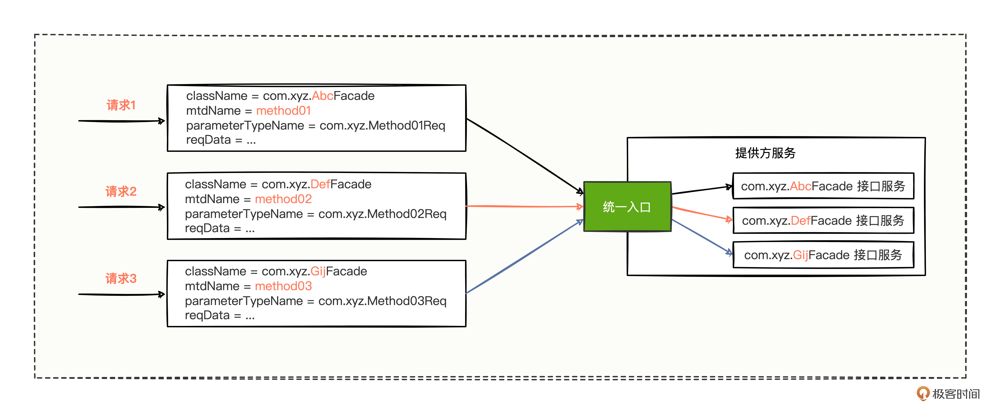
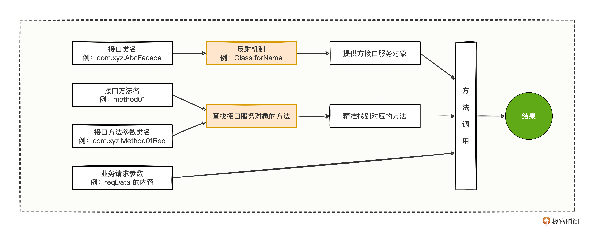
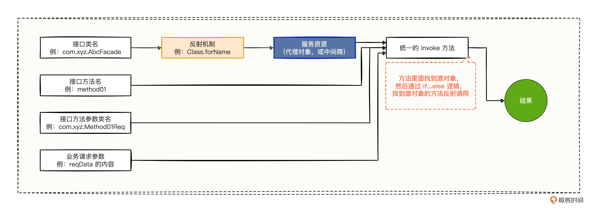
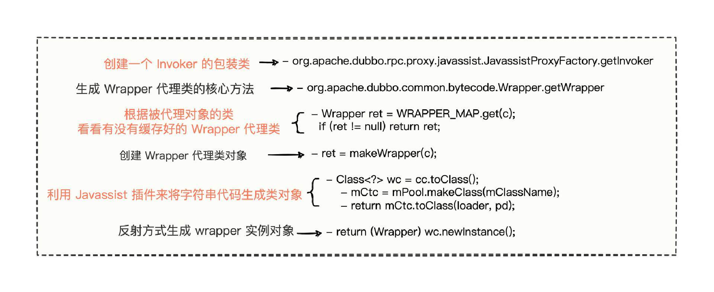

# 15｜Wrapper机制：Wrapper是怎么降低调用开销的？
你好，我是何辉。今天是我们深入研究Dubbo源码的第四篇，Wrapper 机制。

Wrapper，很多人从单词层面来解读，很容易理解成是Java包装类，或者是装饰器设计模式，其实都不是，它是Dubbo中的一种动态生成的代理类。

一听到代理，你可能已经想到了 JDK 和 Cglib 两个常见的代理，JDK 代理是动态生成了一个继承 Proxy 的代理类，而 Cglib 代理是动态生成了一个继承被代理类的派生代理类，既然都有现成的动态生成代理类的解决方案了，为什么 Dubbo 还需要动态生成自己的代理类呢？

带着这个问题，我们开始今天的学习。

## 不足与缺失

首先得弄明白一件事情，现有的 JDK 和 Cglib 代理为什么不能满足 Dubbo 的诉求？

### 1\. JDK 代理

在“ [泛化调用](https://time.geekbang.org/column/article/613308)”讲中我们讲过，泛化调用三部曲中第一个关键环节，通过接口类名、接口方法名、接口方法参数类名、业务请求参数，这四个维度的字段发起远程调用。

结合具体的应用场景来思考，有三个请求，每个请求中的四个字段值都不一样，现在要发往提供方服务：



而提供方服务，需要在统一的入口中接收请求，然后派发到不同的接口服务中去。简单点说，提供方服务要做的就是，构建通用的接收请求入口，然后进行分发调用不同接口服务而已。 **如果要针对这个统一的入口进行编码实现，你会怎么写呢？**

写过不少业务代码的你，一定有了思路：



可以通过反射机制获取接口类名对应的类对象，通过类对象的简称获取到对应的接口服务，通过接口方法名和接口方法参数，来精准定位需要提供方接口服务中的哪个方法进行处理。

对应代码就很简单了。

```java
///////////////////////////////////////////////////
// 提供方服务：统一入口接收请求的控制器，原始的 if...else 方式
///////////////////////////////////////////////////
@RestController
public class CommonController {
    // 定义统一的URL地址
    @PostMapping("gateway/{className}/{mtdName}/{parameterTypeName}/request")
    public String recvCommonRequest(@PathVariable String className,
                                    @PathVariable String mtdName,
                                    @PathVariable String parameterTypeName,
                                    @RequestBody String reqBody) throws Exception {
        // 统一的接收请求的入口
        return commonInvoke(className, parameterTypeName, mtdName, reqBody);
    }

    /**
     * <h2>统一入口的核心逻辑。</h2>
     *
     * @param className：接口归属方法的全类名。
     * @param mtdName：接口的方法名。
     * @param parameterTypeName：接口的方法入参的全类名。
     * @param reqParamsStr：请求数据。
     * @return 接口方法调用的返回信息。
     * @throws Exception
     */
    public static String commonInvoke(String className,
                                      String mtdName,
                                      String parameterTypeName,
                                      String reqParamsStr) throws Exception {
        // 通过反射机制可以获取接口类名对应的类对象
        Class<?> clz = Class.forName(className);

        // 接着通过类对象的简称获取到对应的接口服务
        Object cacheObj = SpringCtxUtils.getBean(clz);

        // 然后通过接口方法名和接口方法参数
        if (cacheObj.getClass().getName().equals(className)) {
            // 来精准定位需要提供方接口服务中的哪个方法进行处理
            if ("sayHello".equals(mtdName) && String.class.getName().equals(parameterTypeName)) {
                // 真正的发起对源对象（被代理对象）的方法调用
                return ((DemoFacade) cacheObj).sayHello(reqParamsStr);
            } else if("say".equals(mtdName) && Void.class.getName().equals(parameterTypeName)){
                // 真正的发起对源对象（被代理对象）的方法调用
                return ((DemoFacade) cacheObj).say();
            }

            // 如果找不到的话，就抛出异常，提示方法不存在
            throw new RuntimeException(String.join(".", className, mtdName) + " 的方法不存在");
        }

        // 如果找不到的话，就抛出异常，提示类不存在
        throw new RuntimeException(className + " 类不存在");
    }
}

```

代码中的实现思路和图是一样的，只是在写的过程中，我们发现了一个比较不爽的地方，就是这段 if…else 的逻辑代码。

```java
// 来精准定位需要提供方接口服务中的哪个方法进行处理
if ("sayHello".equals(mtdName) && String.class.getName().equals(parameterTypeName)) {
    // 真正的发起对源对象（被代理对象）的方法调用
    return ((DemoFacade) cacheObj).sayHello(reqParamsStr);
} else if("say".equals(mtdName) && Void.class.getName().equals(parameterTypeName)){
    // 真正的发起对源对象（被代理对象）的方法调用
    return ((DemoFacade) cacheObj).say();
}

```

不停地利用 if…else 逻辑找到不同方法名对应方法逻辑，让提供方服务的统一入口外表看起来光鲜靓丽，内部实现其实丑陋不堪，一旦将来接口新增了方法，这里的 if…else 逻辑又得继续扩充，没完没了，永无止境。

你肯定也想到了，能不能把这段 if…else 逻辑去掉呢，最好变成更通用的逻辑，不感知方法名和方法参数就能直接进行方法调用。于是，我们现在的问题是， **一方面不想感知各种方法名，另一方面，方法调用必定是有方法名的，这该如何是好呢？**

这里分享架构中最经典的一句话：“没有什么是加一层解决不了的，如果加一层不行，就再加一层”。既然调用必定要有方法，那干脆在各种 if…else 的方法前面再加一层，先调用代理方法名，然后让代理方法名的实现逻辑，拥有根据入参调用各种接口服务方法的能力。就是这样：



乍一看，这新加的一层不就像找了个中间商，中间商拥有各种服务资源，每种资源内部能自动根据入参，再次通过反射调用具体的接口服务方法。

兴奋的你立马写出来这样的代码。

```java
///////////////////////////////////////////////////
// 提供方服务：统一入口接收请求的控制器，反射改善后的方式
///////////////////////////////////////////////////
@RestController
public class CommonController {
    // 定义URL地址
    @PostMapping("gateway/{className}/{mtdName}/{parameterTypeName}/request")
    public String recvCommonRequest(@PathVariable String className,
                                    @PathVariable String mtdName,
                                    @PathVariable String parameterTypeName,
                                    @RequestBody String reqBody) throws Exception {
        // 统一的接收请求的入口
        return commonInvoke(className, parameterTypeName, mtdName, reqBody);
    }

    /**
     * <h2>统一入口的核心逻辑。</h2>
     *
     * @param className：接口归属方法的全类名。
     * @param mtdName：接口的方法名。
     * @param parameterTypeName：接口的方法入参的全类名。
     * @param reqParamsStr：请求数据。
     * @return 接口方法调用的返回信息。
     * @throws Exception
     */
    public static String commonInvoke(String className,
                                      String mtdName,
                                      String parameterTypeName,
                                      String reqParamsStr) throws Exception {
        // 通过反射机制可以获取接口类名对应的类对象
        Class<?> clz = Class.forName(className);

        // 接着通过类对象的简称获取到对应的接口服务的【代理对象】
        // 相当于不同的 clz 就会获取不同的代理对象，各个代理对象代理的源对象都不一样的
        ProxyInvoker proxyInvoker = SpringCtxUtils.getBean(clz);

        // 【代理对象】调用自身的统一方法，然后内部会去识别方法名、方法参数调用不同的方法
        return proxyInvoker.invoke(clz, mtdName, parameterTypeName, reqParamsStr);
    }

    ///////////////////////////////////////////////////
    // 提供方服务：模拟的是其中一个代理类结构样子
    ///////////////////////////////////////////////////
    public class ProxyInvoker$1 extends ProxyInvoker {
        // 暴露的统一被调用的方法
        public Object invoke(Class<?> clz,
                             String mtdName,
                             String parameterTypeName,
                             String reqParamsStr){
            // 通过反射找到方法对应的 Method 对象
            Method method = clz.getDeclaredMethod(mtdName, Class.forName(parameterTypeName));
            method.setAccessible(true);
            // 反射调用
            return method.invoke(getSourceTarget(), reqParamsStr);
        }
    }
}

```

代码中的改善点也很简单，主要有 2 点。

- 之前通过接口类名找接口服务对象，变成了 **找服务资源**，即接口服务代理对象。
- 之前通过 if…else 逻辑进行的方法调用，变成了 **通过方法的反射调用**。

现在简单改善后，你是不是发现好像也蛮通用的，这就是 JDK 的动态代理模式，会动态生成一个继承 Proxy 的代理类。

为什么 Dubbo 不用 JDK 的代理模式呢？难道刚刚的改善代码有什么性能隐患么？其实有没有性能隐患，我们循环验证一把就知道了，看代码。

```java
///////////////////////////////////////////////////
// 反射性能耗时测试类
///////////////////////////////////////////////////
public class ReflectBenchmarkTest {
    public static void main(String[] args) {
        // 定义一个 size 变量为：100万
        int size = 1000000;
        // 循环正常创建类调用某个方法，并打印耗时的时间
        long start = System.currentTimeMillis();
        for (int i = 0; i < size; i++) {
            normalInvoke();
        }
        long end = System.currentTimeMillis();
        System.out.println("正常调用耗时为：" + (end - start) + " 毫秒");

        // 循环反射创建类调用某个方法，并打印耗时的时间
        start = System.currentTimeMillis();
        for (int i = 0; i < size; i++) {
            reflectInvoke();
        }
        end = System.currentTimeMillis();
        System.out.println("反射调用耗时为：" + (end - start) + " 毫秒");
    }

    // 正常创建对象，并调用对象的方法
    public static void normalInvoke(){
        // 普通的创建对象
        CustomSpi customSpi = new CustomSpi();
        // 普通的调用对象的方法
        customSpi.getDefaultPort();
    }

    // 反射创建对象，并反射调用对象的方法
    public static void reflectInvoke(){
        try {
            // 反射拿到对象信息
            Class<?> clz = Class.forName("com.hmilyylimh.cloud.wrapper.spi.CustomSpi");
            // 反射创建对象
            Object o = clz.newInstance();
            // 反射想办法从 clz 中拿到 getDefaultPort 方法对象
            Method method = clz.getDeclaredMethod("getDefaultPort");
            // 反射调用方法
            method.invoke(o);
        } catch (Throwable e) {
            e.printStackTrace();
        }
    }
}

```

代码也非常简单，一段是正常创建对象并调用对象的方法，一段是反射创建对象并反射调用对象的方法，然后各自循环调用一百万次看耗时，看运行结果。

```plain
正常调用耗时为：5 毫秒
反射调用耗时为：745 毫秒

```

从打印的日志上可以明显看到，反射确实比较耗时，而 Dubbo 本身是一款追求高性能的调用框架，反射层面的各种耗时开销是不能容忍的，因此这是 JDK 代理的一个不足。

### 2\. Cglib 代理

既然 JDK 动态代理会有反射性能开销的话，那 Cglib 总不会了吧。毕竟 Cglib 的核心原理，就是通过执行拦截器的回调方法（methodProxy.invokeSuper），从代理类的众多方法引用中匹配正确方法，并执行被代理类的方法。

Cglib的这种方式，就像代理类的内部动态生成了一堆的 if…else 语句来调用被代理类的方法，避免了手工写各种 if…else 的硬编码逻辑，省去了不少硬编码的活。

但是这么一来，如何生成动态代理类的逻辑就至关重要了，而且万一我们以后有自主定制的诉求，想修改这段生成代理类的这段逻辑，反而受 Cglib 库的牵制。

因此为了长远考虑，我们还是自己实现一套有 Cglib 思想的方案更好，并且还可以在此思想上，利用最简单的代码，定制适合自己框架的代理类。这其实也是Dubbo的想法。

### 3.自定义代理

好，我们总结下使用 JDK 和 Cglib 代理的一些顾虑。

- JDK 代理，核心实现是进行反射调用，性能损耗不小。
- Cglib 代理，核心实现是生成了各种 if…else 代码来调用被代理类的方法，但是这块生成代理的逻辑不够灵活，难以自主修改。

基于这两点，我们考虑综合一下， **在 Cglib 的思想之上采用自主实现，并且不使用反射机制**。直白点就是，自己打造一个简化版的迷你型 Cglib 代理工具，这样一来，就可以在自己的代理工具中做各种与框架密切相关的逻辑了。

既然要自己生成代理类，就得先按照一个代码模板来编码，我们来设计代码模板：

```java
///////////////////////////////////////////////////
// 代码模板
///////////////////////////////////////////////////
public class $DemoFacadeCustomInvoker extends CustomInvoker {
    @Override
    public Object invokeMethod(Object instance, String mtdName, Class<?>[] types, Object[] args) throws NoSuchMethodException {
        // 这里就是进行简单的 if 代码判断
        if ("sayHello".equals(mtdName)) {
            return ((DemoFacade) instance).sayHello(String.valueOf(args[0]));
        }
        if ("say".equals(mtdName)) {
            return ((DemoFacade) instance).say();
        }
        throw new NoSuchMethodException("Method [" + mtdName + "] not found.");
    }
}

```

有 3 个细节点需要注意。

1. 类名是 $ 符号开头的，表示是定制的代理类名。
2. 定义了一个父类 CustomInvoker，父类只有一个 invokeMethod 方法，并且是空实现。
3. 代理类重写 invokeMethod 方法后，内部通过 if…else 判断走进不同的方法分支，然后把代理类强转为被代理类，使用强转后的对象进行方法调用，省去了反射调用。

有了代码模板，我们对照着代码模板用 Java 语言编写生成出来。

```java
///////////////////////////////////////////////////
// 自定义代理生成工具类
///////////////////////////////////////////////////
public class CustomInvokerProxyUtils {
    private static final AtomicInteger INC = new AtomicInteger();

    // 创建源对象（被代理对象）的代理对象
    public static Object newProxyInstance(Object sourceTarget) throws Exception{
        String packageName = "com.hmilyylimh.cloud.wrapper.custom";
        // filePath = /E:/工程所在的磁盘路径/dubbo-15-dubbo-wrapper/target/classes/com/hmilyylimh/cloud/wrapper/custom
        String filePath = CustomInvokerProxyUtils.class.getResource("/").getPath()
                + CustomInvokerProxyUtils.class.getPackage().toString().substring("package ".length()).replaceAll("\\.", "/");
        Class<?> targetClazz = sourceTarget.getClass().getInterfaces()[0];
        // proxyClassName = $DemoFacadeCustomInvoker_1
        String proxyClassName = "$" + targetClazz.getSimpleName() + "CustomInvoker_" + INC.incrementAndGet();
        // 获取代理的字节码内容
        String proxyByteCode = getProxyByteCode(packageName, proxyClassName, targetClazz);
        // 缓存至磁盘中
        file2Disk(filePath, proxyClassName, proxyByteCode);
        // 等刷盘稳定后
        TimeUtils.sleep(2000);
        // 再编译java加载class至内存中
        Object compiledClazz = compileJava2Class(filePath, packageName, proxyClassName, sourceTarget, targetClazz);
        // 返回实例化的对象
        return compiledClazz;
    }
    // 生成代理的字节码内容，其实就是一段类代码的字符串
    private static String getProxyByteCode(String packageName, String proxyClassName, Class<?> targetClazz) {
        StringBuilder sb = new StringBuilder();
        // pkgContent = package com.hmilyylimh.cloud.wrapper.custom;
        String pkgContent = "package " + packageName + ";";
        // importTargetClazz = import com.hmilyylimh.cloud.facade.demo.DemoFacade;
        String importTargetClazz = "import " + targetClazz.getName() + ";";
        // importNoSuchMethodException = import org.apache.dubbo.common.bytecode.NoSuchMethodException;
        String importNoSuchMethodException = "import " + org.apache.dubbo.common.bytecode.NoSuchMethodException.class.getName() + ";";
        // classHeadContent = public class $DemoFacadeCustomInvoker extends CustomInvoker {
        String classHeadContent = "public class " + proxyClassName + " extends " + CustomInvoker.class.getSimpleName() + " {" ;
        // 添加内容
        sb.append(pkgContent).append(importTargetClazz).append(importNoSuchMethodException).append(classHeadContent);
        // invokeMethodHeadContent = public Object invokeMethod(Object instance, String mtdName, Class<?>[] types, Object[] args) throws NoSuchMethodException {
        String invokeMethodHeadContent = "public " + Object.class.getName() + " invokeMethod" +
                "(" + Object.class.getName() + " instance, "
                + String.class.getName() + " mtdName, " + Class.class.getName() + "<?>[] types, "
                + Object.class.getName() + "[] args) throws " + org.apache.dubbo.common.bytecode.NoSuchMethodException.class.getName() + " {\n";
        sb.append(invokeMethodHeadContent);
        for (Method method : targetClazz.getDeclaredMethods()) {
            String methodName = method.getName();
            Class<?>[] parameterTypes = method.getParameterTypes();
            // if ("sayHello".equals(mtdName)) {
            String ifHead = "if (\"" + methodName + "\".equals(mtdName)) {\n";
            // return ((DemoFacade) instance).sayHello(String.valueOf(args[0]));
            String ifContent = null;
            // 这里有 bug ，姑且就入参就传一个入参对象吧
            if(parameterTypes.length != 0){
                ifContent = "return ((" + targetClazz.getName() + ") instance)." + methodName + "(" + String.class.getName() + ".valueOf(args[0]));\n";
            } else {
                ifContent = "return ((" + targetClazz.getName() + ") instance)." + methodName + "();\n";
            }
            // }
            String ifTail = "}\n";
            sb.append(ifHead).append(ifContent).append(ifTail);
        }
        // throw new NoSuchMethodException("Method [" + mtdName + "] not found.");
        String invokeMethodTailContent = "throw new " + org.apache.dubbo.common.bytecode.NoSuchMethodException.class.getName() + "(\"Method [\" + mtdName + \"] not found.\");\n}\n";
        sb.append(invokeMethodTailContent);
        // 类的尾巴大括号
        String classTailContent = " } ";
        sb.append(classTailContent);
        return sb.toString();
    }
    private static void file2Disk(String filePath, String proxyClassName, String proxyByteCode) throws IOException {
        File file = new File(filePath + File.separator + proxyClassName + ".java");
        if (!file.exists()) {
            file.createNewFile();
        }
        FileWriter fileWriter = new FileWriter(file);
        fileWriter.write(proxyByteCode);
        fileWriter.flush();
        fileWriter.close();
    }
    private static Object compileJava2Class(String filePath, String packageName, String proxyClassName, Object argsTarget, Class<?> targetClazz) throws Exception {
        // 编译 Java 文件
        JavaCompiler compiler = ToolProvider.getSystemJavaCompiler();
        StandardJavaFileManager fileManager = compiler.getStandardFileManager(null, null, null);
        Iterable<? extends JavaFileObject> compilationUnits =
                fileManager.getJavaFileObjects(new File(filePath + File.separator + proxyClassName + ".java"));
        JavaCompiler.CompilationTask task = compiler.getTask(null, fileManager, null, null, null, compilationUnits);
        task.call();
        fileManager.close();
        // 加载 class 文件
        URL[] urls = new URL[]{new URL("file:" + filePath)};
        URLClassLoader urlClassLoader = new URLClassLoader(urls);
        Class<?> clazz = urlClassLoader.loadClass(packageName + "." + proxyClassName);
        // 反射创建对象，并且实例化对象
        Constructor<?> constructor = clazz.getConstructor();
        Object newInstance = constructor.newInstance();
        return newInstance;
    }
}

```

生成的代码主要有三个步骤。

1. 按照代码模板的样子，使用 Java 代码动态生成出来一份代码字符串。
2. 将生成的代码字符串保存到磁盘中。
3. 根据磁盘文件路径将文件编译为 class 文件，然后利用 URLClassLoader 加载至内存变成 Class 对象，最后反射创建对象并且实例化对象。

你有没有发现，生成一个代理类没有想象中的那么难，只需要按部就班一步步实现就行了。

接下来我们就使用代理工具类，生成代理类并调用方法看看。

```java
public static void main(String[] args) throws Exception {
    // 创建源对象（即被代理对象）
    DemoFacadeImpl demoFacade = new DemoFacadeImpl();
    // 生成自定义的代理类
    CustomInvoker invoker =
         (CustomInvoker)CustomInvokerProxyUtils.newProxyInstance(demoFacade);
    // 调用代理类的方法
    invoker.invokeMethod(demoFacade, "sayHello", new Class[]{String.class}, new Object[]{"Geek"});
}

```

使用起来也非常方便，就三步。

- 首先，自己创建一个源对象。
- 然后，通过代理工具类将源对象变成一个代理对象。
- 最后，调用代理对象的方法就可以了。

## Wrapper 机制的原理

通过一番自定义实现后，想必你已经理解了 Dubbo 的用意了，我们来看看源码层面Dubbo是怎么生成代理类的，有哪些值得关注的细节。

```java
// org.apache.dubbo.rpc.proxy.javassist.JavassistProxyFactory#getInvoker
// 创建一个 Invoker 的包装类
@Override
public <T> Invoker<T> getInvoker(T proxy, Class<T> type, URL url) {
    // 这里就是生成 Wrapper 代理对象的核心一行代码
    final Wrapper wrapper = Wrapper.getWrapper(proxy.getClass().getName().indexOf('$') < 0 ? proxy.getClass() : type);
    // 包装一个 Invoker 对象
    return new AbstractProxyInvoker<T>(proxy, type, url) {
        @Override
        protected Object doInvoke(T proxy, String methodName,
                                  Class<?>[] parameterTypes,
                                  Object[] arguments) throws Throwable {
            // 使用 wrapper 代理对象调用自己的 invokeMethod 方法
            // 以此来避免反射调用引起的性能开销
            // 通过强转来实现统一方法调用
            return wrapper.invokeMethod(proxy, methodName, parameterTypes, arguments);
        }
    };
}

```

代码外表看起来很简单，内部的调用情况还是很深的，这里我也总结了代码调用流程图：



生成代理类的流程总结起来有 3 点。

1. 以源对象的类属性为维度，与生成的代理类建立缓存映射关系，避免频繁创建代理类影响性能。
2. 生成了一个继承 Wrapper 的动态类，并且暴露了一个公有 invokeMethod 方法来调用源对象的方法。
3. 在invokeMethod 方法中，通过生成的 if…else 逻辑代码来识别调用源对象的不同方法。

看源码可能比较枯燥，我们还是来使用一下 Wrapper 机制，方便你更直观地理解，使用方式如下：

```java
public class InvokeDemoFacade {
    public static void main(String[] args) throws Exception {
        // 创建一个源对象（即被代理类）
        DemoFacadeImpl demoFacade = new DemoFacadeImpl();
        // 使用 Wrapper 机制获取一个继承  Wrapper 的代理类
        final Wrapper wrapper = Wrapper.getWrapper(demoFacade.getClass());
        // 使用生成的 wrapper 代理类调用通用的 invokeMethod 方法获取结果
        Object result = wrapper.invokeMethod(
                demoFacade,
                "sayHello",
                new Class[]{String.class},
                new Object[]{"Geek"}
        );
        // 然后打印调用的结果
        System.out.println("wrapper调用结果为：" + result);
    }
}

```

然后把生成是 wrapper 代理类 class 文件反编译为 Java 代码，看看生成的内容到底长什么样的。

```java
///////////////////////////////////////////////////
// Wrapper.getWrapper(demoFacade.getClass())
// 这句代码生成出来的 wrapper 代理对象，对应类的代码结构
///////////////////////////////////////////////////
package com.hmilyylimh.cloud.wrapper.demo;
import java.lang.reflect.InvocationTargetException;
import java.util.Map;
import org.apache.dubbo.common.bytecode.NoSuchMethodException;
import org.apache.dubbo.common.bytecode.NoSuchPropertyException;
import org.apache.dubbo.common.bytecode.Wrapper;
import org.apache.dubbo.common.bytecode.ClassGenerator.DC;
// Dubbo 框架生成代理类的类名为 DemoFacadeImplDubboWrap0，
// 然后也继承了一个 Wrapper 对象，需要一个 invokeMethod 方法来统一调用
public class DemoFacadeImplDubboWrap0 extends Wrapper implements DC {
    public static String[] pns;
    public static Map pts;
    public static String[] mns;
    public static String[] dmns;
    public static Class[] mts0;
    public static Class[] mts1;
    public String[] getPropertyNames() { return pns; }
    public boolean hasProperty(String var1) { return pts.containsKey(var1); }
    public Class getPropertyType(String var1) { return (Class)pts.get(var1); }
    public String[] getMethodNames() { return mns; }
    public String[] getDeclaredMethodNames() { return dmns; }
    public void setPropertyValue(Object var1, String var2, Object var3) {
        try {
            DemoFacadeImpl var4 = (DemoFacadeImpl)var1;
        } catch (Throwable var6) {
            throw new IllegalArgumentException(var6);
        }
        throw new NoSuchPropertyException("Not found property \"" + var2 + "\" field or setter method in class com.hmilyylimh.cloud.wrapper.demo.DemoFacadeImpl.");
    }
    public Object getPropertyValue(Object var1, String var2) {
        try {
            DemoFacadeImpl var3 = (DemoFacadeImpl)var1;
        } catch (Throwable var5) {
            throw new IllegalArgumentException(var5);
        }
        throw new NoSuchPropertyException("Not found property \"" + var2 + "\" field or getter method in class com.hmilyylimh.cloud.wrapper.demo.DemoFacadeImpl.");
    }
    // !!!!!!!!!!!!!!!!!!!!!!!!!!!
    // 重点看这里，这才是调用的关键代码
    // 这里也动态生成了 if...else 代码
    // 然后通过强转调用源对象（被代理对象）的方法
    public Object invokeMethod(Object var1, String var2, Class[] var3, Object[] var4) throws InvocationTargetException {
        DemoFacadeImpl var5;
        try {
            var5 = (DemoFacadeImpl)var1;
        } catch (Throwable var8) {
            throw new IllegalArgumentException(var8);
        }
        try {
            if ("sayHello".equals(var2) && var3.length == 1) {
                return var5.sayHello((String)var4[0]);
            }
            if ("say".equals(var2) && var3.length == 0) {
                return var5.say();
            }
        } catch (Throwable var9) {
            throw new InvocationTargetException(var9);
        }
        throw new NoSuchMethodException("Not found method \"" + var2 + "\" in class com.hmilyylimh.cloud.wrapper.demo.DemoFacadeImpl.");
    }
    public DemoFacadeImplDubboWrap0() {
    }
}

```

从反编译的 java 代码中，看这个重要的 invokeMethod 方法，内部生成了一堆 if 代码来判断调用不同的被代理对象的方法，细心的你，可能已经发现了，其实就是将我们最初朴实无华的代码变成动态生成而已，不再需要人工手动硬编码了。

我们最后比较一下正常调用、反射调用、Wrapper调用的耗时情况，新增Wrapper调用的部分代码。

```java
// 循环进行Wrapper调用，并打印耗时的时间
CustomSpi customSpi = new CustomSpi();
final Wrapper wrapper = Wrapper.getWrapper(customSpi.getClass());
start = System.currentTimeMillis();
for (int i = 0; i < size; i++) {
    wrapperInvoke(wrapper, customSpi);
}
end = System.currentTimeMillis();
System.out.println("Wrapper调用耗时为：" + (end - start) + " 毫秒");

// wrapper 调用的方法，还是调用 CustomSpi 的 getDefaultPort 方法
public static void wrapperInvoke(Wrapper wrapper, Object reqObj){
    try {
        // 使用生成的 wrapper 代理类调用通用的 invokeMethod 方法获取结果
        wrapper.invokeMethod(
                reqObj,
                "getDefaultPort",
                new Class[]{},
                new Object[]{}
        );
    } catch (Throwable e) {
        e.printStackTrace();
    }
}

```

结果耗时为情况。

```java
正常调用耗时为：8 毫秒
反射调用耗时为：2019 毫秒
Wrapper调用耗时为：12 毫秒

```

改善后的效果还是很可观的，与直接拿着对象进行调用相差无几，这也是 Dubbo 高性能的魅力所在。

## Wrapper 机制的利弊

Wrapper机制既然这么牛，难道我们可以摒弃已有的 JDK 和 Cglib 代理了么？其实不是的，使用时也有利弊之分的。

Wrapper机制，对于搭建高性能的底层调用框架还是非常高效的，而且开辟了一条直接通过Java代码生成代理类的简便途径，为框架的未来各种定制扩展，提供了非常灵活的自主控制权。但不适合大众化，因为Wrapper机制定制化程度高，对维护人员会有较高的开发门槛要求。

## 总结

今天，我们从在提供方服务设计统一入口来接收各种请求的案例开始，进行分析与改造。

- 最朴实无华的 if…else 逻辑进行各种 case 分支处理，但是硬编码逻辑不易维护。
- 叠加一层代理类来进行反射调用，做到了比较灵活的动态扩展，这也是 JDK 动态代理的方式，但在耗时开销上有性能问题。
- 而Cglib 的代理实现逻辑，符合改造诉求，但是对于定制生成代理类的灵活需求，还得受 Cglib 库的牵制。

综合两个代理的不足，我们打造了一个迷你型的 Cglib 代理工具，也与 Dubbo 的 Wrapper 机制的实现思想有着异曲同工之妙。

这里也总结下自定义生成代理类的三部曲。

- 首先，想办法设计出一套代码模板，这套代码模板具备指定业务场景的通用性，这样才方便进行统一代理。
- 然后，通过手写Java代码或者通过市场上的字节码工具，最终按照代码模板的要求生成出一套动态的代码。
- 最后，将动态的代码通过JDK编译或者通过字节码工具，最终想办法生成 Class 对象，就可以拿着 Class 对象进行方法调用了。

### 思考题

在分析过程中，我们针对反射进行了性能测试，发现反射确实是比较耗费性能的。留个作业给你，研究下 java.lang.Class#getDeclaredMethod 方法，总结出这个方法的调用流程，排查下存在哪些耗时和占用内存的地方？

期待看到你的思考，如果你对今天的内容还有什么困惑，欢迎在留言区提问，我会第一时间回复。我们下一讲见。

### 14 思考题参考

上一期留了两个作业。

1. 研究 Dubbo SPI 的底层加载逻辑。
2. 总结 Spring SPI 的使用步骤。

#### 作业一

要想弄懂 Dubbo SPI 的底层加载逻辑，其实也比较简单，我们还是按照惯例，从报错的日志来慢慢了解 Dubbo SPI 的底层逻辑是什么。

我们还是以刚刚 Dubbo SPI 的案例代码为基础，将“/META-INF/services/com.hmilyylimh.cloud.dubbo.spi.IDemoSpi”该文件删掉，然后运行 Dubbo14DubboSpiApplication 应用程序，结果报错如下。

```java
Exception in thread "main" java.lang.IllegalStateException: No such extension com.hmilyylimh.cloud.dubbo.spi.IDemoSpi by name customSpi, no related exception was found, please check whether related SPI module is missing.
	at org.apache.dubbo.common.extension.ExtensionLoader.findException(ExtensionLoader.java:747)
	at org.apache.dubbo.common.extension.ExtensionLoader.createExtension(ExtensionLoader.java:754)
	at org.apache.dubbo.common.extension.ExtensionLoader.getExtension(ExtensionLoader.java:548)
	at org.apache.dubbo.common.extension.ExtensionLoader.getExtension(ExtensionLoader.java:523)
	at com.hmilyylimh.cloud.dubbo.Dubbo14DubboSpiApplication.main(Dubbo14DubboSpiApplication.java:17)

```

从报错信息中，你也看到了，提示没有一个叫做 customSpi 名字的扩展点，离报错信息最近的一行代码为“ExtensionLoader.findException(ExtensionLoader.java:747)”，我们进入 ExtensionLoader 的 747 行去看看。

```java
private T createExtension(String name, boolean wrap) {
    // 从扩展点集合中获取叫 name 的指定扩展点
    Class<?> clazz = getExtensionClasses().get(name);
    // 如果获取不到的话，或者含有重复名字的实现类的话
    // 都会进入 findException 方法进行抛异常处理
    if (clazz == null || unacceptableExceptions.contains(name)) {
        throw findException(name);
    }
    // 此处省略若干行代码...
}

```

由此可见，到底有没有扩展点集合或者到底怎么加载的，完全在于“getExtensionClasses()”该方法是怎么处理的，于是进入该方法看看。

```java
// 获取该接口的所有扩展点集合
private Map<String, Class<?>> getExtensionClasses() {
    // 先从缓存里面取，看看有没有该接口的扩展点集合
    Map<String, Class<?>> classes = cachedClasses.get();
    // 如果没有任何缓存的话
    if (classes == null) {
        // 则采用双检索的形式保证线程安全粒度去读取磁盘文件加载扩展点
        synchronized (cachedClasses) {
            classes = cachedClasses.get();
            if (classes == null) {
                // 真正加载扩展点的逻辑
                classes = loadExtensionClasses();
                // 如果加载到的话，则放入到缓存中，下一次就可以直接从缓存中取了
                cachedClasses.set(classes);
            }
        }
    }
    return classes;
}
                  ↓
// 正在加载扩展点的逻辑
private Map<String, Class<?>> loadExtensionClasses() {
    // 此处省略若干行代码...
    Map<String, Class<?>> extensionClasses = new HashMap<>();
    for (LoadingStrategy strategy : strategies) {
        // 按照每种磁盘路径的策略去加载磁盘文件
        loadDirectory(extensionClasses, strategy, type.getName());
        // compatible with old ExtensionFactory
        if (this.type == ExtensionInjector.class) {
            loadDirectory(extensionClasses, strategy, ExtensionFactory.class.getName());
        }
    }
    return extensionClasses;
}
                  ↓
// 查看加载磁盘的策略有哪些，发现是一个方法
private static volatile LoadingStrategy[] strategies = loadLoadingStrategies();
                  ↓
// 继续查看该方法的逻辑，结果发现该方法加载了 LoadingStrategy 接口的所有实现类
private static LoadingStrategy[] loadLoadingStrategies() {
    return stream(load(LoadingStrategy.class).spliterator(), false)
        .sorted()
        .toArray(LoadingStrategy[]::new);
}
                  ↓
// LoadingStrategy 实现类之一，重点关注 directory 方法
public class DubboInternalLoadingStrategy implements LoadingStrategy {
    @Override
    public String directory() {
        return "META-INF/dubbo/internal/";
    }
    // 此处省略若干行代码...
}
                  ↓
// LoadingStrategy 实现类之一，重点关注 directory 方法
public class DubboLoadingStrategy implements LoadingStrategy {
    @Override
    public String directory() {
        return "META-INF/dubbo/";
    }
    // 此处省略若干行代码...
}
                  ↓
// LoadingStrategy 实现类之一，重点关注 directory 方法
public class ServicesLoadingStrategy implements LoadingStrategy {
    @Override
    public String directory() {
        return "META-INF/services/";
    }
    // 此处省略若干行代码...
}

```

简单跟踪代码后，发现原来我们可以在三个路径下添加SPI机制的文件，分别为。

- META-INF/dubbo/internal/
- META-INF/dubbo/
- META-INF/services/

真相也清楚了，Dubbo 框架会从这 3 个资源目录下去加载 SPI 机制的文件，只不过从路径的名称上可以看出，META-INF/dubbo/internal/ 存放的是 Dubbo 内置的一些扩展点，META-INF/services/ 存放的是 Dubbo 自身的一些业务逻辑所需要的一些扩展点，而 META-INF/dubbo/ 存放的是上层业务系统自身的一些定制 Dubbo 的相关扩展点。

#### 作业二

Spring 中的 SPI 相比于 JDK 原生的，功能也很强大，主是通过 org.springframework.core.io.support.SpringFactoriesLoader#loadFactories 方法读取所有 jar 包的“META-INF/spring.factories”资源文件，并从文件中读取一堆的类似 EnableAutoConfiguration 标识的类路径，将这些类创建对应的 Spring Bean 对象注入到容器中，就完成了 SpringBoot 的自动装配底层核心原理。

使用步骤也比较简单，只需要简单的两步。

- 首先，定义一个类，该类可加Spring的相关注解，也可以不加，完全看实际业务诉求。
- 然后，然后将该类的类路径添加到“META-INF/spring.factories”文件中，举个样例如下：

```java
org.springframework.boot.autoconfigure.EnableAutoConfiguration=\
com.hmilyylimh.cloud.HmilyRegistryAutoConfiguration

```

spring.factories 除了可以 EnableAutoConfiguration 类型的类之外，还可以处理一些其他类型的类，我也总结了。

1. ApplicationContextInitializer
2. ApplicationListener
3. AutoConfigurationImportListener
4. AutoConfigurationImportFilter
5. EnableAutoConfiguration
6. FailureAnalyzer
7. TemplateAvailabilityProvider