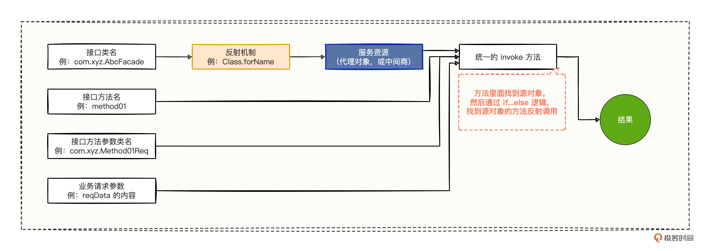
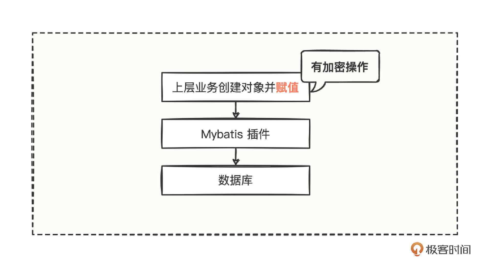
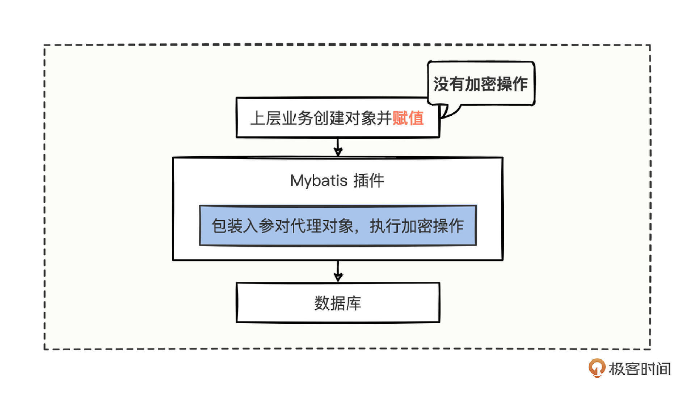
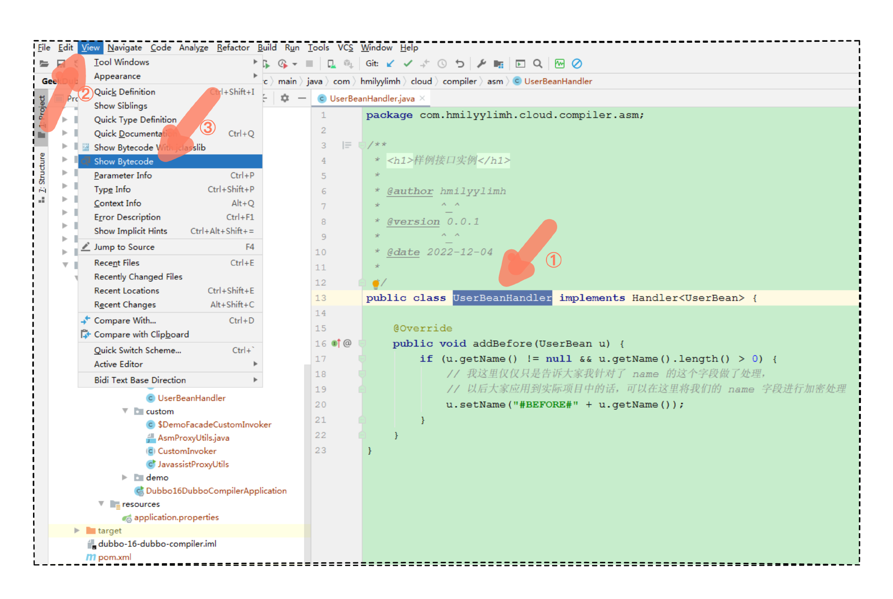

# 16｜Compiler编译：神乎其神的编译你是否有过胆怯？
你好，我是何辉。首先祝你新年快乐。

今天是我们深入研究Dubbo源码的第五篇，Compiler 编译。

在“ [点点直连](https://time.geekbang.org/column/article/613319)”中，我们实现了一套万能管控平台来修复数据，其中就有通过市场上的 Groovy 插件编译 Java 源代码来生成类信息。

而上一讲“ [Wrapper 机制](https://time.geekbang.org/column/article/620918)”中，在实现自定义代理的时候，我们也使用了 JavaCompiler 来编译源代码，只不过编译的时候，借助了磁盘上的 class 文件才得以生成类信息。

掌握了这两种动态编译方式，相信你在动态编译这块已经有了一定的基础，如果你还是觉得有点胆怯，今天我们上点难度，再学习 2 种 Compiler 方式，帮助你在底层框架开发层面拥有更强大的技术支撑。

## Javassist 编译

还是以上一讲的自定义代理为例。这张图你应该还有印象，我们尝试通过添加一层代理的方式，把各种 if…else 的硬编码逻辑转变为动态生成：



在实现自定义代理的过程中，我们采用的是最纯粹的字符串拼接的方式，拼接出了动态的源代码，虽然实用，但是写起来也费劲。

有没有通过 set 或 get 操作就能实现创建类的简单方式，来改造图中的代理实现过程呢？

我们在脑内检索一番，平常都是直接将编写好的代码交给 Javac 编译器去编译的，现在要通过某种工具简单的进行 set 或 get 动态创建一个类，怎么办呢，突然灵光一闪，在上一讲“Wrapper 机制的原理”代码流程中，我们看到了一段 makeClass 的样例代码，难道 Dubbo 已经有了类似的先进操作么？

不管真假，我们先去验证看看，找到了相应的代码：

```java
// org.apache.dubbo.common.bytecode.ClassGenerator#toClass(java.lang.Class<?>, java.lang.ClassLoader, java.security.ProtectionDomain)
public Class<?> toClass(Class<?> neighborClass, ClassLoader loader, ProtectionDomain pd) {
    if (mCtc != null) {
        mCtc.detach();
    }
    // 自增长类名尾巴序列号，类似 $Proxy_01.class 这种 JDK 代理名称的 01 数字
    long id = CLASS_NAME_COUNTER.getAndIncrement();
    try {
        // 从 ClassPool 中获取 mSuperClass 类的类型
        // 我们一般还可以用 mPool 来看看任意类路径对应的 CtClass 类型对象是什么
        // 比如可以通过 mPool.get("java.lang.String") 看看 String 的 CtClass 类型对象是什么
        // 之所以要这么做，主要是为了迎合这样的API语法而操作的
        CtClass ctcs = mSuperClass == null ? null : mPool.get(mSuperClass);
        if (mClassName == null) {
            mClassName = (mSuperClass == null || javassist.Modifier.isPublic(ctcs.getModifiers())
                    ? ClassGenerator.class.getName() : mSuperClass + "$sc") + id;
        }
        // 通过 ClassPool 来创建一个叫 mClassName 名字的类
        mCtc = mPool.makeClass(mClassName);
        if (mSuperClass != null) {
            // 然后设置一下 mCtc 这个新创建类的父类为 ctcs
            mCtc.setSuperclass(ctcs);
        }
        // 为 mCtc 新建类添加一个实现的接口
        mCtc.addInterface(mPool.get(DC.class.getName())); // add dynamic class tag.
        if (mInterfaces != null) {
            for (String cl : mInterfaces) {
                mCtc.addInterface(mPool.get(cl));
            }
        }
        // 为 mCtc 新建类添加一些字段
        if (mFields != null) {
            for (String code : mFields) {
                mCtc.addField(CtField.make(code, mCtc));
            }
        }
        // 为 mCtc 新建类添加一些方法
        if (mMethods != null) {
            for (String code : mMethods) {
                if (code.charAt(0) == ':') {
                    mCtc.addMethod(CtNewMethod.copy(getCtMethod(mCopyMethods.get(code.substring(1))),
                            code.substring(1, code.indexOf('(')), mCtc, null));
                } else {
                    mCtc.addMethod(CtNewMethod.make(code, mCtc));
                }
            }
        }
        // 为 mCtc 新建类添加一些构造方法
        if (mDefaultConstructor) {
            mCtc.addConstructor(CtNewConstructor.defaultConstructor(mCtc));
        }
        if (mConstructors != null) {
            for (String code : mConstructors) {
                if (code.charAt(0) == ':') {
                    mCtc.addConstructor(CtNewConstructor
                            .copy(getCtConstructor(mCopyConstructors.get(code.substring(1))), mCtc, null));
                } else {
                    String[] sn = mCtc.getSimpleName().split("\\$+"); // inner class name include $.
                    mCtc.addConstructor(
                            CtNewConstructor.make(code.replaceFirst(SIMPLE_NAME_TAG, sn[sn.length - 1]), mCtc));
                }
            }
        }
        // 将 mCtc 新创建的类转成 Class 对象
        try {
            return mPool.toClass(mCtc, neighborClass, loader, pd);
        } catch (Throwable t) {
            if (!(t instanceof CannotCompileException)) {
                return mPool.toClass(mCtc, loader, pd);
            }
            throw t;
        }
    } catch (RuntimeException e) {
        throw e;
    } catch (NotFoundException | CannotCompileException e) {
        throw new RuntimeException(e.getMessage(), e);
    }
}

```

凭着印象从代码中找到了一些特别有趣的 API，比如 setSuperclass 设置父类属性、addInterface 添加实现类属性、addField 添加字段、addMethod 添加方法、addConstructor 添加构造方法等等。刚刚还在寻思，有没有一种简单的赋值操作的方式来创建类，结果就发现了意外收获，从名字上看，感觉这些 API 都和类创建有关，好像都能用上。

我们继续深挖，发现 **这些 API 都是属于 Javassist 插件中的**，这就难怪了，既然该插件能提供这样的 API 来创建类，如果不将这些类最终编译成为 Class 类信息，未免也有点做事做半截的感觉。

不过这只是我们从源码层面的推测，到底有没有这个效果呢，还是要确认一下。至于如何确认，我给个小小的建议，如果你在源码中发现一些比较感兴趣的插件，可以去官方网站大致了解一下，也许疑惑和推测也就烟消云散了。

我们进入 [Javassist 的官网](http://www.javassist.org/) 会看到这段英文解释：

> Javassist (Java Programming Assistant) makes Java bytecode manipulation simple. It is a class library for editing bytecodes in Java; it enables Java programs to define a new class at runtime and to modify a class file when the JVM loads it. Unlike other similar bytecode editors, Javassist provides two levels of API: source level and bytecode level. If the users use the source-level API, they can edit a class file without knowledge of the specifications of the Java bytecode. The whole API is designed with only the vocabulary of the Java language. You can even specify inserted bytecode in the form of source text; **Javassist compiles it on the fly**. On the other hand, the bytecode-level API allows the users to directly edit a class file as other editors.

大致含义就是，Javassist 让用 Java 编辑字节码变为一件非常简单的事情，众多开发人员可以在不懂字节码规范的情况下，针对字节码文件进行编辑修改，改完之后 Javassist 可以实时编译它。

这下验证了我们刚才对源码的猜想。是不是很兴奋又接触到了新技术，别着急，我们还是先看 [官网关于 API 介绍的教程](http://www.javassist.org/tutorial/tutorial.html)。

基本了解如何使用之后，上一讲的代码模板，我们可以用 Javassist 实现一遍，代码如下：

```java
///////////////////////////////////////////////////
// 采用 Javassist 的 API 来动态创建代码模板
///////////////////////////////////////////////////
public class JavassistProxyUtils {
    private static final AtomicInteger INC = new AtomicInteger();
    public static Object newProxyInstance(Object sourceTarget) throws Exception{
        // ClassPool：Class对象的容器
        ClassPool pool = ClassPool.getDefault();

        // 通过ClassPool生成一个public类
        Class<?> targetClazz = sourceTarget.getClass().getInterfaces()[0];
        String proxyClassName = "$" + targetClazz.getSimpleName() + "CustomInvoker_" + INC.incrementAndGet();
        CtClass ctClass = pool.makeClass(proxyClassName);
        ctClass.setSuperclass(pool.get("com.hmilyylimh.cloud.compiler.custom.CustomInvoker"));

        // 添加方法  public Object invokeMethod(Object instance, String mtdName, Class<?>[] types, Object[] args) throws NoSuchMethodException { {...}
        CtClass returnType = pool.get("java.lang.Object");
        CtMethod newMethod=new CtMethod(
                returnType,
                "invokeMethod",
                new CtClass[]{ returnType, pool.get("java.lang.String"), pool.get("java.lang.Class[]"), pool.get("java.lang.Object[]") },
                ctClass);
        newMethod.setModifiers(Modifier.PUBLIC);
        newMethod.setBody(buildBody(targetClazz).toString());
        ctClass.addMethod(newMethod);

        // 生成 class 类
        Class<?> clazz = ctClass.toClass();

        // 将 class 文件写到 target 目录下，方便调试查看
        String filePath = JavassistProxyUtils.class.getResource("/").getPath()
                + JavassistProxyUtils.class.getPackage().toString().substring("package ".length()).replaceAll("\\.", "/");
        ctClass.writeFile(filePath);

        // 反射实例化创建对象
        return clazz.newInstance();
    }
    // 构建方法的内容字符串
    private static StringBuilder buildBody(Class<?> targetClazz) {
        StringBuilder sb = new StringBuilder("{\n");
        for (Method method : targetClazz.getDeclaredMethods()) {
            String methodName = method.getName();
            Class<?>[] parameterTypes = method.getParameterTypes();
            // if ("sayHello".equals(mtdName)) {
            String ifHead = "if (\"" + methodName + "\".equals($2)) {\n";
            // return ((DemoFacade) instance).sayHello(String.valueOf(args[0]));
            String ifContent = null;
            // 这里有 bug ，姑且就入参就传一个入参对象吧
            if(parameterTypes.length != 0){
                ifContent = "return ((" + targetClazz.getName() + ") $1)." + methodName + "(" + String.class.getName() + ".valueOf($4[0]));\n";
            } else {
                ifContent = "return ((" + targetClazz.getName() + ") $1)." + methodName + "();\n";
            }
            // }
            String ifTail = "}\n";
            sb.append(ifHead).append(ifContent).append(ifTail);
        }
        // throw new NoSuchMethodException("Method [" + mtdName + "] not found.");
        String invokeMethodTailContent = "throw new " + org.apache.dubbo.common.bytecode.NoSuchMethodException.class.getName() + "(\"Method [\" + $2 + \"] not found.\");\n}\n";
        sb.append(invokeMethodTailContent);
        return sb;
    }
}

```

可以发现确实比拼接字符串简单多了，而且 API 使用起来也比较清晰明了，完全按照平常的专业术语命名规范，马上就能找到对应的 API，根本不需要花很多准备工作。

改造代码需要注意 3 点。

1. 在获取各种类对应的 CtClass 类型对象时，可以通过从 ClassPool 的 get 方法中传入类路径得到。
2. 在对方法的入参字段名进行逻辑处理时， [就得替换成 $ 占位符](http://www.javassist.org/tutorial/tutorial2.html#intro)，方法中的 this 引用，用 $0 表示，方法中的第一个参数用 $1 表示，第二个参数用 $2 表示，以此类推。
3. 若要重写的父类的方法，是否设置 @Override 属性不太重要，但是千万别为了重写而拿父类的 CtMethod 属性一顿乱改。

用新方案编译源代码后，我们验证一下结果，编写测试验证代码。

```java
public static void main(String[] args) throws Exception {
    // 创建源对象（即被代理对象）
    DemoFacadeImpl demoFacade = new DemoFacadeImpl();
    // 生成自定义的代理类
    CustomInvoker invoker = (CustomInvoker) JavassistProxyUtils.newProxyInstance(demoFacade);
    // 调用代理类的方法
    invoker.invokeMethod(demoFacade, "sayHello", new Class[]{String.class}, new Object[]{"Geek"});
}

```

如预期所料，正常打印出了结果，没想到一句简短的 CtClass.toClass() 方法就帮我们快速编译代码并转成 Class 对象信息了，非常简单实用。

## ASM 编译

现在你有没有觉得信心大增，原来操作字节码这么简单，Javassist 简直是神器，有了它的存在，我想你再去理解那些 Java Agent 技术知识点，会发现在编译的世界修改字节码已经是小菜一碟了。

不过做技术我们讲究精益求精，既然 Javassist 这么好用，为什么公司的大佬还在用 ASM 进行操作呢？

其实，ASM 是一款侧重于性能的字节码插件，属于一种轻量级的高性能字节码插件，但同时实现的难度系数也会变大。这么讲你也许会好奇了，能有多难？

我们还是举例来看，例子是把敏感字段加密存储到数据库。



```java
public class UserBean {
    private String name;
    public UserBean(String name) { this.name = name; }
    public String getName() { return name; }
    public void setName(String name) { this.name = name; }
    @Override
    public String toString() { return "UserBean{name='" + name + '\'' + '}'; }
}

```

上层业务有一个对象，创建对象后，需要给对象的 setName 方法进行赋值。

如果想要给传入的 name 字段进行加密，一般我们会这么做。

```java
// 先创建一个对象
UserBean userBean = new UserBean();
// 将即将赋值的 Geek 先加密，然后设置到 userBean 对象中
userBean.setName(AESUtils.encrypt("Geek"));
// 最后将 userBean 插入到数据库中
userDao.insertData(userBean);

```

把传入 setName 的值先进行加密处理，然后把加密后的值放到 userBean 对象中，在入库时，就能把密文写到数据库了。

但是这样就显得很累赘，今天这个字段需要加密，明天那个字段需要加密，那就没完没了，于是有人就想到了，可以将加密的这段操作内嵌到代理对象中，比如这样：



在上层业务中，该怎么赋值还是继续怎么赋值，不用感知加密的操作，所有加密的逻辑全部内嵌到代理对象中。当然，如果这么做，就得设计一个代码模板，借助自定义代理的经验，想必你也有了设计思路：

```java
///////////////////////////////////////////////////
// 代码模板，将 UserBean 变成了 UserBeanHandler 代理对象，并且实现一个自己定义的 Handler 接口
///////////////////////////////////////////////////
public class UserBeanHandler implements Handler<UserBean> {
    @Override
    public void addBefore(UserBean u) {
        if (u.getName() != null && u.getName().length() > 0) {
            // 我这里仅仅只是告诉大家我针对了 name 的这个字段做了处理，
            // 以后大家应用到实际项目中的话，可以在这里将我们的 name 字段进行加密处理
            u.setName("#BEFORE#" + u.getName());
        }
    }
}

///////////////////////////////////////////////////
// 配合代码模板设计出来的一个接口
///////////////////////////////////////////////////
public interface Handler<T> {
    public void addBefore(T t);
}

```

代码模板的思路也很简单，主要注意 2 点。

- 设计一个对象的代理类，暴露一个 addBefore 方法来将字段进行加密操作。
- 代理类为了迎合具备一个 addBefore 方法，就得设计出一个接口，避免 Java 类单继承无法扩展的瓶颈。

代码模板是定义好了，可是操作字节码的时候，去哪里弄到该 UserBeanHandler 的字节码呢？

其实 IDEA 工具已经为你预留了一个查看字节码的入口。



选中代码模板后，展开顶部的 View 菜单，选中 Show Bytecode 看到该类对应的字节码。

```java
// class version 50.0 (50)
// access flags 0x21
// signature Ljava/lang/Object;Lcom/hmilyylimh/cloud/compiler/asm/Handler<Lcom/hmilyylimh/cloud/compiler/asm/UserBean;>;
// declaration: com/hmilyylimh/cloud/compiler/asm/UserBeanHandler implements com.hmilyylimh.cloud.compiler.asm.Handler<com.hmilyylimh.cloud.compiler.asm.UserBean>
public class com/hmilyylimh/cloud/compiler/asm/UserBeanHandler extends Ljava/lang/Object; implements com/hmilyylimh/cloud/compiler/asm/Handler {

  // compiled from: UserBeanHandler.java

  // access flags 0x1
  public <init>()V
    ALOAD 0
    INVOKESPECIAL java/lang/Object.<init> ()V
    RETURN
    MAXSTACK = 1
    MAXLOCALS = 1

  // access flags 0x1
  public addBefore(Lcom/hmilyylimh/cloud/compiler/asm/UserBean;)V
    ALOAD 1
    INVOKEVIRTUAL com/hmilyylimh/cloud/compiler/asm/UserBean.getName ()Ljava/lang/String;
    IFNULL L0
    ALOAD 1
    INVOKEVIRTUAL com/hmilyylimh/cloud/compiler/asm/UserBean.getName ()Ljava/lang/String;
    INVOKEVIRTUAL java/lang/String.length ()I
    IFLE L0
    ALOAD 1
    NEW java/lang/StringBuilder
    DUP
    INVOKESPECIAL java/lang/StringBuilder.<init> ()V
    LDC "#BEFORE#"
    INVOKEVIRTUAL java/lang/StringBuilder.append (Ljava/lang/String;)Ljava/lang/StringBuilder;
    ALOAD 1
    INVOKEVIRTUAL com/hmilyylimh/cloud/compiler/asm/UserBean.getName ()Ljava/lang/String;
    INVOKEVIRTUAL java/lang/StringBuilder.append (Ljava/lang/String;)Ljava/lang/StringBuilder;
    INVOKEVIRTUAL java/lang/StringBuilder.toString ()Ljava/lang/String;
    INVOKEVIRTUAL com/hmilyylimh/cloud/compiler/asm/UserBean.setName (Ljava/lang/String;)V
   L0
   FRAME SAME
    RETURN
    MAXSTACK = 3
    MAXLOCALS = 2

  // access flags 0x1041
  public synthetic bridge addBefore(Ljava/lang/Object;)V
    ALOAD 0
    ALOAD 1
    CHECKCAST com/hmilyylimh/cloud/compiler/asm/UserBean
    INVOKEVIRTUAL com/hmilyylimh/cloud/compiler/asm/UserBeanHandler.addBefore (Lcom/hmilyylimh/cloud/compiler/asm/UserBean;)V
    RETURN
    MAXSTACK = 2
    MAXLOCALS = 2
}

```

看到一大片密密麻麻的字节码指令，想必你已经头都大了，不过别慌，这个问题在 [ASM 的官网指引](https://asm.ow2.io/developer-guide.html) 中也解答了，我们只需要按部就班把字节码指令翻译成为 Java 代码就可以了。

好吧，既然官网都这么贴心了，那就勉强当一回工具人，我们按照官网的指示，依葫芦画瓢把代码模板翻译出来。

经过一番漫长的翻译之后，我们终于写出了自己看看都觉得头皮发麻的长篇大论的代码，关键位置我都加注释了。

```java
///////////////////////////////////////////////////
// ASM 字节码操作的代理工具类
///////////////////////////////////////////////////
public class AsmProxyUtils implements Opcodes {
    /**
     * <h2>创建代理对象。</h2>
     *
     * @param originClass：样例：UserBean.class
     * @return
     */
    public static Object newProxyInstance(Class originClass) throws Exception{
        String newClzNameSuffix = "Handler";
        byte[] classBytes = generateByteCode(originClass, newClzNameSuffix);

        // 可以想办法将 classBytes 存储为一个文件
        String filePath = AsmProxyUtils.class.getResource("/").getPath()
                + AsmProxyUtils.class.getPackage().toString().substring("package ".length()).replaceAll("\\.", "/");
        FileOutputStream fileOutputStream = new FileOutputStream(new File(filePath,
                originClass.getSimpleName() + newClzNameSuffix + ".class"));
        fileOutputStream.write(classBytes);
        fileOutputStream.close();

        // 还得把 classBytes 加载到 JVM 内存中去
        ClassLoader loader = Thread.currentThread().getContextClassLoader();
        Class<?> loaderClass = Class.forName("java.lang.ClassLoader");
        Method defineClassMethod = loaderClass.getDeclaredMethod("defineClass",
                String.class,
                byte[].class,
                int.class,
                int.class);
        defineClassMethod.setAccessible(true);
        Object respObject = defineClassMethod.invoke(loader, new Object[]{
                originClass.getName() + newClzNameSuffix,
                classBytes,
                0,
                classBytes.length
        });

        // 实例化对象
        return ((Class)respObject).newInstance();
    }
    /**
     * <h2>生成字节码的核心。</h2><br/>
     *
     * <li><h2>注意：接下来的重点就是如何用asm来动态产生一个 UserBeanHandler 类。</h2></li>
     *
     * @param originClass：样例：UserBean.class
     * @param newClzNameSuffix： 样例：Handler
     * @return
     */
    private static byte[] generateByteCode(Class originClass, String newClzNameSuffix) {
        String newClassSimpleNameAndSuffix = originClass.getSimpleName() + newClzNameSuffix + ".java";
        /**********************************************************************/
        // 利用 ASM 编写创建类文件头的相关信息
        /**********************************************************************/
        ClassWriter classWriter = new ClassWriter(0);
        /////////////////////////////////////////////////////////
        // class version 50.0 (50)
        // access flags 0x21
        // signature Ljava/lang/Object;Lcom/hmilyylimh/cloud/compiler/asm/Handler<Lcom/hmilyylimh/cloud/compiler/asm/UserBean;>;
        // declaration: com/hmilyylimh/cloud/compiler/asm/UserBeanHandler implements com.hmilyylimh.cloud.compiler.asm.UserBean<com.hmilyylimh.cloud.compiler.asm.UserBean>
        // public class com/hmilyylimh/cloud/compiler/asm/UserBeanHandler extends Ljava/lang/Object; implements com/hmilyylimh/cloud/compiler/asm/Handler {
        /////////////////////////////////////////////////////////
        classWriter.visit(
                V1_6,
                ACC_PUBLIC + ACC_SUPER,
                Type.getInternalName(originClass) + newClzNameSuffix,
                Type.getDescriptor(Object.class)+Type.getDescriptor(Handler.class).replace(";","")+"<"+Type.getDescriptor(originClass)+">;",
                Type.getDescriptor(Object.class),
                new String[]{ Type.getInternalName(Handler.class) }
        );
        /////////////////////////////////////////////////////////
        // UserBeanHandler.java
        /////////////////////////////////////////////////////////
        classWriter.visitSource(newClassSimpleNameAndSuffix, null);
        /**********************************************************************/
        // 创建构造方法
        /**********************************************************************/
        /////////////////////////////////////////////////////////
        // compiled from: UserBeanHandler.java
        // access flags 0x1
        // public <init>()V
        /////////////////////////////////////////////////////////
        MethodVisitor initMethodVisitor = classWriter.visitMethod(
                ACC_PUBLIC,
                "<init>",
                "()V",
                null,
                null
        );
        initMethodVisitor.visitCode();
        /////////////////////////////////////////////////////////
        // ALOAD 0
        // INVOKESPECIAL java/lang/Object.<init> ()V
        // RETURN
        /////////////////////////////////////////////////////////
        initMethodVisitor.visitVarInsn(ALOAD, 0);
        initMethodVisitor.visitMethodInsn(INVOKESPECIAL,
                Type.getInternalName(Object.class),
                "<init>",
                "()V"
                );
        initMethodVisitor.visitInsn(RETURN);
        /////////////////////////////////////////////////////////
        // MAXSTACK = 1
        // MAXLOCALS = 1
        /////////////////////////////////////////////////////////
        initMethodVisitor.visitMaxs(1, 1);
        initMethodVisitor.visitEnd();

        /**********************************************************************/
        // 创建 addBefore 方法
        /**********************************************************************/
        /////////////////////////////////////////////////////////
        // access flags 0x1
        // public addBefore(Lcom/hmilyylimh/cloud/compiler/asm/UserBean;)V
        /////////////////////////////////////////////////////////
        MethodVisitor addBeforeMethodVisitor = classWriter.visitMethod(
                ACC_PUBLIC,
                "addBefore",
                "(" + Type.getDescriptor(originClass) + ")V",
                null,
                null
        );
        addBeforeMethodVisitor.visitCode();
        /////////////////////////////////////////////////////////
        // ALOAD 1
        // INVOKEVIRTUAL com/hmilyylimh/cloud/compiler/asm/UserBean.getName ()Ljava/lang/String;
        /////////////////////////////////////////////////////////
        addBeforeMethodVisitor.visitVarInsn(ALOAD, 1);
        addBeforeMethodVisitor.visitMethodInsn(INVOKEVIRTUAL,
                Type.getInternalName(originClass),
                "getName",
                "()" + Type.getDescriptor(String.class));
        /////////////////////////////////////////////////////////
        // IFNULL L0
        // ALOAD 1
        // INVOKEVIRTUAL com/hmilyylimh/cloud/compiler/asm/UserBean.getName ()Ljava/lang/String;
        // INVOKEVIRTUAL java/lang/String.length ()I
        // IFLE L0
        /////////////////////////////////////////////////////////
        Label L0 = new Label();
        addBeforeMethodVisitor.visitJumpInsn(IFNULL, L0);
        addBeforeMethodVisitor.visitVarInsn(ALOAD, 1);
        addBeforeMethodVisitor.visitMethodInsn(INVOKEVIRTUAL,
                Type.getInternalName(originClass),
                "getName",
                "()" + Type.getDescriptor(String.class));
        addBeforeMethodVisitor.visitMethodInsn(INVOKEVIRTUAL,
                Type.getInternalName(String.class),
                "length",
                "()I");
        addBeforeMethodVisitor.visitJumpInsn(IFLE, L0);
        /**********************************************************************/
        // 接下来要干的事情就是：u.setName("#BEFORE#" + u.getName());
        /**********************************************************************/
        /////////////////////////////////////////////////////////
        // ALOAD 1
        // NEW java/lang/StringBuilder
        // DUP
        /////////////////////////////////////////////////////////
        addBeforeMethodVisitor.visitVarInsn(ALOAD, 1);
        addBeforeMethodVisitor.visitTypeInsn(NEW, Type.getInternalName(StringBuilder.class));
        addBeforeMethodVisitor.visitInsn(DUP);
        /////////////////////////////////////////////////////////
        // INVOKESPECIAL java/lang/StringBuilder.<init> ()V
        // LDC "#BEFORE#"
        // INVOKEVIRTUAL java/lang/StringBuilder.append (Ljava/lang/String;)Ljava/lang/StringBuilder;
        /////////////////////////////////////////////////////////
        addBeforeMethodVisitor.visitMethodInsn(INVOKESPECIAL,
                Type.getInternalName(StringBuilder.class),
                "<init>",
                "()V");
        addBeforeMethodVisitor.visitLdcInsn("#BEFORE#");
        addBeforeMethodVisitor.visitMethodInsn(INVOKEVIRTUAL,
                Type.getInternalName(StringBuilder.class),
                "append",
                "("+ Type.getDescriptor(String.class) + ")" + Type.getDescriptor(StringBuilder.class));
        /////////////////////////////////////////////////////////
        // ALOAD 1
        // INVOKEVIRTUAL com/hmilyylimh/cloud/compiler/asm/UserBean.getName ()Ljava/lang/String;
        // INVOKEVIRTUAL java/lang/StringBuilder.append (Ljava/lang/String;)Ljava/lang/StringBuilder;
        // NVOKEVIRTUAL java/lang/StringBuilder.toString ()Ljava/lang/String;
        // INVOKEVIRTUAL com/hmilyylimh/cloud/compiler/asm/UserBean.setName (Ljava/lang/String;)V
        /////////////////////////////////////////////////////////
        addBeforeMethodVisitor.visitVarInsn(ALOAD, 1);
        addBeforeMethodVisitor.visitMethodInsn(INVOKEVIRTUAL,
                Type.getInternalName(originClass),
                "getName",
                "()" + Type.getDescriptor(String.class));
        addBeforeMethodVisitor.visitMethodInsn(INVOKEVIRTUAL,
                Type.getInternalName(StringBuilder.class),
                "append",
                "("+ Type.getDescriptor(String.class) + ")" + Type.getDescriptor(StringBuilder.class));
        addBeforeMethodVisitor.visitMethodInsn(INVOKEVIRTUAL,
                Type.getInternalName(StringBuilder.class),
                "toString",
                "()" + Type.getDescriptor(String.class));
        addBeforeMethodVisitor.visitMethodInsn(INVOKEVIRTUAL,
                Type.getInternalName(originClass),
                "setName",
                "(" + Type.getDescriptor(String.class)+")V");
        /////////////////////////////////////////////////////////
        // L0
        // FRAME SAME
        // RETURN
        /////////////////////////////////////////////////////////
        addBeforeMethodVisitor.visitLabel(L0);
        addBeforeMethodVisitor.visitFrame(F_SAME, 0, null, 0, null);
        addBeforeMethodVisitor.visitInsn(RETURN);
        /////////////////////////////////////////////////////////
        // LMAXSTACK = 3
        // MAXLOCALS = 2
        /////////////////////////////////////////////////////////
        addBeforeMethodVisitor.visitMaxs(3, 2);
        addBeforeMethodVisitor.visitEnd();
        /**********************************************************************/
        // 创建桥接 addBefore 方法
        /**********************************************************************/
        /////////////////////////////////////////////////////////
        // access flags 0x1041
        // public synthetic bridge addBefore(Ljava/lang/Object;)V
        /////////////////////////////////////////////////////////
        MethodVisitor bridgeAddBeforeMethodVisitor = classWriter.visitMethod(ACC_PUBLIC + ACC_SYNTHETIC + ACC_BRIDGE,
                "addBefore",
                "(" + Type.getDescriptor(Object.class) + ")V",
                null,
                null
        );
        bridgeAddBeforeMethodVisitor.visitCode();
        /////////////////////////////////////////////////////////
        // ALOAD 0
        // ALOAD 1
        /////////////////////////////////////////////////////////
        bridgeAddBeforeMethodVisitor.visitVarInsn(ALOAD, 0);
        bridgeAddBeforeMethodVisitor.visitVarInsn(ALOAD, 1);
        /////////////////////////////////////////////////////////
        // CHECKCAST com/hmilyylimh/cloud/compiler/asm/UserBean
        // INVOKEVIRTUAL com/hmilyylimh/cloud/compiler/asm/UserBeanHandler.addBefore (Lcom/hmilyylimh/cloud/compiler/asm/UserBean;)V
        // RETURN
        /////////////////////////////////////////////////////////
        bridgeAddBeforeMethodVisitor.visitTypeInsn(CHECKCAST, Type.getInternalName(originClass));
        bridgeAddBeforeMethodVisitor.visitMethodInsn(INVOKEVIRTUAL,
                Type.getInternalName(originClass) + newClzNameSuffix,
                "addBefore",
                "(" + Type.getDescriptor(originClass) + ")V");
        bridgeAddBeforeMethodVisitor.visitInsn(RETURN);
        /////////////////////////////////////////////////////////
        // MAXSTACK = 2
        // MAXLOCALS = 2
        /////////////////////////////////////////////////////////
        bridgeAddBeforeMethodVisitor.visitMaxs(2, 2);
        bridgeAddBeforeMethodVisitor.visitEnd();
        /**********************************************************************/
        // 创建结束
        /**********************************************************************/
        classWriter.visitEnd();
        return classWriter.toByteArray();
    }
}

```

写的过程有些卡壳，难度系数也不低，我们有 3 个小点要注意。

- 有些字节码指令不知道如何使用 ASM API，比如 INVOKESPECIAL 不知道怎么调用 API，你可以网络检索一下“ **MethodVisitor INVOKESPECIAL**”关键字，就能轻松找到与之对应的 API 了。
- 重点关注调用 API 各参数的位置，千万别放错了，否则问题排查起来比较费时间。
- 生成的字节码文件直接保存到文件中，然后利用 ClassLoader.defineClass 方法，把字节码交给 JVM 虚拟机直接变成一个 Class 类型实例。

在写的时候，你一定要沉下心慢慢转换，一步都不能错，否则时间浪费了还得不到有效的成果。

写好之后，你一定非常兴奋，我们还是先写个测试代码验证一下：

```java
public static void main(String[] args) throws Exception {
    UserBean userBean = new UserBean("Geek");
    // 从 mybatis 的拦截器里面拿到了准备更新 db 的数据对象，然后创建代理对象
    Handler handler = (Handler) AsmProxyUtils.newProxyInstance(userBean.getClass());
    // 关键的一步，在 mybatis 中模拟将入参对象进行加密操作
    handler.addBefore(userBean);
    // 这里为了观察效果，先打印一下 userBean 的内容看看
    System.out.println(userBean);

    // 接下来，假设有执行 db 的操作，那就直接将密文入库了

    // db 操作完成之后，还得将 userBean 的密文变成明文，这里应该还有 addAfter 解密操作
}

```

打印输出的内容为：

```java
打印一下加密内容: UserBean{name='#BEFORE#Geek'}

```

结果如预期所料，把入参的数据成功加密了，我们终于可以喘口气了，不过辛苦是值得的，学到了大量的底层 ASM 操控字节码的知识，也见识到了底层功能的强大威力。

## Compiler 编译方式的适用场景

今天我们见识到 Javassist 和 ASM 的强大威力，之前也用过JavaCompiler和Groovy 插件，这么多款工具可以编译生成类信息，有哪些适用场景呢？

- JavaCompiler：是 JDK 提供的一个工具包，我们熟知的 Javac 编译器其实就是 JavaCompiler 的实现，不过JDK 的版本迭代速度快，变化大，我们升级 JDK 的时候，本来在低版本 JDK 能正常编译的功能，跑到高版本就失效了。
- Groovy：属于第三方插件，功能很多很强大，几乎是开发小白的首选框架，不需要考虑过多 API 和字节码指令，会构建源代码字符串，交给 Groovy 插件后就能拿到类信息，拿起来就可以直接使用，但同时也是比较重量级的插件。
- Javassist：封装了各种API来创建类，相对于稍微偏底层的风格，可以动态针对已有类的字节码，调用相关的 API 直接增删改查，非常灵活，只要熟练使用 API 就可以达到很高的境界。
- ASM：是一个通用的字节码操作的框架，属于非常底层的插件了，操作该插件的技术难度相当高，需要对字节码指令有一定的了解，但它体现出来的性能却是最高的，并且插件本身就是定位为一款轻量级的高性能字节码插件。

有了众多动态编译方式的法宝，从简单到复杂，从重量级到轻量级，你都学会了，相信再遇到一堆神乎其神的Compiler 编译方式，内心也不会胆怯了。

不过工具多了，有同学可能就有选择困难症，这里我也讲下个人的选择标准。

如果需要开发一些底层插件，我倾向使用 Javassist 或者 ASM。使用 Javassist 是因为用API 简单而且方便后人维护，使用 ASM 是在一些高度频繁调用的场景出于对性能的极致追求。如果开发应用系统的业务功能，对性能没有太强的追求，而且便于加载和卸载，我倾向使用 Groovy 这款插件。

## 总结

今天，我们接着上一讲刚学会的自定义代理案例，在不使用 Wrapper 已有机制的能力下，自己尝试使用简单的 API 操作来创建代理类，见识到了 Javassist 的强大之处，有一套非常齐全的 API 来创建代理类并实时编译成类信息。

使用 Javassist 编译的三大基本步骤。

- 首先，设计一个代码模板。
- 然后，使用 Javassist 的相关 API，通过 ClassPool.makeClass 得到一个操控类的 CtClass 对象，然后针对 CtClass 进行 addField 添加字段、addMethod 添加方法、addConstructor 添加构造方法等等。
- 最后，调用 CtClass.toClass 方法并编译得到一个类信息，有了类信息，就可以实例化对象处理业务逻辑了。

然后借助把敏感字段加密存储到数据库的案例，我们研究了大佬常用的 ASM 开发底层框架，尝试先将代码模板变成字节码指令，然后按照 ASM 的规范，将字节码指令一个个翻译成为 ASM 对应的方法，最终通过 ClassLoader.defineClass 将字节码变成了类信息。

也总结下使用 ASM 编译的四大基本步骤。

- 首先，还是设计一个代码模板。
- 其次，通过 IDEA 的协助得到代码模板的字节码指令内容。
- 然后，使用 Asm 的相关 API 依次将字节码指令翻译为 Asm 对应的语法，比如创建 ClassWriter 相当于创建了一个类，继续调用 ClassWriter.visitMethod 方法相当于创建了一个方法等等，对于生僻的字节码指令实在找不到对应的官方文档的话，可以通过“ **MethodVisitor + 字节码指令**”来快速查找对应的 Asm API。
- 最后，调用 ClassWriter.toByteArray 得到字节码的字节数组，传递到 ClassLoader.defineClass 交给 JVM 虚拟机得出一个 Class 类信息。

总的来说，无论使用哪种方式进行动态编译，不管是出于对性能的极致追求，还是出于对项目具体业务功能的通用处理，只要适合自身业务，且不会带来沉重性能开销，都是一种好方式。只有合适的才是最好的。

### 思考题

留个作业给你，前面讲到 Javassist 动态编译时，其实里面也支持直接将编写的源代码编译成类信息，你可以试着从 Dubbo 的 org.apache.dubbo.common.compiler.Compiler 接口研究一番，看看能不能找到现成的方法来编译源代码？

期待看到你的思考，如果你对今天的内容还有什么困惑，欢迎在留言区提问，我会第一时间回复。我们下一讲见。

### 参考资料

考虑到 ASM 比较难，我之前也录制了 [ASM实操一步步教学视频](https://www.ixigua.com/7023388128421511710?id=7023365492664599072)，你可以学习。

### 15 思考题参考

上一期留了个作业，总结下 java.lang.Class#getDeclaredMethod 方法的调用流程，以及排查下存在哪些耗时和占用内存的地方。

既然要研究方法的调用流程，那最简单的方式就是直接去看代码。

```java
// java.lang.Class#getDeclaredMethod
public Method getDeclaredMethod(String name, Class<?>... parameterTypes)
    throws NoSuchMethodException, SecurityException {
    // 检查方法的权限
    checkMemberAccess(Member.DECLARED, Reflection.getCallerClass(), true);
    // 从该类中的所有方法列表中找到一个匹配方法名称和方法参数的方法对象
    // 并且返回的 method 对象是一个克隆拷贝出来的对象
    Method method = searchMethods(privateGetDeclaredMethods(false), name, parameterTypes);
    if (method == null) {
        throw new NoSuchMethodException(getName() + "." + name + argumentTypesToString(parameterTypes));
    }
    return method;
}
                  ↓
// 从缓存或者通过 native 调用从 JVM 中获取该 Class 中声明的方法列表集合
private Method[] privateGetDeclaredMethods(boolean publicOnly) {
    checkInitted();
    Method[] res;
    // 从缓存中获取该 Class 中声明的方法列表集合
    ReflectionData<T> rd = reflectionData();
    if (rd != null) {
        res = publicOnly ? rd.declaredPublicMethods : rd.declaredMethods;
        if (res != null) return res;
    }
    // No cached value available; request value from VM
    // 从 JVM 中获取该 Class 中声明的方法列表集合
    // getDeclaredMethods0 尾巴上是个数字0，一般是 native 方法
    // 而 native 调用产生的消耗一般可以达到 java 调用的 10 倍以上
    res = Reflection.filterMethods(this, getDeclaredMethods0(publicOnly));
    if (rd != null) {
        if (publicOnly) {
            rd.declaredPublicMethods = res;
        } else {
            rd.declaredMethods = res;
        }
    }
    return res;
}
                  ↓
// 从缓存中获取方法列表对象
private ReflectionData<T> reflectionData() {
    SoftReference<ReflectionData<T>> reflectionData = this.reflectionData;
    int classRedefinedCount = this.classRedefinedCount;
    ReflectionData<T> rd;
    if (useCaches &&
        reflectionData != null &&
        (rd = reflectionData.get()) != null &&
        rd.redefinedCount == classRedefinedCount) {
        return rd;
    }
    // else no SoftReference or cleared SoftReference or stale ReflectionData
    // -> create and replace new instance
    return newReflectionData(reflectionData, classRedefinedCount);
}
                  ↓
// 存方法列表的反射对象类
// 从该类中发现含有大量的字段集合、方法集合、构造方法集合等等
// 存储太多太多的重要数据，缓存占据的容量大小也是一个问题因素
private static class ReflectionData<T> {
    volatile Field[] declaredFields;
    volatile Field[] publicFields;
    volatile Method[] declaredMethods;
    volatile Method[] publicMethods;
    volatile Constructor<T>[] declaredConstructors;
    volatile Constructor<T>[] publicConstructors;
    // Intermediate results for getFields and getMethods
    volatile Field[] declaredPublicFields;
    volatile Method[] declaredPublicMethods;
    volatile Class<?>[] interfaces;
    // Value of classRedefinedCount when we created this ReflectionData instance
    final int redefinedCount;
    ReflectionData(int redefinedCount) {
        this.redefinedCount = redefinedCount;
    }
}
                  ↓
// 从声明的方法列表集合中，检索出一个匹配方法名称和方法参数的 method 对象
private static Method searchMethods(Method[] methods,
                                    String name,
                                    Class<?>[] parameterTypes)
{
    Method res = null;
    String internedName = name.intern();
    for (int i = 0; i < methods.length; i++) {
        Method m = methods[i];
        if (m.getName() == internedName
            && arrayContentsEq(parameterTypes, m.getParameterTypes())
            && (res == null
                || res.getReturnType().isAssignableFrom(m.getReturnType())))
            res = m;
    }
    // 重点看这里，如果找到了一个匹配的 Method 的话
    // 则重新 copy 一份新对象返回，且新对象的 root 属性都会指向原来的 Method 对象
    // 也就意味着大量调用的话，又会产生大量的对象，是不可忽视的一个重要环节
    return (res == null ? res : getReflectionFactory().copyMethod(res));
}

```

代码看下来，总结起来，获取方法的流程主要有三步。

- 第一步，检查方法权限。
- 第二步，从 Class 对象的所有方法列表中查找匹配的 Method 对象。
- 第三步，返回 Method 对象的克隆对象。

第二步每次都是 O(n) 时间复杂度的检索，并且缓存中的 ReflectionData 内容实在是太多了，占据了大量的内存开销。

第三步每次都是返回一个克隆对象，而 Method 对象本身就有很多东西，每次都拷贝出一个新对象，又是吃内存的操作。

一个简简单单的直接调用，换做反射后，即使不谈内存占用，就光凭代码量的行数，就相当于调用了很多字节码指令，虽然字节码指令执行很快，但是蚊子腿也是肉，时间上也有数十倍甚至百倍的耗时增长开销。

有时候，虽然 Java 反射性能会存在一定损耗开销，但并不是告诉我们不能使用 Java 反射，其实，我们应该根据程序设计来按需考量设计。

如果你只是根据某些条件或配置文件来使用 Java 反射创建对象，然后就做其它操作（如数据库查询等），那 Java 反射损耗的那点性能可以忽略不计。

但如果你在连续循环中通过反射不断创建大量对象，这样的操作就得好好斟酌了，看看是不是可以不用反射的机制实现，避免大量耗时和内存的开销。