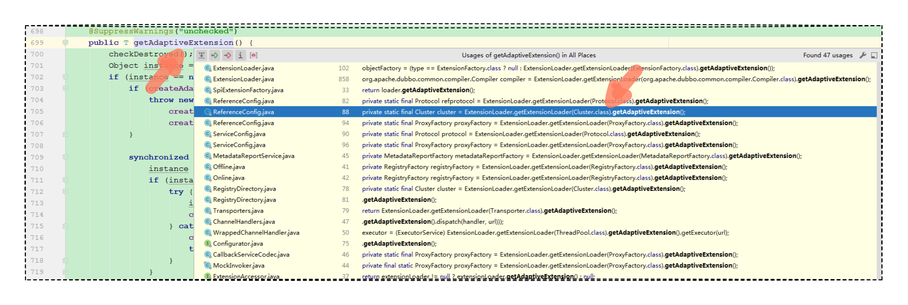
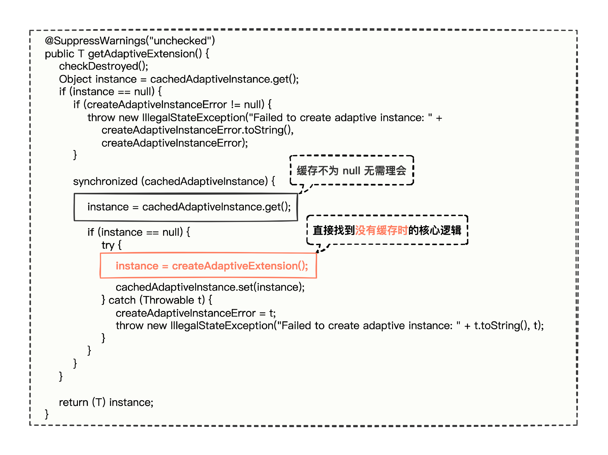
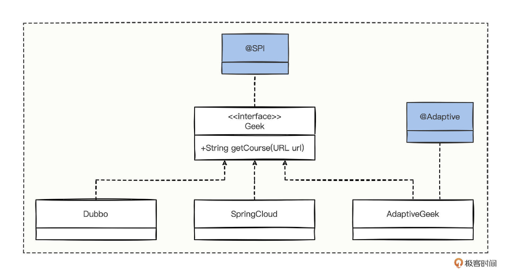
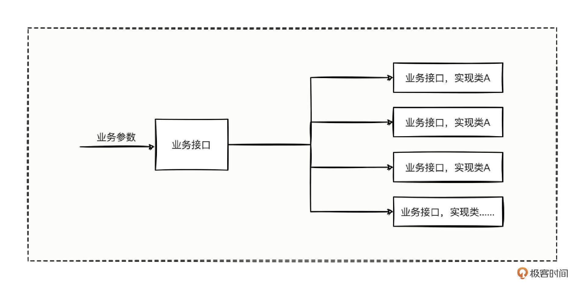
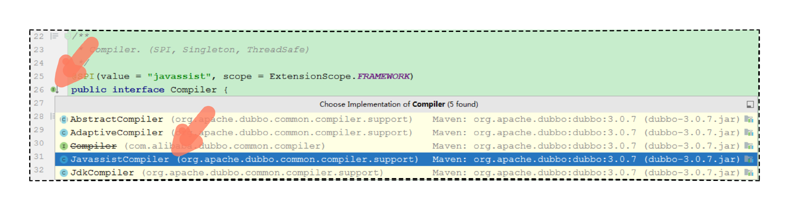

# 17｜Adaptive适配：Dubbo的Adaptive特殊在哪里？
你好，我是何辉。

有了上一讲“Compiler 编译”的基础，相信你在今天Dubbo源码第六篇 Adaptive 适配，会比较轻松。

其实Adaptive我们见过好几次了。还记得在“ [SPI 机制](https://time.geekbang.org/column/article/620900)”中提到的 ExtensionLoader 类么，我们在认真研究 ExtensionLoader 源码时，发现这个类里有一个获取自适应扩展点的方法（getAdaptiveExtension）。

深入 Dubbo SPI 机制的底层原理时，在加载并解析 SPI 文件的逻辑中，你会看到有一段专门针对 Adaptive 注解进行处理的代码；在 Dubbo 内置的被 @SPI 注解标识的接口中，你同样会看到好多方法上都有一个 @Adaptive 注解。

这么多代码和功能都与 Adaptive 有关，难道有什么特殊含义么？Adaptive究竟是用来干什么的呢？我们开始今天的学习。

## 自适应扩展点

照例还是从直接的方式——代码着手，我们就先从 ExtensionLoader 的 getAdaptiveExtension 方法开始吧。

不过，一开始就有点小障碍，从 ExtensionLoader 的使用方式上看，我们得找个接口传进去，但是这一时半会也不知道传什么接口才好啊。

别慌，回忆我们在“ [点点直连](https://time.geekbang.org/column/article/613319)”学过一个小技巧，如果不知道源码的某个方法如何使用，最好的第一手资料就是源码，从源码中寻找别人使用这个方法的正确姿势。按照小技巧的思路，看下 getAdaptiveExtension 方法有多少个方法被调用。



从调用关系截图中，发现有蛮多地方调用的，因为这里要探究 getAdaptiveExtension 方法是如何被使用的，具体研究哪个方法倒不重要，我们随便挑一个好了。

就挑选 Cluster 这段代码来调试吧。

```java
Cluster cluster = ExtensionLoader
    // 获取 Cluster 接口对应扩展点加载器
    .getExtensionLoader(Cluster.class)
    // 从 Cluster 扩展点加载器中获取自适应的扩展点
    .getAdaptiveExtension();

```

看源码也得讲究技巧，不能一头扎进各种方法的细节中，这样只会慢慢消磨自己征服源码的信心。哪些源码需要仔细看，哪些可以跳过，我分享一个小技巧： **如果你看到源码中有各种缓存功能，比如“有缓存则提前返回”这些逻辑的时候，可以全部跳过，直接奔向没有走缓存的那条分支逻辑。**

拿这个 getAdaptiveExtension 方法举例。



这个方法中，那些当缓存不为空时做的一些业务逻辑，我们先通通抛开不看，直接找到没有缓存时的核心逻辑，这样才能快速有效地找到最核心的代码。从 getAdaptiveExtension 方法中，我们可以知道，最核心的方法是 createAdaptiveExtension 方法。

那接下来，我们就继续进入这个方法看看。

```java
// org.apache.dubbo.common.extension.ExtensionLoader#getAdaptiveExtensionClass
// 创建自适应扩展点方法
private T createAdaptiveExtension() {
    try {
        // 这一行从 newInstance 这个关键字便知道这行代码就是创建扩展点的核心代码
        T instance = (T) getAdaptiveExtensionClass().newInstance();

        // 这里针对创建出来的实例对象做的一些类似 Spring 的前置后置的方式处理
        instance = postProcessBeforeInitialization(instance, null);
        instance = injectExtension(instance);
        instance = postProcessAfterInitialization(instance, null);
        initExtension(instance);
        return instance;
    } catch (Exception e) {
        throw new IllegalStateException("Can't create adaptive extension " + type + ", cause: " + e.getMessage(), e);
    }
}
                  ↓
// 获取自适应扩展点的类对象
private Class<?> getAdaptiveExtensionClass() {
    // 获取当前扩展点（Cluster）的加载器（ExtensionLoader）中的所有扩展点
    getExtensionClasses();
    // 如果缓存的自适应扩展点不为空的话，就提前返回
    // 这里也间接的说明了一点，每个扩展点（Cluster）只有一个自适应扩展点对象
    if (cachedAdaptiveClass != null) {
        return cachedAdaptiveClass;
    }
    // 这里便是创建自适应扩展点类对象的逻辑，我们需要直接进入没有缓存时的创建逻辑
    return cachedAdaptiveClass = createAdaptiveExtensionClass();
}
                  ↓
// 创建自适应扩展点类对象
private Class<?> createAdaptiveExtensionClass() {
    // Adaptive Classes' ClassLoader should be the same with Real SPI interface classes' ClassLoader
    ClassLoader classLoader = type.getClassLoader();
    try {
        if (NativeUtils.isNative()) {
            return classLoader.loadClass(type.getName() + "$Adaptive");
        }
    } catch (Throwable ignore) {
    }
    // 看见这行关键代码，发现使用了一个叫做扩展点源码生成器的类
    // 看意思，就是调用 generate 方法生成一段 Java 编写的源代码
    String code = new AdaptiveClassCodeGenerator(type, cachedDefaultName).generate();
    // 紧接着把源代码传入了 Compiler 接口的扩展点
    // 这个 Compiler 接口不就是我们上一讲思考题刚学过的知识点么
    org.apache.dubbo.common.compiler.Compiler compiler = extensionDirector.getExtensionLoader(
        org.apache.dubbo.common.compiler.Compiler.class).getAdaptiveExtension();
    // 通过调用 compile 方法，也就大致明白了，就是通过源代码生成一个类对象而已
    return compiler.compile(type, code, classLoader);
}

```

进入 createAdaptiveExtension 源码，通读一遍大致的逻辑，我们总结出了 3 点。

1. 在 Dubbo 框架里，自适应扩展点是通过双检索（DCL）以线程安全的形式创建出来的。
2. 创建自适应扩展点时，每个接口有且仅有一个自适应扩展点。
3. 自适应扩展点的创建，是通过生成了一段 Java 的源代码，然后使用 Compiler 接口编译生成了一个类对象，这说明自适应扩展点是动态生成的。

既然知道了这里会生成源代码，那我们不妨就在生成好的源代码这里打个条件断点，看看动态生成的源代码究竟长什么样。


条件断点打好后，当断点到来时，把 code 源代码拷贝出来，我写了详细注释。

```java
package org.apache.dubbo.rpc.cluster;
import org.apache.dubbo.rpc.model.ScopeModel;
import org.apache.dubbo.rpc.model.ScopeModelUtil;
// 类名比较特别，是【接口的简单名称】+【$Adaptive】构成的
// 这就是自适应动态扩展点对象的类名
public class Cluster$Adaptive implements org.apache.dubbo.rpc.cluster.Cluster {
    public org.apache.dubbo.rpc.Invoker join(org.apache.dubbo.rpc.cluster.Directory arg0, boolean arg1) throws org.apache.dubbo.rpc.RpcException {
        // 如果 Directory 对象为空的话，则抛出异常
        // 一般正常的逻辑是不会走到为空的逻辑里面的，这是一种健壮性代码考虑
        if (arg0 == null) throw new IllegalArgumentException("org.apache.dubbo.rpc.cluster.Directory argument == null");
        // 若 Directory  对象中的 URL 对象为空抛异常，同样是健壮性代码考虑
        if (arg0.getUrl() == null)
            throw new IllegalArgumentException("org.apache.dubbo.rpc.cluster.Directory argument getUrl() == null");
        org.apache.dubbo.common.URL url = arg0.getUrl();
        // 这里关键点来了，如果从 url 中取出 cluster 为空的话
        // 则使用默认的 failover 属性，这不恰好就证实了若不配置的走默认逻辑，就在这里体现了
        String extName = url.getParameter("cluster", "failover");
        if (extName == null)
            throw new IllegalStateException("Failed to get extension (org.apache.dubbo.rpc.cluster.Cluster) name from" +
                    " url (" + url.toString() + ") use keys([cluster])");
        ScopeModel scopeModel = ScopeModelUtil.getOrDefault(url.getScopeModel(),
                org.apache.dubbo.rpc.cluster.Cluster.class);
        // 反正得到了一个 extName 扩展点名称，则继续获取指定的扩展点
        org.apache.dubbo.rpc.cluster.Cluster extension =
                (org.apache.dubbo.rpc.cluster.Cluster) scopeModel.getExtensionLoader(org.apache.dubbo.rpc.cluster.Cluster.class)
                .getExtension(extName);
        // 拿着指定的扩展点继续调用其对应的方法
        return extension.join(arg0, arg1);
    }
    // 这里默认抛异常，说明不是自适应扩展点需要处理的业务逻辑
    public org.apache.dubbo.rpc.cluster.Cluster getCluster(org.apache.dubbo.rpc.model.ScopeModel arg0,
                                                           java.lang.String arg1) {
        throw new UnsupportedOperationException("The method public static org.apache.dubbo.rpc.cluster.Cluster org" +
                ".apache.dubbo.rpc.cluster.Cluster.getCluster(org.apache.dubbo.rpc.model.ScopeModel,java.lang.String)" +
                " of interface org.apache.dubbo.rpc.cluster.Cluster is not adaptive method!");
    }
    // 这里默认也抛异常，说明也不是自适应扩展点需要处理的业务逻辑
    public org.apache.dubbo.rpc.cluster.Cluster getCluster(org.apache.dubbo.rpc.model.ScopeModel arg0,
                                                           java.lang.String arg1, boolean arg2) {
        throw new UnsupportedOperationException("The method public static org.apache.dubbo.rpc.cluster.Cluster org" +
                ".apache.dubbo.rpc.cluster.Cluster.getCluster(org.apache.dubbo.rpc.model.ScopeModel,java.lang.String," +
                "boolean) of interface org.apache.dubbo.rpc.cluster.Cluster is not adaptive method!");
    }
    // !!!!!!!!!!!!!!!!!!!!!!!!!!!!!!!!!!!!!!!!!!!!!!!!!!
    // 重点推导
    // !!!!!!!!!!!!!!!!!!!!!!!!!!!!!!!!!!!!!!!!!!!!!!!!!!
    // 然后继续看看 Cluster，得搞清楚为什么两个 getCluster 方法会抛异常，而 join 方法不抛异常
    // 结果发现接口中的 join 方法被 @Adaptive 注解标识了，但是另外 2 个 getCluster 方法没有被 @Adaptive 标识
    // 由此可以说明一点，含有被 @Adaptive 注解标识的 SPI 接口，是会生成自适应代理对象的
}

```

仔细看完自适应扩展点对应的源代码，你会发现一个很奇怪的现象，为什么 join 方法不抛异常，而另外两个 getCluster 方法会抛异常呢？

回想之前在“ [Wrapper 机制](https://time.geekbang.org/column/article/620918)”中，自定义代理时，我们如果想动态处理，会根据获取接口的所有方法，挨个 if…else 处理。想到这，我们进入 Cluster 接口看看，发现了意外的惊喜： **CLuster 接口中的 join 方法被 @Adaptive 注解标识了，但是另外 2 个 getCluster 方法没有被 @Adaptive 标识。**

所以，我们可以大胆推测，在生成自适应扩展点源代码的时候，应该是识别了具有 @Adaptive 注解的方法，方法有注解的话，就为这个方法生成对应的代理逻辑。

好，小结一下，通过查看自适应扩展点对应的源代码，我们有 3 点收获。

- 自适应扩展点对象的类名很特殊，是由接口名+$Adaptive构成的。
- SPI 接口中，标识了 @Adaptive 注解的方法，到时候在自适应扩展点对象中都会有对应的一套动态代码逻辑。
- 自适应扩展点对象中那些有代理逻辑的方法，代码流程大致是先从 url 获取到指定的扩展点名称，没有指定则使用 SPI 接口默认设置的扩展点名称，总之 **继续根据扩展点名称，再次获取对应的实现类来触发方法的调用**。

到这里，通过源码的简单跟踪，开头的 2 个问题相信你已经能回答了。

ExtensionLoader 的 getAdaptiveExtension 方法，其实返回的是一个自适应的代理对象，代理对象会从 URL 里面获取扩展点名称，来走指定的实现类逻辑。而SPI 接口的方法上，如果有 @Adaptive 注解，那么这个方法会被代理，代理的逻辑会出现在自适应代理对象中。

## 加载 SPI 资源文件

细心的你可能会注意到，不是还有一个小细节么，加载解析 SPI 文件时会去处理 Adaptive 注解的逻辑，为什么在这个环节也会和 Adaptive 扯上关系，难道是有啥特殊逻辑么？

想要搞清楚这个问题，那么就得继续深入研究“SPI 机制”中 loadDirectory 方法了，我们之前没有深究，现在找到源码中的这个方法，打开继续深入跟踪，参考我写的详细注释：

```java
// org.apache.dubbo.common.extension.ExtensionLoader#loadDirectory(java.util.Map<java.lang.String,java.lang.Class<?>>, org.apache.dubbo.common.extension.LoadingStrategy, java.lang.String)
// 加载某一指定目录下的 SPI 文件目录
private void loadDirectory(Map<String, Class<?>> extensionClasses, LoadingStrategy strategy, String type) {
    loadDirectory(extensionClasses, strategy.directory(), type, strategy.preferExtensionClassLoader(),
        strategy.overridden(), strategy.includedPackages(), strategy.excludedPackages(), strategy.onlyExtensionClassLoaderPackages());
    String oldType = type.replace("org.apache", "com.alibaba");
    loadDirectory(extensionClasses, strategy.directory(), oldType, strategy.preferExtensionClassLoader(),
        strategy.overridden(), strategy.includedPackagesInCompatibleType(), strategy.excludedPackages(), strategy.onlyExtensionClassLoaderPackages());
}
                  ↓
// loadDirectory 方法的重载，还是加载某一指定目录下的 SPI 文件目录
private void loadDirectory(Map<String, Class<?>> extensionClasses, String dir, String type,
                           boolean extensionLoaderClassLoaderFirst, boolean overridden, String[] includedPackages,
                           String[] excludedPackages, String[] onlyExtensionClassLoaderPackages) {
    String fileName = dir + type;
    try {
        // 这里省略了其他部分代码

        Map<ClassLoader, Set<java.net.URL>> resources = ClassLoaderResourceLoader.loadResources(fileName, classLoadersToLoad);
        // 这里通过 SPI 文件目录找到了多个文件
        // 于是循环每个文件进行挨个读取内容
        resources.forEach(((classLoader, urls) -> {
            loadFromClass(extensionClasses, overridden, urls, classLoader, includedPackages, excludedPackages, onlyExtensionClassLoaderPackages);
        }));
    } catch (Throwable t) {
        logger.error("Exception occurred when loading extension class (interface: " +
            type + ", description file: " + fileName + ").", t);
    }
}
                  ↓
// 循环 SPI 文件的多个路径，然后想办法读取资源路径的内容
private void loadFromClass(Map<String, Class<?>> extensionClasses, boolean overridden, Set<java.net.URL> urls, ClassLoader classLoader,
                           String[] includedPackages, String[] excludedPackages, String[] onlyExtensionClassLoaderPackages) {
    if (CollectionUtils.isNotEmpty(urls)) {
        for (java.net.URL url : urls) {
            loadResource(extensionClasses, classLoader, url, overridden, includedPackages, excludedPackages, onlyExtensionClassLoaderPackages);
        }
    }
}
                  ↓
// 读取单个资源文件的内容，通过 BufferedReader 进行逐行读取解析内容
private void loadResource(Map<String, Class<?>> extensionClasses, ClassLoader classLoader,
                          java.net.URL resourceURL, boolean overridden, String[] includedPackages, String[] excludedPackages, String[] onlyExtensionClassLoaderPackages) {
    try {
        try (BufferedReader reader = new BufferedReader(new InputStreamReader(resourceURL.openStream(), StandardCharsets.UTF_8))) {
            String line;
            String clazz;
            while ((line = reader.readLine()) != null) {
               // 这里省略了其他部分代码
                if (StringUtils.isNotEmpty(clazz) && !isExcluded(clazz, excludedPackages) && isIncluded(clazz, includedPackages)
                    && !isExcludedByClassLoader(clazz, classLoader, onlyExtensionClassLoaderPackages)) {
                    loadClass(extensionClasses, resourceURL, Class.forName(clazz, true, classLoader), name, overridden);
                }
                // 这里省略了其他部分代码
            }
    } catch (Throwable t) {
        logger.error("Exception occurred when loading extension class (interface: " +
            type + ", class file: " + resourceURL + ") in " + resourceURL, t);
    }
}
                  ↓
private void loadClass(Map<String, Class<?>> extensionClasses, java.net.URL resourceURL, Class<?> clazz, String name,
                       boolean overridden) throws NoSuchMethodException {
    if (!type.isAssignableFrom(clazz)) {
        throw new IllegalStateException("Error occurred when loading extension class (interface: " +
            type + ", class line: " + clazz.getName() + "), class "
            + clazz.getName() + " is not subtype of interface.");
    }
    // 如果该接口的实现类上有 Adaptive 注解的话，则给 cachedAdaptiveClass 字段进行了赋值
    if (clazz.isAnnotationPresent(Adaptive.class)) {
        cacheAdaptiveClass(clazz, overridden);
    }
    // 如果该接口的实现类有个构造方法的参数是该接口的话，又怎么怎么滴
    else if (isWrapperClass(clazz)) {
        cacheWrapperClass(clazz);
    } else {
        // 省略其他部分代码
    }
}
                  ↓
// 如果 cachedAdaptiveClass 为空的话，就直接赋值
// 再次看到这个 cachedAdaptiveClass 字段时，之前在获取自适应扩展点不是也见过的么
private void cacheAdaptiveClass(Class<?> clazz, boolean overridden) {
    if (cachedAdaptiveClass == null || overridden) {
        cachedAdaptiveClass = clazz;
    } else if (!cachedAdaptiveClass.equals(clazz)) {
        throw new IllegalStateException("More than 1 adaptive class found: "
            + cachedAdaptiveClass.getName()
            + ", " + clazz.getName());
    }
}

```

代码的大致逻辑是这样的。

- 首先，从当前系统及其引用的 Jar 包中，找到 SPI 接口的所有资源文件。
- 然后，循环每个资源文件读取文件内容，并逐行解析。
- 最后，在解析的过程中，通过 Class.forName 加载类路径得到类信息，并且针对类信息探测是否有 @Adaptive 注解，是否有入参就是 SPI 接口类型的构造方法。

经过层层深入，我们最终发现了一个亮点， **扩展点的实现类居然也可以有 @Adaptive 注解**。

这下就懵了。前面分析过，在 SPI 接口的方法上可以添加 @Adaptive 注解，现在发现在解析 SPI 文件内容为类信息时，又在探测类上有 @Adaptive 注解，这是为什么呢？难道 @Adaptive 既能修饰方法，还能修饰类么？

别急，仔细看代码，可以发现探测实现类上如果有 @Adaptive 注解，就走进了一个缓存分支逻辑，从缓存分支的实现逻辑中，你会发现一个新大陆。

缓存分支逻辑中有个 cachedAdaptiveClass 成员变量字段，而恰好这个字段前面也出现在 getAdaptiveExtensionClass 方法中。再来看下这个方法。

```java
// 获取自适应扩展点的类对象
private Class<?> getAdaptiveExtensionClass() {
    // 获取当前扩展点（Cluster）的加载器（ExtensionLoader）中的所有扩展点
    getExtensionClasses();
    // 如果缓存的自适应扩展点不为空的话，就提前返回
    // 这里也间接的说明了一点，每个扩展点（Cluster）只有一个自适应扩展点对象
    if (cachedAdaptiveClass != null) {
        return cachedAdaptiveClass;
    }
    // 这里便是创建自适应扩展点类对象的逻辑，我们需要直接进入没有缓存时的创建逻辑
    return cachedAdaptiveClass = createAdaptiveExtensionClass();
}

```

getAdaptiveExtensionClass 这段逻辑中，可以发现 cachedAdaptiveClass 字段有值则直接使用，而 cachedAdaptiveClass 这个字段，恰好就是在探测实现类有 @Adaptive 注解时赋值的。

好，我们整理下跟踪 loadDirectory 源码的思路，可以得出 2 点结论。

- @Adaptive 不仅会出现在 SPI 接口的方法上，也会出现在 SPI 接口的实现类上，因此 **自适应扩展点有 2 个来源，实现类、生成的代理类**。
- 获取自适应扩展点时， **若实现类上有 @Adaptive 注解，则优先使用这个实现类作为自适应扩展点**。

## 验证源码推测

关于 @Adaptive 注解相关的源码我们也翻遍了，如果现在要你根据源码自己写个 Demo 样例，仿照 Cluster 接口测试验证一下追踪源码得出的结论，总应该没啥问题吧。毕竟源码看完，若是不动手，其实也只是停留在概念上大概知道有这么个事，但究其细节却浑然不知，纸上得来终觉浅，绝知此事要躬行啊。

在具体验证之前，我们还是设计一下验证的大体代码结构：



图中，定义了一个 Geek 接口，然后有 3 个实现类，分别是 Dubbo、SpringCloud 和 AdaptiveGeek，但是 AdaptiveGeek 实现类上有 @Adaptive 注解。

有了这种结构图，鉴于刚分析的结论，@Adaptive 在实现类上还是在方法上，会有很大的区别，所以我们做两套验证方案。

- 验证方案一：只有两个实现类 Dubbo 和 SpringCloud，然后 @Adaptive 添加在 Geek 接口的方法上。
- 验证方法二：在验证方案一的基础之上，再添加一个实现类 AdaptiveGeek 并添加 @Adaptive 注解。

设计完成，我们编写代码。

```java
///////////////////////////////////////////////////
// SPI 接口：Geek，默认的扩展点实现类是 Dubbo 实现类
// 并且该接口的 getCourse 方法上有一个 @Adaptive 注解
///////////////////////////////////////////////////
@SPI("dubbo")
public interface Geek {
    @Adaptive
    String getCourse(URL url);
}
///////////////////////////////////////////////////
// Dubbo 实现类
///////////////////////////////////////////////////
public class Dubbo implements Geek {
    @Override
    public String getCourse(URL url) {
        return "Dubbo实战进阶课程";
    }
}
///////////////////////////////////////////////////
// SpringCloud 实现类
///////////////////////////////////////////////////
public class SpringCloud implements Geek {
    @Override
    public String getCourse(URL url) {
        return "SpringCloud入门课程100集";
    }
}
///////////////////////////////////////////////////
// AdaptiveGeek 实现类，并且该实现类上有一个 @Adaptive 注解
///////////////////////////////////////////////////
@Adaptive
public class AdaptiveGeek implements Geek {
    @Override
    public String getCourse(URL url) {
        return "17｜Adaptive 适配：Dubbo的Adaptive特殊在哪里？";
    }
}
///////////////////////////////////////////////////
// 资源目录文件
// 路径为：/META-INF/dubbo/com.hmilyylimh.cloud.adaptive.spi.Geek
///////////////////////////////////////////////////
dubbo=com.hmilyylimh.cloud.adaptive.spi.Dubbo
springcloud=com.hmilyylimh.cloud.adaptive.spi.SpringCloud
adaptivegeek=com.hmilyylimh.cloud.adaptive.spi.AdaptiveGeek

///////////////////////////////////////////////////
// 启动类，验证代码用的
///////////////////////////////////////////////////
public static void main(String[] args) {
    ApplicationModel applicationModel = ApplicationModel.defaultModel();
    // 通过 Geek 接口获取指定像 扩展点加载器
    ExtensionLoader<Geek> extensionLoader = applicationModel.getExtensionLoader(Geek.class);

    Geek geek = extensionLoader.getAdaptiveExtension();
    System.out.println("【指定的 geek=springcloud 的情况】动态获取结果为: "
            + geek.getCourse(URL.valueOf("xyz://127.0.0.1/?geek=springcloud")));
    System.out.println("【指定的 geek=dubbo 的情况】动态获取结果为: "
            + geek.getCourse(URL.valueOf("xyz://127.0.0.1/?geek=dubbo")));
    System.out.println("【不指定的 geek 走默认情况】动态获取结果为: "
            + geek.getCourse(URL.valueOf("xyz://127.0.0.1/")));
    System.out.println("【随便指定 geek=xyz 走报错情况】动态获取结果为: "
            + geek.getCourse(URL.valueOf("xyz://127.0.0.1/?geek=xyz")));
}

```

代码也写完了，我们先按照验证方案一实施，注意 AdaptiveGeek 实现类的 @Adaptive 注解一定要注释掉，看运行结果。

```java
【指定的 geek=springcloud 的情况】动态获取结果为: SpringCloud入门课程100集
【指定的 geek=dubbo 的情况】动态获取结果为: Dubbo实战进阶课程
【不指定的 geek 走默认情况】动态获取结果为: Dubbo实战进阶课程
Exception in thread "main" java.lang.IllegalStateException: No such extension com.hmilyylimh.cloud.adaptive.spi.Geek by name xyz, no related exception was found, please check whether related SPI module is missing.
	at org.apache.dubbo.common.extension.ExtensionLoader.findException(ExtensionLoader.java:747)
	at org.apache.dubbo.common.extension.ExtensionLoader.createExtension(ExtensionLoader.java:754)
	at org.apache.dubbo.common.extension.ExtensionLoader.getExtension(ExtensionLoader.java:548)
	at org.apache.dubbo.common.extension.ExtensionLoader.getExtension(ExtensionLoader.java:523)
	at com.hmilyylimh.cloud.adaptive.spi.Geek$Adaptive.getCourse(Geek$Adaptive.java)
	at com.hmilyylimh.cloud.adaptive.Dubbo17DubboAdaptiveApplication.main(Dubbo17DubboAdaptiveApplication.java:24)

```

从验证方案一的实施结果来看，在 URL 中指定 geek 参数的值为 springcloud 或 dubbo，都能走到正确的实现类逻辑中，不指定 geek 参数就走默认的实现类，随便指定 geek 参数的值就会抛出异常，完全符合追踪源码得出的结论。

接着实施验证方案二，这个时候需要将 AdaptiveGeek 实现类的 @Adaptive 注解开启，运行结果。

```java
【指定的 geek=springcloud 的情况】动态获取结果为: 17｜Adaptive 适配：Dubbo的Adaptive特殊在哪里？
【指定的 geek=dubbo 的情况】动态获取结果为: 17｜Adaptive 适配：Dubbo的Adaptive特殊在哪里？
【不指定的 geek 走默认情况】动态获取结果为: 17｜Adaptive 适配：Dubbo的Adaptive特殊在哪里？
【随便指定 geek=xyz 走报错情况】动态获取结果为: 17｜Adaptive 适配：Dubbo的Adaptive特殊在哪里？

```

从方案二的验证结果来看，一旦走进了带有 @Adaptive 注解的实现类后，所有的逻辑就完全按照该实现类去执行了，也就不存在动态代理逻辑一说了，这也完全符合追踪源码得出的结论。

## Adaptive 适配的应用思想

到这里，想必你已经明白了 Dubbo 源码中 @Adaptive 注解的特殊作用了。

作用其实比较简单，就是 **想动态地指定 URL 中的参数，来动态切换实现类去执行业务逻辑，把一堆根据参数获取实现类的重复代码，全部封装到了代理类中**，以达到充分灵活扩展的效果。

Dubbo 的这种思想很值得借鉴，假设我们也有这样的诉求期望通过业务参数，经过业务接口后，动态根据参数调用到不同的实现类。



如果这套业务接口对应的逻辑足够稳定，并且工程中会有大量的调用方来使用这个接口，其实是可以考虑像 @Adaptive 注解这样，提供一些具有业务含义的注解，自己根据该业务接口定制一套代理实现逻辑的。

不过大多数情况，在业务系统定制一套这样的自定义代理机制，有点炫技，绝大多数业务系统的代码基本都非常简单。如果能往自定义代理机制这方面靠，其实这块业务也足够聚焦，可以考虑下沉制作成插件，供业务系统引用。

而且按照 Dubbo 这样的方式实现，也有一定的缺点。

- 第一，占用内存。生成代理类必然会占据内存空间，如果系统中有大量的业务类都去生成自定义的代理类，就需要权衡生成代理类的合理性了。
- 第二，频繁改动 SPI 文件内容。如果某个接口经常新增实现类，不但需要经常修改 SPI 文件的内容，还得重新发布应用上线，才能拥有新增的实现类功能。
- 第三，对开发人员的开发门槛和素质要求较高。既然往自定义代理这方面靠，业务功能就要足够抽象，避免将来随着业务逻辑的新增，实现类的扩展难以支撑未来的变化。

## 总结

今天，我们从 Adaptive 注解为什么被 Dubbo 框架诸多地方使用的疑问开始，先跟踪 getAdaptiveExtension 方法的源码，紧抓主干，直接找没有缓存的逻辑，最后得出@Adaptive 注解其实是生成了一个自适应的代理类，每个 SPI 接口都有且仅有一个自适应扩展点。

然后跟踪了加载 SPI 资源文件的 loadDirectory 方法的源码，发现 @Adaptive 注解不仅可以写在 SPI 接口的方法上，还可以写在 SPI 接口实现类上，并且在使用自适应扩展的时候，若实现类有 @Adaptive 注解，则优先使用该实现类作为自适应扩展点。

最终我们也设计了一套验证方案，充分验证了探索源码的结论。

总结下自定义接口使用 @Adaptive 注解的步骤。

- 首先，定义一个 SPI 接口。
- 然后，为 SPI 接口中的某个方法添加 @Adaptive 注解，同时，关注该方法的方法入参中是否有 URL 参数，若想使某个 SPI 接口的实现类成为自适应扩展点，直接在这个实现类上添加 @Adaptive 注解即可。
- 最后，在“/META-INF/SPI接口类路径”这个资源文件中，添加实现类的类路径，并为类路径取一个别名。

### 思考题

今天我们充分认识了 @Adaptive 这个注解，留个作业给你，这个 @Adaptive 注解中不是还有一个 value 字段么，这个字段是干什么用的，怎么使用呢？

期待看到你的思考，如果觉得今天的内容对你有帮助，也欢迎分享给身边的朋友一起讨论。我们下一讲见。

### 16 思考题参考

上一期留了个作业，研究下 org.apache.dubbo.common.compiler.Compiler 接口有没有现成方法来编译源代码。

要想解决这个问题，也不是很难。既然提到了这个接口，我们就顺着看有没有现成的方法，直接进入 org.apache.dubbo.common.compiler.Compiler。

```java
// org.apache.dubbo.common.compiler.Compiler 接口
@SPI(value = "javassist", scope = ExtensionScope.FRAMEWORK)
public interface Compiler {
    /**
     * Compile java source code.
     * 编译 Java 源代码。
     *
     * @param code        Java source code
     * @param classLoader classloader
     * @return Compiled class
     * @deprecated use {@link Compiler#compile(Class, String, ClassLoader)} to support JDK 16
     */
    @Deprecated
    default Class<?> compile(String code, ClassLoader classLoader) {
        return compile(null, code, classLoader);
    }
    /**
     * Compile java source code.
     * 编译 Java 源代码。
     *
     * @param neighbor    A class belonging to the same package that this
     *                    class belongs to.  It is used to load the class. (For JDK 16 and above)
     * @param code        Java source code
     * @param classLoader classloader
     * @return Compiled class
     */
    default Class<?> compile(Class<?> neighbor, String code, ClassLoader classLoader) {
        return compile(code, classLoader);
    }
}

```

打开接口一看，呈现的是两个 compile 方法。再看方法的注释信息，描述的就是编译 Java 源代码；再看方法的参数信息，第一个 compile 方法，直接传入的是源代码字符串和一个类加载器。

得来全不费工夫。那接下来，我们只要找到接口的一个实现类，想办法调用一下这个 compile 方法，就可以了。

说干就干，查看 org.apache.dubbo.common.compiler.Compiler 接口的实现类。



又发现了一个熟悉的 Javassist 单词的类，而且 Compiler 接口上 @SPI 注解上显示的也是 “javassist” 这个单词，说明 JavassistCompiler 是 Dubbo 推荐默认的编译器，能做默认的话，自然性能也不会差到哪里去，所以，我们索性直接创建一个 JavassistCompiler 对象，然后调用 compile 方法。

编写代码。

```java
public static void main(String[] args) throws Exception {
    // 直接将 DemoFacadeImpl 内容拷贝过来试一试
    String sourceCode = "public class DemoFacadeImpl implements DemoFacade {     " +
            "public String sayHello(String name) {" +
            "String result = \"Hello \" + name + \", I'm in 'javassistCompiler.\";" +
            "System.out.println(result);     " +
            "return result ;" +
            "}}";
    // 创建 Javassist 编译器
    JavassistCompiler compiler = new JavassistCompiler();
    // 编译源代码
    Class<?> clz = compiler.compile(sourceCode, JavassistCompilerDemo.class.getClassLoader());
    // 将类信息利用反射进行实例化
    Object instance = clz.newInstance();
    // 反射调用方法
    instance.getClass().getMethod("sayHello", new Class[]{String.class}).invoke(instance, "Geek");
}

```

代码中，我们直接将之前的代码 DemoFacadeImpl 类代码的内容作为源代码，紧接着创建 JavassistCompiler 对象，调用编译器的 compile 方法，反射实例化并反射调用 sayHello 方法，最后打印了“Hello Geek, I’m in 'javassistCompiler.”这个结果。