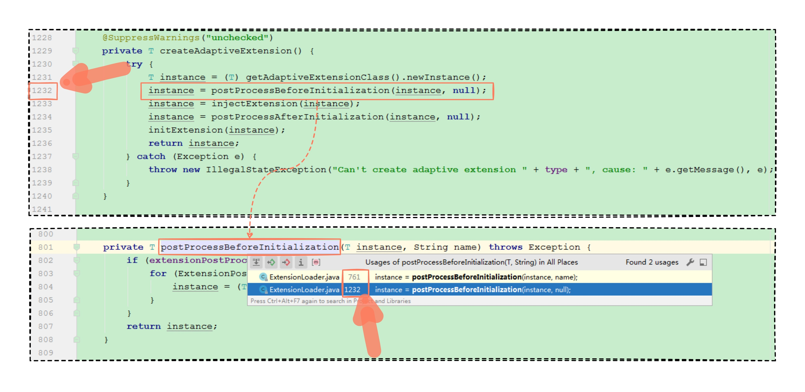
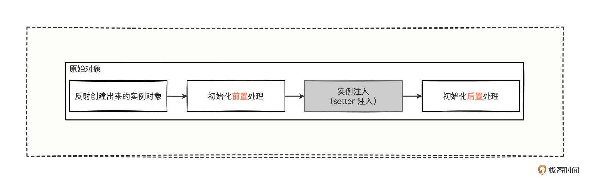
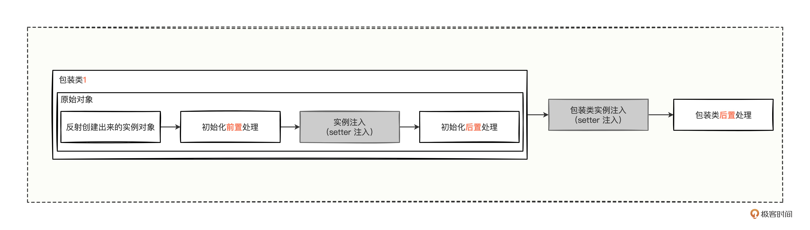
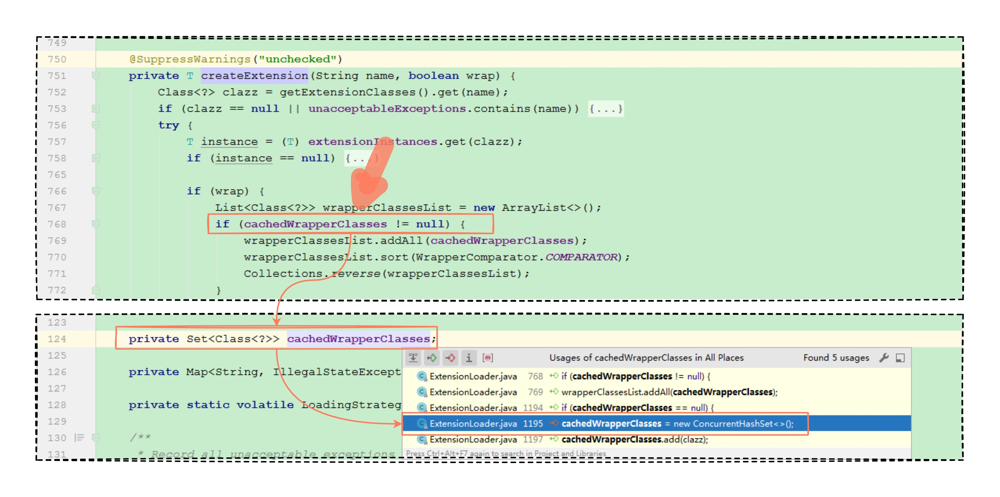
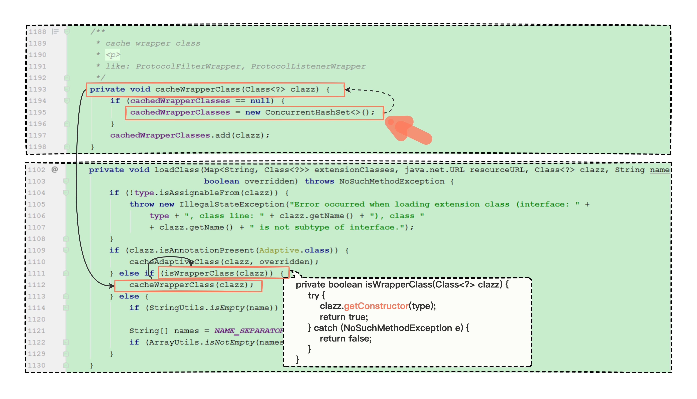
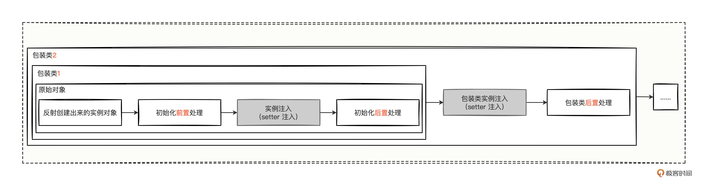
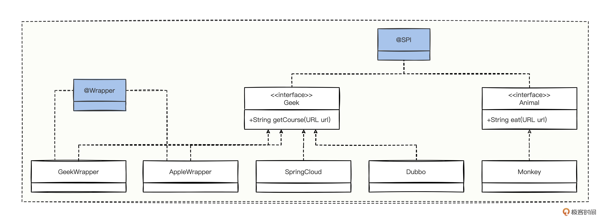

# 18｜实例注入：实例注入机制居然可以如此简单？
你好，我是何辉。今天我们深入研究Dubbo源码的第七篇，实例注入。

实例注入是什么？举个简单的例子，当类A中有一个类型的成员变量B，如果不做任何处理，我们在类A中使用成员变量B会出现空指针问题，但按照一定的规范约束定义成员变量B后，我们再次在类A中使用成员变量B时，就不会出现空指针了。

这种使用起来的感觉，就像只要按照规范定义变量，我们再使用这个变量的时候就是一个对象了，类A中的成员变量B，就像在使用前被偷偷注入了一个实例对象一样，使得我们无需关注对象的创建过程，按照规范定义变量就能轻松使用。

如果你用过 Spring 框架的实例注入功能，有两个技术知识点相信你一定印象深刻，那就是依赖注入和切面编程。依赖注入让我们在使用 @Autowired 和 @Resource 注解时，很容易拿到被底层创建好的实例对象，切面编程在使用 @Aspect 注解时，很容易实现切面思想（AOP）对公共逻辑进行横切处理，给日常开发带来了非常大的便利。

不过 Spring 框架再优秀，也不是万能的，为了解决各种特定场景问题，一些优秀框架应运而生，Dubbo 正是其中一款解决 RPC 调用的高性能框架。而Dubbo的实例注入源码也值得研究，很好地控制了实例对象的统一创建与规范化的注入。

那 Dubbo 的实例注入机制是怎样的？与Spring有哪些异同？我们开始今天的学习。

## **实现类是怎么实例化对象的？**

要研究 Dubbo 的实例注入机制，我们可以从使用对象入手，看看在源码层面，对象都从哪里创建出来的。

不过提到实例对象的创建，不知道你有没有回想起上一讲“ [Adaptive 适配](https://time.geekbang.org/column/article/620941)”中，我们分析创建自适应扩展点方法（createAdaptiveExtension），看到自适应扩展点实例对象被创建出来之后，还有一堆前置、注入、后置等逻辑处理，难道实例对象的创建跟这个有关么？

这里也再看一下我们跟踪过的 createAdaptiveExtension 方法的源码。

> // ExtensionLoader#createAdaptiveExtension
>
> // 创建自适应扩展点方法
>
> private T createAdaptiveExtension() {
>
>     try {
>
>         // 这一行从 newInstance 这个关键字便知道这行代码就是创建扩展点的核心代码
>
>         T instance = (T) getAdaptiveExtensionClass().newInstance();
>
>         // 这里针对创建出来的实例对象做的一些类似 Spring 的前置后置的方式处理
>
>         instance = postProcessBeforeInitialization(instance, null);
>
>         instance = injectExtension(instance);
>
>         instance = postProcessAfterInitialization(instance, null);
>
>         initExtension(instance);
>
>         return instance;
>
>     } catch (Exception e) {
>
>         throw new IllegalStateException("Can’t create adaptive extension " + type + ", cause: " + e.getMessage(), e);
>
>     }
>
> }

如果你能想到这段代码，说明对每行代码的研究很细致，这是个很好的学习习惯。不过，自适应扩展点对象的创建，算是 SPI 接口对象创建的一条特殊分支逻辑。因为，SPI 接口有很多实现类，将来被实例化后就有很多个实例对象，而自适应扩展点是众多实例化对象中的稍微特殊一点的对象。

**那其他普通的实现类是怎么实例化对象的呢？** 别急，先不看源码，我们试着来分析一下。

你看，自适应扩展点对象虽然有点特殊，但仍然是一个实例对象，实例对象创建出来还被前置、注入、后置等逻辑再次处理了一遍，特殊与普通有一定的相似性，连特殊对象都有这待遇，难道普通的实现类被实例化的时候就没这待遇么？

所以我们可以推测，普通实现类的实例化过程，应该和自适应扩展点对象差不多，可是怎么验证这个猜想呢？我们不妨从代码层面去仔细挖掘一下，看看源码层面有没有相似性的逻辑。

先顺着已知的代码看，发现创建自适应扩展点方法（createAdaptiveExtension）中有前置处理等逻辑，我们不如反向寻找下，看看这个前置的方法有没有被其他地方调用？ **一般，相似的功能点，源码层面大概率会进行抽象封装来共用代码，避免重复冗余代码，所以我们反向寻找，也是为了找到调用该方法的相似功能点。**

按照这个思路，我们认真反向排查一下：



还真发现有两个地方调用了，看对应的代码位置行数，1232 行落在创建自适应扩展点方法中，那另外的 761 行，想必就是普通实现类被实例化的地方了吧。我们进到 761 行看看。


发现了一些意想不到的情况，761 行位于一个 createExtension 方法中，翻译一下方法名就是创建扩展点的意思，我们结合方法入参看，看起来应该是给定一个扩展点名称，然后创建出对应的实现类对象。

从这里的代码看是这么回事，至于真实情况是不是，我们要验证一下，继续反向查找，看看又是谁调用了 createExtension 创建扩展点的方法。


从众多的调用来源中，站在使用者的角度来看，调用方是拿着 getExtension 方法，传入指定的扩展名，来拿对应的实现类，这不就是“SPI 机制”中 Dubbo SPI 获取指定实现类的写法么？拿到实现类就可以使用了。

> 图中还可以看到 synchronized 关键字包裹住了扩展点的创建，synchronized 是 JVM 为解决多线程并发竞争问题而设计的一个关键字，这说明 Dubbo 在创建指定扩展点的实现类时，充分考虑了线程安全的问题因素。

所以，我们刚才推测“createExtension 是普通实现类的实例化入口”是正确的，那就好办了，接下来，我们只需要认真研究，传入一个指定的扩展点名称究竟是怎么实例化的，就大概清楚实例的注入是怎么管理的了。

### 创建实例createExtension

话不多说，我们直接进入根据指定扩展点名称去创建扩展点实例对象的方法中（createExtension），看看源码是怎么实现的，我写了非常详细的注释：

```java
///////////////////////////////////////////////////
// 根据指定扩展点名称去创建扩展点实例对象
///////////////////////////////////////////////////
// org.apache.dubbo.common.extension.ExtensionLoader#createExtension
@SuppressWarnings("unchecked")
private T createExtension(String name, boolean wrap) {
    // getExtensionClasses 为当前 SPI 接口的所有实现类的类信息集合
    // 通过指定的扩展点名称 name 来获取与之对应的实现类类信息
    Class<?> clazz = getExtensionClasses().get(name);
    // 若找不到对应的扩展点，或者当初加载时扩展点有重复名称的话
    // 这里都会抛出查找异常
    if (clazz == null || unacceptableExceptions.contains(name)) {
        throw findException(name);
    }

    try {
        // extensionInstances 为当前 SPI 接口已经经过实例化的实例对象集合
        // 然后通过指定的扩展点名称看看有没有与之对应的已经曾经创建好的实例对象
        T instance = (T) extensionInstances.get(clazz);
        // 若找不到，说明没有缓存，从而则说明该扩展点名称也是首次使用
        if (instance == null) {
            // 通过并发 Map 的 putIfAbsent 方法以线程安全的形式，
            // 来保证该实现类只会创建一个实例对象，实例对象是反射方式创建出来的
            extensionInstances.putIfAbsent(clazz, createExtensionInstance(clazz));

            // putIfAbsent 执行完，只要不报错，那就说明指定扩展点名称的实现类创建成功了
            // 那么就继续把刚刚创建出来的实例对象再次 get 出来
            // 此时的 instance 应该称之为原始未经过初始化的裸体对象
            instance = (T) extensionInstances.get(clazz);

            // 初始化前置处理，即将原始的对象进行前置包装等处理
            instance = postProcessBeforeInitialization(instance, name);

            // 扩展点注入
            injectExtension(instance);

            // 初始化后置处理，即将已初始化实例化注入的对象进行后置包装等处理
            instance = postProcessAfterInitialization(instance, name);
        }

        // wrap 是否需要进行装饰器包装
        if (wrap) {
            List<Class<?>> wrapperClassesList = new ArrayList<>();
            // 看看是否有装饰器包装类，即实现类中单一参数的构造方法是不是 SPI 接口
            if (cachedWrapperClasses != null) {
                // 如果有装饰器包装类，那么就将该 SPI 接口中所有包装实现类进行排序
                wrapperClassesList.addAll(cachedWrapperClasses);
                wrapperClassesList.sort(WrapperComparator.COMPARATOR);
                Collections.reverse(wrapperClassesList);
            }
            if (CollectionUtils.isNotEmpty(wrapperClassesList)) {
                // 循环装饰器包装类，进行层层套娃包装
                for (Class<?> wrapperClass : wrapperClassesList) {
                    // 装饰器类上是否 Wrapper 注解
                    Wrapper wrapper = wrapperClass.getAnnotation(Wrapper.class);

                    // 1. 没有 wrapper 注解，需要进行包装
                    // 2. wrapper 中的 matches 字段值为空没有内容，需要进行包装
                    // 3. wrapper 中的 matches 字段值不为空并包含入参 name 值，并且 mismatches 字段值不包含 name 值，需要进行包装
                    // 4. 其他情况，可能就是瞎写乱配，导致无法进行包装之类的
                    boolean match = (wrapper == null) ||
                        ((ArrayUtils.isEmpty(wrapper.matches()) || ArrayUtils.contains(wrapper.matches(), name)) &&
                            !ArrayUtils.contains(wrapper.mismatches(), name));

                    // 如果匹配成功，则进行包装
                    if (match) {
                        // 针对包装的类再次进行实例注入
                        instance = injectExtension((T) wrapperClass.getConstructor(type).newInstance(instance));
                        // 针对包装类，同样进行后置处理
                        instance = postProcessAfterInitialization(instance, name);
                    }
                }
            }
        }

        // Warning: After an instance of Lifecycle is wrapped by cachedWrapperClasses, it may not still be Lifecycle instance, this application may not invoke the lifecycle.initialize hook.
        initExtension(instance);
        return instance;
    } catch (Throwable t) {
        throw new IllegalStateException("Extension instance (name: " + name + ", class: " +
            type + ") couldn't be instantiated: " + t.getMessage(), t);
    }
}

```

首先，每个扩展点名称都会对应一个 class 类信息，每个类信息都会对应一个实例对象，而且实例对象都会以线程安全的形式保存到缓存中。

刚反射创建出来的扩展点对象，都会经历前置初始化前置处理（postProcessBeforeInitialization）、注入扩展点（injectExtension）、初始化后置处理（postProcessAfterInitialization）三个阶段，经过三段处理的对象，我们暂且称为“原始对象”。



然后，根据传入的 wrap 变量，决定是否需要将原始对象再次进行包裹处理，若需要包裹，会将该 SPI 接口的所有包装类排序好，以套娃的形式，将原始对象层层包裹。而包装类上可以设置 @Wrapper 注解，结合注解有 3 种情况来决定是否需要包装：

- 无 @Wrapper 注解，则需要包装。
- 有 @Wrapper 注解，但是注解中的 matches 字段值为空，则需要包装。
- 有 @Wrapper 注解，但是注解中的 matches 字段值包含入参的扩展点名称，并且 mismatches 字段值不包含入参的扩展点名称，则需要包装。



### 拓展点对象的三个处理阶段

大致通读了创建扩展点的代码，你可能已经注意到了，刚反射创建出来的扩展点对象要经历的三个阶段应该挺重要的，毕竟一个刚反射出来的对象就像一个婴儿，个头没长全，没多大能力，关键得靠后续加工变成有能力的成年人。我们重点进入这 3 个方法。

先看第一个初始化前置处理的方法。

```java
///////////////////////////////////////////////////
// 初始化前置处理方法
///////////////////////////////////////////////////
// org.apache.dubbo.common.extension.ExtensionLoader#postProcessBeforeInitialization
private T postProcessBeforeInitialization(T instance, String name) throws Exception {
    // 先看看当前框架中有没有设置过后置处理器，有就循环处理一把
    if (extensionPostProcessors != null) {
        // 循环所有的后置处理器，依次调用初始化前置方法
        // 循环体中都会使用经过方法处理后的对象继续下一个循环处理，有点套娃的性质
        for (ExtensionPostProcessor processor : extensionPostProcessors) {
            instance = (T) processor.postProcessBeforeInitialization(instance, name);
        }
    }
    // 最终返回层层套娃之后的对象
    return instance;
}
                  ↓
///////////////////////////////////////////////////
// 扩展点后置处理器，包含两个方法，
// postProcessBeforeInitialization：初始化前置处理
// postProcessAfterInitialization：初始化后置处理
///////////////////////////////////////////////////
// org.apache.dubbo.common.extension.ExtensionPostProcessor
public interface ExtensionPostProcessor {
    // 初始化前置处理
    default Object postProcessBeforeInitialization(Object instance, String name) throws Exception {
        return instance;
    }
    // 初始化后置处理
    default Object postProcessAfterInitialization(Object instance, String name) throws Exception {
        return instance;
    }
}

```

首先映入眼帘的就是一层 for 循环，循环之前先看看有没有后置处理器列表，有的话就直接进入循环体。循环体的逻辑也很简单， **循环调用每个后置处理器的 postProcessBeforeInitialization 方法，把每一次循环的返参结果放到下一次循环的入参中去**，层层套娃，最终返回套娃之后的对象。

你有没有感觉这段代码的形式有点眼熟。没错，其实 Spring 框架中，针对 Bean 定义会使用 BeanFactoryPostProcessor 进行前后修改属性处理，针对 Bean 对象会使用 BeanPostProcessor 进行前后代理包装处理，和Dubbo这里的手法如出一辙，不得不感慨源码设计者在设计框架时花的心思，为框架的灵活扩展奠定了基础。

好，说回来，了解了初始化前置处理的逻辑，如何对原始对象进行后置处理的逻辑，对你来说应该很简单了，这里不再展开讲。

我们直接进入第三个处理——注入扩展点（injectExtension），研究下到底是怎么注入扩展点的。

```java
///////////////////////////////////////////////////
// 注入扩展点的方法
///////////////////////////////////////////////////
// org.apache.dubbo.common.extension.ExtensionLoader#injectExtension
private T injectExtension(T instance) {
    if (injector == null) {
        return instance;
    }
    try {
        // 拿到实例对象的所有方法集合，然后进行循环处理
        for (Method method : instance.getClass().getMethods()) {
            // 判断方法是否是 set 方法，有 3 个条件：
            // 1. 方法必须是 public 公有修饰属性
            // 2. 方法名称必须以 set 三个字母开头
            // 3. 方法的入参个数必须是 1 个
            // 如果这 3 个条件都不满足的话，那就直接 continue 不做任何处理
            if (!isSetter(method)) {
                continue;
            }
            // 如果发现方法上有 @DisableInject 注解的话，则也不做任何处理
            if (method.isAnnotationPresent(DisableInject.class)) {
                continue;
            }
            // 获取方法参数中第 0 个参数的类型
            // （注意：前面通过 isSetter 已经明确方法的入参只能有 1 个）
            Class<?> pt = method.getParameterTypes()[0];
            // 如果参数类型是基本类型的话，那么也不做任何处理了
            if (ReflectUtils.isPrimitives(pt)) {
                continue;
            }
            // 接下来，能走到这里来，则说明都是需要处理的方法
            try {
                // 获取方法的属性，什么叫属性呢？
                // 比如方法名称为 setVersion 的话，那么就会返回 version 内容
                // 比如方法名称小于 3 个字符的话，那么就返回空字符串
                String property = getSetterProperty(method);
                // 然后根据【参数类型】+【扩展点名称】直接从容器中找到对应的实例对象
                // 所以可以反映出，通过 set 方法就能直接从容器中找到对应的实例并赋值上
                Object object = injector.getInstance(pt, property);
                // 将拿到的实例对象通过反射方式赋值到该 method 方法中的成员变量
                if (object != null) {
                    method.invoke(instance, object);
                }
            } catch (Exception e) {
                logger.error("Failed to inject via method " + method.getName()
                    + " of interface " + type.getName() + ": " + e.getMessage(), e);
            }
        }
    } catch (Exception e) {
        logger.error(e.getMessage(), e);
    }
    return instance;
}
                  ↓
///////////////////////////////////////////////////
// Object object = injector.getInstance(pt, property); 方法的实现逻辑
///////////////////////////////////////////////////
// org.apache.dubbo.common.extension.inject.AdaptiveExtensionInjector#getInstance
@Override
public <T> T getInstance(Class<T> type, String name) {
    // 循环所有的扩展点注入器，每个注入器可以粗浅的理解为一个容器
    // 那也就是说，循环每种容器，看看能不能根据类型加名字，找到对应的实例对象
    for (ExtensionInjector injector : injectors) {
        // 循环每种容器，从容器中根据类型加名字获取实例对象
        T extension = injector.getInstance(type, name);
        // 一旦获取到了的话，那就直接返回即可，不用再循环其他容器了
        if (extension != null) {
            return extension;
        }
    }
    return null;
}
                  ↓
///////////////////////////////////////////////////
// 寻找 injectors 变量被赋值的方法，
// 看到初始化 initialize 的话，想都不用想了，肯定在某个初始化环境被调用的
///////////////////////////////////////////////////
// org.apache.dubbo.common.extension.inject.AdaptiveExtensionInjector#initialize
@Override
public void initialize() throws IllegalStateException {
    // 获取【扩展点注入器】的加载器
    ExtensionLoader<ExtensionInjector> loader = extensionAccessor.getExtensionLoader(ExtensionInjector.class);
    List<ExtensionInjector> list = new ArrayList<ExtensionInjector>();
    // 从加载器中拿出所有的可被使用的注册器实现类
    for (String name : loader.getSupportedExtensions()) {
        list.add(loader.getExtension(name));
    }
    // 然后通过不可变集合包装起来，意味着不允许别人对注册器实现类进行任何修改
    injectors = Collections.unmodifiableList(list);
}

```

- 首先，一上来就是个大的 for 循环，循环的目标是实例对象的所有方法列表。

循环体的逻辑大体是这样的，先判断方法，如果不是 setter 方法，不做处理，如果被 @DisableInject 注解标记，也不做处理，方法的参数如果是基本类型，还是不做任何处理。其中，判断是否是 setter 方法的规则，是这样的：

```java
# 符合 setter 方法的条件
1. 方法必须是 public 公有修饰属性
2. 方法名称必须以 set 三个字母开头
3. 方法的入参个数必须是 1 个

```

- 紧接着，通过 getSetterProperty 这段代码，获取方法对应的扩展点名称。获取规则是先去掉方法名前面的 set 三个字符，把剩下的首写字母改为小写后就是方法的属性名。
- 然后，拿着“参数类型+扩展点名称”，从所有的扩展点注入器中寻找对应的实例对象，通过反射赋值到该方法上。

就这样，我们就完成了循环体中的其中一个方法的实例注入。

通过研读注入扩展点方法，我们发现了一个重大惊喜—— **注入的关键点，使用 setter 方法就能直接从容器中找到对应的实例，完成实例注入。**

好，createExtension 中的三个处理方法我们搞清楚了，继续看后面的逻辑，根据传入的 wrap 变量，决定是否需要将原始对象再次进行包裹处理。

关键就是这个 cachedWrapperClasses 成员变量，它是怎么来的呢，又是在哪里被赋值的呢？

对现在的你来说相信这不是什么难题，还是逆向追踪，看这个变量在哪个小方法里面赋值的，如果小方法看不出，就继续逆向寻找小方法的调用方，总能理清思路，最终搞清楚 cachedWrapperClasses 变量怎么被赋值的。

我们继续开启源码逆向查找。





一直找到了被赋值的地方，我们可以发现实现类构造方法的入参是对应的 SPI 接口，那么这样的实现类就是一个包装类。答案水落石出，有没有觉得其实看源码也不是很难。

我们简单小结一下，创建扩展点对象的时候， **不但会通过 setter 方法进行实例注入，而且还会通过包装类层层包裹**，就像这样。



## Dubbo 实例注入验证

了解了实例注入的核心原理，我们还是得现学现用，验证下通过源码推断的结论到底是不是对的。老规矩，先设计一下验证的大体代码结构：



先定义一个 Geek 接口，有 4 个实现类，分别是 Dubbo、SpringCloud 、AppleWrapper 和 GeekWrapper，但是 AppleWrapper、GeekWrapper 包装类上有 @Wrapper 注解。然后定义了一个 Animal 接口，只有 1 个实现类 Monkey。

我们需要验证3个功能点：

- 功能点一：通过 setter 可以实现指定实现类的注入。
- 功能点二：通过设计一个构造方法只有一个入参，且入参对应的 SPI 接口，可以把实现类变成包装类。比如这样：

```java
public class GeekWrapper implements Geek {
    private Geek geek;
    // GeekWrapper 的带参构造方法，只不过参数是当前实现类对应的 SPI 接口（Geek）
    public GeekWrapper(Geek geek) {
        this.geek = geek;
    }
    // 省略其他部分代码...
}

```

- 功能点三：@Wrapper 注解中的 mismatches 是可以剔除一些扩展点名称的，比如这样：

```java
@Wrapper(order = 10, mismatches = {"springcloud"})

```

设计完成，我们编写代码。

```java
///////////////////////////////////////////////////
// SPI 接口：Geek，默认的扩展点实现类是 Dubbo 实现类
// 并且该接口的 getCourse 方法上有一个 @Adaptive 注解
///////////////////////////////////////////////////
@SPI("dubbo")
public interface Geek {
    @Adaptive
    String getCourse(URL url);
}
///////////////////////////////////////////////////
// Dubbo 实现类
///////////////////////////////////////////////////
public class Dubbo implements Geek {
    @Override
    public String getCourse(URL url) {
        return "Dubbo实战进阶课程";
    }
}
///////////////////////////////////////////////////
// SpringCloud 实现类
///////////////////////////////////////////////////
public class SpringCloud implements Geek {
    @Override
    public String getCourse(URL url) {
        return "SpringCloud入门课程100集";
    }
}
///////////////////////////////////////////////////
// AppleWrapper 实现类，并且该实现类上有一个 @Wrapper 注解, order 越小越限执行
///////////////////////////////////////////////////
@Wrapper(order = 1)
public class AppleWrapper implements Geek {
    private Geek geek;
    public AppleWrapper(Geek geek) {
        this.geek = geek;
    }
    @Override
    public String getCourse(URL url) {
        return "【课程AppleWrapper前...】" + geek.getCourse(url) + "【课程AppleWrapper后...】";
    }
}
///////////////////////////////////////////////////
// GeekWrapper 实现类，并且该实现类上有一个 @Wrapper 注解,
// order 越小越限执行，所以 GeekWrapper 会比 AppleWrapper 后执行
// 然后还有一个 mismatches 属性为 springcloud
///////////////////////////////////////////////////
@Wrapper(order = 10, mismatches = {"springcloud"})
public class GeekWrapper implements Geek {
    private Geek geek;
    private Animal monkey;
    public void setMonkey(Animal monkey){
        this.monkey = monkey;
    }
    public GeekWrapper(Geek geek) {
        this.geek = geek;
    }
    @Override
    public String getCourse(URL url) {
        return "【课程GeekWrapper前...】" + geek.getCourse(url) + "【课程GeekWrapper后...】||【"+monkey.eat(url)+"】";
    }
}

///////////////////////////////////////////////////
// SPI 接口：Animal ，默认的扩展点实现类是 Monkey 实现类
// 并且该接口的 eat 方法上有一个 @Adaptive 注解
///////////////////////////////////////////////////
@SPI("monkey")
public interface Animal {
    @Adaptive
    String eat(URL url);
}
///////////////////////////////////////////////////
// Dubbo 实现类
///////////////////////////////////////////////////
public class Monkey implements Animal {
    @Override
    public String eat(URL url) {
        return "猴子吃香蕉";
    }
}
///////////////////////////////////////////////////
// 资源目录文件
// 路径为：/META-INF/dubbo/com.hmilyylimh.cloud.inject.spi.Geek
// 注意：GeekWrapper、AppleWrapper 两个包装类是可以不用写别名的
///////////////////////////////////////////////////
dubbo=com.hmilyylimh.cloud.inject.spi.Dubbo
springcloud=com.hmilyylimh.cloud.inject.spi.SpringCloud
com.hmilyylimh.cloud.inject.spi.GeekWrapper
com.hmilyylimh.cloud.inject.spi.AppleWrapper

///////////////////////////////////////////////////
// 资源目录文件
// 路径为：/META-INF/dubbo/com.hmilyylimh.cloud.inject.spi.Animal
///////////////////////////////////////////////////
monkey=com.hmilyylimh.cloud.inject.spi.Monkey

///////////////////////////////////////////////////
// 启动类，验证代码用的
///////////////////////////////////////////////////
public static void main(String[] args) {
    ApplicationModel applicationModel = ApplicationModel.defaultModel();
    // 通过 Geek 接口获取指定像 扩展点加载器
    ExtensionLoader<Geek> extensionLoader = applicationModel.getExtensionLoader(Geek.class);
    Geek geek = extensionLoader.getAdaptiveExtension();
    System.out.println("日志1：【指定的 geek=springcloud 的情况】动态获取结果为: "
            + geek.getCourse(URL.valueOf("xyz://127.0.0.1/?geek=springcloud")));
    System.out.println("日志2：【指定的 geek=dubbo 的情况】动态获取结果为: "
            + geek.getCourse(URL.valueOf("xyz://127.0.0.1/?geek=dubbo")));
    System.out.println("日志3：【不指定的 geek 走默认情况】动态获取结果为: "
            + geek.getCourse(URL.valueOf("xyz://127.0.0.1/")));
}

```

运行一下，看打印结果。

```java
日志1：【指定的 geek=springcloud 的情况】动态获取结果为: 【课程AppleWrapper前...】SpringCloud入门课程100集【课程AppleWrapper后...】
日志2：【指定的 geek=dubbo 的情况】动态获取结果为: 【课程AppleWrapper前...】【课程GeekWrapper前...】Dubbo实战进阶课程【课程GeekWrapper后...】||【猴子吃香蕉】【课程AppleWrapper后...】
日志3：【不指定的 geek 走默认情况】动态获取结果为: 【课程AppleWrapper前...】【课程GeekWrapper前...】Dubbo实战进阶课程【课程GeekWrapper后...】||【猴子吃香蕉】【课程AppleWrapper后...】

```

日志1，指定 geek=springcloud 的时候，我们发现 GeekWrapper 并没有执行，说明当@Wrapper 中的 mismatches 属性值，包含入参给定的扩展名称，那么这个 GeekWrapper 就不会触发执行。

日志2，指定 geek=dubbo 的时候，两个包装器都执行了，说明构造方法确实注入成功了，构造方法的注入让实现类变成了一个包装类。

日志2和3，发现了“猴子吃香蕉”的文案，说明在 GeekWrapper 中 setter 注入也成功了。另外，还可以看到 AppleWrapper 总是在 GeekWrapper 之前打印执行，说明 @Wrapper 注解中的 order 属性值越小就越先执行，并且包装类还有一种类似切面思想的功能，在方法调用之前、之后进行额外的业务逻辑处理。

最后，从资源目录 SPI 文件内容中可以发现，包装类不需要设置别名，也可以被正确无误地识别出来。

## 实例注入思想的反思

通过实例注入的源码分析与实践验证，相信你应该对实例注入已经非常熟悉了。

Spring 存在实例注入，Dubbo 也存在实例注入，它们针对实例进行注入的思想是相通的。都是框架拿到对象时，发现里面有很多字段值是空的，或者有很多设置属性的方法没有被调用，框架就需要将对象里面的字段值赋值。

但是，要给哪些字段赋值（或者要调用哪些设置属性的方法）呢？这是一个重要考量的关键点了，也因此衍生出框架需要借助一个标识，一旦实例对象针对某个字段打了标识，框架就知道这个字段要自动注入（或者实例对象中的某些方法按照一定的规范约束编写好后，框架就知道这些符合规范的字段或方法要被处理）。就这样，通过简简单单的约束规范打个标识，框架就完成了实例注入的大工程。

这样的思想落地到框架后，一来是能很好地管理当前框架中产生的对象，二来可以让开发者在编写代码层面非常简单地拿到对象去使用，你在 Spring 和 Dubbo 框架中使用对象时，才会觉得非常简单。

Spring 和 Dubbo 在实例注入层面的区别，比较细微，我简单说下。

Spring 支持三种方式注入，字段属性注入、setter 方法注入、构造方法注入。Dubbo 的注入方式只有 setter 方法注入和构造方法注入这2种，并且 Dubbo 的构造方法注入还有局限性，构造方法的入参个数只能是一个，且入参类型必须为当前实现类对应的 SPI 接口类型。

## 总结

今天，我们从学过的获取自适应扩展点实例开始，反思既然有特殊的实例化操作，想必也有普通的实例化操作，为后续的源码反向跟踪撕开了一道口子，找到了 createExtension 创建普通扩展点的核心源码。

总结下实例注入的 5 个关键结论。

- 每个合法的扩展点名称都会对应一个 Class 类信息，并且都是以线程安全的形式创建了一个与之对应的实例对象。
- 通过反射创建出来的原始实现类对象，最终都会经过初始化前置处理、实例注入、初始化后置处理，再叠加层层包装类套娃式处理后，变成了一个有血有肉的复杂对象。
- 实现类可以设置 @Wrapper 注解，注解中的 order 属性值越小则越先执行，mismatches 属性值包含入参给定的扩展点名称时，那么该扩展点的方法不会触发执行。
- 通过 setter 方式可以进行实例注入，通过构造方法且构造方法的入参是SPI接口，可以将实现类变成包装类，而且包装类能提供轻量级的切面编程的能力。
- 资源目录中的 SPI 文件内容，包装类不需要设置别名，就可以被 Dubbo 框架智能识别为包装类。

### 思考题

留个作业给你，今天的代码案例中有个 AppleWrapper 实现类，如果利用 setter 方式在里面注入一个 SpringCloud 实现类，然后在 AppleWrapper.getCourse 方法中调用刚刚注入的 SpringCloud 实现类的 getCourse 方法，会发生什么？为什么呢？

期待看到你的思考，如果觉得今天的内容对你有帮助，也欢迎分享给身边的朋友一起讨论。我们下一讲见。

### 17 思考题参考

上一期留了个作业，研究下 @Adaptive 注解中的 value 字段是干什么用的，然后怎么使用。

想解答该问题，其实也比较简单，虽然我们不知道这个 value 字段到底有什么，但是我们可以看看 value 字段在源码中是如何解释的，进入 Adaptive 中。

```java
@Documented
@Retention(RetentionPolicy.RUNTIME)
@Target({ElementType.TYPE, ElementType.METHOD})
public @interface Adaptive {
    /**
     * Decide which target extension to be injected. The name of the target extension is decided by the parameter passed
     * in the URL, and the parameter names are given by this method.
     * <p>
     * If the specified parameters are not found from {@link URL}, then the default extension will be used for
     * dependency injection (specified in its interface's {@link SPI}).
     * <p>
     * For example, given <code>String[] {"key1", "key2"}</code>:
     * <ol>
     * <li>find parameter 'key1' in URL, use its value as the extension's name</li>
     * <li>try 'key2' for extension's name if 'key1' is not found (or its value is empty) in URL</li>
     * <li>use default extension if 'key2' doesn't exist either</li>
     * <li>otherwise, throw {@link IllegalStateException}</li>
     * </ol>
     * If the parameter names are empty, then a default parameter name is generated from interface's
     * class name with the rule: divide classname from capital char into several parts, and separate the parts with
     * dot '.', for example, for {@code org.apache.dubbo.xxx.YyyInvokerWrapper}, the generated name is
     * <code>String[] {"yyy.invoker.wrapper"}</code>.
     *
     * @return parameter names in URL
     */
    String[] value() default {};
}

```

从源码中 value() 方法的注释上可以得出 3 点。

- 第一，value 字段在 @Adaptive 注解中，可以这么写，比如：@Adaptive({“custom”, “geek”})。
- 第二，value 中的 key1 如果在 URL 找到，就使用 key1 对应的值做为扩展点的名称，也就是传入 ExtensionLoader.getExtension 方法中的入参值。
- 第三，value 中假设是 {“key1”, “key2”} 这样的格式，若 key1 在 URL 中不存在，则继续使用 key2 继续从 URL 找，若 key2 在 URL 中也不存在，则使用 SPI 接口中默认的扩展点。

从 3 个结论中，得知 value 参数可以这么使用就非常好办了，接着我们修改下代码。

```java
///////////////////////////////////////////////////
// SPI 接口：Geek，默认的扩展点实现类是 Dubbo 实现类
// 并且该接口的 getCourse 方法上有一个 @Adaptive 注解
// 然后添加了一个 getCourse2 方法并填充了注解中的值
///////////////////////////////////////////////////
@SPI("dubbo")
public interface Geek {
    @Adaptive
    String getCourse(URL url);

    @Adaptive({"custom", "geek"})
    String getCourse2(URL url);
}

///////////////////////////////////////////////////
// 启动类，验证代码用的
///////////////////////////////////////////////////
public static void main(String[] args) {
    ApplicationModel applicationModel = ApplicationModel.defaultModel();
    // 通过 Geek 接口获取指定像 扩展点加载器
    ExtensionLoader<Geek> extensionLoader = applicationModel.getExtensionLoader(Geek.class);

    Geek geek = extensionLoader.getAdaptiveExtension();
    System.out.println("【custom 指定的 dubbo 的情况】动态获取结果为: "
            + geek.getCourse2(URL.valueOf("xyz://127.0.0.1/?geek=springcloud&custom=dubbo")));
    System.out.println("【custom 指定的 springcloud 的情况，但没有 custom 参数，然后直接使用 geek=dubbo 参数】动态获取结果为: "
            + geek.getCourse2(URL.valueOf("xyz://127.0.0.1/?geek=dubbo")));
    System.out.println("【custom、geek 参数都没有指定的话】动态获取结果为: "
            + geek.getCourse2(URL.valueOf("xyz://127.0.0.1/")));
}

```

按照 value = {“custom”, “geek”} 这样的风格，设置了三种情况。

- 情况一，custom 参数有值。
- 情况二，custom 参数不存在，geek 参数有值。
- 情况三，custom 参数不存在，geek 参数也不存在。

运行 main 方法得出。

```java
【custom 指定的 dubbo 的情况】动态获取结果为: Dubbo实战进阶课程(2)
【custom 指定的 springcloud 的情况，但没有 custom 参数，然后直接使用 geek=dubbo 参数】动态获取结果为: Dubbo实战进阶课程(2)
【custom、geek 参数都没有指定的话】动态获取结果为: Dubbo实战进阶课程(2)

```

从运行的结果来看，也完全符合刚刚的从英文注释信息中得到的结论。