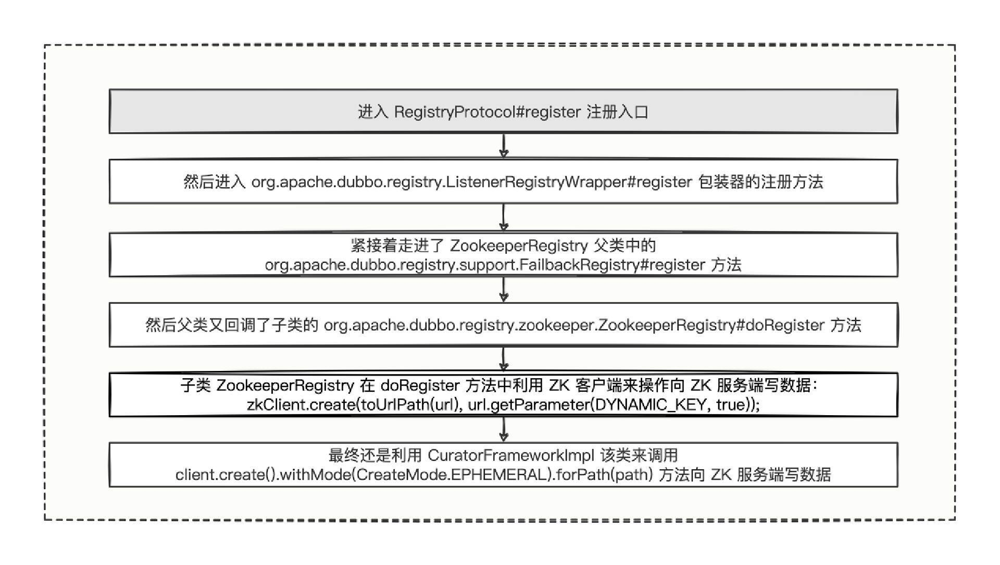

# 19｜发布流程：带你一窥服务发布的三个重要环节
你好，我是何辉。今天我们深入研究Dubbo源码的第八篇，发布流程。

提到发布，还记得在“ [温故知新](https://time.geekbang.org/column/article/611355)”中学过的那张Dubbo总体架构示意图么：


我们回顾和发布有关的环节，第 ① 步编写提供方的 XML 配置文件，服务的发布首先需要进行一系列的配置，配置好后，可以通过 dubbo:service 标签进行服务的导出与注册，然后，在第 ③ 步中，提供方可以通过设置 dubbo.application.register-mode 属性来自由控制服务的注册方式。

总的来说，发布的大致流程就 3 个环节“ **配置 -> 导出 -\> 注册**”，那你知道每个环节的机制究竟是什么样的么？我们今天就来解决这个问题。

怎么探索呢？在编写提供方时，我们都会给即将导出的服务上面添加一个 @DubboService 注解，那我们就从这个注解开始，首先逆向找到 @DubboService 中这些配置去哪里了，然后在配置被使用的地方，再看看能不能发现导出服务的核心代码，顺着导出逻辑，探究服务注册的核心原理。

要特别说明的是，今天大部分时间都会在讲源码，可能会比较枯燥，但不用担心，我会尽量讲的简单易懂，而且源码的分析流程你掌握透了，以后分析问题和框架扩展会如有神助。

## 配置

我们开始吧，先来简单看看提供方的一段代码。

```java
///////////////////////////////////////////////////
// 提供方应用工程的启动类
///////////////////////////////////////////////////
// 启动Dubbo框架的注解
@EnableDubbo
// SpringBoot应用的一键式启动注解
@SpringBootApplication
public class Dubbo19DubboDeployProviderApplication {
    public static void main(String[] args) {
        // 调用最为普通常见的应用启动API
        SpringApplication.run(Dubbo19DubboDeployProviderApplication.class, args);
        // 启动成功后打印一条日志
        System.out.println("【【【【【【 Dubbo19DubboDeployProviderApplication 】】】】】】已启动.");
    }
}
///////////////////////////////////////////////////
// 提供方应用工程的启动配置
///////////////////////////////////////////////////
@Configuration
public class DeployProviderConfig {
    // 提供者的应用服务名称
    @Bean
    public ApplicationConfig applicationConfig() {
        return new ApplicationConfig("dubbo-19-dubbo-deploy-provider");
    }
    // 注册中心的地址，通过 address 填写的地址提供方就可以联系上 zk 服务
    @Bean
    public RegistryConfig registryConfig() {
        return new RegistryConfig("zookeeper://127.0.0.1:2181");
    }
    // 提供者需要暴露服务的协议，提供者需要暴露服务的端口
    @Bean
    public ProtocolConfig protocolConfig(){
        return new ProtocolConfig("dubbo", 28190);
    }
}
///////////////////////////////////////////////////
// 提供方应用工程的一个DemoFacade服务
///////////////////////////////////////////////////
@Component
@DubboService(timeout = 8888)
public class DemoFacadeImpl implements DemoFacade {
    @Override
    public String sayHello(String name) {
        String result = String.format("Hello %s, I'm in 'dubbo-19-dubbo-deploy-provider.", name);
        System.out.println(result);
        return result;
    }
}
///////////////////////////////////////////////////
// 资源目录文件
// 路径为：/dubbo.properties
// 只进行接口级别注册
///////////////////////////////////////////////////
dubbo.application.register-mode=interface

```

这段代码非常普通，在启动类上添加 @EnableDubbo 和 @SpringBootApplication 两个注解。接着，为提供方启动添加一个启动配置类，配置类中设置好应用服务名称、注册中心地址、暴露协议。最后，编写一个DemoFacade服务，在 dubbo.properties 中设置提供方使用接口进行注册。

看完代码，我们正式进入逆向寻找环节。

在“ [泛化调用](https://time.geekbang.org/column/article/613308)”中，我们通过 @DubboReference 注解，找到了泛化调用的核心关键类，今天我们按照同样的配方， **先看看 @DubboService 注解会被哪些调用方使用，然后从这些调用方的类名中找到一个大概率会被调用的类，最后深挖一下代码细节，看看能发现哪些宝藏。**

好，第一步，查看 DubboService.class。


可以发现源码中有 3 个调用方，不过，我们该细看哪个呢？

这里我教你一个小技巧，发现多个调用方时，可以从调用方归属的类名看，哪个类名跟需要寻找的内容密切相关，我们就进入哪个细看。

这里，我们要找的是注解被使用的地方，而调用方②对应的类名，正好含有 Annotation 注解这个单词，我们就进入调用方②看个究竟。


可以发现 @DubboService 注解，放在一个叫做 serviceAnnotationTypes 变量名的列表中，不过，好在该变量是被 private 私有属性修饰的，于是就继续查这个变量，发现它也被 3 个地方调用了。

针对这 3 个调用方的方法名，我们大致看下，199 行被一个扫描服务列表（scanServiceBeans）的方法调用，358 行被一个查找服务注解（findServiceAnnotation）的方法调用，527 行被一个获取服务注解属性（getServiceAnnotationAttributes）的方法调用。

从 3 个方法名的功能来看，扫描服务列表的功能更重要，我们深入查看这个，我展示了关键源码。

```java
// org.apache.dubbo.config.spring.beans.factory.annotation.ServiceAnnotationPostProcessor#scanServiceBeans
private void scanServiceBeans(Set<String> packagesToScan, BeanDefinitionRegistry registry) {
    // 省略其他部分代码...

    // 创建一个扫描器来扫描 Dubbo 路径下的所有 Bean 定义
    DubboClassPathBeanDefinitionScanner scanner =
            new DubboClassPathBeanDefinitionScanner(registry, environment, resourceLoader);
    // 省略其他部分代码...
    for (String packageToScan : packagesToScan) {
        // 省略其他部分代码...

        // 扫描给定的包名，其实也就是扫描 com.hmilyylimh.cloud.deploy 路径
        // 扫描那些属于 serviceAnnotationTypes 注解类型的 Bean 定义
        scanner.scan(packageToScan);
        // Finds all BeanDefinitionHolders of @Service whether @ComponentScan scans or not.
        Set<BeanDefinitionHolder> beanDefinitionHolders =
                findServiceBeanDefinitionHolders(scanner, packageToScan, registry, beanNameGenerator);
        if (!CollectionUtils.isEmpty(beanDefinitionHolders)) {
            // 省略其他部分代码...
            // 处理扫描到的 Bean 定义对象集合
            for (BeanDefinitionHolder beanDefinitionHolder : beanDefinitionHolders) {
                // 处理单个 Bean 定义对象
                processScannedBeanDefinition(beanDefinitionHolder, registry, scanner);
                servicePackagesHolder.addScannedClass(beanDefinitionHolder.getBeanDefinition().getBeanClassName());
            }
        } else {
            // 省略其他部分代码...
        }
        servicePackagesHolder.addScannedPackage(packageToScan);
    }
}

```

从扫描服务列表的方法中，可以发现 Dubbo 框架在服务注解这个后置处理器（ServiceAnnotationPostProcessor）中，利用扫描器，把含有 @DubboService 注解的类对应的 Bean 定义收集到了一块，然后逐个针对 Bean 定义进行了处理。

因此，我们可以推断出一定对 Bean 定义做了些事情，那我们就继续进入处理扫描到的 Bean 定义方法。

```java
// ServiceAnnotationPostProcessor#processScannedBeanDefinition
private void processScannedBeanDefinition(BeanDefinitionHolder beanDefinitionHolder, BeanDefinitionRegistry registry,
                                          DubboClassPathBeanDefinitionScanner scanner) {
    // 从 Bean 定义中找到对应的 Dubbo 接口服务类信息
    // 即：beanClass = com.hmilyylimh.cloud.deploy.demo.DemoFacadeImpl 类信息
    Class<?> beanClass = resolveClass(beanDefinitionHolder);
    // 从 beanClass 中找到含有 @DubboService 注解的对象
    // 准确来说，应该是查找 serviceAnnotationTypes 列表中有值的注解，取出找到的第一个
    Annotation service = findServiceAnnotation(beanClass);
    // 从刚刚找出的 service 注解对象中搜刮出注解属性值
    // @DubboService 中配置的 timeout = 8888 属性就会存在于 serviceAnnotationAttributes 变量中
    Map<String, Object> serviceAnnotationAttributes = AnnotationUtils.getAttributes(service, true);

    // 找到对应的服务接口名称
    // 即：serviceInterface = com.hmilyylimh.cloud.facade.demo.DemoFacade
    String serviceInterface = resolveInterfaceName(serviceAnnotationAttributes, beanClass);
    // annotatedServiceBeanName = demoFacadeImpl
    String annotatedServiceBeanName = beanDefinitionHolder.getBeanName();

    // 生成 ServiceBean 的 beanName
    String beanName = generateServiceBeanName(serviceAnnotationAttributes, serviceInterface);
    // 重新根据相关参数构建出一个新的 beanClass = ServiceBean.class 类型的 Bean 定义
    AbstractBeanDefinition serviceBeanDefinition =
            buildServiceBeanDefinition(serviceAnnotationAttributes, serviceInterface, annotatedServiceBeanName);
    // 然后将构建出来的 Bean 定义注册到 Spring 的容器中，等着后续的实例化操作
    registerServiceBeanDefinition(beanName, serviceBeanDefinition, serviceInterface);
}

```

在这段逻辑中，我们有了新发现，在处理 DemoFacadeImpl 的 Bean 定义时，将 DemoFacadeImpl 类上 @DubboService 注解中的属性、服务接口名称提取了出来，然后构建出了一个叫做 ServiceBean 类型的 Bean 定义，并注册到了 Spring 容器中。

如果你对 Spring 的 Bean 定义有了解，想必也想到了，Dubbo 大概是在干这么一件事情。

- 利用扫描器，把含有 @DubboService 注解的类扫描出来，得到一堆 Bean 定义集合。
- 循环扫描出来的 Bean 定义集合，在循环体中，从已扫描的 Bean 定义中，提取注解属性和服务接口名，然后创建一个新的 ServiceBean 类型的 Bean 定义。
- 将来，这个新 Bean 定义在实例化后被使用时，一定会触发调用 ServiceBean 类或父类中的一些 public 方法。


这个猜想是否正确呢？我们验证一下。

再次进入 ServiceBean 方法，没发现啥异样，然后进入父类 ServiceConfig ，发现了一个叫做 export 单词的公开方法，仔细瞧瞧。

```java
///////////////////////////////////////////////////
// ServiceConfig.export 服务接口导出的方法
///////////////////////////////////////////////////
public void export() {
    // 如果已导出的话，则不再处理导出逻辑
    if (this.exported) {
        return;
    }
    // 省略其他部分代码...
    // synchronized 保证线程安全，即只允许导出有且仅有一次
    synchronized (this) {
        // 再次检测，如果已导出的话，则不再处理导出逻辑
        if (this.exported) {
            return;
        }
        // Dubbo Config 属性重写
        if (!this.isRefreshed()) {
            this.refresh();
        }
        if (this.shouldExport()) {
            this.init();
            // 是否有设置延迟 delay 导出属性
            if (shouldDelay()) {
                doDelayExport();
            } else {
                // 导出的核心逻辑
                doExport();
            }
        }
    }
}

```

一看到 export 方法，相信你对整体流程的配置转移已经了然于胸了。

我们在提供方代码中编写的 @DubboService 注解，用来标识 DemoFacadeImpl 是一个 Dubbo 接口服务，然后，在 Spring 扫描 Bean 定义环节，被 Dubbo 的扫描器识别到了拥有 @DubboService 注解的所有的 Bean 定义，并且，再次创建一个新的 ServiceBean 类型的 Bean 定义。

从此，DemoFacadeImpl 中 @DubboService 注解的所有配置，就全部转移到了 ServiceBean 的 Bean 定义中，而在某个环节，ServiceBean 又会被触发执行导出方法，就这样，我们编写的配置就会跟随导出方法走后续逻辑了。

如果一路看下来有点头晕，也没关系，我总结了一下逆向排查的查找流程。


## 导出

现在，你应该知道 @DubboService 注解中的配置怎么嫁接到了 ServiceBean 上了吧，第一步“配置”环节的源码我们就学好了，接下来看第二步“导出”，走进 doExport 核心导出逻辑的大门。

看之前，我再教给你一个小技巧，像这种以 do 单词开头的方法名，一般是这个功能的核心处理业务逻辑，所以，当你看到 export 后又紧接着 doExport，可以毫不犹豫地进入 doExport 方法中细看。

好，我们进入 doExport 看看吧。

```java
// 单个接口服务的导出方法，比如 DemoFacadeImpl 服务的导出，就会进入到这里来
org.apache.dubbo.config.ServiceConfig#doExport
                  ↓
// 因为存在多协议的缘故，所以这里就会将单个接口服务按照不同的协议进行导出
org.apache.dubbo.config.ServiceConfig#doExportUrls
                  ↓
// 将单个接口服务按照单个协议进行导出
// 其实是 doExportUrls 方法中循环调用了 doExportUrlsFor1Protocol 方法
org.apache.dubbo.config.ServiceConfig#doExportUrlsFor1Protocol
                  ↓
// 将单个接口服务按照单协议导出到多个注册中心上
org.apache.dubbo.config.ServiceConfig#exportUrl
// exportUrl 方法的实现体逻辑如下：
private void exportUrl(URL url, List<URL> registryURLs) {
    String scope = url.getParameter("scope");
    // don't export when none is configured
    if (!"none".equalsIgnoreCase(scope)) {
        // export to local if the config is not remote (export to remote only when config is remote)
        if (!"remote".equalsIgnoreCase(scope)) {
            // 本地导出
            exportLocal(url);
        }
        // export to remote if the config is not local (export to local only when config is local)
        if (!"local".equalsIgnoreCase(scope)) {
            // 远程导出
            url = exportRemote(url, registryURLs);
            if (!isGeneric(generic) && !getScopeModel().isInternal()) {
                MetadataUtils.publishServiceDefinition(url, providerModel.getServiceModel(), getApplicationModel());
            }
        }
    }
    this.urls.add(url);
}

```

从核心的导出逻辑中，可以看到，通过配置 url 的 scope 属性来控制本地导出和远程导出，配置方式主要有 3 种方式。

- 方式一：scope 属性值什么也不配置，既会进行本地导出，也会进行远程导出。
- 方式二：scope 配置为 local，只会进行本地导出，不会进行远程导出。
- 方式三：scope 配置为 remote，只会进行远程导出，不会进行本地导出。

这三种方式中，最终落地的还是 exportLocal 和 exportRemote 两个方法，我们接下来就仔细研究一下。

## 1\. exportLocal 本地导出

先进入 exportLocal 方法看看。

```java
///////////////////////////////////////////////////
// org.apache.dubbo.config.ServiceConfig#exportLocal
// 本地导出
///////////////////////////////////////////////////
private void exportLocal(URL url) {
    // 先看看 url 的内存值是啥样的：dubbo://192.168.100.183:28190/com.hmilyylimh.cloud.facade.demo.DemoFacade?anyhost=true&application=dubbo-19-dubbo-deploy-provider&background=false&bind.ip=192.168.100.183&bind.port=28190&deprecated=false&dubbo=2.0.2&dynamic=true&generic=false&interface=com.hmilyylimh.cloud.facade.demo.DemoFacade&methods=sayHello,say&pid=15092&qos.enable=false&register-mode=interface&release=3.0.7&side=provider&timeout=8888&timestamp=1670674553481
    // 在这里将 url 的 protocol 属性值替换为了 injvm 值
    // 然后将 url 的 host 属性值替换为了 127.0.0.1
    URL local = URLBuilder.from(url)
            .setProtocol("injvm")
            .setHost("127.0.0.1")
            .setPort(0)
            .build();
    local = local.setScopeModel(getScopeModel())
        .setServiceModel(providerModel);
    // exportLocal 的核心方法，这里也给你顺便打印了一下 local 的属性值：
    // local = injvm://127.0.0.1/com.hmilyylimh.cloud.facade.demo.DemoFacade?anyhost=true&application=dubbo-19-dubbo-deploy-provider&background=false&bind.ip=192.168.100.183&bind.port=28190&deprecated=false&dubbo=2.0.2&dynamic=true&generic=false&interface=com.hmilyylimh.cloud.facade.demo.DemoFacade&methods=sayHello,say&pid=15092&qos.enable=false&register-mode=interface&release=3.0.7&side=provider&timeout=8888&timestamp=1670674553481
    doExportUrl(local, false);
    logger.info("Export dubbo service " + interfaceClass.getName() + " to local registry url : " + local);
}
                  ↓
///////////////////////////////////////////////////
// org.apache.dubbo.config.ServiceConfig#doExportUrl
// 通用方法，根据给定的入参 url 进行服务导出
///////////////////////////////////////////////////
private void doExportUrl(URL url, boolean withMetaData) {
    // url 对应的内存值为：injvm://127.0.0.1/com.hmilyylimh.cloud.facade.demo.DemoFacade?anyhost=true&application=dubbo-19-dubbo-deploy-provider&background=false&bind.ip=192.168.100.183&bind.port=28190&deprecated=false&dubbo=2.0.2&dynamic=true&generic=false&interface=com.hmilyylimh.cloud.facade.demo.DemoFacade&methods=sayHello,say&pid=15092&qos.enable=false&register-mode=interface&release=3.0.7&side=provider&timeout=8888&timestamp=1670674553481
    // proxyFactory 为代理自适应扩展点
    // 获取经过 AbstractProxyInvoker 包装过的 Wrapper 动态代理类
    // 即 invoker 是 AbstractProxyInvoker 类型的，
    // 然后 AbstractProxyInvoker 中持有了 Wrapper 动态代理类
    Invoker<?> invoker = proxyFactory.getInvoker(ref, (Class) interfaceClass, url);
    if (withMetaData) {
        invoker = new DelegateProviderMetaDataInvoker(invoker, this);
    }
    // protocolSPI 为协议自定义扩展点
    // 将 invoker 按照指定的协议进行导出
    Exporter<?> exporter = protocolSPI.export(invoker);
    exporters.add(exporter);
}

```

不难发现这里偷梁换柱了，一进入本地导出的方法，就将协议替换为了 injvm 协议，意思是，按照内置的 JVM 内存级别的协议也导出一下，最终调用了根据 url 进行服务导出的核心方法（doExportUrl）。

doExportUrl这个方法，只有两行简短的代码调用，一行是获取代理对象（proxyFactory.getInvoker），一行是协议导出代理对象（protocolSPI.export）。

你可别小看这两行代码，正是这两行简短的代码，完成了看似简单实则极其复杂的导出逻辑，值得我们仔细研究。

### proxyFactory.getInvoker

我们先看看第一行，获取代理对象的逻辑。

根据“ [Adaptive 适配](https://time.geekbang.org/column/article/620941)”中掌握的技能，既然通过 proxyFactory 变量调用 getInvoker 方法，那我们自然就会想，到底调用哪个实现类。

- 第一步，查看 getInvoker 方法有没有 @Adaptive 注解，然后看注解中有没有值。
- 第二步，再查看 ProxyFactory 接口有没有直接被 @Adaptive 修饰的实现类。
- 第三步，最后查看 ProxyFactory 接口有没有包装类。

根据第一步指示，我们直接进入 getInvoker 方法中。

```java
@Adaptive({"proxy"})
<T> Invoker<T> getInvoker(T proxy, Class<T> type, URL url) throws RpcException;

```

发现确实有方法层面的 @Adaptive 注解，并且该注解中有个 proxy 属性，说明需要从 url 中取出 proxy 对应值。

我们从上面的注释中发现，doExportUrl 的入参 url 中确实没有 proxy 属性，那就有必要再看看 ProxyFactory 接口，默认设置的扩展点名称是什么：

```java
@SPI(value = "javassist", scope = FRAMEWORK)
public interface ProxyFactory { ... ｝

```

从 ProxyFactory 接口的 @SPI 注解中，看到了默认的 javassist 属性值，因此第一步，我们至少可以明确要找的核心实现类是 JavassistProxyFactory 实现类。

根据第二步指示，我们从 ProxyFactory 接口的所有实现类中，确实没有找到含有 @Adaptive 注解的实现类。


那就看第三步指示，发现有包装类，而且还确认包装类在 SPI 文件中存在，说明包装类是生效的。


分析下来后，我们可以总结出 proxyFactory.getInvoker 方法执行流程是这样的：

- 首先，先执行 ProxyFactory 接口的自适应扩展点代理类（ProxyFactory$Adaptive）的 getInvoker 方法。
- 然后，执行包装类（StubProxyFactoryWrapper）的 getInvoker 方法。
- 最后，执行 JavassistProxyFactory 实现类的 getInvoker 方法。

关键的时刻来了，进入 JavassistProxyFactory 实现类的 getInvoker 方法中一看。

```java
///////////////////////////////////////////////////
// JavassistProxyFactory#getInvoker 将入参对象包装为一个代理对象返回
///////////////////////////////////////////////////
@Override
public <T> Invoker<T> getInvoker(T proxy, Class<T> type, URL url) {
    try {
        // TODO Wrapper cannot handle this scenario correctly: the classname contains '$'
        // 生成 Wrapper 代理类
        final Wrapper wrapper = Wrapper.getWrapper(proxy.getClass().getName().indexOf('$') < 0 ? proxy.getClass() : type);
        // 使用 AbstractProxyInvoker 内部类来封装对 wrapper 代理类的调用
        return new AbstractProxyInvoker<T>(proxy, type, url) {
            @Override
            protected Object doInvoke(T proxy, String methodName,
                                      Class<?>[] parameterTypes,
                                      Object[] arguments) throws Throwable {
                // 上层若对 Invoker 的调用的话
                // 那么最终会通过 wrapper 内部的 if...else 找到被代理类进行强转调用
                return wrapper.invokeMethod(proxy, methodName, parameterTypes, arguments);
            }
        };
    } catch (Throwable fromJavassist) {
        // try fall back to JDK proxy factory
        // 这里进行了降级处理，若发现 Wrapper 生成代理出现了未知异常的话，
        // 那么就降级为通过 JDK 生成代理
        try {
            Invoker<T> invoker = jdkProxyFactory.getInvoker(proxy, type, url);
            logger.error("Failed to generate invoker by Javassist failed. Fallback to use JDK proxy success. " +
                "Interfaces: " + type, fromJavassist);
            // log out error
            return invoker;
        } catch (Throwable fromJdk) {
            logger.error("Failed to generate invoker by Javassist failed. Fallback to use JDK proxy is also failed. " +
                "Interfaces: " + type + " Javassist Error.", fromJavassist);
            logger.error("Failed to generate invoker by Javassist failed. Fallback to use JDK proxy is also failed. " +
                "Interfaces: " + type + " JDK Error.", fromJdk);
            throw fromJavassist;
        }
    }
}

```

这段代码居然如此熟悉，我们在“ [Wrapper 机制](https://time.geekbang.org/column/article/620918)”中就研究过这段源码，所谓生成的 Invoker 对象，其实就是一个 AbstractProxyInvoker 的内部类，只不过，这个内部类持有 Wrapper 代理类的引用，方便后续接收请求处理。

### protocolSPI.export

在有了 getInvoker 的源码分析经验，想必再分析 protocolSPI 的 export 方法，就不是什么难事了，这里我也总结了思路。


可以看到，经过了四个包装类，那么，调用协议的 export 方法会经历层层切面拦截处理，最后才流转到 InjvmProtocol 中。

```java
///////////////////////////////////////////////////
// org.apache.dubbo.rpc.protocol.injvm.InjvmProtocol#export
// InjvmProtocol 类中的 export 的导出核心逻辑，
// 其实就是将入参的 invoker 对象封装到 exporterMap 中而已
///////////////////////////////////////////////////
@Override
public <T> Exporter<T> export(Invoker<T> invoker) throws RpcException {
    return new InjvmExporter<T>(invoker, invoker.getUrl().getServiceKey(), exporterMap);
}
                  ↓
///////////////////////////////////////////////////
// org.apache.dubbo.rpc.protocol.injvm.InjvmExporter#InjvmExporter
// injvm 协议对应的导出对象
///////////////////////////////////////////////////
public class InjvmExporter<T> extends AbstractExporter<T> {
    private final String key;
    private final Map<String, Exporter<?>> exporterMap;
    InjvmExporter(Invoker<T> invoker, String key, Map<String, Exporter<?>> exporterMap) {
        super(invoker);
        this.key = key;
        this.exporterMap = exporterMap;
        // 存储到一个 exporterMap 集合中
        exporterMap.put(key, this);
    }
    // 省略其他部分逻辑...
}

```

阅读 InjvmProtocol 的 export 方法后，发现原来本地导出如此简单， **核心原理就是，将生成的 Invoker 代理类缓存到了 InjvmProtocol 中的 exporterMap 成员变量中。**

## 2\. exportRemote 远程导出

有了本地导出的分析经验，我们再来看远程导出就轻松很多。

话不多说，直接进入 exportRemote 方法看看。

```java
///////////////////////////////////////////////////
// org.apache.dubbo.config.ServiceConfig#exportRemote
// 远程导出的逻辑
///////////////////////////////////////////////////
private URL exportRemote(URL url, List<URL> registryURLs) {
    // 若注册中心地址集合不为空，则进行 for 循环处理
    if (CollectionUtils.isNotEmpty(registryURLs)) {
        // 开始循环每一个注册中心地址
        for (URL registryURL : registryURLs) {
            // service-discovery-registry 为了将服务的接口相关信息存储在内存中
            if ("service-discovery-registry".equals(registryURL.getProtocol())) {
                url = url.addParameterIfAbsent("service-name-mapping", "true");
            }
            //if protocol is only injvm ,not register
            // 如果发现注册中心地址是写着 injvm 协议的话，则跳过不做任何导出处理
            if ("injvm".equalsIgnoreCase(url.getProtocol())) {
                continue;
            }
            // dynamic = true 就会在注册中心创建临时节点
            // dynamic = false 就会在注册中心创建永久节点，若服务器宕机的话，需要人工手动删除注册中心上的提供方 IP 节点
            url = url.addParameterIfAbsent("dynamic", registryURL.getParameter("dynamic"));
            // 监控中心的地址，如果配置了的话，服务调用信息就会上报
            URL monitorUrl = ConfigValidationUtils.loadMonitor(this, registryURL);
            if (monitorUrl != null) {
                url = url.putAttribute("monitor", monitorUrl);
            }
            // For providers, this is used to enable custom proxy to generate invoker
            // 在提供方，这里支持自定义来生成代理
            String proxy = url.getParameter("proxy");
            if (StringUtils.isNotEmpty(proxy)) {
                registryURL = registryURL.addParameter("proxy", proxy);
            }
            // 有注册中心的逻辑：远程导出的核心逻辑
            // url：dubbo://192.168.100.183:28190/com.hmilyylimh.cloud.facade.demo.DemoFacade?anyhost=true&application=dubbo-19-dubbo-deploy-provider&background=false&bind.ip=192.168.100.183&bind.port=28190&deprecated=false&dubbo=2.0.2&dynamic=true&generic=false&interface=com.hmilyylimh.cloud.facade.demo.DemoFacade&methods=sayHello,say&pid=9636&qos.enable=false&register-mode=interface&release=3.0.7&side=provider&timeout=8888&timestamp=1670679510821
            // registryURL：registry://127.0.0.1:2181/org.apache.dubbo.registry.RegistryService?REGISTRY_CLUSTER=registryConfig&application=dubbo-19-dubbo-deploy-provider&dubbo=2.0.2&pid=9636&qos.enable=false&register-mode=interface&registry=zookeeper&release=3.0.7&timestamp=1670679510811
            doExportUrl(registryURL.putAttribute("export", url), true);
        }
    } else {
        // 省略其他部分逻辑...
        // 无注册中心的逻辑：远程导出的核心逻辑
        doExportUrl(url, true);
    }

    return url;
}
                  ↓
///////////////////////////////////////////////////
// org.apache.dubbo.config.ServiceConfig#doExportUrl
// 通用方法，根据给定的入参 url 进行服务导出
///////////////////////////////////////////////////
private void doExportUrl(URL url, boolean withMetaData) {
    // url 对应的内存值为：injvm://127.0.0.1/com.hmilyylimh.cloud.facade.demo.DemoFacade?anyhost=true&application=dubbo-19-dubbo-deploy-provider&background=false&bind.ip=192.168.100.183&bind.port=28190&deprecated=false&dubbo=2.0.2&dynamic=true&generic=false&interface=com.hmilyylimh.cloud.facade.demo.DemoFacade&methods=sayHello,say&pid=15092&qos.enable=false&register-mode=interface&release=3.0.7&side=provider&timeout=8888&timestamp=1670674553481
    // proxyFactory 为代理自适应扩展点
    // 获取经过 AbstractProxyInvoker 包装过的 Wrapper 动态代理类
    // 即 invoker 是 AbstractProxyInvoker 类型的，
    // 然后 AbstractProxyInvoker 中持有了 Wrapper 动态代理类
    Invoker<?> invoker = proxyFactory.getInvoker(ref, (Class) interfaceClass, url);
    if (withMetaData) {
        invoker = new DelegateProviderMetaDataInvoker(invoker, this);
    }
    // protocolSPI 为协议自定义扩展点
    // 将 invoker 按照指定的协议进行导出
    Exporter<?> exporter = protocolSPI.export(invoker);
    exporters.add(exporter);
}

```

大致通读一番 exportRemote 方法后，我们可以总结出 3 点。

- 第一，是否有 registryURL 注册中心地址，会让导出的逻辑不太一样。有 registryURL，则用 registryURL 传入到 doExportUrl 方法，无 registryURL，则用接口服务的地址传入到 doExportUrl 方法。
- 第二，使用 registryURL 传入到 doExportUrl 方法，有个小细节，会将接口服务的地址内容以 key = export 属性形式，放在 registryURL 中。
- 第三，本地导出和远程导出，都调用同一个 doExportUrl 方法，也就意味着导出的主流程代码还是之前的两行代码，只不过远程导出时会走其他的实现类而已。

至于远程导出会走到哪些实现类，我也总结出来了。


可以发现，本地导出和远程导出的区别，居然就是最后一个实现类，走的是一个兼容接口级注册协议的实现类（InterfaceCompatibleRegistryProtocol）。

```java
///////////////////////////////////////////////////
// 兼容接口级注册协议的实现类，继承了 RegistryProtocol
// 这里将 InterfaceCompatibleRegistryProtocol 所有方法展示出来了
// 没有找到我们想要的 export 方法，所以可以推测 export 方法在其父类中
///////////////////////////////////////////////////
public class InterfaceCompatibleRegistryProtocol extends RegistryProtocol {
    @Override
    protected URL getRegistryUrl(Invoker<?> originInvoker) { ... }
    @Override
    protected URL getRegistryUrl(URL url) { ... }
    @Override
    public <T> ClusterInvoker<T> getInvoker(Cluster cluster, Registry registry, Class<T> type, URL url) { ... }
    public <T> ClusterInvoker<T> getServiceDiscoveryInvoker(Cluster cluster, Registry registry, Class<T> type, URL url) { ... }
    @Override
    protected <T> ClusterInvoker<T> getMigrationInvoker(RegistryProtocol registryProtocol, Cluster cluster, Registry registry, Class<T> type, URL url, URL consumerUrl){ ... }
}

```

不过很不巧的是，从这个实现类（InterfaceCompatibleRegistryProtocol）中，我们并没有发现 export 方法，所以，我们得继续看其父类 RegistryProtocol，最终在 RegistryProtocol 中找到了 export 方法。

```java
///////////////////////////////////////////////////
// org.apache.dubbo.registry.integration.RegistryProtocol#export
// 远程导出核心逻辑，开启Netty端口服务 + 向注册中心写数据
///////////////////////////////////////////////////
@Override
public <T> Exporter<T> export(final Invoker<T> originInvoker) throws RpcException {
    // originInvoker.getUrl()：其实是注册中心地址
    // originInvoker.getUrl().toFullString()：registry://127.0.0.1:2181/org.apache.dubbo.registry.RegistryService?REGISTRY_CLUSTER=registryConfig&application=dubbo-19-dubbo-deploy-provider&dubbo=2.0.2&pid=13556&qos.enable=false&register-mode=interface&registry=zookeeper&release=3.0.7&timestamp=1670717595475
    // registryUrl：zookeeper://127.0.0.1:2181/org.apache.dubbo.registry.RegistryService?REGISTRY_CLUSTER=registryConfig&application=dubbo-19-dubbo-deploy-provider&dubbo=2.0.2&pid=13556&qos.enable=false&register-mode=interface&release=3.0.7&timestamp=1670717595475

    // 从 originInvoker 取出 "registry" 的属性值，结果取出了 zookeeper 值
    // 然后将 zookeeper 替换协议 "protocol" 属性的值就变成了 registryUrl
    URL registryUrl = getRegistryUrl(originInvoker);

    // providerUrl：dubbo://192.168.100.183:28190/com.hmilyylimh.cloud.facade.demo.DemoFacade?anyhost=true&application=dubbo-19-dubbo-deploy-provider&background=false&bind.ip=192.168.100.183&bind.port=28190&deprecated=false&dubbo=2.0.2&dynamic=true&generic=false&interface=com.hmilyylimh.cloud.facade.demo.DemoFacade&methods=sayHello,say&pid=13556&qos.enable=false&register-mode=interface&release=3.0.7&side=provider&timeout=8888&timestamp=1670717595488
    // 从 originInvoker.getUrl() 注册中心地址中取出 "export" 属性值
    URL providerUrl = getProviderUrl(originInvoker);
    // 省略部分其他代码...

    // 又看到了一个“本地导出”，此本地导出并不是之前看到的“本地导出”
    // 这里是注册中心协议实现类的本地导出，是需要本地开启20880端口的netty服务
    final ExporterChangeableWrapper<T> exporter = doLocalExport(originInvoker, providerUrl);

    // 根据 registryUrl 获取对应的注册器，这里获取的是对象从外层到内层依次是：
    // ListenerRegistryWrapper -> ZookeeperRegistry，最终拿到了 zookeeper 注册器
    final Registry registry = getRegistry(registryUrl);
    final URL registeredProviderUrl = getUrlToRegistry(providerUrl, registryUrl);
    boolean register = providerUrl.getParameter(REGISTER_KEY, true) && registryUrl.getParameter(REGISTER_KEY, true);
    if (register) {
        // 向 zookeeper 进行写数据，将 registeredProviderUrl 写到注册中心服务中去
        register(registry, registeredProviderUrl);
    }
    // 省略部分其他代码...
.
}

```

简直是如获珍宝，这段代码的流程太重要了。

首先，从传进来的 Invoker 代理对象中，取出注册注册中心地址，并且从注册中心地址中取出 registry 属性值得到 zookeeper值，摇身一变，生成了一个以 zookeeper 为协议的新 registryUrl 地址。

然后，再次看到了一个 doLocalExport 方法，但是这个方法不是我们之前看到的“本地导出”，这里是注册协议实现类中本地导出，主要是开启本地 Dubbo 协议端口的 Netty 服务。

最后，从 registryUrl 中，根据 zookeeper 获取到 ZookeeperRegistry，并且，把构建好的提供方接口服务地址，写到 Zookeeper 注册中心服务去。

这段流程，关键的是 doLocalExport 方法，本地导出所执行的业务逻辑也要先经过包装器，再到核心的 DubboProtocol 实现类去处理，逻辑挺深的，我也总结出了代码流程示意图。


通过十八弯源码，从 doLocalExport，追到 DubboProtocol 的 export 和 openServer 方法，紧接着找到了 NettyTransporter 的 bind 方法，看见了 NettyServer 服务类，然后继续追到了其父类 AbstractServer 调用了子类的 doOpen 方法，最后，在 NettyServer 的 doOpen 实现类中，我们可以看到 Dubbo 框架采用 Netty 网络通信框架，进行了端口服务的绑定。

## 注册

第二步导出的源码我们探索完成，最后我们看看第三步注册，服务接口信息又是如何写到注册中心的？

代码的逻辑也是挺深的，不过思路和前两步一样，细节就不再赘述了，这里我也给你总结了代码调用流程。



从 RegistryProtocol 的注册入口，经过几步深入，最终可以发现，向 Zookeeper 服务写数据其实也非常简单，我们调用了 CuratorFramework 框架的类来向 Zookeeper 写数据。

**所以，在“温故知新”中提到的“服务注册”，其实就是利用 Zookeeper 客户端，往 Zookeeper 服务端写了一条数据，即创建了一个文件目录而已**，这就是服务注册的底层核心原理。

## 发布流程思想的反思

今天的源码探索历程比较艰难，想必你也满载而归了。

不知道你有没有发现，一切都是从创建 ServiceBean 的 Bean 定义开始，然后展开了一系列后续流程，所以，Bean 定义的创建至关重要。可是为什么要创建这些 Bean 定义呢？

要解答这个问题，首先你要理解 Bean 定义核心是什么。

打个比方，就像一个豆子，发芽前需要经过浇水、阳光、施肥等一系列流程，ServiceBean 的 Bean 定义创建，就像这一系列流程，在接口服务对象 DemoFacadeImpl 未实例化（发芽）之前，我们会种很多个豆子，跟随 Spring 自身的一些实例化机制，等待实例化创建。每个豆子发芽后，就各自去完成对应接口的发布。

这样，我们就做到了使用一套流程播种 N 个豆子，每个都按照统一的既定流程实施执行。当你在做底层框架时，如果想让一系列的类都具有一样的行为，也可以通过编程式的方式修改或创建 Bean 定义。

**既定的发布流程，也非常简单，无非就是拿到配置，先本地导出，然后远程导出，在远程导出中又顺便做了服务的注册功能**。整体清晰明了，只要你抓住了这条主干线路，看源码时就不会被各种细节带偏。

## 总结

今天，我们和Dubbo 总体架构示意图中的 ①②③ 步再续前缘，通过熟知的流程，引出了陌生的发布流程，从配置、导出、注册三方面深入研究了源码。

- 配置流程，通过扫描指定包路径下含有 @DubboService 注解的 Bean 定义，把扫描出来的 Bean 定义属性，全部转移至新创建的 ServiceBean 类型的 Bean 定义中，为后续导出做准备。
- 导出流程，主要有两块，一块是 injvm 协议的本地导出，一块是暴露协议的远程导出，远程导出与本地导出有着实质性的区别，远程导出会使用协议端口通过 Netty 绑定来提供端口服务。
- 注册流程，其实是远程导出的一个分支流程，会将提供方的服务接口信息，通过 Curator 客户端，写到 Zookeeper 注册中心服务端去。


很多人会认为源码复杂，不过是因为 Dubbo 框架的层次封装粒度比较细、比较灵活而已。之前我们也见识了 Dubbo 框架的十层模块，每层模块都有各自的接口和众多实现类，这些都是主干身上的枝叶，但由于过于繁茂，源码看着看着就不知道该走哪个实现类了，本质上，还是对主干流程把控力度不够。

这个问题也好解决，多看几遍就行，看的同时注意把握每个环节根据哪些参数走了分支逻辑，剩下的就是实现类的细粒度逻辑了，每个实现类干各自的事情。

### 思考题

留个作业给你，本地导出和远程导出的代码，都调用了 protocolSPI.export 这个方法，这个方法的调用会经历一个 ProtocolFilterWrapper 协议过滤器包装类，你能否尝试研究下这个包装类，看看它拦截 export 方法时做了哪些事情？

期待看到你的思考，如果觉得今天的内容对你有帮助，也欢迎分享给身边的朋友一起讨论。我们下一讲见。

### 18 思考题参考

上一期留了个作业，在 AppleWrapper 实现类，利用 setter 方式在里面注入一个 SpringCloud 实现类，并且调用 SpringCloud 实现类的 getCourse 方法，看看会发生什么。

我们顺着题目的思路来，直接去 AppleWrapper 中通过 setter 方式在里面注入一个 SpringCloud 实现类，看代码。

```java
@Wrapper(order = 1)
public class AppleWrapper implements Geek {
    private Geek geek;
    private Geek springCloud;
    public AppleWrapper(Geek geek) {
        this.geek = geek;
    }
    // !!!!!!!!!! 重点看这里 !!!!!!!!!!
    // 这里添加了一个通过 setter 方式注入的实现类
    public void setSpringcloud(Geek geek){
        this.springCloud = geek;
    }
    @Override
    public String getCourse(URL url) {
        // 然后在方法触发调用的时候，首先调用 springCloud 注入进来的实现类的方法
        return springCloud.getCourse(url) + "【课程AppleWrapper前...】" + geek.getCourse(url) + "【课程AppleWrapper后...】";
    }
}

```

然后运行一下启动类，然后看到了异常信息。

```java
Exception in thread "main" java.lang.StackOverflowError
	at java.util.HashMap.hash(HashMap.java:338)
	at java.util.HashMap.containsKey(HashMap.java:595)
	at java.util.Collections$UnmodifiableMap.containsKey(Collections.java:1452)
	at org.apache.dubbo.common.url.component.URLParam.getParameter(URLParam.java:843)
	at org.apache.dubbo.common.URL.getParameter(URL.java:544)
	at org.apache.dubbo.common.URL.getParameter(URL.java:548)
	at com.hmilyylimh.cloud.inject.spi.Geek$Adaptive.getCourse(Geek$Adaptive.java)
	at com.hmilyylimh.cloud.inject.spi.AppleWrapper.getCourse(AppleWrapper.java:23)
	at com.hmilyylimh.cloud.inject.spi.Geek$Adaptive.getCourse(Geek$Adaptive.java)
	at com.hmilyylimh.cloud.inject.spi.AppleWrapper.getCourse(AppleWrapper.java:23)
	at com.hmilyylimh.cloud.inject.spi.Geek$Adaptive.getCourse(Geek$Adaptive.java)
	at com.hmilyylimh.cloud.inject.spi.AppleWrapper.getCourse(AppleWrapper.java:23)
	at com.hmilyylimh.cloud.inject.spi.Geek$Adaptive.getCourse(Geek$Adaptive.java)
    at com.hmilyylimh.cloud.inject.spi.AppleWrapper.getCourse(AppleWrapper.java:23)
    ... 此处省略上千行【AppleWrapper.getCourse、Geek$Adaptive.getCourse】重复的日志打印

```

从异常信息中发现，StackOverflowError 堆栈溢出的错误，既然出现了堆栈溢出，那就说明存在自己调用自己，进入了死循环操作，直到线程堆栈空间消耗殆尽，然后就抛出了堆栈溢出的异常。

为什么会出现呢？其实从堆栈从下往上看，你可以发现，先调用了 `AppleWrapper.getCourse` 方法，然后调用了 `Geek$Adaptive.getCourse` 方法。但是一看到 `Geek$Adaptive` 这个类名就很熟悉了，这不就是 Geek 接口的自适应扩展点代理类么。

既然是代理类，为什么会进入死循环呢，现在就是要找到进入了代理类后怎么又调用了 `AppleWrapper.getCourse` 这个方法？找到这个原因，估计就水落石出了。

那在前面“Compiler编译”章节，我们学过如何看自适应扩展点代理类的源代码，把源代码弄出来。

```java
package com.hmilyylimh.cloud.inject.spi;
import org.apache.dubbo.rpc.model.ScopeModel;
import org.apache.dubbo.rpc.model.ScopeModelUtil;
public class Geek$Adaptive implements com.hmilyylimh.cloud.inject.spi.Geek {
    public java.lang.String getCourse(org.apache.dubbo.common.URL arg0) {
        if (arg0 == null) throw new IllegalArgumentException("url == null");
        org.apache.dubbo.common.URL url = arg0;
        String extName = url.getParameter("geek", "dubbo");
        if (extName == null)
            throw new IllegalStateException("Failed to get extension (com.hmilyylimh.cloud.inject.spi.Geek) name from" +
                    " url (" + url.toString() + ") use keys([geek])");
        ScopeModel scopeModel = ScopeModelUtil.getOrDefault(url.getScopeModel(),
                com.hmilyylimh.cloud.inject.spi.Geek.class);
        // 拿到指定扩展点名称对应的实例对象
        com.hmilyylimh.cloud.inject.spi.Geek extension =
                (com.hmilyylimh.cloud.inject.spi.Geek) scopeModel.getExtensionLoader(com.hmilyylimh.cloud.inject.spi.Geek.class).getExtension(extName);
        // 理论上这个 extension 实例对象是被包装类包裹的
        // 从外到内依次为：包装类 -> SPI 接口实现类
        return extension.getCourse(arg0);
    }
}

```

看到 `Geek$Adaptive` 源码后，发现也是一句简单的通过扩展点名称拿到对应的实例对象，代码也挺直白干净的，为什么就会出现这种堆栈异常情况呢？

还是看不出来，最后的绝招就是断点走一回看看。


从断点中，我们发现图中的 geek 对象是一个代理类，代理类在真正执行 getCourse 方法时，走的是 AppleWrapper 实现类的 getCourse 方法。而 AppleWrapper 实现类中的 springCloud 对象又是 `Geek$Adaptive` 代理类，那么 `springCloud.getCourse` 方法在真实调用时的实例对象外层又是 AppleWrapper 包装类。

那这样下去，不就出现从 `geek.getCourse` 方法进入了 `AppleWrapper.getCourse` 调用，然后 `AppleWrapper.getCourse` 中调用了 `springCloud.getCourse` 方法，而 `springCloud.getCourse` 最终又会进入 `AppleWrapper.getCourse` 方法，这样下去就死循环了，自然就出现了异常日志中的堆栈异常现象。