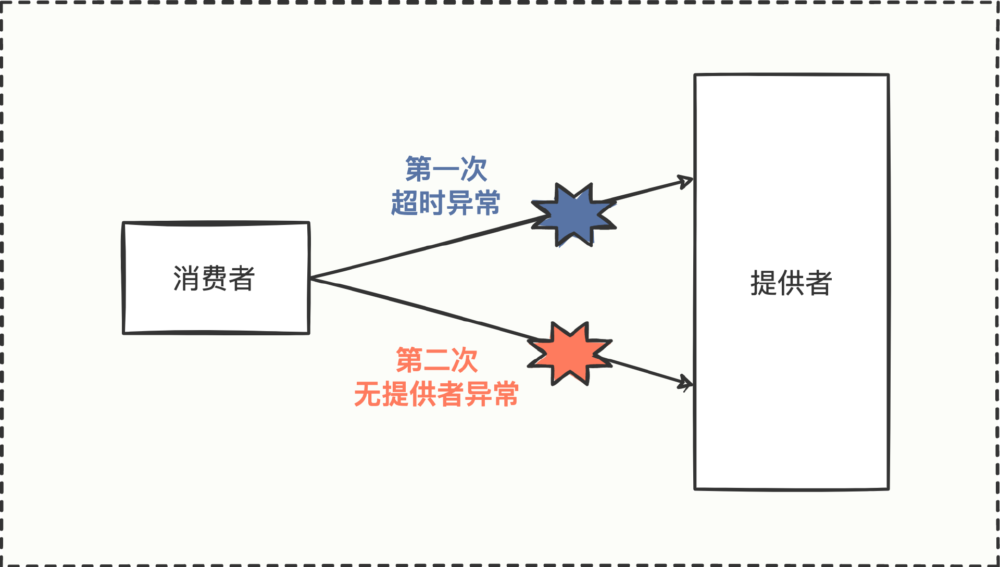
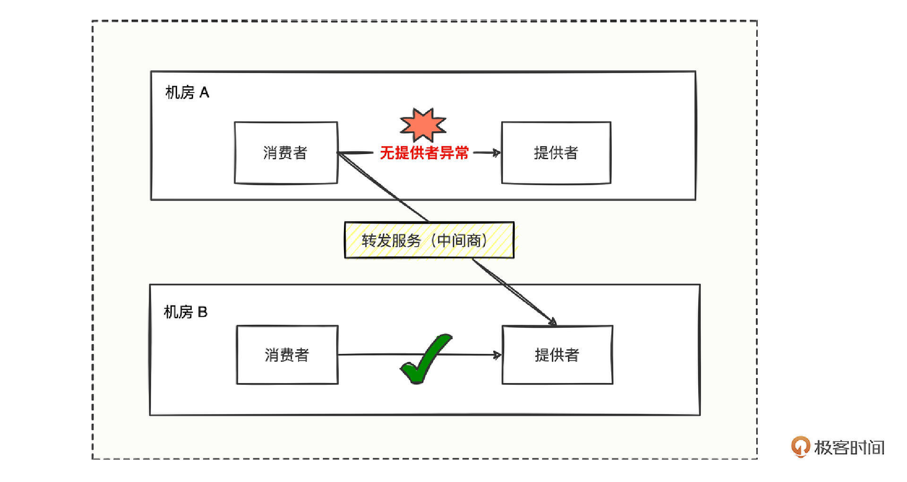
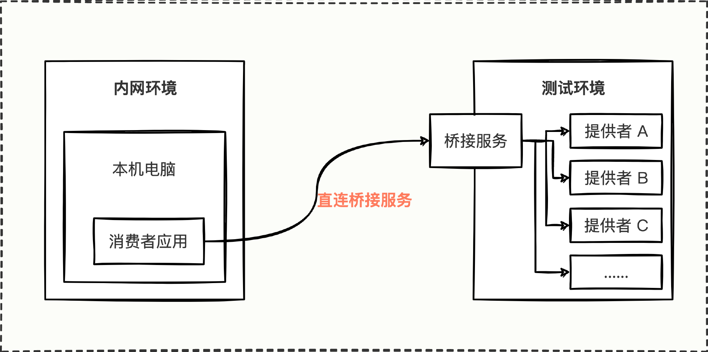

# 23｜集群扩展：发送请求遇到服务不可用，怎么办？
你好，我是何辉。

通过特色篇的学习，你可以在日常开发中横着走了，如果你继续深入掌握了源码篇，基本可以把 Dubbo 框架游刃有余地玩弄于鼓掌之中。接下来，我们将进入拓展篇，借助一些产线的真实案例，真枪实弹地教你如何充分挖掘Dubbo框架的扩展能力，来解决实际问题。

今天我们来实操第一个扩展，集群扩展。

你有没有遇到过这样的情况，对于多机房部署的系统应用，线上运行一直比较稳定，可是突然在某一段时间内，部分流量请求先出现一些超时异常，紧接着又出现一些无提供者的异常，最后部分功能就不可用了。

我们结合具体的调用链路图来看。



这是一张消费方调用提供方的简单调用链路图，消费方第一次调用时发生了超时异常，然后第二次调用时却发生了无提供者异常，无提供者异常从字面意思上理解，就是没有服务提供者，结果和服务不可用是一样的。

对于这样一个看似非常简单的异常现象，我们该怎么解决呢？

## 异常如何解决

要想知道怎么解决，首先就得弄清楚异常发生的原因。

调用链路图中可以看到有两个异常，一个是超时异常，一个是无提供者异常。我们先从超时异常开始分析。

### 1\. 超时异常和原因

遇到异常，我们的第一反应就是去认真阅读异常堆栈的详细信息。

你回忆了下超时异常堆栈信息。

```markdown
Caused by: org.apache.dubbo.remoting.TimeoutException: Waiting server-side response timeout by scan timer. start time: 2022-10-25 20:14:16.718, end time: 2022-10-25 20:14:16.747, client elapsed: 1 ms, server elapsed: 28 ms, timeout: 5 ms, request: Request [id=2, version=2.0.2, twoway=true, event=false, broken=false, data=RpcInvocation [methodName=sayHello, parameterTypes=[class java.lang.String], arguments=[Geek], attachments={path=com.hmilyylimh.cloud.facade.demo.DemoFacade, remote.application=dubbo-04-api-boot-consumer, interface=com.hmilyylimh.cloud.facade.demo.DemoFacade, version=0.0.0, timeout=5}]], channel: /192.168.100.183:62231 -> /192.168.100.183:28043
	at org.apache.dubbo.remoting.exchange.support.DefaultFuture.doReceived(DefaultFuture.java:212)
	at org.apache.dubbo.remoting.exchange.support.DefaultFuture.received(DefaultFuture.java:176)
	at org.apache.dubbo.remoting.exchange.support.DefaultFuture$TimeoutCheckTask.notifyTimeout(DefaultFuture.java:295)
	at org.apache.dubbo.remoting.exchange.support.DefaultFuture$TimeoutCheckTask.lambda$run$0(DefaultFuture.java:282)
	at org.apache.dubbo.common.threadpool.ThreadlessExecutor$RunnableWrapper.run(ThreadlessExecutor.java:184)
	at org.apache.dubbo.common.threadpool.ThreadlessExecutor.waitAndDrain(ThreadlessExecutor.java:103)
	at org.apache.dubbo.rpc.AsyncRpcResult.get(AsyncRpcResult.java:193)
	... 29 more

```

说明一下，这段报错信息是方便我们具体分析问题模拟出来的，但日常你看到消费方调用的超时异常信息也大同小异，思路都是很类似的。

从异常信息中我们看到有一个 Caused by 引发的 TimeoutException 异常类，而且异常堆栈都这么明显了，很多人就理所当然地认为是超时异常。

但我们不妨认真想想， **这个异常，单方面从消费方就能找到超时的真正原因么？**

你恍然大悟，好像是哦，单纯从消费方判断超时异常并不能定位到真实原因，得明确下提供方是不是也真的发生了超时异常情况。如果提供方有异常，那好说，顺藤摸瓜找到真正异常的堆栈日志就能继续分析异常原因。

**但如果提供方根本没有收到消费方的任何请求，又该如何继续排查呢？**

消费方有请求，但提供方未收到，难道请求发错了？好端端的线上应用，会出现Dubbo负载均衡到错误的目标IP上，好像有点匪夷所思。虽然不太相信，但我们本着严谨的态度，还是来求证下目标IP是否真的有问题。 **有哪些特征可以证明目标IP有问题？或者有哪个地方可以看一看目标IP的健康状态呢？**

快速联想日常开发中可以监测IP健康情况的工具，你一定能胸有成竹地说出3个方案：可以从CAT监控平台上观察一下目标IP是否可以继续接收流量，也可以从Prometheus上观察消费方到目标IP的TCP连接状况，还可以从网络层面通过tcpdump抓包检测消费方到目标IP的连通性等等。

好，为求证目标IP的健康状况，我们把刚刚提到的检监测工具挨个试一下：

- 在CAT上发现了目标IP在出问题期间几乎没有任何流量进来。
- 在Prometheus上发现在最近一段时间内TCP的连接耗时特别大，基本上都是有SYN请求握手包，但是没有SYN ACK响应包。
- 找网络人员帮忙实时tcpdump抓包测试，结果仍然发现没有SYN ACK响应包。

于是通过监测结论，我们基本确认了目标IP处于不可连通的状态，接着只需要去确认目标IP服务是宕机了还是流量被拦截了，就大概知道真相了。

经过我们一连串提问和思考，机智的你也许会说，为什么不直接去看看目标IP服务是否存活呢？其实也可以， **毕竟问题有千万种，只要掌握排查问题的思路，尝试跳跃性地排查也是可以的。**

但是到这里还没完，我们只是解决了第一个超时异常，有些节点能正常提供服务，有些节点无法提供服务，更巧的是紧接着还冒出无提供者的异常，这又是怎么回事呢？

### 2\. 无提供者异常和原因

无提供者异常，相信你看到这样的异常应该也不陌生，异常堆栈信息长这样。

```markdown
org.apache.dubbo.rpc.RpcException: Failed to invoke the method sayHello in the service com.hmilyylimh.cloud.facade.demo.DemoFacade. No provider available for the service com.hmilyylimh.cloud.facade.demo.DemoFacade from registry 127.0.0.1:2181 on the consumer 192.168.100.183 using the dubbo version 3.0.7. Please check if the providers have been started and registered.
	at org.apache.dubbo.rpc.cluster.support.AbstractClusterInvoker.checkInvokers(AbstractClusterInvoker.java:366)
	at org.apache.dubbo.rpc.cluster.support.FailoverClusterInvoker.doInvoke(FailoverClusterInvoker.java:73)
	at org.apache.dubbo.rpc.cluster.support.AbstractClusterInvoker.invoke(AbstractClusterInvoker.java:340)
	at org.apache.dubbo.rpc.cluster.router.RouterSnapshotFilter.invoke(RouterSnapshotFilter.java:46)
	at org.apache.dubbo.rpc.cluster.filter.FilterChainBuilder$CopyOfFilterChainNode.invoke(FilterChainBuilder.java:321)
	at org.apache.dubbo.monitor.support.MonitorFilter.invoke(MonitorFilter.java:99)
	... 48 more

```

我们精准找出了“No provider available”这样的关键字，说明的确就是找不到服务提供者。可是看着这段再平常不过的异常信息，有点无解了，为什么会报无提供者异常呢？到底是哪个环节走不过去了？又或者是哪段代码导致逻辑走不通了？

想到哪段代码，你好像找到了破局之道，我们再三观察堆栈异常信息。

```markdown
at org.apache.dubbo.rpc.cluster.support.AbstractClusterInvoker.checkInvokers(AbstractClusterInvoker.java:366)
at org.apache.dubbo.rpc.cluster.support.FailoverClusterInvoker.doInvoke(FailoverClusterInvoker.java:73)

```

发现报错的关键点日志，是在 AbstractClusterInvoker 类中的第 366 行报错。

于是打开 AbstractClusterInvoker 源码对应的报错地方。

```java
protected void checkInvokers(List<Invoker<T>> invokers, Invocation invocation) {
    // 检查传入的 invokers 服务提供者列表，若集合为空，则会抛出无提供者异常
    if (CollectionUtils.isEmpty(invokers)) {
        // 抛出的 RpcException 异常信息中，会有 No provider available 明显的关键字
        throw new RpcException(RpcException.NO_INVOKER_AVAILABLE_AFTER_FILTER, "Failed to invoke the method "
            + invocation.getMethodName() + " in the service " + getInterface().getName()
            + ". No provider available for the service " + getDirectory().getConsumerUrl().getServiceKey()
            + " from registry " + getDirectory().getUrl().getAddress()
            + " on the consumer " + NetUtils.getLocalHost()
            + " using the dubbo version " + Version.getVersion()
            + ". Please check if the providers have been started and registered.");
    }
}

```

通过这段代码中的 checkInvokers 方法实现逻辑，我们可以得知， **消费方在内存中找不到对应的提供者，才会提示无提供者异常**。而 checkInvokers 方法又被 FailoverClusterInvoker 类调用，而这个 FailoverClusterInvoker 类，想必你已经联想到了 FailoverCluster 类，于是进一步推导是设置了 cluster = “failover” 属性才能走到 FailoverCluster 类的逻辑中来。

而 FailoverCluster 对象的生成是在消费方订阅环节中，另外提供方结点发生变更时，消费方感知到注册中心节点的变化也会重新生成 FailoverCluster 对象。

这一通梳理后，checkInvokers 方法中 invokers 列表对应的源数据，想必你已经明白从哪里来了，消费方启动或注册中心节点变更都会更新这份源数据。

知道这份源数据的来源，我们再结合报错细想，既然消费方已经处于运行状态，只是在调用的时候发生了无提供者异常，说明什么？

你思索了几秒，难道是因为注册中心的节点变更了，导致源数据被更新没了？

没错，就是这么理解。至于为什么注册中心的节点会变更，原因就很多了，比如：

- 服务方动态注销了某个接口服务。
- 服务方节点宕机了。
- 服务方在代码中删掉了这个接口再启动，即永远不会再提供服务了。
- 服务方修改了接口的类名、方法名。
- 服务方未考虑版本兼容性，主动添加了 group、version 等参数。
- ……

有没有发现，源码层面抛出的一个“No provider available”无提供者异常，居然有这么多的可能场景存在。

通过一系列可能原因的排查，最终我们排查到因为节点宕机，造成提供方节点与注册中心断开心跳连接了，这意味着注册中心会删掉提供方的IP节点；然后消费方感知到注册中心的节点发生变更，会更新消费方本地的源数据信息。这也就是为什么消费方在 checkInvokers 中发现 invokers 为空了。

### 3.问题总结

分析了超时异常、无提供者异常，我们最终发现是因为某些提供方的 IP 节点宕机，但是还有些提供方的节点 IP 是正常提供服务的，这又是为什么呢？

IP一些正常一些不正常，难道IP还有人品因素么，这明显不现实，你盯着有问题的那一堆IP思索了良久，无解。是时候找外援了，在一个公司中谁对IP非常熟悉？网络工程师。

于是我们拿着这一堆有问题的IP去找网工，得知它们全都是同一个机房的，再结合刚才的整个调用流程步骤思考：

1. 某机房的某提供方 IP 节点宕机
2. 消费方有缓存，引发消费方调用超时
3. 消费方感知到注册中心节点变更
4. 消费方更新接口对应提供方源数据列表
5. 消费方又有流量发起调用发生无提供者异常

可以梳理出一张不同机房之间消费者调用提供者的链路图。


我们可以看到机房A与机房B是不能相互访问的，这也正符合机房的隔离性。

那么假设机房A的某些提供者宕机了，且机房A的消费者状态正常，难道就预示着机房A的消费方发起的请求就无法正常调用了么？这样明显不合理，为什么机房A的提供者有问题，非得把机房A的消费者拉下水导致各种功能无法正常运转。

遇到这种状况，我们该如何改善呢？

## 定制Cluster扩展

整理现在的问题，在机房A的消费者无法调用提供者的时候，我们要想办法让消费者能正常调用提供者拿到结果。

问题乍一看，你是不是感觉自相矛盾。明明同机房已经调用不通，再加上机房之间又是防火墙彻底隔离，还要硬着头皮从宕机的服务拿到响应内容？除非提供方宕机之后又以神一样的毫秒级别恢复起来了，但是我们现在的各种应用，还没有能在毫秒级别启动成功的，基本上都是秒级，大多数都是数十秒才启动成功。

顺着同机房的思路想必是走进死胡同了，那消费者的请求发给谁才能通呢？

发给谁？突然你眼前一亮，消费者可以将请求发给 **中间商** 啊，然后中间商想办法找可用提供者，貌似这条路可行。



消费方遇到无提供者异常后，掉头去调用转发服务，由转发服务找可用机房的可用提供者并发起调用并拿到结果，就可以让消费者拿到正常调用的结果。

但问题又来了， **谁写这段调用转发服务的代码呢？** 是消费者去写么？还是谁呢？

消费者写也不是不可以，但我们想象一下场景，今天这个应用的消费者遇到无提供者异常需要转发，明天那个应用的消费者遇到无提供者异常需要转发，那么多的系统各种消费方都需要改，肯定是改不过来的。

既然写不过来，那把这段代码封装成插件总可以了，通过提炼公共插件，解决大批量应用的共性问题，这样既做到了代码公用只维护一份代码，又做到了对应用的非侵入特性，岂不是一举两得。

但是问题又来了， **该在调用的哪个环节进行转发服务的处理呢？**

我们再琢磨下，要调用转发服务，就得感知无提供者异常；要想感知无提供者异常，就得在抛异常的外层进行异常捕获处理。

顺着这个思路，我们去代码翻了翻抛异常的地方，发现在 FailoverClusterInvoker#doInvoke 方法中 checkInvokers 方法，细心的你还发现了 checkInvokers 方法是被 protected 修饰的，而 protected 修饰就意味着可以被子类重写，说明源码给我们提供了一个检测 invokers 是否可用的机制。

**所以根据源码，你准备定义一个 TransferClusterInvoker 类来继承 FailoverClusterInvoker，然后重写 checkInvokers 就可以了**。但是 checkInvokers 只是意在让你检测，不是让你发现 invokers 为空就调用转发服务，虽说重写 checkInvokers 方法可以达到目的，但和设计者的命名始终有点不符。

既然与设计意图不符，我们又看到 FailoverClusterInvoker 的 doInvoke 方法是被 public 修饰后， **是不是可以在子类 TransferClusterInvoker 中调用父类 FailoverClusterInvoker 的 doInvoke 方法，并进行 try…catch… 捕获精准异常呢？** 这样既不会破坏设计者的意图，还能精准处理无提供者异常后转发调用，也是挺完美的。

我们来编写代码。

```java
public class TransferClusterInvoker<T> extends FailoverClusterInvoker<T> {
    // 按照父类 FailoverClusterInvoker 要求创建的构造方法
    public TransferClusterInvoker(Directory<T> directory) {
        super(directory);
    }
    // 重写父类 doInvoke 发起远程调用的接口
    @Override
    public Result doInvoke(Invocation invocation, List<Invoker<T>> invokers, LoadBalance loadbalance) throws RpcException {
        try {
            // 先完全按照父类的业务逻辑调用处理，无异常则直接将结果返回
            return super.doInvoke(invocation, invokers, loadbalance);
        } catch (RpcException e) {
            // 这里就进入了 RpcException 处理逻辑

            // 当调用发现无提供者异常描述信息时则向转发服务发起调用
            if (e.getMessage().toLowerCase().contains("no provider available")){
                // TODO 从 invocation 中拿到所有的参数，然后再处理调用转发服务的逻辑
                return doTransferInvoke(invocation);
            }
            // 如果不是无提供者异常，则不做任何处理，异常该怎么抛就怎么抛
            throw e;
        }
    }
}

```

在这段代码中 TransferClusterInvoker 主要继承了 FailoverClusterInvoker 类，然后重写了父类中最重要的 doInvoke 方法，重写的实现体逻辑中原封不动地通过 super.doInvoke 方法调用父类逻辑，在父类逻辑出现“No provider available”无提供者异常时，才捕捉处理调用转发服务。

最核心的逻辑我们已经实现了，那在代码中该怎么触发这个 TransferClusterInvoker 运作呢？

我们还是可以借鉴已有源码编写调用的思路，经过一番查找 FailoverClusterInvoker 代码编写调用关系后，我们可以定义一个 TransferCluster 类。

```java
public class TransferCluster implements Cluster {
    // 返回自定义的 Invoker 调用器
    @Override
    public <T> Invoker<T> join(Directory<T> directory, boolean buildFilterChain) throws RpcException {
        return new TransferClusterInvoker<T>(directory);
    }
}

```

这段代码中 TransferCluster 主要仿照了 FailoverCluster 的编码形式，通过在 TransferCluster 类中创建 TransferClusterInvoker 来处理调用至转发服务器。

当 TransferClusterInvoker、TransferCluster 都实现好后，按照 Dubbo SPI 的规范将 TransferCluster 类路径配置到 META-INF/dubbo/org.apache.dubbo.rpc.cluster.Cluster 文件中，看配置。

```plain
transfer＝com.hmilyylimh.cloud.TransferCluster

```

这段配置为 TransferCluster 取了个 transfer 名字，将来程序调用的时候能够被用上。

最后我们只需要在 dubbo.properties 指定全局使用，看配置。

```java
dubbo.consumer.cluster=transfer

```

全局指定名字叫 transfer 的集群扩展器，然后在调用时会触发 TransferCluster 来执行遇到无提供者异常时，掉头转向调用转发服务器。

## 集群拓展的应用

Dubbo的集群扩展，相信你现在已经非常清楚了。Cluster作为路由层，封装多个提供方的路由及负载均衡，并桥接注册中心以 Invoker 为中心发起调用，那哪些应用场景可以考虑集群扩展呢？

第一，同机房请求无法连通时，可以考虑转发HTTP请求至可用提供者。

第二，内网本机访问测试环境无法连通时，可以转发请求至HTTP协议的接口，然后在接口中泛化调用各种Dubbo服务。

第三，如果针对接口的多个提供者需要做适应当前公司业务的筛选、剔除、负载均衡之类的诉求时，也是可以考虑集群扩展的。

总之，不管是无提供者问题，还是公司特殊定制化筛选负载问题，核心都是在针对接口的所有提供者做逻辑处理，提供者为空做转发兼容处理，提供者不为空做特殊筛选负载处理，目的都是在调用时做一种容错兼容处理，让应用程序更加健壮稳定。

## 总结

今天，我们从一个消费方在同机房调用连续发生两种异常开始，分析了超时异常和无提供者异常大致方向的定位排查。

通过CAT、Prometheus、tcpdump可以发现引发超时的深层次原因。通过“No provider available”关键字，从代码层面反推引起注册节点变更的可能因素，来进一步找到引发无提供者异常的底层原因；然后深入挖掘错误关键字在代码中的报错点，为问题的解决撕开了一道口子，最终通过自定义集群扩展从代码层面落实方案。

这里也总结一下自定义集群扩展四部曲。

- 首先定义一个 TransferClusterInvoker 集群扩展处理器来处理核心的调用转发逻辑。
- 其次定义一个 TransferCluster 集群扩展器来封装集群扩展处理器。
- 然后在 META-INF/dubbo/org.apache.dubbo.rpc.cluster.Cluster 文件中定义 TransferCluster 的类路径并取个别名。
- 最后在 dubbo.properties 配置文件通过一个别名来指定消费者需要使用的集群扩展器。

集群扩展的应用场景主要有3类，同机房请求无法连通，内网本机请求测试环境无法连通，特殊业务需要对接口的多个提供者进行筛选、剔除、负载均衡等诉求。

### 思考题

你已经学会了如何使用集群扩展特性来处理无法连通的问题了，那你能否尝试研究并编写代码来模拟实现应用场景中内网电脑请求测试环境的连通问题呢？



图中描绘了内网环境调用测试环境的调用链路图，虚拟出一个桥接服务节点，接下来需要想办法让消费者应用的所有接口，都能通过桥接服务，调用到对应的提供者。

这个问题涉及的知识体系比较庞大，所以这里，我们只实现“ **集群扩展**”“ **桥接服务通用HTTP接口的定义**”这两部分功能就可以了。小提示，集群扩展的实现可以参考今天总结的自定义集群扩展四部曲，而HTTP接口要关注入参的通用性。

期待在留言区看到你的思考，参与讨论。如果觉得今天的内容对你有帮助，也欢迎分享给身边的朋友一起讨论，可能就帮TA解决了一个困惑。我们下一讲见。

### 22 思考题参考

上一期留了个作业，研究下 encodeResponse 方法的逻辑，总结与 encodeRequest 的异同点。

这个问题其实不难，我们只要认真分析一遍 encodeResponse 方法，答案也就呼之欲出了。直接进入 encodeResponse 的方法仔细看看。

```java
///////////////////////////////////////////////////
// 1、org.apache.dubbo.remoting.exchange.codec.ExchangeCodec#encodeResponse
// 2、将 Response 对象按照 Dubbo 协议格式编码为字节流
// 3、重点关注我在代码中描述的 ①②③④⑤⑥⑦ 几个关键位置
///////////////////////////////////////////////////
// header length.
protected static final int HEADER_LENGTH = 16;
// magic header.
protected static final short MAGIC = (short) 0xdabb;
protected static final byte MAGIC_HIGH = Bytes.short2bytes(MAGIC)[0];
protected static final byte MAGIC_LOW = Bytes.short2bytes(MAGIC)[1];
// message flag.
protected static final byte FLAG_REQUEST = (byte) 0x80;
protected static final byte FLAG_TWOWAY = (byte) 0x40;
protected static final byte FLAG_EVENT = (byte) 0x20;
protected static final int SERIALIZATION_MASK = 0x1f;

// 将 Response 对象按照 Dubbo 协议格式编码为字节流
protected void encodeResponse(Channel channel, ChannelBuffer buffer, Response res) throws IOException {
    int savedWriteIndex = buffer.writerIndex();
    try {
        Serialization serialization = getSerialization(channel, res);
        // header.
        // ① 针对 header 字节数组赋值一个 0xdabb 魔术值
        byte[] header = new byte[HEADER_LENGTH];
        // set magic number.
        Bytes.short2bytes(MAGIC, header);

        // set request and serialization flag.
        // ② 设置序列化方式，序列化方式从 channel 的 url 取出 serialization 对应的参数值，
        header[2] = serialization.getContentTypeId();
        if (res.isHeartbeat()) {
            // ③ 设置请求类型，根据 mTwoWay、mEvent 来决定是怎样的请求类型
            header[2] |= FLAG_EVENT;
        }

        // set response status.
        // ④ 设置响应码，这里因为是响应成功，因此 status = 20
        //
        // status 的值，在源码中有如下这些值：
        // /** ok. 响应成功 */
        // public static final byte OK = 20;
        // /** client side timeout. 消费方超时 */
        // public static final byte CLIENT_TIMEOUT = 30;
        // /** server side timeout. 提供方超时 */
        // public static final byte SERVER_TIMEOUT = 31;
        // /** channel inactive, directly return the unfinished requests. 通道channel被关闭不可用了 */
        // public static final byte CHANNEL_INACTIVE = 35;
        // /** request format error. 请求数据格式错误 */
        // public static final byte BAD_REQUEST = 40;
        // /** response format error. 响应数据格式错误 */
        // public static final byte BAD_RESPONSE = 50;
        // /** service not found. 提供方服务找不到 */
        // public static final byte SERVICE_NOT_FOUND = 60;
        // /** service error. 提供方错误 */
        // public static final byte SERVICE_ERROR = 70;
        // /** internal server error. 提供方内部错误 */
        // public static final byte SERVER_ERROR = 80;
        // /** internal server error. 消费方内部错误 */
        // public static final byte CLIENT_ERROR = 90;
        // /** server side threadpool exhausted and quick return. 线程池满拒绝请求 */
        // public static final byte SERVER_THREADPOOL_EXHAUSTED_ERROR = 100;
        byte status = res.getStatus();
        header[3] = status;

        // ⑤ 设置响应ID，该ID是请求发送过来的ID
        // set request id.
        Bytes.long2bytes(res.getId(), header, 4);
        buffer.writerIndex(savedWriteIndex + HEADER_LENGTH);
        ChannelBufferOutputStream bos = new ChannelBufferOutputStream(buffer);

        // ⑥ 构建一个输出流，根据 mEvent 的值来将 mData 进行序列化转为字节数组
        // encode response data or error message.
        if (status == Response.OK) {
            if(res.isHeartbeat()){
                // heartbeat response data is always null
                bos.write(CodecSupport.getNullBytesOf(serialization));
            }else {
                ObjectOutput out = serialization.serialize(channel.getUrl(), bos);
                if (res.isEvent()) {
                    encodeEventData(channel, out, res.getResult());
                } else {
                    encodeResponseData(channel, out, res.getResult(), res.getVersion());
                }
                out.flushBuffer();
                if (out instanceof Cleanable) {
                    ((Cleanable) out).cleanup();
                }
            }
        } else {
            ObjectOutput out = serialization.serialize(channel.getUrl(), bos);
            out.writeUTF(res.getErrorMessage());
            out.flushBuffer();
            if (out instanceof Cleanable) {
                ((Cleanable) out).cleanup();
            }
        }
        bos.flush();
        bos.close();
        int len = bos.writtenBytes();
        checkPayload(channel, len);
        Bytes.int2bytes(len, header, 12);
        // write
        buffer.writerIndex(savedWriteIndex);
        buffer.writeBytes(header); // write header.

        // ⑦ 最终将序列化出来的字节数组的长度填充至报文体长度位置
        buffer.writerIndex(savedWriteIndex + HEADER_LENGTH + len);
    } catch (Throwable t) {
        // 下面的逻辑都是异常处理，主要想办法赋值 status、errorMessage 字段
        // 将错误信息体现出来，告诉消费方
        // clear buffer
        buffer.writerIndex(savedWriteIndex);
        // send error message to Consumer, otherwise, Consumer will wait till timeout.
        if (!res.isEvent() && res.getStatus() != Response.BAD_RESPONSE) {
            Response r = new Response(res.getId(), res.getVersion());
            r.setStatus(Response.BAD_RESPONSE);
            if (t instanceof ExceedPayloadLimitException) {
                logger.warn(t.getMessage(), t);
                try {
                    r.setErrorMessage(t.getMessage());
                    channel.send(r);
                    return;
                } catch (RemotingException e) {
                    logger.warn("Failed to send bad_response info back: " + t.getMessage() + ", cause: " + e.getMessage(), e);
                }
            } else {
                // FIXME log error message in Codec and handle in caught() of IoHanndler?
                logger.warn("Fail to encode response: " + res + ", send bad_response info instead, cause: " + t.getMessage(), t);
                try {
                    r.setErrorMessage("Failed to send response: " + res + ", cause: " + StringUtils.toString(t));
                    channel.send(r);
                    return;
                } catch (RemotingException e) {
                    logger.warn("Failed to send bad_response info back: " + res + ", cause: " + e.getMessage(), e);
                }
            }
        }

        // Rethrow exception
        if (t instanceof IOException) {
            throw (IOException) t;
        } else if (t instanceof RuntimeException) {
            throw (RuntimeException) t;
        } else if (t instanceof Error) {
            throw (Error) t;
        } else {
            throw new RuntimeException(t.getMessage(), t);
        }
    }
}

```

分析后，我们发现也没什么特别的，总结下来有 4 个区别。

- 多了一个响应码的设置，即帧格式中的第 4 个字节内容的设置。
- 请求唯一 ID 的设置，用的是接收请求时 ID 值。
- 若响应码不是 OK，就直接将 errorMessage 刷到了响应体数据中。
- 多了比较丰富的异常处理，并且针对一些特殊的异常，会将异常信息发送回消费方，以便消费方感知到提供方到底是出现了什么异常。