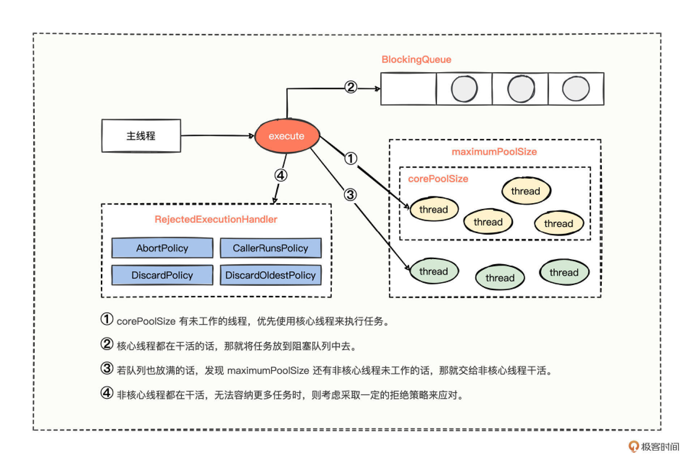
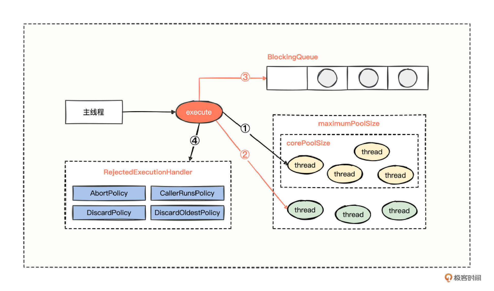

# 26｜线程池扩展：如何选择Dubbo线程池？
你好，我是何辉。今天我们继续学习Dubbo拓展的第四篇，线程池扩展。

提到线程池，我们在前面“ [异步化实践](https://time.geekbang.org/column/article/611392)”中通过“线程池耗尽”这个现象已经接触到了，Dubbo 采用默认的线程池，也就是 200 个核心线程，来提供服务，其实我们已经用得非常舒服了，业务正常运转没什么阻碍。

不过你知道吗，Dubbo 框架里面其实有 4 种线程池，那其他的线程池存在的意义是什么，我们在使用时该怎么选择呢？

带着这个问题，今天我们来点轻松的，带你掌握 Dubbo 4 种线程池的用法。

## 线程池原理

在具体分析每一种线程池之前，我们还是回忆一下创建线程池的核心代码参数，看一看添加任务到线程池的大致工作原理是什么样的。

```java
///////////////////////////////////////////////////
// java.util.concurrent.ThreadPoolExecutor#ThreadPoolExecutor(int, int, long, java.util.concurrent.TimeUnit, java.util.concurrent.BlockingQueue<java.lang.Runnable>, java.util.concurrent.ThreadFactory, java.util.concurrent.RejectedExecutionHandler)
// 线程池最核心的构造方法
///////////////////////////////////////////////////
public ThreadPoolExecutor(int corePoolSize,
                          int maximumPoolSize,
                          long keepAliveTime,
                          TimeUnit unit,
                          BlockingQueue<Runnable> workQueue,
                          ThreadFactory threadFactory,
                          RejectedExecutionHandler handler) {
    // 核心线程数量小于 0，则抛出参数非法异常
    if (corePoolSize < 0 ||
        // 最大线程数量小于等于 0，则抛出参数非法异常
        maximumPoolSize <= 0 ||
        // 最大线程数量小于核心线程数量，则抛出参数非法异常
        maximumPoolSize < corePoolSize ||
        // 非核心线程空闲时的存活时间小于0，则抛出参数非法异常
        keepAliveTime < 0)
        throw new IllegalArgumentException();
    // 没有配置任务队列、没有配置创建线程的工厂、没有配置拒绝策略，一律抛出参数非法异常
    if (workQueue == null || threadFactory == null || handler == null)
        throw new NullPointerException();
    // 剩下的就是一些入参的赋值逻辑了
    this.corePoolSize = corePoolSize;
    this.maximumPoolSize = maximumPoolSize;
    this.workQueue = workQueue;
    this.keepAliveTime = unit.toNanos(keepAliveTime);
    this.threadFactory = threadFactory;
    this.handler = handler;
}

```

这么一个偌大的构造方法，含有 7 个参数，有点多。不过没关系，我们还是用图来辅助梳理逻辑。



假设主线程一直在不停地调用线程池的 execute 方法添加任务。

① 当处理任务的核心线程数量小于 corePoolSize，那就优先把任务分派给核心线程干活。

② 当处理任务的核心线程数量恰好等于 corePoolSize，那就继续把任务添加至 BlockingQueue 阻塞队列中等待。

③ 若任务也把阻塞队列堆满了，就继续尝试把任务分配给非核心线程去处理。

④ 若核心线程数量 \+ 非核心线程数量恰好为最大线程数量（maximumPoolSize），这个时候，如果再添加任务，线程池就吃不消了，所以会采取一定的拒绝策略来应对。

拒绝策略主要有 4 种。

- 策略一：拒绝添加新任务并抛出异常（AbortPolicy）， **同时也是默认的拒绝策略**。
- 策略二：让调用方线程执行新任务（CallerRunsPolicy）。
- 策略三：抛弃新任务（DiscardPolicy）。
- 策略四：丢弃最早入队的任务然后添加新任务（DiscardOldestPolicy）。

## Dubbo 线程池

了解了线程池的原理，我们分析 Dubbo 的四种线程池就比较轻松了，因为 Dubbo 线程池的创建方式，就是基于我们刚刚梳理的拥有 7 个参数的线程池构造方法，我们一个一个看，分别是：FixedThreadPool、LimitedThreadPool、CachedThreadPool、EagerThreadPool。

### 1\. FixedThreadPool

第一个，固定线程数量的线程池，老规矩，我们直接看这个线程池在源码层面是怎么体现的。

```java
///////////////////////////////////////////////////
// org.apache.dubbo.common.threadpool.support.fixed.FixedThreadPool
// 固定线程数量的线程池
///////////////////////////////////////////////////
public class FixedThreadPool implements ThreadPool {

    @Override
    public Executor getExecutor(URL url) {
        // 获取一些参数变量
        String name = url.getParameter("threadname", (String) url.getAttribute("threadname", "Dubbo"));
        int threads = url.getParameter("threads", 200);
        int queues = url.getParameter("queues", 0);

        // 调用创建线程池的构造方法
        return new ThreadPoolExecutor(
              // 核心线程数量：threads
              threads,
              // 最大线程数量：threads
              threads,
              // 非核心线程空闲时的存活时间等于0
              0,
              // 非核心线程空闲时的存活时间等于0，单位：毫秒
              TimeUnit.MILLISECONDS,
              // 存放任务的阻塞队列
                      queues == 0 ? new SynchronousQueue<Runnable>() :
                              (queues < 0 ? new LinkedBlockingQueue<Runnable>()
                                      : new LinkedBlockingQueue<Runnable>(queues)),
              // 创建线程的工厂
              new NamedInternalThreadFactory(name, true),
              // 带有导出线程堆栈的拒绝策略，内部继承了 AbortPolicy 抛异常策略
              new AbortPolicyWithReport(name, url)
        );
    }
}

```

从这段简短的创建线程池的代码中，我们能得出 3 点结论。

- 第一， **核心线程数量与最大线程数量是一致的**。这说明只有核心线程的存在，没有非核心线程的存在，而且在没有人为干预设置 threads 属性的情况下，默认核心线程数是 200，这也是 Dubbo 默认线程池数量是 200 个的由来。
- 第二，采用的阻塞队列，是根据队列长度 queues 属性值来确定。长度等于 0 使用同步队列（SynchronousQueue），长度小于 0 使用无界阻塞队列，长度大于 0 使用有界队列。
- 第三，拒绝策略使用的是默认的抛异常策略。不过，这个拒绝策略是经过框架特殊包装处理的，发现拒绝添加任务时，这个策略有导出线程堆栈的能力，特别适合开发人员分析线程池满时的一些实时状况。

从第一点结论我们不难发现，核心线程与最大线程数量等价，也说明了线程数量是固定不变的，所以这个线程池，我们就叫做 **固定线程数量的线程池（FixedThreadPool）**。

固定数量的默认值是 200，也就是说在某时刻最大能并行处理 200 个任务，假设每个任务耗时 1 秒，相当于这台机器的单机 QPS = 200，假设每个任务耗时 5 秒，那这台机器的单机 QPS = 40。

这样计算出来的 QPS 你可能感触不太强烈，不过你可以认真观察下，自己负责的应用服务器单机 QPS 情况，对比一下数值。你会发现，原来 Dubbo 设置默认 200 个线程也不是没有道理的，这是经过大量验证后的折中取值，能满足大多数业务场景的诉求。所以，如果我们没有特别的诉求，也别去瞎折腾设置什么线程池数量，直接使用 Dubbo 默认的线程池数量就好了。

### 2\. LimitedThreadPool

不过你也许会说：我这系统又没多大的量，200 个线程有点浪费，量大的时候 QPS 也不过十几，量低的时候 QPS 几乎为零，而且也不好预估量低的时候设置多少合适。

对于这样的疑惑，需要 Dubbo 的第二个线程池出马。看代码。

```java
///////////////////////////////////////////////////
// org.apache.dubbo.common.threadpool.support.limited.LimitedThreadPool
// 有限制数量的线程池
///////////////////////////////////////////////////
public class LimitedThreadPool implements ThreadPool {

    @Override
    public Executor getExecutor(URL url) {
        // 获取一些参数变量
        String name = url.getParameter("threadname", (String) url.getAttribute("threadname", "Dubbo"));
        int cores = url.getParameter("corethreads", 0);
        int threads = url.getParameter("threads", 200);
        int queues = url.getParameter("queues", 0);

        // 调用创建线程池的构造方法
        return new ThreadPoolExecutor(
              // 核心线程数量：cores
              cores,
              // 最大线程数量：threads
              threads,
              // 非核心线程空闲时的永久存活
              Long.MAX_VALUE,
              // 非核心线程空闲时的存活时间，单位：毫秒
              TimeUnit.MILLISECONDS,
              // 存放任务的阻塞队列
                      queues == 0 ? new SynchronousQueue<Runnable>() :
                              (queues < 0 ? new LinkedBlockingQueue<Runnable>()
                                      : new LinkedBlockingQueue<Runnable>(queues)),
              // 创建线程的工厂
              new NamedInternalThreadFactory(name, true),
              // 带有导出线程堆栈的拒绝策略，内部继承了 AbortPolicy 抛异常策略
              new AbortPolicyWithReport(name, url)
        );
    }
}

```

看过固定数量的线程池后，我们再看这个有限制数量的线程池源码，就非常得心应手，可以得出 2 点结论。

- 第一，核心线程数是由一个单独的 corethreads 属性来赋值的，默认值为 0。最大线程数是由 threads 属性来赋值的，默认值为 200。 **这说明默认情况下没有核心线程，非核心线程数量最大也不能超过 200。**
- 第二，非核心线程的 keepAliveTime 存活时间为 Long 类型的最大值，也就是说永不过期，一旦非核心线程创建出来了，只要不出现什么意外，就会一直存活，有任务就处理任务，没任务就躺在那里休息。

从核心线程与最大线程数量分开设置的情况来看， **这个线程池的数量分配，算是配合业务有弹性的分配**，如果业务量并不大，分配了多少就使用多少，如果业务量稍微再增长一点，那就继续分配非核心线程继续干活，按照默认情况分配 200 个就封顶了。

所以对于那些量小，不知道最初设置多少核心线程合适的，又不想浪费创建过多的线程的时候，我们可以考虑使用这款有限制数量的线程池（LimitedThreadPool）。

### 3\. CachedThreadPool

不过LimitedThreadPool用着用着，你可能会觉得非核心线程一直闲着不回收，会占用内存，又琢磨着怎么让线程在有大量任务来时大量创建线程应对，当任务处理完后，非核心线程都闲置时默默地销毁掉。

这里 Dubbo 也有一款缓存线程池，我们来看它的源码实现。

```java
///////////////////////////////////////////////////
// org.apache.dubbo.common.threadpool.support.cached.CachedThreadPool
// 缓存一定数量的线程池
///////////////////////////////////////////////////
public class CachedThreadPool implements ThreadPool {

    @Override
    public Executor getExecutor(URL url) {
        // 获取一些参数变量
        String name = url.getParameter("threadname", (String) url.getAttribute("threadname", "Dubbo"));
        int cores = url.getParameter("corethreads", 0);
        int threads = url.getParameter("threads", Integer.MAX_VALUE);
        int queues = url.getParameter("queues", 0);
        int alive = url.getParameter("alive", 60 * 1000);

        // 调用创建线程池的构造方法
        return new ThreadPoolExecutor(
              // 核心线程数量：cores
              cores,
              // 最大线程数量：threads
              threads,
              // 非核心线程空闲时的存活时间
              alive,
              // 非核心线程空闲时的存活时间，单位：毫秒
              TimeUnit.MILLISECONDS,
              // 存放任务的阻塞队列
                      queues == 0 ? new SynchronousQueue<Runnable>() :
                              (queues < 0 ? new LinkedBlockingQueue<Runnable>()
                                      : new LinkedBlockingQueue<Runnable>(queues)),
              // 创建线程的工厂
              new NamedInternalThreadFactory(name, true),
              // 带有导出线程堆栈的拒绝策略，内部继承了 AbortPolicy 抛异常策略
              new AbortPolicyWithReport(name, url)
        );
    }
}

```

对比有数量限制的线程池（LimitedThreadPool），CachedThreadPool 最大的变化就在于创建线程池对象的时候，支持 alive 属性来赋值非核心线程的空闲时的存活时间，默认存活时间是 1 分钟，也就是说， **一旦非核心线程自带了销毁功能，也就变成了缓存线程池了**。

所以，当任务突增，你期望可以开辟非核心线程来执行，等到任务量降下去，你又不希望非核心线程占用空间，期望非核心线程自动销毁的话，可以考虑这个缓存线程池。

### 4\. EagerThreadPool

不过系统总是千奇百怪，每个系统遇到的情况都不一样，你可能会对目前的线程池挑出一些毛病，比如在线程池工作原理图中，分支①发现核心线程都在处理任务的时候，对于新添加的任务你不期望走分支②逻辑，而是期望走分支③逻辑。这该怎么办呢？


别着急，你的需求Dubbo 框架也考虑过，我们看 Dubbo 的第四个线程池。

```java
///////////////////////////////////////////////////
// org.apache.dubbo.common.threadpool.support.eager.EagerThreadPool
// 渴望数量的线程池
///////////////////////////////////////////////////
public class EagerThreadPool implements ThreadPool {

    @Override
    public Executor getExecutor(URL url) {
        // 获取一些参数变量
        String name = url.getParameter("threadname", (String) url.getAttribute("threadname", "Dubbo"));
        int cores = url.getParameter("corethreads", 0);
        int threads = url.getParameter("threads", Integer.MAX_VALUE);
        int queues = url.getParameter("queues", 0);
        int alive = url.getParameter("alive", 60 * 1000);

        // 初始化队列和线程池
        TaskQueue<Runnable> taskQueue = new TaskQueue<Runnable>(queues <= 0 ? 1 : queues);
        EagerThreadPoolExecutor executor = new EagerThreadPoolExecutor(
                // 核心线程数量：cores
                cores,
                // 最大线程数量：threads
                threads,
                // 非核心线程空闲时的存活时间
                alive,
                // 非核心线程空闲时的存活时间，单位：毫秒
                TimeUnit.MILLISECONDS,
                // 存放任务的阻塞队列
                taskQueue,
                // 创建线程的工厂
                new NamedInternalThreadFactory(name, true),
                // 带有导出线程堆栈的拒绝策略，内部继承了 AbortPolicy 抛异常策略
                new AbortPolicyWithReport(name, url));
        // 将队列和线程池建立联系
        taskQueue.setExecutor(executor);
        return executor;
    }
}
                  ↓
///////////////////////////////////////////////////
// org.apache.dubbo.common.threadpool.support.eager.TaskQueue#offer
// 尝试添加任务至队列
///////////////////////////////////////////////////
@Override
public boolean offer(Runnable runnable) {
    // 参数必要性检查，若线程池对象为 null 则抛出异常
    if (executor == null) {
        throw new RejectedExecutionException("The task queue does not have executor!");
    }

    // 获取线程池中工作线程 worker 的数量
    int currentPoolThreadSize = executor.getPoolSize();
    // have free worker. put task into queue to let the worker deal with task.
    // 若线程池中活跃的数量小于 worker 的数量，
    // 说明有些 worker 是闲置状态，没有活干
    // 因此把任务添加到队列后，线程就有机会被分派到任务继续干活了
    if (executor.getActiveCount() < currentPoolThreadSize) {
        return super.offer(runnable);
    }

    // return false to let executor create new worker.
    // 还能来到这里，说明目前所有的 worker 都在处于工作状态
    // 那么继续看 worker 的数量和最大线程数量想比，若偏小的话
    // 那么就返回 false 表示需要继续创建 worker 来干活
    // 至于为什么返回 false 就能创建 worker 来继续干活，请看下面的 execute 方法
    if (currentPoolThreadSize < executor.getMaximumPoolSize()) {
        return false;
    }

    // currentPoolThreadSize >= max
    // 还能来到这里，说明已经达到了最大线程数量了，
    // 那该放队列就放队列，队列放不下的的话，又没有非核心线程了，那就走拒绝策略了
    return super.offer(runnable);
}
                  ↓
///////////////////////////////////////////////////
// java.util.concurrent.ThreadPoolExecutor#execute
// 线程池添加任务的方法
// 解释：currentPoolThreadSize < executor.getMaximumPoolSize() 这行代码
//      为什么返回 false 就能创建 worker 来继续干活
// 原理：在 workQueue.offer(command) 返回 false 后继续走下面的
//      else if (!addWorker(command, false)) 尝试添加 worker 工作线程，
//      添加成功了，那就执行任务，添加不成功了，说明已达到了最大线程数量，走拒绝策略
///////////////////////////////////////////////////
public void execute(Runnable command) {
    // 若任务 command 对象为 null 的话，是不合法的，直接抛出 NPE 异常
    if (command == null)
        throw new NullPointerException();
    int c = ctl.get();

    // 若工作线程的数量小于核心线程的数量的话
    if (workerCountOf(c) < corePoolSize) {
        // 则添加核心线程，addWorker(command, true) 中的 true 表示创建核心线程
        // 添加成功就结束该 execute 方法流程了
        if (addWorker(command, true))
            return;
        c = ctl.get();
    }

    // 若还能来到这里，说明工作线程数量已经达到了核心线程的数量了
    // 再来的任务就只能尝试添加至任务阻塞队列了
    // 调用队列的 offer 方法尝试看看能否添加至任务队列
    if (isRunning(c) && workQueue.offer(command)) {
        int recheck = ctl.get();
        // 若添加成功了，但是呢，线程池不处于运行状态，还得将任务移除，
        // 然后执行拒绝策略
        if (! isRunning(recheck) && remove(command))
            reject(command);
        else if (workerCountOf(recheck) == 0)
            addWorker(null, false);
    }

    // 还能来到这里，说明线程池处于运行状态，但是尝试添加至队列 offer 失败了
    // 那么就再次尝试调用 addWorker(command, false) 来创建非核心线程来执行任务
    // 尝试添加失败的话，再走拒绝策略
    else if (!addWorker(command, false))
        reject(command);
}

```

渴望数量的线程池（EagerThreadPool）源码，非常有亮点，可以说一定程度上打破了线程池固有的流程机制。

第一，核心线程数是由一个单独的 corethreads 属性来赋值的，默认值为 0。最大线程数是由 threads 属性来赋值的，默认值为 200，非核心线程的存活时间是由 alive 属性来赋值的，基本上都交给了用户自由设置指定。

第二，任务阻塞队列，既不是 SynchronousQueue，也不是 LinkedBlockingQueue，而是重新设计了一款新的阻塞队列 TaskQueue 放到了线程池中。

新的阻塞队列 TaskQueue，亮点在于 **重写了 LinkedBlockingQueue 的 offer 方法，只要活跃的工作线程数量小于最大线程数量，就优先创建工作线程来处理任务**。这个 offer 方法的优秀设计，主要源于对线程池 execute 方法的深度研究，利用任务入队失败的方式，来促使线程池尝试创建新的工作线程，来快速处理新增的任务。

我也用一张图总结了EagerThreadPool的设计精髓。



在分支①中，核心线程都在工作时，新增的任务，会直接开辟非核心线程继续工作，如果非核心线程也容纳不下了，后面的流程就和正常的线程池工作原理一样了。

所以当你原本设定了一些核心线程提供服务，但是突如其来的任务，需要优先紧急处理，而不想放到队列里面等待，就可以考虑用这款渴望线程数量的线程池（EagerThreadPool）。

## 线程池监控

到这里，相信你对 Dubbo 的四种线程池提供的能力有一定了解了，接下来，我们就用一个监控案例来实践一下。

Dubbo 线程池什么时候耗尽，可能是无法预测的，但是我们可以监控，提前预防，比如当活跃线程数量与最大线程满足多少百分比时，记录一个打点（至于在打点平台如何设置告警策略，或者如何做后续应对，就是后话了）。

那如何提供一个打点的入口呢？

你也许会说，这个监控诉求还不简单，在“ [SPI 机制](https://time.geekbang.org/column/article/620900)”中就学过，通过 ExtensionLoader 中的 getExtension 方法，拿到指定扩展点名称的实现类，然后就可以拿到线程池对象了，有了线程池对象，再来做任何读取操作都是简单的。

用 Dubbo 框架中四种线程池任意一种行为方式都是一样的，这里我们就以默认的线程池为例。代码很简单。

```java
// 将 ThreadPool.class 传入到 ExtensionLoader 对象中
ThreadPool threadPool = ExtensionLoader
          .getExtensionLoader(ThreadPool.class)
          // 然后获取指定扩展点名称的实现类，这里指定了拿默认的固定数量的线程池
          .getExtension("fixed");

// 然后调用实现类的 getExecutor 方法拿到对应的线程池对象
Executor fixedExecutor = threadPool.getExecutor(...)

```

可是写着写着，有点不对劲了，我们拿到 fixed 对应的实现类后，再调用 getExecutor 方法，不是又创建了一个线程池对象？这可不太行，我们的目的是要针对 Dubbo 运行正在使用的线程池进行监控，现在不但没帮上忙，还又创建了一个新的线程池，得另找办法。

不能自己手动调用 getExecutor 方法，源码我们也不能随便更改，那有什么方式，可以在源码被调用的时候，顺便记录一下这个被创建的线程池呢？

还记得吗，在上一讲“ [注册扩展](https://time.geekbang.org/column/article/625388)”中，我们仿照 ZookeeperRegistryFactory 的编写思路，能继承使用的，就继承使用，不能继承，可以简单粗暴地 copy 一份。

想到这里，思路就打开了，既然不能修改 FixedThreadPool 的逻辑，那我们 **直接新建一个 MonitorFixedThreadPool 来继承 FixedThreadPool 应该不是什么难事。再拿到线程池对象就比较简单了，在新创建的类中重写 getExecutor 方法，把父类创建的线程池缓存起来**。有了线程池对象，就再取出线程池的活跃线程与最大线程数量。

可是，这里注意细节，调用方不会时时刻刻都调用 getExecutor 方法，而我们要检测线程池的数量变化，就得专门有个后台线程定时检测一下，可是从哪里找这样具有定时效果的线程池呢？

我教你一个小技巧，我们使用 Collection 接口时，Collections 这个类中富含操作 Collection 的各种工具类；使用 List 接口时，Lists 类中也富含各种操作 List 的一些工具类；使用 Map 接口也是，Maps 这个类中也富含各种操作 Map 的一些工具类。所以， **当你使用 Executor 接口时，可以尝试在类的尾巴上添加一个字母“s”，看看有没有对应的工具类。**

按照小技巧的方式，我们通过 Executors 寻找一下，果然 Executors 这个类存在于 JDK 中，里面也能找到关于定时轮询的 API。

现在，怎么扩展线程池解决了，怎么拿到线程池对象也解决了，定时轮询的 API 也找到了，万事俱备，只欠最后的轮询检测代码了。

```java
///////////////////////////////////////////////////
// 自定义监控固定数量的线程池
///////////////////////////////////////////////////
@Slf4j
public class MonitorFixedThreadPool extends FixedThreadPool implements Runnable {

    private static final Set<ThreadPoolExecutor> EXECUTOR_SET = new HashSet<>();

    /** <h2>高水位线阈值</h2> **/
    private static final double HIGH_WATER_MARK = 0.85;

    // 默认的构造方法，借用该构造方法创建一个带有轮询机制的单线程池
    public MonitorFixedThreadPool() {
        Executors.newSingleThreadScheduledExecutor()
                .scheduleWithFixedDelay(
                        // 当前的 MonitorFixedThreadPool 对象自己
                        this,
                        // 启动后 0 秒执行一次
                        0,
                        // 每间隔 30 秒轮询检测一次
                        30,
                        // 单位：秒
                        TimeUnit.SECONDS
                );
    }

    // 重写了父类的 FixedThreadPool 的 getExecutor 方法
    // 然后择机将返回值 executor 存储起来了
    @Override
    public Executor getExecutor(URL url) {
        // 通过 super 直接调用父类的方法，拿到结果
        Executor executor = super.getExecutor(url);

        // 针对结果进行缓存处理
        if (executor instanceof ThreadPoolExecutor) {
            EXECUTOR_SET.add((ThreadPoolExecutor) executor);
        }
        return executor;
    }

    @Override
    public void run() {
        // 每隔 30 秒，这个 run 方法被触发执行一次
        for (ThreadPoolExecutor executor : EXECUTOR_SET) {
            // 循环检测每隔线程池是否超越高水位线
            doCheck(executor);
        }
    }

    // 检测方法
    private void doCheck(ThreadPoolExecutor executor) {
        final int activeCount = executor.getActiveCount();
        int maximumPoolSize = executor.getMaximumPoolSize();
        double percent = activeCount / (maximumPoolSize * 1.0);

        // 判断计算出来的值，是否大于高水位线
        if (percent > HIGH_WATER_MARK) {
            log.info("溢出高水位线：activeCount={}, maximumPoolSize={}, percent={}",
                    activeCount, maximumPoolSize, percent);

            // 记录打点，将该信息同步值 Cat 监控平台
            CatUtils.logEvent("线程池溢出高水位线",
                    executor.getClass().getName(),
                    "1", buildCatLogDetails(executor));
        }
    }
}

///////////////////////////////////////////////////
// 资源目录文件
// 路径为：/META-INF/dubbo/org.apache.dubbo.common.threadpool.ThreadPool
///////////////////////////////////////////////////
monitorfixed=com.hmilyylimh.cloud.threadpool.config.MonitorFixedThreadPool

///////////////////////////////////////////////////
// 修改 Java 代码配置类指定使用该监控线程池
// 或
// dubbo.provider.threadpool=monitorfixed
///////////////////////////////////////////////////
@Bean
public ProtocolConfig protocolConfig(){
    ProtocolConfig protocolConfig = new ProtocolConfig("dubbo", 28260);
    protocolConfig.setThreadpool("monitorfixed");
    return protocolConfig;
}

```

思路清晰后，写代码并不是很难，关注 4 个重要的点。

- 在重写 getExecutor 的方法逻辑中，通过调用父类的 getExecutor 方法拿到线程池对象，并把线程池对象缓存起来。
- 巧妙利用构造方法，一次性生成带有轮询机制的单线程池对象。
- 在轮询检测中，计算出来的百分比，如果大于预设的高水位线，就记录打点通知 Cat 监控平台。
- 代码编写完后，记得 SPI 文件的配置，以及指定使用新的监控线程池。

## 总结

今天我们回忆了线程池添加任务的底层原理，可以总结成四部曲。

- 第一步，新添加的任务，优先分配给核心线程处理。
- 第二步，若核心线程数量满，把任务添加至阻塞队列中。
- 第三步，若阻塞队列也溢出，把任务分配给非核心线程处理。
- 第四步，若非核心线程数量也满，走预先设置好的拒绝策略。


基于线程池创建的核心原理，我们分析了 Dubbo 四种线程池的特点和使用场景，FixedThreadPool、LimitedThreadPool、CachedThreadPool、EagerThreadPool。不过线程池各有各的好处，也各有弊端。

- FixedThreadPool，创建固定大小的线程池。默认情况下使用的是同步队列，你可以理解成没有缓冲等待队列，所以极端情况下遇到大量任务时，可能存在阻塞的情况。
- LimitedThreadPool，有限定数量的线程池，你也可以理解为可伸缩线程池，但是随着任务的增加，线程池中的线程数只增不减，在流量低峰期就造成了一定的内存浪费，线程池无法得到充分的利用。
- CachedThreadPool，具有一定缓存能力的线程池。因为最大线程数量的默认值是 Integer 的最大值，如果遇到大量任务，会创建大量的线程，对系统的 CPU 会造成一定的冲击压力，线程越多，反而让系统的效率低下。
- EagerThreadPool，渴望更多线程来干活的线程池。应对流量高峰期非常好，可以迅速增加线程提供服务，但同时也打破了线程池原本的机制流程，有一种欺骗线程池的感觉，不过这种设计非常巧妙，也算是一种善意的欺骗吧。

### 思考题

留个作业给你，针对 Dubbo 的线程池进行扩展你已经会了，那针对线程池本身，任务扔到线程池后，在真正执行之前和之后，可以进行扩展么？

期待在留言区看到你的思考，参与讨论。如果觉得今天的内容对你有帮助，也欢迎分享给身边的朋友一起讨论，可能就帮TA解决了一个困惑。我们下一讲见。

### 25 思考题参考

上一期留了个作业，在消费方自定义一个集群扩展器，通过从接收请求的上下文对象中拿到 routeNo 属性值，进行分组过滤，然后使用过滤后的 invoker 进行后续的调用流程。

在之前的分析中，我们已经知道了 FailoverClusterInvoker 持有了多个 invoker 对象，而且这个 FailoverClusterInvoker 逻辑很多，我们就自定义一个类 RouteNoClusterInvoker 来继承 FailoverClusterInvoker 类，然后重写 list 方法，通过子类的自定义逻辑，来改变负载均衡的集合范围。

大体上逻辑也比较简单，看实现后的代码。

```java
///////////////////////////////////////////////////
// 名称：路由编码集群扩展实现类
// 功能：类比于 FailoverCluster 故障自动转移集群扩展器
///////////////////////////////////////////////////
public class RouteNoCluster extends AbstractCluster {
    public final static String NAME = "routeNo";
    @Override
    public <T> AbstractClusterInvoker<T> doJoin(Directory<T> directory) throws RpcException {
        return new RouteNoClusterInvoker<>(directory);
    }
}

///////////////////////////////////////////////////
// 名称：路由编码集群扩展实现类的 invoker 核心处理对象
// 功能：将 invokers 按照 routeNo 进行分组得到一个 map，再从 map 中取出对应集合即可
///////////////////////////////////////////////////
public class RouteNoClusterInvoker<T> extends FailoverClusterInvoker<T> {
    public RouteNoClusterInvoker(Directory<T> directory) {
        super(directory);
    }
    @Override
    protected List<Invoker<T>> list(Invocation invocation) throws RpcException {
        List<Invoker<T>> invokers = super.list(invocation);
        // TODO 把 invokers 按照 routeNo 进行分组，得到 Map<String, List<Invoker<T>>> 数据结构
        // String routeNo = invoker.getUrl().getParameter("routeNo") 这样获取分发ID值
        Map<String, List<Invoker<T>>> map = groupByRouteNo(invokers);
        // 根据本地线程获取的 routeNo 的值，从 map 里面获取到对应选择的 invokers 列表
        String routeNo = RouteNoThreadLocalUtils.get();
        List<Invoker<T>> selectedInvokers = map.get(routeNo);
        // 将选择出来的 selectedInvokers 返回，交给后续代码流程进行负载均衡处理等等
        return Collections.unmodifiableList(selectedInvokers);
    }
}

///////////////////////////////////////////////////
// 消费方资源目录文件
// 路径为：/META-INF/dubbo/org.apache.dubbo.rpc.cluster.Cluster
///////////////////////////////////////////////////
routeNo=com.hmilyylimh.cloud.registry.cluster.RouteNoCluster

///////////////////////////////////////////////////
// dubbo.properties，直接指定 dubbo.provider.cluster 的值
///////////////////////////////////////////////////
dubbo.provider.cluster=routeNo

///////////////////////////////////////////////////
// 名称：路由编码容器过滤器
// 功能：接收到前端请求后，将前端指定的路由编码设置到本地线程中，以方便后续逻辑使用
///////////////////////////////////////////////////
public class RouteNoContainerFilter implements Filter {
    @Override
    public void init(FilterConfig var1) throws ServletException {
    }
    @Override
    public void doFilter(ServletRequest request, ServletResponse response, FilterChain chain) throws IOException,
            ServletException {
        String routeNo = ((HttpServletRequest) request).getHeader("routeNo");
        // TODO 想办法把 routeNo 的值存储到 ThreadLocal 中，以便该线程的其他地方也可以获取到
        RouteNoThreadLocalUtils.set(routeNo);
        filterChain.doFilter(request, response);
    }
}

///////////////////////////////////////////////////
// 名称：路由编码消费方过滤器
// 功能：将本地线程的路由编码值取出来，然后发给提供方，这样提供方将来收到请求后继续路由选择具体的 invoker 对象进行调用
///////////////////////////////////////////////////
@Activate(group = CONSUMER, order = Integer.MIN_VALUE + 2000)
public class RouteNoConsumerFilter implements Filter, Filter.Listener {
    public static final String TRACE_ID = "TRACE-ID";
    @Override
    public Result invoke(Invoker<?> invoker, Invocation invocation) throws RpcException {
        // 从本地线程对象中取出跟路由编码值
        String routeNo = RouteNoThreadLocalUtils.get();

        // 然后将路由编码值设置到请求对象中
        invocation.getObjectAttachments().put("routeNo", routeNo);
        RpcContext.getClientAttachment().setObjectAttachment("routeNo", routeNo);

        // 继续后面过滤器的调用
        return invoker.invoke(invocation);
    }
}

```

实现后的代码主要关注 3 点。

第一，研究 FailoverCluster 的实现逻辑，仿照它自定义了一个 RouteNoCluster 而已。

第二，由于 FailoverCluster 与 FailoverClusterInvoker 是配套使用的，恰好 FailoverClusterInvoker 里面的逻辑一堆，所以，可以采用继承的方式，自定义一个 RouteNoClusterInvoker 类去继承 FailoverClusterInvoker 类，并重写了 list 方法改变负载均衡的范围。

第三，当前系统一定得想办法把前端发来的 routeNo 存储起来，以便在发起调用时，选择具体的invoker 对象，并且把 routeNo 传给提供方，让将来提供方调用别的系统时能派上用场。