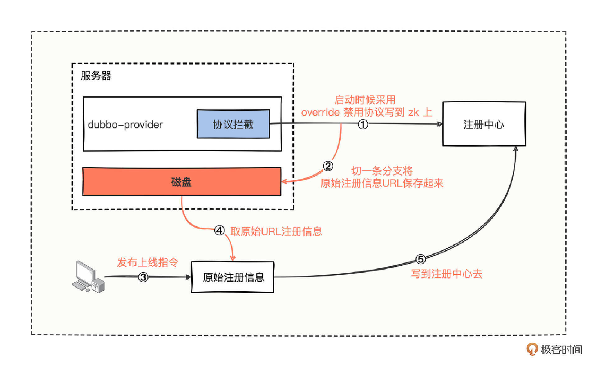

# 27｜协议扩展：如何快速控制应用的上下线？
你好，我是何辉。今天我们学习Dubbo拓展的最后一篇，协议扩展。

很多公司使用 Dubbo 的项目，可能都在使用 dubbo-admin 控制台进行应用的上下线发布。如果你是小量应用，这款平台非常好用，可是如果要处理四五百个系统甚至上千个系统的上下线发布，你很可能会遇到控制台页面数据更新混乱的情况，极端情况下，还会导致应该上线的没有上线，就像莫名其妙少了几台机器提供服务一样。

这个问题关键在于发布期间大批系统集中进行上下线发布，这意味着 ZooKeeper 注册中心的目录节点，时刻在发生变化。而 dubbo-admin 是个管理功能的控制台系统，自然就会监听 ZooKeeper 上所有系统目录节点。

所以， **短时间内 dubbo-admin 的内存数据急剧变化**，就极可能造成页面刷新不及时，本应该展示的没有展示，或者不应该展示的又因状态更新不及时展示了，最终导致批量误操作之类的行为，影响发版节奏，我们无法快速确保系统的哪些节点发布上线了，哪些节点没有发布上线。

考虑到这个情况，你的小组经过商讨后，最终决定要把应用的上下线稍微改造一下，想办法让 dubbo-admin 控制台的内存数据变更缓慢点，或者直接舍弃 dubbo-admin 控制台。

这个需求，你会怎么处理呢？

## 去掉缓存

我们一步一步想。现在页面读取的是 dubbo-admin 的缓存数据，如果把这个缓存去掉呢？

貌似可行。可是如果去掉缓存，意味着控制台页面的数据渲染，得实时拉取注册中心的数据，这样一来，页面渲染会变慢，搞不好还会造成页面卡顿，另一方面这又无形中给注册中心带来了大量的读操作的压力。

看来去掉缓存会徒增烦恼，这条路不可行。

## 去掉控制台

但是，现在我们的感觉是，去掉缓存会增加烦恼，不去掉缓存还是一样会遇到问题。那干嘛还需要这个控制台呢，不如把控制台去掉？

这的确是个大胆的想法。但是， **如果不需要控制台，那我们怎么操作应用的上线和下线呢？** 顺着这个问题，我们继续思考，上线和下线到底是在操作什么东西呢？

我们从 dubbo-admin 控制台上的“下线”按钮一路跟踪到源码，结果发现最终调用了这样一段代码。

```java
public void disableProvider(Long id) {
	// 省略了其他代码
	Provider oldProvider = findProvider(id);
	if (oldProvider == null) {
		throw new IllegalStateException("Provider was changed!");
	}

	if (oldProvider.isDynamic()) {
		// 保证disable的override唯一
		if (oldProvider.isEnabled()) {
			Override override = new Override();
			override.setAddress(oldProvider.getAddress());
			override.setService(oldProvider.getService());
			override.setEnabled(true);
			override.setParams("disabled" + "=true");
			overrideService.saveOverride(override);
			return;
		}
		// 省略了其他代码
	} else {
		oldProvider.setEnabled(false);
		updateProvider(oldProvider);
	}
}

```

看完这段代码，我们恍然大悟，所谓的服务“下线”，就是把指定的服务接口设置了 enable=true、disabled=true 两个变量，同时协议变成 override 协议，然后把这串 URL 信息写到注册中心去，就完成了“下线”操作。

一旦下线操作完成，提供方在注册中心的目录会发生变更，消费方就能感知到提供方下线了，消费方就会从自身的集群扩展器中，把这个下线节点的 invoker 从内存中剔除，然后就不能再向这个下线的提供方发起调用了。

原来控制台的下线操作看起来这么简单，就是向注册中心写一条 URL 信息， **我们好像还真可以干掉控制台，下线的时候直接把这串信息写到注册中心去就行了。**

不过，我们手动操作注册中心下线了，等系统重新启动，同样又会把接口写到注册中心，消费方又可以调用了，那这个重新启动之前的下线操作岂不是没什么作用？

这时，联想之前学过的拦截操作，我们可以在系统重启的时候，直接以下线的命令写到注册中心，这样，消费方会认为没有可用的提供方，等提供方认为时机成熟，自己再想办法重新上线，应该就可以了。

思路感觉可行，我们梳理下，主要分为 3 步。

- 第一步，手动操作应用的下线操作，完全模拟控制台的 override 协议 + enable=true + disabled=true 三个主要因素，向注册中心进行写操作。
- 第二步，重新启动应用，应用的启动过程中会把服务注册到注册中心去，我们需要拦截这个注册环节的操作，用第一步的指令操作取而代之，让提供方以毫无存在感的方式默默启动成功。
- 第三步，找个合适的时机，想办法把应用上线，让消费方感知到提供方的存在，然后消费方就可以向提供方发起调用了。

针对第一步，我们从 dubbo-admin 的控制台已经弄到了代码，可以很简单地把 URL 信息写到注册中心去。

针对第二步，该怎么拦截呢？回忆前面学过的“ [发布流程](https://time.geekbang.org/column/article/620988)”，提供方服务的导出是从 protocolSPI.export 这样代码开始的，然后进行了本地导出和远程导出，在远程导出的环节中，顺便开启了 Netty 服务和向注册中心注册服务。

所以，我们可以考虑扩展 Protocol 接口，如果是 registry 注册协议，就尝试拦截一下，把步骤一操作执行下去，就相当于在启动的过程中把自己禁用。

针对第三步，怎么操作上线呢？系统启动成功后，曾经正常需要写到注册中心的数据已经不知道了，要是我们能想办法在第二步拦截的时候，顺便把曾经需要注册的原始信息保存起来，是不是就可以了呢？

想法是挺好的，可是保存在哪里会比较合适呢？而且这些注册的原始信息，在应用每次启动的时候都会生成一份新的，所以说重要倒也不那么重要。

- 如果保存到当前机器以外的存储媒介，得考虑外部存储媒介的稳定性。
- 如果保存到当前机器，如果应用能正常启动，想必机器的磁盘一定程度是稳定可靠的，如果连应用都无法启动，根本就轮不到保存原始信息了。

所以综合考虑，我们可以把这些原始信息保存到当前机器的磁盘文件中。

## 协议扩展

一通分析后，我们总结一下，可以绘出大概流程图。



可以把流程归纳出 5 个重要的环节。

- 进行协议拦截，主要以禁用协议的方式进行接口注册。
- 在拦截协议的同时，把原始注册信息 URL 保存到磁盘文件中。
- 待服务重新部署成功后，利用自制的简单页面进行简单操作，发布上线指令操作。
- 发布上线的指令的背后操作，就是把对应应用机器上磁盘文件中的原始注册信息 URL 取出来。
- 最后利用操作注册中心的工具类，把取出来的原始注册信息 URL 全部写到注册中心。

有了这关键的五个环节，针对系统协议拦截环节的代码实现，应该就不是很难了，你可能会写出这样的代码。

```java
///////////////////////////////////////////////////
// 禁用协议包装器
///////////////////////////////////////////////////
public class OverrideProtocolWrapper implements Protocol {
    private final Protocol protocol;
    private Registry registry;
    // 存储原始注册信息的，模拟存储硬盘操作
    private static final List<URL> UN_REGISTRY_URL_LIST = new ArrayList<>();
    // 包装器的构造方法写法
    public OverrideProtocolWrapper(Protocol protocol) {
        this.protocol = protocol;
    }

    @Override
    public <T> Exporter<T> export(Invoker<T> invoker) throws RpcException {
        // 如果是注册协议的话，那么就先注册一个 override 到 zk 上，表示禁用接口被调用
        if (UrlUtils.isRegistry(invoker.getUrl())) {
            if (registry == null) {
                registry = getRegistry(invoker);
            }
            // 注册 override url，主要是在这一步让提供方无法被提供方调用
            doRegistryOverrideUrl(invoker);
        }

        // 接下来原来该怎么调用还是接着怎么进行下一步调用
        return this.protocol.export(invoker);
    }

    private <T> void doRegistryOverrideUrl(Invoker<T> invoker) {
        // 获取原始接口注册信息
        URL originalProviderUrl = getProviderUrl(invoker);
        // 顺便将接口注册的原始信息保存到内存中，模拟存储磁盘的过程
        UN_REGISTRY_URL_LIST.add(originalProviderUrl);

        // 构建禁用协议对象
        OverrideBean override = new OverrideBean();
        override.setAddress(originalProviderUrl.getAddress());
        override.setService(originalProviderUrl.getServiceKey());
        override.setEnabled(true);
        override.setParams("disabled=true");

        // 将禁用协议写到注册中心去
        registry.register(override.toUrl());
    }
    // 获取操作 Zookeeper 的注册器
    private Registry getRegistry(Invoker<?> originInvoker) {
        URL registryUrl = originInvoker.getUrl();
        if (REGISTRY_PROTOCOL.equals(registryUrl.getProtocol())) {
            String protocol = registryUrl.getParameter(REGISTRY_KEY, DEFAULT_REGISTRY);
            registryUrl = registryUrl.setProtocol(protocol).removeParameter(REGISTRY_KEY);
        }
        RegistryFactory registryFactory = ScopeModelUtil.getExtensionLoader
                (RegistryFactory.class, registryUrl.getScopeModel()).getAdaptiveExtension();
        return registryFactory.getRegistry(registryUrl);
    }
    // 获取原始注册信息URL对象
    private URL getProviderUrl(final Invoker<?> originInvoker) {
        return (URL) originInvoker.getUrl().getAttribute("export");
    }
    @Override
    public <T> Invoker<T> refer(Class<T> type, URL url) throws RpcException {
        return protocol.refer(type, url);
    }
    @Override
    public int getDefaultPort() {
        return protocol.getDefaultPort();
    }
    @Override
    public void destroy() {
        protocol.destroy();
    }
}

///////////////////////////////////////////////////
// 提供方资源目录文件
// 路径为：/META-INF/dubbo/org.apache.dubbo.rpc.Protocol
///////////////////////////////////////////////////
com.hmilyylimh.cloud.protocol.config.ext.OverrideProtocolWrapper

///////////////////////////////////////////////////
// 资源目录文件
// 路径为：/dubbo.properties
// 只进行接口级别注册
///////////////////////////////////////////////////
dubbo.application.register-mode=interface

```

代码实现起来也比较简单，关注 4 个关键点。

- 在包装器的 export 方法中，仅针对注册协议进行禁用协议处理。
- 禁用协议主要关注 override 协议 + enable=true + disabled=true 三个重要参数。
- 尝试把原始注册信息存储起来，这里使用内存来存储，间接模拟存储磁盘的过程。
- 最后通过适当的协议转换操作，拿到具体操作 ZooKeeper 的注册器，然后把禁用协议写到 ZooKeeper 中去。

代码写完了后，你只需要按部就班执行一遍，启动注册中心 -> 启动提供方 -\> 启动消费方，就能看到消费方到底能否调通提供方。

当启动完消费方后，你就能在消费方这边看到无提供者的异常信息。

```java
java.lang.IllegalStateException: Failed to check the status of the service com.hmilyylimh.cloud.facade.demo.DemoFacade. No provider available for the service com.hmilyylimh.cloud.facade.demo.DemoFacade from the url consumer://192.168.100.183/com.hmilyylimh.cloud.facade.demo.DemoFacade?application=dubbo-27-protocol-ext-consumer&background=false&dubbo=2.0.2&interface=com.hmilyylimh.cloud.facade.demo.DemoFacade&methods=sayHello,say&pid=9676&qos.enable=false&register.ip=192.168.100.183&release=3.0.7&side=consumer&sticky=false&timestamp=1672484447818 to the consumer 192.168.100.183 use dubbo version 3.0.7
	at org.apache.dubbo.config.ReferenceConfig.checkInvokerAvailable(ReferenceConfig.java:545) ~[dubbo-3.0.7.jar:3.0.7]
	at org.apache.dubbo.config.ReferenceConfig.init(ReferenceConfig.java:293) ~[dubbo-3.0.7.jar:3.0.7]
	at org.apache.dubbo.config.ReferenceConfig.get(ReferenceConfig.java:219) ~[dubbo-3.0.7.jar:3.0.7]
	at org.apache.dubbo.config.utils.SimpleReferenceCache.get(SimpleReferenceCache.java:110) ~[dubbo-3.0.7.jar:3.0.7]
	at org.apache.dubbo.config.deploy.DefaultModuleDeployer.lambda$referServices$6(DefaultModuleDeployer.java:387) ~[dubbo-3.0.7.jar:3.0.7]
	at java.util.concurrent.ConcurrentHashMap$ValuesView.forEach(ConcurrentHashMap.java:4707) ~[na:1.8.0_92]
	at org.apache.dubbo.config.deploy.DefaultModuleDeployer.referServices(DefaultModuleDeployer.java:367) ~[dubbo-3.0.7.jar:3.0.7]
	at org.apache.dubbo.config.deploy.DefaultModuleDeployer.start(DefaultModuleDeployer.java:154) ~[dubbo-3.0.7.jar:3.0.7]

```

接下来只需要按照相应的操作，把提供方上线就行，模拟上线的代码我也写在这里了。

```java
public void online() {
    // 模拟取出之前保存的原始注册信息列表
    for (URL url : UN_REGISTRY_URL_LIST) {
        OverrideBean override = new OverrideBean();
        override.setAddress(url.getAddress());
        override.setService(url.getServiceKey());
        override.setEnabled(true);
        override.setParams("disabled=false");
        // 先取消禁用
        registry.register(override.toUrl());

        // 然后将原始的注册信息写到注册中心去即可
        registry.register(url);
    }
}

```

## 协议扩展的应用场景

到这里，相信你已经非常了解协议扩展的基本操作了，协议扩展除了可以处理上下线功能，还有哪些应用场景呢？我们看 3 个常用的案例。

第一，收集接口发布列表，当我们需要统计系统的接口是否都已经发布时，可以通过协议扩展的方式来统计处理。

第二，禁用接口注册，根据一些黑白名单，在应用层面控制哪些接口需要注册，哪些接口不需要注册。

第三，多协议扩展，比如当市场上冒出一种新的协议，你也想在 Dubbo 框架这边支持，可以考虑像 DubboProtocol、HttpProtocol 这些类一样，扩展新的协议实现类。

## 总结

今天，我们基于发布场景开始研究，在发布期间，大批量系统集中在 dubbo-admin 控制台进行上下线发布，发生了页面混乱问题，分析如何进行上下线改造。

如果去掉 dubbo-admin 控制台的缓存模块，会带来页面的加载缓慢，以及引发注册中心大量的读操作压力。

如果去掉控制台，我们深入研究控制台的一个简单“下线”按钮的操作，深挖出了下线的真实核心原理，通过指定 override 协议 + enable=true + disabled=true 三个重要因素，就能完成服务的下线操作。

借助这一下线的核心原理，我们可以针对协议进行拦截，把原始的注册信息暂时缓存起来，然后把 override 禁用协议写到 ZooKeeper 上。待提供方完全启动成功后，通过简单的页面操作，把原始的注册信息再次写到 ZooKeeper 上就完成了简单的服务上下线操作。

协议扩展的应用场景有收集接口发布列表、禁用接口注册、多协议扩展。

### 思考题

留个作业给你，现在你已经学会了如何进行协议扩展，以我们最为熟悉的 DubboProtocol 为例，DubboProtocol 是怎么根据接收的入参，找到对应的 Invoker 对象，来处理业务逻辑的呢？

期待在留言区看到你的思考，参与讨论。（这期的参考会发在加餐一的文末）

### 26 思考题参考

上一期留了个作业，研究下任务扔到线程池后，在任务真正执行之前和之后是否也可以扩展。

要想解答这个问题，光猜肯定是不行的，我们得实际点，既然不知道有没有扩展的口子，那就干脆去线程池的底层一看究竟。

去 ThreadPoolExecutor 的底层源码中，找到最核心执行任务的代码块。

```java
///////////////////////////////////////////////////
// java.util.concurrent.ThreadPoolExecutor#runWorker
// 工作线程执行任务的和核心方法
///////////////////////////////////////////////////
final void runWorker(Worker w) {
    Thread wt = Thread.currentThread();
    Runnable task = w.firstTask;
    w.firstTask = null;
    w.unlock(); // allow interrupts
    boolean completedAbruptly = true;
    try {
        // 每个工作线程都会尝试从阻塞队列中获取任务
        while (task != null || (task = getTask()) != null) {
            w.lock();
            // If pool is stopping, ensure thread is interrupted;
            // if not, ensure thread is not interrupted.  This
            // requires a recheck in second case to deal with
            // shutdownNow race while clearing interrupt
            if ((runStateAtLeast(ctl.get(), STOP) ||
                 (Thread.interrupted() &&
                  runStateAtLeast(ctl.get(), STOP))) &&
                !wt.isInterrupted())
                wt.interrupt();
            try {
                // 获取到任务之后，在任务真正执行之前进行了前置回调
                beforeExecute(wt, task);
                Throwable thrown = null;
                try {
                    // !!!!!!!!!!!!!!!!!!!!!!!!!!!!!
                    // 任务真正被触发执行的逻辑
                    task.run();
                } catch (RuntimeException x) {
                    thrown = x; throw x;
                } catch (Error x) {
                    thrown = x; throw x;
                } catch (Throwable x) {
                    thrown = x; throw new Error(x);
                } finally {
                    // 任务执行之后，同样在 finally 进行了后置回调
                    afterExecute(task, thrown);
                }
            } finally {
                task = null;
                w.completedTasks++;
                w.unlock();
            }
        }
        completedAbruptly = false;
    } finally {
        // 任务执行时候遇到了异常后会进入到这里，进行善后处理
        // 异常的善后，大致在经过代码权衡考虑判断后，来决定要不要创建一个新线程
        processWorkerExit(w, completedAbruptly);
    }
}

```

仔细研究线程池执行任务的这段核心方法，果然发现了一些意外的惊喜， **在任务执行之前回调了一个 beforeExecute 方法，在任务执行之后又回调了一个 afterExecute 方法。**

所以当你考虑自定义线程池的时候，可以尝试重写这 2 个方法，就算你什么也不做，打印点日志也是好的，因为你无法预估开发者在 run 方法中，会不会抛出一些未截获异常，导致找不到半点业务日志。

而一旦你在这里进行了异常日志打印，即使 run 方法遇到了未截获异常，将未知异常抛给了线程池本身，你也不用担心，因为你重写了这 2 个方法，横竖都会有日志提示出来，到时候你就只需要根据异常日志来排查，到底发生了什么样的未截获异常了。