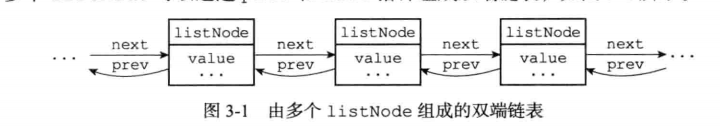
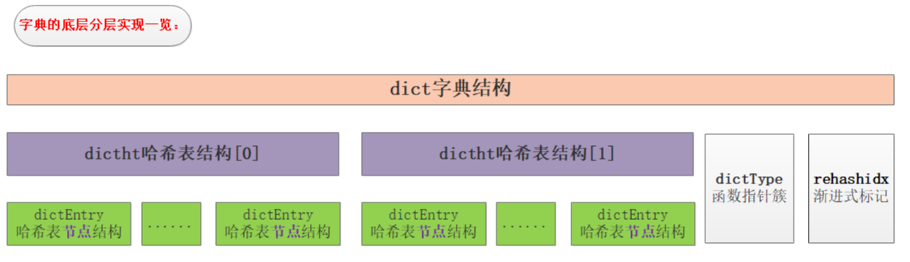
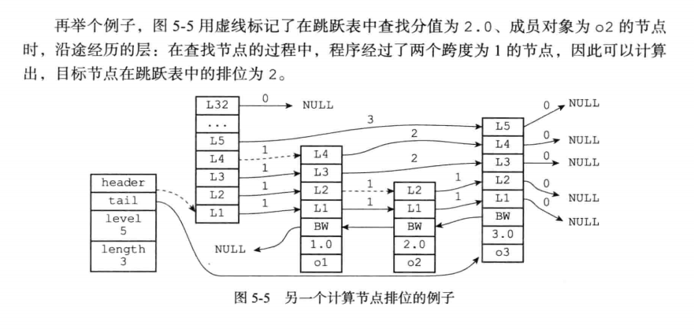
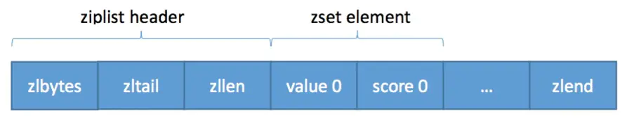
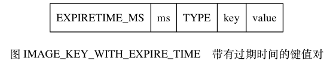
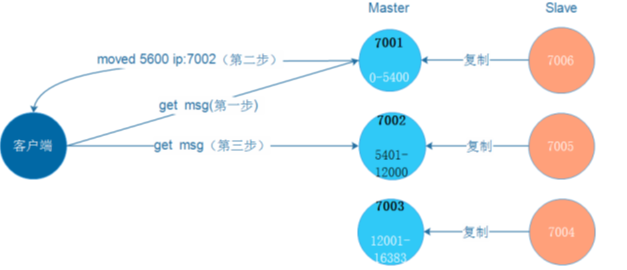
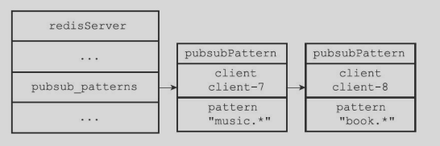
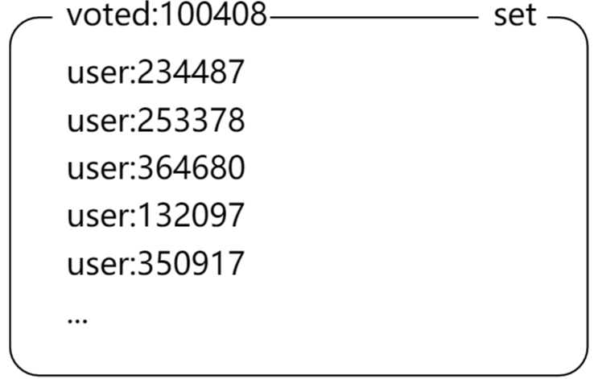

# Redis（Remote Dictionary Server） 

> 此版本为精简版，详细的可以看 Notes/Java/JavaNotes/Redis/Redis.md

[TOC]

## Redis 简介

**Redis 是一个高性能非关系型（NoSQL）键值对的内存数据库**，可以用在缓存、数据库、消息中间件等。**其中键的类型只能为字符串，值支持五种数据类型：字符串、列表、散列表、集合、有序集合**。

使用缓存 Redis 作用：

- 提高性能：缓存查询速度比数据库查询速度快（内存 VS 硬盘）
- 提高并发能力：缓存分担了部分请求支持更高的并发

## Redis 是单进程单线程的原因

注意：redis 单线程指的是**网络请求模块使用了一个线程，即一个线程处理所有网络请求**，其他模块仍用了多个线程。

==**Redis 是单进程单线程的，Redis 利用队列技术将并发访问变为串行访问，消除了传统数据库串行控制的开销。**==

多线程处理会涉及到锁，而且多线程处理会涉及到线程切换而消耗 CPU。因为 CPU 不是 Redis 的瓶颈，Redis 的瓶颈最有可能是机器内存或者网络带宽。既然单线程容易实现，而且 CPU 不会成为瓶颈，那就顺理成章地采用单线程的方案了。单线程无法发挥多核 CPU 性能，不过可以通过在单机开多个 Redis 实例来解决。

## Redis 为什么这么快

- **完全基于内存，绝大部分请求是纯粹的内存操作，内存的读取速度非常快速**。数据存在内存中，类似于 HashMap，HashMap 的优势就是查找和操作的时间复杂度都是O(1)；

- 数据结构简单，对数据操作也简单，Redis 中的数据结构是专门进行设计的；

- **采用单线程，避免了不必要的上下文切换和竞争条件，也不存在多进程或者多线程导致的切换而消耗 CPU**，不用去考虑各种锁的问题，不存在加锁释放锁操作，没有因为可能出现死锁而导致的性能消耗；

- 使用多路I/O复用模型，可以处理并发的连接；保证在多连接的时候， 系统的高吞吐量。

    https://mp.weixin.qq.com/s?__biz=MzI4Njc5NjM1NQ==&mid=2247488320&idx=1&sn=2b8f1ffc06553d1e43419bc1958c61d1&chksm=ebd62c6cdca1a57af0dfbbe4ac41da68d894ac2913028929b0b65329811d76786c9113308046&scene=21#wechat_redirect

    **多路指的是多个 socket 连接即多个连接，复用指的是复用一个线程**。多路复用主要有三种技术：select，poll，epoll。epoll是最新的也是目前最好的多路复用技术。采用多路 I/O 复用技术可以让单个线程高效的处理多个连接请求（尽量减少网络IO的时间消耗），且Redis在内存中操作数据的速度非常快（内存内的操作不会成为这里的性能瓶颈），主要以上两点造就了Redis具有很高的吞吐量。

    >非阻塞IO 内部实现采用 epoll，采用了epoll+自己实现的简单的事件框架。epoll中的读、写、关闭、连接都转化成了事件，然后利用epoll的多路复用特性，绝不在io上浪费一点时间。

- 使用底层模型不同，它们之间底层实现方式以及与客户端之间通信的应用协议不一样，Redis直接自己构建了VM 机制 ，因为一般的系统调用系统函数的话，会浪费一定的时间去移动和请求；

## 二、Redis 整体存储结构

- redis 的存储结构从外层往内层依次是 `RedisDb`、`dict`、`dictht`、`dictEntry`。
- redis 的 Db 默认情况下有15个，每个 redisDb 内部包含一个 dict 的数据结构。
- redis 的 dict 内部包含 2 个 dictht 的数组，主要用于 hash 扩容使用。
- dictht 内部包含 dictEntry 的数组，可以理解就是 hash 的桶，然后如果冲突通过挂链法解决。


## 三、Redis 数据结构和对象

### （一）简单动态字符串(SDS：Simple Dynamic String)

- Redis 没有使用 C 语言提供的传统字符串，而是构建了一套 SDS 作为自身默认字符串表示。

    **C 字符串只会作为字符串字面量用在一些无须对字符串值进行修改的地方，如打印日志**，其他字符串键值对、缓冲区（如 AOF 缓冲区和客户端状态中的输入缓冲区）都是使用 SDS 实现。

- SDS 的定义结构

    ```c
    struct sdshdr{
        int len;     // 记录 buf 数组中已使用字节的数量（即 SDS 保存字符串的长度）
        int free;    // 记录 buf 数组中未使用字节的数量
        char buf[];  // 保存字符串的字符数组
    }
    ```

    每个字符串后面仍然保存一个 `\0`，但是不算在 len 长度中。这样 SDS 可以用 C 字符串函数（两者都是使用 N + 1 长度的字符数组来表示长度为 N 的字符串）。

- SDS 和 C 字符串的区别
    - **常数复杂度获取字符串长度**

      - SDS 的 len 属性中记录了自身的长度，所以获取 SDS 长度的命令 STRLEN 命令的时间复杂度为：`O(1)`【C 中为 `O(N)`】；同时设置和更新 SDS 长度工作由  SDS 的 API 执行时候自动完成，无须手动修改。
      - 优势：**确保获取字符串长度不会成为 Redis 的性能瓶颈。所以很长的字符串键反复执行 STRLEN 命令时间复杂度仍是：O(1)；**

    - **杜绝缓冲区溢出**

        - C 字符串不记录自身长度会造成缓冲区溢出（buffer overflow），例如执行 strcat 拼接字符串，如果没有提前分配足够空间，会造成溢出到别的数据空间，覆盖掉别的数据。
        - SDS API 修改前会**自动检查空间是否满足**，不满足就会扩展到需要的大小，然后执行。

    - **减少修改字符串时候带来的内存重分配次数**

      因为内存重分配算法较为复杂，会执行系统调用，比较耗时，同时 Redis 经常用于速度要求严格、数据被频繁修改的场合。

      - C 字符串的长度和底层数组的长度之间存在关联（N 个字符使用 N + 1 个长度空间），所以每次增长或者缩短 C 字符串都会进行内存重分配。即增长字符串，则执行前先通过内存重分配来拓展底层数组空间的大小否则会缓冲区溢出，如果缩短则释放不使用空间，防止内存泄漏。

      - SDS 中通过未使用空间从而解除了字符串长度和底层数组长度之间的关联。即不再是 N + 1 了。通过未使用空间， SDS 实现了**空间预分配和惰性空间释放**两种优化策略。

        - **1）空间预分配【针对增长字符串的情况】**
          SDS 不仅会分配足够的空间用于增长，还会预分配未使用空间。
          分配的规则是，如果增长字符串修改后，新的字符串（len 属性值）比 1MB 小，则额外申请字符串当前所占空间的大小作为 free 值（即 len 值和 free 值相同），即 buf 数组总长度为 len + free + 1（空字符）；如果增长后，字符串长度超过 1MB，则额外申请 1MB 大小。

          这样**避免了 Redis 在连续执行字符串增长情况下频繁申请空间的情况**。每次字符串增长之前，SDS 会先检查空间是否足够（如上次增长分配的空闲够就不在分配），如果足够则直接使用预分配的空间，否则按照上述机制申请使用空间。所以连续增长 N 次字符串所需要的内存重分配是最多 N 次。

        - **2）懒惰空间释放**
          懒惰空间释放用于优化 SDS 字符串缩短的操作。当需要缩短 SDS 的长度时，并不立即释放空间，而是使用  free 来保存剩余可用长度，并等待将来使用。当有剩余空间，而有增长字符串操作时，则又会调用空间预分配机制。当 Redis **内存空间不足时，会自动释放 SDS 中未使用的空间**，因此也不需要担心内存泄漏问题。

    - **二进制安全**

        C 字符串中不能包括空字符，否为会被认为是字符串结尾，所以只能保存文本数据，不能保存：图片、音频、视频、压缩文件等二进制文件。
        SDS 的 API 都是二进制安全的： 所有 SDS API 都会以处理二进制的方式来处理 SDS 存放在 buf 数组里的数据， 程序不会对其中的数据做任何限制、过滤、或者假设 —— 数据在写入时是什么样的， 它被读取时就是什么样。
        SDS 的 buf 属性属于**字节数组**=》Redis 不会用这个数组来保存字符，而是用于保存一系列二进制数据。
          **sds考虑字符串长度，是通过len属性来判断字符串是否结束，而不是通过\0来判断。**

    - **兼容部分C语言字符串函数**

        Redis 兼容 c 语言对于字符串末尾采用 `\0` 进行处理，这样使得其可以复用部分 c 语言字符串函数的代码，实现代码的精简性。

### （二）链表

- 列表键的底层之一是链表。（底层也有可能是压缩列表）
    当列表键包含了许多元素，或者元素是比较长的字符串的时候，就会用到链表作为列表键的底层实现。

- 链表节点结构

    ```c
    /*
     * 双端链表节点
     */
    typedef struct listNode {
        // 前置节点
        struct listNode *prev;
        // 后置节点
        struct listNode *next;
        // 节点的值
        void *value;
    } listNode;
    ```

    其中 prev 指向前一个节点，next 指向后一个节点，value 存储着节点本身的值。多个 listNode 组成**双向链表**，如下图所示：
     

- 整体链表结构

    ```c
    /*
     * 双端链表结构
     */
    typedef struct list {
        // 表头节点
        listNode *head;
        // 表尾节点
        listNode *tail;
        // 节点值复制函数
        void *(*dup)(void *ptr);
        // 节点值释放函数
        void (*free)(void *ptr);
        // 节点值对比函数
        int (*match)(void *ptr, void *key);
        // 链表所包含的节点数量
        unsigned long len;
    } list;
    ```


- Redis 的链表特性如下：
    - 双向：每个 listNode 节点带有 prev 和 next 指针，可以找到前一个节点和后一个节点，具有双向性。
    - 无环：list 链表的 head 节点的 prev 和 tail 节点的 next 指针都是指向 null。
    - 带表头指针和尾指针：即上述的 head 和 tail，获取头指针和尾指针的时间复杂度 O(1)。
    - ==带链表长度计数器==：即 list 的 len 属性，记录节点个数，因此获取节点个数的时间复杂度 O(1)。

    - 多态：链表使用 void* 指针来保存节点的值，可以通过 list 的 dup、free、match 三个属性为节点值设置类型特定函数，==**所以链表可以用于保存不同类型的值**==。

### （三）字典（符号表，关联数组，映射）

- 字典是一种保存键值对的抽象数据结构。

    - **对 Redis 数据库的增删改查就是通过字典实现的。即 redis 数据库的存储，和大部分关系型数据库不同，不采用 B+tree 进行处理，而是采用 hash 的方式进行处理。**

    - 字典还是哈希键的底层实现之一。当哈希键包含了许多元素，或者元素是比较长的字符串的时候，就会用到字典作为哈希键的底层实现。

- 字典的实现

    

    dictEntry 和 dictht 可以看成一个 HashMap 来理解（虽然不完全一样）。

    redis 的字典底层是使用哈希表实现，每个哈希表有多个哈希节点，每个哈希节点保存了一个键值对。

    - 关于 dictEntry：【哈希表的每个结点】

        dictEntry 是哈希表节点，**即存储数据地方**，其包括三个指针：`key` 保存着键值对中的键，`v` 保存着键值对中的值（值可以是一个指针或者是 `uint64_t` 或者是 `int64_t`）。`next` 是指向另一个哈希表节点的指针，这个指针可以将多个哈希值相同的键值对连接在一次，以此来解决哈希冲突的问题；

        ```c
        /*
         * 哈希表节点
         */
        typedef struct dictEntry {
            // 键
            void *key;
            // 值
            union {
                void *val;
                uint64_t u64;
                int64_t s64;
            } v;
            // 指向下个哈希表节点，形成链表
            struct dictEntry *next;
        } dictEntry;
        ```

        哈希表节点如下图（左边第一列是哈希表结构，表节点结构从左边第二列开始）所示：
            

    - 关于dictht 结构：【哈希表结构】

        ```c
        /*
         * 哈希表
         *
         * 每个字典都使用两个哈希表，从而实现渐进式 rehash 。
         */
        typedef struct dictht {
            // 哈希表数组
            dictEntry **table;
            // 哈希表大小
            unsigned long size;
            // 哈希表大小掩码，用于计算索引值
            // 总是等于 size - 1
            unsigned long sizemask;
            // 该哈希表已有节点的数量
            unsigned long used;
        } dictht;
        ```

        哈希表包括的成员有 `table`、`size`、`used`、`sizemask`。每个字典都使用两个哈希表，从而实现渐进式 rehash 。

        - `table` 是一个数组，数组中的每个元素都是一个指向 `dictEntry` 结构的指针， 每个 `dictEntry` 结构保存着一个键值对；
        - `size` 属性记录了哈希表 `table` 的大小；
        -  `used`属性则记录了哈希表目前已有节点（已使用）的数量。
        - `sizemask` 等于 `size-1`，用于和哈希值计算一个键在`table`数组的索引（即位置）。

    - 关于dict

        ```c
        /*
         * 字典
         */
        typedef struct dict {
            // 类型特定函数
            dictType *type;
            // 私有数据
            void *privdata;
            // 哈希表
            dictht ht[2];
            // rehash 索引
            // 当 rehash 不在进行时，值为 -1
            int rehashidx; /* rehashing not in progress if rehashidx == -1 */
            // 目前正在运行的安全迭代器的数量
            int iterators; /* number of iterators currently running */
        } dict;
        ```

        dict 结构体就是字典的定义，包含的成员有 `type`，`privdata`、`ht`、`rehashidx`。

        -  `dictType` 指针类型的 `type` 指向了操作字典的 api，即处理特定类型的处理函数；
        - `ht`是包含 2 个 `dictht` 的数组，也就是字典包含了 2 个哈希表一般情况下只是用 ht[0]，只有在对 ht[0] 进行 rehash 时，才会使用 ht[1]。
        - `rehashidx` 是进行 `rehash` 时使用的变量；
        - `privdata` 配合`dictType` 指向的函数作为参数使用。


    完整的字典结构如下图所示：


- 哈希算法

    要将新的键值对加到字典，程序要先对键进行哈希算法，算出**哈希值和索引值，再根据索引值，把包含新键值对的哈希表节点放到哈希表数组指定的索引上。**

    redis 实现哈希的代码是：

    ```c
    hash = dict -> type -> hashFunction(key); // 采用 murmurhash2算法，是一种非加密型hash算法，快速
    index = hash & dict -> ht[x].sizemask;
    ```

    算出来的结果中，index 的值是多少，则 key 会落在 table 里面的第 index 个位置（第一个位置 index 是 0 ）。

- 键冲突解决

    当两个或者以上的键被分配到哈希表数组的同一个索引上，则称这些键发生了冲突。

    为了解决此问题，redis 采用链地址法。被分配到同一个索引上的多个节点可以用单链表连接起来。

    因为 dictEntry 节点组成的链表中没有指向尾节点的指针，所以总是将新节点加在表头的位置，排在其它已有节点前面。（O(1)时间）

-  rehash（重新散列）

    - rehash 条件：负载因子（load factor）计算：`load_factor =ht[0].used / ht[0].size`，即负载因子大小等于当前哈希表的键值对数量除以当前哈希表的大小。

    - 哈希表的拓展和收缩
        - 扩展：当以下任一条件满足，哈希表会自动进行扩展操作：
            - 服务器目前没有在执行 BGSAVE 或者 BGREWRITEAOF 命令，且负载因子大于等于 1；
            - 服务器目前正在在执行 BGSAVE 或者 BGREWRITEAOF 命令，且负载因子大于等于 5；  
        - 收缩：当负载因子小于 0.1 时，Redis 自动开始哈希表的收缩工作。  

    - 哈希表保存的键值对数量是动态变化的，为了让哈希表的负载因子维持在一个合理的范围之内，就需要对哈希表进行扩缩容。有两种方式：

        - 普通 Rehash 重新散列

            扩缩容是通过执行 rehash 重新散列来完成，对字典的哈希表执行普通 rehash 的基本步骤为**分配空间->逐个迁移->交换哈希表**，详细过程如下：

            - 为字典的 `ht[1]` 哈希表分配空间，分配的空间大小取决于要执行的操作以及 `ht[0]` 当前包含的键值对数量（ht[0].used）：
                - 扩展操作时 `ht[1]`  的大小为第一个大于等于 `ht[0].used * 2` 的 `2^n` 的值；**扩容为原来的两倍**。
                - 收缩操作时 `ht[1]` 的大小为第一个大于等于 `ht[0].used` 的 `2^n` 的值；
            - 将保存在 `ht[0]` 中的所有键值对重新计算键的哈希值和索引值 `rehash` 到 `ht[1]`上；即对每个键重新采用哈希算法的方式计算哈希值和索引值，再放到相应的 `ht[1]` 的表格指定位置。 
            - 重复 `rehash` 直到 `ht[0]`包含的所有键值对全部迁移到了 `ht[1]` 之后释放 `ht[0]`， 将 `ht[1]` 设置为 `ht[0]`，并在 `ht[1]`新创建一个空白哈希表，为下一次 rehash 做准备。

        - ==渐进式 rehash 过程==

            Redis 的 rehash 动作为分次完成，原因在于键值对数量很大时， 一次性 rehash 到 `ht[1]` 可能会导致服务器在一段时间内停止服务。Redis 采用了渐进式 rehash，过程的详细步骤：

            - 为 `ht[1]` 分配空间，让字典同时持有 `ht[0]`和 `ht[1]` 两张哈希表；
            - 将字典中维持的一个索引计数器变量 rehashidx 设置为 0，表示 rehash工作正式开始，同时这个 rehashidx 是递增的，从 0 开始表示从数组第一个元素开始 rehash。
            - 在 rehash 进行期间，每次对字典执行增删改查操作时，顺带将 `ht[0]` 哈希表在 `rehashidx` 索引上的键值对 `rehash` 到 `ht[1]`，完成后将 `rehashidx` 加 `1`，指向下一个需要 `rehash` 的键值对。

            - 随着字典操作的不断执行，最终 `ht[0]` 的所有键值对都会被 `rehash` 至 `ht[1]`，再将 `rehashidx` 属性的值设为 `-1` 来表示 `rehash` 操作已完成。

        渐进式 rehash 的思想在于将 rehash 键值对所需的计算工作分散到对字典的每个添加、删除、查找和更新操作上，从而避免了集中式 rehash 而带来的阻塞问题。

        在 rehash 期间，对哈希表的查找、修改、删除会在两个哈希表上进行，即会先在 `ht[0]` 进行。如果 `ht[0]` 中没找到相应的内容，则会去 `ht[1]` 查找，并进行相关的修改、删除操作。**而增加的操作，会直接增加到`ht[1]` 中，目的是让 `ht[0]` 只减不增，加快迁移的速度。**

### （四）跳跃表

- 跳跃表（skiplist）是一种**有序**的数据结构，它通过每个节点中维持多个指向其他节点的指针，从而实现快速访问。 跳跃表平均O(logN)，最坏O(N)，支持顺序遍历查找。 

- 在 Redis 中，**有序集合**（sortedset）的其中一种实现方式就是跳跃表。当有序集合中的元素较多，或者集合中的元素是比较长的字符串，则会使用跳跃表来实现。

- 跳跃表实现

    跳跃表是由各个跳跃表节点组成。数据保存在一个跳跃表中，每个数据以跳跃表节点的形式存在；每一个跳跃表结点结构如下：

    ```c
    /*
     * 每一个跳跃表节点结构
     */
    typedef struct zskiplistNode {
        // 成员对象
        robj *obj;
        // 分值
        double score;
        // 后退指针
        struct zskiplistNode *backward;
        // 层
        struct zskiplistLevel {
            // 前进指针
            struct zskiplistNode *forward;
            // 跨度
            unsigned int span;
        } level[];
    } zskiplistNode;
    ```

    跳跃表的整体结构如下：

    ```c
    /*
     * 跳跃表的整体结构
     * zkipList 保存跳跃表节点的相关信息：就是跳跃表结构最前面的一列
     因此，获取跳跃表的表头、表尾、最大层数、长度的时间复杂度都是O(1)。
     */
    typedef struct zskiplist {
        // 跳跃表头节点和跳跃表尾节点
        struct zskiplistNode *header, *tail;
        // 表中跳跃节点的数量，即跳跃表的长度（不含头结点）
        unsigned long length;
        // 表中层数最大的节点的层数（不含头结点）
        int level;
    } zskiplist;
    ```


- 跳跃表节点属性：
    - **层：**节点中用 L1，L2 表示各层，每个层都有两个属性，前进指针（forward）和跨度（span）。每个节点的层高是 1 到 32 的随机数； 

    - **前进指针：**用于访问表尾方向的节点，便于跳跃表正向遍历节点的时候，查找下一个节点位置；

    - **跨度：**记录前进指针所指的节点和当前节点的距离，**用于计算排位**，访问过程中，将沿途访问的所有层的跨度累计起来，得到的结果就是跳跃表的排位。 

    - **后退指针：**节点中用 BW 来表示，其指向当前节点的前一个节点，用于反向遍历时候使用，每次只能后退至前一个节点。 

    - **分值：**各节点中的数字就是分值，跳跃表中，节点**按照分值从小到大排列**。

    - **成员对象：**各个节点中，o1，o2 是节点所保存的成员对象。是一个指针，指向一个字符串对象。 
        - 表头节点也有后退指针，分值，成员对象，因为不会被用到，所以图中省略。  

        - 分值可以相同，成员对象必须唯一。

        - 分值相同时，按照成员对象的字典序从小到大排。

**跨度用来计算排位：**



 **总结**：

- 跳跃表是有序集合的底层实现之一；
- Redis 的跳跃表表示有 zskiplist（保存跳跃表信息，如表头节点、表尾节点、长度） 和 zskiplistNode（表示跳跃表节点） 两个结构组成。
- 每个跳跃表节点的层高都是 1 到 32 之间的随机数。
- 在同一个跳跃表中，多个节点可以包含相同的分值，但是每个节点的成员对象必须是唯一的。
- 跳跃表中的节点按照分值大小进行排序，当分值相同的时候，节点按照成员对象的大小进行排序。

与红黑树等平衡树相比，跳跃表具有以下优点：

- 插入速度非常快速，因为不需要进行旋转等操作来维护平衡性；
- 更容易实现；
- 支持无锁操作。

### （五）整数集合（intset）

- 整数集合（intset）是**集合键**的底层实现之一，**当一个集合只包含整数值元素，并且这个集合的元素数量不多时，Redis 就会使用整数集合作为集合键的底层实现**。它可以保存类型为 `int16_t`、`int32_t` 或者 `int64_t` 的整数值，**并且保证集合中不会出现重复元素**。

- 如果 content 数组中保存 5 个的都是 `int16_t` 类型的整数值，则该数组大小为：`sizeof(int16_t) * 5 = 16 * 5 = 80位`。contents 数组是整数集合的底层实现：整数集合的每个元素都是 contents 数组的一个数组项，各个项在数组中按值的大小**从小到大有序地排列**，并且数组中**不包含任何重复项**。

    ```c
    typedef struct intset {
        // 编码方式
        uint32_t encoding;
        // 集合包含的元素数量，即数组长度
        uint32_t length;
        // 保存元素的数组；该数组的真正类型取决于 encoding 的属性。
        int8_t contents[];
    } intset;
    ```


- 整数集合升级

    当添加的新元素的类型比整数集合现有所有元素的的类型都要长时，整数集合需要先进行升级，然后才能将新元素添加到整数集合里面。

    - 步骤一：根据新元素的类型，**扩展整数集合底层数组的空间大小**，并为新元素分配空间。

    - 步骤二：将底层数组**现有的所有元素都转换成与新元素相同的类型**，并将类型转换后的元素放置到正确的位上（**从后往前**），而且在放置元素的过程中，需要继续位置底层数组的有序性质不变。

    - 步骤三：将**新元素添加到底层数组**里面。

    - 步骤四：将 encoding 属性更改为新的元素的属性值。

- 整数集合添加新元素的时间复杂度为O(N)，因为每次添加新元素都可能引起升级，每次升级都需要对底层数组已有元素进行类型转换。因为引发升级的新元素长度总是比集合中所有元素长度都长，所以总是大于/小于集合中所有现有元素，所有它的位置要么是0要么是length-1。所以新元素拜访位置比较好确定。

- **升级的好处：**
    - 提升整数集合的灵活性，可以随意将 int16，int32，int64的值放入集合，不用担心类型错误。

    - 尽可能地**节约内存**

- **降级：整数集合不支持降级操作**

### （六）压缩列表

- 压缩列表（ziplist）是**列表键和哈希键**的底层实现之一。

- **当一个列表键只包含少量列表项，并且每个列表项要么就是小整数值，要么就是长度比较短的字符串**，那么 Redis 就会使用压缩列表来做列表键的底层实现。

- 压缩列表的构成

    压缩列表是 Redis  为了节约内存而开发的，是由一系列特殊编码的**连续内存块组成的顺序型数据结构**。**压缩列表中可以包括任意个节点（Entry），每个节点可以保存一个字节数组或者一个整数值**。一个压缩列表有以下部分组成及其对应说明：


| 属性      | 类型       | 长度     | 用途                                                         |
| :-------- | :--------- | :------- | :----------------------------------------------------------- |
| `zlbytes` | `uint32_t` | `4` 字节 | 记录整个压缩列表**占用的内存字节数**：在对压缩列表进行内存重分配， 或者计算 `zlend` 的位置时使用。 |
| `zltail`  | `uint32_t` | `4` 字节 | 记录压缩列表表尾节点距离压缩列表的起始地址有多少字节： 通过这个**偏移量**，程序无须遍历整个压缩列表就可以确定表尾节点的地址。 |
| `zllen`   | `uint16_t` | `2` 字节 | 记录了压缩列表包含的**节点数量**： 当这个属性的值小于 `UINT16_MAX` （`65535`）时， 这个属性的值就是压缩列表包含节点的数量； 当这个值等于 `UINT16_MAX` 时， 节点的真实数量需要遍历整个压缩列表才能计算得出。 |
| `entryX`  | 列表节点   | 不定     | 压缩列表包含的各个节点，节点的长度由节点保存的内容决定。     |
| `zlend`   | `uint8_t`  | `1` 字节 | 特殊值 `0xFF` （十进制 `255` ），用于标记压缩列表的末端。    |

- 每个压缩列表节点的构成


- `previous_entry_length`：记录了压缩列表中**前一个节点的长度**。（以字节为单位），可根据当前节点的起始地址来计算出前一个节点的起始地址。从而实现从表尾遍历到表头。

- `encoding`：记录了节点的 content 属性所保存**数据的类型以及长度**。

- `content`：负责保存节点的值，值可以是**字节数组**或者**整数**。

- 连锁更新：

> 就是比如有连续的几个节点长度都是在 250-253 字节之间，在他们之前插入一个大于 254 长度的节点，导致后面的原来节点 previous_entry_length 变成五个字节，这样该元素整体长度变成 》 254，又导致后面变化。**删除节点也可能引起**，如大小 250-253，删除小的之后，后面的节点的前驱节点变成大的了，逻辑同上。

由于`previous_entry_length` 可能是一个或者五个字节，所有插入和删除操作带来的连锁更新在最坏情况下需要对压缩列表执 行N次空间重分配操作，而每次空间重分配的最坏复杂度为 O(N)，所有连锁更新的最坏复杂度为 O(N^2)。

但连锁更新的条件比较苛刻，而且压缩列表中的数据量也不会太多，因此不需要注意性能问题，平均复杂度仍然是 O(N)。

 

## 四、数据结构（对象）

- Redis 基于上述的数据结构创建了一个对象系统，包含字符串对象、列表对象、哈希对象、集合对象、有序集合对象。Redis 在执行命令之前会根据对象类型来判断一个对象是否可以执行给定的命令。针对不同的场景，**每个对象可以选择底层不同的数据结构实现，提升效率**。 
- 实现了基于引用计数的内存回收机制。同时通过引用计数实现了**对象共享机制**，该机制可以让多个数据库键共享同一个对象来节约内存。
- Redis 中对象带有访问时间记录信息，该信息用于计算数据库键的空转时间，如果启动 maxMemory 功能，空转时间较长的键会被优先删除。 

### 对象的类型与编码

Redis 使用对象来表示数据库中的键和值。所以键值对就是相当于两个对象。

```c
/* 
 * Redis 对象结构 
 */  
typedef struct redisObject {  
    // 类型  
    unsigned type:4;          
    // 不使用(对齐位)  
    unsigned notused:2;  
    // 编码方式  
    unsigned encoding:4;  
    // LRU 时间（相对于 server.lruclock）  
    unsigned lru:22;  
    // 引用计数  
    int refcount;  
    // 指向对象的值  
    void *ptr;  
  
} robj; 
```

- type表示了该对象的对象类型：因为键总是字符串对象，值为下面几种之一：使用 `TYPE key名称` 就可以获得值的类型。

　　　　REDIS_STRING 字符串对象

　　　　REDIS_LIST 列表对象

　　　　REDIS_HASH 哈希对象

　　　　REDIS_SET 集合对象

　　　　REDIS_ZSET 有序集合对象

- 编码和底层实现：Encoding

    对象的 ptr 指针指向对象的底层实现数据结构，这些对象结构有对象的 encoding 属性决定。


 


 Redis 根据不同的应用场景来为一个对象设置不用的编码，从而优化对象在某一个场景下的效率：如：

- 当列表对象中元素数量较少的时候，列表对象的底层实现会采用压缩列表，因为压缩列表会比双端列表更加节约内存，同时元素数量较少时候，在内存中以连续块方式保存的压缩列表回比双端链表更快被载入缓存中。
- 当元素很多的时候，底层实现会转向使用功能更强，更适合保存大量元素的双端链表上。

　　

SET msg “Hello World”

　　TYPE msg

　　输出 string

OBJECT ENCODING msg

　　输出 embstr

### （一）字符串对象（String）【SDS】

- 字符串对象是五种类型的对象中唯一一种会被其它四种对象嵌套的对象。

- String 类型是二进制安全的，因此 String 类型可以包含任何数据，比如 JPG 图片或者序列化的对象。String 类型的值最大能存储 512M。常用命令：`get、set、incr、decr、mget` 等。
- 字符串对象的编码可以是 int、raw、embstr
- 如果一个字符串对象保存的是整数值，并且该整数值可以使用 long 类型表示，那个字符串对象会将整数值保存在字符串对象结构的 ptr 属性中，并将字符串对象的编码设置为 int。

- 如果字符串对象保存的值是字符串值，且长度大于39字节，那么使用 SDS 保存并且编码为 raw，如果长度小于等于 39 字节则使用 embstr 编码；
    - embstr 编码是专门用于保存短字符串的一种优化编码方式，这种编码和 raw 编码一样，都使用 redisObject 结构和 sdshdr 结构来表示字符串对象，但 raw 编码会调用两次内存分配函数来分别创建 redisObject 结构和 sdshdr 结构。而 embstr 编码则通过调用一次内存分配函数来分配一块连续的空间，空间中依次包含r edisObject 和 sdshdr 两个结构。所以 embstr 编码比 raw 编码在保存短字符串方面更加高效（embstr 比 raw 少一次分配，少一次释放内存，而且 embstr 的查找连续内存更加高效，可以更好利用缓存的优势）。
    - int 编码和 embstr 编码的字符串对象在条件满足的情况下，会被转换为 raw 的编码的字符串编码。如果 int 转化为字符串的时候，这个时候就会采用 raw 编码，如果 embstr 编码的字符串长度变长的时候，embstr 会转化为 raw 编码。
    - redis 并未提供任何修改 embstr 的方式，即 embstr 是只读的形式。对 embstr 的修改实际上是先转换为 raw 再进行修改。

### （二）列表对象（List）【底层编码为：ZipList 或者 LinkedList】

- List 列表是字符串列表，按照插入顺序排序，**可以添加一个元素到列表的头部或尾部**。常用命令：`lpush`, `rpush`, `lpop`, `rpop`, `lrange` 等。
    应用场景：**关注列表、粉丝列表等**；消息队列；**最新消息排行**。

- 当列表对象可以**同时满足以下两个条件时，列表对象使用 ziplist 编码（默认方式）**，否则使用 linkedList：【条件值可以在配置文件参数中修改】
    - 列表对象保存的所有字符串元素的长度都小于 64 个字节；
    - 列表对象保存的元素数量少于 512 个；
- 编码转换，list 的默认编码是 ziplist，对象操作时一旦不能同时满足以上两个条件，就转化编码。

- ZipList 和 LinkedList 两者比较：
    - ziplist 是一种压缩列表，**其存储的内容都是在连续的内存区域，节省内存空间。适合当列表对象元素不大，每个元素也不大的时候。但当数据量过大时。因为为了保证他存储内容在内存中的连续性，插入的复杂度是O(N)，即每次插入都会重新进行 realloc。**

    - linkedlist 是一种双向链表。结构比较简单，节点中存放 pre 和 next 两个指针，还有节点相关的信息。当每增加一个 node 的时候，就需要重新 malloc 一块内存。

### （三）哈希对象（Hash）【hashTable 或者 ZipList】

哈希对象的编码可以是ziplist（压缩链表）或者hashtable（底层实现使用字典）。当哈希对象可以同时满足以下两个条件时，哈希对象使用 ziplist 编码，否则采用 REDIS_ENCODING_HT 编码方式
- 哈希对象保存的所有键值对的键和值的字符串长度都小于 64 字节；
- 哈希对象保存的键值对数量小于 512 个；

### （四）集合对象（Set）【intset 或者 HashTable】

满足下面两个条件，使用 intset，否则使用 HashTable

- 所以有元素都是整数值
- 元素数量不超过 512 个

### （五）有序集合对象（Zset）【编码方式为：ZipList 或者 SkipList】

- Zset 是 String 类型元素的集合，不允许出现重复的元素。**将 set 中的元素增加一个权重参数 score，元素按 score 进行有序排列**。 **默认是从小到大排序，如果想从大到小排序：`zrevrange myzset3 0 –1 withscores`，返回名称为 myzset 的 zset 中的 index 从 start 到 end 元素的反转。如果 score 相同，默认安装字典序排序**。
    应用场景：排行榜

- 当有序集合对象可以同时满足元素个数数量小于 128 个且所有元素的长度小于 64 个字节的时候，对象使用 ziplist 编码，否则使用 skipList

- 当`ziplist` 作为 zset  的底层存储结构时候，**每个集合元素使用两个紧挨在一起的压缩列表节点来保存，第一个节点保存元素的成员值（value)，第二个元素保存元素的分值（score）。** 

    格式如下图，紧挨着的是元素 memeber 和分值 score，整体数据是有序格式。



- 当 `skiplist` 作为 zset 的底层存储结构的时候，==**使用 skiplist 按序保存元素及分值，使用 dict 来保存元素和分值的映射关系。**==zset同时采用了skiplist和dict两个数据结构来实现有序集合。Skiplist有利于有序查找，而dict有利于范围查找。因为他们会共享元素的成员和分值，故并不会造成任何数据重复，只是多了一些指针，所以不会照成内存浪费。

    `skiplist` 作为 zset 的存储结构，整体存储结构如下图，**核心点主要是包括一个 dict（字典） 对象和一个 skiplist （跳跃表）对象**。dict 保存 key/value，key为元素（member），value为分值（score）；skiplist 保存的有序的元素列表，每个元素包括元素和分值。两种数据结构下的元素指向相同的位置即通过指针共享相同元素的 member和score**。


#### ==zset 存储过程==

 zset 的添加过程我们以 zadd 的操作作为例子进行分析，整个过程如下：

- 解析参数得到每个元素及其对应的分值
- 查找 key 对应的 zset 是否存在不存在则创建
- 如果存储格式是 ziplist，那么在执行添加的过程中我们需要区分元素存在和不存在两种情况，**存在情况下先删除后添加**；不存在情况下则添加并且需要考虑元素的长度是否超出限制或实际已有的元素个数是否超过最大限制进而决定是否转为 skiplist 对象。
- 如果存储格式是 skiplist，那么在执行添加的过程中我们需要区分元素存在和不存在两种情况，存在的情况下先删除后添加，不存在情况下那么就直接添加，在 skiplist 当中添加完以后我们同时需要更新 dict 的对象。

```c
void zaddGenericCommand(redisClient *c, int incr) {

    static char *nanerr = "resulting score is not a number (NaN)";

    robj *key = c->argv[1];
    robj *ele;
    robj *zobj;
    robj *curobj;
    double score = 0, *scores = NULL, curscore = 0.0;
    int j, elements = (c->argc-2)/2;
    int added = 0, updated = 0;

    // 输入的 score - member 参数必须是成对出现的
    if (c->argc % 2) {
        addReply(c,shared.syntaxerr);
        return;
    }

    // 取出所有输入的 score 分值
    scores = zmalloc(sizeof(double)*elements);
    for (j = 0; j < elements; j++) {
        if (getDoubleFromObjectOrReply(c,c->argv[2+j*2],&scores[j],NULL)
            != REDIS_OK) goto cleanup;
    }

    // 取出有序集合对象
    zobj = lookupKeyWrite(c->db,key);
    if (zobj == NULL) {
        // 有序集合不存在，创建新有序集合
        if (server.zset_max_ziplist_entries == 0 ||
            server.zset_max_ziplist_value < sdslen(c->argv[3]->ptr))
        {
            zobj = createZsetObject();
        } else {
            zobj = createZsetZiplistObject();
        }
        // 关联对象到数据库
        dbAdd(c->db,key,zobj);
    } else {
        // 对象存在，检查类型
        if (zobj->type != REDIS_ZSET) {
            addReply(c,shared.wrongtypeerr);
            goto cleanup;
        }
    }

    // 处理所有元素
    for (j = 0; j < elements; j++) {
        score = scores[j];

        // 有序集合为 ziplist 编码
        if (zobj->encoding == REDIS_ENCODING_ZIPLIST) {
            unsigned char *eptr;

            // 查找成员
            ele = c->argv[3+j*2];
            if ((eptr = zzlFind(zobj->ptr,ele,&curscore)) != NULL) {

                // 成员已存在

                // ZINCRYBY 命令时使用
                if (incr) {
                    score += curscore;
                    if (isnan(score)) {
                        addReplyError(c,nanerr);
                        goto cleanup;
                    }
                }

                // 执行 ZINCRYBY 命令时，
                // 或者用户通过 ZADD 修改成员的分值时执行
                if (score != curscore) {
                    // 删除已有元素
                    zobj->ptr = zzlDelete(zobj->ptr,eptr);
                    // 重新插入元素
                    zobj->ptr = zzlInsert(zobj->ptr,ele,score);
                    // 计数器
                    server.dirty++;
                    updated++;
                }
            } else {
                // 元素不存在，直接添加
                zobj->ptr = zzlInsert(zobj->ptr,ele,score);

                // 查看元素的数量，
                // 看是否需要将 ZIPLIST 编码转换为有序集合
                if (zzlLength(zobj->ptr) > server.zset_max_ziplist_entries)
                    zsetConvert(zobj,REDIS_ENCODING_SKIPLIST);

                // 查看新添加元素的长度
                // 看是否需要将 ZIPLIST 编码转换为有序集合
                if (sdslen(ele->ptr) > server.zset_max_ziplist_value)
                    zsetConvert(zobj,REDIS_ENCODING_SKIPLIST);

                server.dirty++;
                added++;
            }

        // 有序集合为 SKIPLIST 编码
        } else if (zobj->encoding == REDIS_ENCODING_SKIPLIST) {
            zset *zs = zobj->ptr;
            zskiplistNode *znode;
            dictEntry *de;

            // 编码对象
            ele = c->argv[3+j*2] = tryObjectEncoding(c->argv[3+j*2]);

            // 查看成员是否存在
            de = dictFind(zs->dict,ele);
            if (de != NULL) {

                // 成员存在

                // 取出成员
                curobj = dictGetKey(de);
                // 取出分值
                curscore = *(double*)dictGetVal(de);

                // ZINCRYBY 时执行
                if (incr) {
                    score += curscore;
                    if (isnan(score)) {
                        addReplyError(c,nanerr);

                        goto cleanup;
                    }
                }

                // 执行 ZINCRYBY 命令时，
                // 或者用户通过 ZADD 修改成员的分值时执行
                if (score != curscore) {
                    // 删除原有元素
                    redisAssertWithInfo(c,curobj,zslDelete(zs->zsl,curscore,curobj));

                    // 重新插入元素
                    znode = zslInsert(zs->zsl,score,curobj);
                    incrRefCount(curobj); /* Re-inserted in skiplist. */

                    // 更新字典的分值指针
                    dictGetVal(de) = &znode->score; /* Update score ptr. */

                    server.dirty++;
                    updated++;
                }
            } else {

                // 元素不存在，直接添加到跳跃表
                znode = zslInsert(zs->zsl,score,ele);
                incrRefCount(ele); /* Inserted in skiplist. */

                // 将元素关联到字典
                redisAssertWithInfo(c,NULL,dictAdd(zs->dict,ele,&znode->score) == DICT_OK);
                incrRefCount(ele); /* Added to dictionary. */

                server.dirty++;
                added++;
            }
        } else {
            redisPanic("Unknown sorted set encoding");
        }
    }

    if (incr) /* ZINCRBY */
        addReplyDouble(c,score);
    else /* ZADD */
        addReplyLongLong(c,added);

cleanup:
    zfree(scores);
    if (added || updated) {
        signalModifiedKey(c->db,key);
        notifyKeyspaceEvent(REDIS_NOTIFY_ZSET,
            incr ? "zincr" : "zadd", key, c->db->id);
    }
}
```

### BitMap

**BitMap 就是通过一个 bit 位来表示某个元素对应的值或者状态**, 其中的 key 就是对应元素本身，**实际上底层也是通过对字符串的操作来实现**。Redis 从 2.2 版本之后新增了 `setbit, getbit, bitcount` 等几个 bitmap 相关命令。虽然是新命令，但是本身都是对字符串的操作。

### GEO

Redis 的 GEO 特性在 Redis 3.2 版本中推出， 这个功能可以将用户给定的地理位置信息储存起来， 并对这些信息进行操作。

###  对象操作---类型检查与命令多态

因为除了 DEL / EXPIRE / RENAME / TYPE / OBJECT 命令是任意类型键都可以的，其它都是针对特定的键。

在通过命令进行对象操作的时候，首先要获取该键的值对象所对应的对象类型，进行对象类型检查【通过 RedisObject 结构的 type 属性】，判断该对象类型是否支持这个命令。有些命令支持多个数据类型，如 type 命令，有些命令只支持特定数据类型，比如 lpush 只支持 list  对象。做了类型检查之后，还需要判断是否需要进行编码转换，之后再获取编码，根据编码调用相应的数据结构的底层操作函数。（类型检查-->编码转换-->编码变换）


### 对象的空转时长

- 对象（RedisObject）有一个空转时长的 lru 属性，该属性记录了对象最后一次被命令程序访问的时间。OBJECT IDLETIME 命令可以打印出给定键的空转时长，这一空转时长就是通过将当前时间减去键的值对象的 lru 时间计算出来的。 

- 当服务器占用的内存数超过了 maxmemory 选项所设置的上限值时，空转时长较高的部分键会优先被服务器释放，从而回收内存。 

### 对象的引用计数---内存回收 & 对象共享

- 因为 C 语言并不具备自动内存回收功能，所以 Redis 对象系统构建了一个引用计数 refcount 技术【每个对象的引用计数信息由 redisObject 结构的 refcount 属性记录】来实现内存回收机制，通过这一机制，程序可以通过跟踪对象的引用计数信息，在适当的时候自动释放对象进行内存回收。

- 对象的引用计数信息会随着对象的使用状态而不断变化：

    - 在创建一个新对象时，引用计数的值会被初始化为 1；
    - 当对象被一个新程序使用时，它的引用计数值会被增 1；
    - 当对象不再被一个程序使用时，它的引用计数会减 1；
    - 当对象的引用计数为 0 时，对象所占用的内存会被释放。

- Redis 中让多个键共享同一个值对象步骤为：

    - 将数据库键的值指针（ptr）指向一个现有的值对象；
    - 将被共享的值对象的引用计数（refcount）加一。

    Redis 在启动初始化服务器时候，创建 0-9999 共一万个整数值字符串对象，用于共享。【共享数量可以修改参数指定】，因为一个共享对象保存的值越复杂，验证共享对象和目标对象是否相同即比较复杂，验证保存整数值、字符串值、多个值的字符串对象复杂度为：O(1)、O(N)、O(N平方)，

## 五、数据库

- Redis 服务器将所有数据库都保存在服务器状态 redisServer 结构的 db 数组中，该数组每一个项都是一个 `redisDb` 结构即代表一个数据库。服务器中数据库数量`dbnums` 属性决定，默认是 16。

- 可以通过 `select n`来选择 `n` 号数据库，比如 select 0 来选择 0 号数据库。注意在 flushdb 操作之前一定要 select 切换到目标数据库。

- 默认 Redis 客户端的目标数据库为 0 号数据库。客户端状态结构 redisClient 中的 db 属性保存客户端当前的目标数据库，该指针指向上面的 db 数组中一个元素。 

每个数据库结构如下：

```c
typedef struct redisDb {
     // 数据库键空间，保存着数据库中的所有键值对
    dict *dict;                
     // 键的过期时间，字典的键为键，字典的值为过期事件 UNIX 时间戳
    dict *expires;             
    // 正处于阻塞状态的键
    dict *blocking_keys;      
    // 可以解除阻塞的键
    dict *ready_keys;           
    // 正在被 WATCH 命令监视的键
    dict *watched_keys;         
    struct evictionPoolEntry *eviction_pool;    
    // 数据库号码
    int id;                    
    // 数据库的键的平均 TTL ，统计信息
    long long avg_ttl;         
 } redisDb;
```

其中 dict 字典保存了数据库中所有的键值对，该字典称为：键空间。对数据库的键值对操作本质就是对这个字典操作。


### （一）读写键空间时的维护操作

当使用 Redis 命令对数据库进行读写时， 服务器不仅会对键空间执行指定的读写操作， 还会执行一些额外的维护操作， 其中包括：

- 在读取一个键之后（读操作和写操作都要对键进行读取）， 服务器会根据键是否存在， 以此来更新服务器的键空间命中（hit）次数或键空间不命中（miss）次数， 这两个值可以在 INFO stats 命令的 `keyspace_hits` 属性和 `keyspace_misses` 属性中查看。
- 在读取一个键之后， 服务器会更新键的 LRU （最后一次使用）时间， 这个值可以用于计算键的闲置时间， 使用命令 OBJECT idletime  命令可以查看键 `key` 的闲置时间。
- 如果服务器在读取一个键时，发现该键已经过期，那么服务器会先删除这个过期键， 然后才执行余下的其他操作， 本章稍后对过期键的讨论会详细说明这一点。
- 如果有客户端使用 WATCH 命令监视了某个键， 那么服务器在对被监视的键进行修改之后， 会将这个键标记为脏（dirty）， 从而让事务程序注意到这个键已经被修改过， 《事务》一章会详细说明这一点。
- 服务器每次修改一个键之后， 都会对脏（dirty）键计数器的值增一， 这个计数器会触发服务器的持久化以及复制操作执行， 《RDB 持久化》、《AOF 持久化》和《复制》这三章都会说到这一点。
- 如果服务器开启了数据库通知功能， 那么在对键进行修改之后， 服务器将按配置发送相应的数据库通知， 本章稍后讨论数据库通知功能的实现时会详细说明这一点。

### （二）设置与移除键的生存时间或过期时间

- 通过 EXPIRE（生存时间设置为秒） 或者 PEXPIRE（设置为毫秒）或者 EXPIREAT（过期时间设置为 timestamp 所指定的秒数时间戳）或者 PEXPIREAT（毫秒时间戳），为键设置生存时间（TTL：Time To Live）。服务器会自动删除生存时间为 0 的键。【过期时间是一个 UNIX 时间戳，因为上述所有命令本质都是通过 PEXPIREAT命令实现】

    ```c
    127.0.0.1:6379> set a test
    OK
    127.0.0.1:6379> EXPIRE a 5
    (integer) 1
    127.0.0.1:6379> get a // 距离设置生存时间命令的 5 秒内执行
    "test"
    127.0.0.1:6379> get a // 距离设置生存时间命令的 5 秒后执行
    (nil)
    ```

- 可以使用 PERSIST 移除过期时间。

    ```c
    127.0.0.1:6379> EXPIRE c 1000
    (integer) 1
    127.0.0.1:6379> ttl c   // 有过期时间
    (integer) 9996
    127.0.0.1:6379> PERSIST c
    (integer) 1
    127.0.0.1:6379> ttl c  // 无过期时间
    (integer) -1
    ```

- 数据库主要由 dict 和 expires 两个字典构成，其中 dict 负责保存键值对，expires 负责保存键的过期时间【该字典的键为一个指针，指向键空间的某个键对象；值为 long 类型的整数，为一个时间戳。


### （三）Redis 过期键值对的删除策略

Redis 使用的过期键删除策略（内存回收/淘汰机制）为惰性删除 + 定期删除，其中惰性删除为 Redis 服务器内置策略。而定期删除可以通过以下两种方式设置：

- 方式一：配置 redis.conf 的 hz 选项，默认为 10（即 1 秒执行 10 次，值越大说明刷新频率越快，对 Redis 性能损耗也越大）；
- 方式二：配置 redis.conf 的 maxmemory 最大值，当已用内存超过 maxmemory 限定时，就会触发主动清理策略；

**对于散列表这种容器，只能为整个键设置过期时间（整个散列表），而不能为键里面的单个元素设置过期时间。**

- 定时删除

    - 含义：在设置 key 的过期时间的同时，为该 key 创建一个定时器，让定时器在 key 的过期时间来临时，对key 进行删除；
    - 优点：对内存友好，保证内存被尽快释放；
    - 缺点：
        - 若过期 key 很多，删除这些 key 会占用很多的 CPU 时间：**影响服务器的响应时间和吞吐量**。
        - 定时器的创建耗时【**创建定时器需要用到时间事件，该事件的实现方式是无序链表，查找一个事件的时间复杂度为 O（N），不能处理大量的时间事件**】），若为每一个设置过期时间的 key 创建一个定时器（将会有大量的定时器产生），性能影响严重

- **惰性过期**：**只有当访问一个 key 时，才会判断 key 是否过期，过期则清除**。

    

    惰性删除策略由：`expireIfNeeded` 函数实现，**所有读写数据库的 Redis 命令（如 SET、SADD 等等）在执行之前都会调用该函数对输入键进行检查**。

    - 如果输入键过期，该函数会将该键从数据库中删除；反之没有过期则该函数不作任何动作。
    - 优点：删除操作只发生在从数据库取出 key 的时候发生，而且只删除当前 key，所以**对 CPU 时间的占用是比较少的，节省 CPU 资源**，而且此时的删除是已经到了非做不可的地步（如果此时还不删除的话，我们就会获取到了已经过期的 key 了）；

    - 缺点：若大量的 key 在超出超时时间后，很久一段时间内，都没有被获取过【如与时间相关的数据】，那么可能发生内存泄露（无用的垃圾占用了大量的内存）：对内存不友好。除非手动执行 `flushdb` 操来于清空当前数据库中的所有 `key`。

- 定期删除

    定期删除：由 `activeExpireCycle` 函数与定时任务实现，每当 Redis 的服务器周期性操作 `serverCron` 函数执行时，`actieExpireCycle` 函数就会被调用，它在规定的时间内，分多次遍历服务器中的各个数据库，从一定量的数据库数据库的`expires`字典中**随机检查一部分键的过期时间**，并删除其中的过期键。

    - 使用全局变量 `current_db` 会记录当前 `activeExpireCycle`函数检查的进度，下一次该函数调用时，接着上一次的进度进行处理剩余的库。全部检查清理完成之后该变量置为 0。

    - 优点：
        - 通过限制删除操作的时长和频率，来减少删除操作对 CPU 时间的占用--处理"定时删除"的缺点
        - 定期删除过期 key --处理"惰性删除"的缺点
    - 缺点
        - 在内存友好方面，不如"定时删除"
        - 在CPU时间友好方面，不如"惰性删除"
    - 难点

        **合理设置删除操作的执行时长（每次删除执行多长时间）和执行频率（每隔多长时间做一次删除）（这个要根据服务器运行情况来定了）**

### （四）RDB 和 AOF 对过期键的处理

- 生成 RDB 文件，程序会对数据库中的键进行检查，**已过期的键不会被保存到新创建的 RDB 文件中**；

- 载入RDB文件：

    - 以主服务器的模式运行：在载入RDB 文件时，程序会对文件中的键进行检查，未过期的键会被载入数据库中，**而过期键则会被忽略**；
    - 以从服务器的模式运行：在载入RDB 文件时，程序会对文件中的键进行检查，不论键是否过期，**都会被载入到数据库中。不过，因为主从服务器在进行数据同步的时候，从服务器的数据就会被清空**；

- AOF 文件写入

    当服务器以 AOF 持久化模式运行时，如果数据库某个过期键还没被删除，那么 AOF 文件不会因为这个过期键而产生任何影响，依旧保留。

    **而当过期键被删除后，那么程序会向 AOF 文件追加一条 DEL 命令来显式地记录该键被删除**。

- AOF 重写

    执行 AOF 重写过程中，也会被数据库的键进行检查，已过期的键不会被保存到重写后的 AOF 文件中。因此**不会对 AOF 重写造成影响**

- 复制对过期键的处理

    当服务器运行在复制模式下**，由主服务器来控制从服务器的删除过期键动作**，目的是保证主从服务器数据的一致性。

    - 主服务器在删除一个过期键之后，会显式地向所有从服务器发送一个del命令，告知从服务器删除这个过期键

    - 从服务器在执行客户端发送的读命令时，即使碰到过期键也不会将过期键删除，而是继续像处理未过期键一样处理过期键

    - 从服务器只有在接到主服务器发来的del命令之后，才会删除过期键。

    从服务器在接收到客户端对过期键的读命令时，依旧会返回该键对应的值给客户端，而不会将其删除。

## 六、Redis 持久化

Redis 是内存型数据库，为了解决数据在断电后以及因进程退出造成数据丢失问题，需要将内存中的数据持久化到硬盘上，当下次重启时利用之前持久化文件即可实现数据恢复。

因为 AOF 文件的更新频率通常比 RDB 文件的更新频率高，所以：

- 如果服务器开启了 AOF 持久化功能，那么服务器会优先使用 AOF 文件来还原数据库状态；
- 只有在 AOF 持久化功能处于关闭状态时，服务器才会使用 RDB 文件来还原数据库状态；

### （一）RDB 持久化

**RDB（Redis Database） 持久化是把当前进程数据生成快照保存到硬盘的过程**，也是默认的持久化方式。触发 RDB 持久化过程分为手动触发和自动触发。

#### 1.触发机制

- 手动触发分别对应 save 和 bgsave 命令：
    - **save 命令：阻塞当前 Redis 服务器，直到 RDB 过程完成为止**，对于内存比较大的实例会造成长时间阻塞，线上环境不建议使用。直接阻塞 Redis 服务器进程，期间不能处理任何请求。

    - bgsave 命令：**bgsave 命令是针对 save 阻塞问题做的优化（save 相对废弃了）。Redis 进程执行 fork 操作创建子进程，RDB 持久化过程由子进程负责，完成后自动结束。阻塞只发生在 fork 阶段，因此时间很短。**运行 bgsave 名字对应的 Redis 日志如下：

        ```c
        Background saving started by pid 3152
        DB saved on disk
        RDB: 0MB of memory userd by copy-on-write
        Background saving terminated with success
        ```

    **注意：`SAVE/BGSAVE/BGREWRITEOF` 这三个命令不能同时执行，因为避免产生竞争条件，或者性能方面考虑**，BGSAVE 执行时，客户端发送的 SAVE、BGSAVE 这两个命令会被服务器拒绝，BGREWRITEAOF 会被延迟到 BGSAVE 执行完毕后执行。 

    - **bgsave 流程说明：**
        - 执行 bgsave 命令，**Redis 父进程判断当前是否存在正在执行的子进程**。
            - 父进程执行 fork 操作创建子进程，fork 操作过程中父进程会阻塞。通过 `info stats` 命令查看`latest_fork_usec` 选项，可以获取最近一个 `fork` 操作的耗时，单位为微秒。
            - 父进程 fork 完成后，bgsave 命令返回 `“Background saving started”`信息并不再阻塞父进程，可以继续响应其他命令。
        - 子进程创建 RDB 文件，**根据父进程内存生成临时快照文件，完成后对原有文件进行原子替换**。执行 `lastsave` 命令可以获取最后一次生成 RDB 的时间，对应 info 统计的 `rdb_last_save_time` 选项。

        - 进程发送信号给父进程表示完成，父进程更新统计信息，具体见 `info Persistence` 下的 `rdb_*` 相关选项。

- 自动触发 RDB 的持久化机制:
    - 用户可以通过 save 选项设置多个保存条件（如如 `save m n` 表示 m 秒之内数据集存在 n 次修改时），Redis 通过周期性的操作函数 serverCron 每 100ms 执行一次，检查 save 选项设置的条件是否满足，只要一个满足，服务器就会执行 BGSAVE；默认配置为：`save 900 1` 和 `save 300 10`，当然可以自定义，redisServer 中有一个 saveparam 类型数组保持所有的条件，该类型结构为【秒数，修改数】

    - 除此之外服务器状态还维持了一个 dirty 计时器【记录上次 save 命令之后修改次数】和一个 lastsave 属性【就是一个时间戳】。

    - 如果从节点执行全量复制操作，主节点自动执行 bgsave 生成 RDB 文件并发送给从节点。
    - 执行 `debug reload` 命令重新加载 Redis 时，也会自动触发 save 操作。

    - 默认情况下执行 `shutdown` 命令时，如果没有开启 AOF 持久化功能则自动执行 bgsave。

#### 2.RDB 文件处理

- 保存：**RDB 文件保存在 dir 配置指定的目录下**，文件名通过 `dbfilename` 配置指定。可以通过执行 `config set dir {newDir}`  和 `config set dbfilename {newFileName}` 运行期动态执行，当下次运行时 RDB 文件会保存到新目录。

- 压缩：Redis 默认采用 LZF 算法对生成的 RDB 文件做压缩处理，压缩后的文件远远小于内存大小，默认开启，可以通过参数 `config set rdbcompression {yes|no}` 动态修改。

- 校验：如果 Redis 加载损坏的 RDB 文件时拒绝启动，并打印如下日志：

    `Short read or OOM loading DB. Unrecoverable error , aborting now.`可以使用 Redis 提供的 redis-check-dump 工具检测 RDB 文件并获取对应的错误报告。


#### 3.RDB 的优缺点

- RDB的优点:

    - RDB 是一个紧凑压缩的二进制文件，代表  Redis  在**某一个时间点上的数据快照**。非常适合用于备份，全量复制等场景。比如每 6 小时执行 bgsave 备份，并把 RDB 文件拷贝到远程机器或者文件系统中（如 hdfs），用于灾难恢复。
    - Redis 加载 RDB 恢复数据远远快于 AOF 方式。
    - 对于不同类型的键值对，RDB 文件会使用不同的方式来保存它们。

- RDB 的缺点

    - RDB 方式数据没办法做到实时持久化/秒级持久化。因为 bgsave 每次运行都要执行 fork 操作创建子进程，属于重量级操作，频繁执行成本过高。
    - RDB 文件使用特定二进制格式保存，Redis 版本演进过程中有多个格式的 RDB 版本，存在老版本 Redis 服务无法兼容新版RDB格式的问题。

#### 4.Redis RDB 文件本身结构


- RDB 文件的最开头是 `REDIS` 部分， 这个部分的长度为 `5` 字节， 保存着 `"REDIS"` 五个字符。 通过这五个字符， 程序可以在载入文件时， 快速检查所载入的文件是否 RDB 文件。

    > 因为 RDB 文件保存的是二进制数据， 而不是 C 字符串， 为了简便起见， 我们用 `"REDIS"` 符号代表 `'R'` 、 `'E'` 、 `'D'` 、 `'I'` 、 `'S'`五个字符， 而不是带 `'\0'` 结尾符号的 C 字符串 `'R'` 、 `'E'` 、 `'D'` 、 `'I'` 、 `'S'` 、 `'\0'` 。其他部分同理，均遵循该规则；

- `db_version` 长度为 `4` 字节， 它的值是一个字符串表示的整数， 这个整数记录了 RDB 文件的版本号， 比如 `"0006"` 就代表 RDB 文件的版本为第六版。 本章只介绍第六版 RDB 文件的结构。

- `databases` 部分包含着零个或任意多个数据库， 以及各个数据库中的键值对数据：
    - 如果服务器的数据库状态为空（所有数据库都是空的）， 则该部分也为空， 长度为 `0` 字节。
    - 如果服务器的数据库状态为非空（有至少一个数据库非空）， 则该部分也为非空， 根据数据库所保存键值对的数量、类型和内容不同， 这个部分的长度也会有所不同。

- `EOF` 常量的长度为 `1` 字节， 这个常量标志着 RDB 文件正文内容【即所有键值对读完了】的结束。

- `check_sum` 保存着一个校验和， 以此来检查 RDB 文件是否有出错或者损坏的情况出现。


**详述 databases 部分**

一个 RDB 文件的 `databases` 部分可以保存任意多个非空数据库。图中的`database 0` 代表 `0` 号数据库中的所有键值对数据，其余类似。


每个非空数据库在 RDB 文件中都可以保存为 `SELECTDB` 、 `db_number` 、 `key_value_pairs` 三个部分， 如图 IMAGE_DATABASE_STRUCT_OF_RDB 所示。


- `SELECTDB` 表示接下来要读入的将是一个数据库号码。

- `key_value_pairs` 部分保存了数据库中的所有键值对数据， 如果键值对带有过期时间， 那么过期时间也会和键值对保存在一起。 根据键值对的数量、类型、内容、以及是否有过期时间等条件的不同， `key_value_pairs` 部分的长度也会有所不同。
    - 不带过期时间的键值对在 RDB 文件中对由 `TYPE` 、 `key` 、 `value` 三部分组成， 如图 IMAGE_KEY_WITHOUT_EXPIRE_TIME 所示，其中 `TYPE` 记录了 `value` 的类型；

    

    - 带有过期时间的键值对在 RDB 文件中的结构如图 `IMAGE_KEY_WITH_EXPIRE_TIME` 所示。

        

        - 其中 `TYPE` 、 `key` 、 `value` 三个部分的意义同上；
        - `EXPIRETIME_MS` 常量的长度为 `1` 字节， 它告知读入程序， 接下来要读入的将是一个以毫秒为单位的过期时间。
        - `ms` 是一个 `8` 字节长的带符号整数， 记录着一个以毫秒为单位的 UNIX 时间戳， 这个时间戳就是键值对的过期时间。

**针对 RDB 不适合实时持久化的问题，Redis 提供了 AOF 持久化方式来解决**

### （二）AOF 持久化

**AOF（append only file）持久化：以独立日志的方式保存每次写命令来记录数据库状态，重启时再重新执行 AOF 文件中命令达到恢复数据的目的。AOF 的主要作用是解决了数据持久化的实时性，目前已经是 Redis 持久化的主流方式。**　

- 使用 AOF

    开启 AOF 功能需要设置配置：`appendonly yes` 默认不开启。AOF 文件通过 `append filename` 配置设置，默认文件名是 `appendonly.aof`。保存路径同 RDB 持久化方式一致，通过 dir 配置指定。

- AOF 的工作流程操作：**命令写入（append）、文件同步（sync）、文件重写（rewrite）、重启加载（load）**。工作流程如下：

    - **所有的写入命令会追加到 `aof_buf`（缓冲区）中。**

        命令追加：服务器在执行完一个写命令后，会以协议格式将被执行的写命令追加到服务器状态的 `aof_buf` 缓冲区的末尾。AOF 命令写入的内容直接是文本协议格式（兼容性较好且具有可读性，方便直接修改和处理）。例如 `set hello world` 这条命令，在 AOF 缓冲区会追加如下文本：`\r\n$3\r\nset\r\n$5\r\nhello\r\n$5\r\nworld\r\n`。

        AOF 把命令追加到 `aof_buf` 中的原因：Redis 使用单线程响应命令，如果每次写 AOF 文件命令都直接追加到硬盘，那么性能完全取决于当前硬盘负载。写入缓冲区 `aof_buf` 中，还有另一个好处，Redis 可以提供多种缓冲区同步硬盘的策略，在性能和安全性方面做出平衡。

    - **AOF 缓冲区根据对应的策略向硬盘做同步操作。**

        　服务器在处理文件事件时可能会执行写命令，使得一些内容被追加到缓冲区里，所以在每次结束一个事件循环之前，会考虑是否将缓冲区的内容写入到 AOF 文件里。

        Redis 提供了多种 AOF 缓冲区同步文件策略，由参数 `appendfsync` 控制，不同值的含义

        - 配置为 `no`，将缓冲区中的所有内容写入 AOF 文件，但并不对 AOF 文件进行同步，何时同步有操作系统来决定。由于操作系统每次同步 AOF 文件的周期不可控，而且会极大每次同步硬盘的数据量，虽然提升了性能，但数据安全性无法保证。

        - `write` 操作会触发延迟写（delayed write）机制，Linux在内核提供页缓冲区用来提高硬盘IO性能。write操作在写入系统缓冲区后直接返回。同步硬盘操作依赖于系统调度机制，列如：缓冲区页空间写满或达到特定时间周期。同步文件之前，如果此时系统故障宕机，缓冲区内数据将丢失。
        - **`fsync` 针对单个文件操作（比如 AOF 文件），做强制硬盘同步**，`fsync` 将阻塞知道写入硬盘完成后返回，保证了数据持久化。
        - 配置为 `always` 时，每次写入都要同步 AOF 文件，在一般的 STAT 硬盘上，Redis 只能支持大约几百 TPS 写入，显然跟 Redis高性能特性背道而驰，不建议配置。
        - 配置为 `everysec` ：将缓冲区中的所有内容写入 AOF 文件，如果上次同步 AOF 文件的时间距离现在查过一秒钟，则再次对 AOF 文件进行同步，并且该同步操作是由一个线程专门进行执行的。是建议且默认的同步策略，做到兼顾性能和数据安全性，理论上只有在系统突然宕机的情况下丢失 1s 的数据。（严格来说最多丢失 1s 数据是不准确）

    - **随着 AOF 文件越来越大，需要定期对 AOF 文件进行重写，达到压缩的目的。**

        Redis可以创建一个新的 AOF 文件来替代现有的 AOF 文件，虽然数据库状态相同，但新的AOF文件不会包含任何浪费空间的冗余命令，新文件体积会小很多。

        实现：不是读取现有AOF文件，而是根据现有数据库状态，用最少的命令去得到这个状态。

        **AOF 文件重写就是把 Redis 进程内的数据转化为写命令同步到新 AOF 文件的过程**。所以重写后的AOF文件为什么可以变小，原因如下

        - **进程内已经超时的数据不再写文件**。
        - **旧的 AOF 文件含有无效命令**，如del key1、 hdel key2、srem keys、set a 111、set a 222等。重写使用进程内数据直接生成，这样新的AOF文件只保留最终数据的写入命令。
        - **多条写命令可以合并为一个**，如lpush list a、lpush list b、 lpush list c 可以转化为：lpush list a b c。为了防止但挑明了过大造成客户端缓冲区溢出，对于list、set、hash、zset等类型曹组，以64个元素为界拆分为多条。

        > AOF 重写过程可以手动触发和自动触发：
        >
        > - 手动触发：直接调用 bgrewriteaof 命令
        > - 自动触发：根据 `auto-aof-rewrite-min-size` 和 `auto-aof-rewrite-percentage` 参数确定自动触发时机
        >     - `auto-aof-rewrite-min-size`：表示运行 AOF 重写时文件最小体积，默认为 64MB
        >     - auto-aof-rewrite-percentage:代表当前AOF文件空间（aof_current_size）和上一次重写后AOF文件空间（aof_base_size）的值
        >
        >  **当触发AOF重写时的运行流程：**
        >
        > - 执行AOF重写请求。
        >     如果当前进程正在执行AOF重写，请求不执行并返回如下响应:`ERR Background append only file rewriting already in progress`。如果当前进程正在执行bgsave操作，重写命令延迟到bgsave完成后再执行，返回如下响应：`Background append only file rewriting scheduled`。
        >  - 父进程执行fork创建子进程，开销等同于bgsave过程。
        > - 主进程fork操作完成后，继续响应其他命令。所有修改命令依然写入AOF缓冲区并更具appendfsync策略同步到硬盘，保证原有AOF机制正确性。
        > - 由于fork操作运用写时复制技术，子进程只能共享fork操作时的内存数据。由于父进程依然响应命令，Redis使用"AOF重写缓冲区"保存这部分新数据，防止新AOF文件生成期间丢失这部分数据。
        >     - 子进程根据内存快照，按照命令合并规则写入到新的AOF文件。每次批量写入硬盘数据量由配置aof-rewrite-incremental-fsync控制，默认为32MB，防止单次刷盘数据过多造成硬盘阻塞。
        > - 新AOF文件写入完成后，子进程发送信号给父进程，父进程更新统计信息，具体见info persistence下的aof_*相关统计。
        > - 父进程把AOF重写缓冲区的数据写入到新的AOF文件。
        > - 使用新AOF文件替换老文件，完成AOF重写。

- **当 Redis 服务重启时，可以加载 AOF 文件进行数据恢复**

    AOF 和 RDB 文件都可以用于服务器重启时的数据恢复，Redis 持久化文件加载流程：

    -  AOF 持久化开启且存在 AOF 文件时，优先加载 AOF 文件，打印如下日志：`DB loaded from append only file: 5.841 seconds`

    -  AOF 关闭或者 AOF 文件不存在时，加载 RDB 文件。

### （三）RDB 与 AOF 对比

- RDB优点：

    - 只有一个文件dump.rdb，方便持久化；
    - **fork一个子进程来完成写操作，将数据写到磁盘上一个临时RDB文件中，主进程可以继续处理命令，保证了redis的高性能**；当子进程完成写临时文件后，将原来的rdb文件替换掉，**这样的好处是可以copy-on-write**。
    - 数据集较大时，比AOF的启动效率更高。

- RDB 缺点：

    - 数据不安全，RDB持久化是周期性的保存数据，如果在未触发下一次存储时服务宕机，就会丢失增量数据。

- AOF(Append Only File)：**将redis执行的每条写命令追加到单独的日志文件appendonly.aof中，可以做到全程持久化**.当开启AOF后，服务端每执行一次写操作就会把该条命令追加到一个单独的AOF缓冲区的末尾，然后把AOF缓冲区的内容写入AOF文件里，但是AOF存储的是指令序列，恢复时要花费很长时间且文件更大。

    优点：

    - 数据安全，aof持久化每进行一此命令操作就记录到aof文件一次。
    - 通过append模式写文件，即使中途服务器宕机，也可以通过redis-check-aof工具解决数据一致性问题；
    - rewrite模式，aof重写可以把内存中的数据，逆化成命令，写入到aof日志中，解决aof日志过大的问题。

    >appendfsync always   #每1个命令都立即同步到aof
    >appendfsync everysec   #每秒写一次

    缺点：

    - AOF存储的是指令序列，恢复时要花费很长时间且文件更大

## 七、事件

Redis 服务器是一个事件驱动程序，服务器需要处理以下两类事件：

- 文件事件（file event）：Redis 服务器通过**套接字**与客户端（或者其他 Redis 服务器）进行连接，而文件事件就是服务器对套接字操作的抽象。
- 时间事件（time event）：Redis 服务器中的一些操作（比如 serverCron 函数）需要在给定的时间点执行，而时间事件就是服务器对这类定时操作的抽象。

### （一）文件事件

Redis 基于 Reactor 模式开发了自己的网络事件处理器，被称为文件事件处理器（file event handler）：

- 文件事件处理器使用 I/O 多路复用（multiplexing）程序来**同时监听多个套接字**，并根据套接字目前执行的任务来为套接字关联不同的事件处理器。
- 当被监听的套接字准备好执行连接应答（accept）、读取（read）、写入（write）、关闭（close）等操作时，与操作相对应的文件事件就会产生，这时文件事件处理器就会调用套接字之前关联好的事件处理器来处理这些事件。

- 尽管多个文件事件可能会并发地出现，但I/O多路复用程序总是会将所有产生事件地套接字都放到一个队列里面，然后通过这个队列，以有序（sequentially）、同步（synchronously）、每次一个套接字的方式向文件事件分派器传送套接字。

- 文件事件分派器接收I/O多路复用程序传来地套接字，并根据套接字产生地事件地类型，调用响应地事件处理器。

#### 1.文件事件处理器地构成

文件事件处理器的四个组成部分，分别时套接字、I/O多路复用程序、文件事件分派器（dispatcher），以及事件处理器。


文件事件是对套接字操作的抽象，每当一个套接字准备好执行连接应答（accept）、写入、读取、关闭等操作时，就会产生一个文件事件。因为一个服务器通常会连接多个套接字，所以多个文件事件有可能会并发地出现。

I/O多路复用程序负责监听多个套接字，并向文件事件分派器传送产生了事件地套接字。

尽管多个文件事件可能会并发地出现，但I/O多路复用程序总是会将所有产生事件地套接字都放到一个队列里面，然后通过这个队列，以有序（sequentially）、同步（synchronously）、每次一个套接字的方式向文件事件分派器传送套接字。

文件事件分派器接收I/O多路复用程序传来地套接字，并根据套接字产生地事件地类型，调用响应地事件处理器。

#### 2.I/O多路复用程序的实现


#### 3.事件的类型

I/O多路复用程序可以监听多个套接字的ae.h/AE_READABLE事件和ae.h/AE_WRITEABLE事件，这两类事件和套接字操作之间的对应关系如下：

- 当套接字变得可读时（客户端对套接字执行write操作，或者执行close操作），或者有新的可应答（acceptable）套接字出现时（客户端对服务器的监听套接字执行connect操作），套接字产生AE_READABLE事件。
- 当套接字变得可写时（客户端对套接字执行read操作），套接字产生AE_WRITEABLE事件。
- 如果一个套接字又可读又可写，那么服务器优先读套接字，后写套接字。

#### 4.文件事件的处理器

1、连接应答处理器

2、命令请求处理器

3、命令回复处理器


### （二）时间事件

服务器有一些操作需要在给定的时间点执行，时间事件是对这类定时操作的抽象。一个时间事件主要由以下三个属性组成：

- id：服务器为时间事件创建的全局唯一ID。
- when：毫秒精度的UNIX时间戳，记录了时间事件的到达时间。
- timeProc：时间事件处理器。

时间事件又分为：区别是取决于时间事件处理器的返回值不同来确定

- 定时事件：是让一段程序在指定的时间之内执行一次；
- 周期性事件：是让一段程序每隔指定时间就执行一次。

Redis 服务器将所有时间事件都放在一个无序链表中，每当时间事件执行器运行时则通过遍历整个链表查找出已到达的时间事件，并调用相应的事件处理器。


#### 事件的调度与执行

服务器需要不断监听文件事件的套接字才能得到待处理的文件事件，但是不能一直监听，否则时间事件无法在规定的时间内执行，因此监听时间应该根据距离现在最近的时间事件来决定。

持续进行的Redis服务器需要定期对自身的资源和状态进行检查和调整，从而确保服务器可以长期、稳定地运行，这些定期操作由redis.c/serverCron函数负责执行，它的主要工作包括：

- 更新服务器的各类统计信息，比如时间、内存占用、数据库占用情况等。
- 清理数据库中的过期键值对。
- 关闭和清理连接失效的客户端。
- 尝试进行AOF或RDB持久化操作。
- 如果服务器是主服务器，那么对从服务器进行定期同步。
- 如果处于集群模式，对集群进行定期同步和连接测试。

事件调度与执行由 aeProcessEvents 函数负责，伪代码如下：

```python
def aeProcessEvents():
    # 获取到达时间离当前时间最接近的时间事件
    time_event = aeSearchNearestTimer()
    # 计算最接近的时间事件距离到达还有多少毫秒
    remaind_ms = time_event.when - unix_ts_now()
    # 如果事件已到达，那么 remaind_ms 的值可能为负数，将它设为 0
    if remaind_ms < 0:
        remaind_ms = 0
    # 根据 remaind_ms 的值，创建 timeval
    timeval = create_timeval_with_ms(remaind_ms)
    # 阻塞并等待文件事件产生，最大阻塞时间由传入的 timeval 决定
    aeApiPoll(timeval)
    # 处理所有已产生的文件事件
    procesFileEvents()
    # 处理所有已到达的时间事件
    processTimeEvents()
```

将 aeProcessEvents 函数置于一个循环里面，加上初始化和清理函数，就构成了 Redis 服务器的主函数，伪代码如下：

```python
def main():
    # 初始化服务器
    init_server()
    # 一直处理事件，直到服务器关闭为止
    while server_is_not_shutdown():
        aeProcessEvents()
    # 服务器关闭，执行清理操作
    clean_server()
```

从事件处理的角度来看，服务器运行流程如下：


### （三）事件的调度与执行

事件的调度和执行规则：

- aeApiPoll函数的最大阻塞时间由到达时间最接近当前时间的时间事件决定，这个方法既可以避免服务器对时间事件进行频繁的轮询，也可以确保aeApiPoll函数不会阻塞过长时间。
- 因为文件事件是随机出现的，如果等待并处理完一次文件事件之后，仍未有任何时间事件到达，服务器将再次等待并处理文件事件。
- 对文件事件和时间事件的处理都是同步、有序、原子地执行地，服务器不会中途中断事件处理，也不会进行抢占，因此，不管是文件事件地处理器，还是时间事件地处理器，它们都会尽可能地减少程序地阻塞时间，并在有需要时主动让出执行权，从而降低造成事件饥饿地可能性。
- 因为时间事件在文件事件之后执行，并且事件之间不会出现抢占，所以时间事件地实际处理时间，通常会比时间事件设定的到达时间稍晚一些。

### （四）重点回顾

- Redis服务器时一个事件驱动程序，服务器处理的事件分为时间事件和文件事件两类。
- 文件事件处理器是基于Reactor模式出现的网络通信程序。
- 文件事件是对套接字操作的抽象：每次套接字变为可应答（acceptable）、可写（writable）或者可读（readable）时，相应的文件事件就会产生。
- 文件事件分为AE_READABLE事件和AE_WRITEABLE事件两类。
- 时间事件分为定时事件和周期性事件。
- 服务器在一般情况下只执行serverCron函数一个时间函数，并且这个事件是周期性事件。
- 文本事件和时间事件之间是合作关系，服务器会轮流处理这种事件，并且处理事件的过程中也不会产生抢占。
- 时间事件的实际处理时间通常会比设定的到达时间晚一些。

## 八、客户端

#### （一）客户端的结构

- Redis 服务器使用单线程单进程的方式处理命令请求，并与多个客户端进行网络通信。每个客户端状态都是一个 RedisClient 结构，Redis 服务器的 redisServer 结构中使用一个链表保存上面的客户端结构。

- 客户端结构如下：

    ```c
    struct redisClient{
        // 客户端正在使用的套接字描述符，值为 -1（表示伪客户端，不需要套接字连接；两个地方使用：用于载入 AOF 文件并还原数据库状态和用于执行 Lua 脚本中包括的 Redis 命令） 和 大于 -1 整数（正常的）。使用 CLIENT list 可以列出（只有普通的）
        int fd;
        // 名字，默认客户端没有名称，可以使用 CLIENT setname 指定
        robj *name;
        // 标志，记录了客户端的角色，属性值如下：
        int flags;
        // 输入缓冲区，用于保存客户端发送的命令请求，会根据输入内容动态的缩小或者扩大，最大不超过 1G。
        sds querybuf;
       // 输出缓冲区，共两个，一个大小固定（保存长度较小的回复），一个大小可变（保存长度较大的回复）
        // buf 数组默认 16 KB
        char buf[];
        int bufpos;
        
        // 上面是固定缓冲区，下面是可变的缓冲区，当固定用完了或者回复太大放不下固定的就会启动可变的。
        list *reply;
        
    }
    ```

    - 客户端标志：

        每个标志使用一个常量表示， 一部分标志**记录了客户端的角色**：

        - 在主从服务器进行复制操作时， 主服务器会成为从服务器的客户端， 而从服务器也会成为主服务器的客户端。 `REDIS_MASTER` 标志表示客户端代表的是一个主服务器， `REDIS_SLAVE` 标志表示客户端代表的是一个从服务器。
        - `REDIS_PRE_PSYNC` 标志表示客户端代表的是一个版本低于 Redis 2.8 的从服务器， 主服务器不能使用 PSYNC 命令与这个从服务器进行同步。 这个标志只能在 `REDIS_SLAVE` 标志处于打开状态时使用。
        - `REDIS_LUA_CLIENT` 标识表示客户端是专门用于处理 Lua 脚本里面包含的 Redis 命令的伪客户端。

        而另外一部分标志则**记录了客户端目前所处的状态**：

        - `REDIS_MONITOR` 标志表示客户端正在执行 MONITOR 命令。
        - `REDIS_UNIX_SOCKET` 标志表示服务器使用 UNIX 套接字来连接客户端。
        - `REDIS_BLOCKED` 标志表示客户端正在被 BRPOP 、 BLPOP 等命令阻塞。
        - `REDIS_UNBLOCKED` 标志表示客户端已经从 `REDIS_BLOCKED` 标志所表示的阻塞状态中脱离出来， 不再阻塞。 `REDIS_UNBLOCKED` 标志只能在`REDIS_BLOCKED` 标志已经打开的情况下使用。
        - `REDIS_MULTI` 标志表示客户端正在执行事务。
        - `REDIS_DIRTY_CAS` 标志表示事务使用 WATCH 命令监视的数据库键已经被修改， `REDIS_DIRTY_EXEC` 标志表示事务在命令入队时出现了错误， 以上两个标志都表示事务的安全性已经被破坏， 只要这两个标记中的任意一个被打开， EXEC 命令必然会执行失败。 这两个标志只能在客户端打开了 `REDIS_MULTI` 标志的情况下使用。
        - `REDIS_CLOSE_ASAP` 标志表示客户端的输出缓冲区大小超出了服务器允许的范围， 服务器会在下一次执行 `serverCron` 函数时关闭这个客户端， 以免服务器的稳定性受到这个客户端影响。 积存在输出缓冲区中的所有内容会直接被释放， 不会返回给客户端。
        - `REDIS_CLOSE_AFTER_REPLY` 标志表示有用户对这个客户端执行了 CLIENT_KILL 命令， 或者客户端发送给服务器的命令请求中包含了错误的协议内容。 服务器会将客户端积存在输出缓冲区中的所有内容发送给客户端， 然后关闭客户端。
        - `REDIS_ASKING` 标志表示客户端向集群节点（运行在集群模式下的服务器）发送了 ASKING 命令。
        - `REDIS_FORCE_AOF` 标志强制服务器将当前执行的命令写入到 AOF 文件里面， `REDIS_FORCE_REPL` 标志强制主服务器将当前执行的命令复制给所有从服务器。 执行 PUBSUB 命令会使客户端打开 `REDIS_FORCE_AOF` 标志， 执行 SCRIPT_LOAD 命令会使客户端打开 `REDIS_FORCE_AOF` 标志和 `REDIS_FORCE_REPL` 标志。
        - 在主从服务器进行命令传播期间， 从服务器需要向主服务器发送 REPLICATION ACK 命令， 在发送这个命令之前， 从服务器必须打开主服务器对应的客户端的 `REDIS_MASTER_FORCE_REPLY` 标志， 否则发送操作会被拒绝执行。

    - `PUBSUB` 命令和 `SCRIPT LOAD` 命令的特殊性

        通常情况下， Redis 只会将那些对数据库进行了修改的命令写入到 AOF 文件， 并复制到各个从服务器： 如果一个命令没有对数据库进行任何修改， 那么它就会被认为是只读命令， 这个命令不会被写入到 AOF 文件， 也不会被复制到从服务器。

        以上规则适用于绝大部分 Redis 命令， 但 PUBSUB 命令和 SCRIPT_LOAD 命令是其中的例外。

        PUBSUB 命令虽然没有修改数据库， 但 PUBSUB 命令向频道的所有订阅者发送消息这一行为带有副作用， 接收到消息的所有客户端的状态都会因为这个命令而改变。 因此， 服务器需要使用 `REDIS_FORCE_AOF` 标志， 强制将这个命令写入 AOF 文件， 这样在将来载入 AOF 文件时， 服务器就可以再次执行相同的 PUBSUB 命令， 并产生相同的副作用。

        SCRIPT_LOAD 命令的情况与 PUBSUB 命令类似： 虽然 SCRIPT_LOAD 命令没有修改数据库， 但它修改了服务器状态， 所以它是一个带有副作用的命令， 服务器需要使用 `REDIS_FORCE_AOF` 标志， 强制将这个命令写入 AOF 文件， 使得将来在载入 AOF 文件时， 服务器可以产生相同的副作用。

        另外， 为了让主服务器和从服务器都可以正确地载入 SCRIPT_LOAD 命令指定的脚本， 服务器需要使用 `REDIS_FORCE_REPL` 标志， 强制将 SCRIPT_LOAD 命令复制给所有从服务器。

#### （二）创建客户端

当客户端通过 connect 函数连接到服务器的时候，服务器就会调用连接事件处理器为客户端创建响应的客户端状态，并将该状态添加到服务器状态结构 clients 链表的末尾。

#### （三）关闭客户端

客户端在以下情况下都会被关闭：

- 客户端进程退出或者被杀死；
- 客户端向服务器发送不符合协议格式的命令请求；
- 客户端成为 CLIENT KILL 命令的目标；
- 用户为服务器设置额 timeout 选项，则当客户端空转时间超过该值则会被关闭。
- 客户端发送的命令请求大小超过输入缓冲区的限制大小（默认 1G）；
- 发送给客户端的命令回复的大小超过了输出缓冲区的限制大小；

## 九、服务器

#### （一）Redis 命令请求的执行过程

从客户端发送 `SET KEY VALUE` 命令到获得回复 `OK` 期间， 客户端和服务器共需要执行以下操作：

- 客户端向服务器发送命令请求 `SET KEY VALUE` 【 当用户在客户端中键入一个命令请求时， 客户端会将这个命令请求转换成协议格式， 然后通过连接到服务器的套接字， 将协议格式的命令请求发送给服务器（不是直接发送这个命令）】。

- 服务器接收并处理客户端发来的命令请求 `SET KEY VALUE` ， 在数据库中进行设置操作， 并产生命令回复 `OK` 。

    当客户端与服务器之间的连接套接字因为客户端的写入而变得可读时， 服务器将调用命令请求处理器来执行以下操作：
    - 读取套接字中协议格式的命令请求， 并将其保存到客户端状态的输入缓冲区里面。

    - 命令分析器对输入缓冲区中的命令请求进行分析， 提取出命令请求中包含的命令参数， 以及命令参数的个数， 然后分别将参数和参数个数保存到客户端状态的 `argv` 属性和 `argc` 属性里面。

    - 调用命令执行器， 执行客户端指定的命令。

        命令执行器要做的第一件事就是根据客户端状态的 `argv[0]` 参数， 在命令表（command table）中查找参数所指定的命令。然后对客户端属性验证之后，调用命令的实现函数并产生命令回复（该回复会被保存到客户端状态的输出缓冲区中），同时为客户端套接字关联命令回复处理器，负责将命令回复返回给客户端。

        后续处理：如 AOF 持久化，主从复制等等。

- 服务器将命令回复 `OK` 发送给客户端。

- 客户端接收服务器返回的命令回复 `OK` ， 并将这个回复打印给用户观看。

## 十、Redis （主从）复制功能

**主从复制结合哨兵模式能解决单点故障问题，提高 Redis 可用性。主节点提供写操作，从节点仅提供读操作**。

**主从复制的作用：**

- **数据冗余**：实现数据冗余备份，这样一台节点挂了之后，其上的数据不至于丢失。
- **故障恢复**：当主节点出现问题时，其从节点可以被提升为主节点继续提供服务，实现快速的故障恢复；
- **负载均衡**：在主从复制的基础上，配合读写分离，可以由主节点提供写服务，由从节点提供读服务，分担服务器负载；尤其是在写少读多的场景下，通过多个从节点分担读负载，可以大大提高 Redis 服务器的并发量。

### 主从复制的过程和原理

**Redis主从复制默认是异步实现的**，避免客户端的等待。


**复制过程：**

- 开启：从节点执行`slavaof[masterIP][masterPort]`，保存主节点信息；如 `A> SLAVEOF     B的IP    B的端口`   =》 A 成为 B 的从服务器
- 从节点的定时任务发现主节点信息，建立和主节点的Socket连接；从节点发送 Ping 信号，主节点返回 Pong，连接建立后，主节点将所有数据发送给从节点（**全量复制**）。
- 完成了复制的建立过程后，主节点持续的把写命令发送给从节点（**增量复制**），保证主从数据一致性。

    全量复制是从结点因为**故障恢复或者新添加从结点时**出现的初始化阶段的数据复制。增量复制是主从结点正常工作之后的每个时刻进行的数据复制方式。

Redis中，从服务器对主服务器的复制可以分为以下两种情况：

- 初次复制：从服务器以前没有复制过任何主服务器，或者从服务器当前要复制的主服务器和上一次复制的主服务器不同；

- 断线后复制：处于**命令传播阶段**的主从服务器因为网络原因而中断了复制，但从服务器通过自动重新连接连上了主服务器，并继续复制主服务器；

    **旧版复制功能，在主从服务器断线重连之后，从库会向主库发送 SYNC 命令，主库接收到之后会触发 BGSAVE，然后将所有的键形成 RDB 文件发送给从库，再次完成同步**。为了解决旧版复制功能在处理断线重复机制情况时的低效问题，Redis 从 2.8 版本开始，使用PSYNC 命令代替 SYNC 命令来执行复制时的同步操作：

### Redis 新复制功能的实现

Redis 的复制功能分为同步（Psync）和命令传播（command propagate）两个操作，而同步针对不同的阶段划分为两种；

- **完整重同步**用于将**从服务器的数据库状态更新至主服务器当前所处的数据库状态**。【用于初次复制阶段】

    从服务器对主服务器的同步操作需要通过向主服务器发送 SYNC 命令来完成，该命令的执行步骤：

    - 从服务器向主服务器发送 SYNC 命令。

    - 主服务器收到 SYNC 命令后执行 BGSAVE 命令， 在后台生成一个 RDB 文件， **并使用一个缓冲区记录从现在开始执行的所有写命令。**

    - 主服务器将生成的 RDB 文件发送给从服务器， 从服务器接收并载入这个 RDB 文件， 将自己的数据库状态更新至主服务器执行 BGSAVE 命令时的数据库状态。

    - 主服务器将记录在缓冲区里面的所有写命令发送给从服务器， 从服务器执行这些写命令， 将自己的数据库状态更新至主服务器数据库当前所处的状态。

- 部分重同步（partial resynchronization）：用于处理断线后同步机制，当从服务器在断线后重新连接主服务器时，从服务器向主服务器发送 PSYNC 命令，然后主库返回 + CONTIUNE 回复，表示执行部分重同步，从库接收到 + CONTIUNE 之后，准备执行部分重同步，然后主库只向从服务器发送**后面变动的指令即可**，就可以将数据更新至主服务器当前所处的状态；

- **命令传播**操作则用于**在主服务器的数据库状态被修改， 导致主从服务器的数据库状态出现不一致时， 让主从服务器的数据库重新回到一致状态。**

    主服务器会将自己执行的写命令（即造成主从服务器不一致的那条写命令）发送给从服务器执行， 当从服务器执行了相同的写命令之后， 主从服务器将再次回到一致状态。

#### 部分重同步的实现

PSYNC 功能由以下三个部分构成：

- 主服务器和各个从服务器都维持自身的复制偏移量

    如果主库发送给从库 N个字节，则主库偏移量 + N，如果从库收到，则从库偏移量 + N；对比两者的复制偏移量则可以判断是否处于一致状态。

- 主服务器的复制积压缓冲区（replication backlog）

    复制积压缓冲区是由**主服务器**维护的一个固定长度先入先出队列（默认 1 MB，可以修改），当主服务器进行**命令传播时候**，不仅会将命令发送给所有的从服务器，也会将命令入队到复制积压缓冲区中。在该缓冲区中为队列中**每个字节记录响应的复制偏移量**。

    所以当上面重连之后从库通过 PSYNC 命令发送自身复制偏移量给主库，主库根据该偏移量决定同步方式：

    如果该偏移量之后的数据在复制积压缓冲区中，则采用部分重同步操作。如果不存在了则采用完整重同步操作。

- 服务器的运行ID(run ID)

    主从库服务器在启动时候就会生成唯一的运行 ID，当从库对主库进行初次复制的时候，主库会将自身运行 ID 发送给从库进行保存。当断线重连之后判断保存的 ID 和连接的 ID是否一致，如果一致则是部分重同步，如果不一致则没有连接过，采用完整重同步。

#### 心跳检测

在命令传播阶段，从服务器默认会以每秒一次的频率，向主服务器发送命令：`REPLCONF ACK <replication_off>`，其中 `replication_offset` 是从服务器当前的复制偏移量。
发送 REPLCONF ACK 命令对于主从服务器有三个作用：

- 检测主从服务器的网络连接状态
- 辅助实现 min-slaves 选项
- 检测命令丢失：主从服务器的复制偏移量是否一致

**主从复制存在的问题：**

一旦主节点宕机，从节点晋升为主节点，同时需要修改应用方的主节点地址、命令所有从节点去复制新的主节点，整个过程需要人工干预。

解决方案：**哨兵**

## 十一、Sentinel（哨兵）

由一个或者多个 Sentinel 实例组成的 Sentinel 系统可以监视任意多个主服务器，以及他们属下对应的所有从服务器，并在被监视的主服务器下线的时候自动将该主服务器的某个从服务器升级为从服务器。 

#### （一）哨兵的主要功能

- **监控**：包括主节点存活检测、主从运行情况检测。
- **提醒**：当被监控的某个 Redis 服务器出现问题时， Sentinel 可以通过 API 向管理员或者其他应用程序发送通知。
- **自动故障转移**：主从切换。哨兵模式的最小配置是一主一从。

#### （二）哨兵启动和初始化

Redis 启动并初始化 Sentinel：`redis-sentinel /path/to/your/sentinel.conf`。当一个 Sentinel 启动时， 它需要执行以下步骤：

- 初始化服务器。

  因为 Sentinel 本质是一个运行在特殊模式下的 Redis 服务器，初始化过程和普通的部分一样，但不会载入 RDB 或者 AOF 文件。

- 将普通 Redis 服务器使用的代码替换成 Sentinel 专用代码。

  比如普通服务器使用 6379 作为端口号，但是 Sentinel 使用 26379 作为端口，还有特殊的命令表等。

- 初始化 Sentinel 状态。

  服务器会创建一个 sentinelState 结构保存所有和 Sentinel 功能相关的状态，而普通服务器是 RedisServer 结构。

- 根据给定的配置文件， 初始化 Sentinel 的监视主服务器列表。

  上面的 sentinelState 结构中的字典类型的变量 masters 记录了所有被 Sentinel 监视的主服务器的相关信息。

  - 字典的键是被监视主服务器的名字。
  - 字典的值则是被监视主服务器对应的 sentinelRedisInstance 结构（每个结构都是一个被 Sentinel 监视的 Redis 服务器实例，该实例可以是主服务器、从服务器或者另一个 Sentinel）。

- 创建连向主服务器的网络连接。

  Sentinel 将成为主服务器的客户端， 它可以向主服务器发送命令， 并从命令回复中获取相关的信息。对于每个被 Sentinel 监视的主服务器来说， Sentinel 会创建两个连向主服务器的异步网络连接：

  - 一个是命令连接， 这个连接专门用于向主服务器发送命令， 并接收命令回复。
  - 另一个是订阅连接， 这个连接专门用于订阅主服务器的 `__sentinel__:hello` 频道。【因为 Redis 服务器不会保存任何信息，但是客户端可能不在线，所以为了不丢失 hello 频道的信息，但是采用一个订阅连接来接收该频道信息。】

#### （三）获取主服务器、从服务器、哨兵服务器信息

- 获得主服务器信息
    Sentinel 每隔 10s 通过命令连接向主服务器发 `info` 命令，Sentinel 从该命令的返回信息中获取两方面信息：

    关于主服务器本身的信息和主服务属下的所有从服务器信息。

- 获取从服务器信息

    通过主服务器的`info`信息中包含的从服务器信息，Sentinel 再向从服务器建立 2 个连接（命令连接和订阅连接），然后同样以每十秒一次的频率向从服务器发送 INFO 信息，自然就获得了从服务器的信息【最重要的就是从服务器的优先级和从服务器的**复制偏移量**，更新到自己的 slave 字典中。

- 获得其他 Sentinel 的信息
    Sentinel 通过暴露自己的方式让其他哨兵感知到的从而知道其它哨兵，Sentinel 会向主从服务器 `sentinel:hellp` 频道都发布消息，消息内容会包含 sentinel 自身信息和监控的主机信息，那么其他的 sentinel 通过订阅这个频道，可以知道其他 sentinel 的信息。从而使得监视同一个主服务器的多个 Sentinel 可以走动发现对方。发现后就可以互相创建命令连接，最终跟新自身的 sentinel 字典。

#### （四）高可用的方案（哨兵的完整工作过程）

- **检测主观下线**
  每个 Sentinel 每隔 1s 向所有与它创建了命令连接的实例（主、从、其他哨兵）发送 ping，如果在 `down-after-nukkuseconds` 时间内都是返回无效回复，就会被判定为主观下线，然后在结构的 flags 标志改为 `SRI_S_DOWN`

- **检测客观下线**
   当 Sentinel 判定一台服务器主观下线后，会去向其他的 Sentinel 询问（其他哨兵也会像上面一样去探测），如果反馈达到一定数量（数量 quorum 由配置文件配置），则被判定为客观下线。

- **选举 Sentinel 的 leader**

  如果主服务器被判定客观下线，监视这个下线主服务器的各个 Sentinel 会进行协商选出领头 Sentinel 来对下线主服务器执行故障转移操作。

  Sentinel选举是基于 raft 算法选出 leader 的，参考文档：https://www.jianshu.com/writer#/notebooks/28197258/notes/57839517/preview
  
- **故障转移**
   当选出 Sentinel 的 leader 后，就可以执行故障转移高可用

  - 步骤一：在从服务器里，挑选一个转换为新的主服务器
      挑选的依据主要是根据是否存活，优先级高低，**最大偏移量大小**，运行 id  大小（小的优先），依次选下去。
      发送命令 `slaveof no one` 后，从就会变成主，在此期间，Sentinel 每隔 1s 向服务器发送 info 命令直到info 返回的 role 是 master 了，就确认从已经正确切换成主。
  - 步骤二：修改从服务器的复制目标为新的主服务器
      通过向其他的从服务器发送新的 `slaveof` 命令
  - 让已下线的主设置为新的主服务的从，如果旧主重新上线就变成了新主的从
      保存在自身结构中，这样下掉的主回来就变成新的从了，同样是执行 SLAVEOF 命令

#### （五）哨兵模式的缺陷

在哨兵模式中，仍然只有一个 Master 节点。当并发写请求较大时，哨兵模式并不能缓解写压力。

只有主节点才具有写能力，如果在一个集群中，能够配置多个主节点，就可以缓解写压力了。这个就是 redis-cluster 集群模式。


##  十二、集群（Cluster）

**哨兵模式着眼于高可用**：在 Master 宕机时会自动将 Slave 提升为 Master，继续提供服务。

**集群模式着眼于扩展性**：在单个 Redis 内存不足时，使用 Cluster 进行分片存储。Redis 集群是 Redis 提供的分布式数据库方案，集群通过分片（sharding）来进行数据共享，并提供复制和故障转移功能。

### （一）集群模式

- 由多个 Redis 服务器组成的分布式网络服务集群，Redis 集群中无中心节点，各个节点之间会互相通信，两两相连；
- 集群之中有**多个 Master 主节点**，每一个主节点都可读可写；可以给每一个主节点添加从节点，主节点和从节点遵循主从模型的特性

### （二）集群分片策略

Redis-cluster 分片策略用来解决 key 存储位置。


**集群将整个数据库分为 16384 个槽位 slot，所有 key-value 数据都存储在这些 slot 中的某一个上**。一个 slot 槽位可以存放多个数据，key 的槽位计算公式为：`slot_number=crc16(key)%16384`，其中 crc16 为 16 位的循环冗余校验和函数。

**集群中的每个主节点都可以处理 0 个至 16383 个槽**，当 16384 个槽都有节点在负责处理时，集群进入上线状态，并开始处理客户端发送的数据命令请求。

### （三）集群 redirect 转向

由于 Redis 集群无中心节点，**请求会随机发给任意主节点**；

**主节点只会处理自己负责槽位的命令请求，其它槽位的命令请求，该主节点会返回客户端一个转向错误。
客户端根据错误中包含的地址和端口重新向正确的负责的主节点发起命令请求。**



### 节点

- 一个 Redis 集群通常由多个节点组成，刚开始时，每个节点是相互独立的，我们必须将各个独立的节点连接起来。

- 节点通过握手来将其他节点添加到自己所处的集群中。如通过 `127.0.0.1:7000>CLUSTER MEET 127.0.0.1 7001` 可以将 7001 添加到节点 7000 所在的集群里。

- 一个节点就是一个运行在集群模式下的 Redis 服务器， Redis 服务器在启动时会根据 `cluster-enabled` 配置选项的是否为 `yes` 来决定是否开启服务器的集群模式。

    除此之外， 节点会继续使用 `redisServer` 结构来保存服务器的状态， 使用 `redisClient` 结构来保存客户端的状态，至于那些只有在集群模式下才会用到的数据， 节点将它们保存到了 `cluster.h/clusterNode` 结构、 `cluster.h/clusterLink` 结构以及 `cluster.h/clusterState` 结构里面；

    - `clusterNode` 结构保存了一个节点的当前状态， 比如节点的创建时间， 节点的名字， 节点当前的配置纪元， 节点的 IP 和地址等。每个节点都会使用一个 `clusterNode` 结构来记录自己的状态， 并为集群中的所有其他节点（包括主节点和从节点）都创建一个相应的`clusterNode` 结构， 以此来记录其他节点的状态：

    - 每个节点都保存着一个 `clusterState` 结构， 这个结构记录了在当前节点的视角下， 集群目前所处的状态 —— 比如集群是在线还是下线， 集群包含多少个节点， 集群当前的配置纪元；

### （三）CLUSTER MEET 命令的实现

通过向节点 A 发送 CLUSTER MEET 命令， 客户端可以让接收命令的节点 A 将另一个节点 B 添加到节点 A 当前所在的集群里面，过程和图见下：

- 节点 A 会为节点 B 创建一个 `clusterNode` 结构， 并将该结构添加到自己的 `clusterState.nodes` 字典里面。

- 然后节点 A 将根据 CLUSTER MEET 命令给定的 IP 地址和端口号， 向节点 B 发送一条 `MEET` 消息（message）。

- 如果一切顺利， 节点 B 将接收到节点 A 发送的 `MEET` 消息， 节点 B 会为节点 A 创建一个 `clusterNode` 结构， 并将该结构添加到自己的 `clusterState.nodes` 字典里面。

- 之后， 节点 B 将向节点 A 返回一条 `PONG` 消息。

- 如果一切顺利， 节点 A 将接收到节点 B 返回的 `PONG` 消息， 通过这条 `PONG` 消息节点 A 可以知道节点 B 已经成功地接收到了自己发送的 `MEET` 消息。

- 之后， 节点 A 将向节点 B 返回一条 `PING` 消息。

- 如果一切顺利， 节点 B 将接收到节点 A 返回的 `PING` 消息， 通过这条 `PING` 消息节点 B 可以知道节点 A 已经成功地接收到了自己返回的 `PONG` 消息， 握手完成。


之后， 节点 A 会将节点 B 的信息通过 Gossip 协议传播给集群中的其他节点， 让其他节点也与节点 B 进行握手， 最终， 经过一段时间之后， 节点 B 会被集群中的所有节点认识。

### （四）槽指派

- **Redis 集群通过分片的方式来保存数据库中的键值对，集群的整个数据库被分为 16384 个槽（slot）**。

- 数据库中每个键都属于其中一个槽，每个节点可以处理 0-16383 个槽。

- 当16384个槽都有节点在处理时，集群处于上线状态，只要有一个槽没有得到处理，那么集群处于下线状态。

    `127.0.0.1:7000>CLUSTER ADDSLOTS 0 1 2 3 4 ... 5000` 可以将槽 0-5000 指派给节点 7000 负责。

- 每个节点的 clusterNode 结构的 slots 属性（是一个二进制数组）都会记录哪些槽指派给了自己，哪些槽指派给了其他节点。同时会将自己的 slots 数组通过消息发送给集群中的其他节点，告知其他节点自己负责处理哪些槽。

- clusterState 结构中的 slots 记录了集群中所有槽的指派信息。

### （五）在集群中执行命令流程

- 客户端向节点发送键命令，节点首先要计算这个键属于哪个槽。计算方式是计算键的 CRC-16 校验和然后 & 16383 得到一个介于 0 到 16383 的整数作为 key 的槽号。

- 如果是自己负责这个槽，那么直接执行命令，如果不是，向客户端返回一个 MOVED 错误，指引客户端转向正确的节点。确定 i 漕之后，判断方式是节点检查自己的 clusterState.slots 数组的项 i ，如果值是 clusterState.myself 则是当前节点负责，节点可以执行客户端发送的命令，如果不等会根据数组中项 i 的值指向的 clusterNode 结构记录的 IP 和端口号转向正确的漕。

- 集群节点保存键值对以及键值对过期时间的方式和单机一致，区别就是节点只能使用 0 号数据库，单机没有限制。

### （六）重新分片

重写分片操作可以将任意数量已经指派给某个节点的槽改为指派给另一个节点。**该操作可以在线进行**，源节点和目标节点都可以继续处理命令请求。如果客户端向源节点发送一个与数据库 key 相关的命令，并且要处理的 Key 正好在正在迁移的槽时候：源节点会现在自己数据库中进行查找，有就执行，没有就返回一个 ASK 错误并且指引客户端转向导入槽的目标节点。

### （七）ASK错误

重新分片期间可能会出现这种情况：属于迁移槽的一部分键值对保存在源节点里，而另一部分保存在目标节点里。

如果节点 A 正在迁移槽 i 到节点 B，那么当节点 A 没能在自己数据库中找到命令指定的数据库键时，节点会向客户端返回一个 ASK 错误，指引客户端到节点 B 继续查找。

###  （八）复制与故障转移

Redis 集群的节点分为主节点（可能有多个）和从节点。主节点用于处理槽，从节点用于复制某个主节点，并在被复制的主节点下线后，替代主节点。

集群中的每个节点会定期向其他节点发送 PING 消息，以此来检测对方是否在线，如果没有收到回应则标记为疑似下线。同时因为集群中各个节点会通过互相发送消息的方式来交换集群中各个节点的状态信息，当半数以上负责处理槽的**主节点**都标记为疑似下线，则这个主节点会被标记为下线并向集群广播。

1. **故障转移**

当从节点发现自己正在复制的主节点进入已下线的状态，则会进行故障迁移。

- 下线主节点的所有从节点，会有一个成为主节点

- 选中的从节点会执行 slaveof no one 命令，成为新的主节点

- 新的主节点撤销所有对原来主节点的槽指派，并将这些槽都指派给自己

- 新的主节点向集群广播一条 PONG 消息。让其他节点知道自己成为了主节点并接管了原来下线的主节点的所有槽指派

- 新的主节点开始接受和处理客户端的命令请求，转移完成

2.**选举新节点**

- 配置纪元是一个自增变量，初始值是0

- 当集群某个节点开始一次故障转移时，配置纪元的值会加一

- 在一个配置纪元中，主节点只有一次投票机会。它会把票投给第一个要求它投票的节点

- 当从节点知道自己的主节点已下线后，会广播一条CLUSTERMSG_TYPE_FAILOVER_AUTH_REQUEST消息，要求其他主节点为它投票

- 如果主节点有投票权（它正在负责处理槽），并且没有投过票给其他节点，那它会给第一个要求投票的节点返回CLUSTERMSG_TYPE_FAILOVER_AUTH_ACK消息

- 每个参选的从节点都会受到ACK消息，如果自己收到的ACK消息大于可投票的节点的半数，这个节点就会成为新的主节点。

- 如果在一个配置纪元里面，没有从节点收到足够多的票数（例如3个主节点，挂了一个，剩下2个，2个从节点各自收到一个投票）。那集群就会进入一个新的配置纪元。再次进行选举。

==有点不太明白。怎么进入新的纪元？谁来决定是否进入新的纪元？==

选举算法和哨兵的类似，也是Raft算法

##  十三、发布和订阅

Redis 的发布订阅由 PUBLISH、SUBSCRIBE、PSUBSCRIBE 等命令组成。

- SUBSCRIBE：客户端可以订阅一个或多个**频道**，成为这些频道的订阅者。每当有客户端向这些频道发消息的时候，频道的所有订阅者都可以收到这条消息。

- PSUBSCRIBE：客户端可以订阅一个或多个**模式**，成为这些模式的订阅者。每当有客户端向这些频道发消息的时候，订阅频道以及与这个频道相匹配的模式的订阅者都会收到消息。


### （一）频道的订阅与退订

- Redis 将所有频道的订阅关系都保存在服务器状态的 `pubsub_channels` 字典里，键是被订阅的频道，值是一个链表，记录了所有订阅这个频道的客户端。

    

    ```c
    struct redisServer{
    	// 保存所有频道的订阅关系
        dict *pubsub_channels;
    }
    ```

- UNSUBSCRIBE 用于退订频道，就是删除链表中 key 为该频道后面的值，如果删除之后没有了就把这个 key 也删除。

### （二）模式的订阅与退订

- Redis 将所有模式的订阅关系都保存在服务器状态的 `pubsub_patterns` 链表里。

    

- 链表节点中记录了被订阅的模式以及订阅这个模式的客户端。 

    ```c
    struct redisServer{
    	// 保存所有频道的订阅关系
        dict *pubsub_channels;
    }
    ```

- PUNSUBSCRIBE 用于退订模式。

### （三）发送消息

- `PUBLISH <channel> <message>` 将消息发送给频道。步骤包括：
    - 将消息 message 发送给 channel 频道的所有订阅者；
    - 如果有一个或者多个模式 pattern 与频道 channel 相匹配，那么将消息 message 发送给 pattern 模式的订阅者。 即频道以及与频道相匹配的模式的订阅者都会收到消息。 

###  （四）查看订阅消息

PUBSUB 命令的三个子命令都是通过读取 pubsub_ channels 字典和 pubsub_ patterns 链表中的信息来实现的。

- `PUBSUB CHANNELS [pattern]` 子命令用于返回服务器当前被订阅的频道，其他 pattern 参数为可选的；
    - 如果不给定 pattern 参数，则命令返回服务器当前被订阅的所有频道；
    - 如果给定 pattern 参数，则命令返回服务器当前被订阅的频道中那些与 pattern 模式相匹配的频道；

- PUBSUB NUMSUB 【channel-1 ... channel-n】 接受任意多个频道作为输入参数，返回这些**频道的订阅者数量**。

- PUBSUB NUMPAT ，返回服务器当前**被订阅模式的数量。**

## 十四、事务

Redis 通过 MULTI、EXEC、WATCH、DISCARD  等命令来实现事务功能。Redis 事务可以实现以下两个功能，

- **事务中的所有命令都会被序列化并按顺序执行**。在执行 Redis 事务的过程中，服务器不会中断事务而处理由另一个客户端发出的请求命令。这保证 `命令队列` 作为一个单独的原子操作被执行。
- **队列中的命令要么全部被处理，要么全部被忽略**。EXEC 命令触发事务中所有命令的执行，因此，当客户端在事务上下文中失去与服务器的连接，
    - 如果发生在调用MULTI命令之前，则不执行任何`commands`；
    - 如果在此之前EXEC命令被调用，则所有的`commands`都被执行。

注意说明：

- `MULTI`,`EXEC`,`DISCARD`才是显式开启并控制事务的常用命令，可类比关系型数据库中的  `BEGAIN`,`COMMIT`,`ROLLBACK`（事实上，差距很大）；**事务首先以 `MULTI` 开始，接着多个命令放入事务中，最后由 `EXEC` 命令将这个事务提交或者由 `DISCAR` 进行终止。**

- `WATCH`命令的使用是为了解决 事务并发 产生的不可重复读和幻读的问题（简单理解为给 Key 加锁）；

- 事务中的多个命令被一次性发送给服务器，而不是一条一条发送，这种方式被称为流水线，它可以减少客户端与服务器之间的网络通信次数从而提升性能。

同时，Redis 使用 AOF([append-only file](https://redis.io/topics/persistence#append-only-file))，使用一个额外的 write 操作将事务写入磁盘。如果发生宕机，进程奔溃等情况，可以使用 redis-check-aof tool 修复a ppend-only file，使服务正常启动，并恢复部分操作。

- 以下示例以原子方式，递增键 foo 和 bar。

```
>MULTI
OK
>INCR foo
QUEUED
>INCR bar
QUEUED
>EXEC
1）（整数）1
2）（整数）1
```

从上面的命令执行中可以看出，`EXEC`返回一个数组，其中每个元素都是事务中单个命令的返回结果，而且顺序与命令的发出顺序相同。 当 Redis 连接处于`MULTI`请求的上下文中时，所有命令将以`字符串 QUEUED`（**从Redis协议的角度作为状态回复发送**）作为回复，并在`命令队列`中排队。只有 EXEC 被调用时，排队的命令才会被执行，此时才会有真正的返回结果。

 **相关命令**

| 命令        | 格式                    | 作用                                                         | 返回结果                                                     |
| ----------- | ----------------------- | ------------------------------------------------------------ | ------------------------------------------------------------ |
| **WATCH**   | **WATCH key [key ...]** | 将给出的`Keys`标记为`监测态`，作为事务执行的条件             | always OK.                                                   |
| **UNWATCH** | **UNWATCH**             | 清除事务中`Keys`的 `监测态`，如果调用了**EXEC** or **DISCARD**，则没有必要再手动调用**UNWATCH** | always OK.                                                   |
| **MULTI**   | **MULTI**               | `显式`开启`redis事务`，后续`commands`将排队，等候使用**EXEC**进行原子执行 | always OK.                                                   |
| **EXEC**    | **EXEC**                | 执行事务中的`commands`队列，恢复连接状态。如果**WATCH**在之前被调用，只有`监测`中的`Keys`没有被修改，命令才会被执行，否则停止执行（详见下文，`CAS机制`） | **成功：** 返回数组 —— 每个元素对应着原子事务中一个 `command`的返回结果; **失败：** 返回`NULL`（`Ruby` 返回``nil``）; |
| **DISCARD** | **DISCARD**             | 清除事务中的`commands`队列，恢复连接状态。如果**WATCH**在之前被调用，`释放` `监测`中的`Keys` | always OK.                                                   |

### （一）事务的实现

事务是开始到结束经历三个阶段：

- 事务开始

    　MULTI 命令可以将执行该命令的**客户端**从非事务状态切换至事务状态。**本质上就是将客户端状态的 flags 属性中的 `REDIS_MUTLI` 标识打开**，MULTI 返回 OK。

- 命令入队

    - 当客户端处于非事务状态，该客户端发出的所有命令会立刻被服务器执行。

    - 切换到事务状态后，如果客户端发送的命令为 EXEC、DISCARD、WATCH、MULTI，那么服务器会立即执行，其他命令则会放入事务队列里，然后向客户端返回 QUEUED 回复。 

    每个 Redis 客户端都有自己的事务状态，该状态**保存在客户端状态的 mstate 属性中，事务状态包括一个事务队列和一个已入队命令的计数器（即队列长度）**。

    ```c
    struct redisClient{
        // 事务状态
        multistate mstate;
    }
    
    struct multiState{
    	// 事务队列，FIFO 顺序;这是一个数组
        multiCmd *commands;
        // 已入队命令计数
        int count;
    }
    
    // 保存每个已入队命令的相关信息
    struct multiCmd{
    	// 指向命令实现函数的指针、命令的参数、参数的数量；
    }
    ```

- 事务执行

    处于事务状态时，EXEC 会被立即执行。服务器会遍历这个客户端的事务队列，执行队列中的所有命令，最后将结果返回给客户端。该 EXEC 命令实现原理如下：

    - 首先创建一个空白的回复队列
    - 然后遍历事务队列中的每个项，读取命令的参数、参数的个数和要执行的命令【循环遍历执行】
    - 执行每个命令，并且取得命令的返回值，并将返回值追加到回复队列末尾。
    - 事务队列中都执行结束之后，将客户端的 REDIS_MULTI 标识移除
    - 清空客户端的事务状态，包括清零入队命令计数器和释放事务队列。
    - 最后将事务的执行结果返回给客户端。

### （二）WATCH 命令的实现

- WATCH 命令是一个乐观锁，它可以在 EXEC 命令执行之前，监视任意数量的数据库键，并在 EXEC 执行时，检查被监视的键是否至少有一个被修改过了，如果是，那么服务器将拒绝执行事务。 

- 每个 Redis 数据库（redisDb 结构）都保存着一个 `watched_keys`字典，这个字典的键是被 WATCH 监视的键，**值是一个链表，记录了所有监视相应数据库键的客户端**。 通过字典服务器可以知道哪些数据库键正在被监视，同时哪些客户端正在监视这些数据库键。

- 监控机制的触发：当执行如 set、sadd 等命令之后会调用 `touchWatchKey` 函数对`watched_keys` 字典进行检查，查看是否有客户端正在监视刚刚被修改的键，如果某个键被修改，那么监视该键的客户端的 `REDIS_DIRTY_CAS` 标识就会被打开。 表示该客户端的事务安全性已经被破坏。【客户端中有一个被监视的键发生修改，该客户端都会被添加标志，则该客户端提交的事务都不安全】

- 执行 EXEC 时，服务器会根据客户端的 `REDIS_DIRTY_CAS` 标识是否被打开来决定是否执行事务。

### （三）事务的  ACID 特性

- 原子性：可以保证

    Redis 的事务和传统的关系型事务最大的区别在于，**Redis 不支持事务回滚机制**，即使事务队列中的某个命令在执行期间出现错误，整个事务也会继续执行下去，直到事务队列中所有命令都执行完成。

- 一致性：可以保证：数据库在执行事务之前是一致的，事务执行之后无论事务是否执行成功，数据库也应该保持一致性。这里的一致指的是**数据符合数据库本身的定义和要求，没有包含非法或者无效的错误数据**。

    - 如果一个事务在入队命令过程中（EXEC 执行之前），出现了命令不存在或者命令语法格式错误，那么 Redis 将拒绝执行这个事务，并清除命令队列。  【一般是不存在命令】

    - 事务执行过程中（EXEC 执行之后），出错的命令不会对数据库做任何修改，剩余命令仍然正常执行。 【一般是存在但是不适用该结构的命令】

     - 如果数据库停机，根据服务器使用的持久化模式进行区分：
         - 服务器运行在无持久化的内存模式：重启之后数据库是空白的，肯定是一致的。
         - 运行在 RDB 模式下，重启加载 RDB 文件，可以还原到一致性状态。找不到 RDB 则是空白的，还是一致的。
         - 运行在AOF 模式同上。

- 隔离性：可以保证

    Redis 使用单线程执行事务以及事务队列中的命令，并且事务执行过程中不会中断，所以事务总是以串行方式执行。

- 持久性：不一定

    - Redis 事务的持久性由 Redis 使用的持久化模式决定。

    - 只有当服务器运行在AOF持久化模式下，并且appendfsync为always时，这种配置的事务才具有持久性。
    - 当然如果在事务语句之后，EXEC 之前加上 SAVE 命令则总能保证事务的持久性。

### （四）Redis 事务不支持 Rollback（重点）

**事实上 Redis 命令在事务执行时可能会失败，但仍会继续执行剩余命令而不是`Rollback`（事务回滚）**。然而针对这种情况具备很好的解释：

- Redis 命令可能会执行失败，仅仅是由于错误的语法被调用（命令排队时检测不出来的错误），或者使用错误的数据类型操作某个`Key`： 这意味着，实际上失败的命令都是编程错误造成的，都是开发中能够被检测出来的，生产环境中不应该存在。
- 由于不必支持`Rollback`，`Redis`内部简洁并且更加高效。

“**如果错误就是发生了呢？**”通常情况下，回滚并不能挽救编程错误。**鉴于没有人能够挽救程序员的错误**，并且Redis 命令失败所需的错误类型不太可能进入生产环境，所以我们选择了不支持错误回滚（Rollback）这种更简单快捷的方法。

### （五）事务中的错误

**事务期间，可能会遇到两种命令错误：**

- **在调用`EXEC`命令之前出现错误（`COMMAND`排队失败）。**

    例如，命令可能存在语法错误（参数数量错误，错误的命令名称等）；或者可能存在某些关键条件，如内存不足的情况（如果服务器使用`maxmemory`指令做了内存限制）。

    客户端会在`EXEC`调用之前检测第一种错误。 通过检查排队命令的状态回复（注意：这里是指排队的状态回复，而不是执行结果），如果命令使用`QUEUED`进行响应，则它已正确排队，否则 Redis 将返回错误。如果排队命令时发生错误，大多数客户端将中止该事务并清除命令队列。然而：

    - 在Redis 2.6.5之前，这种情况下，在`EXEC`命令调用后，客户端会执行命令的子集（成功排队的命令）而忽略之前的错误。
    - 从Redis 2.6.5开始，服务端会记住在累积命令期间发生的错误，当`EXEC`命令调用时，将拒绝执行事务，并返回这些错误，同时自动清除命令队列。

    示例如下：

    ```c
    >MULTI
    +OK
    >INCR a b c
    -ERR wrong number of arguments for 'incr' command
    # 这是由于`INCR`命令的语法错误，将在调用`EXEC`之前被检测出来，并终止事务（version2.6.5+）。
    ```

- **在调用`EXEC`命令之后出现错误。**

    例如，使用错误的值对某个 key 执行操作（如针对 String 值调用 List 操作）

    `EXEC`命令执行之后发生的错误并不会被特殊对待：即使事务中的某些命令执行失败，其他命令仍会被正常执行。

    示例如下：

    ```c
    >MULTI
    +OK
    >SET a 3
    +QUEUED
    >LPOP a
    +QUEUED
    >EXEC
    *2
    +OK
    -ERR Operation against a key holding the wrong kind of value
    ```

    - `EXEC`返回一个包含两个元素的字符串数组，一个元素是`OK`，另一个是`-ERR……`。
    - **能否将错误合理的反馈给用户这取决于`客户端library`(如：`Spring-data-redis.redisTemplate`)的自身实现。**
    - 需要注意的是，**即使命令失败，队列中的所有其他命令也会被处理----Redis不会停止命令的处理**。

### （六）清除命令队列

`DISCARD`被用来中止事务。事务中的所有命令将不会被执行，连接将恢复正常状态。

## 十五、排序

Redis 的 `sort<key>` 命令可以对列表键、集合键和有序集合键的值进行排序。

#### 排序实现原理

- 步骤一：创建一个和待排序结构相同长度的数组，数组中每个项都是 redisSortObject 结构。
- 步骤二：遍历数组，将各个数据项的 Obj 指针分别指向待排序列表的每个项。
- 步骤三：遍历数组，将上面指向的每个项转换成一个 double 类型的浮点数，然后保存在对应数组项结构的 u.score 属性中。
- 步骤四：根据 u.score 属性的值对数组进行排序（从小到大）
- 步骤五：将各个数组项的 Obj 指针指向的列表项作为返回结果返回给客户端。

上述命令后面加上 ALPHA  可以对字符串值的键进行排序。

## 十六、慢查询日志

该功能用于记录执行时间超过给定时长的命令请求，可以通过该功能产生的日志来监控和优化查询速度。

服务器配置两个选项

- `slowlog-log-slower-than` 指定执行时间超过多少微秒的命令请求记录到日志中。
- `slowlog-max-len`：指定服务器最多保存多少条慢查询日志。

使用 `slowlog get` 命令查看慢查询日志

## 十七、Redis 与 Memcached 对比

两者都是非关系型内存键值数据库，主要有以下不同：

- 数据类型

    **Memcached 仅支持字符串和二进制类型**，而 Redis 支持五种不同的数据类型，可以更灵活地解决问题。

- 数据持久化

    Redis 支持两种持久化策略，可以将内存的数据保存到磁盘中，重启的时候再次加载使用：RDB 快照和 AOF 日志，**而 Memcached 不支持持久化**。

- 分布式

    Memcached 不支持分布式，只能通过在客户端使用一致性哈希来实现分布式存储，这种方式在存储和查询时都需要先在客户端计算一次数据所在的节点。

    Redis Cluster 实现了分布式的支持。

- **Memcached 是多线程，非阻塞IO复用的网络模型；Redis 使用单线程的多路 IO 复用模型**。

- 内存管理机制

    - 在 Redis 中，并不是所有数据都一直存储在内存中，可以将一些很久没用的 value 交换到磁盘，而 Memcached 的数据则会一直在内存中。
    - **Memcached 将内存分割成特定长度的块来存储数据，以完全解决内存碎片的问题。但是这种方式会使得内存的利用率不高**，例如块的大小为 128 bytes，只存储 100 bytes 的数据，那么剩下的 28 bytes 就浪费掉了。

### 十八、一个简单的论坛系统分析

该论坛系统功能如下：

- 可以发布文章；
- 可以对文章进行点赞；
- 在首页可以按文章的发布时间或者文章的点赞数进行排序显示。

#### 文章信息

文章包括标题、作者、赞数等信息，在关系型数据库中很容易构建一张表来存储这些信息，在 Redis 中可以使用 HASH 来存储每种信息以及其对应的值的映射。

Redis 没有关系型数据库中的表这一概念来将同种类型的数据存放在一起，而是使用命名空间的方式来实现这一功能。键名的前面部分存储命名空间，后面部分的内容存储 ID，通常使用 : 来进行分隔。例如下面的 HASH 的键名为 article:92617，其中 article 为命名空间，ID 为 92617。


#### 点赞功能

当有用户为一篇文章点赞时，除了要对该文章的 votes 字段进行加 1 操作，还必须记录该用户已经对该文章进行了点赞，防止用户点赞次数超过 1。可以建立文章的已投票用户集合来进行记录。

为了节约内存，规定一篇文章发布满一周之后，就不能再对它进行投票，而文章的已投票集合也会被删除，可以为文章的已投票集合设置一个一周的过期时间就能实现这个规定。



#### 对文章进行排序

为了按发布时间和点赞数进行排序，可以建立一个文章发布时间的有序集合和一个文章点赞数的有序集合。（下图中的 score 就是这里所说的点赞数；下面所示的有序集合分值并不直接是时间和点赞数，而是根据时间和点赞数间接计算出来的）


### ==缓存雪崩==

#### （一）概念

如果缓存数据**设置的过期时间是相同**的，并且 Redis 恰好将这部分数据全部删光了。这就会导致在这段时间内，这些缓存**同时失效**，全部请求到数据库中。

#### （二）如何解决缓存雪崩

对于“对缓存数据设置相同的过期时间，导致某段时间内缓存失效，请求全部走数据库。”这种情况，非常好解决：

- 解决方法：在缓存的时候给过期时间加上一个**随机值**，这样就会大幅度的**减少缓存在同一时间过期**。

对于“Redis挂掉了，请求全部走数据库”这种情况，我们可以有以下的思路：

- 事发前：实现 Redis 的**高可用**(主从架构+ Sentinel 或者 Redis Cluster )，尽量避免 Redis 挂掉这种情况发生。

- 事发中：万一 Redis 真的挂了，我们可以设置**本地缓存(ehcache)+限流(hystrix)**，尽量避免我们的数据库被干掉(起码能保证我们的服务还是能正常工作的)

    https://www.jianshu.com/p/5a0669d6305e

- 事发后：redis 持久化，重启后自动从磁盘上加载数据，**快速恢复缓存数据**。

**其他**：

- 在缓存失效后，通过加锁或者队列来控制读数据库写缓存的线程数量。比如对某个key只允许一个线程查询数据和写缓存，其他线程等待。
- 做二级缓存，A1为原始缓存，A2为拷贝缓存，A1失效时，可以访问A2，A1缓存失效时间设置为短期，A2设置为长期
- 不同的key，设置不同的过期时间，让缓存失效的时间点尽量均匀。

### ==缓存穿透==

#### （一）缓存穿透概念

缓存穿透是指查询一个一定**不存在的数据**。由于缓存不命中，并且出于容错考虑，如果从**数据库查不到数据则不写入缓存**，这将导致这个不存在的数据**每次请求都要到数据库去查询**，失去了缓存的意义。

#### （二）如何解决缓存穿透

- 方案一：由于请求的参数是不合法的(每次都请求不存在的参数)，于是我们可以使用布隆过滤器(BloomFilter)（在查询的时候先去 BloomFilter 去查询 key 是否存在，如果不存在就直接返回，存在再走查缓存 -> 查 DB。）或者压缩 filter **提前拦截**，不合法就不让这个请求到数据库层！【针对这种key异常多、请求重复率比较低的数据】

- 方案二：当我们从数据库找不到的时候，我们也将这个空对象设置到缓存里边去【对于空数据的key有限的，重复率比较高的】

    下次再请求的时候，就可以从缓存里边获取了。这种情况我们一般会将空对象设置一个**较短的过期时间**。

### ==缓存击穿==

指缓存中的一个热点 key，不停地扛着大并发，在这个 key 失效的瞬间，持续的大并发就会击穿缓存，直接请求数据库。
**处理缓存击穿**：设置热点数据永不过期；或者使用互斥锁（上面的现象是多个线程同时去查询数据库的这条数据，那么我们可以在第一个查询数据的请求上使用一个 互斥锁来锁住它。其他的线程走到这一步拿不到锁就等着，等第一个线程查询到了数据，然后做缓存。后面的线程进来发现已经有缓存了，就直接走缓存。）。


## ==缓存与数据库双写一致==

==**从理论上来说，给缓存设置过期时间，是保证最终一致性的解决方案**==。这种方案下，我们可以对存入缓存的数据设置过期时间，所有的写操作以数据库为准，对缓存操作只是尽最大努力即可。也就是说如果数据库写成功，缓存更新失败，那么只要到达过期时间，则后面的读请求自然会从数据库中读取新值然后回填缓存。因此，接下来讨论的思路不依赖于给缓存设置过期时间这个方案。
在这里，我们讨论**三种**更新策略：

- 先更新数据库，再更新缓存
- 先删除缓存，再更新数据库
- 先更新数据库，再删除缓存

### 先更新数据库，再更新缓存（反对）

- **线程安全角度原因**
    同时有请求A和请求B进行更新操作，那么会出现

    - 线程 A 更新了数据库
    - 线程 B 更新了数据库
    - 线程 B 更新了缓存
    - 线程 A 更新了缓存

    > 这就出现请求A更新缓存应该比请求B更新缓存早才对，但是因为网络等原因，B却比A更早更新了缓存。这就导致了**脏数据**，因此不考虑。

- **业务场景角度原因：**
    （1）如果你是一个写数据库场景比较多，而读数据场景比较少的业务需求，采用这种方案就会导致，**数据压根还没读到，缓存就被频繁的更新，浪费性能。**
    （2）如果你写入数据库的值，并不是直接写入缓存的，而是要经过一系列复杂的计算再写入缓存。那么，每次写入数据库后，都再次计算写入缓存的值，无疑是浪费性能的。显然，删除缓存更为适合。

### 先删缓存，再更新数据库

该方案会导致不一致。例如同时有一个请求 A 进行更新操作，另一个请求 B 进行查询操作。那么会出现如下情形:

- 请求 A 进行写操作，删除缓存
- 请求 B 查询发现缓存不存在
- 请求 B 去数据库查询得到旧值
- 请求 B 将旧值写入缓存
- 请求 A 将新值写入数据库

而且如果不采用给缓存设置过期时间策略，该数据永远都是脏数据。**可以采用延时双删策略解决，具体步骤为：**

- 先淘汰缓存：`redis.delKey(key);`
- 再写数据库（这两步和原来一样）：`db.updateData(data);`
- 休眠一段时间（例如 1 秒），再次淘汰缓存：`Thread.sleep(1000);` 和 `redis.delKey(key);`

这么做，可以将 1 秒内所造成的缓存脏数据，再次删除。**具体休眠的时间根据自己项目读业务数据逻辑的耗时来设置，然后写数据的休眠时间则在读数据业务逻辑的耗时基础上，加几百 ms 即可。这么做的目的，就是确保读请求结束，写请求可以删除读请求造成的缓存脏数据。**
**==如果你用了mysql 的读写分离架构怎么办？==**
在这种情况下，造成数据不一致的原因如下，还是两个请求，一个请求A进行更新操作，另一个请求B进行查询操作。
（1）请求A进行写操作，删除缓存
（2）请求A将数据写入数据库了，
（3）请求B查询缓存发现，缓存没有值
（4）请求B去从库查询，这时，还没有完成主从同步，因此查询到的是旧值
（5）请求B将旧值写入缓存
（6）数据库完成主从同步，从库变为新值
上述情形，就是数据不一致的原因。还是使用双删延时策略。只是，**睡眠时间修改为在主从同步的延时时间基础上，加几百ms。**
**采用这种同步淘汰策略，吞吐量降低怎么办？**
ok**，那就将第二次删除作为异步的。自己起一个线程，异步删除。**这样，写的请求就不用沉睡一段时间后了，再返回。这么做，加大吞吐量。
**第二次删除失败仍然会造成缓存和数据库不一致的问题**

因为第二次删除失败，就会出现如下情形。还是有两个请求，一个请求A进行更新操作，另一个请求B进行查询操作，为了方便，假设是单库：
（1）请求A进行写操作，删除缓存
（2）请求B查询发现缓存不存在
（3）请求B去数据库查询得到旧值
（4）请求B将旧值写入缓存
（5）请求A将新值写入数据库
（6）请求A试图去删除请求B写入对缓存值，结果失败了。
**如何解决呢？**
具体解决方案，且看博主对第(3)种更新策略的解析。

### 先更新数据库，再删缓存

- **失效**：应用程序先从 cache 取数据，没有得到，则从数据库中取数据，成功后，放到缓存中。
- **命中**：应用程序从 cache 中取数据，取到后返回。
- **更新**：先把数据存到数据库中，成功后，再让缓存失效。

这种方式也会产生并发问题。假设这会有两个请求，一个请求 A 做查询操作，一个请求 B 做更新操作，那么会有如下情形产生，从而发生脏数据。
（1）缓存刚好失效
（2）请求 A 查询数据库，得一个旧值
（3）请求 B 将新值写入数据库
（4）请求 B 删除缓存
（5）请求 A 将查到的旧值写入缓存

但是发生上述情况有一个先天性条件，就是步骤（3）的写数据库操作比步骤（2）的读数据库操作耗时更短，才有可能使得步骤（4）先于步骤（5）。可是，大家想想，数据库的读操作的速度远快于写操作的（不然做读写分离干嘛，做读写分离的意义就是因为读操作比较快，耗资源少），因此步骤（3）耗时比步骤（2）更短，这一情形出现的概率很低。

**如何一定要解决上述并发问题？**
首先，给缓存设有效时间是一种方案。其次，采用策略（2）里给出的异步延时删除策略，保证读请求完成以后，再进行删除操作。
**还有其他造成不一致的原因么？**
有的，这也是缓存更新策略（2）和缓存更新策略（3）都存在的一个问题，如果删缓存失败了怎么办，那不是会有不一致的情况出现么。比如一个写数据请求，然后写入数据库了，删缓存失败了，这会就出现不一致的情况了。这也是缓存更新策略（2）里留下的最后一个疑问。
**如何解决？**
提供一个保障的重试机制即可，这里给出两套方案。
**方案一**：
如下图所示

流程如下所示
（1）更新数据库数据；
（2）缓存因为种种问题删除失败
（3）将需要删除的key发送至消息队列
（4）自己消费消息，获得需要删除的key
（5）继续重试删除操作，直到成功
然而，该方案有一个缺点，对业务线代码造成大量的侵入。于是有了方案二，在方案二中，启动一个订阅程序去订阅数据库的binlog，获得需要操作的数据。在应用程序中，另起一段程序，获得这个订阅程序传来的信息，进行删除缓存操作。
**方案二**：

流程如下图所示：
（1）更新数据库数据
（2）数据库会将操作信息写入binlog日志当中
（3）订阅程序提取出所需要的数据以及key
（4）另起一段非业务代码，获得该信息
（5）尝试删除缓存操作，发现删除失败
（6）将这些信息发送至消息队列
（7)重新从消息队列中获得该数据，重试操作。

**备注说明：**上述的订阅binlog程序在mysql中有现成的中间件叫canal，可以完成订阅binlog日志的功能。至于oracle中，博主目前不知道有没有现成中间件可以使用。另外，重试机制，博主是采用的是消息队列的方式。如果对一致性要求不是很高，直接在程序中另起一个线程，每隔一段时间去重试即可，这些大家可以灵活自由发挥，只是提供一个思路。


**使用过Redis分布式锁么，它是什么回事？**

先拿setnx来争抢锁，抢到之后，再用expire给锁加一个过期时间防止锁忘记了释放。

这时候对方会告诉你说你回答得不错，然后接着问如果在setnx之后执行expire之前进程意外crash或者要重启维护了，那会怎么样？

这时候你要给予惊讶的反馈：唉，是喔，这个锁就永远得不到释放了。紧接着你需要抓一抓自己得脑袋，故作思考片刻，好像接下来的结果是你主动思考出来的，然后回答：我记得set指令有非常复杂的参数，这个应该是可以同时把setnx和expire合成一条指令来用的！对方这时会显露笑容，心里开始默念：摁，这小子还不错。

### 假如Redis里面有1亿个key，其中有10w个key是以某个固定的已知的前缀开头的，如果将它们全部找出来？

使用keys指令可以扫出指定模式的key列表。

对方接着追问：如果这个redis正在给线上的业务提供服务，那使用keys指令会有什么问题？

这个时候你要回答redis关键的一个特性：redis的单线程的。keys指令会导致线程阻塞一段时间，线上服务会停顿，直到指令执行完毕，服务才能恢复。这个时候可以使用scan指令，scan指令可以无阻塞的提取出指定模式的key列表，但是会有一定的重复概率，在客户端做一次去重就可以了，但是整体所花费的时间会比直接用keys指令长。

**使用过Redis做异步队列么，你是怎么用的？**

一般使用 list结构作为队列，rpush生产消息，lpop消费消息。当lpop没有消息的时候，要适当sleep一会再重试。

如果对方追问可不可以不用sleep呢？list还有个指令叫blpop，在没有消息的时候，它会阻塞住直到消息到来。

如果对方追问能不能生产一次消费多次呢？使用pub/sub主题订阅者模式，可以实现1:N的消息队列。

如果对方追问pub/sub有什么缺点？在消费者下线的情况下，生产的消息会丢失，得使用专业的消息队列如rabbitmq等。

如果对方追问redis如何实现延时队列？我估计现在你很想把面试官一棒打死如果你手上有一根棒球棍的话，怎么问的这么详细。但是你很克制，然后神态自若的回答道：使用sortedset，拿时间戳作为score，消息内容作为key调用zadd来生产消息，消费者用zrangebyscore指令获取N秒之前的数据轮询进行处理。

到这里，面试官暗地里已经对你竖起了大拇指。但是他不知道的是此刻你却竖起了中指，在椅子背后。

**Pipeline有什么好处，为什么要用pipeline？**

可以将多次IO往返的时间缩减为一次，前提是pipeline执行的指令之间没有因果相关性。使用redis-benchmark进行压测的时候可以发现影响redis的QPS峰值的一个重要因素是pipeline批次指令的数目。

### Redis的同步机制

Redis可以使用主从同步，从从同步。第一次同步时，主节点做一次bgsave，并同时将后续修改操作记录到内存buffer，待完成后将rdb文件全量同步到复制节点，复制节点接受完成后将rdb镜像加载到内存。加载完成后，再通知主节点将期间修改的操作记录同步到复制节点进行重放就完成了同步过程。

### 四、使用场景

- 计数器

    可以对 String 进行自增自减运算，从而实现计数器功能。

    Redis 这种内存型数据库的读写性能非常高，很适合存储频繁读写的计数量。

- 缓存

    将热点数据放到内存中，设置内存的最大使用量以及淘汰策略来保证缓存的命中率。

- 查找表

    例如 DNS 记录就很适合使用 Redis 进行存储。

    查找表和缓存类似，也是利用了 Redis 快速的查找特性。但是查找表的内容不能失效，而缓存的内容可以失效，因为缓存不作为可靠的数据来源。

- 消息队列

    List 是一个双向链表，可以通过 lpush 和 rpop 写入和读取消息

    不过最好使用 Kafka、RabbitMQ 等消息中间件。

- 会话缓存

    可以使用 Redis 来统一存储多台应用服务器的会话信息。

    当应用服务器不再存储用户的会话信息，也就不再具有状态，一个用户可以请求任意一个应用服务器，从而更容易实现高可用性以及可伸缩性。

- 分布式锁实现

    在分布式场景下，无法使用单机环境下的锁来对多个节点上的进程进行同步。

    可以使用 Redis 自带的 SETNX 命令实现分布式锁，除此之外，还可以使用官方提供的 RedLock 分布式锁实现。

- 其它

    Set 可以实现交集、并集等操作，从而实现共同好友等功能。

    ZSet 可以实现有序性操作，从而实现排行榜等功能。


### Redis 过期键的删除策略（即什么时候删除）

Redis 可以为每个键设置过期时间，当键过期时，会自动删除该键。**对于散列表这种容器，只能为整个键设置过期时间（整个散列表），而不能为键里面的单个元素设置过期时间。**

- **惰性过期**：**只有当访问一个 key 时，才会判断 key 是否过期，过期则清除**。该策略可以最大化的节省CPU资源，但是如果 某些键值对一直不使用，会造成一定量的内存浪费，对内存不友好。除非手动执行 flushdb 操来于清空当前数据库中的所有 key

    执行**数据写入**过程中，首先通过expireIfNeeded函数对写入的key进行过期判断。

    ```cpp
    /*
     * 为执行写入操作而取出键 key 在数据库 db 中的值。
     *
     * 和 lookupKeyRead 不同，这个函数不会更新服务器的命中/不命中信息。
     *
     * 找到时返回值对象，没找到返回 NULL 。
     */
    robj *lookupKeyWrite(redisDb *db, robj *key) {
    
        // 删除过期键
        expireIfNeeded(db,key);
    
        // 查找并返回 key 的值对象
        return lookupKey(db,key);
    }
    ```

     执行**数据读取**过程中，首先通过expireIfNeeded函数对写入的key进行过期判断。

    ```kotlin
    /*
     * 为执行读取操作而取出键 key 在数据库 db 中的值。
     *
     * 并根据是否成功找到值，更新服务器的命中/不命中信息。
     *
     * 找到时返回值对象，没找到返回 NULL 。
     */
    robj *lookupKeyRead(redisDb *db, robj *key) {
        robj *val;
    
        // 检查 key 释放已经过期
        expireIfNeeded(db,key);
    
        // 从数据库中取出键的值
        val = lookupKey(db,key);
    
        // 更新命中/不命中信息
        if (val == NULL)
            server.stat_keyspace_misses++;
        else
            server.stat_keyspace_hits++;
    
        // 返回值
        return val;
    }
    ```

     执行**过期动作expireIfNeeded**其实内部做了三件事情，分别是：

    - 查看key判断是否过期
    - 向slave节点传播执行过期key的动作并发送事件通知
    - 删除过期key

    ```kotlin
    /*
     * 检查 key 是否已经过期，如果是的话，将它从数据库中删除。
     *
     * 返回 0 表示键没有过期时间，或者键未过期。
     *
     * 返回 1 表示键已经因为过期而被删除了。
     */
    int expireIfNeeded(redisDb *db, robj *key) {
    
        // 取出键的过期时间
        mstime_t when = getExpire(db,key);
        mstime_t now;
    
        // 没有过期时间
        if (when < 0) return 0; /* No expire for this key */
    
        /* Don't expire anything while loading. It will be done later. */
        // 如果服务器正在进行载入，那么不进行任何过期检查
        if (server.loading) return 0;
    
        // 当服务器运行在 replication 模式时
        // 附属节点并不主动删除 key
        // 它只返回一个逻辑上正确的返回值
        // 真正的删除操作要等待主节点发来删除命令时才执行
        // 从而保证数据的同步
        if (server.masterhost != NULL) return now > when;
    
        // 运行到这里，表示键带有过期时间，并且服务器为主节点
    
        /* Return when this key has not expired */
        // 如果未过期，返回 0
        if (now <= when) return 0;
    
        /* Delete the key */
        server.stat_expiredkeys++;
    
        // 向 AOF 文件和附属节点传播过期信息
        propagateExpire(db,key);
    
        // 发送事件通知
        notifyKeyspaceEvent(REDIS_NOTIFY_EXPIRED,
            "expired",key,db->id);
    
        // 将过期键从数据库中删除
        return dbDelete(db,key);
    }
    ```

     判断key是否过期的数据结构是db->expires，也就是通过expires的数据结构判断数据是否过期。
    内部获取过期时间并返回。

    ```php
    /* Return the expire time of the specified key, or -1 if no expire
     * is associated with this key (i.e. the key is non volatile) 
     *
     * 返回给定 key 的过期时间。
     *
     * 如果键没有设置过期时间，那么返回 -1 。
     */
    long long getExpire(redisDb *db, robj *key) {
        dictEntry *de;
    
        /* No expire? return ASAP */
        // 获取键的过期时间
        // 如果过期时间不存在，那么直接返回
        if (dictSize(db->expires) == 0 ||
           (de = dictFind(db->expires,key->ptr)) == NULL) return -1;
    
        /* The entry was found in the expire dict, this means it should also
         * be present in the main dict (safety check). */
        redisAssertWithInfo(NULL,key,dictFind(db->dict,key->ptr) != NULL);
    
        // 返回过期时间,#define dictGetSignedIntegerVal(he) ((he)->v.s64)
        return dictGetSignedIntegerVal(de);
    }
    ```

     整个数据查找过程类比hashtab的查找过程，首先定位hash桶，然后遍历hash桶下挂的链查找对应的节点。

    ```php
    /*
     * 返回字典中包含键 key 的节点
     *
     * 找到返回节点，找不到返回 NULL
     *
     * T = O(1)
     */
    dictEntry *dictFind(dict *d, const void *key)
    {
        dictEntry *he;
        unsigned int h, idx, table;
    
        // 字典（的哈希表）为空
        if (d->ht[0].size == 0) return NULL; /* We don't have a table at all */
    
        // 如果条件允许的话，进行单步 rehash
        if (dictIsRehashing(d)) _dictRehashStep(d);
    
        // 计算键的哈希值
        h = dictHashKey(d, key);
        // 在字典的哈希表中查找这个键
        // T = O(1)
        for (table = 0; table <= 1; table++) {
    
            // 计算索引值
            idx = h & d->ht[table].sizemask;
    
            // 遍历给定索引上的链表的所有节点，查找 key
            he = d->ht[table].table[idx];
            // T = O(1)
            while(he) {
    
                if (dictCompareKeys(d, key, he->key))
                    return he;
    
                he = he->next;
            }
    
            // 如果程序遍历完 0 号哈希表，仍然没找到指定的键的节点
            // 那么程序会检查字典是否在进行 rehash ，
            // 然后才决定是直接返回 NULL ，还是继续查找 1 号哈希表
            if (!dictIsRehashing(d)) return NULL;
        }
    
        // 进行到这里时，说明两个哈希表都没找到
        return NULL;
    }
    ```

- **定时删除:** **在设置键的过期时间的同时，创建一个定时器（timer），让定时器在键的过期时间来临时，立即执行对键的删除操作.** 即从设置key的Expire开始，就启动一个定时器，到时间就删除该key；这样会**对内存比较友好，但浪费CPU资源**

- **定期删除:**每隔一段时间，程序就对数据库进行一次检查，删除里面的过期键。至于要删除多少过期键，以及要检查多少个数据库，则由算法决定。 即设置一个定时任务，比如10分钟删除一次过期的key；**间隔小则占用CPU,间隔大则浪费内存**

    ​    

      redis 的定期删除是通过定时任务实现的，也就是定时任务会循环调用 serverCron() 方法。然后定时检查过期数据的方法是 databasesCron() 。
      定期删除的一大特点就是考虑了定时删除过期数据会占用 cpu 时间，所以每次执行 databasesCron() 的时候会限制cpu的占用不超过25%。

       **activeExpireCycle() 执行具体过期数据的删除**，其他的动作不在该部分讨论当中。

       该方法中删除过期数据的整个过程主要按照下面的逻辑进行：

      - 遍历指定个数的db（如16）进行删除操作
      - 针对每个db 随机获取过期数据每次遍历不超过指定数量（如20），发现过期数据并进行删除。
      - 每个db的次数累积到16次的时候会进行判断时间是否超过25%，超过就停止删除数据过程。
      - 最后如果删除的过期数据耗时（通过开始结束时间统计）超过待过期时间数量的25%的时候就停止删除过期数据过程。
      - timelimit = 1000000*ACTIVE_EXPIRE_CYCLE_SLOW_TIME_PERC/server.hz/100的解释是：server.hz代表每秒调用的次数,所以上面这个公司就是每次执行占用的时候的25%用于过期数据删除。

      

      ```cpp
    // 对数据库执行删除过期键，调整大小，以及主动和渐进式 rehash
    void databasesCron(void) {
    
        // 如果服务器不是从服务器，那么执行主动过期键清除
        if (server.active_expire_enabled && server.masterhost == NULL)
            // 清除模式为 CYCLE_SLOW ，这个模式会尽量多清除过期键
            activeExpireCycle(ACTIVE_EXPIRE_CYCLE_SLOW);
    
        // 在没有 BGSAVE 或者 BGREWRITEAOF 执行时，对哈希表进行 rehash
        if (server.rdb_child_pid == -1 && server.aof_child_pid == -1) {
            static unsigned int resize_db = 0;
            static unsigned int rehash_db = 0;
            unsigned int dbs_per_call = REDIS_DBCRON_DBS_PER_CALL;
            unsigned int j;
    
            /* Don't test more DBs than we have. */
            // 设定要测试的数据库数量
            if (dbs_per_call > server.dbnum) dbs_per_call = server.dbnum;
    
            /* Resize */
            // 调整字典的大小
            for (j = 0; j < dbs_per_call; j++) {
                tryResizeHashTables(resize_db % server.dbnum);
                resize_db++;
            }
    
            /* Rehash */
            // 对字典进行渐进式 rehash
            if (server.activerehashing) {
                for (j = 0; j < dbs_per_call; j++) {
                    int work_done = incrementallyRehash(rehash_db % server.dbnum);
                    rehash_db++;
                    if (work_done) {
                        /* If the function did some work, stop here, we'll do
                         * more at the next cron loop. */
                        break;
                    }
                }
            }
        }
    }
      ```

      

      ```cpp
    void activeExpireCycle(int type) {
        // 静态变量，用来累积函数连续执行时的数据
        static unsigned int current_db = 0; /* Last DB tested. */
        static int timelimit_exit = 0;      /* Time limit hit in previous call? */
        static long long last_fast_cycle = 0; /* When last fast cycle ran. */
    
        unsigned int j, iteration = 0;
        // 默认每次处理的数据库数量
        unsigned int dbs_per_call = REDIS_DBCRON_DBS_PER_CALL;
        // 函数开始的时间
        long long start = ustime(), timelimit;
    
        // 快速模式
        if (type == ACTIVE_EXPIRE_CYCLE_FAST) {
            // 如果上次函数没有触发 timelimit_exit ，那么不执行处理
            if (!timelimit_exit) return;
            // 如果距离上次执行未够一定时间，那么不执行处理
            if (start < last_fast_cycle + ACTIVE_EXPIRE_CYCLE_FAST_DURATION*2) return;
            // 运行到这里，说明执行快速处理，记录当前时间
            last_fast_cycle = start;
        }
    
        /* 
         * 一般情况下，函数只处理 REDIS_DBCRON_DBS_PER_CALL 个数据库，
         * 除非：
         *
         * 1) 当前数据库的数量小于 REDIS_DBCRON_DBS_PER_CALL
         * 2) 如果上次处理遇到了时间上限，那么这次需要对所有数据库进行扫描，
         *     这可以避免过多的过期键占用空间
         */
        if (dbs_per_call > server.dbnum || timelimit_exit)
            dbs_per_call = server.dbnum;
    
        // 函数处理的微秒时间上限
        // ACTIVE_EXPIRE_CYCLE_SLOW_TIME_PERC 默认为 25 ，也即是 25 % 的 CPU 时间
        timelimit = 1000000*ACTIVE_EXPIRE_CYCLE_SLOW_TIME_PERC/server.hz/100;
        timelimit_exit = 0;
        if (timelimit <= 0) timelimit = 1;
    
        // 如果是运行在快速模式之下
        // 那么最多只能运行 FAST_DURATION 微秒 
        // 默认值为 1000 （微秒）
        if (type == ACTIVE_EXPIRE_CYCLE_FAST)
            timelimit = ACTIVE_EXPIRE_CYCLE_FAST_DURATION; /* in microseconds. */
    
        // 遍历数据库
        for (j = 0; j < dbs_per_call; j++) {
            int expired;
            // 指向要处理的数据库
            redisDb *db = server.db+(current_db % server.dbnum);
    
            // 为 DB 计数器加一，如果进入 do 循环之后因为超时而跳出
            // 那么下次会直接从下个 DB 开始处理
            current_db++;
    
            do {
                unsigned long num, slots;
                long long now, ttl_sum;
                int ttl_samples;
    
                /* If there is nothing to expire try next DB ASAP. */
                // 获取数据库中带过期时间的键的数量
                // 如果该数量为 0 ，直接跳过这个数据库
                if ((num = dictSize(db->expires)) == 0) {
                    db->avg_ttl = 0;
                    break;
                }
                // 获取数据库中键值对的数量
                slots = dictSlots(db->expires);
                // 当前时间
                now = mstime();
    
                // 这个数据库的使用率低于 1% ，扫描起来太费力了（大部分都会 MISS）
                // 跳过，等待字典收缩程序运行
                if (num && slots > DICT_HT_INITIAL_SIZE &&
                    (num*100/slots < 1)) break;
    
                /* 
                 * 样本计数器
                 */
                // 已处理过期键计数器
                expired = 0;
                // 键的总 TTL 计数器
                ttl_sum = 0;
                // 总共处理的键计数器
                ttl_samples = 0;
    
                // 每次最多只能检查 LOOKUPS_PER_LOOP 个键
                if (num > ACTIVE_EXPIRE_CYCLE_LOOKUPS_PER_LOOP)
                    num = ACTIVE_EXPIRE_CYCLE_LOOKUPS_PER_LOOP;
    
                // 开始遍历数据库
                while (num--) {
                    dictEntry *de;
                    long long ttl;
    
                    // 从 expires 中随机取出一个带过期时间的键
                    if ((de = dictGetRandomKey(db->expires)) == NULL) break;
                    // 计算 TTL
                    ttl = dictGetSignedIntegerVal(de)-now;
                    // 如果键已经过期，那么删除它，并将 expired 计数器增一
                    if (activeExpireCycleTryExpire(db,de,now)) expired++;
                    if (ttl < 0) ttl = 0;
                    // 累积键的 TTL
                    ttl_sum += ttl;
                    // 累积处理键的个数
                    ttl_samples++;
                }
    
                /* Update the average TTL stats for this database. */
                // 为这个数据库更新平均 TTL 统计数据
                if (ttl_samples) {
                    // 计算当前平均值
                    long long avg_ttl = ttl_sum/ttl_samples;
                    
                    // 如果这是第一次设置数据库平均 TTL ，那么进行初始化
                    if (db->avg_ttl == 0) db->avg_ttl = avg_ttl;
                    /* Smooth the value averaging with the previous one. */
                    // 取数据库的上次平均 TTL 和今次平均 TTL 的平均值
                    db->avg_ttl = (db->avg_ttl+avg_ttl)/2;
                }
    
                // 我们不能用太长时间处理过期键，
                // 所以这个函数执行一定时间之后就要返回
    
                // 更新遍历次数
                iteration++;
    
                // 每遍历 16 次执行一次
                if ((iteration & 0xf) == 0 && /* check once every 16 iterations. */
                    (ustime()-start) > timelimit)
                {
                    // 如果遍历次数正好是 16 的倍数
                    // 并且遍历的时间超过了 timelimit
                    // 那么断开 timelimit_exit
                    timelimit_exit = 1;
                }
    
                // 已经超时了，返回
                if (timelimit_exit) return;
    
                // 如果已删除的过期键占当前总数据库带过期时间的键数量的 25 %
                // 那么不再遍历
            } while (expired > ACTIVE_EXPIRE_CYCLE_LOOKUPS_PER_LOOP/4);
        }
    }
      ```

      reids 同时使用了惰性过期和定期过期两种策略。通过配合使用，服务器可以很好的平衡 CPU 和内存。

其中惰性删除为 redis 服务器内置策略。而定期删除可以通过以下两种方式设置： 1. 配置 redis.conf 的 hz 选项，默认为10 （即 1 秒执行 10 次，值越大说明刷新频率越快，对 Redis 性能损耗也越大） 2. 配置 redis.conf 的 maxmemory 最大值，当已用内存超过 maxmemory 限定时，就会触发主动清理策略


