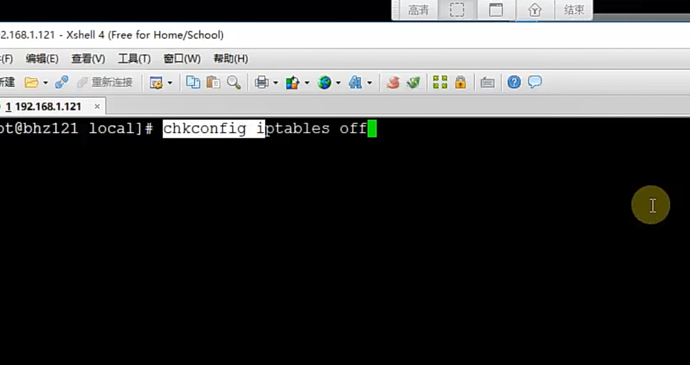
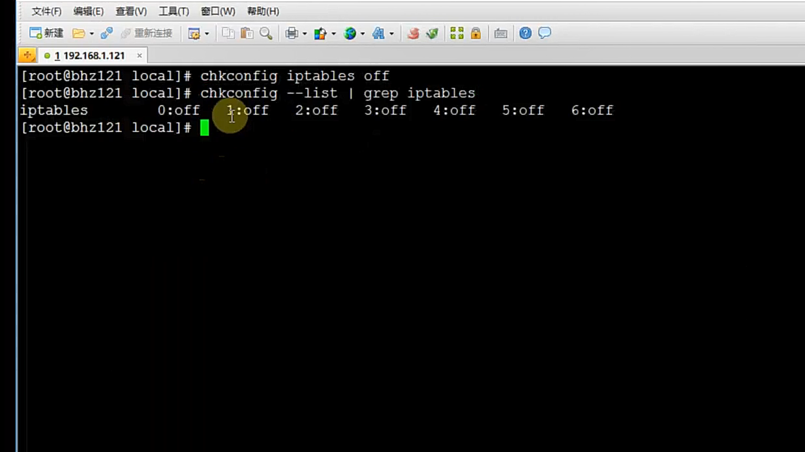
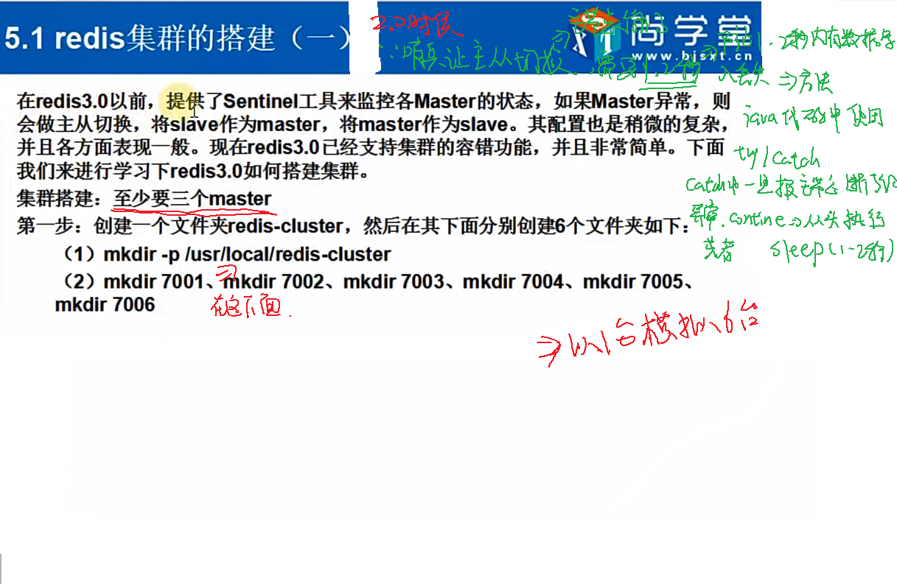
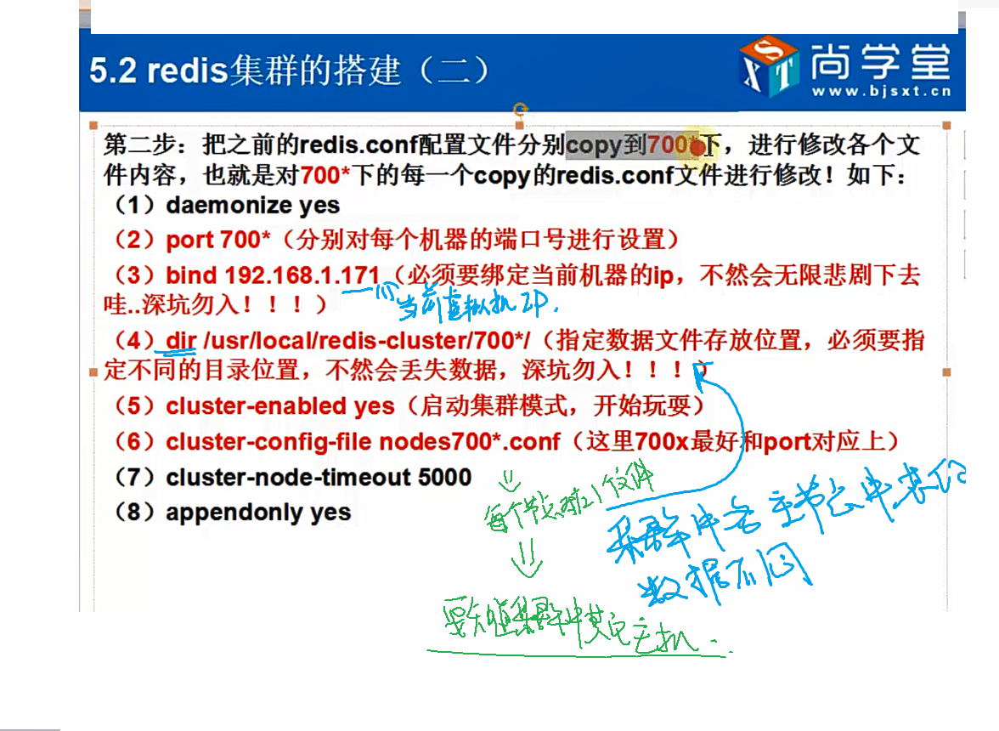
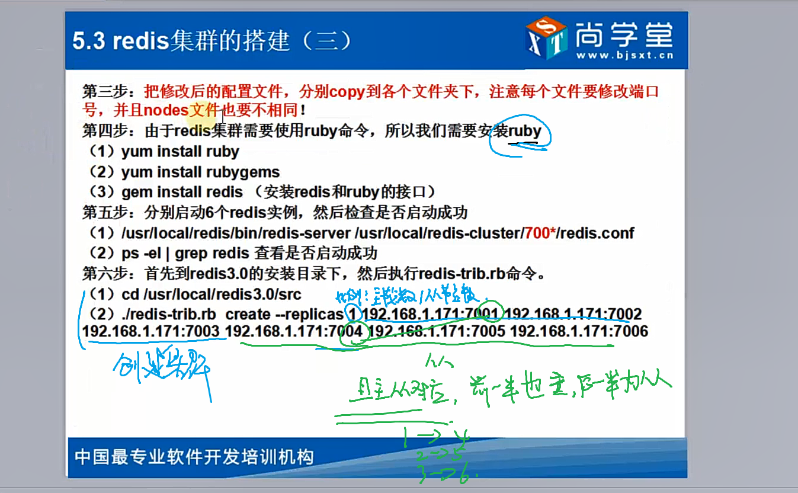
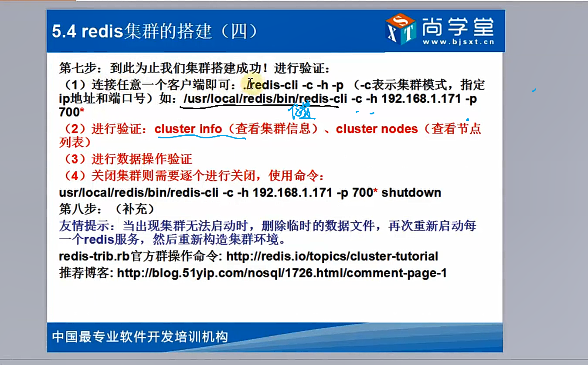
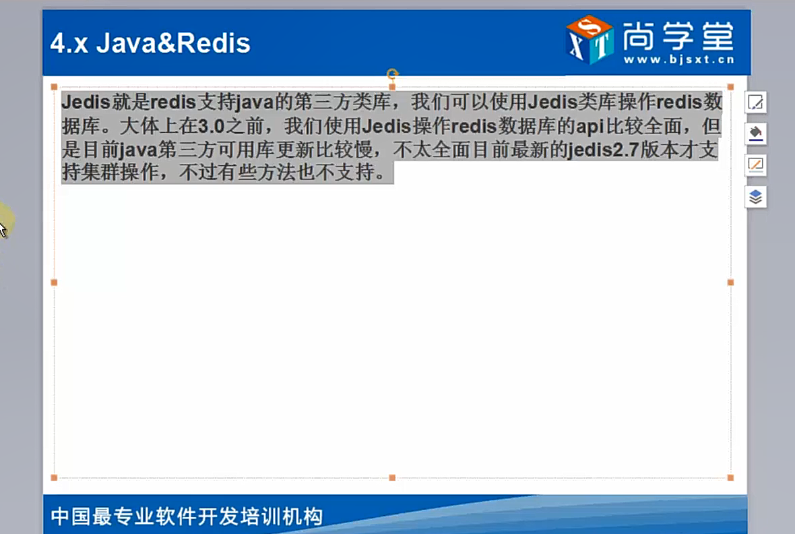

# Redis 使用

## 一、非关系型数据库

### （一）NOSQL

关系型数据库：MySQL 、Oracle、SQLServer
NoSQL,泛指**非关系型的数据库**, NOSQL数据库的四大分类

- **键值 (Key-value)存储数据库**:这一类数据库主要会使用到一个哈希表,这个表中有一个特定的键和一个指针指向特定的数据。如 Redis, oldemort,Oracle BDB;

- 列存储数据库:这部分数据库通常是用来应对分布式存储的海量数据。键仍然存在,但是它们的特点是指向了多个列。如 HBase,Rak

- 文档型数据库:该类型的数据模型是版本化的文档,半结构化的文档以特定的格式存储,比如JsoN。文档型数据库可以看作是键值数据库的升级版,允许之间嵌套键值。而且文档型数据库比键值数据库的查询效率更高。如：CouchDB, MongoDb

- 图形 (Graph)数据库:图形结构的数据库同其他行列以及刚性结构的SQL数据库不同,它是使用灵活的图形模型,并且能够扩展到多个服务器上。NoSQ 数据库没有标准的查询语言(SQL),因此进行数据库查询需要制定数据模型

许多 NOSQL数据库都有REST式的数据接口或者查询AP。如:Neo4J,InfoGrid, Infinite Graph


## 二、Redis 简介

是以 key-value形式存储,和传统的关系型数据库不一样,不一定遵循传统数据库的一些基本要求(非关系型的、分布式的、开源的。水平可扩展的)

- 优点:
    - 对数据高并发读写
    - 对海量数据的高效率存储和访问
        因为是基于内存级别的读取操作
    - 对数据的可扩展性和高可用性

- 缺点: 
    - redis(ACID处理非常简单）无法做到太复杂的关系数据库模型

Redis是以 key-value 存储数据结构服务器。键可以包含:( string)字符串,哈希,（List）链表,（Set）集合，(zset)有序集合。这些数据集合都支持 push/pop、 add/ remove及取交集和并集以及更丰富的操作，redis 支持各种不同的方式排序。
为了保证效率数据都是缓存在内存中它也可以周期性的把更新的数据写入磁盘或者把修改操作写入追加到文件中。上述持久化主要方式是：RDB 和 AOF、RDB 是周期性将操作写入硬盘；AOF 是在执行数据写入操作的同时将操作写入日志，如果发生掉电可以从日志中查询到之前的操作。


### （一）Redis 安装

 见 Linux -> LinuxBlogs -> CentOS 安装 Redis；

**基本命令：**
路径按照上面文件进行安排

- 启动服务：`src/redis-server redis.conf`
- 退出服务：`pkill redis-server`/ `kill 进程号` / `src/redis-cli shutdown`
- 启动客户端：`src/redis-cli`
- 退出客户端：`quit`
- 查看是否有 Redis 服务或者查看端口：`ps -ef | grep redis` 或者 `netstat -tunpl | grep 6379`


## 三、Redis 数据类型

redis 一共分为五种基本数据类型： String、Hash、List（类型 Java 的 Queue）、Set（Java 中 List 增强版）、ZSet；

### （一）String 类型

String 类型是包含很多种类型的特殊类型，并且**是二进制安全的**。比如序列化的对象进行存储，比如一张图片进行二进制存储，比如一个简单的字符串。数值等等。


- Set 方法：
    - 设置值：`set key值 value值`，重复为同一个 key 值设置 value，新的会覆盖旧的值；
    - 设置值：`setnx key值 value值`，如果该 key 存在则不再设置，返回 0，否则进行设置；
    - 设置值有效期：`setex key值 过期时间 value值`，设置 key 值有效期（秒）。过期则返回 nil（相当于 null）；示例：`setex key 10 value`设置该值的有效期为 10 秒；
    - 取值：`get key值`
    - 删除值：`del key值`
    - 使用 setrange 替换字符串：比如之前的值：`set key1 value123`；然后通过 `setrange key1 4 ww`表示将 key1 对应的 value 值，从第 4 位开始（从 0 开始）逐个替换为 ww，上面示例的结果值为：`valuww23`；

- 批量设置多个值或者批量取出多个值：
    - 批量设置值：`mset key1 value1 key2 value2 key3 value3`；
    - 批量获取值：`mget key1 key2 key3`
    - 同样也有 msetnx 和 mget 方法；
    - 一次性设置和取值：getset 方法，示例，已经设置值：`set key1 value1`，然后：`getset key1 value2`，首先会返回原来的值 value1，同时将 key1 值设置为：value2；
- 其他方法
    - incr 和 decr ：对 key 对应的 value 值 +/- 1（因为默认步长为 1）；`incr key1`，key1 对应的值的大小 + 1；
    - incrby 和 decr 方法：对某个值进行制定长度的递增和递减，可以使用：`incrby key1 2`，将 key1 对应的值 + 2，这里 2 表示步长。步长可正可负。
    - append 方法：在 key 对应值的后面追加；`append key1 lalala`，在 key1 对应的 value 值后面追加 lalala。
    - strlen 方法：获取 key 对应的值的长度；


### （二）Hash 类型

 Hash 类型是 String 类型的 field 和 value 的映射表，或者说一个 String 集合，**特别适合存储对象**，相比，将一个对象类型存储在 Hash 类型中要比存储在 String 类型中占用内存空间更小同时更方便存取整个对象。

一般之前数据表中数据在 redis 中有两种方式存储

| id   | name  | age  |
| ---- | ----- | ---- |
| 1    | zhang | 21   |
| 2    | lisi  | 22   |

- 方式一：使用默认的 Map 形式（一般适用于经常存取部分字段时候使用）
    user1 中 ：id:1，name:zhang，age:21；使用键值对存放
    然后将 user1 和 user2 整合为 user 表；

- 方式二：使用 JSON 格式（一般适用于经常取出整条数据）
    这里一般假设 id 即是 UUID
    所以：key=uuid，value:{id=1，name=lisi，age=22}

**语法示例：**

- 存储内容：`hset hash集合名字 key值（字段名） value值`
- 批量存取内容：`hset hash集合名字 key1 value1 key2 value2`
- 获取内容：`hget hash集合名字 key值`
- 批量获取内容：`hmget hash集合名字 key1 key2`
- hsetnx 和 setnx 相似
- hincrby 和 hdecrby 集合的递增和递减
- hexists 是否存在 key，如果存在就返回，不存在返回 0
- hlen：返回 hash 集合中所有的键的数量
- hdel ：删除指定 hash 中的 key
- hkeys：返回 hash 中多有字段（key）
- hvals：返回 hash 中所有的 value
- hgetall：返回 hash 中所有的 key 和 value；


### （三）List 类型

List 类型是链表结构的集合，主要功能有：push、pop、获取元素等等。**List 类型是一个双端链表的结构，可以通过相关操作进行集合的头部或者尾部添加删除元素**，List 可以作为栈也可以作为队列。
**这也导致 Redis 可以充当 消息队列（MQ）使用**

- lpush 方法：从头部加入元素，先进后出（相当于栈）

```redis
127.0.0.1:6379> lpush list1 "hello"
(integer) 1
127.0.0.1:6379> lpush list1 "world"
(integer) 2
127.0.0.1:6379> lrange list1 0 -1 // 表示从头取到末尾，就是查询栈中所有元素 
1) "world"
2) "hello"
```

- rpush 方法：从尾部添加元素，先进先出（相当于队列）

```redis
127.0.0.1:6379> rpush list2 "hello"
(integer) 1
127.0.0.1:6379> rpush list2 "world"
(integer) 2
127.0.0.1:6379> lrange list2 0 -1
1) "hello"
2) "world"
```

- linsert 方法：插入元素
    `linsert hash集合名 before 集合已有的元素 插入的元素`

```redis
127.0.0.1:6379> linsert list2 before "world" "your"
(integer) 3
127.0.0.1:6379> lrange list2 0 -1
1) "hello"
2) "your"
3) "world"

```

- lset 方法：将指定下标的元素替换掉
    `lset 集合名 要替换元素在集合中的位置 新的值`

```redis
127.0.0.1:6379> lset list2 1 "my"
OK
127.0.0.1:6379> lrange list2 0 -1
1) "hello"
2) "my"
3) "world"
```

- lrem 方法：删除元素，返回删除元素的个数
    `lrem 集合名 删除几个该名称元素  要删除的元素名称`

```redis
127.0.0.1:6379> lrange list2 0 -1
1) "hello"
2) "my"
3) "my"
4) "my"
5) "world"
127.0.0.1:6379> lrem list2 2 "my"
(integer) 2
127.0.0.1:6379> lrange list2 0 -1
1) "hello"
2) "my"
3) "world"
// 如果再想删除两个 "my"，最后实际上仅仅删除了唯一的一个
127.0.0.1:6379> lrem list2 2 "my"
(integer) 1
127.0.0.1:6379> lrange list2 0 -1
1) "hello"
2) "world"

```

- ltrim 方法：保留指定 key 的值范围内的数据
    `ltrim 集合名 开始位置  结尾位置`：保留集合中 [开始位置，结尾位置] 元素，其他元素删除；

```redis
127.0.0.1:6379> lrange list2 0 -1
1) "hello"
2) "my"
3) "your"
4) "his"
5) "her"
6) "world"
127.0.0.1:6379> ltrim list2 2 4
OK
127.0.0.1:6379> lrange list2 0 -1
1) "your"
2) "his"
3) "her"
```

- lpop 方法：从 list 的头部删除元素，并返回删除元素
- rpop 方法：从 list 的尾部删除元素，并返回删除元素

```redis
127.0.0.1:6379> lrange list2 0 -1
1) "your"
2) "his"
3) "her"
127.0.0.1:6379> lpop list2
"your"
127.0.0.1:6379> rpop list2
"her"
127.0.0.1:6379> lrange list2 0 -1
1) "his"
```

- rpoplpush 方法：第一步从尾部删除元素，然后从头部加入元素
- lindex 方法：返回指定 list 中 Index 位置的元素：`lindex list2 3`
- llen 方法：返回元素的个数：`lindex list2`

```redis
127.0.0.1:6379> lrange list2 0 -1
1) "her"
2) "my"
3) "your"
4) "its"
5) "his"
// 将 list2 中尾部的元素删除，并将该元素加入 list1 的头部
127.0.0.1:6379> rpoplpush list2 list1
"his"
127.0.0.1:6379> lrange list2 0 -1
1) "her"
2) "my"
3) "your"
4) "its"
127.0.0.1:6379> lrange list1 0 -1
1) "his"
2) "world"
3) "hello"
```


### （四）Set 类型和 ZSet 类型

Set 集合是 String 类型的无序集合，set 是通过 hashTable 实现的，对集合我们可以取交集、并集、差集。

- sadd 方法：向 set 集合中添加元素（set 集合中不允许存在重复元素）
- smembers 方法：查看 set 集合的元素
- srem 方法：删除 set 集合元素
- spop 方法：随机返回删除的 key `spop set集合名 数量` 随机删除 set 集合中的一部分元素；
- sdiff 方法：返回后一个集合中不在前一个集合中的元素（哪个集合在前就以那个集合为标准）
- sdiffstore 方法：将上面方法返回的元素存储到一个新的集合中

```redis
127.0.0.1:6379> sadd set2 "f"
(integer) 1
127.0.0.1:6379> smembers set1
1) "d"
2) "c"
3) "b"
4) "a"
127.0.0.1:6379> smembers set2
1) "f"
2) "c"
3) "e"
4) "a"
127.0.0.1:6379> sdiffstore set3 set1 set2
(integer) 2
127.0.0.1:6379> smembers set1
1) "d"
2) "c"
3) "b"
4) "a"
127.0.0.1:6379> smembers set2
1) "f"
2) "c"
3) "e"
4) "a"
127.0.0.1:6379> smembers set3
1) "d"
2) "b"

```

- sinter 方法：返回集合的交集 `sinter set1 set2`
- sinterstore 方法：返回集合的交集结果数量，并将交集存入新的集合；`sinterstore set3 set1 set2`。
- sunion 方法：取两个集合的并集；`sunion set1 set2`
- sunionstore 方法：将两个集合的并集存到第三个集合中；`sunionstore set3 set1 set2`

- smove 方法：将某个集合中的元素移动到另一个集合中 `smove 从这个集合名  移动到这个集合名  要移动的元素`
- scard 方法：查看集合中元素的个数 `scard 集合名`
- sismember 方法：判断某元素是否为集合中的元素（返回 1 代表是的，返回 0 代表不是）`sismember 集合名 元素名`
- srandmember 方法：随机返回集合中一个元素 `srandmember 集合名`


**ZSet 方法**

- zadd 方法：向有序集合中添加一个元素，该**元素如果存在则更新顺序**

```redis
127.0.0.1:6379> zrange zset1 0 -1
1) "a"
2) "b"
3) "c"
// 插入同样的元素，会更新其位置
127.0.0.1:6379> zadd zset1 4 "b"
(integer) 0
127.0.0.1:6379> zrange zset1 0 -1
1) "a"
2) "c"
3) "b"
127.0.0.1:6379> zrange zset1 0 -1 withscores
1) "a"
2) "1"
3) "c"
4) "3"
5) "b"
6) "4"
```

- zrem：删除集合中的指定元素：`zrem zset1 "c"`
- zincrby：以指定的值去自动递增或者减少，用法和之前的 incrby 类似
- zrangebyscore：找到指定区间范围的数据进行返回；
- zremrangebyrank：删除 1 到 1 （只删除索引 1）；
- zremrangebyscore：删除指定序号；
- zrank ：返回排序索引，从小到大排序（升序之后再找索引）
    顺序号和索引号不一样；
- zrevrank：返回排序索引，从大到小排序（降序排序之后再找索引）；
- zrangebyscore：找到指定区间范围的数据进行返回；`zrangebyscore zset1 2 3 withscores`
- zcard：返回集合中所有元素的个数；
- zcount：返回集合中 score 在给定区间中的数量；
- zremrangebyrank：删除索引 ；`zremrangerank 集合名 从这里  到这里`
- zremrangebyscore：删除指定序号；`zremrangerank 集合名 从这里 到这里`

### （五）Redis 高级命令及特性

- 返回满足所有的键：`keys *`
- 是否存在指定 key：`exists key1`
- 设置某个 key 的过期时间：`expire key名 时间`，可以使用 `ttl key名` 查看剩余的时间；
- 取消某个 key 的过期时间：`persist key名`
- 选择数据库（0-15 个库，默认是 0 库）`select 2`
- 将当前数据中的 key 转移到其他数据库中：`move key值 数据库编号`
- 随机返回数据库中的一个 key ：`randomkey`
- 重命名 key 值 ：`rename 原key值 新key值`
- 查看数据中的 key 数量：`dbsize`
- 获取数据库信息：`info`
- 清空当前数据库：`flushdb`
- 清空所有数据库：`flushall`
- 返回所有配置：`config get *`


## 四、Redis 实现主从复制

==配置主从的时候：默认就绑定了 IP，一定要去掉：bind 127.0.0.1 ==

### （一）主从复制

- Maste可以拥有多个slave
- 多个 slave可以连接同一个 master外,还可以连接到其他的slave
- 主从复制不会阻塞 master，在同步数据时 maste可以继续处理 client请求
- 提供系统的伸缩性

**主从复制过程**

- save与 master建立连接,发送sync同步命令
- maste会开启一个后台进程,将数据库快照保存到文件中,同时 mastel主进程会开始收集新的写命令并缓存
- 后台完成保存后,就将文件发送给slave
- slave将此文件保存到硬盘上


**主从复制配置过程**
这里以主服务器：192.168.238.143 ；从服务器：192.168.238.144 为例；
配置从服务器的 redis.conf ，添加：`slaveof 192.168.238.143 6379`


### （二）哨兵

主要是在 Redis 2.0 中的，用于对主服务器进行监控

- 功能一：监控主数据库和从数据库是否正常运行；
- 功能二：主数据库出现故障时候，可以自动将从数据库转换为主数据库，实现自动切换；

**实现步骤：**

- 修改从服务器的 sentinel.conf 
    - `sentinel monitor GJXAIOU 192.168.238.143 6379 1` # 主数据库名称、IP、端口、投票选举次数
    - `sentinel down-after-milliseconds GJXAIOU 5000`#默认 1 秒检查一次，这里配置超时 5000 毫秒为宕机；
    - `sentinel failover-timeout GJXAIOU 900000`
    - `sentinel parallel-syncs GJXAIOU 2`
    - `sentinel can-failover GJXAIOU yes`
- 启动 sentinel 哨兵
    `src/redis-server src/sentinel.conf --sentinel &`

### （三）事务

**事务一般不使用**
使用 `multi`开启事务，使用 `exec` 执行，使用 `discard`取消事务；


### 五、Redis 持久化

**配置是修改：** redis.conf 里面设置
redis是一个**支持持久化的内存数据**库,也就是说 redis需要经常将内存中的数据同步到硬盘来保证持久化。

**redis持久化的两种方式：RDB 方式和 AOF**

- snapshotting (快 照 ）默认方式,将内存中以快照的方式写入到二进制文件中,默认为 `dump.rdb` 可以通过配置设置自动做快照持久化的方式。我们可以配置redis 在n秒内如果超过m个key则修改就自动做快照。
    - snapshotting设置
        - save  900  1  #900秒内如果超过1个key被修改则发起快照保存
        - save  300  10  #300秒内如果超过10个key被修改,则发起快照保存
        - save  60   10000
    - append- only file(缩写aof)的方式(有点类似于 oracle日志)由于快照方式是在一定时间间隔做一次,所以可能发生redis意外dowm的情况就会丢失最后一次快照后的所有修改的数据、aof比快照方式有更好的持久化性,是由于在使用aof时, redis会将每一个收到的写命令都通过 write函数追加到命令中,当redis重新启动时会重新执行文件中保存的写命令来在内存中重建这个数据库的内容,这个文件在bin目录下 `appendonly.aof`。aof不是立即写到硬盘上,可以通过配置文件修改强制写到硬盘中。
        - aof设置:
            - appendonly yes   #启动ao持久化方式有三种修改方式:
            - appendfsync always  #收到写命令就立即写入到磁盘,效率最慢,但是保证完全的持久化；
                3.0 之后使用集群，可以多个主机同时执行写的操作，效率会提升；
            - appendfsync everysec #每秒钟写入磁盘一次,在性能和持久化方面做了很好的折中；
                默认是这种；
            - appendfsync no  #完全依赖os，性能最好，持久化没保证；

## 六、发布和订阅消息

- 使用 `subscribe 频道名` 进行订阅监听
- 使用 `publish 频道名 发布的内容` 进行发布消息广播；


## 七、Redis 集群

**文件目录说明**
Redis
  redis-5.0.0（默认操作：输入命令的文件夹）
    redis-cluster
        1
        2
        3
        4
        5
        6
        7

虚拟机：CentOS7MinClone2 ，IP 地址：192.168.238.147

- 创建上述目录结构（从第三层往下需要手动创建）；
- 将原来的配置文件：redis.conf 分别拷贝到 7 个文件下面
- 修改配置文件

```redis
daemonize yes
port 700* #针对每台机器设置端口号：本实验设置顺序为：6371-6376 代替 7001 - 7006
bind 192.168.238.147 #绑定当前机器的 IP
dir /home/GJXAIOU/Redis/redis-5.0.5/redis-cluster/*（这里是 1- 6）/ # 设置数据文件保存位置
cluster -enabled yes  # 启动集群模式
cluster-config-file nodes700*.conf #这里和端口名字相同，本实验顺序为：6371-6376代替 7001-7006
cluster-node-timeout 5000
appendonly yes
```

- 安装 ruby

```redis
yum install ruby
yum install rubygems

gem sources --remove https://rubygems.org/
gem sources -a https://gems.ruby-china.com/
gem install redis
```

如果报错：`redis requires Ruby version >= 2.3.0.`

```redis
yum install curl
curl -sSL https://rvm.io/mpapis.asc | gpg2 --import -
curl -sSL https://rvm.io/pkuczynski.asc | gpg2 --import -
gpg2 --keyserver hkp://keys.gnupg.net --recv-keys D39DC0E3
curl -L get.rvm.io | bash -s stable
source /usr/local/rvm/scripts/rvm
rvm install 2.6.3
rvm use 2.6.3 --default
rvm remove 2.0.0

gem install redis
```

- 然后分别启动这 6 个实例，并判断是否启动成功；
    `src/redis-server redis-cluster/1/redis.conf`，然后将 1 依次换成 2- 6 挨个启动；
    `ps -el | grep redis` 查看是否启动成功

- 然后执行 redis-trib.rb 命令
    `src/redis-trib.rb create --replicas 1 192.168.238.147:6371 192.168.238.147:6372 192.168.238.147:6373 192.168.238.147:6374 192.168.238.147:6375 192.168.238.147:6376`











