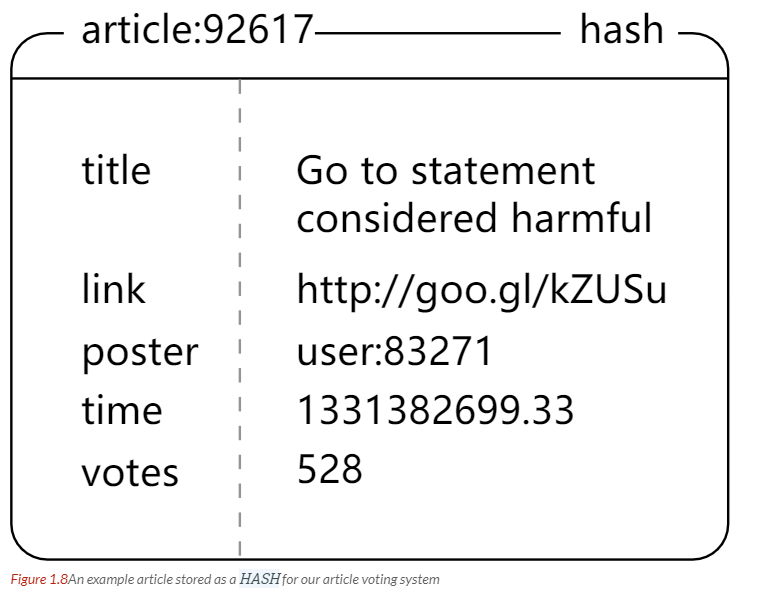
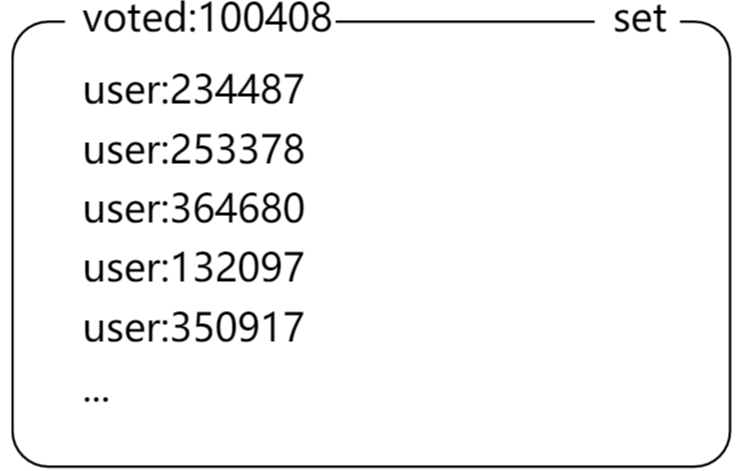
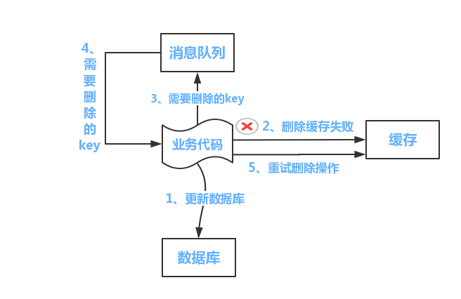

# Redis（Remote Dictionary Server） 


[TOC]

## 一、Redis 简介

**Redis 是一个高性能非关系型（NoSQL）键值对的内存数据库**，可以用在缓存、数据库、消息中间件等。**其中键的类型只能为字符串，值支持五种数据类型：字符串、列表、散列表、集合、有序集合**。

使用缓存 Redis 作用：

- 提高性能：缓存查询速度比数据库查询速度快（内存 VS 硬盘）
- 提高并发能力：缓存分担了部分请求支持更高的并发

## 二、Redis 是单进程单线程的原因

注意：redis 单线程指的是**网络请求模块使用了一个线程，即一个线程处理所有网络请求**，其他模块仍用了多个线程。

==**Redis 是单进程单线程的，Redis 利用队列技术将并发访问变为串行访问，消除了传统数据库串行控制的开销。**==

多线程处理会涉及到锁，而且多线程处理会涉及到线程切换而消耗 CPU。因为 CPU 不是 Redis 的瓶颈，Redis 的瓶颈最有可能是机器内存或者网络带宽。既然单线程容易实现，而且 CPU 不会成为瓶颈，那就顺理成章地采用单线程的方案了。单线程无法发挥多核 CPU 性能，不过可以通过在单机开多个 Redis 实例来解决。

## 三、Redis 为什么这么快

- **完全基于内存，绝大部分请求是纯粹的内存操作，内存的读取速度非常快速**。数据存在内存中，类似于 HashMap，HashMap 的优势就是查找和操作的时间复杂度都是 O(1)；

- 数据结构简单，对数据操作也简单，Redis 中的数据结构是专门进行设计的；

- **采用单线程，避免了不必要的上下文切换和竞争条件，也不存在多进程或者多线程导致的切换而消耗 CPU**，不用去考虑各种锁的问题，不存在加锁释放锁操作，没有因为可能出现死锁而导致的性能消耗；

- 使用多路 I/O 复用模型，可以处理并发的连接；保证在多连接的时候， 系统的高吞吐量。

    https://mp.weixin.qq.com/s?__biz=MzI4Njc5NjM1NQ==&mid=2247488320&idx=1&sn=2b8f1ffc06553d1e43419bc1958c61d1&chksm=ebd62c6cdca1a57af0dfbbe4ac41da68d894ac2913028929b0b65329811d76786c9113308046&scene=21#wechat_redirect

    **多路指的是多个 socket 连接即多个连接，复用指的是复用一个线程**。多路复用主要有三种技术：select，poll，epoll。epoll 是最新的也是目前最好的多路复用技术。采用多路 I/O 复用技术可以让单个线程高效的处理多个连接请求（尽量减少网络 IO 的时间消耗），且 Redis 在内存中操作数据的速度非常快（内存内的操作不会成为这里的性能瓶颈），主要以上两点造就了 Redis 具有很高的吞吐量。

    >非阻塞IO 内部实现采用 epoll，采用了epoll+自己实现的简单的事件框架。epoll中的读、写、关闭、连接都转化成了事件，然后利用epoll的多路复用特性，绝不在io上浪费一点时间。

- 使用底层模型不同，它们之间底层实现方式以及与客户端之间通信的应用协议不一样，Redis 直接自己构建了 VM 机制 ，因为一般的系统调用系统函数的话，会浪费一定的时间去移动和请求；

    

## 四、Redis 与 Memcached 对比

两者都是非关系型内存键值数据库，主要有以下不同：

- 数据类型

    **Memcached 仅支持字符串和二进制类型**，而 Redis 支持五种不同的数据类型，可以更灵活地解决问题。

- 数据持久化

    Redis 支持两种持久化策略，可以将内存的数据保存到磁盘中，重启的时候再次加载使用：RDB 快照和 AOF 日志，**而 Memcached 不支持持久化**。

- 分布式

    Memcached 不支持分布式，只能通过在客户端使用一致性哈希来实现分布式存储，这种方式在存储和查询时都需要先在客户端计算一次数据所在的节点。

    Redis Cluster 实现了分布式的支持。

- **Memcached 是多线程，非阻塞IO复用的网络模型；Redis 使用单线程的多路 IO 复用模型**。

- 内存管理机制

    - 在 Redis 中，并不是所有数据都一直存储在内存中，可以将一些很久没用的 value 交换到磁盘，而 Memcached 的数据则会一直在内存中。
    - **Memcached 将内存分割成特定长度的块来存储数据，以完全解决内存碎片的问题。但是这种方式会使得内存的利用率不高**，例如块的大小为 128 bytes，只存储 100 bytes 的数据，那么剩下的 28 bytes 就浪费掉了。

## 五、一个简单的论坛系统分析

该论坛系统功能如下：

- 可以发布文章；
- 可以对文章进行点赞；
- 在首页可以按文章的发布时间或者文章的点赞数进行排序显示。

#### 文章信息

文章包括标题、作者、赞数等信息，在关系型数据库中很容易构建一张表来存储这些信息，在 Redis 中可以使用 HASH 来存储每种信息以及其对应的值的映射。

Redis 没有关系型数据库中的表这一概念来将同种类型的数据存放在一起，而是使用命名空间的方式来实现这一功能。键名的前面部分存储命名空间，后面部分的内容存储 ID，通常使用 : 来进行分隔。例如下面的 HASH 的键名为 article:92617，其中 article 为命名空间，ID 为 92617。



#### 点赞功能

当有用户为一篇文章点赞时，除了要对该文章的 votes 字段进行加 1 操作，还必须记录该用户已经对该文章进行了点赞，防止用户点赞次数超过 1。可以建立文章的已投票用户集合来进行记录。

为了节约内存，规定一篇文章发布满一周之后，就不能再对它进行投票，而文章的已投票集合也会被删除，可以为文章的已投票集合设置一个一周的过期时间就能实现这个规定。



#### 对文章进行排序

为了按发布时间和点赞数进行排序，可以建立一个文章发布时间的有序集合和一个文章点赞数的有序集合。（下图中的 score 就是这里所说的点赞数；下面所示的有序集合分值并不直接是时间和点赞数，而是根据时间和点赞数间接计算出来的）


## 六、缓存雪崩

#### （一）概念

如果缓存数据**设置的过期时间是相同**的，并且 Redis 恰好将这部分数据全部删光了。这就会导致在这段时间内，这些缓存**同时失效**，全部请求到数据库中。

#### （二）如何解决缓存雪崩

对于“对缓存数据设置相同的过期时间，导致某段时间内缓存失效，请求全部走数据库。”这种情况，非常好解决：

- 解决方法：在缓存的时候给过期时间加上一个**随机值**，这样就会大幅度的**减少缓存在同一时间过期**。

对于“Redis 挂掉了，请求全部走数据库”这种情况，我们可以有以下的思路：

- 事发前：实现 Redis 的**高可用**(主从架构+ Sentinel 或者 Redis Cluster )，尽量避免 Redis 挂掉这种情况发生。

- 事发中：万一 Redis 真的挂了，我们可以设置**本地缓存(ehcache)+限流(hystrix)**，尽量避免我们的数据库被干掉(起码能保证我们的服务还是能正常工作的)

    https://www.jianshu.com/p/5a0669d6305e

- 事发后：redis 持久化，重启后自动从磁盘上加载数据，**快速恢复缓存数据**。

**其他**：

- 在缓存失效后，通过加锁或者队列来控制读数据库写缓存的线程数量。比如对某个 key 只允许一个线程查询数据和写缓存，其他线程等待。
- 做二级缓存，A1 为原始缓存，A2 为拷贝缓存，A1 失效时，可以访问 A2，A1 缓存失效时间设置为短期，A2 设置为长期
- 不同的 key，设置不同的过期时间，让缓存失效的时间点尽量均匀。

## 七、缓存穿透

#### （一）缓存穿透概念

缓存穿透是指查询一个一定**不存在的数据**。由于缓存不命中，并且出于容错考虑，如果从**数据库查不到数据则不写入缓存**，这将导致这个不存在的数据**每次请求都要到数据库去查询**，失去了缓存的意义。

#### （二）如何解决缓存穿透

- 方案一：由于请求的参数是不合法的(每次都请求不存在的参数)，于是我们可以使用布隆过滤器(BloomFilter)（在查询的时候先去 BloomFilter 去查询 key 是否存在，如果不存在就直接返回，存在再走查缓存 -> 查 DB。）或者压缩 filter **提前拦截**，不合法就不让这个请求到数据库层！【针对这种 key 异常多、请求重复率比较低的数据】

- 方案二：当我们从数据库找不到的时候，我们也将这个空对象设置到缓存里边去【对于空数据的 key 有限的，重复率比较高的】

    下次再请求的时候，就可以从缓存里边获取了。这种情况我们一般会将空对象设置一个**较短的过期时间**。

## 八、缓存击穿

指缓存中的一个热点 key，不停地扛着大并发，在这个 key 失效的瞬间，持续的大并发就会击穿缓存，直接请求数据库。
**处理缓存击穿**：设置热点数据永不过期；或者使用互斥锁（上面的现象是多个线程同时去查询数据库的这条数据，那么我们可以在第一个查询数据的请求上使用一个 互斥锁来锁住它。其他的线程走到这一步拿不到锁就等着，等第一个线程查询到了数据，然后做缓存。后面的线程进来发现已经有缓存了，就直接走缓存。）。


## 九、缓存与数据库双写一致

==**从理论上来说，给缓存设置过期时间，是保证最终一致性的解决方案**==。这种方案下，我们可以对存入缓存的数据设置过期时间，所有的写操作以数据库为准，对缓存操作只是尽最大努力即可。也就是说如果数据库写成功，缓存更新失败，那么只要到达过期时间，则后面的读请求自然会从数据库中读取新值然后回填缓存。因此，接下来讨论的思路不依赖于给缓存设置过期时间这个方案。
在这里，我们讨论**三种**更新策略：

- 先更新数据库，再更新缓存
- 先删除缓存，再更新数据库
- 先更新数据库，再删除缓存

### 先更新数据库，再更新缓存（反对）

- **线程安全角度原因**
    同时有请求 A 和请求 B 进行更新操作，那么会出现

    - 线程 A 更新了数据库
    - 线程 B 更新了数据库
    - 线程 B 更新了缓存
    - 线程 A 更新了缓存

    > 这就出现请求A更新缓存应该比请求B更新缓存早才对，但是因为网络等原因，B却比A更早更新了缓存。这就导致了**脏数据**，因此不考虑。

- **业务场景角度原因：**
    （1）如果你是一个写数据库场景比较多，而读数据场景比较少的业务需求，采用这种方案就会导致，**数据压根还没读到，缓存就被频繁的更新，浪费性能。**
    （2）如果你写入数据库的值，并不是直接写入缓存的，而是要经过一系列复杂的计算再写入缓存。那么，每次写入数据库后，都再次计算写入缓存的值，无疑是浪费性能的。显然，删除缓存更为适合。

### 先删缓存，再更新数据库

该方案会导致不一致。例如同时有一个请求 A 进行更新操作，另一个请求 B 进行查询操作。那么会出现如下情形:

- 请求 A 进行写操作，删除缓存
- 请求 B 查询发现缓存不存在
- 请求 B 去数据库查询得到旧值
- 请求 B 将旧值写入缓存
- 请求 A 将新值写入数据库

而且如果不采用给缓存设置过期时间策略，该数据永远都是脏数据。**可以采用延时双删策略解决，具体步骤为：**

- 先淘汰缓存：`redis.delKey(key);`
- 再写数据库（这两步和原来一样）：`db.updateData(data);`
- 休眠一段时间（例如 1 秒），再次淘汰缓存：`Thread.sleep(1000);` 和 `redis.delKey(key);`

这么做，可以将 1 秒内所造成的缓存脏数据，再次删除。**具体休眠的时间根据自己项目读业务数据逻辑的耗时来设置，然后写数据的休眠时间则在读数据业务逻辑的耗时基础上，加几百 ms 即可。这么做的目的，就是确保读请求结束，写请求可以删除读请求造成的缓存脏数据。**
**==如果你用了mysql 的读写分离架构怎么办？==**
在这种情况下，造成数据不一致的原因如下，还是两个请求，一个请求 A 进行更新操作，另一个请求 B 进行查询操作。
（1）请求 A 进行写操作，删除缓存
（2）请求 A 将数据写入数据库了，
（3）请求 B 查询缓存发现，缓存没有值
（4）请求 B 去从库查询，这时，还没有完成主从同步，因此查询到的是旧值
（5）请求 B 将旧值写入缓存
（6）数据库完成主从同步，从库变为新值
上述情形，就是数据不一致的原因。还是使用双删延时策略。只是，**睡眠时间修改为在主从同步的延时时间基础上，加几百ms。**
**采用这种同步淘汰策略，吞吐量降低怎么办？**
ok**，那就将第二次删除作为异步的。自己起一个线程，异步删除。**这样，写的请求就不用沉睡一段时间后了，再返回。这么做，加大吞吐量。
**第二次删除失败仍然会造成缓存和数据库不一致的问题**

因为第二次删除失败，就会出现如下情形。还是有两个请求，一个请求 A 进行更新操作，另一个请求 B 进行查询操作，为了方便，假设是单库：
（1）请求 A 进行写操作，删除缓存
（2）请求 B 查询发现缓存不存在
（3）请求 B 去数据库查询得到旧值
（4）请求 B 将旧值写入缓存
（5）请求 A 将新值写入数据库
（6）请求 A 试图去删除请求 B 写入对缓存值，结果失败了。
**如何解决呢？**
具体解决方案，且看博主对第(3)种更新策略的解析。

### 先更新数据库，再删缓存

- **失效**：应用程序先从 cache 取数据，没有得到，则从数据库中取数据，成功后，放到缓存中。
- **命中**：应用程序从 cache 中取数据，取到后返回。
- **更新**：先把数据存到数据库中，成功后，再让缓存失效。

这种方式也会产生并发问题。假设这会有两个请求，一个请求 A 做查询操作，一个请求 B 做更新操作，那么会有如下情形产生，从而发生脏数据。
（1）缓存刚好失效
（2）请求 A 查询数据库，得一个旧值
（3）请求 B 将新值写入数据库
（4）请求 B 删除缓存
（5）请求 A 将查到的旧值写入缓存

但是发生上述情况有一个先天性条件，就是步骤（3）的写数据库操作比步骤（2）的读数据库操作耗时更短，才有可能使得步骤（4）先于步骤（5）。可是，大家想想，数据库的读操作的速度远快于写操作的（不然做读写分离干嘛，做读写分离的意义就是因为读操作比较快，耗资源少），因此步骤（3）耗时比步骤（2）更短，这一情形出现的概率很低。

**如何一定要解决上述并发问题？**
首先，给缓存设有效时间是一种方案。其次，采用策略（2）里给出的异步延时删除策略，保证读请求完成以后，再进行删除操作。
**还有其他造成不一致的原因么？**
有的，这也是缓存更新策略（2）和缓存更新策略（3）都存在的一个问题，如果删缓存失败了怎么办，那不是会有不一致的情况出现么。比如一个写数据请求，然后写入数据库了，删缓存失败了，这会就出现不一致的情况了。这也是缓存更新策略（2）里留下的最后一个疑问。
**如何解决？**
提供一个保障的重试机制即可，这里给出两套方案。
**方案一**：
如下图所示

流程如下所示
（1）更新数据库数据；
（2）缓存因为种种问题删除失败
（3）将需要删除的 key 发送至消息队列
（4）自己消费消息，获得需要删除的 key
（5）继续重试删除操作，直到成功
然而，该方案有一个缺点，对业务线代码造成大量的侵入。于是有了方案二，在方案二中，启动一个订阅程序去订阅数据库的 binlog，获得需要操作的数据。在应用程序中，另起一段程序，获得这个订阅程序传来的信息，进行删除缓存操作。
**方案二**：

流程如下图所示：
（1）更新数据库数据
（2）数据库会将操作信息写入 binlog 日志当中
（3）订阅程序提取出所需要的数据以及 key
（4）另起一段非业务代码，获得该信息
（5）尝试删除缓存操作，发现删除失败
（6）将这些信息发送至消息队列
（7)重新从消息队列中获得该数据，重试操作。

**备注说明：**上述的订阅 binlog 程序在 mysql 中有现成的中间件叫 canal，可以完成订阅 binlog 日志的功能。至于 oracle 中，博主目前不知道有没有现成中间件可以使用。另外，重试机制，博主是采用的是消息队列的方式。如果对一致性要求不是很高，直接在程序中另起一个线程，每隔一段时间去重试即可，这些大家可以灵活自由发挥，只是提供一个思路。


## 十、Redis 分布式锁

先拿 setnx 来争抢锁，抢到之后，再用 expire 给锁加一个过期时间防止锁忘记了释放。

如果在 setnx 之后，执行 expire 之前进程意外 crash 或者要重启维护了，会导致锁永远无法释放，解决方式：

set 指令有非常复杂的参数，可以同时把 setnx 和 expire 合成一条指令来用。

### 假如Redis里面有1亿个key，其中有10w个key是以某个固定的已知的前缀开头的，如果将它们全部找出来？

使用 keys 指令可以扫出指定模式的 key 列表。

对方接着追问：如果这个 redis 正在给线上的业务提供服务，那使用 keys 指令会有什么问题？

这个时候你要回答 redis 关键的一个特性：redis 的单线程的。keys 指令会导致线程阻塞一段时间，线上服务会停顿，直到指令执行完毕，服务才能恢复。这个时候可以使用 scan 指令，scan 指令可以无阻塞的提取出指定模式的 key 列表，但是会有一定的重复概率，在客户端做一次去重就可以了，但是整体所花费的时间会比直接用 keys 指令长。


## Redis 做异步队列

一般使用 list 结构作为队列，rpush 生产消息，lpop 消费消息。当 lpop 没有消息的时候，要适当 sleep 一会再重试。

如果不想 sleep，list 还有个指令叫 blpop，在没有消息的时候，它会阻塞住直到消息到来。

### 生产一次消费多次

使用 pub/sub 主题订阅者模式，可以实现 1:N 的消息队列。

但是该模式下，如果消费者下线，生产的消息会丢失，得使用专业的消息队列如 rabbitmq 等。

### redis 如何实现延时队列

使用 sortedset，拿时间戳作为 score，消息内容作为 key 调用 zadd 来生产消息，消费者用 zrangebyscore 指令获取 N 秒之前的数据轮询进行处理。

### Pipeline有什么好处，为什么要用pipeline

可以将多次 IO 往返的时间缩减为一次，前提是 pipeline 执行的指令之间没有因果相关性。使用 redis-benchmark 进行压测的时候可以发现影响 redis 的 QPS 峰值的一个重要因素是 pipeline 批次指令的数目。

### Redis的同步机制

Redis 可以使用主从同步，从从同步。第一次同步时，主节点做一次 bgsave，并同时将后续修改操作记录到内存 buffer，待完成后将 rdb 文件全量同步到复制节点，复制节点接受完成后将 rdb 镜像加载到内存。加载完成后，再通知主节点将期间修改的操作记录同步到复制节点进行重放就完成了同步过程。

### 四、使用场景

- 计数器

    可以对 String 进行自增自减运算，从而实现计数器功能。

    Redis 这种内存型数据库的读写性能非常高，很适合存储频繁读写的计数量。

- 缓存

    将热点数据放到内存中，设置内存的最大使用量以及淘汰策略来保证缓存的命中率。

- 查找表

    例如 DNS 记录就很适合使用 Redis 进行存储。

    查找表和缓存类似，也是利用了 Redis 快速的查找特性。但是查找表的内容不能失效，而缓存的内容可以失效，因为缓存不作为可靠的数据来源。

- 消息队列

    List 是一个双向链表，可以通过 lpush 和 rpop 写入和读取消息

    不过最好使用 Kafka、RabbitMQ 等消息中间件。

- 会话缓存

    可以使用 Redis 来统一存储多台应用服务器的会话信息。

    当应用服务器不再存储用户的会话信息，也就不再具有状态，一个用户可以请求任意一个应用服务器，从而更容易实现高可用性以及可伸缩性。

- 分布式锁实现

    在分布式场景下，无法使用单机环境下的锁来对多个节点上的进程进行同步。

    可以使用 Redis 自带的 SETNX 命令实现分布式锁，除此之外，还可以使用官方提供的 RedLock 分布式锁实现。

- 其它

    Set 可以实现交集、并集等操作，从而实现共同好友等功能。

    ZSet 可以实现有序性操作，从而实现排行榜等功能。


### Redis 过期键的删除策略（即什么时候删除）

Redis 可以为每个键设置过期时间，当键过期时，会自动删除该键。**对于散列表这种容器，只能为整个键设置过期时间（整个散列表），而不能为键里面的单个元素设置过期时间。**

- **惰性过期**：**只有当访问一个 key 时，才会判断 key 是否过期，过期则清除**。该策略可以最大化的节省 CPU 资源，但是如果 某些键值对一直不使用，会造成一定量的内存浪费，对内存不友好。除非手动执行 flushdb 操来于清空当前数据库中的所有 key

    执行**数据写入**过程中，首先通过 expireIfNeeded 函数对写入的 key 进行过期判断。

    ```cpp
    /*
     * 为执行写入操作而取出键 key 在数据库 db 中的值。
     *
     * 和 lookupKeyRead 不同，这个函数不会更新服务器的命中/不命中信息。
     *
     * 找到时返回值对象，没找到返回 NULL 。
     */
    robj *lookupKeyWrite(redisDb *db, robj *key) {
    
        // 删除过期键
        expireIfNeeded(db,key);
    
        // 查找并返回 key 的值对象
        return lookupKey(db,key);
    }
    ```

     执行**数据读取**过程中，首先通过 expireIfNeeded 函数对写入的 key 进行过期判断。

    ```kotlin
    /*
     * 为执行读取操作而取出键 key 在数据库 db 中的值。
     *
     * 并根据是否成功找到值，更新服务器的命中/不命中信息。
     *
     * 找到时返回值对象，没找到返回 NULL 。
     */
    robj *lookupKeyRead(redisDb *db, robj *key) {
        robj *val;
    
        // 检查 key 释放已经过期
        expireIfNeeded(db,key);
    
        // 从数据库中取出键的值
        val = lookupKey(db,key);
    
        // 更新命中/不命中信息
        if (val == NULL)
            server.stat_keyspace_misses++;
        else
            server.stat_keyspace_hits++;
    
        // 返回值
        return val;
    }
    ```

     执行**过期动作expireIfNeeded**其实内部做了三件事情，分别是：

    - 查看 key 判断是否过期
    - 向 slave 节点传播执行过期 key 的动作并发送事件通知
    - 删除过期 key

    ```kotlin
    /*
     * 检查 key 是否已经过期，如果是的话，将它从数据库中删除。
     *
     * 返回 0 表示键没有过期时间，或者键未过期。
     *
     * 返回 1 表示键已经因为过期而被删除了。
     */
    int expireIfNeeded(redisDb *db, robj *key) {
    
        // 取出键的过期时间
        mstime_t when = getExpire(db,key);
        mstime_t now;
    
        // 没有过期时间
        if (when < 0) return 0; /* No expire for this key */
    
        /* Don't expire anything while loading. It will be done later. */
        // 如果服务器正在进行载入，那么不进行任何过期检查
        if (server.loading) return 0;
    
        // 当服务器运行在 replication 模式时
        // 附属节点并不主动删除 key
        // 它只返回一个逻辑上正确的返回值
        // 真正的删除操作要等待主节点发来删除命令时才执行
        // 从而保证数据的同步
        if (server.masterhost != NULL) return now > when;
    
        // 运行到这里，表示键带有过期时间，并且服务器为主节点
    
        /* Return when this key has not expired */
        // 如果未过期，返回 0
        if (now <= when) return 0;
    
        /* Delete the key */
        server.stat_expiredkeys++;
    
        // 向 AOF 文件和附属节点传播过期信息
        propagateExpire(db,key);
    
        // 发送事件通知
        notifyKeyspaceEvent(REDIS_NOTIFY_EXPIRED,
            "expired",key,db->id);
    
        // 将过期键从数据库中删除
        return dbDelete(db,key);
    }
    ```

     判断 key 是否过期的数据结构是 db->expires，也就是通过 expires 的数据结构判断数据是否过期。
    内部获取过期时间并返回。

    ```php
    /* Return the expire time of the specified key, or -1 if no expire
     * is associated with this key (i.e. the key is non volatile) 
     *
     * 返回给定 key 的过期时间。
     *
     * 如果键没有设置过期时间，那么返回 -1 。
     */
    long long getExpire(redisDb *db, robj *key) {
        dictEntry *de;
    
        /* No expire? return ASAP */
        // 获取键的过期时间
        // 如果过期时间不存在，那么直接返回
        if (dictSize(db->expires) == 0 ||
           (de = dictFind(db->expires,key->ptr)) == NULL) return -1;
    
        /* The entry was found in the expire dict, this means it should also
         * be present in the main dict (safety check). */
        redisAssertWithInfo(NULL,key,dictFind(db->dict,key->ptr) != NULL);
    
        // 返回过期时间,#define dictGetSignedIntegerVal(he) ((he)->v.s64)
        return dictGetSignedIntegerVal(de);
    }
    ```

     整个数据查找过程类比 hashtab 的查找过程，首先定位 hash 桶，然后遍历 hash 桶下挂的链查找对应的节点。

    ```php
    /*
     * 返回字典中包含键 key 的节点
     *
     * 找到返回节点，找不到返回 NULL
     *
     * T = O(1)
     */
    dictEntry *dictFind(dict *d, const void *key)
    {
        dictEntry *he;
        unsigned int h, idx, table;
    
        // 字典（的哈希表）为空
        if (d->ht[0].size == 0) return NULL; /* We don't have a table at all */
    
        // 如果条件允许的话，进行单步 rehash
        if (dictIsRehashing(d)) _dictRehashStep(d);
    
        // 计算键的哈希值
        h = dictHashKey(d, key);
        // 在字典的哈希表中查找这个键
        // T = O(1)
        for (table = 0; table <= 1; table++) {
    
            // 计算索引值
            idx = h & d->ht[table].sizemask;
    
            // 遍历给定索引上的链表的所有节点，查找 key
            he = d->ht[table].table[idx];
            // T = O(1)
            while(he) {
    
                if (dictCompareKeys(d, key, he->key))
                    return he;
    
                he = he->next;
            }
    
            // 如果程序遍历完 0 号哈希表，仍然没找到指定的键的节点
            // 那么程序会检查字典是否在进行 rehash ，
            // 然后才决定是直接返回 NULL ，还是继续查找 1 号哈希表
            if (!dictIsRehashing(d)) return NULL;
        }
    
        // 进行到这里时，说明两个哈希表都没找到
        return NULL;
    }
    ```

- **定时删除:** **在设置键的过期时间的同时，创建一个定时器（timer），让定时器在键的过期时间来临时，立即执行对键的删除操作.** 即从设置 key 的 Expire 开始，就启动一个定时器，到时间就删除该 key；这样会**对内存比较友好，但浪费CPU资源**

- **定期删除:**每隔一段时间，程序就对数据库进行一次检查，删除里面的过期键。至于要删除多少过期键，以及要检查多少个数据库，则由算法决定。 即设置一个定时任务，比如 10 分钟删除一次过期的 key；**间隔小则占用CPU,间隔大则浪费内存**

    ​    

      redis 的定期删除是通过定时任务实现的，也就是定时任务会循环调用 serverCron() 方法。然后定时检查过期数据的方法是 databasesCron() 。
      定期删除的一大特点就是考虑了定时删除过期数据会占用 cpu 时间，所以每次执行 databasesCron() 的时候会限制cpu的占用不超过25%。

       **activeExpireCycle() 执行具体过期数据的删除**，其他的动作不在该部分讨论当中。

       该方法中删除过期数据的整个过程主要按照下面的逻辑进行：

      - 遍历指定个数的db（如16）进行删除操作
      - 针对每个db 随机获取过期数据每次遍历不超过指定数量（如20），发现过期数据并进行删除。
      - 每个db的次数累积到16次的时候会进行判断时间是否超过25%，超过就停止删除数据过程。
      - 最后如果删除的过期数据耗时（通过开始结束时间统计）超过待过期时间数量的25%的时候就停止删除过期数据过程。
      - timelimit = 1000000*ACTIVE_EXPIRE_CYCLE_SLOW_TIME_PERC/server.hz/100的解释是：server.hz代表每秒调用的次数,所以上面这个公司就是每次执行占用的时候的25%用于过期数据删除。

      

      ```cpp
    // 对数据库执行删除过期键，调整大小，以及主动和渐进式 rehash
    void databasesCron(void) {
    
        // 如果服务器不是从服务器，那么执行主动过期键清除
        if (server.active_expire_enabled && server.masterhost == NULL)
            // 清除模式为 CYCLE_SLOW ，这个模式会尽量多清除过期键
            activeExpireCycle(ACTIVE_EXPIRE_CYCLE_SLOW);
    
        // 在没有 BGSAVE 或者 BGREWRITEAOF 执行时，对哈希表进行 rehash
        if (server.rdb_child_pid == -1 && server.aof_child_pid == -1) {
            static unsigned int resize_db = 0;
            static unsigned int rehash_db = 0;
            unsigned int dbs_per_call = REDIS_DBCRON_DBS_PER_CALL;
            unsigned int j;
    
            /* Don't test more DBs than we have. */
            // 设定要测试的数据库数量
            if (dbs_per_call > server.dbnum) dbs_per_call = server.dbnum;
    
            /* Resize */
            // 调整字典的大小
            for (j = 0; j < dbs_per_call; j++) {
                tryResizeHashTables(resize_db % server.dbnum);
                resize_db++;
            }
    
            /* Rehash */
            // 对字典进行渐进式 rehash
            if (server.activerehashing) {
                for (j = 0; j < dbs_per_call; j++) {
                    int work_done = incrementallyRehash(rehash_db % server.dbnum);
                    rehash_db++;
                    if (work_done) {
                        /* If the function did some work, stop here, we'll do
                         * more at the next cron loop. */
                        break;
                    }
                }
            }
        }
    }
      ```

      

      ```cpp
    void activeExpireCycle(int type) {
        // 静态变量，用来累积函数连续执行时的数据
        static unsigned int current_db = 0; /* Last DB tested. */
        static int timelimit_exit = 0;      /* Time limit hit in previous call? */
        static long long last_fast_cycle = 0; /* When last fast cycle ran. */
    
        unsigned int j, iteration = 0;
        // 默认每次处理的数据库数量
        unsigned int dbs_per_call = REDIS_DBCRON_DBS_PER_CALL;
        // 函数开始的时间
        long long start = ustime(), timelimit;
    
        // 快速模式
        if (type == ACTIVE_EXPIRE_CYCLE_FAST) {
            // 如果上次函数没有触发 timelimit_exit ，那么不执行处理
            if (!timelimit_exit) return;
            // 如果距离上次执行未够一定时间，那么不执行处理
            if (start < last_fast_cycle + ACTIVE_EXPIRE_CYCLE_FAST_DURATION*2) return;
            // 运行到这里，说明执行快速处理，记录当前时间
            last_fast_cycle = start;
        }
    
        /* 
         * 一般情况下，函数只处理 REDIS_DBCRON_DBS_PER_CALL 个数据库，
         * 除非：
         *
         * 1) 当前数据库的数量小于 REDIS_DBCRON_DBS_PER_CALL
         * 2) 如果上次处理遇到了时间上限，那么这次需要对所有数据库进行扫描，
         *     这可以避免过多的过期键占用空间
         */
        if (dbs_per_call > server.dbnum || timelimit_exit)
            dbs_per_call = server.dbnum;
    
        // 函数处理的微秒时间上限
        // ACTIVE_EXPIRE_CYCLE_SLOW_TIME_PERC 默认为 25 ，也即是 25 % 的 CPU 时间
        timelimit = 1000000*ACTIVE_EXPIRE_CYCLE_SLOW_TIME_PERC/server.hz/100;
        timelimit_exit = 0;
        if (timelimit <= 0) timelimit = 1;
    
        // 如果是运行在快速模式之下
        // 那么最多只能运行 FAST_DURATION 微秒 
        // 默认值为 1000 （微秒）
        if (type == ACTIVE_EXPIRE_CYCLE_FAST)
            timelimit = ACTIVE_EXPIRE_CYCLE_FAST_DURATION; /* in microseconds. */
    
        // 遍历数据库
        for (j = 0; j < dbs_per_call; j++) {
            int expired;
            // 指向要处理的数据库
            redisDb *db = server.db+(current_db % server.dbnum);
    
            // 为 DB 计数器加一，如果进入 do 循环之后因为超时而跳出
            // 那么下次会直接从下个 DB 开始处理
            current_db++;
    
            do {
                unsigned long num, slots;
                long long now, ttl_sum;
                int ttl_samples;
    
                /* If there is nothing to expire try next DB ASAP. */
                // 获取数据库中带过期时间的键的数量
                // 如果该数量为 0 ，直接跳过这个数据库
                if ((num = dictSize(db->expires)) == 0) {
                    db->avg_ttl = 0;
                    break;
                }
                // 获取数据库中键值对的数量
                slots = dictSlots(db->expires);
                // 当前时间
                now = mstime();
    
                // 这个数据库的使用率低于 1% ，扫描起来太费力了（大部分都会 MISS）
                // 跳过，等待字典收缩程序运行
                if (num && slots > DICT_HT_INITIAL_SIZE &&
                    (num*100/slots < 1)) break;
    
                /* 
                 * 样本计数器
                 */
                // 已处理过期键计数器
                expired = 0;
                // 键的总 TTL 计数器
                ttl_sum = 0;
                // 总共处理的键计数器
                ttl_samples = 0;
    
                // 每次最多只能检查 LOOKUPS_PER_LOOP 个键
                if (num > ACTIVE_EXPIRE_CYCLE_LOOKUPS_PER_LOOP)
                    num = ACTIVE_EXPIRE_CYCLE_LOOKUPS_PER_LOOP;
    
                // 开始遍历数据库
                while (num--) {
                    dictEntry *de;
                    long long ttl;
    
                    // 从 expires 中随机取出一个带过期时间的键
                    if ((de = dictGetRandomKey(db->expires)) == NULL) break;
                    // 计算 TTL
                    ttl = dictGetSignedIntegerVal(de)-now;
                    // 如果键已经过期，那么删除它，并将 expired 计数器增一
                    if (activeExpireCycleTryExpire(db,de,now)) expired++;
                    if (ttl < 0) ttl = 0;
                    // 累积键的 TTL
                    ttl_sum += ttl;
                    // 累积处理键的个数
                    ttl_samples++;
                }
    
                /* Update the average TTL stats for this database. */
                // 为这个数据库更新平均 TTL 统计数据
                if (ttl_samples) {
                    // 计算当前平均值
                    long long avg_ttl = ttl_sum/ttl_samples;
                    
                    // 如果这是第一次设置数据库平均 TTL ，那么进行初始化
                    if (db->avg_ttl == 0) db->avg_ttl = avg_ttl;
                    /* Smooth the value averaging with the previous one. */
                    // 取数据库的上次平均 TTL 和今次平均 TTL 的平均值
                    db->avg_ttl = (db->avg_ttl+avg_ttl)/2;
                }
    
                // 我们不能用太长时间处理过期键，
                // 所以这个函数执行一定时间之后就要返回
    
                // 更新遍历次数
                iteration++;
    
                // 每遍历 16 次执行一次
                if ((iteration & 0xf) == 0 && /* check once every 16 iterations. */
                    (ustime()-start) > timelimit)
                {
                    // 如果遍历次数正好是 16 的倍数
                    // 并且遍历的时间超过了 timelimit
                    // 那么断开 timelimit_exit
                    timelimit_exit = 1;
                }
    
                // 已经超时了，返回
                if (timelimit_exit) return;
    
                // 如果已删除的过期键占当前总数据库带过期时间的键数量的 25 %
                // 那么不再遍历
            } while (expired > ACTIVE_EXPIRE_CYCLE_LOOKUPS_PER_LOOP/4);
        }
    }
      ```

      reids 同时使用了惰性过期和定期过期两种策略。通过配合使用，服务器可以很好的平衡 CPU 和内存。

其中惰性删除为 redis 服务器内置策略。而定期删除可以通过以下两种方式设置： 1. 配置 redis.conf 的 hz 选项，默认为 10 （即 1 秒执行 10 次，值越大说明刷新频率越快，对 Redis 性能损耗也越大） 2. 配置 redis.conf 的 maxmemory 最大值，当已用内存超过 maxmemory 限定时，就会触发主动清理策略


