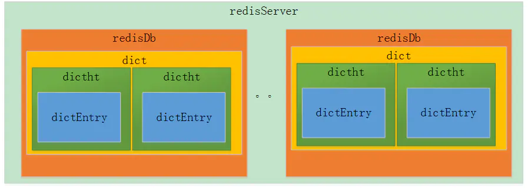
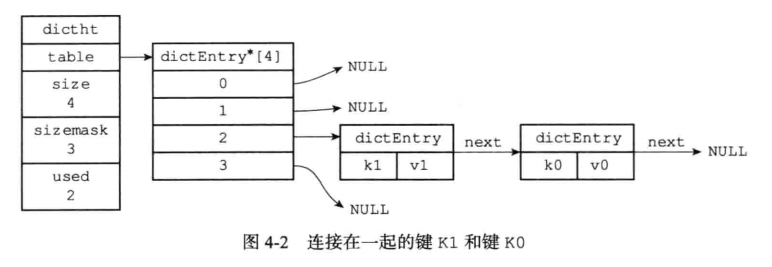
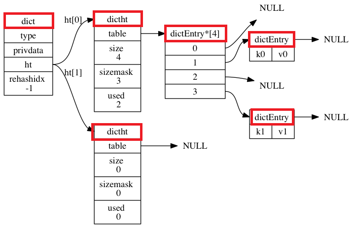
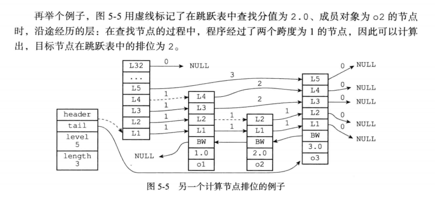
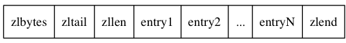
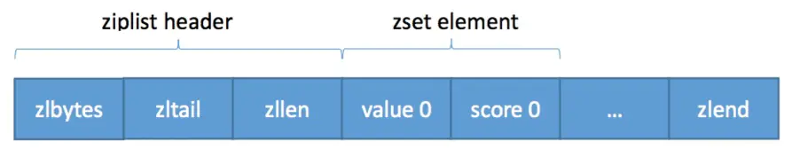
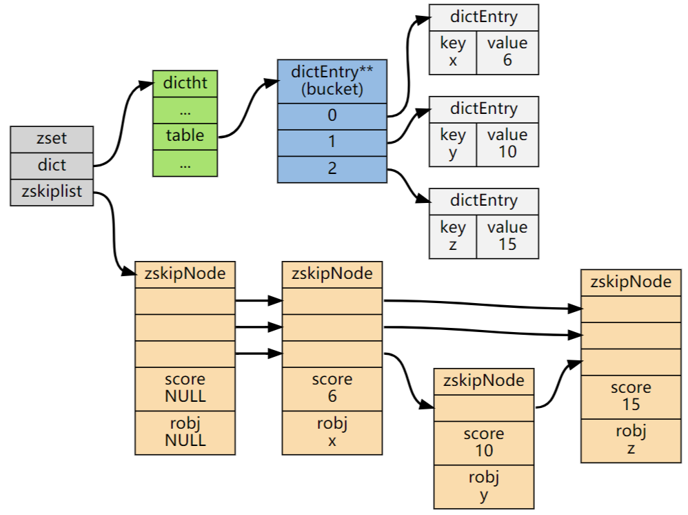
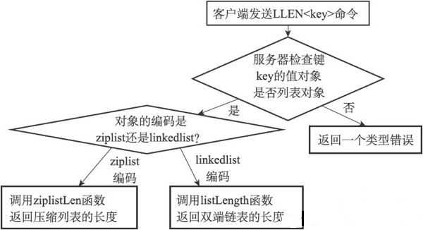

## 二、Redis 整体存储结构

- redis 的存储结构从外层往内层依次是 `RedisDb`、`dict`、`dictht`、`dictEntry`。
- redis 的 Db 默认情况下有 15 个，每个 redisDb 内部包含一个 dict 的数据结构。
- redis 的 dict 内部包含 2 个 dictht 的数组，主要用于 hash 扩容使用。
- dictht 内部包含 dictEntry 的数组，可以理解就是 hash 的桶，然后如果冲突通过挂链法解决。



## 三、Redis 数据结构

### （一）简单动态字符串(SDS：Simple Dynamic String)

Redis 没有使用 C 语言提供的传统字符串，而是构建了一套 SDS 作为自身默认字符串表示。

在 Redis 里面， C 字符串只会作为字符串字面量（string literal）， 用在一些无须对字符串值进行修改的地方， 比如打印日志：

```
redisLog(REDIS_WARNING,"Redis is now ready to exit, bye bye...");
```

当 Redis 需要的不仅仅是一个字符串字面量，而是一个可以被修改的字符串值时，Redis 就会使用 SDS 来表示字符串值：比如在 Redis 的数据库里面，包含字符串值的键值对在底层都是由 SDS 实现的。例如如果客户端执行命令：

```
redis> SET msg "hello world"
OK
```

这里的键值对的键和值都是字符串对象，对象的底层实现分别是一个保存着字符串 `"msg"` 和 "hello world" 的 SDS。即每个字符串对象对应一个 SDS 来实现。

除此之外，SDS 还被用作缓冲区（buffer）： AOF 模块中的 AOF 缓冲区， 以及客户端状态中的输入缓冲区， 都是由 SDS 实现的。

#### 1.SDS 的定义结构

```c
struct sdshdr{
    int len;     // 记录 buf 数组中已使用字节的数量（即 SDS 所保存字符串的长度）【4B】
    int free;    // 记录 buf 数组中未使用字节的数量 【4B】
    char buf[];  // 保存字符串的字节数组【length + 1】  ==》buf 的实际长度为 len + free + 1
}
```


 SDS 示例：

- `free` 属性的值为 0，表示这个 SDS 没有分配任何未使用空间。如果有值，则 buf 数组后面有 free 个空格。
- `len` 属性的值为 5，表示这个 SDS 保存了一个五字节长的字符串。
- `buf` 属性是一个 `char` 类型的数组， 数组的前五个字节分别保存了 `'R'` 、 `'e'` 、 `'d'` 、 `'i'` 、 `'s'` 五个字符， 而最后一个字节则保存了空字符 `'\0'` 。每个字符串后面仍然保存一个 `\0`，但是不算在 len 长度中（但 1 字节的空间还是要分配的）。这样 SDS 可以用 C 字符串函数（两者都是使用 N + 1 长度的字符数组来表示长度为 N 的字符串，并且结尾是 ‘\0’）。

### 2.SDS 和 C 字符串的区别

SDS 优势两方面：安全性和效率；代价就是占空间；

- **常数复杂度获取字符串长度**

  - SDS 的 len 属性中记录了自身的长度，所以获取 SDS 长度的命令 STRLEN 命令的时间复杂度为：`O(1)`【C 因为需要遍历完全，所以为 `O(N)`】；同时设置和更新 SDS 长度工作由  SDS 的 API 执行时候自动完成，因此 SDS 无须任何手动修改长度的工作。
  - 优势：**确保获取字符串长度不会成为 Redis 的性能瓶颈。所以很长的字符串键反复执行 STRLEN 命令时间复杂度仍是：O(1)；**

- **杜绝缓冲区溢出**

  - C 字符串不记录自身长度会造成缓冲区溢出（buffer overflow），例如执行 strcat 拼接字符串，如果没有提前分配足够空间，会造成溢出到别的数据空间，覆盖掉别的数据。

    > Java 的 string 是基于字符数组的，会自动检查数组边界，因此通常只有在很极端情况会有；
    >
    > ==》详解：https://blog.csdn.net/weixin_30629043/article/details/114754479   https://blog.csdn.net/weixin_39974882/article/details/114754480

  - SDS 的空间分配策略完全杜绝了发生缓冲区溢出的可能性： 当 SDS API 需要对 SDS 进行修改时， API 会先检查 SDS 的空间是否满足修改所需的要求， 如果不满足的话， API 会自动将 SDS 的空间扩展至执行修改所需的大小， 然后才执行实际的修改操作， 所以使用 SDS 既不需要手动修改 SDS 的空间大小， 也不会出现前面所说的缓冲区溢出问题。

- **减少修改字符串时候带来的内存重分配次数**

  因为内存重分配算法较为复杂，且会执行系统调用，因此比较耗时，同时 Redis 经常用于速度要求严格、数据被频繁修改的场合。

  - C 字符串的长度和底层数组的长度之间存在关联（N 个字符使用 N + 1 个长度空间），所以每次增长或者缩短 C 字符串都会进行内存重分配。即增长字符串，则执行前先通过内存重分配来拓展底层数组空间的大小否则会缓冲区溢出，如果缩短则释放不使用空间，防止内存泄漏。

  - SDS 中通过未使用空间从而解除了字符串长度和底层数组长度之间的关联。在 SDS 中， `buf` 数组的长度不一定就是字符数量加一， 数组里面可以包含未使用的字节， 而这些字节的数量就由 SDS 的 `free` 属性记录。通过未使用空间， SDS 实现了**空间预分配和惰性空间释放**两种优化策略。

    - **1）空间预分配【用于优化 SDS 的字符串增长操作】**==》减少连续执行字符串增长操作所需的内存重分配次数
      当 SDS 的 API 对一个 SDS 进行修改， 并且需要对 SDS 进行空间扩展的时候（如果剩余空间够，直接操作即可，就不需要预分配空间）， 程序不仅会为 SDS 分配修改所必须要的空间， 还会为 SDS 分配额外的未使用空间。
      额外未使用空间的分配规则是：如果对 SDS 进行修改后，SDS 的长度（len 属性值）比 1MB 小，则程序分配和 `len` 属性同样大小的未使用空间（即 len 值等于 free 值），即 buf 数组总长度为 len（修改后的） + free + 1（空字符）；如果增长后，字符串长度大于等于 1MB，则额外申请 1MB 大小的未使用空间。

      这样**避免了 Redis 在连续执行字符串增长情况下频繁申请空间的情况**。每次字符串增长之前，SDS 会先检查空间是否足够（如上次增长分配的空闲够就不在分配），如果足够则直接使用预分配的空间，否则按照上述机制申请使用空间。所以连续增长 N 次字符串所需要的内存重分配是最多 N 次。

    - **2）懒惰空间释放【用于优化 SDS 字符串缩短的操作】**
      当 SDS 的 API 需要缩短 SDS 保存的字符串时， 程序并不立即使用内存重分配来回收缩短后多出来的字节，而是使用 `free` 属性将这些字节的数量记录起来（即 buf 长度未变，free 值增加了），并等待将来使用。当 Redis **内存空间不足时，会自动释放 SDS 中未使用的空间**，因此也不需要担心内存泄漏问题。

  > 字符串在刚创建的时候是不会有任何多余空间的，只有在用户对某个字符串进行了修改之后，Redis 才会为被修改的字符串分配额外的空间，这是为了优化后续可能会发生的修改操作。
  >
  > 这是一种针对写操作的优化，并且这种优化是建立在花费更多内存上面的，至于这种优化是否有效、内存是否浪费则是由具体的应用程序决定的，不能一概而论。

- **二进制安全**

  C 字符串中的字符必须符合某种编码（比如 ASCII）， 并且除了字符串的末尾之外， 字符串里面不能包含空字符， 否则最先被程序读入的空字符将被误认为是字符串结尾 —— 这些限制使得 C 字符串只能保存文本数据， 而不能保存像图片、音频、视频、压缩文件这样的二进制数据。

  SDS 的 API 都是二进制安全的： 所有 SDS API 都会以处理二进制的方式来处理 SDS 存放在 buf 数组里的数据， 程序不会对其中的数据做任何限制、过滤、或者假设 —— 数据在写入时是什么样的， 它被读取时就是什么样。

  因此将 SDS 的 `buf` 属性称为字节数组的原因 —— Redis 不是用这个数组来保存字符，而是用它来保存一系列任意格式的二进制数据。
  **sds 是通过len属性来判断字符串是否结束，而不是通过\0来判断。**所以保存上述数据就没问题；

- **兼容部分C语言字符串函数**

  Redis 兼容 c 语言对于字符串末尾采用 `\0` 进行处理，这样使得其可以复用部分 c 语言字符串函数的代码，实现代码的精简性。


| C 字符串                                     | SDS                                          |
| -------------------------------------------- | -------------------------------------------- |
| 获取字符串长度的复杂度为O(N)。               | 获取字符串长度的复杂度为O(1)。               |
| API 是不安全的，可能会造成缓冲区溢出。       | API 是安全的，不会造成缓冲区溢出。           |
| 修改字符串长度N次必然需要执行N次内存重分配。 | 修改字符串长度N次最多需要执行N次内存重分配。 |
| 只能保存文本数据。                           | 可以保存文本或者二进制数据。                 |
| 可以使用所有<string.h>库中的函数。           | 可以使用一部分<string.h>库中的函数。         |

### （二）链表

链表提供了高效的节点重排能力，以及顺序性的节点访问方式，并且可以通过增删节点来灵活地调整链表的长度。因为 Redis 使用的 C 语言并没有内置这种数据结构，所以 Redis 构建了自己的链表实现。

链表在 Redis 中的应用非常广泛， 比如列表键的底层实现之一就是链表： 当一个列表键包含了数量比较多的元素， 又或者列表中包含的元素都是比较长的字符串时， Redis 就会使用链表作为列表键的底层实现。

#### 1.链表和链表节点的实现

```c
/*
 * 双端链表节点
 */
typedef struct listNode {
    // 前置节点
    struct listNode *prev;
    // 后置节点
    struct listNode *next;
    // 节点的值
    void *value;
} listNode;
```

其中 prev 指向前一个节点，next 指向后一个节点，value 存储着节点本身的值。多个 listNode 组成**双向链表**，如下图所示：


整体链表结构

```c
/*
 * 双端链表结构
 */
typedef struct list {
    // 表头节点
    listNode *head;
    // 表尾节点
    listNode *tail;
    // 节点值复制函数，dup 函数用于复制链表节点所保存的值；
    void *(*dup)(void *ptr);
    // 节点值释放函数，free 函数用于释放链表节点所保存的值；
    void (*free)(void *ptr);
    // 节点值对比函数，match 函数则用于对比链表节点所保存的值和另一个输入值是否相等。
    int (*match)(void *ptr, void *key);
    // 链表所包含的节点数量
    unsigned long len;
} list;
```

`list` 结构为链表提供了表头指针 `head` 、表尾指针 `tail` ， 以及链表长度计数器 `len` ， 而 `dup` 、 `free` 和 `match` 成员则是用于实现多态链表所需的类型特定函数：


Redis 的链表实现的特性可以总结如下：

- 双端： 链表节点带有 `prev` 和 `next` 指针， 获取某个节点的前置节点和后置节点的复杂度都是 O(1) 。
- 无环： 表头节点的 `prev` 指针和表尾节点的 `next` 指针都指向 `NULL` ， 对链表的访问以 `NULL` 为终点。
- 带表头指针和表尾指针： 通过 `list` 结构的 `head` 指针和 `tail` 指针， 程序获取链表的表头节点和表尾节点的复杂度为 O(1) 。
- **带链表长度计数器**： 程序使用 `list` 结构的 `len` 属性来对 `list` 持有的链表节点进行计数， 程序获取链表中节点数量的复杂度为 O(1) 。
- 多态： 链表节点使用 `void*` 指针来保存节点值， 并且可以通过 `list` 结构的 `dup` 、 `free` 、 `match` 三个属性为节点值设置类型特定函数， 所以**链表可以用于保存各种不同类型的值**。

### （三）字典（符号表，关联数组，映射）

字典是一种用于保存键值对（key-value pair）的抽象数据结构。在字典中， 一个键（key）可以和一个值（value）进行关联（或者说将键映射为值）， 这些关联的键和值就被称为键值对。

字典中的每个键都是独一无二的， 程序可以在字典中根据键查找与之关联的值， 或者通过键来更新值， 又或者根据键来删除整个键值对， 等等。

Redis 所使用的 C 语言并没有内置这种数据结构， 因此 Redis 构建了自己的字典实现。字典在 Redis 中的应用相当广泛， 比如 Redis 的数据库就是使用字典来作为底层实现的， 对数据库的增、删、查、改操作也是构建在对字典的操作之上的。

例如通过命令：`redis> SET msg "hello world"`在数据库中创建一个键为 `"msg"` ， 值为 `"hello world"` 的键值对时， **这个键值对就是保存在代表数据库的字典里面的**。

同时字典还是哈希键的底层实现之一： 当一个哈希键包含的键值对比较多， 又或者键值对中的元素都是比较长的字符串时， Redis 就会使用字典作为哈希键的底层实现。

举个例子， `website` 是一个包含 `10086` 个键值对的哈希键， 这个哈希键的键都是一些数据库的名字， 而键的值就是数据库的主页网址：

```
redis> HLEN website
(integer) 10086

redis> HGETALL website
1) "Redis"
2) "Redis.io"
3) "MariaDB"
4) "MariaDB.org"
5) "MongoDB"
6) "MongoDB.org"
# ...
```

`website` 键的底层实现就是一个字典， 字典中包含了 `10086` 个键值对：

> 其中一个键值对的键为 `"Redis"` ， 值为 `"Redis.io"` 。另一个键值对的键为 `"MariaDB"` ， 值为 `"MariaDB.org"` ；。。。。

#### 1.字典的实现


Redis 的字典使用哈希表作为底层实现，一个哈希表里面可以有多个哈希表节点，而每个哈希表节点就保存了字典中的一个键值对。

==为什么 redis 的 哈希对象底层底层使用字典，字典底层又是哈希表，为啥多加一个中间层。==


dictEntry 和 dictht 可以看成一个 HashMap 来理解（虽然不完全一样）。

- 关于 dictEntry：【哈希表的每个结点】

  哈希表节点使用 dictEntry 结构表示，每个 `dictEntry` 结构都保存着一个键值对，**即存储数据地方**。

  ```c
  /*
   * 哈希表节点
   */
  typedef struct dictEntry {
      // 键
      void *key;
      // 值
      union {
          void *val;
          uint64_t u64;
          int64_t s64;
      } v;
      // 指向下个哈希表节点，形成链表
      struct dictEntry *next;
  } dictEntry;
  ```

  - `key` 保存着键值对中的键，
  - `v` 保存着键值对中的值（值可以是一个指针或者是 `uint64_t` 或者是 `int64_t`）。
  - `next` 是指向另一个哈希表节点的指针，这个指针可以将多个哈希值相同的键值对连接在一次，以此来解决哈希冲突的问题；

  哈希表节点如下图（左边第一列是哈希表结构，表节点结构从左边第二列开始）所示：next 指针将两个索引值相同的键 k1 和 k0 连接；
      

- 关于 dictht 结构：【哈希表结构】

  ```c
  /*
   * 哈希表
   *
   * 每个字典都使用两个哈希表，从而实现渐进式 rehash 。
   */
  typedef struct dictht {
      // 哈希表数组，默认大小为 4
      dictEntry **table;
      // 哈希表大小
      unsigned long size;
      // 哈希表大小掩码，用于计算索引值
      // 总是等于 size - 1
      unsigned long sizemask;
      // 该哈希表已有节点的数量
      unsigned long used;
  } dictht;
  ```

  哈希表包括的成员有 `table`、`size`、`used`、`sizemask`。每个字典都使用两个哈希表，从而实现渐进式 rehash 。

  - `table` 是一个数组，数组中的每个元素都是一个指向 `dictEntry` 结构的指针， 每个 `dictEntry` 结构保存着一个键值对；
  - `size` 属性记录了哈希表的大小，即 `table` 数组的大小；
  - `used` 属性则记录了哈希表目前已有节点（键值对）的数量。
  - `sizemask` 等于 `size-1`，该值和哈希值用于计算一个键在 `table` 数组的索引（即位置）。

  

- 关于 dict【即字典结构】

  ```c
  /*
   * 字典
   */
  typedef struct dict {
      // 类型特定函数
      dictType *type;
      // 私有数据
      void *privdata;
      // 哈希表
      dictht ht[2];
      // rehash 索引
      // 当 rehash 不在进行时，值为 -1
      int rehashidx; /* rehashing not in progress if rehashidx == -1 */
      // 目前正在运行的安全迭代器的数量
      int iterators; /* number of iterators currently running */
  } dict;
  ```

  dict 结构体就是字典的定义，包含的成员有 `type`，`privdata`、`ht`、`rehashidx`。

  `type` 属性和 `privdata` 属性是针对不同类型的键值对， 为创建多态字典而设置的：
  
  - `type` 属性是一个指向 `dictType` 结构的指针， 每个 `dictType` 结构保存了一簇用于操作特定类型键值对的函数， Redis 会为用途不同的字典设置不同的类型特定函数。
  - 而 `privdata` 属性则保存了需要传给那些类型特定函数的可选参数。
  
  ```
  typedef struct dictType {
  
      // 计算哈希值的函数
      unsigned int (*hashFunction)(const void *key);
  
      // 复制键的函数
      void *(*keyDup)(void *privdata, const void *key);
  
      // 复制值的函数
      void *(*valDup)(void *privdata, const void *obj);
  
      // 对比键的函数
      int (*keyCompare)(void *privdata, const void *key1, const void *key2);
  
      // 销毁键的函数
      void (*keyDestructor)(void *privdata, void *key);
  
      // 销毁值的函数
      void (*valDestructor)(void *privdata, void *obj);
  
  } dictType;
  ```
  
  `ht` 属性是一个包含两个项的数组， 数组中的每个项都是一个 `dictht` 哈希表， 一般情况下， 字典只使用 `ht[0]` 哈希表， `ht[1]` 哈希表只会在对 `ht[0]` 哈希表进行 rehash 时使用。
  
  除了 `ht[1]` 之外， 另一个和 rehash 有关的属性就是 `rehashidx` ： 它记录了 rehash 目前的进度， 如果目前没有在进行 rehash ， 那么它的值为 `-1` 。
  
  普通状态下（没有进行 rehash）的字典完整结构：



#### 2.哈希算法

要将新的键值对加到字典，程序要先对键进行哈希算法，算出**哈希值和索引值，再根据索引值，把包含新键值对的哈希表节点放到哈希表数组指定的索引上。**

Redis 计算哈希值和索引值的方法如下：

```c
# 使用字典设置的哈希函数，计算键 key 的哈希值
hash = dict -> type -> hashFunction(key); // 采用 murmurhash2算法，是一种非加密型hash算法，快速
# 使用哈希表的 sizemask 属性和哈希值，计算出索引值
# 根据情况不同， ht[x] 可以是 ht[0] 或者 ht[1]
index = hash & dict -> ht[x].sizemask;
```

算出来的结果中，index 的值是多少，则 key 会落在 table （dictEntry 数组)里面的第 index 个位置（第一个位置 index 是 0 ）。

#### 3.键冲突解决

当两个或者以上的键被分配到哈希表数组的同一个索引上，则称这些键发生了冲突。

Redis 的哈希表使用链地址法（separate chaining）来解决键冲突： 每个哈希表节点都有一个 `next` 指针， 多个哈希表节点可以用 `next` 指针构成一个单向链表， 被分配到同一个索引上的多个节点可以用这个单向链表连接起来， 这就解决了键冲突的问题。

因为 dictEntry 节点组成的链表中没有指向尾节点的指针，所以总是**将新节点加在表头的位置，排在其它已有节点前**面。（O(1)时间）


> 看redis的源码，对于字典，添加哈希表节点时，如果存在相同的键值，会返回null，不进行添加；当键值不存在时，直接添加到链表的表头位置。
> 对于底层由字典实现的哈希对象，添加元素时，会首先判断键值是否存在，存在则直接更新；不存在才会调用字典的dictAdd方法

#### 4.rehash（重新散列）

哈希表保存的键值对数量是动态变化的，为了让哈希表的负载因子维持在一个合理的范围之内，当哈希表保存的键值对数量太多或者太少时， 就需要对哈希表进行扩缩容。

> 负载因子（load factor）计算：`load_factor =ht[0].used / ht[0].size`，即负载因子大小等于当前哈希表的已保存节点（键值对）数量除以当前哈希表的大小。

哈希表的拓展和收缩条件：

- 扩展：当以下任一条件满足，哈希表会自动进行扩展操作：

  - 服务器目前没有在执行 BGSAVE 或者 BGREWRITEAOF 命令，且负载因子大于等于 1；

  - 服务器目前正在在执行 BGSAVE 或者 BGREWRITEAOF 命令，且负载因子大于等于 5； 

    这是因为在执行 BGSAVE 命令或 BGREWRITEAOF 命令的过程中， Redis 需要创建当前服务器进程的子进程， 而大多数操作系统都采用写时复制（[copy-on-write](http://en.wikipedia.org/wiki/Copy-on-write)）技术来优化子进程的使用效率， 所以在子进程存在期间， 服务器会提高执行扩展操作所需的负载因子， 从而尽可能地避免在子进程存在期间进行哈希表扩展操作， 这可以避免不必要的内存写入操作， 最大限度地节约内存 。

- 收缩：当负载因子小于 0.1 时，Redis 自动开始哈希表的收缩工作。  

扩容和缩容有两种方式：

- 普通 Rehash 重新散列

  扩缩容是通过执行 rehash 重新散列来完成，对字典的哈希表执行普通 rehash 的基本步骤为**分配空间->逐个迁移->交换哈希表**，详细过程如下：

  - 为字典的 `ht[1]` 哈希表分配空间，分配的空间大小取决于要执行的操作以及 `ht[0]` 当前包含的键值对数量（即 ht[0].used 值）：
    - 扩展操作时 `ht[1]`  的大小为第一个大于等于 `ht[0].used * 2` 的 `2^n` 的值；**扩容为原来的两倍**。
    - 收缩操作时 `ht[1]` 的大小为第一个大于等于 `ht[0].used` 的 `2^n` 的值；
  - 将保存在 `ht[0]` 中的所有键值对重新计算键的哈希值和索引值 `rehash` 到 `ht[1]`上；即对每个键重新采用哈希算法的方式计算哈希值和索引值，再放到相应的 `ht[1]` 的表格指定位置。 
  - 重复 `rehash` 直到 `ht[0]`包含的所有键值对全部迁移到了 `ht[1]` 之后释放 `ht[0]`， 将 `ht[1]` 设置为 `ht[0]`，并在 `ht[1]`新创建一个空白哈希表，为下一次 rehash 做准备。


> ht 大小始终为 2 的倍数原因：index=hash&dict>ht[x].sizemask;为了sizemask二进制全是1吧，这样index就是分布均匀的了

- ==渐进式 rehash 过程==

  Redis 的 rehash 动作为分次完成，原因在于键值对数量很大时， 一次性 rehash 到 `ht[1]` 可能会导致服务器在一段时间内停止服务。Redis 采用了渐进式 rehash，过程的详细步骤：

  - 为 `ht[1]` 分配空间，让字典同时持有 `ht[0]`和 `ht[1]` 两张哈希表；

  - 将字典中维持的一个索引计数器变量 rehashidx 设置为 0，表示 rehash 工作正式开始，同时这个 rehashidx 是递增的，从 0 开始表示从数组第一个元素开始 rehash。

  - 在 rehash 进行期间，每次对字典执行增删改查操作时，除了执行操作外，顺带将 `ht[0]` 哈希表在 `rehashidx` 索引上的键值对 `rehash` 到 `ht[1]`，完成后将 `rehashidx` 加 `1`，指向下一个需要 `rehash` 的键值对。

    > 以update操作为例，路径一、1. 检测ht[0]中的index处是否有数据 2. 如果没有对ht[1]进行操作; 
    >
    > 路径二、1. 检测ht[0]中的index处是否有数据 2. 如果有，对ht[0]进行更新 3. 将ht[0]相应的index更新至ht[1]中
    >
    > 路径二中的 2-3 直接，如果有请求去 get 相应的 key 值，因为 rehash 的步骤会被记录，所以不会影响中途执行的操作，即 get 操作不会阻塞；
    >
    > rehash 过程中的更新操作，处理方法和查找操作类似：
    >
    > 1. 程序首先查找 ht[0] ，看要 update 的键是否存在，如果是的话，更新它。
    > 2. 程序首先查找 ht[1] ，看要 update 的键是否存在，如果是的话，更新它。
    >
    > 如果 ht[0] 和 ht[1] 都没有找到指定的键，并且这是一个类似 HSET 这样的命令（键存在它就是更新操作，键不存在就是插入操作），那么这次更新将变成一次插入操作，这时就会出现情况 3 ：
    >
    > 3. 在 rehash 过程中，所有新键值对都会被插入到 ht[1] ，所以这次的新键值对也会被插入到 ht[1] 。
    >
    > 即整体分两种情况：
    >
    > 1. 如果是key的 索引 < rehashidx 的话，就说明该key已经经过了rehash，再ht[1]中了，ht[0]中没有，就去ht[1]中修改。
    > 2. 如果key的索引 > rehashidx的话，说明该key还未经过rehash，就直接再ht[0]中修改，等待rehash的过程到达key的索引的值，就进行rehash。

  - 随着字典操作的不断执行，最终 `ht[0]` 的所有键值对都会被 `rehash` 至 `ht[1]`，再将 `rehashidx` 属性的值设为 `-1` 来表示 `rehash` 操作已完成。

渐进式 rehash 的思想在于将 rehash 键值对所需的计算工作分散到对字典的每个添加、删除、查找和更新操作上，从而避免了集中式 rehash 而带来的阻塞问题。

在 rehash 期间，对哈希表的查找、修改、删除会在两个哈希表上进行，即会先在 `ht[0]` 进行。如果 `ht[0]` 中没找到相应的内容，则会去 `ht[1]` 查找，并进行相关的修改、删除操作。**而增加的操作，会直接增加到`ht[1]` 中，目的是让 `ht[0]` 只减不增，加快迁移的速度。**

rehash 扩容时会判断，如果发现正在 rehash 或者新的哈希表大小小于现有已使用的，则返回 error，避免当旧表还没有完全同步到新表，新表却需要再次 rehash。

### （四）跳跃表

- 跳跃表（skiplist）是一种**有序**的数据结构，它通过每个节点中维持多个指向其他节点的指针，从而实现快速访问。 跳跃表中节点查找平均 O(logN)，最坏 O(N)，并且跳表实现比平衡树简单。支持顺序遍历查找。  Redis 只在两个地方用到了跳跃表， 一个是实现有序集合键， 另一个是在集群节点中用作内部数据结构。

- 在 Redis 中，**有序集合**（sortedset）的其中一种实现方式就是跳跃表。当有序集合中的元素较多，或者集合中的元素是比较长的字符串，则会使用跳跃表来实现。

- 跳跃表实现

  跳跃表是由各个跳跃表节点组成。数据保存在一个跳跃表中，每个数据以跳跃表节点的形式存在；每一个跳跃表结点结构如下：

  ```c
  /*
   * 每一个跳跃表节点结构
   */
  typedef struct zskiplistNode {
      // 成员对象
      robj *obj;
      // 分值
      double score;
      // 后退指针
      struct zskiplistNode *backward;
      // 层
      struct zskiplistLevel {
          // 前进指针
          struct zskiplistNode *forward;
          // 跨度
          unsigned int span;
      } level[];
  } zskiplistNode;
  ```

  跳跃表的整体结构如下：

  `header` 和 `tail` 指针分别指向跳跃表的表头和表尾节点， 通过这两个指针， 程序定位表头节点和表尾节点的复杂度为 O(1) 。
  
  通过使用 `length` 属性来记录节点的数量， 程序可以在 O(1) 复杂度内返回跳跃表的长度。
  
  `level` 属性则用于在 O(1) 复杂度内获取跳跃表中层高最大的那个节点的层数量， 注意表头节点的层高并不计算在内。
  
  ```c
  /*
   * 跳跃表的整体结构
   * zkipList 保存跳跃表节点的相关信息：就是跳跃表结构最前面的一列
   因此，获取跳跃表的表头、表尾、最大层数、长度的时间复杂度都是O(1)。
   */
  typedef struct zskiplist {
      // 跳跃表头节点和跳跃表尾节点的指针
      struct zskiplistNode *header, *tail;
      // 表中跳跃节点的数量，即跳跃表的长度（表头节点不计算在内）
      unsigned long length;
      // 表中层数最大的节点的层数（表头节点的层数不计算在内）
      int level;
  } zskiplist;
  ```


- 跳跃表节点（zskiplistNode）属性：
  - **层：**节点中用 L1，L2 表示各层，每个层都有两个属性，前进指针（forward）和跨度（span）。每个节点的层高是 1 到 32 的随机数； 

    - **前进指针：**用于访问位于表尾方向的其他节点，便于跳跃表正向遍历节点的时候，查找下一个节点位置；
    - **跨度：**记录前进指针所指的节点和当前节点的距离，**用于计算排位**，访问过程中，将沿途访问的所有层的跨度累计起来，得到的结果就是跳跃表的排位。 
  
    图中，连线上带有数字的箭头就代表前进指针，而那个数字就是跨度。当程序从表头向表尾进行遍历时，访问会沿着层的前进指针进行。
  
  - **后退指针：**节点中用 BW 来表示，其指向当前节点的前一个节点，用于反向遍历时候使用，每次只能后退至前一个节点。 
  
  - **分值：**各节点中的数字就是分值，跳跃表中，节点**按照分值从小到大排列**。
  
  - **成员对象：**各个节点中，o1，o2 是节点所保存的成员对象。是一个指针，指向一个字符串对象。 
    - 表头节点也有后退指针，分值，成员对象，因为不会被用到，所以图中省略。  
  
    - 分值可以相同，成员对象必须唯一。
  
    - 分值相同时，按照成员对象的字典序从小到大排。

详细说明：

层

跳跃表节点的 `level` 数组可以包含多个元素， 每个元素都包含一个指向其他节点的指针， 程序可以通过这些层来加快访问其他节点的速度， 一般来说， 层的数量越多， 访问其他节点的速度就越快。

每次创建一个新跳跃表节点的时候， 程序都根据幂次定律 （[power law](http://en.wikipedia.org/wiki/Power_law)，越大的数出现的概率越小） 随机生成一个介于 `1` 和 `32` 之间的值作为 `level` 数组的大小， 这个大小就是层的“高度”。

图 5-2 分别展示了三个高度为 `1` 层、 `3` 层和 `5` 层的节点， 因为 C 语言的数组索引总是从 `0` 开始的， 所以节点的第一层是 `level[0]` ， 而第二层是 `level[1]` ， 以此类推。


前进指针

每个层都有一个指向表尾方向的前进指针（`level[i].forward` 属性）， 用于从表头向表尾方向访问节点。

图 5-3 用虚线表示出了程序从表头向表尾方向， 遍历跳跃表中所有节点的路径：

1. 迭代程序首先访问跳跃表的第一个节点（表头）， 然后从第四层的前进指针移动到表中的第二个节点。
2. 在第二个节点时， 程序沿着第二层的前进指针移动到表中的第三个节点。
3. 在第三个节点时， 程序同样沿着第二层的前进指针移动到表中的第四个节点。
4. 当程序再次沿着第四个节点的前进指针移动时， 它碰到一个 `NULL` ， 程序知道这时已经到达了跳跃表的表尾， 于是结束这次遍历。

![digraph {       rankdir = LR;      node [shape = record, width = "0.5"];      //      l [label = " <header> header | <tail> tail | level \n 5 | length \n 3 "];      subgraph cluster_nodes {          style = invisible;          header [label = " <l32> L32 | ... | <l5> L5 | <l4> L4 | <l3> L3 | <l2> L2 | <l1> L1 "];          bw_null [label = "NULL", shape = plaintext];          level_null [label = "NULL", shape = plaintext];          A [label = " <l4> L4 | <l3> L3 | <l2> L2 | <l1> L1 | <backward> BW | 1.0 | o1 "];          B [label = " <l2> L2 | <l1> L1 | <backward> BW | 2.0 | o2 "];          C [label = " <l5> L5 | <l4> L4 | <l3> L3 | <l2> L2 | <l1> L1 | <backward> BW | 3.0 | o3 "];      }      subgraph cluster_nulls {          style = invisible;          n1 [label = "NULL", shape = plaintext];         n2 [label = "NULL", shape = plaintext];         n3 [label = "NULL", shape = plaintext];         n4 [label = "NULL", shape = plaintext];         n5 [label = "NULL", shape = plaintext];      }      //      l:header -> header [style = dashed];     l:tail -> C;      header:l32 -> level_null [label = "0"];     header:l5 -> C:l5 [label = "3"];     header:l4 -> A:l4 [label = "1", style = dashed];     header:l3 -> A:l3 [label = "1"];     header:l2 -> A:l2 [label = "1"];     header:l1 -> A:l1 [label = "1"];      A:l4 -> C:l4 [label = "2"];     A:l3 -> C:l3 [label = "2"];     A:l2 -> B:l2 [label = "1", style = dashed];     A:l1 -> B:l1 [label = "1"];      B:l2 -> C:l2 [label = "1", style = dashed];     B:l1 -> C:l1 [label = "1"];      C:l5 -> n5 [label = "0"];     C:l4 -> n4 [label = "0"];     C:l3 -> n3 [label = "0"];     C:l2 -> n2 [label = "0", style = dashed];     C:l1 -> n1 [label = "0"];      bw_null -> A:backward -> B:backward -> C:backward [dir = back];       label = "\n 图 5-3    遍历整个跳跃表"; }](%E4%B8%80%E3%80%81%E6%95%B0%E6%8D%AE%E7%BB%93%E6%9E%84%E4%B8%8E%E5%AF%B9%E8%B1%A1.resource/graphviz-e252c0a9575f171b9721162311df23889699cac9.png)

跨度

层的跨度（`level[i].span` 属性）用于记录两个节点之间的距离：

- 两个节点之间的跨度越大， 它们相距得就越远。
- 指向 `NULL` 的所有前进指针的跨度都为 `0` ， 因为它们没有连向任何节点。

初看上去， 很容易以为跨度和遍历操作有关， 但实际上并不是这样 —— 遍历操作只使用前进指针就可以完成了， 跨度实际上是用来计算排位（rank）的： 在查找某个节点的过程中， 将沿途访问过的所有层的跨度累计起来， 得到的结果就是目标节点在跳跃表中的排位。

举个例子， 图 5-4 用虚线标记了在跳跃表中查找分值为 `3.0` 、 成员对象为 `o3` 的节点时， 沿途经历的层： 查找的过程只经过了一个层， 并且层的跨度为 `3` ， 所以目标节点在跳跃表中的排位为 `3` 。

![digraph {      rankdir = LR;      node [shape = record, width = "0.5"];      //      l [label = " <header> header | <tail> tail | level \n 5 | length \n 3 "];      subgraph cluster_nodes {          style = invisible;          header [label = " <l32> L32 | ... | <l5> L5 | <l4> L4 | <l3> L3 | <l2> L2 | <l1> L1 "];          bw_null [label = "NULL", shape = plaintext];          level_null [label = "NULL", shape = plaintext];          A [label = " <l4> L4 | <l3> L3 | <l2> L2 | <l1> L1 | <backward> BW | 1.0 | o1 "];          B [label = " <l2> L2 | <l1> L1 | <backward> BW | 2.0 | o2 "];          C [label = " <l5> L5 | <l4> L4 | <l3> L3 | <l2> L2 | <l1> L1 | <backward> BW | 3.0 | o3 "];      }      subgraph cluster_nulls {          style = invisible;          n1 [label = "NULL", shape = plaintext];         n2 [label = "NULL", shape = plaintext];         n3 [label = "NULL", shape = plaintext];         n4 [label = "NULL", shape = plaintext];         n5 [label = "NULL", shape = plaintext];      }      //      l:header -> header [style = dashed];     l:tail -> C;      header:l32 -> level_null [label = "0"];     header:l5 -> C:l5 [label = "3", style = dashed];     header:l4 -> A:l4 [label = "1"];     header:l3 -> A:l3 [label = "1"];     header:l2 -> A:l2 [label = "1"];     header:l1 -> A:l1 [label = "1"];      A:l4 -> C:l4 [label = "2"];     A:l3 -> C:l3 [label = "2"];     A:l2 -> B:l2 [label = "1"];     A:l1 -> B:l1 [label = "1"];      B:l2 -> C:l2 [label = "1"];     B:l1 -> C:l1 [label = "1"];      C:l5 -> n5 [label = "0"];     C:l4 -> n4 [label = "0"];     C:l3 -> n3 [label = "0"];     C:l2 -> n2 [label = "0"];     C:l1 -> n1 [label = "0"];      bw_null -> A:backward -> B:backward -> C:backward [dir = back];      label = "\n 图 5-4    计算节点的排位";  }](%E4%B8%80%E3%80%81%E6%95%B0%E6%8D%AE%E7%BB%93%E6%9E%84%E4%B8%8E%E5%AF%B9%E8%B1%A1.resource/graphviz-b5f725abb2be0255dce02cc1b9b404595edff320.png)

再举个例子， 图 5-5 用虚线标记了在跳跃表中查找分值为 `2.0` 、 成员对象为 `o2` 的节点时， 沿途经历的层： 在查找节点的过程中， 程序经过了两个跨度为 `1` 的节点， 因此可以计算出， 目标节点在跳跃表中的排位为 2 。

![digraph {      rankdir = LR;      node [shape = record, width = "0.5"];      //      l [label = " <header> header | <tail> tail | level \n 5 | length \n 3 "];      subgraph cluster_nodes {          style = invisible;          header [label = " <l32> L32 | ... | <l5> L5 | <l4> L4 | <l3> L3 | <l2> L2 | <l1> L1 "];          bw_null [label = "NULL", shape = plaintext];          level_null [label = "NULL", shape = plaintext];          A [label = " <l4> L4 | <l3> L3 | <l2> L2 | <l1> L1 | <backward> BW | 1.0 | o1 "];          B [label = " <l2> L2 | <l1> L1 | <backward> BW | 2.0 | o2 "];          C [label = " <l5> L5 | <l4> L4 | <l3> L3 | <l2> L2 | <l1> L1 | <backward> BW | 3.0 | o3 "];      }      subgraph cluster_nulls {          style = invisible;          n1 [label = "NULL", shape = plaintext];         n2 [label = "NULL", shape = plaintext];         n3 [label = "NULL", shape = plaintext];         n4 [label = "NULL", shape = plaintext];         n5 [label = "NULL", shape = plaintext];      }      //      l:header -> header [style = dashed];     l:tail -> C;      header:l32 -> level_null [label = "0"];     header:l5 -> C:l5 [label = "3"];     header:l4 -> A:l4 [label = "1", style = dashed];     header:l3 -> A:l3 [label = "1"];     header:l2 -> A:l2 [label = "1"];     header:l1 -> A:l1 [label = "1"];      A:l4 -> C:l4 [label = "2"];     A:l3 -> C:l3 [label = "2"];     A:l2 -> B:l2 [label = "1", style = dashed];     A:l1 -> B:l1 [label = "1"];      B:l2 -> C:l2 [label = "1"];     B:l1 -> C:l1 [label = "1"];      C:l5 -> n5 [label = "0"];     C:l4 -> n4 [label = "0"];     C:l3 -> n3 [label = "0"];     C:l2 -> n2 [label = "0"];     C:l1 -> n1 [label = "0"];      bw_null -> A:backward -> B:backward -> C:backward [dir = back];      label = "\n 图 5-5    另一个计算节点排位的例子"; }](%E4%B8%80%E3%80%81%E6%95%B0%E6%8D%AE%E7%BB%93%E6%9E%84%E4%B8%8E%E5%AF%B9%E8%B1%A1.resource/graphviz-35aacc5673063633ae0decd516137022c304ac1b.png)

后退指针

节点的后退指针（`backward` 属性）用于从表尾向表头方向访问节点： 跟可以一次跳过多个节点的前进指针不同， 因为每个节点只有一个后退指针， 所以每次只能后退至前一个节点。

图 5-6 用虚线展示了如果从表尾向表头遍历跳跃表中的所有节点： 程序首先通过跳跃表的 `tail` 指针访问表尾节点， 然后通过后退指针访问倒数第二个节点， 之后再沿着后退指针访问倒数第三个节点， 再之后遇到指向 `NULL` 的后退指针， 于是访问结束。

![digraph {      rankdir = LR;      node [shape = record, width = "0.5"];      //      l [label = " <header> header | <tail> tail | level \n 5 | length \n 3 "];      subgraph cluster_nodes {          style = invisible;          header [label = " <l32> L32 | ... | <l5> L5 | <l4> L4 | <l3> L3 | <l2> L2 | <l1> L1 "];          bw_null [label = "NULL", shape = plaintext];          level_null [label = "NULL", shape = plaintext];          A [label = " <l4> L4 | <l3> L3 | <l2> L2 | <l1> L1 | <backward> BW | 1.0 | o1 "];          B [label = " <l2> L2 | <l1> L1 | <backward> BW | 2.0 | o2 "];          C [label = " <l5> L5 | <l4> L4 | <l3> L3 | <l2> L2 | <l1> L1 | <backward> BW | 3.0 | o3 "];      }      subgraph cluster_nulls {          style = invisible;          n1 [label = "NULL", shape = plaintext];         n2 [label = "NULL", shape = plaintext];         n3 [label = "NULL", shape = plaintext];         n4 [label = "NULL", shape = plaintext];         n5 [label = "NULL", shape = plaintext];      }      //      l:header -> header;     l:tail -> C [style = dashed];      header:l32 -> level_null [label = "0"];     header:l5 -> C:l5 [label = "3"];     header:l4 -> A:l4 [label = "1"];     header:l3 -> A:l3 [label = "1"];     header:l2 -> A:l2 [label = "1"];     header:l1 -> A:l1 [label = "1"];      A:l4 -> C:l4 [label = "2"];     A:l3 -> C:l3 [label = "2"];     A:l2 -> B:l2 [label = "1"];     A:l1 -> B:l1 [label = "1"];      B:l2 -> C:l2 [label = "1"];     B:l1 -> C:l1 [label = "1"];      C:l5 -> n5 [label = "0"];     C:l4 -> n4 [label = "0"];     C:l3 -> n3 [label = "0"];     C:l2 -> n2 [label = "0"];     C:l1 -> n1 [label = "0"];      bw_null -> A:backward -> B:backward -> C:backward [dir = back, style = dashed];      label = "\n 图 5-6    从表尾向表头方向遍历跳跃表"; }](%E4%B8%80%E3%80%81%E6%95%B0%E6%8D%AE%E7%BB%93%E6%9E%84%E4%B8%8E%E5%AF%B9%E8%B1%A1.resource/graphviz-35029fe9a9dbed7001f6fee063c0b376bca6e54d.png)

分值和成员

节点的分值（`score` 属性）是一个 `double` 类型的浮点数， 跳跃表中的所有节点都按分值从小到大来排序。

节点的成员对象（`obj` 属性）是一个指针， 它指向一个字符串对象， 而字符串对象则保存着一个 SDS 值。

在同一个跳跃表中， 各个节点保存的成员对象必须是唯一的， 但是多个节点保存的分值却可以是相同的： 分值相同的节点将按照成员对象在字典序中的大小来进行排序， 成员对象较小的节点会排在前面（靠近表头的方向）， 而成员对象较大的节点则会排在后面（靠近表尾的方向）。

举个例子， 在图 5-7 所示的跳跃表中， 三个跳跃表节点都保存了相同的分值 `10086.0` ， 但保存成员对象 `o1` 的节点却排在保存成员对象 `o2` 和 `o3` 的节点之前， 而保存成员对象 `o2` 的节点又排在保存成员对象 `o3` 的节点之前， 由此可见， `o1` 、 `o2` 、 `o3` 三个成员对象在字典中的排序为 `o1 <= o2 <= o3` 。

![digraph {      rankdir = LR;      node [shape = record, width = "0.5"];      //      l [label = " <header> header | <tail> tail | level \n 5 | length \n 3 "];      subgraph cluster_nodes {          style = invisible;          header [label = " <l32> L32 | ... | <l5> L5 | <l4> L4 | <l3> L3 | <l2> L2 | <l1> L1 "];          bw_null [label = "NULL", shape = plaintext];          level_null [label = "NULL", shape = plaintext];          A [label = " <l4> L4 | <l3> L3 | <l2> L2 | <l1> L1 | <backward> BW | 10086.0 | o1 "];          B [label = " <l2> L2 | <l1> L1 | <backward> BW | 10086.0 | o2 "];          C [label = " <l5> L5 | <l4> L4 | <l3> L3 | <l2> L2 | <l1> L1 | <backward> BW | 10086.0 | o3 "];      }      subgraph cluster_nulls {          style = invisible;          n1 [label = "NULL", shape = plaintext];         n2 [label = "NULL", shape = plaintext];         n3 [label = "NULL", shape = plaintext];         n4 [label = "NULL", shape = plaintext];         n5 [label = "NULL", shape = plaintext];      }      //      l:header -> header;     l:tail -> C;      header:l32 -> level_null [label = "0"];     header:l5 -> C:l5 [label = "3"];     header:l4 -> A:l4 [label = "1"];     header:l3 -> A:l3 [label = "1"];     header:l2 -> A:l2 [label = "1"];     header:l1 -> A:l1 [label = "1"];      A:l4 -> C:l4 [label = "2"];     A:l3 -> C:l3 [label = "2"];     A:l2 -> B:l2 [label = "1"];     A:l1 -> B:l1 [label = "1"];      B:l2 -> C:l2 [label = "1"];     B:l1 -> C:l1 [label = "1"];      C:l5 -> n5 [label = "0"];     C:l4 -> n4 [label = "0"];     C:l3 -> n3 [label = "0"];     C:l2 -> n2 [label = "0"];     C:l1 -> n1 [label = "0"];      bw_null -> A:backward -> B:backward -> C:backward [dir = back];      label = "\n 图 5-7    三个带有相同分值的跳跃表节点"; }](%E4%B8%80%E3%80%81%E6%95%B0%E6%8D%AE%E7%BB%93%E6%9E%84%E4%B8%8E%E5%AF%B9%E8%B1%A1.resource/graphviz-2eca5f315d20b6ceb145dbce294dc00f979605f2.png)

**跨度用来计算排位：**



 **总结**：

- 跳跃表是有序集合的底层实现之一；
- Redis 的跳跃表表示有 zskiplist（保存跳跃表信息，如表头节点、表尾节点、长度） 和 zskiplistNode（表示跳跃表节点） 两个结构组成。
- 每个跳跃表节点的层高都是 1 到 32 之间的随机数。
- 在同一个跳跃表中，多个节点可以包含相同的分值，但是每个节点的成员对象必须是唯一的。
- 跳跃表中的节点按照分值大小进行排序，当分值相同的时候，节点按照成员对象的大小进行排序。

与红黑树等平衡树相比，跳跃表具有以下优点：

- 插入速度非常快速，因为不需要进行旋转等操作来维护平衡性；
- 更容易实现；
- 支持无锁操作。

### （五）整数集合（intset）

整数集合（intset）是**集合键**的底层实现之一，**当一个集合只包含整数值元素，并且这个集合的元素数量不多时，Redis 就会使用整数集合作为集合键的底层实现**。它可以保存类型为 `int16_t`（每个占 16 bit）、`int32_t` 或者 `int64_t` 的整数值，**并且保证集合中不会出现重复元素**。

#### 1.整数集合的实现

```c
// 每个整数集合对应一个 intset 结构
typedef struct intset {
    // 编码方式
    uint32_t encoding;
    // 集合包含的元素数量，即数组长度
    uint32_t length;
    // 保存元素的数组；该数组的真正类型取决于 encoding 的属性。
    int8_t contents[];
} intset;
```

contents 数组是整数集合的底层实现：整数集合的每个元素都是 contents 数组的一个数组项，各个项在数组中按值的大小**从小到大有序地排列**，并且数组中**不包含任何重复项**。

`length` 属性记录了整数集合包含的元素数量，即 `contents` 数组的长度。

虽然 `intset` 结构将 `contents` 属性声明为 `int8_t` 类型的数组， 但实际上 `contents` 数组并不保存任何 `int8_t` 类型的值 —— **`contents` 数组的真正类型取决于 `encoding` 属性的值**：

如果 `encoding` 属性的值为 `INTSET_ENC_INT16` ， 那么 `contents` 就是一个 `int16_t` 类型的数组， 数组里的每个项都是一个 `int16_t` 类型的整数值 （最小值为 `-32,768` ，最大值为 `32,767` ）。 encoding 的属性值还包括： `INTSET_ENC_INT32`（对应 int32_t，（最小值为 `-2,147,483,648` ，最大值为 `2,147,483,647` ））、 `INTSET_ENC_INT64`（对应 int64_t，（最小值为 `-9,223,372,036,854,775,808` ，最大值为 `9,223,372,036,854,775,807` ））。

如果 content 数组中保存 5 个的都是 `int16_t` 类型的整数值，则该数组大小为：`sizeof(int16_t) * 5 = 16 * 5 = 80 位`。

> 说明：当向一个底层为 `int16_t` 数组的整数集合添加一个 `int64_t` 类型的整数值时， 整数集合已有的所有元素都会被转换成 `int64_t` 类型， 所以 `contents` 数组保存的四个整数值都是 `int64_t` 类型的。


#### 2.整数集合升级

当添加的新元素的类型比整数集合现有所有元素的的类型都要长时，整数集合需要先进行升级，然后才能将新元素添加到整数集合里面。

- 步骤一：根据新元素的类型，**扩展整数集合底层数组的空间大小**，并为新元素分配空间。

- 步骤二：将底层数组**现有的所有元素都转换成与新元素相同的类型**，并将类型转换后的元素放置到正确的位上（**从后往前**），而且在放置元素的过程中，需要继续位置底层数组的有序性质不变。

- 步骤三：将**新元素添加到底层数组**里面。

- 步骤四：将 encoding 属性更改为新的元素的属性值，并修改 length 属性值。

整数集合添加新元素的时间复杂度为 O(N)，因为每次添加新元素都可能引起升级，每次升级都需要对底层数组已有元素进行类型转换。因为引发升级的新元素长度总是比集合中所有元素长度都长，所以总是大于/小于集合中所有现有元素，所有它的位置要么是 0 要么是 length-1。所以新元素摆放位置比较好确定。

#### 3.升级的好处：

- 提升整数集合的灵活性，可以随意将 int16，int32，int64 的值放入集合，不用担心类型错误。

- 尽可能地**节约内存**，即升级只会在需要的时候进行，不要求上来就让每个元素都占 int64 的空间。

#### 4.降级：

**整数集合不支持降级操作**，一旦对数组进行了升级， 编码就会一直保持升级后的状态。即如果加入元素导致升级到 int64_t，即使这个元素删除了，整体还是 int64，不会降级。

### （六）压缩列表

压缩列表（ziplist）是**列表键和哈希键**的底层实现之一。

**当一个列表键/哈希键只包含少量列表项，并且每个列表项（键值对的键和值）要么就是小整数值，要么就是长度比较短的字符串**，那么 Redis 就会使用压缩列表来做列表键/哈希键的底层实现。

```shell
redis> RPUSH lst 1 3 5 10086 "hello" "world"
(integer) 6

redis> OBJECT ENCODING lst  ==》2.9 版本，新版本是 quicklist
"ziplist"
```

#### 1.压缩列表的构成

压缩列表是 Redis  为了节约内存而开发的，是由一系列特殊编码的**连续内存块组成的顺序型数据结构**。**压缩列表中可以包括任意个节点（Entry），每个节点可以保存一个字节数组或者一个整数值**。一个压缩列表有以下部分组成及其对应说明：



| 属性      | 类型       | 长度     | 用途                                                         |
| :-------- | :--------- | :------- | :----------------------------------------------------------- |
| `zlbytes` | `uint32_t` | `4` 字节 | 记录整个压缩列表**占用的内存字节数**：在对压缩列表进行内存重分配，或者计算 `zlend` 的位置时使用。==>这里及以下几个属性都是 16 进制值 |
| `zltail`  | `uint32_t` | `4` 字节 | 记录压缩列表表尾节点距离压缩列表的起始地址有多少字节： 通过这个**偏移量**，程序无须遍历整个压缩列表就可以确定表尾节点的地址。即如果指向 zlbytes 的指针地址为 p，则 p + 偏移量就计算出表尾节点(entryN）的地址。 |
| `zllen`   | `uint16_t` | `2` 字节 | 记录了压缩列表包含的**节点数量**： 当这个属性的值小于 `UINT16_MAX` （`65535`）时， 这个属性的值就是压缩列表包含节点的数量； 当这个值等于 `UINT16_MAX` 时， 节点的真实数量需要遍历整个压缩列表才能计算得出。 |
| `entryX`  | 列表节点   | 不定     | 压缩列表包含的各个节点，节点的长度由节点保存的内容决定。     |
| `zlend`   | `uint8_t`  | `1` 字节 | 特殊值 `0xFF` （十进制 `255` ），用于标记压缩列表的末端。    |

#### 2.每个压缩列表节点的构成

每个压缩列表节点可以保存一个字节数组或者一个整数值， 其中， 字节数组可以是以下三种长度的其中一种：

1. 长度小于等于 `63` （2^{6}-1）字节的字节数组；
2. 长度小于等于 `16383` （2^{14}-1） 字节的字节数组；
3. 长度小于等于 `4294967295` （2^{32}-1）字节的字节数组；

而整数值则可以是以下六种长度的其中一种：

1. `4` 位长，介于 `0` 至 `12` 之间的无符号整数；
2. `1` 字节长的有符号整数；
3. `3` 字节长的有符号整数；
4. `int16_t` 类型整数；
5. `int32_t` 类型整数；
6. `int64_t` 类型整数。

每个压缩列表节点都由 `previous_entry_length` 、 `encoding` 、 `content` 三个部分组成，


- `previous_entry_length`：记录了压缩列表中**前一个节点的长度**。（以字节为单位），可根据当前节点的起始地址来计算出前一个节点的起始地址。从而实现从表尾遍历到表头。该属性的长度可以是 `1` 字节或者 `5` 字节：

  - 如果前一节点的长度小于 `254` 字节， 那么 `previous_entry_length` 属性的长度为 `1` 字节： 前一节点的长度就保存在这一个字节里面。
  - 如果前一节点的长度大于等于 `254` 字节， 那么 `previous_entry_length` 属性的长度为 `5` 字节： 其中属性的第一字节会被设置为 `0xFE` （十进制值 `254`）， 而之后的四个字节则用于保存前一节点的长度。

  例如该值可能为 0x05（只占一字节，同时表示前一个节点的长度为 5 字节），如果该属性值为 `0xFE00002766` ， 其中最高位字节 `0xFE` 表示这是一个五字节长的属性，而之后的四字节 `0x00002766` （十进制值 `10086` ）才是前一节点的实际长度。

  因为节点的该属性记录了前一个节点的长度，所以可以通过指针运算，根据当前节点的起始地址 - 该属性值来计算出前一个节点的起始地址，从而实现压缩列表的从表尾（表尾指针通过头指针 + 偏移量得到）向表头遍历操作。

  举个例子， 如果我们有一个指向当前节点起始地址的指针 `c` ， 那么我们只要用指针 `c` 减去当前节点 `previous_entry_length` 属性的值， 就可以得出一个指向前一个节点起始地址的指针 `p`

- `encoding`：记录了节点的 content 属性所保存**数据的类型以及长度**。

  - 一字节、两字节或者五字节长， 值的最高位为 `00` 、 `01` 或者 `10` 的是字节数组编码： 这种编码表示节点的 `content` 属性保存着字节数组， 数组的长度由编码除去最高两位之后的其他位记录；
  - 一字节长， 值的最高位以 `11` 开头的是整数编码： 这种编码表示节点的 `content` 属性保存着整数值， 整数值的类型和长度由编码除去最高两位之后的其他位记录；

  表 7-2 记录了所有可用的字节数组编码， 而表 7-3 则记录了所有可用的整数编码。 表格中的下划线 `_` 表示留空， 而 `b` 、 `x` 等变量则代表实际的二进制数据， 为了方便阅读， 多个字节之间用空格隔开。

  ------

  表 7-2 字节数组编码

  | 编码                                           | 编码长度 | `content` 属性保存的值                 |
  | :--------------------------------------------- | :------- | :------------------------------------- |
  | `00bbbbbb`                                     | `1` 字节 | 长度小于等于 `63` 字节的字节数组。     |
  | `01bbbbbb xxxxxxxx`                            | `2` 字节 | 长度小于等于 `16383` 字节的字节数组。  |
  | `10______ aaaaaaaa bbbbbbbb cccccccc dddddddd` | `5` 字节 | 长度小于等于 `4294967295` 的字节数组。 |

  表 7-3 整数编码

  | 编码       | 编码长度 | `content` 属性保存的值                                       |
  | :--------- | :------- | :----------------------------------------------------------- |
  | `11000000` | `1` 字节 | `int16_t` 类型的整数。                                       |
  | `11010000` | `1` 字节 | `int32_t` 类型的整数。                                       |
  | `11100000` | `1` 字节 | `int64_t` 类型的整数。                                       |
  | `11110000` | `1` 字节 | `24` 位有符号整数。                                          |
  | `11111110` | `1` 字节 | `8` 位有符号整数。                                           |
  | `1111xxxx` | `1` 字节 | 使用这一编码的节点没有相应的 `content` 属性， 因为编码本身的 `xxxx` 四个位已经保存了一个介于 `0` 和 `12` 之间的值， 所以它无须 `content` 属性。 |

- `content`：负责保存节点的值，值可以是**字节数组**或者**整数**。值的类型和长度由节点的 `encoding` 属性决定。

  示例：左图为保存节点数组的节点示例，右图为保存整数值的节点示例：

  左图：编码的最高两位 `00` 表示节点保存的是一个字节数组；编码的后六位 `001011` 记录了字节数组的长度 `11` ；`content` 属性保存着节点的值 `"hello world"` 。

  右图：编码 `11000000` 表示节点保存的是一个 `int16_t` 类型的整数值；`content` 属性保存着节点的值 `10086` 。

  

#### 3.连锁更新：

场景：有连续的几个节点长度都是在 250-253 字节之间，则它们的 previous_xxx 属性都只需要 1 字节，但是在它们最之前插入一个大于 254 长度的节点，导致原来第一个节点的 previ-XX 变为 5 字节，加上自身，导致原来第一个节点长度也超过 254 了，则原来第二个节点的 pre_xxx 也要变为 5 字节，同理后面的原来节点 previous_entry_length 变成五个字节。

**删除节点也可能引起**，如大节点，小结点，小节点，… 250-253，删除第一个小的之后，后面的节点的前驱节点变成大的了，逻辑同上。

由于`previous_entry_length` 可能是一个或者五个字节，所有插入和删除操作带来的连锁更新在最坏情况下需要对压缩列表执行 N 次**空间重分配**操作，而每次空间重分配的最坏复杂度为 O(N)，所有连锁更新的最坏复杂度为 O(N^2)。

但连锁更新的条件比较苛刻，而且压缩列表中的数据量也不会太多，因此不需要注意性能问题，平均复杂度仍然是 O(N)。

## 四、对象

Redis 基于上述的数据结构创建了一个对象系统，包含字符串对象、列表对象、哈希对象、集合对象、有序集合对象。Redis 在执行命令之前会根据对象类型来判断一个对象是否可以执行给定的命令。同时针对不同的场景，**每个对象可以选择底层不同的数据结构实现，提升效率**。 

- Redis 的对象系统实现了基于引用计数的内存回收机制，即当程序不再使用某个对象的时候，这个对象所占用的内存就会被自动释放。同时通过引用计数实现了**对象共享机制**，这一机制可以在适当的条件下， 通过让多个数据库键共享同一个对象来节约内存。
- Redis 中对象带有访问时间记录信息，该信息用于计算数据库键的空转时间，如果启动 maxMemory 功能，空转时间较长的键会被优先删除。 

### （一）对象的类型与编码

**Redis 使用对象来表示数据库中的键和值。当在 Redis 的数据库中新创建一个键值对时， 我们至少会创建两个对象， 一个对象用作键值对的键（键对象）， 另一个对象用作键值对的值（值对象）**。

```shell
// 创建了一个新的键值对， 其中键值对的键是一个包含了字符串值 "msg" 的对象， 而键值对的值则是一个包含了字符串值 "hello world" 的对象
redis> SET msg "hello world"
OK
```

Redis 中的每个对象都由一个 `redisObject` 结构表示， 该结构中和保存数据有关的三个属性分别是 `type` 属性、 `encoding` 属性和 `ptr` 属性：

```c
/* 
 * Redis 对象结构 
 */  
typedef struct redisObject {  
    // 类型  
    unsigned type:4;          
    // 不使用(对齐位)  
    unsigned notused:2;  
    // 编码方式  
    unsigned encoding:4;  
    // LRU 时间（相对于 server.lruclock）  
    unsigned lru:22;  
    // 引用计数  
    int refcount;  
    // 指向对象的值，即指向底层实现数据结构的指针
    void *ptr;  
  
} robj; 
```

- type 属性表示了该对象的对象类型：因为键总是字符串对象，值为下面几种之一：使用 `TYPE key名称` 就可以获得**值对象**的类型（结果为 string、list/hash/set/zset）。

  REDIS_STRING 字符串对象、REDIS_LIST 列表对象、REDIS_HASH 哈希对象、REDIS_SET 集合对象、REDIS_ZSET 有序集合对象

  因此字符串键是指这个数据库键所对应的值为字符串对象，列表键是指：该键所对应的值为列表对象

- 编码和底层实现：Encoding

  对象的 ptr 指针指向对象的底层实现数据结构，这些数据结构由对象的 encoding 属性决定。`encoding` 属性记录了对象所使用的编码，即是说这个对象使用了什么数据结构作为对象的底层实现， 这个属性的值枚举如下：
  
  | 编码常量                    | 编码所对应的底层数据结构      |
  | :-------------------------- | :---------------------------- |
  | `REDIS_ENCODING_INT`        | `long` 类型的整数             |
  | `REDIS_ENCODING_EMBSTR`     | `embstr` 编码的简单动态字符串 |
  | `REDIS_ENCODING_RAW`        | 简单动态字符串                |
  | `REDIS_ENCODING_HT`         | 字典                          |
  | `REDIS_ENCODING_LINKEDLIST` | 双端链表                      |
  | `REDIS_ENCODING_ZIPLIST`    | 压缩列表                      |
  | `REDIS_ENCODING_INTSET`     | 整数集合                      |
  | `REDIS_ENCODING_SKIPLIST`   | 跳跃表和字典                  |

每种类型的对象都至少使用了两种不同的编码， 表 8-4 列出了每种类型的对象可以使用的编码。使用 OBJECT ENCODING 命令可以查看一个数据库键的值对象的编码：

| 类型           | 编码                        | OBJECT ENCODING 命令输出 | 对象                                                 |
| :------------- | :-------------------------- | ------------------------ | :--------------------------------------------------- |
| `REDIS_STRING` | `REDIS_ENCODING_INT`        | int                      | 使用整数值实现的字符串对象。                         |
| `REDIS_STRING` | `REDIS_ENCODING_EMBSTR`     | embstr                   | 使用 `embstr` 编码的简单动态字符串实现的字符串对象。 |
| `REDIS_STRING` | `REDIS_ENCODING_RAW`        | raw                      | 使用简单动态字符串实现的字符串对象。                 |
| `REDIS_LIST`   | `REDIS_ENCODING_ZIPLIST`    | ziplist                  | 使用压缩列表实现的列表对象。                         |
| `REDIS_LIST`   | `REDIS_ENCODING_LINKEDLIST` | linkedlist               | 使用双端链表实现的列表对象。                         |
| `REDIS_HASH`   | `REDIS_ENCODING_ZIPLIST`    | ziplist                  | 使用压缩列表实现的哈希对象。                         |
| `REDIS_HASH`   | `REDIS_ENCODING_HT`         | hashtable                | 使用字典实现的哈希对象。                             |
| `REDIS_SET`    | `REDIS_ENCODING_INTSET`     | intset                   | 使用整数集合实现的集合对象。                         |
| `REDIS_SET`    | `REDIS_ENCODING_HT`         | hashtable                | 使用字典实现的集合对象。                             |
| `REDIS_ZSET`   | `REDIS_ENCODING_ZIPLIST`    | ziplist                  | 使用压缩列表实现的有序集合对象。                     |
| `REDIS_ZSET`   | `REDIS_ENCODING_SKIPLIST`   | skiplist                 | 使用跳跃表和字典实现的有序集合对象。                 |

Redis 根据不同的应用场景来为一个对象设置不用的编码，从而优化对象在某一个场景下的效率：如：

- 当列表对象中元素数量较少的时候，列表对象的底层实现会采用压缩列表，因为压缩列表会比双端列表更加节约内存，同时元素数量较少时候，在内存中以连续块方式保存的压缩列表回比双端链表更快被载入缓存中。
- 当元素很多的时候，底层实现会转向使用功能更强，更适合保存大量元素的双端链表上。

### （一）字符串对象（String）【SDS】

字符串对象的编码可以是 `int`、`ra’w` 或者 `embstr` 。如果一个字符串对象保存的是整数值， 并且这个整数值可以用 `long` 类型来表示，那么字符串对象会将整数值保存在字符串对象结构的 `ptr` 属性里面（将 `void*` 转换成 `long` ）， 并将字符串对象的编码设置为 `int` 。

- 字符串对象是五种类型的对象中唯一一种会被其它四种对象嵌套的对象。
- String 类型是二进制安全的，因此 String 类型可以包含任何数据，比如 JPG 图片或者序列化的对象。String 类型的值最大能存储 512M。常用命令：`get、set、incr、decr、mget` 等。

如果字符串对象保存的值是字符串值，且长度大于 39 字节，那么使用 SDS 保存并且该对象编码为 raw，如果长度小于等于 39 字节则使用 embstr 编码；

embstr 编码是专门用于保存短字符串的一种优化编码方式，这种编码和 raw 编码一样，都使用 redisObject 结构和 sdshdr 结构来表示字符串对象，但 raw 编码会调用两次内存分配函数来分别创建 redisObject 结构和 sdshdr 结构。而 embstr 编码则通过调用一次内存分配函数来分配一块连续的空间，空间中依次包含 r edisObject 和 sdshdr 两个结构。所以 embstr 编码比 raw 编码在保存短字符串方面更加高效（embstr 比 raw 少一次分配，少一次释放内存，而且 embstr 的查找连续内存更加高效，可以更好利用缓存的优势）。

```shell
redis> SET msg "hello"
OK

redis> OBJECT ENCODING msg
"embstr"
```

 

可以用 `long double` 类型表示的浮点数在 Redis 中也是作为字符串值来保存的： 如果我们要保存一个浮点数到字符串对象里面， 那么程序会先将这个浮点数转换成字符串值， 然后再保存起转换所得的字符串值。

```shell
// 创建一个包含 3.14 的字符串表示 "3.14" 的字符串对象
redis> SET pi 3.14
OK

redis> OBJECT ENCODING pi
"embstr"

// 有需要的时候， 程序会将保存在字符串对象里面的字符串值转换回浮点数值， 执行某些操作， 然后再将执行操作所得的浮点数值转换回字符串值， 并继续保存在字符串对象里面。
redis> INCRBYFLOAT pi 2.0
"5.14"

redis> OBJECT ENCODING pi
"embstr"
// 程序首先会取出字符串对象里面保存的字符串值 "3.14" ， 将它转换回浮点数值 3.14 ， 然后把 3.14 和 2.0 相加得出的值 5.14 转换成字符串 "5.14" ， 并将这个 "5.14" 保存到字符串对象里面。
```

字符串对象保存各类型值的编码方式如下：

| 值                                                           | 编码                |
| :----------------------------------------------------------- | :------------------ |
| 可以用 `long` 类型保存的整数。                               | `int`               |
| 可以用 `long double` 类型保存的浮点数。                      | `embstr` 或者 `raw` |
| 字符串值， 或者因为长度太大而没办法用 `long` 类型表示的整数， 又或者因为长度太大而没办法用 `long double` 类型表示的浮点数。 | `embstr` 或者 `raw` |

#### 1.编码的转换

int 编码和 embstr 编码的字符串对象在条件满足的情况下，会被转换为 raw 的编码的字符串编码。如果 int 转化为字符串的时候，这个时候就会采用 raw 编码，如果 embstr 编码的字符串长度变长的时候，embstr 会转化为 raw 编码。

- redis 并未提供任何修改 embstr 的方式，即 embstr 是只读的形式。对 embstr 的修改实际上是先转换为 raw 再进行修改。

### （二）列表对象（List）【底层编码为：ZipList 或者 LinkedList】

- List 列表是字符串列表，按照插入顺序排序，**可以添加一个元素到列表的头部或尾部**。常用命令：`lpush`, `rpush`, `lpop`, `rpop`, `lrange` 等。
  应用场景：**关注列表、粉丝列表等**；消息队列；**最新消息排行**。

- 当列表对象可以**同时满足以下两个条件时，列表对象使用 ziplist 编码（默认方式）**，否则使用 linkedList：【条件值可以在配置文件参数中修改】
  - 列表对象保存的所有字符串元素的长度都小于 64 个字节；
  - 列表对象保存的元素数量少于 512 个；
- 编码转换，list 的默认编码是 ziplist，对象操作时一旦不能同时满足以上两个条件，就转化编码。

- ZipList 和 LinkedList 两者比较：
  - ziplist 是一种压缩列表，**其存储的内容都是在连续的内存区域，节省内存空间。适合当列表对象元素不大，每个元素也不大的时候。但当数据量过大时。因为为了保证他存储内容在内存中的连续性，插入的复杂度是O(N)，即每次插入都会重新进行 realloc。**

  - linkedlist 是一种双向链表。结构比较简单，节点中存放 pre 和 next 两个指针，还有节点相关的信息。当每增加一个 node 的时候，就需要重新 malloc 一块内存。

### （三）哈希对象（Hash）【hashTable 或者 ZipList】

哈希对象的编码可以是 ziplist（压缩链表）或者 hashtable（底层实现使用字典）。当哈希对象可以同时满足以下两个条件时，哈希对象使用 ziplist 编码，否则采用 REDIS_ENCODING_HT 编码方式

- 哈希对象保存的所有键值对的键和值的字符串长度都小于 64 字节；
- 哈希对象保存的键值对数量小于 512 个；

### （四）集合对象（Set）【intset 或者 HashTable】

满足下面两个条件，使用 intset，否则使用 HashTable

- 所以有元素都是整数值
- 元素数量不超过 512 个

### （五）有序集合对象（Zset）【编码方式为：ZipList 或者 SkipList】

- Zset 是 String 类型元素的集合，不允许出现重复的元素。**将 set 中的元素增加一个权重参数 score，元素按 score 进行有序排列**。**默认是从小到大排序，如果想从大到小排序：`zrevrange myzset3 0 –1 withscores`，返回名称为 myzset 的 zset 中的 index 从 start 到 end 元素的反转。如果 score 相同，默认安装字典序排序**。
  应用场景：排行榜

- 当有序集合对象可以同时满足元素个数数量小于 128 个且所有元素的长度小于 64 个字节的时候，对象使用 ziplist 编码，否则使用 skipList

- 当 `ziplist` 作为 zset  的底层存储结构时候，**每个集合元素使用两个紧挨在一起的压缩列表节点来保存，第一个节点保存元素的成员值（value)，第二个元素保存元素的分值（score）。** 

  格式如下图，紧挨着的是元素 memeber 和分值 score，整体数据是有序格式。



- 当 `skiplist` 作为 zset 的底层存储结构的时候，==**使用 skiplist 按序保存元素及分值，使用 dict 来保存元素和分值的映射关系。**==zset 同时采用了 skiplist 和 dict 两个数据结构来实现有序集合。Skiplist 有利于有序查找，而 dict 有利于范围查找。因为他们会共享元素的成员和分值，故并不会造成任何数据重复，只是多了一些指针，所以不会照成内存浪费。

  `skiplist` 作为 zset 的存储结构，整体存储结构如下图，**核心点主要是包括一个 dict（字典） 对象和一个 skiplist （跳跃表）对象**。dict 保存 key/value，key 为元素（member），value 为分值（score）；skiplist 保存的有序的元素列表，每个元素包括元素和分值。两种数据结构下的元素指向相同的位置即通过指针共享相同元素的 member 和 score**。



#### ==zset 存储过程==

 zset 的添加过程我们以 zadd 的操作作为例子进行分析，整个过程如下：

- 解析参数得到每个元素及其对应的分值
- 查找 key 对应的 zset 是否存在不存在则创建
- 如果存储格式是 ziplist，那么在执行添加的过程中我们需要区分元素存在和不存在两种情况，**存在情况下先删除后添加**；不存在情况下则添加并且需要考虑元素的长度是否超出限制或实际已有的元素个数是否超过最大限制进而决定是否转为 skiplist 对象。
- 如果存储格式是 skiplist，那么在执行添加的过程中我们需要区分元素存在和不存在两种情况，存在的情况下先删除后添加，不存在情况下那么就直接添加，在 skiplist 当中添加完以后我们同时需要更新 dict 的对象。

```c
void zaddGenericCommand(redisClient *c, int incr) {

    static char *nanerr = "resulting score is not a number (NaN)";

    robj *key = c->argv[1];
    robj *ele;
    robj *zobj;
    robj *curobj;
    double score = 0, *scores = NULL, curscore = 0.0;
    int j, elements = (c->argc-2)/2;
    int added = 0, updated = 0;

    // 输入的 score - member 参数必须是成对出现的
    if (c->argc % 2) {
        addReply(c,shared.syntaxerr);
        return;
    }

    // 取出所有输入的 score 分值
    scores = zmalloc(sizeof(double)*elements);
    for (j = 0; j < elements; j++) {
        if (getDoubleFromObjectOrReply(c,c->argv[2+j*2],&scores[j],NULL)
            != REDIS_OK) goto cleanup;
    }

    // 取出有序集合对象
    zobj = lookupKeyWrite(c->db,key);
    if (zobj == NULL) {
        // 有序集合不存在，创建新有序集合
        if (server.zset_max_ziplist_entries == 0 ||
            server.zset_max_ziplist_value < sdslen(c->argv[3]->ptr))
        {
            zobj = createZsetObject();
        } else {
            zobj = createZsetZiplistObject();
        }
        // 关联对象到数据库
        dbAdd(c->db,key,zobj);
    } else {
        // 对象存在，检查类型
        if (zobj->type != REDIS_ZSET) {
            addReply(c,shared.wrongtypeerr);
            goto cleanup;
        }
    }

    // 处理所有元素
    for (j = 0; j < elements; j++) {
        score = scores[j];

        // 有序集合为 ziplist 编码
        if (zobj->encoding == REDIS_ENCODING_ZIPLIST) {
            unsigned char *eptr;

            // 查找成员
            ele = c->argv[3+j*2];
            if ((eptr = zzlFind(zobj->ptr,ele,&curscore)) != NULL) {

                // 成员已存在

                // ZINCRYBY 命令时使用
                if (incr) {
                    score += curscore;
                    if (isnan(score)) {
                        addReplyError(c,nanerr);
                        goto cleanup;
                    }
                }

                // 执行 ZINCRYBY 命令时，
                // 或者用户通过 ZADD 修改成员的分值时执行
                if (score != curscore) {
                    // 删除已有元素
                    zobj->ptr = zzlDelete(zobj->ptr,eptr);
                    // 重新插入元素
                    zobj->ptr = zzlInsert(zobj->ptr,ele,score);
                    // 计数器
                    server.dirty++;
                    updated++;
                }
            } else {
                // 元素不存在，直接添加
                zobj->ptr = zzlInsert(zobj->ptr,ele,score);

                // 查看元素的数量，
                // 看是否需要将 ZIPLIST 编码转换为有序集合
                if (zzlLength(zobj->ptr) > server.zset_max_ziplist_entries)
                    zsetConvert(zobj,REDIS_ENCODING_SKIPLIST);

                // 查看新添加元素的长度
                // 看是否需要将 ZIPLIST 编码转换为有序集合
                if (sdslen(ele->ptr) > server.zset_max_ziplist_value)
                    zsetConvert(zobj,REDIS_ENCODING_SKIPLIST);

                server.dirty++;
                added++;
            }

        // 有序集合为 SKIPLIST 编码
        } else if (zobj->encoding == REDIS_ENCODING_SKIPLIST) {
            zset *zs = zobj->ptr;
            zskiplistNode *znode;
            dictEntry *de;

            // 编码对象
            ele = c->argv[3+j*2] = tryObjectEncoding(c->argv[3+j*2]);

            // 查看成员是否存在
            de = dictFind(zs->dict,ele);
            if (de != NULL) {

                // 成员存在

                // 取出成员
                curobj = dictGetKey(de);
                // 取出分值
                curscore = *(double*)dictGetVal(de);

                // ZINCRYBY 时执行
                if (incr) {
                    score += curscore;
                    if (isnan(score)) {
                        addReplyError(c,nanerr);

                        goto cleanup;
                    }
                }

                // 执行 ZINCRYBY 命令时，
                // 或者用户通过 ZADD 修改成员的分值时执行
                if (score != curscore) {
                    // 删除原有元素
                    redisAssertWithInfo(c,curobj,zslDelete(zs->zsl,curscore,curobj));

                    // 重新插入元素
                    znode = zslInsert(zs->zsl,score,curobj);
                    incrRefCount(curobj); /* Re-inserted in skiplist. */

                    // 更新字典的分值指针
                    dictGetVal(de) = &znode->score; /* Update score ptr. */

                    server.dirty++;
                    updated++;
                }
            } else {

                // 元素不存在，直接添加到跳跃表
                znode = zslInsert(zs->zsl,score,ele);
                incrRefCount(ele); /* Inserted in skiplist. */

                // 将元素关联到字典
                redisAssertWithInfo(c,NULL,dictAdd(zs->dict,ele,&znode->score) == DICT_OK);
                incrRefCount(ele); /* Added to dictionary. */

                server.dirty++;
                added++;
            }
        } else {
            redisPanic("Unknown sorted set encoding");
        }
    }

    if (incr) /* ZINCRBY */
        addReplyDouble(c,score);
    else /* ZADD */
        addReplyLongLong(c,added);

cleanup:
    zfree(scores);
    if (added || updated) {
        signalModifiedKey(c->db,key);
        notifyKeyspaceEvent(REDIS_NOTIFY_ZSET,
            incr ? "zincr" : "zadd", key, c->db->id);
    }
}
```

### BitMap

**BitMap 就是通过一个 bit 位来表示某个元素对应的值或者状态**, 其中的 key 就是对应元素本身，**实际上底层也是通过对字符串的操作来实现**。Redis 从 2.2 版本之后新增了 `setbit, getbit, bitcount` 等几个 bitmap 相关命令。虽然是新命令，但是本身都是对字符串的操作。

### GEO

Redis 的 GEO 特性在 Redis 3.2 版本中推出， 这个功能可以将用户给定的地理位置信息储存起来， 并对这些信息进行操作。

###  对象操作---类型检查与命令多态

因为除了 DEL / EXPIRE / RENAME / TYPE / OBJECT 命令是任意类型键都可以的，其它都是针对特定的键。

在通过命令进行对象操作的时候，首先要获取该键的值对象所对应的对象类型，进行对象类型检查【通过 RedisObject 结构的 type 属性】，判断该对象类型是否支持这个命令。有些命令支持多个数据类型，如 type 命令，有些命令只支持特定数据类型，比如 lpush 只支持 list  对象。做了类型检查之后，还需要判断是否需要进行编码转换，之后再获取编码，根据编码调用相应的数据结构的底层操作函数。（类型检查-->编码转换-->编码变换）



### 对象的空转时长

- 对象（RedisObject）有一个空转时长的 lru 属性，该属性记录了对象最后一次被命令程序访问的时间。OBJECT IDLETIME 命令可以打印出给定键的空转时长，这一空转时长就是通过将当前时间减去键的值对象的 lru 时间计算出来的。 

- 当服务器占用的内存数超过了 maxmemory 选项所设置的上限值时，空转时长较高的部分键会优先被服务器释放，从而回收内存。 

### 对象的引用计数---内存回收 & 对象共享

- 因为 C 语言并不具备自动内存回收功能，所以 Redis 对象系统构建了一个引用计数 refcount 技术【每个对象的引用计数信息由 redisObject 结构的 refcount 属性记录】来实现内存回收机制，通过这一机制，程序可以通过跟踪对象的引用计数信息，在适当的时候自动释放对象进行内存回收。

- 对象的引用计数信息会随着对象的使用状态而不断变化：

  - 在创建一个新对象时，引用计数的值会被初始化为 1；
  - 当对象被一个新程序使用时，它的引用计数值会被增 1；
  - 当对象不再被一个程序使用时，它的引用计数会减 1；
  - 当对象的引用计数为 0 时，对象所占用的内存会被释放。

- Redis 中让多个键共享同一个值对象步骤为：

  - 将数据库键的值指针（ptr）指向一个现有的值对象；
  - 将被共享的值对象的引用计数（refcount）加一。

  Redis 在启动初始化服务器时候，创建 0-9999 共一万个整数值字符串对象，用于共享。【共享数量可以修改参数指定】，因为一个共享对象保存的值越复杂，验证共享对象和目标对象是否相同即比较复杂，验证保存整数值、字符串值、多个值的字符串对象复杂度为：O(1)、O(N)、O(N 平方)，