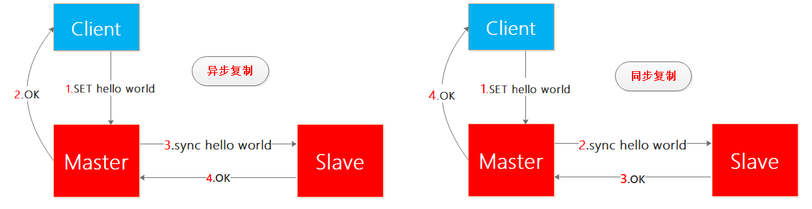
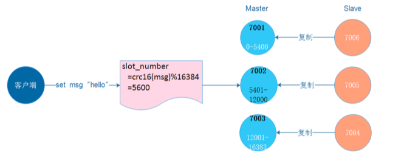
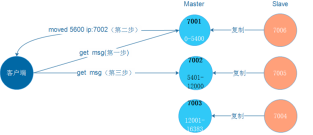
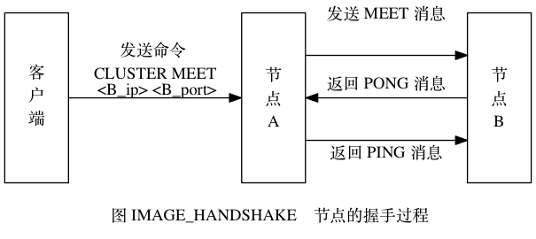

# 多机数据库的实现

包括三个部分：复制、Sentinel、集群

## 一、Redis （主从）复制功能

从服务器（slave) 可以通过 slaveOf 命令或者 slaveof 选项，去复制另一个服务器（主服务器，master）。

**主从复制结合哨兵模式能解决单点故障问题，提高 Redis 可用性。主节点提供写操作，从节点仅提供读操作**。

**主从复制的作用：**

- **数据冗余**：实现数据冗余备份，这样一台节点挂了之后，其上的数据不至于丢失。
- **故障恢复**：当主节点出现问题时，其从节点可以被提升为主节点继续提供服务，实现快速的故障恢复；
- **负载均衡**：在主从复制的基础上，配合读写分离，可以由主节点提供写服务，由从节点提供读服务，分担服务器负载；尤其是在写少读多的场景下，通过多个从节点分担读负载，可以大大提高 Redis 服务器的并发量。

### 主从复制的过程和原理

**Redis主从复制默认是异步实现的**，避免客户端的等待。


**复制过程：**

- 开启：从节点执行 `slavaof[masterIP][masterPort]`，保存主节点信息；如 `A> SLAVEOF  B的IP  B的端口`   =》 A 成为 B 的从服务器

- 从节点的定时任务发现主节点信息，建立和主节点的 Socket 连接；从节点发送 Ping 信号，主节点返回 Pong，连接建立后，主节点将所有数据发送给从节点（**全量复制**）。

- 完成了复制的建立过程后，主节点持续的把写命令发送给从节点（**增量复制**），保证主从数据一致性。

  全量复制是从结点因为**故障恢复或者新添加从结点时**出现的初始化阶段的数据复制。增量复制是主从结点正常工作之后的每个时刻进行的数据复制方式。

Redis中，从服务器对主服务器的复制可以分为以下两种情况：

- 初次复制：从服务器以前没有复制过任何主服务器，或者从服务器当前要复制的主服务器和上一次复制的主服务器不同；

- 断线后复制：处于**命令传播阶段**的主从服务器因为网络原因而中断了复制，但从服务器通过自动重新连接连上了主服务器，并继续复制主服务器；

  **旧版复制功能，在主从服务器断线重连之后，从库会向主库发送 SYNC 命令，主库接收到之后会触发 BGSAVE，然后将所有的键形成 RDB 文件发送给从库，再次完成同步**。为了解决旧版复制功能在处理断线重复机制情况时的低效问题，Redis 从 2.8 版本开始，使用PSYNC 命令代替 SYNC 命令来执行复制时的同步操作：

### Redis 新复制功能的实现

Redis 的复制功能分为同步（Psync）和命令传播（command propagate）两个操作，而同步针对不同的阶段划分为两种；

- **完整重同步**用于将**从服务器的数据库状态更新至主服务器当前所处的数据库状态**。【用于初次复制阶段】

  从服务器对主服务器的同步操作需要通过向主服务器发送 SYNC 命令来完成，该命令的执行步骤：

  - 从服务器向主服务器发送 SYNC 命令。

  - 主服务器收到 SYNC 命令后执行 BGSAVE 命令， 在后台生成一个 RDB 文件， **并使用一个缓冲区记录从现在开始执行的所有写命令。**

  - 主服务器将生成的 RDB 文件发送给从服务器， 从服务器接收并载入这个 RDB 文件， 将自己的数据库状态更新至主服务器执行 BGSAVE 命令时的数据库状态。

  - 主服务器将记录在缓冲区里面的所有写命令发送给从服务器， 从服务器执行这些写命令， 将自己的数据库状态更新至主服务器数据库当前所处的状态。

- 部分重同步（partial resynchronization）：用于处理断线后同步机制，当从服务器在断线后重新连接主服务器时，从服务器向主服务器发送 PSYNC 命令，然后主库返回 + CONTIUNE 回复，表示执行部分重同步，从库接收到 + CONTIUNE 之后，准备执行部分重同步，然后主库只向从服务器发送**后面变动的指令即可**，就可以将数据更新至主服务器当前所处的状态；

- **命令传播**操作则用于**在主服务器的数据库状态被修改， 导致主从服务器的数据库状态出现不一致时， 让主从服务器的数据库重新回到一致状态。**

  主服务器会将自己执行的写命令（即造成主从服务器不一致的那条写命令）发送给从服务器执行， 当从服务器执行了相同的写命令之后， 主从服务器将再次回到一致状态。

#### 部分重同步的实现

PSYNC 功能由以下三个部分构成：

- 主服务器和各个从服务器都维持自身的复制偏移量

  如果主库发送给从库 N 个字节，则主库偏移量 + N，如果从库收到，则从库偏移量 + N；对比两者的复制偏移量则可以判断是否处于一致状态。

- 主服务器的复制积压缓冲区（replication backlog）

  复制积压缓冲区是由**主服务器**维护的一个固定长度先入先出队列（默认 1 MB，可以修改），当主服务器进行**命令传播时候**，不仅会将命令发送给所有的从服务器，也会将命令入队到复制积压缓冲区中。在该缓冲区中为队列中**每个字节记录响应的复制偏移量**。

  所以当上面重连之后从库通过 PSYNC 命令发送自身复制偏移量给主库，主库根据该偏移量决定同步方式：

  如果该偏移量之后的数据在复制积压缓冲区中，则采用部分重同步操作。如果不存在了则采用完整重同步操作。

- 服务器的运行 ID(run ID)

  主从库服务器在启动时候就会生成唯一的运行 ID，当从库对主库进行初次复制的时候，主库会将自身运行 ID 发送给从库进行保存。当断线重连之后判断保存的 ID 和连接的 ID 是否一致，如果一致则是部分重同步，如果不一致则没有连接过，采用完整重同步。

#### 心跳检测

在命令传播阶段，从服务器默认会以每秒一次的频率，向主服务器发送命令：`REPLCONF ACK <replication_off>`，其中 `replication_offset` 是从服务器当前的复制偏移量。
发送 REPLCONF ACK 命令对于主从服务器有三个作用：

- 检测主从服务器的网络连接状态
- 辅助实现 min-slaves 选项
- 检测命令丢失：主从服务器的复制偏移量是否一致

**主从复制存在的问题：**

一旦主节点宕机，从节点晋升为主节点，同时需要修改应用方的主节点地址、命令所有从节点去复制新的主节点，整个过程需要人工干预。

解决方案：**哨兵**

## 二、Sentinel（哨兵）

由一个或者多个 Sentinel 实例组成的 Sentinel 系统可以监视任意多个主服务器，以及他们属下对应的所有从服务器，并在被监视的主服务器下线的时候自动将该主服务器的某个从服务器升级为从服务器。 

#### （一）哨兵的主要功能

- **监控**：包括主节点存活检测、主从运行情况检测。
- **提醒**：当被监控的某个 Redis 服务器出现问题时， Sentinel 可以通过 API 向管理员或者其他应用程序发送通知。
- **自动故障转移**：主从切换。哨兵模式的最小配置是一主一从。

#### （二）哨兵启动和初始化

Redis 启动并初始化 Sentinel：`redis-sentinel /path/to/your/sentinel.conf`。当一个 Sentinel 启动时， 它需要执行以下步骤：

- 初始化服务器。

  因为 Sentinel 本质是一个运行在特殊模式下的 Redis 服务器，初始化过程和普通的部分一样，但不会载入 RDB 或者 AOF 文件。

- 将普通 Redis 服务器使用的代码替换成 Sentinel 专用代码。

  比如普通服务器使用 6379 作为端口号，但是 Sentinel 使用 26379 作为端口，还有特殊的命令表等。

- 初始化 Sentinel 状态。

  服务器会创建一个 sentinelState 结构保存所有和 Sentinel 功能相关的状态，而普通服务器是 RedisServer 结构。

- 根据给定的配置文件， 初始化 Sentinel 的监视主服务器列表。

  上面的 sentinelState 结构中的字典类型的变量 masters 记录了所有被 Sentinel 监视的主服务器的相关信息。

  - 字典的键是被监视主服务器的名字。
  - 字典的值则是被监视主服务器对应的 sentinelRedisInstance 结构（每个结构都是一个被 Sentinel 监视的 Redis 服务器实例，该实例可以是主服务器、从服务器或者另一个 Sentinel）。

- 创建连向主服务器的网络连接。

  Sentinel 将成为主服务器的客户端， 它可以向主服务器发送命令， 并从命令回复中获取相关的信息。对于每个被 Sentinel 监视的主服务器来说， Sentinel 会创建两个连向主服务器的异步网络连接：

  - 一个是命令连接， 这个连接专门用于向主服务器发送命令， 并接收命令回复。
  - 另一个是订阅连接， 这个连接专门用于订阅主服务器的 `__sentinel__:hello` 频道。【因为 Redis 服务器不会保存任何信息，但是客户端可能不在线，所以为了不丢失 hello 频道的信息，但是采用一个订阅连接来接收该频道信息。】

#### （三）获取主服务器、从服务器、哨兵服务器信息

- 获得主服务器信息
  Sentinel 每隔 10s 通过命令连接向主服务器发 `info` 命令，Sentinel 从该命令的返回信息中获取两方面信息：

  关于主服务器本身的信息和主服务属下的所有从服务器信息。

- 获取从服务器信息

  通过主服务器的`info`信息中包含的从服务器信息，Sentinel 再向从服务器建立 2 个连接（命令连接和订阅连接），然后同样以每十秒一次的频率向从服务器发送 INFO 信息，自然就获得了从服务器的信息【最重要的就是从服务器的优先级和从服务器的**复制偏移量**，更新到自己的 slave 字典中。

- 获得其他 Sentinel 的信息
  Sentinel 通过暴露自己的方式让其他哨兵感知到的从而知道其它哨兵，Sentinel 会向主从服务器 `sentinel:hellp` 频道都发布消息，消息内容会包含 sentinel 自身信息和监控的主机信息，那么其他的 sentinel 通过订阅这个频道，可以知道其他 sentinel 的信息。从而使得监视同一个主服务器的多个 Sentinel 可以走动发现对方。发现后就可以互相创建命令连接，最终跟新自身的 sentinel 字典。

#### （四）高可用的方案（哨兵的完整工作过程）

- **检测主观下线**
  每个 Sentinel 每隔 1s 向所有与它创建了命令连接的实例（主、从、其他哨兵）发送 ping，如果在 `down-after-nukkuseconds` 时间内都是返回无效回复，就会被判定为主观下线，然后在结构的 flags 标志改为 `SRI_S_DOWN`

- **检测客观下线**
  当 Sentinel 判定一台服务器主观下线后，会去向其他的 Sentinel 询问（其他哨兵也会像上面一样去探测），如果反馈达到一定数量（数量 quorum 由配置文件配置），则被判定为客观下线。

- **选举 Sentinel 的 leader**

  如果主服务器被判定客观下线，监视这个下线主服务器的各个 Sentinel 会进行协商选出领头 Sentinel 来对下线主服务器执行故障转移操作。

  Sentinel选举是基于 raft 算法选出 leader 的，参考文档：https://www.jianshu.com/writer#/notebooks/28197258/notes/57839517/preview

- **故障转移**
  当选出 Sentinel 的 leader 后，就可以执行故障转移高可用

  - 步骤一：在从服务器里，挑选一个转换为新的主服务器
    挑选的依据主要是根据是否存活，优先级高低，**最大偏移量大小**，运行 id  大小（小的优先），依次选下去。
    发送命令 `slaveof no one` 后，从就会变成主，在此期间，Sentinel 每隔 1s 向服务器发送 info 命令直到info 返回的 role 是 master 了，就确认从已经正确切换成主。
  - 步骤二：修改从服务器的复制目标为新的主服务器
    通过向其他的从服务器发送新的 `slaveof` 命令
  - 让已下线的主设置为新的主服务的从，如果旧主重新上线就变成了新主的从
    保存在自身结构中，这样下掉的主回来就变成新的从了，同样是执行 SLAVEOF 命令

#### （五）哨兵模式的缺陷

在哨兵模式中，仍然只有一个 Master 节点。当并发写请求较大时，哨兵模式并不能缓解写压力。

只有主节点才具有写能力，如果在一个集群中，能够配置多个主节点，就可以缓解写压力了。这个就是 redis-cluster 集群模式。


##  三、集群（Cluster）

**哨兵模式着眼于高可用**：在 Master 宕机时会自动将 Slave 提升为 Master，继续提供服务。

**集群模式着眼于扩展性**：在单个 Redis 内存不足时，使用 Cluster 进行分片存储。Redis 集群是 Redis 提供的分布式数据库方案，集群通过分片（sharding）来进行数据共享，并提供复制和故障转移功能。

### (一)节点

一个 Redis 集群通常由多个节点（node）组成，刚开始每个节点都是相互独立的，它们都处于一个只包含自己的集群当中，通过将各个独立的节点连接起来， 构成一个包含多个节点的集群。

通过 CLUSTER MEET 命令：`CLUSTER MEET <ip> <port>` 来完成连接各个节点的工作

即：向一个节点 `node` 发送 CLUSTER MEET 命令， 可以让 `node` 节点与 `ip` 和 `port` 所指定的节点进行握手（handshake）， 当握手成功时， `node`节点就会将 `ip` 和 `port` 所指定的节点添加到 `node` 节点当前所在的集群中。

举个例子， 假设现在有三个独立的节点 `127.0.0.1:7000` 、 `127.0.0.1:7001` 、 `127.0.0.1:7002` （下文省略 IP 地址，直接使用端口号来区分各个节点）， 我们首先使用客户端连上节点 7000 ， 通过发送 CLUSTER NODE 命令可以看到， 集群目前只包含 7000 自己一个节点：

```
## 当前各个节点都是独立的
$ redis-cli -c -p 7000
127.0.0.1:7000> CLUSTER NODES
51549e625cfda318ad27423a31e7476fe3cd2939 :0 myself,master - 0 0 0 connected

## 向节点 7000 发送以下命令， 我们可以将节点 7001 添加到节点 7000 所在的集群里面，加入其他节点类似
127.0.0.1:7000> CLUSTER MEET 127.0.0.1 7001
OK

127.0.0.1:7000> CLUSTER NODES
68eef66df23420a5862208ef5b1a7005b806f2ff 127.0.0.1:7001 master - 0 1388204746210 0 connected
51549e625cfda318ad27423a31e7476fe3cd2939 :0 myself,master - 0 0 0 connected
```

#### 1.启动节点

一个节点就是一个运行在集群模式下的 Redis 服务器， Redis 服务器在启动时会根据 `cluster-enabled` 配置选项的是否为 `yes` 来决定是否开启服务器的集群模式， 如图所示。


节点（运行在集群模式下的 Redis 服务器）会继续使用所有在单机模式中使用的服务器组件， 比如说：

- 节点会继续使用文件事件处理器来处理命令请求和返回命令回复。
- 节点会继续使用时间事件处理器来执行 `serverCron` 函数， 而 `serverCron` 函数又会调用集群模式特有的 `clusterCron` 函数： `clusterCron`函数负责执行在集群模式下需要执行的常规操作， 比如向集群中的其他节点发送 Gossip 消息， 检查节点是否断线； 又或者检查是否需要对下线节点进行自动故障转移， 等等。
- 节点会继续使用数据库来保存键值对数据，键值对依然会是各种不同类型的对象。
- 节点会继续使用 RDB 持久化模块和 AOF 持久化模块来执行持久化工作。
- 节点会继续使用发布与订阅模块来执行 PUBLISH 、 SUBSCRIBE 等命令。
- 节点会继续使用复制模块来进行节点的复制工作。
- 节点会继续使用 Lua 脚本环境来执行客户端输入的 Lua 脚本。

除此之外，**节点会继续使用 `redisServer` 结构来保存服务器的状态，使用 `redisClient` 结构来保存客户端的状态**，至于那些只有在集群模式下才会用到的数据，节点将它们保存到了 `cluster.h/clusterNode` 结构， `cluster.h/clusterLink` 结构， 以及 `cluster.h/clusterState` 结构里面，接下来的一节将对这三种数据结构进行介绍。

#### 2.集群数据结构

**`clusterNode` 结构保存了一个节点的当前状态**， 比如节点的创建时间，节点的名字，节点当前的配置纪元，节点的 IP 和地址等。

每个节点都会使用一个 `clusterNode` 结构来记录自己的状态，并为集群中的所有其他节点（包括主节点和从节点）都创建一个相应的 `clusterNode` 结构，以此来记录其他节点的状态：

```
struct clusterNode {

    // 创建节点的时间
    mstime_t ctime;

    // 节点的名字，由 40 个十六进制字符组成
    // 例如 68eef66df23420a5862208ef5b1a7005b806f2ff
    char name[REDIS_CLUSTER_NAMELEN];

    // 节点标识
    // 使用各种不同的标识值记录节点的角色（比如主节点或者从节点），
    // 以及节点目前所处的状态（比如在线或者下线）。
    int flags;

    // 节点当前的配置纪元，用于实现故障转移
    uint64_t configEpoch;

    // 节点的 IP 地址
    char ip[REDIS_IP_STR_LEN];

    // 节点的端口号
    int port;

    // 保存连接节点所需的有关信息
    clusterLink *link;

    // ...

};
```

`clusterNode` 结构的 `link` 属性是一个 `clusterLink` 结构，该结构保存了连接节点所需的有关信息，比如套接字描述符，输入缓冲区和输出缓冲区：

```
typedef struct clusterLink {

    // 连接的创建时间
    mstime_t ctime;

    // TCP 套接字描述符
    int fd;

    // 输出缓冲区，保存着等待发送给其他节点的消息（message）。
    sds sndbuf;

    // 输入缓冲区，保存着从其他节点接收到的消息。
    sds rcvbuf;

    // 与这个连接相关联的节点，如果没有的话就为 NULL
    struct clusterNode *node;

} clusterLink;
```

> `redisClient` 结构和 `clusterLink` 结构的相同和不同之处
>
> `redisClient` 结构和 `clusterLink` 结构都有自己的套接字描述符和输入、输出缓冲区，这两个结构的区别在于，**`redisClient` 结构中的套接字和缓冲区是用于连接客户端的，而 `clusterLink` 结构中的套接字和缓冲区则是用于连接节点的**。

最后， **每个节点都保存着一个 `clusterState` 结构，这个结构记录了在当前节点的视角下，集群目前所处的状态** —— 比如集群是在线还是下线， 集群包含多少个节点， 集群当前的配置纪元， 诸如此类：

```
typedef struct clusterState {

    // 指向当前节点的指针
    clusterNode *myself;

    // 集群当前的配置纪元，用于实现故障转移
    uint64_t currentEpoch;

    // 集群当前的状态：是在线还是下线
    int state;

    // 集群中至少处理着一个槽的节点的数量
    int size;

    // 集群节点名单（包括 myself 节点）
    // 字典的键为节点的名字，字典的值为节点对应的 clusterNode 结构
    dict *nodes;

    // ...

} clusterState;
```

以前面介绍的 7000 、 7001 、 7002 三个节点为例，下图展示了节点 7000 创建的 `clusterState` 结构， 这个结构从节点 7000 的角度记录了集群、以及集群包含的三个节点的当前状态 （为了空间考虑，图中省略了 `clusterNode` 结构的一部分属性）：

- 结构的 `currentEpoch` 属性的值为 `0` ， 表示集群当前的配置纪元为 `0` 。
- 结构的 `size` 属性的值为 `0`，表示集群目前没有任何节点在处理槽： 因此结构的 `state` 属性的值为 `REDIS_CLUSTER_FAIL` —— 这表示集群目前处于下线状态。
- **结构的 `nodes` 字典记录了集群目前包含的三个节点**， 这三个节点分别由三个 `clusterNode` 结构表示： 其中 `myself` 指针指向代表节点 7000 的 `clusterNode` 结构， 而字典中的另外两个指针则分别指向代表节点 7001 和代表节点 7002 的 `clusterNode` 结构， 这两个节点是节点 7000 已知的在集群中的其他节点。
- 三个节点的 `clusterNode` 结构的 **`flags` 属性**都是 `REDIS_NODE_MASTER` ，说明三个节点都是主节点。

节点 7001 和节点 7002 也会创建类似的 `clusterState` 结构，只不过在节点 7001 创建的 `clusterState` 结构中， `myself` 指针将指向代表节点 7001 的 `clusterNode` 结构， 而节点 7000 和节点 7002 则是集群中的其他节点。7002 类似。


#### 3.CLUSTER MEET 命令的实现

通过向节点 A 发送 CLUSTER MEET 命令， 客户端可以让接收命令的节点 A 将另一个节点 B 添加到节点 A 当前所在的集群里面：

```
CLUSTER MEET <ip> <port>
```

收到命令的节点 A 将与节点 B 进行握手（handshake）， 以此来确认彼此的存在， 并为将来的进一步通信打好基础：

1. 节点 A 会为节点 B 创建一个 `clusterNode` 结构， 并将该结构添加到自己的 `clusterState.nodes` 字典里面。
2. 之后， 节点 A 将根据 CLUSTER MEET 命令给定的 IP 地址和端口号， 向节点 B 发送一条 `MEET` 消息（message）。
3. 如果一切顺利， 节点 B 将接收到节点 A 发送的 `MEET` 消息， 节点 B 会为节点 A 创建一个 `clusterNode` 结构， 并将该结构添加到自己的 `clusterState.nodes` 字典里面。
4. 之后， 节点 B 将向节点 A 返回一条 `PONG` 消息。
5. 如果一切顺利， 节点 A 将接收到节点 B 返回的 `PONG` 消息， 通过这条 `PONG` 消息节点 A 可以知道节点 B 已经成功地接收到了自己发送的 `MEET` 消息。
6. 之后， 节点 A 将向节点 B 返回一条 `PING` 消息。
7. 如果一切顺利， 节点 B 将接收到节点 A 返回的 `PING` 消息， 通过这条 `PING` 消息节点 B 可以知道节点 A 已经成功地接收到了自己返回的 `PONG` 消息， 握手完成。

图 IMAGE_HANDSHAKE 展示了以上步骤描述的握手过程。


之后， 节点 A 会将节点 B 的信息通过 Gossip 协议传播给集群中的其他节点， 让其他节点也与节点 B 进行握手， 最终， 经过一段时间之后， 节点 B 会被集群中的所有节点认识。

### （二）槽指派

**Redis 集群通过分片的方式来保存数据库中的键值对：集群的整个数据库被分为 16384 个槽（slot），数据库中每个键都属于这 16384 个槽的其中一个，集群中的每个节点可以处理 0 个或最多 16384 个槽**。

当数据库中的 16384 个槽都有节点在处理时，集群处于上线状态（ok）；相反地，如果数据库中有任何一个槽没有得到处理，那么集群处于下线状态（fail）。其中集群状态可以在集群中某个节点上执行：`CLUSTER INFO` 实现。

通过向节点发送 `CLUSTER ADDSLOTS` 命令，我们可以将一个或多个槽指派（assign）给节点负责：`CLUSTER ADDSLOTS <slot> [slot ...]`.

```shell
127.0.0.1:7000> CLUSTER ADDSLOTS 0 1 2 3 4 ... 5000
## 其它节点类似，全部指定完成之后，使用 CLUSTER INFO 查看集群信息，即可看到 cluster_state 属性为 ok，表示集群处于上线状态；
```

==书看到这里就没有记录了====

接下来分别介绍节点保存槽指派信息的方法，以及节点之间传播槽指派信息的方法，之后是CLUSTER ADDSLOTS命令的实现。

## 二 记录槽节点指派信息

  clusterNode结构的slots属性和numslot属性记录了节点负责处理哪些槽：

```cpp
typedef struct clusterNode {


    // 节点的槽位图


    unsigned char slots[CLUSTER_SLOTS/8]; /* slots handled by this node */


    // 当前节点复制槽的数量


    int numslots;   /* Number of slots handled by this node */


} clusterNode;
```

slots属性是一个二进制位数组（bit array），这个数组的长度为16384/8=2048个字节，共包含16384个二进制位。
Redis以0为起始索引，16383为终止索引，对slots数组中的16384个二进制位进行编号，并根据索引i上的二进制位的值来判断节点是否负责处理槽i：

- 如果slots数组在索引i上的二进制位的值为1，那么表示节点负责处理槽i；
- 如果slots数组在索引i上的二进制位的值为0，那么表示节点不负责处理槽i；

至于numslots属性则记录节点负责处理的槽的数量，也即是slots数组中值为1的二进制位的数量。

这个数组的索引1,3,5,8,910的二进制位值为1，其他的位置二进制值为0，表示节点负责处理槽1,3,5,8,9,10


## 三 传播节点的槽指派信息

​    一个节点除了会将自己负责处理的槽记录在clusterNode结构的slots属性和numslots属性之外，它还会将自己的slots数组通过消息发送给集群中的其他节点，以此来告知其他节点自己目前负责处理哪些槽。
​    当节点A通过消息从节点B那里接收到节点B的slots数组时，节点A会在自己的clusterState.nodes字典中查找节点B对应的clusterNode结构，并对结构中的slots数组进行保存或者更新。
​     因为集群中的每个节点都会将自己的slots数组通过消息发送给集群中的其他节点，并且每个接收到slots数组的节点都会将数组保存到相应节点的clusterNode结构里面，因此，集群中的每个节点都会知道数据库中的16384个槽分别被指派给了集群中的哪些节点。

   在调用`clusterBuildMessageHdr()`函数构建消息包的头部时，会将发送节点的槽位信息添加进入。

```cpp
/* Build the message header. hdr must point to a buffer at least


 * sizeof(clusterMsg) in bytes. */


// 构建信息头部 ，hdr至少指向一个sizeof(clusterMsg)大小的缓冲区


void clusterBuildMessageHdr(clusterMsg *hdr, int type) {


    int totlen = 0;


    uint64_t offset;


    clusterNode *master;


 


    /* If this node is a master, we send its slots bitmap and configEpoch.


     * 如果这是一个主节点，那么发送该节点的槽 bitmap 和配置纪元。 


     * If this node is a slave we send the master's information instead (the


     * node is flagged as slave so the receiver knows that it is NOT really


     * in charge for this slots. 


     * 如果当前节点是从节点，发送它主节点的槽位图信息和配置纪元


     */


    master = (nodeIsSlave(myself) && myself->slaveof) ?


              myself->slaveof : myself;


    // 清零信息头


    memset(hdr,0,sizeof(*hdr));


    // 设置头部的签名


    hdr->ver = htons(CLUSTER_PROTO_VER);


    hdr->sig[0] = 'R';


    hdr->sig[1] = 'C';


    hdr->sig[2] = 'm';


    hdr->sig[3] = 'b';


    // 设置信息类型


    hdr->type = htons(type);


    // 设置信息发送者


    memcpy(hdr->sender,myself->name,CLUSTER_NAMELEN);


    // 设置当前节点负责的槽


    memcpy(hdr->myslots,master->slots,sizeof(hdr->myslots));


     // 清零从属的主节点信息


    memset(hdr->slaveof,0,CLUSTER_NAMELEN);


    // 如果myself是从节点，设置消息头部从属主节点的信息


    if (myself->slaveof != NULL)


        memcpy(hdr->slaveof,myself->slaveof->name, CLUSTER_NAMELEN);


    // 设置port    


    hdr->port = htons(server.port);


    // 设置myself节点类型


    hdr->flags = htons(myself->flags);


    // 设置当前集群的状态


    hdr->state = server.cluster->state;


 


    /* Set the currentEpoch and configEpochs. */


    // 设置集群当前纪元和主节点配置纪元


    hdr->currentEpoch = htonu64(server.cluster->currentEpoch);


    hdr->configEpoch = htonu64(master->configEpoch);


 


    /* Set the replication offset. */


     // 如果myself是从节点


    if (nodeIsSlave(myself))


    	   // 获取复制偏移量


        offset = replicationGetSlaveOffset();


    else  // myself是主节点，获取复制的偏移量


        offset = server.master_repl_offset;


     // 设置复制偏移量    


    hdr->offset = htonu64(offset);


 


    /* Set the message flags. */


    // 如果myself是主节点，正在进行手动故障转移


    if (nodeIsMaster(myself) && server.cluster->mf_end)


    	  // 设置主节点暂停手动故障转移的标识


        hdr->mflags[0] |= CLUSTERMSG_FLAG0_PAUSED;


 


    /* Compute the message length for certain messages. For other messages


     * this is up to the caller. */


     // 如果消息是 FAIL 类型的，计算消息的总长度 


    if (type == CLUSTERMSG_TYPE_FAIL) {


        totlen = sizeof(clusterMsg)-sizeof(union clusterMsgData);


        totlen += sizeof(clusterMsgDataFail);


     // 如果消息是 UPDATE 类型的，计算消息的总长度   


    } else if (type == CLUSTERMSG_TYPE_UPDATE) {


        totlen = sizeof(clusterMsg)-sizeof(union clusterMsgData);


        totlen += sizeof(clusterMsgDataUpdate);


    }


     // 设置信息的长度


    hdr->totlen = htonl(totlen);


    /* For PING, PONG, and MEET, fixing the totlen field is up to the caller. */


}
```

在调用`clusterProcessPacket()`函数处理消息包时，会根据消息包的信息，如果出现槽位分配信息不匹配的情况，会更新当前节点视角的槽位分配的信息。该函数的处理这种情况的代码如下：

```cpp
 /* Update our info about served slots.


         *


         * Note: this MUST happen after we update the master/slave state


         * so that CLUSTER_NODE_MASTER flag will be set. */


         // 更新当前节点所负责的槽信息


        /* Many checks are only needed if the set of served slots this


         * instance claims is different compared to the set of slots we have


         * for it. Check this ASAP to avoid other computational expansive


         * checks later. */


         // 这些操作必须在更新主从状态之后进行，因为需要CLUSTER_NODE_MASTER标识 


        clusterNode *sender_master = NULL; /* Sender or its master if slave. */


        int dirty_slots = 0; /* Sender claimed slots don't match my view? */


 


        if (sender) {


        	  // 如果sender是从节点，那么获取其主节点信息


            // 如果sender是主节点，那么获取sender的信息


            sender_master = nodeIsMaster(sender) ? sender : sender->slaveof;


            if (sender_master) {


            	    // sender发送的槽信息和主节点的槽信息是否匹配


                dirty_slots = memcmp(sender_master->slots,


                        hdr->myslots,sizeof(hdr->myslots)) != 0;


            }


        }


 


        /* 1) If the sender of the message is a master, and we detected that


         *    the set of slots it claims changed, scan the slots to see if we


         *    need to update our configuration. */


          // 1. 如果sender是主节点，但是槽信息出现不匹配现象 


        if (sender && nodeIsMaster(sender) && dirty_slots)


        	   // 检查当前节点对sender的槽信息，并且进行更新


            clusterUpdateSlotsConfigWith(sender,senderConfigEpoch,hdr->myslots);
```

发送节点负责了一些槽位之后，将这些槽位信息通过发送包发送给myself节点，在myself节点视角的集群中查找的sender节点则是没有设置关于发送节点的槽位信息。所以dirty_slots被赋值为1，表示出现了槽位信息不匹配的情况。最终会调用clusterUpdateSlotsConfigWith()函数更新myself节点视角中，集群关于发送节点的槽位信息。该函数代码如下
 

```cpp
/* This function is called when we receive a master configuration via a


 * PING, PONG or UPDATE packet. What we receive is a node, a configEpoch of the


 * node, and the set of slots claimed under this configEpoch.


 * 这个函数在节点通过 PING 、 PONG 、 UPDATE 消息接收到一个 master 的配置时调用，


 * 函数以一个节点，节点的 configEpoch ，


 * 以及节点在 configEpoch 纪元下的槽配置作为参数。


 *


 * What we do is to rebind the slots with newer configuration compared to our


 * local configuration, and if needed, we turn ourself into a replica of the


 * node (see the function comments for more info).


 * 要做的就是在 slots 参数的新配置和本节点的当前配置进行对比，并更新本节点对槽的布局，


 * 如果需要，将本节点转换为一个复制的节点


 *


 * The 'sender' is the node for which we received a configuration update.


 * Sometimes it is not actually the "Sender" of the information, like in the


 * case we receive the info via an UPDATE packet.


 * 根据情况， sender 参数可以是消息的发送者，也可以是消息发送者的主节点。 


 */


 


void clusterUpdateSlotsConfigWith(clusterNode *sender, uint64_t senderConfigEpoch, unsigned char *slots) {


    int j;


    clusterNode *curmaster, *newmaster = NULL;


    /* The dirty slots list is a list of slots for which we lose the ownership


     * while having still keys inside. This usually happens after a failover


     * or after a manual cluster reconfiguration operated by the admin.


     *


     * If the update message is not able to demote a master to slave (in this


     * case we'll resync with the master updating the whole key space), we


     * need to delete all the keys in the slots we lost ownership. */


    uint16_t dirty_slots[CLUSTER_SLOTS];


    int dirty_slots_count = 0;


 


    /* Here we set curmaster to this node or the node this node


     * replicates to if it's a slave. In the for loop we are


     * interested to check if slots are taken away from curmaster. */


     // 如果当前节点是主节点，那么获取当前节点


    // 如果当前节点是从节点，那么获取当前从节点所从属的主节点


    curmaster = nodeIsMaster(myself) ? myself : myself->slaveof;


 


    // 如果发送消息的节点就是本节点，则直接返回


    if (sender == myself) {    	 


        serverLog(LL_WARNING,"Discarding UPDATE message about myself.");


        return;


    }


	  


	  // 遍历所有槽 


    for (j = 0; j < CLUSTER_SLOTS; j++) {


    	    // 如果 slots 中的槽 j 已经被指派，那么执行以下代码


        if (bitmapTestBit(slots,j)) {


            /* The slot is already bound to the sender of this message. */


             // 如果当前槽是sender负责的，那么跳过当前槽


            if (server.cluster->slots[j] == sender) continue;


 


            /* The slot is in importing state, it should be modified only


             * manually via redis-trib (example: a resharding is in progress


             * and the migrating side slot was already closed and is advertising


             * a new config. We still want the slot to be closed manually). */


              // 如果当前槽处于导入状态，它应该只能通过redis-trib 被手动修改，所以跳过该槽


            if (server.cluster->importing_slots_from[j]) continue;


 


            /* We rebind the slot to the new node claiming it if:


             *   将槽重新绑定到新的节点，如果满足以下条件


             * 1) The slot was unassigned or the new node claims it with a


             *    greater configEpoch.


             *    1.槽没有被指定或者新的节点声称它有一个更大的配置纪元


             * 2) We are not currently importing the slot. 


             *    2.当前没有导入该槽


             */


            if (server.cluster->slots[j] == NULL ||


                server.cluster->slots[j]->configEpoch < senderConfigEpoch)


            {


                /* Was this slot mine, and still contains keys? Mark it as


                 * a dirty slot. */


                 // 如果当前槽被当前节点所负责，而且槽中有数据，表示该槽发生冲突


                if (server.cluster->slots[j] == myself &&


                    countKeysInSlot(j) &&


                    sender != myself)


                {   // 将发生冲突的槽记录到脏槽中


                    dirty_slots[dirty_slots_count] = j;


                    // 脏槽数加1


                    dirty_slots_count++;


                }


                // 负责槽 j 的原节点是当前节点的主节点？


                // 如果是的话，说明故障转移发生了，将当前节点的复制对象设置为新的主节点


                if (server.cluster->slots[j] == curmaster)


                    newmaster = sender;


                // 删除当前被指定的槽    


                clusterDelSlot(j);


                // 将槽分配给sender


                clusterAddSlot(sender,j);


                clusterDoBeforeSleep(CLUSTER_TODO_SAVE_CONFIG|


                                     CLUSTER_TODO_UPDATE_STATE|


                                     CLUSTER_TODO_FSYNC_CONFIG);


            }


        }


    }


 


    /* If at least one slot was reassigned from a node to another node


     * with a greater configEpoch, it is possible that:


     * 如果当前节点（或者当前节点的主节点）有至少一个槽被指派到了 sender


     * 并且 sender 的 configEpoch 比当前节点的纪元要大，那么可能发生了：


     * 1) We are a master left without slots. This means that we were


     *    failed over and we should turn into a replica of the new


     *    master.


     *  1 当前节点是一个不在处理任何槽的主节点，这是应该将当前节点设置为新主节点的从节点


     * 2) We are a slave and our master is left without slots. We need


     *    to replicate to the new slots owner. 


     *  当前节点是一个从节点，并且当前节点的主节点不在处理任何槽，这是应该将当前节点设置为新主节点的从节点


     */


    if (newmaster && curmaster->numslots == 0) {


        serverLog(LL_WARNING,


            "Configuration change detected. Reconfiguring myself "


            "as a replica of %.40s", sender->name);


        // 将 sender 设置为当前节点的主节点    


        clusterSetMaster(sender);


        clusterDoBeforeSleep(CLUSTER_TODO_SAVE_CONFIG|


                             CLUSTER_TODO_UPDATE_STATE|


                             CLUSTER_TODO_FSYNC_CONFIG);


    } else if (dirty_slots_count) {


        /* If we are here, we received an update message which removed


         * ownership for certain slots we still have keys about, but still


         * we are serving some slots, so this master node was not demoted to


         * a slave.


         * 如果执行到这里，我们接收到一个删除当前我们负责槽的所有者的更新消息,


         * 但是我们仍然负责该槽，所以主节点不能被降级为从节点


         * In order to maintain a consistent state between keys and slots


         * we need to remove all the keys from the slots we lost. 


         * 为了保持键和槽的关系，需要从我们丢失的槽中将键删除


         */


        for (j = 0; j < dirty_slots_count; j++)


            // 遍历所有的脏槽，删除槽中的键-


            delKeysInSlot(dirty_slots[j]);


    }


}
```

更新槽位信息的两种情况：

- 如果`myself`节点视角下集群关于该槽没有指定负责的节点，会直接调用函数指派槽位。
- 如果发送节点的配置纪元更大，表示发送节点版本更新。这种情况需要进行两个`if`判断，判断是否发生了槽位指派节点冲突和是否检测到了故障。 

最后都需要调用`clusterAddSlot()`函数，将当前槽位指派给`myself`节点视角下的集群中的`sender`节点。这样`myself`节点就知道了发送节点的槽分配信息。如果时间足够，每个主节点都会将自己负责的槽位信息告知给每一个集群中的其他节点，于是，集群中的每一个节点都会知道`16384`个槽分别指派给了集群中的哪个节点。

## 四 记录集群所有槽的指派信息

clusterState结构中的slots数组记录了集群中所有16384个槽的指派信息。

```cpp
typedef struct clusterState {


    // 导出槽数据到目标节点，该数组记录这些节点


    clusterNode *migrating_slots_to[CLUSTER_SLOTS];


    // 导入槽数据到目标节点，该数组记录这些节点


    clusterNode *importing_slots_from[CLUSTER_SLOTS];


    // 槽和负责槽节点的映射


    clusterNode *slots[CLUSTER_SLOTS];


    // 槽映射到键的跳跃表


    zskiplist *slots_to_keys;


} clusterState;
```

migrating_slots_to是一个数组，用于重新分片时保存：从当前节点导出的槽位的到负责该槽位的节点的映射关系。
importing_slots_from是一个数组，用于重新分片时保存：往当前节点导入的槽位的到负责该槽位的节点的映射关系。
slots是一个数组，保存集群中所有主节点和其负责的槽位的映射关系。
slots_to_keys是一个跳跃表，用于CLUSTER GETKEYSINSLOT命令可以返回多个属于槽位的键，通过遍历跳跃表实现。

- 如果slots[i]指针指向NULL，那么表示槽i尚未指派给任何节点。
- 如果slots[i]指针指向一个clusterNode结构，那么表示槽i已经指派给了clusterNode结构所代表的节点。

通过将所有槽的指派信息保存在clusterState.slots数组里面，程序要检查槽i是否已经被指派，又或者取得负责处理槽i的节点，只需要访问clusterState.slots[i]的值即可，这个操作的复杂度仅为O(1)。

要说明的一点是，虽然clusterState.slots数组中记录了集群中所有槽的指派信息，但使用clusterNode结构的slots数组来记录单个节点的槽指派信息仍然是有必要的：

- 因为当程序需要将某个节点的槽指派信息通过消息发送给其他节点时，程序只需要将相应节点的clusterNode.slots数组整个发送出去就可以了。
- 另一方面，如果Redis不使用clusterNode.slots数组，而单独使用clusterState.slots数组的话，那么每次要将节点A的槽指派信息传播给其他节点时，程序必须先遍历整个clusterState.slots数组，记录节点A负责处理哪些槽，然后才能发送节点A的槽指派信息，这比直接发送clusterNode.slots数组要麻烦和低效得多。
  clusterState.slots数组记录了集群中所有槽的指派信息，而clusterNode.slots数组只记录了clusterNode结构所代表的节点的槽指派信息，这是两个slots数组的关键区别所在。

## 五 CLUSTER ADDSLOTS命令的实现

   CLUSTER ADDSLOTS命令接受一个或多个槽作为参数，并将所有输入的槽指派给接收该命令的节点负责。当节点接收到客户端的`cluster addslots`命令后会调用对应的函数来处理命令，该命令的执行函数是`clusterCommand()`函数，该函数能够处理所有的`cluster`命令，因此我们列出处理`addslots`选项的代码：

```cpp
 else if ((!strcasecmp(c->argv[1]->ptr,"addslots") ||


               !strcasecmp(c->argv[1]->ptr,"delslots")) && c->argc >= 3)


    {


        /* CLUSTER ADDSLOTS <slot> [slot] ... */


        /* CLUSTER DELSLOTS <slot> [slot] ... */


        int j, slot;


        unsigned char *slots = zmalloc(CLUSTER_SLOTS);


        // 删除操作


        int del = !strcasecmp(c->argv[1]->ptr,"delslots");


 


        memset(slots,0,CLUSTER_SLOTS);


        /* Check that all the arguments are parseable and that all the


         * slots are not already busy. */


        // 遍历所有指定的槽


        for (j = 2; j < c->argc; j++) {


            // 获取槽位的位置


            if ((slot = getSlotOrReply(c,c->argv[j])) == -1) {


                zfree(slots);


                return;


            }


            // 如果是删除操作，但是槽没有指定负责的节点，回复错误信息


            if (del && server.cluster->slots[slot] == NULL) {


                addReplyErrorFormat(c,"Slot %d is already unassigned", slot);


                zfree(slots);


                return;


            // 如果是添加操作，但是槽已经指定负责的节点，回复错误信息


            } else if (!del && server.cluster->slots[slot]) {


                addReplyErrorFormat(c,"Slot %d is already busy", slot);


                zfree(slots);


                return;


            }


            // 如果某个槽已经指定过多次了（在参数中指定了多次），那么回复错误信息


            if (slots[slot]++ == 1) {


                addReplyErrorFormat(c,"Slot %d specified multiple times",


                    (int)slot);


                zfree(slots);


                return;


            }


        }


        // 上个循环保证了指定的槽的可以处理


        for (j = 0; j < CLUSTER_SLOTS; j++) {


            // 如果当前参数中指定槽


            if (slots[j]) {


                int retval;


 


                /* If this slot was set as importing we can clear this


                 * state as now we are the real owner of the slot. */


                // 如果这个槽被设置为导入状态，那么取消该状态


                if (server.cluster->importing_slots_from[j])


                    server.cluster->importing_slots_from[j] = NULL;


                // 执行删除或添加操作


                retval = del ? clusterDelSlot(j) :


                               clusterAddSlot(myself,j);


                serverAssertWithInfo(c,NULL,retval == C_OK);


            }


        }


        zfree(slots);


        // 更新集群状态和保存配置


        clusterDoBeforeSleep(CLUSTER_TODO_UPDATE_STATE|CLUSTER_TODO_SAVE_CONFIG);


        addReply(c,shared.ok);


 


    }
```

首先判断当前操作是删除还是添加。其次判断指定要加入的槽位值是否合法.最后遍历所有参数中指定的槽位值，调用clusterAddSlot()将槽位指派给myself节点。代码如下：

```cpp
/* Add the specified slot to the list of slots that node 'n' will


 * serve. Return C_OK if the operation ended with success.


 * If the slot is already assigned to another instance this is considered


 * an error and C_ERR is returned. */


int clusterAddSlot(clusterNode *n, int slot) {


	   // 如果已经指定有节点，则返回C_ERR


    if (server.cluster->slots[slot]) return C_ERR;


    // 设置该槽被指定	


    clusterNodeSetSlotBit(n,slot);


     // 设置负责该槽的节点n


    server.cluster->slots[slot] = n;


    return C_OK;


}
```

`clusterNodeSetSlotBit()`会将`myself`节点槽位图中对应参数指定的槽值的那些位，设置为1，表示这些槽位由`myself`节点负责。

```cpp
/* Set the slot bit and return the old value. */


// 设置slot槽位并返回旧的值


int clusterNodeSetSlotBit(clusterNode *n, int slot) {


    // 查看slot槽位是否被设置


    int old = bitmapTestBit(n->slots,slot);


    // 将slot槽位设置为1


    bitmapSetBit(n->slots,slot);


    // 如果之前没有被设置


    if (!old) {


        // 那么要更新n节点负责槽的个数


        n->numslots++;


        /* When a master gets its first slot, even if it has no slaves,


         * it gets flagged with MIGRATE_TO, that is, the master is a valid


         * target for replicas migration, if and only if at least one of


         * the other masters has slaves right now.


         *


         * Normally masters are valid targerts of replica migration if:


         * 1. The used to have slaves (but no longer have).


         * 2. They are slaves failing over a master that used to have slaves.


         *


         * However new masters with slots assigned are considered valid


         * migration tagets if the rest of the cluster is not a slave-less.


         *


         * See https://github.com/antirez/redis/issues/3043 for more info. */


        // 如果主节点是第一次指定槽，即使它没有从节点，也要设置MIGRATE_TO标识


        // 当且仅当至少有一个其他的主节点有从节点时，主节点才是有效的迁移目标


        if (n->numslots == 1 && clusterMastersHaveSlaves())


            // 设置节点迁移的标识


            n->flags |= CLUSTER_NODE_MIGRATE_TO;


    }


    return old;


}
```

最后在cluster addslots 命令执行完成后，节点会通过发送消息告知集群中的其他节点，自己正在处理那些槽。


### （一）集群模式

- 由多个 Redis 服务器组成的分布式网络服务集群，Redis 集群中无中心节点，各个节点之间会互相通信，两两相连；
- 集群之中有**多个 Master 主节点**，每一个主节点都可读可写；可以给每一个主节点添加从节点，主节点和从节点遵循主从模型的特性

### （二）集群分片策略

Redis-cluster 分片策略用来解决 key 存储位置。



**集群将整个数据库分为 16384 个槽位 slot，所有 key-value 数据都存储在这些 slot 中的某一个上**。一个 slot 槽位可以存放多个数据，key 的槽位计算公式为：`slot_number=crc16(key)%16384`，其中 crc16 为 16 位的循环冗余校验和函数。

**集群中的每个主节点都可以处理 0 个至 16383 个槽**，当 16384 个槽都有节点在负责处理时，集群进入上线状态，并开始处理客户端发送的数据命令请求。

### （三）集群 redirect 转向

由于 Redis 集群无中心节点，**请求会随机发给任意主节点**；

**主节点只会处理自己负责槽位的命令请求，其它槽位的命令请求，该主节点会返回客户端一个转向错误。
客户端根据错误中包含的地址和端口重新向正确的负责的主节点发起命令请求。**



### 节点

- 一个 Redis 集群通常由多个节点组成，刚开始时，每个节点是相互独立的，我们必须将各个独立的节点连接起来。

- 节点通过握手来将其他节点添加到自己所处的集群中。如通过 `127.0.0.1:7000>CLUSTER MEET 127.0.0.1 7001` 可以将 7001 添加到节点 7000 所在的集群里。

- 一个节点就是一个运行在集群模式下的 Redis 服务器， Redis 服务器在启动时会根据 `cluster-enabled` 配置选项的是否为 `yes` 来决定是否开启服务器的集群模式。

  除此之外， 节点会继续使用 `redisServer` 结构来保存服务器的状态， 使用 `redisClient` 结构来保存客户端的状态，至于那些只有在集群模式下才会用到的数据， 节点将它们保存到了 `cluster.h/clusterNode` 结构、 `cluster.h/clusterLink` 结构以及 `cluster.h/clusterState` 结构里面；

  - `clusterNode` 结构保存了一个节点的当前状态， 比如节点的创建时间， 节点的名字， 节点当前的配置纪元， 节点的 IP 和地址等。每个节点都会使用一个 `clusterNode` 结构来记录自己的状态， 并为集群中的所有其他节点（包括主节点和从节点）都创建一个相应的`clusterNode` 结构， 以此来记录其他节点的状态：

  - 每个节点都保存着一个 `clusterState` 结构， 这个结构记录了在当前节点的视角下， 集群目前所处的状态 —— 比如集群是在线还是下线， 集群包含多少个节点， 集群当前的配置纪元；

### （三）CLUSTER MEET 命令的实现

通过向节点 A 发送 CLUSTER MEET 命令， 客户端可以让接收命令的节点 A 将另一个节点 B 添加到节点 A 当前所在的集群里面，过程和图见下：

- 节点 A 会为节点 B 创建一个 `clusterNode` 结构， 并将该结构添加到自己的 `clusterState.nodes` 字典里面。

- 然后节点 A 将根据 CLUSTER MEET 命令给定的 IP 地址和端口号， 向节点 B 发送一条 `MEET` 消息（message）。

- 如果一切顺利， 节点 B 将接收到节点 A 发送的 `MEET` 消息， 节点 B 会为节点 A 创建一个 `clusterNode` 结构， 并将该结构添加到自己的 `clusterState.nodes` 字典里面。

- 之后， 节点 B 将向节点 A 返回一条 `PONG` 消息。

- 如果一切顺利， 节点 A 将接收到节点 B 返回的 `PONG` 消息， 通过这条 `PONG` 消息节点 A 可以知道节点 B 已经成功地接收到了自己发送的 `MEET` 消息。

- 之后， 节点 A 将向节点 B 返回一条 `PING` 消息。

- 如果一切顺利， 节点 B 将接收到节点 A 返回的 `PING` 消息， 通过这条 `PING` 消息节点 B 可以知道节点 A 已经成功地接收到了自己返回的 `PONG` 消息， 握手完成。



之后， 节点 A 会将节点 B 的信息通过 Gossip 协议传播给集群中的其他节点， 让其他节点也与节点 B 进行握手， 最终， 经过一段时间之后， 节点 B 会被集群中的所有节点认识。

### （四）槽指派

- **Redis 集群通过分片的方式来保存数据库中的键值对，集群的整个数据库被分为 16384 个槽（slot）**。

- 数据库中每个键都属于其中一个槽，每个节点可以处理 0-16383 个槽。

- 当16384个槽都有节点在处理时，集群处于上线状态，只要有一个槽没有得到处理，那么集群处于下线状态。

  `127.0.0.1:7000>CLUSTER ADDSLOTS 0 1 2 3 4 ... 5000` 可以将槽 0-5000 指派给节点 7000 负责。

- 每个节点的 clusterNode 结构的 slots 属性（是一个二进制数组）都会记录哪些槽指派给了自己，哪些槽指派给了其他节点。同时会将自己的 slots 数组通过消息发送给集群中的其他节点，告知其他节点自己负责处理哪些槽。

- clusterState 结构中的 slots 记录了集群中所有槽的指派信息。

### （五）在集群中执行命令流程

- 客户端向节点发送键命令，节点首先要计算这个键属于哪个槽。计算方式是计算键的 CRC-16 校验和然后 & 16383 得到一个介于 0 到 16383 的整数作为 key 的槽号。

- 如果是自己负责这个槽，那么直接执行命令，如果不是，向客户端返回一个 MOVED 错误，指引客户端转向正确的节点。确定 i 漕之后，判断方式是节点检查自己的 clusterState.slots 数组的项 i ，如果值是 clusterState.myself 则是当前节点负责，节点可以执行客户端发送的命令，如果不等会根据数组中项 i 的值指向的 clusterNode 结构记录的 IP 和端口号转向正确的漕。

- 集群节点保存键值对以及键值对过期时间的方式和单机一致，区别就是节点只能使用 0 号数据库，单机没有限制。

### （六）重新分片

重写分片操作可以将任意数量已经指派给某个节点的槽改为指派给另一个节点。**该操作可以在线进行**，源节点和目标节点都可以继续处理命令请求。如果客户端向源节点发送一个与数据库 key 相关的命令，并且要处理的 Key 正好在正在迁移的槽时候：源节点会现在自己数据库中进行查找，有就执行，没有就返回一个 ASK 错误并且指引客户端转向导入槽的目标节点。

### （七）ASK错误

重新分片期间可能会出现这种情况：属于迁移槽的一部分键值对保存在源节点里，而另一部分保存在目标节点里。

如果节点 A 正在迁移槽 i 到节点 B，那么当节点 A 没能在自己数据库中找到命令指定的数据库键时，节点会向客户端返回一个 ASK 错误，指引客户端到节点 B 继续查找。

###  （八）复制与故障转移

Redis 集群的节点分为主节点（可能有多个）和从节点。主节点用于处理槽，从节点用于复制某个主节点，并在被复制的主节点下线后，替代主节点。

集群中的每个节点会定期向其他节点发送 PING 消息，以此来检测对方是否在线，如果没有收到回应则标记为疑似下线。同时因为集群中各个节点会通过互相发送消息的方式来交换集群中各个节点的状态信息，当半数以上负责处理槽的**主节点**都标记为疑似下线，则这个主节点会被标记为下线并向集群广播。

1. **故障转移**

当从节点发现自己正在复制的主节点进入已下线的状态，则会进行故障迁移。

- 下线主节点的所有从节点，会有一个成为主节点

- 选中的从节点会执行 slaveof no one 命令，成为新的主节点

- 新的主节点撤销所有对原来主节点的槽指派，并将这些槽都指派给自己

- 新的主节点向集群广播一条 PONG 消息。让其他节点知道自己成为了主节点并接管了原来下线的主节点的所有槽指派

- 新的主节点开始接受和处理客户端的命令请求，转移完成

2.**选举新节点**

- 配置纪元是一个自增变量，初始值是0

- 当集群某个节点开始一次故障转移时，配置纪元的值会加一

- 在一个配置纪元中，主节点只有一次投票机会。它会把票投给第一个要求它投票的节点

- 当从节点知道自己的主节点已下线后，会广播一条CLUSTERMSG_TYPE_FAILOVER_AUTH_REQUEST消息，要求其他主节点为它投票

- 如果主节点有投票权（它正在负责处理槽），并且没有投过票给其他节点，那它会给第一个要求投票的节点返回CLUSTERMSG_TYPE_FAILOVER_AUTH_ACK消息

- 每个参选的从节点都会受到ACK消息，如果自己收到的ACK消息大于可投票的节点的半数，这个节点就会成为新的主节点。

- 如果在一个配置纪元里面，没有从节点收到足够多的票数（例如3个主节点，挂了一个，剩下2个，2个从节点各自收到一个投票）。那集群就会进入一个新的配置纪元。再次进行选举。

==有点不太明白。怎么进入新的纪元？谁来决定是否进入新的纪元？==

选举算法和哨兵的类似，也是Raft算法