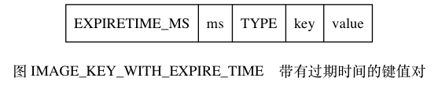

## 一、数据库

Redis 服务器的数据库实现。

### （一）服务器中的数据库

即服务器保存数据库的方法、客户端切换数据库的方法、数据库保存键值对的方法，以及针对数据库的添加、删除、查看、更新操作的实现方法等。

Redis 服务器将所有数据库都保存在服务器状态 redis.h/redisServer 结构的 db 数组中，该数组每一个项都是一个 `redisDb` 结构即代表一个数据库。服务器中数据库数量 `dbnums` 属性决定，默认是 16，初始化服务器时候，程序会根据该值决定创建多少个数据库。

```c
struct redisServer {
    // ...
    // 一个数组，保存着服务器中的所有数据库
    redisDb *db;
    // 服务器的数据库数量  ==> 由服务器配置的 database 选项决定
    int dbnum;
    // ...
};
```

### （二）切换数据库

**每个 Redis 客户端都有自己的目标数据库，每当客户端执行数据库写命令或者数据库读命令的时候，目标数据库就会成为这些命令的操作对象**。

默认情况下，Redis 客户端的目标数据库为 0 号数据库，但客户端可以通过执行 SELECT 命令来切换目标数据库。如 `SELECT 0` 来选择 0 号数据库。注意在 flushdb 操作之前一定要 select 切换到目标数据库。

```c
redis> SET msg "hello world"
OK
redis> GET msg
"hello world"
redis> SELECT 2
OK
redis[2]> GET msg
(nil)
```

服务器内部，客户端状态结构 redisClient 中的 db 属性保存客户端当前的目标数据库，该指针指向上面的 db 数组中一个元素。 

```c
typedef struct redisClient {
    // ...
    // 记录客户端当前正在使用的数据库，该指针执行 redisServer.db 数组中的其中一个元素，而被指的元素就是客户端的目标数据库；
    redisDb *db;
    // ...
} ;
```

切换目标数据库的 SELECT 命令即通过修改 redisClient.db 指针来实现执行服务器中的不同数据库。

**注意**：Redis 目前没有返回当前客户端目标数据库的命令，为了防止频繁切换之后误操作其他数据库，最好在执行命令前（特别是 FLUSHDB 命令）前，先执行 SELECT 命令显式指定数据库。

### （三）数据库键空间

**Redis 是一个键值对（key-value pair）数据库服务器，服务器中的每个数据库都由一个 redis.h/redisDb 结构表示，其中，redisDb 结构的 dict 字典保存了数据库中的所有键值对，我们将这个字典称为键空间（key space**）：

键空间和用户所见的数据库是直接对应的：

- 键空间的键也就是数据库的键，每个键都是一个字符串对象。

- 键空间的值也就是数据库的值，每个值可以是字符串对象、列表对象、哈希表对象、集合对象和有序集合对象中的任意一种 Redis 对象。

每个数据库结构如下：

```c
typedef struct redisDb {
     // 数据库键空间，保存着数据库中的所有键值对
    dict *dict;                
     // 键的过期时间，字典的键为键，字典的值为过期事件 UNIX 时间戳
    dict *expires;             
    // 正处于阻塞状态的键
    dict *blocking_keys;      
    // 可以解除阻塞的键
    dict *ready_keys;           
    // 正在被 WATCH 命令监视的键
    dict *watched_keys;         
    struct evictionPoolEntry *eviction_pool;    
    // 数据库号码
    int id;                    
    // 数据库的键的平均 TTL ，统计信息
    long long avg_ttl;         
 } redisDb;
```

其中 dict 字典保存了数据库中所有的键值对，该字典称为：键空间。对数据库的键值对操作本质就是对这个字典操作。


#### 1.读写键空间时的维护操作

当使用 Redis 命令对数据库进行读写时， 服务器不仅会对键空间执行指定的读写操作， 还会执行一些额外的维护操作， 其中包括：

- 在读取一个键之后（读操作和写操作都要对键进行读取），服务器会根据键是否存在，来更新服务器的键空间命中或不命中（hit/miss）次数，这两个值在 `INFO stats` 命令的 `keyspace_hits` 属性和 `keyspace_misses` 属性中查看。
- 在读取一个键之后， 服务器会更新键的 LRU（最后一次使用）时间，该值用于计算键的闲置时间，使用命令 `OBJECT idletime` 命令可以查看键 `key` 的闲置时间。
- **如果服务器在读取一个键时，发现该键已经过期，那么服务器会先删除这个过期键，然后才执行余下的其他操作**，后续对过期键的讨论会详细说明这一点。
- 如果有客户端使用 WATCH 命令监视了某个键，那么服务器在对被监视的键进行修改之后，会将这个键标记为脏（dirty），从而让事务程序注意到这个键已经被修改过，《事务》一章会详细说明这一点。
- 服务器每次修改一个键之后，都会对脏（dirty）键计数器的值增一，这个计数器会触发服务器的持久化以及复制操作执行，《RDB 持久化》、《AOF 持久化》和《复制》这三章都会说到这一点。
- 如果服务器开启了数据库通知功能，那么在对键进行修改之后，服务器将按配置发送相应的数据库通知，本章稍后讨论数据库通知功能的实现时会详细说明这一点。

### （四）设置与移除键的生存时间或过期时间

> 生存时间（将可以存在多久） 
>
> 过期时间（将什么时候会被删除）

- 通过 EXPIRE（生存时间设置为秒）或 PEXPIRE（设置为毫秒），为指定键设置生存时间（TTL：Time To Live）。在经过指定的秒数或者毫秒数之后，服务器会自动删除生存时间为 0 的键。

- SETEX 命令可以在设置一个字符串键（只能是该类型键）的同时为键设置过期时间，即将功能整合了，其中设置过期时间原理同 EXPIRE。

- 通过 EXPIREAT（过期时间设置为 timestamp 所指定的秒数时间戳）或者 PEXPIREAT（毫秒时间戳）可以给数据库中某个键设置过期时间（expireTime）。过期时间是一个 UNIX 时间戳，当键的过期时间来临时，服务器就会自动从数据库中删除这个键。因为上述所有命令本质都是通过 PEXPIREAT 命令实现】

  ```c
  // 设置生存时间 TTL
  127.0.0.1:6379> set a test
  OK
  127.0.0.1:6379> EXPIRE a 5
  (integer) 1
  127.0.0.1:6379> get a // 距离设置生存时间命令的 5 秒内执行
  "test"
  127.0.0.1:6379> get a // 距离设置生存时间命令的 5 秒后执行
  (nil)
  
  // 设置过期时间 expireTime
   127.0.0.1:6379> set b test
  OK
  127.0.0.1:6379> EXPIREAT b 1377257300 
  (integer) 1
  127.0.0.1:6379> get b // 在 1377257300 之前执行
  "test"
  127.0.0.1:6379> get a // 在 1377257300 后执行
  (nil)   
  ```

- 具体指令：

  - `EXPIRE<key><ttl>` 命令用于将键 key 的生存时间设置为 ttl 秒。

  - `PEXPIRE<key><ttl>` 命令用于将键 key 的生存时间设置为 ttl 毫秒。

  - `EXPIREAT<key><timestamp>` 命令用于将键 key 的过期时间设置为 timestamp 所指定的秒数时间戳。

  - `PEXPIREAT<key><timestamp>` 命令用于将键 key 的过期时间设置为 timestamp 所指定的毫秒数时间戳。

  实际上 EXPIRE、PEXPIRE、EXPIREAT 三个命令都是使用 PEXPIREAT 命令来实现的：无论客户端执行的是以上四个命令中的哪一个，经过转换之后，最终的执行效果都和执行 PEXPIREAT 命令一样。

  ```shell
  # EXPIRE命令可以转换成PEXPIRE命令：
  def EXPIRE(key,ttl_in_sec):
      #将TTL从秒转换成毫秒
      ttl_in_ms = sec_to_ms(ttl_in_sec)
      PEXPIRE(key, ttl_in_ms)
  
  #PEXPIRE命令又可以转换成PEXPIREAT命令：
  def PEXPIRE(key,ttl_in_ms):
      #获取以毫秒计算的当前UNIX时间戳
      now_ms = get_current_unix_timestamp_in_ms()
      #当前时间加上TTL，得出毫秒格式的键过期时间
      PEXPIREAT(key,now_ms+ttl_in_ms)
      
  #EXPIREAT命令也可以转换成PEXPIREAT命令    
      def EXPIREAT(key,expire_time_in_sec):
      # 将过期时间从秒转换为毫秒
      expire_time_in_ms = sec_to_ms(expire_time_in_sec)
      PEXPIREAT(key, expire_time_in_ms)
  ```

  #### 保存过期时间

  数据库(redisDb 结构）主要由 dict 和 expires 两个字典构成，其中 dict 负责保存键值对，expires 负责保存键的过期时间。

  expires 字典的键为一个指针，指向键空间的某个键对象（即某个数据库键）；值为 long long 类型的整数，为一个毫秒精度的时间戳，即键所指向的数据库键的过期时间。


#### 移除过期时间

可以使用 PERSIST 移除过期时间。

```c
127.0.0.1:6379> EXPIRE c 1000
(integer) 1
127.0.0.1:6379> ttl c   // 有过期时间
(integer) 9996
127.0.0.1:6379> PERSIST c
(integer) 1
127.0.0.1:6379> ttl c  // 无过期时间
(integer) -1
```

本质上，设置过期时间和移除过期时间，就是在 expires 字典中增加或移除键值对。

#### 计算并返回剩余生存时间

- `TTL <key>` 命令以秒为单位返回键的剩余生存时间；
- `PTTL <key>` 命令以毫秒当单位返回键的剩余生存时间；

原理：两个命令都是都是

### （三）Redis 过期键值对的删除策略

Redis 使用的过期键删除策略（内存回收/淘汰机制）为惰性删除 + 定期删除，其中惰性删除为 Redis 服务器内置策略。而定期删除可以通过以下两种方式设置：

- 方式一：配置 redis.conf 的 hz 选项，默认为 10（即 1 秒执行 10 次，值越大说明刷新频率越快，对 Redis 性能损耗也越大）；
- 方式二：配置 redis.conf 的 maxmemory 最大值，当已用内存超过 maxmemory 限定时，就会触发主动清理策略；

**对于散列表这种容器，只能为整个键设置过期时间（整个散列表），而不能为键里面的单个元素设置过期时间。**

- 定时删除

  - 含义：在设置 key 的过期时间的同时，为该 key 创建一个定时器，让定时器在 key 的过期时间来临时，对 key 进行删除；
  - 优点：对内存友好，保证内存被尽快释放；
  - 缺点：
    - 若过期 key 很多，删除这些 key 会占用很多的 CPU 时间：**影响服务器的响应时间和吞吐量**。
    - 定时器的创建耗时【**创建定时器需要用到时间事件，该事件的实现方式是无序链表，查找一个事件的时间复杂度为 O（N），不能处理大量的时间事件**】），若为每一个设置过期时间的 key 创建一个定时器（将会有大量的定时器产生），性能影响严重

- **惰性过期**：**只有当访问一个 key 时，才会判断 key 是否过期，过期则清除**。

  

  惰性删除策略由：`expireIfNeeded` 函数实现，**所有读写数据库的 Redis 命令（如 SET、SADD 等等）在执行之前都会调用该函数对输入键进行检查**。

  - 如果输入键过期，该函数会将该键从数据库中删除；反之没有过期则该函数不作任何动作。
  - 优点：删除操作只发生在从数据库取出 key 的时候发生，而且只删除当前 key，所以**对 CPU 时间的占用是比较少的，节省 CPU 资源**，而且此时的删除是已经到了非做不可的地步（如果此时还不删除的话，我们就会获取到了已经过期的 key 了）；

  - 缺点：若大量的 key 在超出超时时间后，很久一段时间内，都没有被获取过【如与时间相关的数据】，那么可能发生内存泄露（无用的垃圾占用了大量的内存）：对内存不友好。除非手动执行 `flushdb` 操来于清空当前数据库中的所有 `key`。

- 定期删除

  定期删除：由 `activeExpireCycle` 函数与定时任务实现，每当 Redis 的服务器周期性操作 `serverCron` 函数执行时，`actieExpireCycle` 函数就会被调用，它在规定的时间内，分多次遍历服务器中的各个数据库，从一定量的数据库数据库的 `expires` 字典中**随机检查一部分键的过期时间**，并删除其中的过期键。

  - 使用全局变量 `current_db` 会记录当前 `activeExpireCycle` 函数检查的进度，下一次该函数调用时，接着上一次的进度进行处理剩余的库。全部检查清理完成之后该变量置为 0。

  - 优点：

    - 通过限制删除操作的时长和频率，来减少删除操作对 CPU 时间的占用--处理"定时删除"的缺点
    - 定期删除过期 key --处理"惰性删除"的缺点

  - 缺点

    - 在内存友好方面，不如"定时删除"
    - 在 CPU 时间友好方面，不如"惰性删除"

  - 难点

    **合理设置删除操作的执行时长（每次删除执行多长时间）和执行频率（每隔多长时间做一次删除）（这个要根据服务器运行情况来定了）**

### （四）RDB 和 AOF 对过期键的处理

- 生成 RDB 文件，程序会对数据库中的键进行检查，**已过期的键不会被保存到新创建的 RDB 文件中**；

- 载入 RDB 文件：

  - 以主服务器的模式运行：在载入 RDB 文件时，程序会对文件中的键进行检查，未过期的键会被载入数据库中，**而过期键则会被忽略**；
  - 以从服务器的模式运行：在载入 RDB 文件时，程序会对文件中的键进行检查，不论键是否过期，**都会被载入到数据库中。不过，因为主从服务器在进行数据同步的时候，从服务器的数据就会被清空**；

- AOF 文件写入

  当服务器以 AOF 持久化模式运行时，如果数据库某个过期键还没被删除，那么 AOF 文件不会因为这个过期键而产生任何影响，依旧保留。

  **而当过期键被删除后，那么程序会向 AOF 文件追加一条 DEL 命令来显式地记录该键被删除**。

- AOF 重写

  执行 AOF 重写过程中，也会被数据库的键进行检查，已过期的键不会被保存到重写后的 AOF 文件中。因此**不会对 AOF 重写造成影响**

- 复制对过期键的处理

  当服务器运行在复制模式下**，由主服务器来控制从服务器的删除过期键动作**，目的是保证主从服务器数据的一致性。

  - 主服务器在删除一个过期键之后，会显式地向所有从服务器发送一个 del 命令，告知从服务器删除这个过期键

  - 从服务器在执行客户端发送的读命令时，即使碰到过期键也不会将过期键删除，而是继续像处理未过期键一样处理过期键

  - 从服务器只有在接到主服务器发来的 del 命令之后，才会删除过期键。

  从服务器在接收到客户端对过期键的读命令时，依旧会返回该键对应的值给客户端，而不会将其删除。

## 六、Redis 持久化

Redis 是内存型数据库，为了解决数据在断电后以及因进程退出造成数据丢失问题，需要将内存中的数据持久化到硬盘上，当下次重启时利用之前持久化文件即可实现数据恢复。

因为 AOF 文件的更新频率通常比 RDB 文件的更新频率高，所以：

- 如果服务器开启了 AOF 持久化功能，那么服务器会优先使用 AOF 文件来还原数据库状态；
- 只有在 AOF 持久化功能处于关闭状态时，服务器才会使用 RDB 文件来还原数据库状态；

### （一）RDB 持久化

**RDB（Redis Database） 持久化是把当前进程数据生成快照保存到硬盘的过程**，也是默认的持久化方式。触发 RDB 持久化过程分为手动触发和自动触发。

#### 1.触发机制

- 手动触发分别对应 save 和 bgsave 命令：

  - **save 命令：阻塞当前 Redis 服务器，直到 RDB 过程完成为止**，对于内存比较大的实例会造成长时间阻塞，线上环境不建议使用。直接阻塞 Redis 服务器进程，期间不能处理任何请求。

  - bgsave 命令：**bgsave 命令是针对 save 阻塞问题做的优化（save 相对废弃了）。Redis 进程执行 fork 操作创建子进程，RDB 持久化过程由子进程负责，完成后自动结束。阻塞只发生在 fork 阶段，因此时间很短。**运行 bgsave 名字对应的 Redis 日志如下：

    ```c
    Background saving started by pid 3152
    DB saved on disk
    RDB: 0MB of memory userd by copy-on-write
    Background saving terminated with success
    ```

  **注意：`SAVE/BGSAVE/BGREWRITEOF` 这三个命令不能同时执行，因为避免产生竞争条件，或者性能方面考虑**，BGSAVE 执行时，客户端发送的 SAVE、BGSAVE 这两个命令会被服务器拒绝，BGREWRITEAOF 会被延迟到 BGSAVE 执行完毕后执行。 

  - **bgsave 流程说明：**
    - 执行 bgsave 命令，**Redis 父进程判断当前是否存在正在执行的子进程**。
      - 父进程执行 fork 操作创建子进程，fork 操作过程中父进程会阻塞。通过 `info stats` 命令查看`latest_fork_usec` 选项，可以获取最近一个 `fork` 操作的耗时，单位为微秒。
      - 父进程 fork 完成后，bgsave 命令返回 `“Background saving started”`信息并不再阻塞父进程，可以继续响应其他命令。
    - 子进程创建 RDB 文件，**根据父进程内存生成临时快照文件，完成后对原有文件进行原子替换**。执行 `lastsave` 命令可以获取最后一次生成 RDB 的时间，对应 info 统计的 `rdb_last_save_time` 选项。

    - 进程发送信号给父进程表示完成，父进程更新统计信息，具体见 `info Persistence` 下的 `rdb_*` 相关选项。

- 自动触发 RDB 的持久化机制:

  - 用户可以通过 save 选项设置多个保存条件（如如 `save m n` 表示 m 秒之内数据集存在 n 次修改时），Redis 通过周期性的操作函数 serverCron 每 100ms 执行一次，检查 save 选项设置的条件是否满足，只要一个满足，服务器就会执行 BGSAVE；默认配置为：`save 900 1` 和 `save 300 10`，当然可以自定义，redisServer 中有一个 saveparam 类型数组保持所有的条件，该类型结构为【秒数，修改数】

  - 除此之外服务器状态还维持了一个 dirty 计时器【记录上次 save 命令之后修改次数】和一个 lastsave 属性【就是一个时间戳】。

  - 如果从节点执行全量复制操作，主节点自动执行 bgsave 生成 RDB 文件并发送给从节点。
  - 执行 `debug reload` 命令重新加载 Redis 时，也会自动触发 save 操作。

  - 默认情况下执行 `shutdown` 命令时，如果没有开启 AOF 持久化功能则自动执行 bgsave。

#### 2.RDB 文件处理

- 保存：**RDB 文件保存在 dir 配置指定的目录下**，文件名通过 `dbfilename` 配置指定。可以通过执行 `config set dir {newDir}`  和 `config set dbfilename {newFileName}` 运行期动态执行，当下次运行时 RDB 文件会保存到新目录。

- 压缩：Redis 默认采用 LZF 算法对生成的 RDB 文件做压缩处理，压缩后的文件远远小于内存大小，默认开启，可以通过参数 `config set rdbcompression {yes|no}` 动态修改。

- 校验：如果 Redis 加载损坏的 RDB 文件时拒绝启动，并打印如下日志：

  `Short read or OOM loading DB. Unrecoverable error , aborting now.`可以使用 Redis 提供的 redis-check-dump 工具检测 RDB 文件并获取对应的错误报告。


#### 3.RDB 的优缺点

- RDB 的优点:

  - RDB 是一个紧凑压缩的二进制文件，代表  Redis  在**某一个时间点上的数据快照**。非常适合用于备份，全量复制等场景。比如每 6 小时执行 bgsave 备份，并把 RDB 文件拷贝到远程机器或者文件系统中（如 hdfs），用于灾难恢复。
  - Redis 加载 RDB 恢复数据远远快于 AOF 方式。
  - 对于不同类型的键值对，RDB 文件会使用不同的方式来保存它们。

- RDB 的缺点

  - RDB 方式数据没办法做到实时持久化/秒级持久化。因为 bgsave 每次运行都要执行 fork 操作创建子进程，属于重量级操作，频繁执行成本过高。
  - RDB 文件使用特定二进制格式保存，Redis 版本演进过程中有多个格式的 RDB 版本，存在老版本 Redis 服务无法兼容新版 RDB 格式的问题。

#### 4.Redis RDB 文件本身结构


- RDB 文件的最开头是 `REDIS` 部分， 这个部分的长度为 `5` 字节， 保存着 `"REDIS"` 五个字符。 通过这五个字符， 程序可以在载入文件时， 快速检查所载入的文件是否 RDB 文件。

  > 因为 RDB 文件保存的是二进制数据， 而不是 C 字符串， 为了简便起见， 我们用 `"REDIS"` 符号代表 `'R'` 、 `'E'` 、 `'D'` 、 `'I'` 、 `'S'`五个字符， 而不是带 `'\0'` 结尾符号的 C 字符串 `'R'` 、 `'E'` 、 `'D'` 、 `'I'` 、 `'S'` 、 `'\0'` 。其他部分同理，均遵循该规则；

- `db_version` 长度为 `4` 字节， 它的值是一个字符串表示的整数， 这个整数记录了 RDB 文件的版本号， 比如 `"0006"` 就代表 RDB 文件的版本为第六版。 本章只介绍第六版 RDB 文件的结构。

- `databases` 部分包含着零个或任意多个数据库， 以及各个数据库中的键值对数据：

  - 如果服务器的数据库状态为空（所有数据库都是空的）， 则该部分也为空， 长度为 `0` 字节。
  - 如果服务器的数据库状态为非空（有至少一个数据库非空）， 则该部分也为非空， 根据数据库所保存键值对的数量、类型和内容不同， 这个部分的长度也会有所不同。

- `EOF` 常量的长度为 `1` 字节， 这个常量标志着 RDB 文件正文内容【即所有键值对读完了】的结束。

- `check_sum` 保存着一个校验和， 以此来检查 RDB 文件是否有出错或者损坏的情况出现。


**详述 databases 部分**

一个 RDB 文件的 `databases` 部分可以保存任意多个非空数据库。图中的`database 0` 代表 `0` 号数据库中的所有键值对数据，其余类似。


每个非空数据库在 RDB 文件中都可以保存为 `SELECTDB` 、 `db_number` 、 `key_value_pairs` 三个部分， 如图 IMAGE_DATABASE_STRUCT_OF_RDB 所示。


- `SELECTDB` 表示接下来要读入的将是一个数据库号码。

- `key_value_pairs` 部分保存了数据库中的所有键值对数据， 如果键值对带有过期时间， 那么过期时间也会和键值对保存在一起。 根据键值对的数量、类型、内容、以及是否有过期时间等条件的不同， `key_value_pairs` 部分的长度也会有所不同。

  - 不带过期时间的键值对在 RDB 文件中对由 `TYPE` 、 `key` 、 `value` 三部分组成， 如图 IMAGE_KEY_WITHOUT_EXPIRE_TIME 所示，其中 `TYPE` 记录了 `value` 的类型；

  

  - 带有过期时间的键值对在 RDB 文件中的结构如图 `IMAGE_KEY_WITH_EXPIRE_TIME` 所示。

    

    - 其中 `TYPE` 、 `key` 、 `value` 三个部分的意义同上；
    - `EXPIRETIME_MS` 常量的长度为 `1` 字节， 它告知读入程序， 接下来要读入的将是一个以毫秒为单位的过期时间。
    - `ms` 是一个 `8` 字节长的带符号整数， 记录着一个以毫秒为单位的 UNIX 时间戳， 这个时间戳就是键值对的过期时间。

**针对 RDB 不适合实时持久化的问题，Redis 提供了 AOF 持久化方式来解决**

### （二）AOF 持久化

**AOF（append only file）持久化：以独立日志的方式保存每次写命令来记录数据库状态，重启时再重新执行 AOF 文件中命令达到恢复数据的目的。AOF 的主要作用是解决了数据持久化的实时性，目前已经是 Redis 持久化的主流方式。**　

- 使用 AOF

  开启 AOF 功能需要设置配置：`appendonly yes` 默认不开启。AOF 文件通过 `append filename` 配置设置，默认文件名是 `appendonly.aof`。保存路径同 RDB 持久化方式一致，通过 dir 配置指定。

- AOF 的工作流程操作：**命令写入（append）、文件同步（sync）、文件重写（rewrite）、重启加载（load）**。工作流程如下：

  - **所有的写入命令会追加到 `aof_buf`（缓冲区）中。**

    命令追加：服务器在执行完一个写命令后，会以协议格式将被执行的写命令追加到服务器状态的 `aof_buf` 缓冲区的末尾。AOF 命令写入的内容直接是文本协议格式（兼容性较好且具有可读性，方便直接修改和处理）。例如 `set hello world` 这条命令，在 AOF 缓冲区会追加如下文本：`\r\n$3\r\nset\r\n$5\r\nhello\r\n$5\r\nworld\r\n`。

    AOF 把命令追加到 `aof_buf` 中的原因：Redis 使用单线程响应命令，如果每次写 AOF 文件命令都直接追加到硬盘，那么性能完全取决于当前硬盘负载。写入缓冲区 `aof_buf` 中，还有另一个好处，Redis 可以提供多种缓冲区同步硬盘的策略，在性能和安全性方面做出平衡。

  - **AOF 缓冲区根据对应的策略向硬盘做同步操作。**

    服务器在处理文件事件时可能会执行写命令，使得一些内容被追加到缓冲区里，所以在每次结束一个事件循环之前，会考虑是否将缓冲区的内容写入到 AOF 文件里。

    Redis 提供了多种 AOF 缓冲区同步文件策略，由参数 `appendfsync` 控制，不同值的含义

    - 配置为 `no`，将缓冲区中的所有内容写入 AOF 文件，但并不对 AOF 文件进行同步，何时同步有操作系统来决定。由于操作系统每次同步 AOF 文件的周期不可控，而且会极大每次同步硬盘的数据量，虽然提升了性能，但数据安全性无法保证。

    - `write` 操作会触发延迟写（delayed write）机制，Linux 在内核提供页缓冲区用来提高硬盘 IO 性能。write 操作在写入系统缓冲区后直接返回。同步硬盘操作依赖于系统调度机制，列如：缓冲区页空间写满或达到特定时间周期。同步文件之前，如果此时系统故障宕机，缓冲区内数据将丢失。
    - **`fsync` 针对单个文件操作（比如 AOF 文件），做强制硬盘同步**，`fsync` 将阻塞知道写入硬盘完成后返回，保证了数据持久化。
    - 配置为 `always` 时，每次写入都要同步 AOF 文件，在一般的 STAT 硬盘上，Redis 只能支持大约几百 TPS 写入，显然跟 Redis 高性能特性背道而驰，不建议配置。
    - 配置为 `everysec` ：将缓冲区中的所有内容写入 AOF 文件，如果上次同步 AOF 文件的时间距离现在查过一秒钟，则再次对 AOF 文件进行同步，并且该同步操作是由一个线程专门进行执行的。是建议且默认的同步策略，做到兼顾性能和数据安全性，理论上只有在系统突然宕机的情况下丢失 1s 的数据。（严格来说最多丢失 1s 数据是不准确）

  - **随着 AOF 文件越来越大，需要定期对 AOF 文件进行重写，达到压缩的目的。**

    Redis 可以创建一个新的 AOF 文件来替代现有的 AOF 文件，虽然数据库状态相同，但新的 AOF 文件不会包含任何浪费空间的冗余命令，新文件体积会小很多。

    实现：不是读取现有 AOF 文件，而是根据现有数据库状态，用最少的命令去得到这个状态。

    **AOF 文件重写就是把 Redis 进程内的数据转化为写命令同步到新 AOF 文件的过程**。所以重写后的 AOF 文件为什么可以变小，原因如下

    - **进程内已经超时的数据不再写文件**。
    - **旧的 AOF 文件含有无效命令**，如 del key1、 hdel key2、srem keys、set a 111、set a 222 等。重写使用进程内数据直接生成，这样新的 AOF 文件只保留最终数据的写入命令。
    - **多条写命令可以合并为一个**，如 lpush list a、lpush list b、 lpush list c 可以转化为：lpush list a b c。为了防止但挑明了过大造成客户端缓冲区溢出，对于 list、set、hash、zset 等类型曹组，以 64 个元素为界拆分为多条。

    > AOF 重写过程可以手动触发和自动触发：
    >
    > - 手动触发：直接调用 bgrewriteaof 命令
    > - 自动触发：根据 `auto-aof-rewrite-min-size` 和 `auto-aof-rewrite-percentage` 参数确定自动触发时机
    >   - `auto-aof-rewrite-min-size`：表示运行 AOF 重写时文件最小体积，默认为 64MB
    >   - auto-aof-rewrite-percentage:代表当前AOF文件空间（aof_current_size）和上一次重写后AOF文件空间（aof_base_size）的值
    >
    >  **当触发AOF重写时的运行流程：**
    >
    > - 执行AOF重写请求。
    >   如果当前进程正在执行AOF重写，请求不执行并返回如下响应:`ERR Background append only file rewriting already in progress`。如果当前进程正在执行bgsave操作，重写命令延迟到bgsave完成后再执行，返回如下响应：`Background append only file rewriting scheduled`。
    >  - 父进程执行fork创建子进程，开销等同于bgsave过程。
    > - 主进程fork操作完成后，继续响应其他命令。所有修改命令依然写入AOF缓冲区并更具appendfsync策略同步到硬盘，保证原有AOF机制正确性。
    > - 由于fork操作运用写时复制技术，子进程只能共享fork操作时的内存数据。由于父进程依然响应命令，Redis使用"AOF重写缓冲区"保存这部分新数据，防止新AOF文件生成期间丢失这部分数据。
    >   - 子进程根据内存快照，按照命令合并规则写入到新的AOF文件。每次批量写入硬盘数据量由配置aof-rewrite-incremental-fsync控制，默认为32MB，防止单次刷盘数据过多造成硬盘阻塞。
    > - 新AOF文件写入完成后，子进程发送信号给父进程，父进程更新统计信息，具体见info persistence下的aof_*相关统计。
    > - 父进程把AOF重写缓冲区的数据写入到新的AOF文件。
    > - 使用新AOF文件替换老文件，完成AOF重写。

- **当 Redis 服务重启时，可以加载 AOF 文件进行数据恢复**

  AOF 和 RDB 文件都可以用于服务器重启时的数据恢复，Redis 持久化文件加载流程：

  -  AOF 持久化开启且存在 AOF 文件时，优先加载 AOF 文件，打印如下日志：`DB loaded from append only file: 5.841 seconds`

  -  AOF 关闭或者 AOF 文件不存在时，加载 RDB 文件。

### （三）RDB 与 AOF 对比

- RDB 优点：

  - 只有一个文件 dump.rdb，方便持久化；
  - **fork一个子进程来完成写操作，将数据写到磁盘上一个临时RDB文件中，主进程可以继续处理命令，保证了redis的高性能**；当子进程完成写临时文件后，将原来的 rdb 文件替换掉，**这样的好处是可以copy-on-write**。
  - 数据集较大时，比 AOF 的启动效率更高。

- RDB 缺点：

  - 数据不安全，RDB 持久化是周期性的保存数据，如果在未触发下一次存储时服务宕机，就会丢失增量数据。

- AOF(Append Only File)：**将redis执行的每条写命令追加到单独的日志文件appendonly.aof中，可以做到全程持久化**.当开启 AOF 后，服务端每执行一次写操作就会把该条命令追加到一个单独的 AOF 缓冲区的末尾，然后把 AOF 缓冲区的内容写入 AOF 文件里，但是 AOF 存储的是指令序列，恢复时要花费很长时间且文件更大。

  优点：

  - 数据安全，aof 持久化每进行一此命令操作就记录到 aof 文件一次。
  - 通过 append 模式写文件，即使中途服务器宕机，也可以通过 redis-check-aof 工具解决数据一致性问题；
  - rewrite 模式，aof 重写可以把内存中的数据，逆化成命令，写入到 aof 日志中，解决 aof 日志过大的问题。

  >appendfsync always   #每1个命令都立即同步到aof
  >appendfsync everysec   #每秒写一次

  缺点：

  - AOF 存储的是指令序列，恢复时要花费很长时间且文件更大

## 七、事件

Redis 服务器是一个事件驱动程序，服务器需要处理以下两类事件：

- 文件事件（file event）：Redis 服务器通过**套接字**与客户端（或者其他 Redis 服务器）进行连接，而文件事件就是服务器对套接字操作的抽象。
- 时间事件（time event）：Redis 服务器中的一些操作（比如 serverCron 函数）需要在给定的时间点执行，而时间事件就是服务器对这类定时操作的抽象。

### （一）文件事件

Redis 基于 Reactor 模式开发了自己的网络事件处理器，被称为文件事件处理器（file event handler）：

- 文件事件处理器使用 I/O 多路复用（multiplexing）程序来**同时监听多个套接字**，并根据套接字目前执行的任务来为套接字关联不同的事件处理器。
- 当被监听的套接字准备好执行连接应答（accept）、读取（read）、写入（write）、关闭（close）等操作时，与操作相对应的文件事件就会产生，这时文件事件处理器就会调用套接字之前关联好的事件处理器来处理这些事件。

- 尽管多个文件事件可能会并发地出现，但 I/O 多路复用程序总是会将所有产生事件地套接字都放到一个队列里面，然后通过这个队列，以有序（sequentially）、同步（synchronously）、每次一个套接字的方式向文件事件分派器传送套接字。

- 文件事件分派器接收 I/O 多路复用程序传来地套接字，并根据套接字产生地事件地类型，调用响应地事件处理器。

#### 1.文件事件处理器地构成

文件事件处理器的四个组成部分，分别时套接字、I/O 多路复用程序、文件事件分派器（dispatcher），以及事件处理器。


文件事件是对套接字操作的抽象，每当一个套接字准备好执行连接应答（accept）、写入、读取、关闭等操作时，就会产生一个文件事件。因为一个服务器通常会连接多个套接字，所以多个文件事件有可能会并发地出现。

I/O 多路复用程序负责监听多个套接字，并向文件事件分派器传送产生了事件地套接字。

尽管多个文件事件可能会并发地出现，但 I/O 多路复用程序总是会将所有产生事件地套接字都放到一个队列里面，然后通过这个队列，以有序（sequentially）、同步（synchronously）、每次一个套接字的方式向文件事件分派器传送套接字。

文件事件分派器接收 I/O 多路复用程序传来地套接字，并根据套接字产生地事件地类型，调用响应地事件处理器。

#### 2.I/O多路复用程序的实现


#### 3.事件的类型

I/O 多路复用程序可以监听多个套接字的 ae.h/AE_READABLE 事件和 ae.h/AE_WRITEABLE 事件，这两类事件和套接字操作之间的对应关系如下：

- 当套接字变得可读时（客户端对套接字执行 write 操作，或者执行 close 操作），或者有新的可应答（acceptable）套接字出现时（客户端对服务器的监听套接字执行 connect 操作），套接字产生 AE_READABLE 事件。
- 当套接字变得可写时（客户端对套接字执行 read 操作），套接字产生 AE_WRITEABLE 事件。
- 如果一个套接字又可读又可写，那么服务器优先读套接字，后写套接字。

#### 4.文件事件的处理器

1、连接应答处理器

2、命令请求处理器

3、命令回复处理器


### （二）时间事件

服务器有一些操作需要在给定的时间点执行，时间事件是对这类定时操作的抽象。一个时间事件主要由以下三个属性组成：

- id：服务器为时间事件创建的全局唯一 ID。
- when：毫秒精度的 UNIX 时间戳，记录了时间事件的到达时间。
- timeProc：时间事件处理器。

时间事件又分为：区别是取决于时间事件处理器的返回值不同来确定

- 定时事件：是让一段程序在指定的时间之内执行一次；
- 周期性事件：是让一段程序每隔指定时间就执行一次。

Redis 服务器将所有时间事件都放在一个无序链表中，每当时间事件执行器运行时则通过遍历整个链表查找出已到达的时间事件，并调用相应的事件处理器。


#### 事件的调度与执行

服务器需要不断监听文件事件的套接字才能得到待处理的文件事件，但是不能一直监听，否则时间事件无法在规定的时间内执行，因此监听时间应该根据距离现在最近的时间事件来决定。

持续进行的 Redis 服务器需要定期对自身的资源和状态进行检查和调整，从而确保服务器可以长期、稳定地运行，这些定期操作由 redis.c/serverCron 函数负责执行，它的主要工作包括：

- 更新服务器的各类统计信息，比如时间、内存占用、数据库占用情况等。
- 清理数据库中的过期键值对。
- 关闭和清理连接失效的客户端。
- 尝试进行 AOF 或 RDB 持久化操作。
- 如果服务器是主服务器，那么对从服务器进行定期同步。
- 如果处于集群模式，对集群进行定期同步和连接测试。

事件调度与执行由 aeProcessEvents 函数负责，伪代码如下：

```python
def aeProcessEvents():
    # 获取到达时间离当前时间最接近的时间事件
    time_event = aeSearchNearestTimer()
    # 计算最接近的时间事件距离到达还有多少毫秒
    remaind_ms = time_event.when - unix_ts_now()
    # 如果事件已到达，那么 remaind_ms 的值可能为负数，将它设为 0
    if remaind_ms < 0:
        remaind_ms = 0
    # 根据 remaind_ms 的值，创建 timeval
    timeval = create_timeval_with_ms(remaind_ms)
    # 阻塞并等待文件事件产生，最大阻塞时间由传入的 timeval 决定
    aeApiPoll(timeval)
    # 处理所有已产生的文件事件
    procesFileEvents()
    # 处理所有已到达的时间事件
    processTimeEvents()
```

将 aeProcessEvents 函数置于一个循环里面，加上初始化和清理函数，就构成了 Redis 服务器的主函数，伪代码如下：

```python
def main():
    # 初始化服务器
    init_server()
    # 一直处理事件，直到服务器关闭为止
    while server_is_not_shutdown():
        aeProcessEvents()
    # 服务器关闭，执行清理操作
    clean_server()
```

从事件处理的角度来看，服务器运行流程如下：


### （三）事件的调度与执行

事件的调度和执行规则：

- aeApiPoll 函数的最大阻塞时间由到达时间最接近当前时间的时间事件决定，这个方法既可以避免服务器对时间事件进行频繁的轮询，也可以确保 aeApiPoll 函数不会阻塞过长时间。
- 因为文件事件是随机出现的，如果等待并处理完一次文件事件之后，仍未有任何时间事件到达，服务器将再次等待并处理文件事件。
- 对文件事件和时间事件的处理都是同步、有序、原子地执行地，服务器不会中途中断事件处理，也不会进行抢占，因此，不管是文件事件地处理器，还是时间事件地处理器，它们都会尽可能地减少程序地阻塞时间，并在有需要时主动让出执行权，从而降低造成事件饥饿地可能性。
- 因为时间事件在文件事件之后执行，并且事件之间不会出现抢占，所以时间事件地实际处理时间，通常会比时间事件设定的到达时间稍晚一些。

### （四）重点回顾

- Redis 服务器时一个事件驱动程序，服务器处理的事件分为时间事件和文件事件两类。
- 文件事件处理器是基于 Reactor 模式出现的网络通信程序。
- 文件事件是对套接字操作的抽象：每次套接字变为可应答（acceptable）、可写（writable）或者可读（readable）时，相应的文件事件就会产生。
- 文件事件分为 AE_READABLE 事件和 AE_WRITEABLE 事件两类。
- 时间事件分为定时事件和周期性事件。
- 服务器在一般情况下只执行 serverCron 函数一个时间函数，并且这个事件是周期性事件。
- 文本事件和时间事件之间是合作关系，服务器会轮流处理这种事件，并且处理事件的过程中也不会产生抢占。
- 时间事件的实际处理时间通常会比设定的到达时间晚一些。

## 八、客户端

#### （一）客户端的结构

- Redis 服务器使用单线程单进程的方式处理命令请求，并与多个客户端进行网络通信。每个客户端状态都是一个 RedisClient 结构，Redis 服务器的 redisServer 结构中使用一个链表保存上面的客户端结构。

- 客户端结构如下：

  ```c
  struct redisClient{
      // 客户端正在使用的套接字描述符，值为 -1（表示伪客户端，不需要套接字连接；两个地方使用：用于载入 AOF 文件并还原数据库状态和用于执行 Lua 脚本中包括的 Redis 命令） 和 大于 -1 整数（正常的）。使用 CLIENT list 可以列出（只有普通的）
      int fd;
      // 名字，默认客户端没有名称，可以使用 CLIENT setname 指定
      robj *name;
      // 标志，记录了客户端的角色，属性值如下：
      int flags;
      // 输入缓冲区，用于保存客户端发送的命令请求，会根据输入内容动态的缩小或者扩大，最大不超过 1G。
      sds querybuf;
     // 输出缓冲区，共两个，一个大小固定（保存长度较小的回复），一个大小可变（保存长度较大的回复）
      // buf 数组默认 16 KB
      char buf[];
      int bufpos;
      
      // 上面是固定缓冲区，下面是可变的缓冲区，当固定用完了或者回复太大放不下固定的就会启动可变的。
      list *reply;
      
  }
  ```

  - 客户端标志：

    每个标志使用一个常量表示， 一部分标志**记录了客户端的角色**：

    - 在主从服务器进行复制操作时， 主服务器会成为从服务器的客户端， 而从服务器也会成为主服务器的客户端。 `REDIS_MASTER` 标志表示客户端代表的是一个主服务器， `REDIS_SLAVE` 标志表示客户端代表的是一个从服务器。
    - `REDIS_PRE_PSYNC` 标志表示客户端代表的是一个版本低于 Redis 2.8 的从服务器， 主服务器不能使用 PSYNC 命令与这个从服务器进行同步。 这个标志只能在 `REDIS_SLAVE` 标志处于打开状态时使用。
    - `REDIS_LUA_CLIENT` 标识表示客户端是专门用于处理 Lua 脚本里面包含的 Redis 命令的伪客户端。

    而另外一部分标志则**记录了客户端目前所处的状态**：

    - `REDIS_MONITOR` 标志表示客户端正在执行 MONITOR 命令。
    - `REDIS_UNIX_SOCKET` 标志表示服务器使用 UNIX 套接字来连接客户端。
    - `REDIS_BLOCKED` 标志表示客户端正在被 BRPOP 、 BLPOP 等命令阻塞。
    - `REDIS_UNBLOCKED` 标志表示客户端已经从 `REDIS_BLOCKED` 标志所表示的阻塞状态中脱离出来， 不再阻塞。 `REDIS_UNBLOCKED` 标志只能在`REDIS_BLOCKED` 标志已经打开的情况下使用。
    - `REDIS_MULTI` 标志表示客户端正在执行事务。
    - `REDIS_DIRTY_CAS` 标志表示事务使用 WATCH 命令监视的数据库键已经被修改， `REDIS_DIRTY_EXEC` 标志表示事务在命令入队时出现了错误， 以上两个标志都表示事务的安全性已经被破坏， 只要这两个标记中的任意一个被打开， EXEC 命令必然会执行失败。 这两个标志只能在客户端打开了 `REDIS_MULTI` 标志的情况下使用。
    - `REDIS_CLOSE_ASAP` 标志表示客户端的输出缓冲区大小超出了服务器允许的范围， 服务器会在下一次执行 `serverCron` 函数时关闭这个客户端， 以免服务器的稳定性受到这个客户端影响。 积存在输出缓冲区中的所有内容会直接被释放， 不会返回给客户端。
    - `REDIS_CLOSE_AFTER_REPLY` 标志表示有用户对这个客户端执行了 CLIENT_KILL 命令， 或者客户端发送给服务器的命令请求中包含了错误的协议内容。 服务器会将客户端积存在输出缓冲区中的所有内容发送给客户端， 然后关闭客户端。
    - `REDIS_ASKING` 标志表示客户端向集群节点（运行在集群模式下的服务器）发送了 ASKING 命令。
    - `REDIS_FORCE_AOF` 标志强制服务器将当前执行的命令写入到 AOF 文件里面， `REDIS_FORCE_REPL` 标志强制主服务器将当前执行的命令复制给所有从服务器。 执行 PUBSUB 命令会使客户端打开 `REDIS_FORCE_AOF` 标志， 执行 SCRIPT_LOAD 命令会使客户端打开 `REDIS_FORCE_AOF` 标志和 `REDIS_FORCE_REPL` 标志。
    - 在主从服务器进行命令传播期间， 从服务器需要向主服务器发送 REPLICATION ACK 命令， 在发送这个命令之前， 从服务器必须打开主服务器对应的客户端的 `REDIS_MASTER_FORCE_REPLY` 标志， 否则发送操作会被拒绝执行。

  - `PUBSUB` 命令和 `SCRIPT LOAD` 命令的特殊性

    通常情况下， Redis 只会将那些对数据库进行了修改的命令写入到 AOF 文件， 并复制到各个从服务器： 如果一个命令没有对数据库进行任何修改， 那么它就会被认为是只读命令， 这个命令不会被写入到 AOF 文件， 也不会被复制到从服务器。

    以上规则适用于绝大部分 Redis 命令， 但 PUBSUB 命令和 SCRIPT_LOAD 命令是其中的例外。

    PUBSUB 命令虽然没有修改数据库， 但 PUBSUB 命令向频道的所有订阅者发送消息这一行为带有副作用， 接收到消息的所有客户端的状态都会因为这个命令而改变。 因此， 服务器需要使用 `REDIS_FORCE_AOF` 标志， 强制将这个命令写入 AOF 文件， 这样在将来载入 AOF 文件时， 服务器就可以再次执行相同的 PUBSUB 命令， 并产生相同的副作用。

    SCRIPT_LOAD 命令的情况与 PUBSUB 命令类似： 虽然 SCRIPT_LOAD 命令没有修改数据库， 但它修改了服务器状态， 所以它是一个带有副作用的命令， 服务器需要使用 `REDIS_FORCE_AOF` 标志， 强制将这个命令写入 AOF 文件， 使得将来在载入 AOF 文件时， 服务器可以产生相同的副作用。

    另外， 为了让主服务器和从服务器都可以正确地载入 SCRIPT_LOAD 命令指定的脚本， 服务器需要使用 `REDIS_FORCE_REPL` 标志， 强制将 SCRIPT_LOAD 命令复制给所有从服务器。

#### （二）创建客户端

当客户端通过 connect 函数连接到服务器的时候，服务器就会调用连接事件处理器为客户端创建响应的客户端状态，并将该状态添加到服务器状态结构 clients 链表的末尾。

#### （三）关闭客户端

客户端在以下情况下都会被关闭：

- 客户端进程退出或者被杀死；
- 客户端向服务器发送不符合协议格式的命令请求；
- 客户端成为 CLIENT KILL 命令的目标；
- 用户为服务器设置额 timeout 选项，则当客户端空转时间超过该值则会被关闭。
- 客户端发送的命令请求大小超过输入缓冲区的限制大小（默认 1G）；
- 发送给客户端的命令回复的大小超过了输出缓冲区的限制大小；

## 九、服务器

#### （一）Redis 命令请求的执行过程

从客户端发送 `SET KEY VALUE` 命令到获得回复 `OK` 期间， 客户端和服务器共需要执行以下操作：

- 客户端向服务器发送命令请求 `SET KEY VALUE` 【当用户在客户端中键入一个命令请求时，客户端会将这个命令请求转换成协议格式，然后通过连接到服务器的套接字，将协议格式的命令请求发送给服务器（不是直接发送这个命令）】。

- 服务器接收并处理客户端发来的命令请求 `SET KEY VALUE`，在数据库中进行设置操作，并产生命令回复 `OK` 。

  当客户端与服务器之间的连接套接字因为客户端的写入而变得可读时，服务器将调用命令请求处理器来执行以下操作：

  - 读取套接字中协议格式的命令请求，并将其保存到客户端状态的输入缓冲区里面。

  - 命令分析器对输入缓冲区中的命令请求进行分析，提取出命令请求中包含的命令参数 以及命令参数的个数，然后分别将参数和参数个数保存到客户端状态的 `argv` 属性和 `argc` 属性里面。

  - 调用命令执行器，执行客户端指定的命令。

    命令执行器要做的第一件事就是根据客户端状态的 `argv[0]` 参数， 在命令表（command table）中查找参数所指定的命令。然后对客户端属性验证之后，调用命令的实现函数并产生命令回复（该回复会被保存到客户端状态的输出缓冲区中），同时为客户端套接字关联命令回复处理器，负责将命令回复返回给客户端。

    后续处理：如 AOF 持久化，主从复制等等。

- 服务器将命令回复 `OK` 发送给客户端。

- 客户端接收服务器返回的命令回复 `OK`，并将这个回复打印给用户观看。