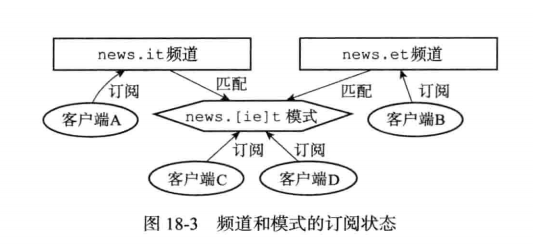
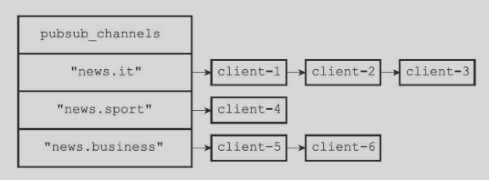
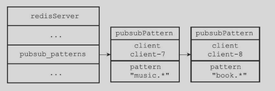

##  十三、发布和订阅

Redis 的发布订阅由 PUBLISH、SUBSCRIBE、PSUBSCRIBE 等命令组成。

- SUBSCRIBE：客户端可以订阅一个或多个**频道**，成为这些频道的订阅者。每当有客户端向这些频道发消息的时候，频道的所有订阅者都可以收到这条消息。

- PSUBSCRIBE：客户端可以订阅一个或多个**模式**，成为这些模式的订阅者。每当有客户端向这些频道发消息的时候，订阅频道以及与这个频道相匹配的模式的订阅者都会收到消息。



### （一）频道的订阅与退订

- Redis 将所有频道的订阅关系都保存在服务器状态的 `pubsub_channels` 字典里，键是被订阅的频道，值是一个链表，记录了所有订阅这个频道的客户端。

  

  ```c
  struct redisServer{
  	// 保存所有频道的订阅关系
      dict *pubsub_channels;
  }
  ```

- UNSUBSCRIBE 用于退订频道，就是删除链表中 key 为该频道后面的值，如果删除之后没有了就把这个 key 也删除。

### （二）模式的订阅与退订

- Redis 将所有模式的订阅关系都保存在服务器状态的 `pubsub_patterns` 链表里。

  

- 链表节点中记录了被订阅的模式以及订阅这个模式的客户端。 

  ```c
  struct redisServer{
  	// 保存所有频道的订阅关系
      dict *pubsub_channels;
  }
  ```

- PUNSUBSCRIBE 用于退订模式。

### （三）发送消息

- `PUBLISH <channel> <message>` 将消息发送给频道。步骤包括：
  - 将消息 message 发送给 channel 频道的所有订阅者；
  - 如果有一个或者多个模式 pattern 与频道 channel 相匹配，那么将消息 message 发送给 pattern 模式的订阅者。 即频道以及与频道相匹配的模式的订阅者都会收到消息。 

###  （四）查看订阅消息

PUBSUB 命令的三个子命令都是通过读取 pubsub_ channels 字典和 pubsub_ patterns 链表中的信息来实现的。

- `PUBSUB CHANNELS [pattern]` 子命令用于返回服务器当前被订阅的频道，其他 pattern 参数为可选的；
  - 如果不给定 pattern 参数，则命令返回服务器当前被订阅的所有频道；
  - 如果给定 pattern 参数，则命令返回服务器当前被订阅的频道中那些与 pattern 模式相匹配的频道；

- PUBSUB NUMSUB 【channel-1 ... channel-n】 接受任意多个频道作为输入参数，返回这些**频道的订阅者数量**。

- PUBSUB NUMPAT ，返回服务器当前**被订阅模式的数量。**

## 十四、事务

Redis 通过 MULTI、EXEC、WATCH、DISCARD  等命令来实现事务功能。Redis 事务可以实现以下两个功能，

- **事务中的所有命令都会被序列化并按顺序执行**。在执行 Redis 事务的过程中，服务器不会中断事务而处理由另一个客户端发出的请求命令。这保证 `命令队列` 作为一个单独的原子操作被执行。
- **队列中的命令要么全部被处理，要么全部被忽略**。EXEC 命令触发事务中所有命令的执行，因此，当客户端在事务上下文中失去与服务器的连接，
  - 如果发生在调用 MULTI 命令之前，则不执行任何 `commands`；
  - 如果在此之前 EXEC 命令被调用，则所有的 `commands` 都被执行。

注意说明：

- `MULTI`,`EXEC`,`DISCARD` 才是显式开启并控制事务的常用命令，可类比关系型数据库中的  `BEGAIN`,`COMMIT`,`ROLLBACK`（事实上，差距很大）；**事务首先以 `MULTI` 开始，接着多个命令放入事务中，最后由 `EXEC` 命令将这个事务提交或者由 `DISCAR` 进行终止。**

- `WATCH` 命令的使用是为了解决 事务并发 产生的不可重复读和幻读的问题（简单理解为给 Key 加锁）；

- 事务中的多个命令被一次性发送给服务器，而不是一条一条发送，这种方式被称为流水线，它可以减少客户端与服务器之间的网络通信次数从而提升性能。

同时，Redis 使用 AOF([append-only file](https://redis.io/topics/persistence#append-only-file))，使用一个额外的 write 操作将事务写入磁盘。如果发生宕机，进程奔溃等情况，可以使用 redis-check-aof tool 修复 a ppend-only file，使服务正常启动，并恢复部分操作。

- 以下示例以原子方式，递增键 foo 和 bar。

```
>MULTI
OK
>INCR foo
QUEUED
>INCR bar
QUEUED
>EXEC
1）（整数）1
2）（整数）1
```

从上面的命令执行中可以看出，`EXEC`返回一个数组，其中每个元素都是事务中单个命令的返回结果，而且顺序与命令的发出顺序相同。 当 Redis 连接处于`MULTI`请求的上下文中时，所有命令将以`字符串 QUEUED`（**从Redis协议的角度作为状态回复发送**）作为回复，并在`命令队列`中排队。只有 EXEC 被调用时，排队的命令才会被执行，此时才会有真正的返回结果。

 **相关命令**

| 命令        | 格式                    | 作用                                                         | 返回结果                                                     |
| ----------- | ----------------------- | ------------------------------------------------------------ | ------------------------------------------------------------ |
| **WATCH**   | **WATCH key [key ...]** | 将给出的`Keys`标记为`监测态`，作为事务执行的条件             | always OK.                                                   |
| **UNWATCH** | **UNWATCH**             | 清除事务中`Keys`的 `监测态`，如果调用了**EXEC** or **DISCARD**，则没有必要再手动调用**UNWATCH** | always OK.                                                   |
| **MULTI**   | **MULTI**               | `显式`开启`redis事务`，后续`commands`将排队，等候使用**EXEC**进行原子执行 | always OK.                                                   |
| **EXEC**    | **EXEC**                | 执行事务中的`commands`队列，恢复连接状态。如果**WATCH**在之前被调用，只有`监测`中的`Keys`没有被修改，命令才会被执行，否则停止执行（详见下文，`CAS机制`） | **成功：** 返回数组 —— 每个元素对应着原子事务中一个 `command`的返回结果; **失败：** 返回`NULL`（`Ruby` 返回``nil``）; |
| **DISCARD** | **DISCARD**             | 清除事务中的`commands`队列，恢复连接状态。如果**WATCH**在之前被调用，`释放` `监测`中的`Keys` | always OK.                                                   |

### （一）事务的实现

事务是开始到结束经历三个阶段：

- 事务开始

  MULTI 命令可以将执行该命令的**客户端**从非事务状态切换至事务状态。**本质上就是将客户端状态的 flags 属性中的 `REDIS_MUTLI` 标识打开**，MULTI 返回 OK。

- 命令入队

  - 当客户端处于非事务状态，该客户端发出的所有命令会立刻被服务器执行。

  - 切换到事务状态后，如果客户端发送的命令为 EXEC、DISCARD、WATCH、MULTI，那么服务器会立即执行，其他命令则会放入事务队列里，然后向客户端返回 QUEUED 回复。 

  每个 Redis 客户端都有自己的事务状态，该状态**保存在客户端状态的 mstate 属性中，事务状态包括一个事务队列和一个已入队命令的计数器（即队列长度）**。

  ```c
  struct redisClient{
      // 事务状态
      multistate mstate;
  }
  
  struct multiState{
  	// 事务队列，FIFO 顺序;这是一个数组
      multiCmd *commands;
      // 已入队命令计数
      int count;
  }
  
  // 保存每个已入队命令的相关信息
  struct multiCmd{
  	// 指向命令实现函数的指针、命令的参数、参数的数量；
  }
  ```

- 事务执行

  处于事务状态时，EXEC 会被立即执行。服务器会遍历这个客户端的事务队列，执行队列中的所有命令，最后将结果返回给客户端。该 EXEC 命令实现原理如下：

  - 首先创建一个空白的回复队列
  - 然后遍历事务队列中的每个项，读取命令的参数、参数的个数和要执行的命令【循环遍历执行】
  - 执行每个命令，并且取得命令的返回值，并将返回值追加到回复队列末尾。
  - 事务队列中都执行结束之后，将客户端的 REDIS_MULTI 标识移除
  - 清空客户端的事务状态，包括清零入队命令计数器和释放事务队列。
  - 最后将事务的执行结果返回给客户端。

### （二）WATCH 命令的实现

- WATCH 命令是一个乐观锁，它可以在 EXEC 命令执行之前，监视任意数量的数据库键，并在 EXEC 执行时，检查被监视的键是否至少有一个被修改过了，如果是，那么服务器将拒绝执行事务。 

- 每个 Redis 数据库（redisDb 结构）都保存着一个 `watched_keys`字典，这个字典的键是被 WATCH 监视的键，**值是一个链表，记录了所有监视相应数据库键的客户端**。 通过字典服务器可以知道哪些数据库键正在被监视，同时哪些客户端正在监视这些数据库键。

- 监控机制的触发：当执行如 set、sadd 等命令之后会调用 `touchWatchKey` 函数对`watched_keys` 字典进行检查，查看是否有客户端正在监视刚刚被修改的键，如果某个键被修改，那么监视该键的客户端的 `REDIS_DIRTY_CAS` 标识就会被打开。 表示该客户端的事务安全性已经被破坏。【客户端中有一个被监视的键发生修改，该客户端都会被添加标志，则该客户端提交的事务都不安全】

- 执行 EXEC 时，服务器会根据客户端的 `REDIS_DIRTY_CAS` 标识是否被打开来决定是否执行事务。

### （三）事务的  ACID 特性

- 原子性：可以保证

  Redis 的事务和传统的关系型事务最大的区别在于，**Redis 不支持事务回滚机制**，即使事务队列中的某个命令在执行期间出现错误，整个事务也会继续执行下去，直到事务队列中所有命令都执行完成。

- 一致性：可以保证：数据库在执行事务之前是一致的，事务执行之后无论事务是否执行成功，数据库也应该保持一致性。这里的一致指的是**数据符合数据库本身的定义和要求，没有包含非法或者无效的错误数据**。

  - 如果一个事务在入队命令过程中（EXEC 执行之前），出现了命令不存在或者命令语法格式错误，那么 Redis 将拒绝执行这个事务，并清除命令队列。  【一般是不存在命令】

  - 事务执行过程中（EXEC 执行之后），出错的命令不会对数据库做任何修改，剩余命令仍然正常执行。 【一般是存在但是不适用该结构的命令】

   - 如果数据库停机，根据服务器使用的持久化模式进行区分：
     - 服务器运行在无持久化的内存模式：重启之后数据库是空白的，肯定是一致的。
     - 运行在 RDB 模式下，重启加载 RDB 文件，可以还原到一致性状态。找不到 RDB 则是空白的，还是一致的。
     - 运行在 AOF 模式同上。

- 隔离性：可以保证

  Redis 使用单线程执行事务以及事务队列中的命令，并且事务执行过程中不会中断，所以事务总是以串行方式执行。

- 持久性：不一定

  - Redis 事务的持久性由 Redis 使用的持久化模式决定。

  - 只有当服务器运行在 AOF 持久化模式下，并且 appendfsync 为 always 时，这种配置的事务才具有持久性。
  - 当然如果在事务语句之后，EXEC 之前加上 SAVE 命令则总能保证事务的持久性。

### （四）Redis 事务不支持 Rollback（重点）

**事实上 Redis 命令在事务执行时可能会失败，但仍会继续执行剩余命令而不是 `Rollback`（事务回滚）**。然而针对这种情况具备很好的解释：

- Redis 命令可能会执行失败，仅仅是由于错误的语法被调用（命令排队时检测不出来的错误），或者使用错误的数据类型操作某个 `Key`： 这意味着，实际上失败的命令都是编程错误造成的，都是开发中能够被检测出来的，生产环境中不应该存在。
- 由于不必支持 `Rollback`，`Redis` 内部简洁并且更加高效。

“**如果错误就是发生了呢？**”通常情况下，回滚并不能挽救编程错误。**鉴于没有人能够挽救程序员的错误**，并且 Redis 命令失败所需的错误类型不太可能进入生产环境，所以我们选择了不支持错误回滚（Rollback）这种更简单快捷的方法。

### （五）事务中的错误

**事务期间，可能会遇到两种命令错误：**

- **在调用`EXEC`命令之前出现错误（`COMMAND`排队失败）。**

  例如，命令可能存在语法错误（参数数量错误，错误的命令名称等）；或者可能存在某些关键条件，如内存不足的情况（如果服务器使用`maxmemory`指令做了内存限制）。

  客户端会在`EXEC`调用之前检测第一种错误。 通过检查排队命令的状态回复（注意：这里是指排队的状态回复，而不是执行结果），如果命令使用`QUEUED`进行响应，则它已正确排队，否则 Redis 将返回错误。如果排队命令时发生错误，大多数客户端将中止该事务并清除命令队列。然而：

  - 在 Redis 2.6.5 之前，这种情况下，在`EXEC`命令调用后，客户端会执行命令的子集（成功排队的命令）而忽略之前的错误。
  - 从 Redis 2.6.5 开始，服务端会记住在累积命令期间发生的错误，当`EXEC`命令调用时，将拒绝执行事务，并返回这些错误，同时自动清除命令队列。

  示例如下：

  ```c
  >MULTI
  +OK
  >INCR a b c
  -ERR wrong number of arguments for 'incr' command
  # 这是由于`INCR`命令的语法错误，将在调用`EXEC`之前被检测出来，并终止事务（version2.6.5+）。
  ```

- **在调用`EXEC`命令之后出现错误。**

  例如，使用错误的值对某个 key 执行操作（如针对 String 值调用 List 操作）

  `EXEC`命令执行之后发生的错误并不会被特殊对待：即使事务中的某些命令执行失败，其他命令仍会被正常执行。

  示例如下：

  ```c
  >MULTI
  +OK
  >SET a 3
  +QUEUED
  >LPOP a
  +QUEUED
  >EXEC
  *2
  +OK
  -ERR Operation against a key holding the wrong kind of value
  ```

  - `EXEC`返回一个包含两个元素的字符串数组，一个元素是`OK`，另一个是`-ERR……`。
  - **能否将错误合理的反馈给用户这取决于`客户端library`(如：`Spring-data-redis.redisTemplate`)的自身实现。**
  - 需要注意的是，**即使命令失败，队列中的所有其他命令也会被处理----Redis不会停止命令的处理**。

### （六）清除命令队列

`DISCARD` 被用来中止事务。事务中的所有命令将不会被执行，连接将恢复正常状态。

## 十五、排序

Redis 的 `sort<key>` 命令可以对列表键、集合键和有序集合键的值进行排序。

#### 排序实现原理

- 步骤一：创建一个和待排序结构相同长度的数组，数组中每个项都是 redisSortObject 结构。
- 步骤二：遍历数组，将各个数据项的 Obj 指针分别指向待排序列表的每个项。
- 步骤三：遍历数组，将上面指向的每个项转换成一个 double 类型的浮点数，然后保存在对应数组项结构的 u.score 属性中。
- 步骤四：根据 u.score 属性的值对数组进行排序（从小到大）
- 步骤五：将各个数组项的 Obj 指针指向的列表项作为返回结果返回给客户端。

上述命令后面加上 ALPHA  可以对字符串值的键进行排序。

## 十六、慢查询日志

该功能用于记录执行时间超过给定时长的命令请求，可以通过该功能产生的日志来监控和优化查询速度。

服务器配置两个选项

- `slowlog-log-slower-than` 指定执行时间超过多少微秒的命令请求记录到日志中。
- `slowlog-max-len`：指定服务器最多保存多少条慢查询日志。

使用 `slowlog get` 命令查看慢查询日志