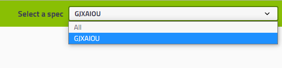

## Swagger 使用和集成

[TOC]

> 官网：https://swagger.io

- Swagger 是 Restful APi 文档在线自动生成器，从而保证： API 文档和 API 定义同步更新。

- 可以在线测试该 API 接口

- 支持多种语言，包括 Java、PHP

## 一、Swagger 作用

### 已有问题：

- 因为前后端分离，前后端通常部署到不同的服务器上，然后通过 API 接口进行交互，这样在前后端集成联调的时候，前端或者后端无法做到“及时协商，尽早解决”，最终导致问题集中爆发。

### 解决方案：

- 首先定义schema [ 计划的提纲 ]，并实时跟踪最新的 API，降低集成风险。
- 通过在项目中集成  Swagger 实现自动生成 API 文档。

## 二、SpringBoot 集成 Swagger

> Swagger2 需要 JDK 1.8 + 

- 步骤一：新建 SpringBoot  + Web 项目

- 步骤二：添加 Maven 依赖

    主要包括：`springfox-swagger2` 和 `swagger-springmvc`

    ```xml
    <!-- https://mvnrepository.com/artifact/io.springfox/springfox-swagger2 -->
    <dependency>
        <groupId>io.springfox</groupId>
        <artifactId>springfox-swagger2</artifactId>
        <version>2.9.2</version>
    </dependency>
    <!-- https://mvnrepository.com/artifact/io.springfox/springfox-swagger-ui -->
    <dependency>
        <groupId>io.springfox</groupId>
        <artifactId>springfox-swagger-ui</artifactId>
        <version>2.9.2</version>
    </dependency>
    ```

- 步骤三：添加 HelloController 类，测试确保项目运行成功

    ```java
    package com.gjxaiou.swagger2020.controller;
    
    import org.springframework.web.bind.annotation.RequestMapping;
    import org.springframework.web.bind.annotation.RestController;
    
    @RestController
    public class HelloController {
    
        @RequestMapping("/hello")
        public String hello() {
            return "hello";
        }
    }
    ```

下面开始使用 Swagger

- 步骤一：编写配置类 SwaggerConfig 来配置 Swagger

    ```java
    package com.gjxaiou.swagger2020.config;
    
    import org.springframework.context.annotation.Configuration;
    import springfox.documentation.swagger2.annotations.EnableSwagger2;
    
    import java.util.ArrayList;
    
    // 标识为配置类
    @Configuration
    // 开启 Swagger2 的自动配置
    @EnableSwagger2
    public class SwaggerConfig {
    
    }
    ```

- 步骤二：访问测试：`http://localhost:8080/swagger-ui.html` 可以看到如下的 Swagger 界面

    

其中 `swagger-ui` 的界面在 `springfox-swagger-ui-2.9.2.jar` 包下面的 webjar 下面。


## 三、配置 Swagger

- Swagger 的 Bean 实例是 Docket，所以可以通过配置  Docket 实例来配置 Swagger。

    ```java
    package com.gjxaiou.swagger2020.config;
    
    import org.springframework.context.annotation.Bean;
    import org.springframework.context.annotation.Configuration;
    import springfox.documentation.service.ApiInfo;
    import springfox.documentation.service.Contact;
    import springfox.documentation.service.VendorExtension;
    import springfox.documentation.spi.DocumentationType;
    import springfox.documentation.spring.web.plugins.Docket;
    import springfox.documentation.swagger2.annotations.EnableSwagger2;
    
    import java.util.ArrayList;
    
    /**
     * @Author GJXAIOU
     * @Date 2021/1/1 15:55
     */
    // 标识为配置类
    @Configuration
    // 开启 Swagger2
    @EnableSwagger2
    public class SwaggerConfig {
    
        // 1.配置 Swagger 的 Docket 的 Bean 实例
        @Bean
        public Docket docket() {
            return new Docket(DocumentationType.SWAGGER_2);
        }
    }
    ```

Docket  中有很多属性，所有属性具体见 Docket 的 源代码。

```java
public class Docket implements DocumentationPlugin {

  public static final String DEFAULT_GROUP_NAME = "default";

  private final DocumentationType documentationType;
  private final List<SecurityContext> securityContexts = newArrayList();
  private final Map<RequestMethod, List<ResponseMessage>> responseMessages = newHashMap();
  private final List<Parameter> globalOperationParameters = newArrayList();
  private final List<Function<TypeResolver, AlternateTypeRule>> ruleBuilders = newArrayList();
  private final Set<Class> ignorableParameterTypes = newHashSet();
  private final Set<String> protocols = newHashSet();
  private final Set<String> produces = newHashSet();
  private final Set<String> consumes = newHashSet();
  private final Set<ResolvedType> additionalModels = newHashSet();
  private final Set<Tag> tags = newHashSet();

  private PathProvider pathProvider;
  private List<? extends SecurityScheme> securitySchemes;
  private Ordering<ApiListingReference> apiListingReferenceOrdering;
  private Ordering<ApiDescription> apiDescriptionOrdering;
  private Ordering<Operation> operationOrdering;

  private ApiInfo apiInfo = ApiInfo.DEFAULT;
  private String groupName = DEFAULT_GROUP_NAME;
  private boolean enabled = true;
  private GenericTypeNamingStrategy genericsNamingStrategy = new DefaultGenericTypeNamingStrategy();
  private boolean applyDefaultResponseMessages = true;
  private String host = "";
  private Optional<String> pathMapping = Optional.absent();
  private ApiSelector apiSelector = ApiSelector.DEFAULT;
  private boolean enableUrlTemplating = false;
  private List<VendorExtension> vendorExtensions = newArrayList();

}
```

- 示例：可以通过 `apiInfo()` 属性配置文档信息

    ```java
    package com.gjxaiou.swagger2020.config;
    
    import org.springframework.context.annotation.Bean;
    import org.springframework.context.annotation.Configuration;
    import springfox.documentation.service.ApiInfo;
    import springfox.documentation.service.Contact;
    import springfox.documentation.service.VendorExtension;
    import springfox.documentation.spi.DocumentationType;
    import springfox.documentation.spring.web.plugins.Docket;
    import springfox.documentation.swagger2.annotations.EnableSwagger2;
    
    import java.util.ArrayList;
    
    /**
     * @Author GJXAIOU
     * @Date 2021/1/1 15:55
     */
    // 标识为配置类
    @Configuration
    // 开启 Swagger2
    @EnableSwagger2
    public class SwaggerConfig {
    
        /**
         * 2.配置文档信息
         * 直接使用上面的 .apiInfo(ApiInfo apiInfo) 里面可以参考 ApiInfo 源码中的属性构建一个对象传入即可。
         */
        @Bean
        public Docket docket2() {
            // 联系人信息
            Contact contact = new Contact("联系人名字", "www.gjxaiou.com", "联系人邮箱");
            return new Docket(DocumentationType.SWAGGER_2).apiInfo(
                    new ApiInfo(
                            "自定义标题", // 标题
                            "自定义描述 Documentation", // 描述
                            "自定义版本号1.0",  // 版本
                            "组织链接：www.gjxaiou.com",  // 组织链接
                            contact,  // 联系人信息
                            "许可：Apache 2.0",  // 许可
                            "许可链接：http://www.apache.org/licenses/LICENSE-2.0",  // 许可连接
                            new ArrayList<VendorExtension>())  // 扩展
    
            );
        }
    }
    ```

    然后重启项目，访问测试 http://localhost:8080/swagger-ui.html  看下效果；

    

## 四、配置扫描接口

默认扫描接口的结果是包括两个接口，一个是 basic-error-controller 接口（即包含默认的 error 界面），另一个是 hello-controller 接口。


- 构建 Docket 时通过 `select()` 方法配置怎么扫描接口。

    通过 select() 可以指定扫描的接口范围，下面就是仅仅扫描指定包下面的接口。

```java
package com.gjxaiou.swagger2020.config;

import org.springframework.context.annotation.Bean;
import org.springframework.context.annotation.Configuration;
import springfox.documentation.builders.RequestHandlerSelectors;
import springfox.documentation.service.ApiInfo;
import springfox.documentation.service.Contact;
import springfox.documentation.service.VendorExtension;
import springfox.documentation.spi.DocumentationType;
import springfox.documentation.spring.web.plugins.Docket;
import springfox.documentation.swagger2.annotations.EnableSwagger2;

import java.util.ArrayList;

/**
 * @Author GJXAIOU
 * @Date 2021/1/1 15:55
 */
// 标识为配置类
@Configuration
// 开启 Swagger2
@EnableSwagger2
public class SwaggerConfig {
    @Bean
    public Docket docket2() {
        // 联系人信息
        Contact contact = new Contact("联系人名字", "www.gjxaiou.com", "联系人邮箱");
        return new Docket(DocumentationType.SWAGGER_2).apiInfo(// 省略里面信息
            // 通过.select()方法，去配置扫描接口,RequestHandlerSelectors配置如何扫                描接口 
      ). select(). apis (RequestHandlerSelectors. basePackage ("com.gjxaiou.swagger2020.controller")).build();
    }
}
```

重启项目测试，由于我们配置根据包的路径扫描接口，所以我们只能看到一个类


- 除了通过包路径配置扫描接口外，还可以通过配置其他方式扫描接口，这里注释一下所有的配置方式：通过 RequestHandlerSelectors 源码中的方法可以看到所有。

```java
any() // 扫描所有，项目中的所有接口都会被扫描到
none() // 不扫描接口
// 通过方法上的注解扫描，如withMethodAnnotation(GetMapping.class)只扫描get请求
withMethodAnnotation(final Class<? extends Annotation> annotation)
// 通过类上的注解扫描，如.withClassAnnotation(Controller.class)只扫描有controller注解的类中的接口
withClassAnnotation(final Class<? extends Annotation> annotation)
basePackage(final String basePackage) // 根据包路径扫描接口
```

- 除此之外，我们还可以配置接口扫描过滤：

    首先提供一个  WorldController 

    ```java
    package com.gjxaiou.swagger2020.controller;
    
    import org.springframework.web.bind.annotation.RequestMapping;
    import org.springframework.web.bind.annotation.RestController;
    
    @RestController
    public class WorldController {
        @RequestMapping("/world")
        public String world() {
            return "world";
        }
    }
    ```

    然后通过 `.path()` 来指定访问路径匹配。

    ```java
    package com.gjxaiou.swagger2020.config;
    
    import org.springframework.context.annotation.Bean;
    import org.springframework.context.annotation.Configuration;
    import springfox.documentation.builders.PathSelectors;
    import springfox.documentation.builders.RequestHandlerSelectors;
    import springfox.documentation.spi.DocumentationType;
    import springfox.documentation.spring.web.plugins.Docket;
    import springfox.documentation.swagger2.annotations.EnableSwagger2;
    
    import java.util.ArrayList;
    
    /**
     * @Author GJXAIOU
     * @Date 2021/1/1 15:55
     */
    // 标识为配置类
    @Configuration
    // 开启 Swagger2
    @EnableSwagger2
    public class SwaggerConfig {
    
        @Bean
        public Docket docket3() {
            // 通过.select()方法，去配置扫描接口,RequestHandlerSelectors配置如何扫描接口
            // .path 配置如何通过path过滤,即这里只扫描请求以 /world 开头的接口
            return new Docket(DocumentationType.SWAGGER_2).select().apis(RequestHandlerSelectors.basePackage("com.gjxaiou.swagger2020.controller")).paths(PathSelectors.ant("/world")).build();
        }
    }
    ```

    同样范围上面的地址，页面中只有 WorldController 接口，因为 HelloController 的路径为：`/hello` 不符合路径匹配，过滤了。

    

- 这里的可选值还有

    ```java
    any() // 任何请求都扫描
    none() // 任何请求都不扫描
    regex(final String pathRegex) // 通过正则表达式控制
    ant(final String antPattern) // 通过ant()控制
    ```


## 五、配置 Swagger 开关

- 通过`enable()` 方法配置是否启用 swagger，如果是 false，swagger 将不能在浏览器中访问了

```java
@Bean
public Docket docket() {
   return new Docket(DocumentationType.SWAGGER_2)
      .apiInfo(apiInfo())
      .enable(false) //配置是否启用Swagger，如果是false，在浏览器将无法访问
      .select()// 通过.select()方法，去配置扫描接口,RequestHandlerSelectors配置如何扫描接口
      .apis(RequestHandlerSelectors.basePackage("com.gjxaiou.swagger2020.controller"))
       // 配置如何通过path过滤,即这里只扫描请求以 /hello 开头的接口
      .paths(PathSelectors.ant("/world/**"))
      .build();
}
```

- 动态配置当项目处于 `test`、`dev` 环境时显示 swagger，处于 `prod` 时不显示

```java
package com.gjxaiou.swagger2020.config;

import org.springframework.context.annotation.Bean;
import org.springframework.context.annotation.Configuration;
import org.springframework.core.env.Environment;
import org.springframework.core.env.Profiles;
import springfox.documentation.builders.RequestHandlerSelectors;
import springfox.documentation.spi.DocumentationType;
import springfox.documentation.spring.web.plugins.Docket;
import springfox.documentation.swagger2.annotations.EnableSwagger2;

import java.util.ArrayList;

/**
 * @Author GJXAIOU
 * @Date 2021/1/1 15:55
 */
// 标识为配置类
@Configuration
// 开启 Swagger2
@EnableSwagger2
public class SwaggerConfig {

    /**
     * 配置不同环境是否开启
     */
    @Bean
    public Docket docket4(Environment environment) {
        // 设置要显示 swagger 的环境
        Profiles profiles = Profiles.of("dev", "test");
        // 判断当前是否处于该环境
        // 通过 enable() 接收此参数判断是否要显示
        boolean b = environment.acceptsProfiles(profiles);
        return new Docket(DocumentationType.SWAGGER_2).enable(b).select().apis(RequestHandlerSelectors.basePackage("com.gjxaiou.swagger2020.controller")).build();
    }
}
```

环境配置方式：

- 新建配置文件：`application-dev.properties`，然后文件中加上 `spring.profiles.active=true`则表示激活了该环境。
- 直接在 `application.properties`中使用 `spring.profiles.active=dev` 标识环境。

当将属性值配置为其他值，如：`pro` 则结果如下：


## 六、配置 API 分组

主要使用 Docket 中的 `groupName` 属性进行配置，该值的默认属性为 `default` 即没有配置分组，如果要自定义分组只要自定义「分组名称」即可。

如果要配置多个分组，使用多个 Docket 指定多个分组名称即可。

```java
package com.gjxaiou.swagger2020.config;

import org.springframework.context.annotation.Bean;
import org.springframework.context.annotation.Configuration;
import springfox.documentation.spi.DocumentationType;
import springfox.documentation.spring.web.plugins.Docket;
import springfox.documentation.swagger2.annotations.EnableSwagger2;

import java.util.ArrayList;

/**
 * @Author GJXAIOU
 * @Date 2021/1/1 15:55
 */
// 标识为配置类
@Configuration
// 开启 Swagger2
@EnableSwagger2
public class SwaggerConfig {

    /**
     * 配置 API 分组
     */
    @Bean
    public Docket docket5() {
        return new Docket(DocumentationType.SWAGGER_2).groupName("GJXAIOU");
    }

    @Bean
    public Docket docket6() {
        return new Docket(DocumentationType.SWAGGER_2).groupName("All");
    }
}

```

重启项目查看即可



## 七、实体类配置

> 从上述图片可以看出页面中还有一部分为 Model，但是因为没有添加注解扫描，所以为空。

- 新建一个实体类

    ```java
    package com.gjxaiou.swagger2020.vo;
    
    import io.swagger.annotations.ApiModel;
    import io.swagger.annotations.ApiModelProperty;
    
    // 用于标识实体类的文档注释说明
    @ApiModel("This is User Class，类的说明")
    public class User {
        @ApiModelProperty("用户名:属性说明")
        public String username;
        @ApiModelProperty("密码")
        public String password;
    }
    ```

- 只要这个实体类作为某个「请求接口」的返回值（即使是泛型），都能映射到实体项中，即都能将该实体类扫描到 Swagger 中。

    这里单独提供一个 Controller，该请求返回一个 User 类

    ```java
    package com.gjxaiou.swagger2020.controller;
    
    import com.gjxaiou.swagger2020.vo.User;
    import org.springframework.web.bind.annotation.RequestMapping;
    import org.springframework.web.bind.annotation.RestController;
    
    /**
     * @Author GJXAIOU
     * @Date 2021/1/9 13:45
     */
    @RestController
    public class UserController {
    
        @RequestMapping("/getUser")
        public User getUser() {
            return new User();
        }
    }
    ```

- 重启整个项目，然后在页面的「Model」部分显示如下

    

注：并不是因为 `@ApiModel` 这个注解让实体显示在这里了，而是只要出现在接口方法的返回值上的实体都会显示在这里，而 `@ApiModel` 和 `@ApiModelProperty`这两个注解只是为实体添加注释的。

- `@ApiModel`为类添加注释，等价于 `@Api`

- `@ApiModelProperty`为类属性添加注释

- `@ApiOperation()`：为方法添加注释

- `@ApiParam()`：为方法中属性添加注释


## 八、常用注解

Swagger 的所有注解定义在 `io.swagger.annotations` 包下，部分常用注解如下：

| Swagger注解                                            | 简单说明                                             |
| ------------------------------------------------------ | ---------------------------------------------------- |
| @Api(tags = "xxx模块说明")                             | 作用在模块类上                                       |
| @ApiOperation("xxx接口说明")                           | 作用在接口方法上                                     |
| @ApiModel("xxxPOJO说明")                               | 作用在模型类上：如VO、BO                             |
| @ApiModelProperty(value = "xxx属性说明",hidden = true) | 作用在类方法和属性上，hidden设置为true可以隐藏该属性 |
| @ApiParam("xxx参数说明")                               | 作用在参数、方法和字段上，类似@ApiModelProperty      |

我们也可以给请求的接口配置一些注释

```
@ApiOperation("狂神的接口")
@PostMapping("/kuang")
@ResponseBody
public String kuang(@ApiParam("这个名字会被返回")String username){
   return username;
}
```

这样的话，可以给一些比较难理解的属性或者接口，增加一些配置信息，让人更容易阅读！

相较于传统的Postman或Curl方式测试接口，使用swagger简直就是傻瓜式操作，不需要额外说明文档(写得好本身就是文档)而且更不容易出错，只需要录入数据然后点击Execute，如果再配合自动化框架，可以说基本就不需要人为操作了。

Swagger是个优秀的工具，现在国内已经有很多的中小型互联网公司都在使用它，相较于传统的要先出Word接口文档再测试的方式，显然这样也更符合现在的快速迭代开发行情。当然了，提醒下大家在正式环境要记得关闭Swagger，一来出于安全考虑二来也可以节省运行时内存。


## 九、拓展：其他皮肤

我们可以导入不同的包实现不同的皮肤定义：

- 使用默认依赖

    ```xml
    <dependency>
       <groupId>io.springfox</groupId>
       <artifactId>springfox-swagger-ui</artifactId>
       <version>2.9.2</version>
    </dependency>
    ```

    然后访问：`http://localhost:8080/swagger-ui.html` 得到页面如下：

    

- 引入 swagger-bootstrap-ui 包，然后访问：`http://localhost:8080/doc.html` 

    ```xml
    <!-- 引入swagger-bootstrap-ui包 /doc.html-->
    <dependency>
       <groupId>com.github.xiaoymin</groupId>
       <artifactId>swagger-bootstrap-ui</artifactId>
       <version>1.9.1</version>
    </dependency>
    ```

    同时需要去除 `springfox-swagger-ui` 依赖

    ```xml
    <!-- https://mvnrepository.com/artifact/io.springfox/springfox-swagger-ui -->
    <dependency>
        <groupId>io.springfox</groupId>
        <artifactId>springfox-swagger-ui</artifactId>
        <version>2.9.2</version>
    </dependency>
    ```

    然后访问上述的 `doc.html`地址，会得到如下的页面，同时访问 `http://localhost:8080/swagger-ui.html` 同样还可以访问。

    

- Layui-ui  **访问 http://localhost:8080/docs.html**

```
<!-- 引入swagger-ui-layer包 /docs.html-->
<dependency>
   <groupId>com.github.caspar-chen</groupId>
   <artifactId>swagger-ui-layer</artifactId>
   <version>1.1.3</version>
</dependency>
```


- mg-ui  **访问 http://localhost:8080/document.html**

```
<!-- 引入swagger-ui-layer包 /document.html-->
<dependency>
   <groupId>com.zyplayer</groupId>
   <artifactId>swagger-mg-ui</artifactId>
   <version>1.0.6</version>
</dependency>
```


------


