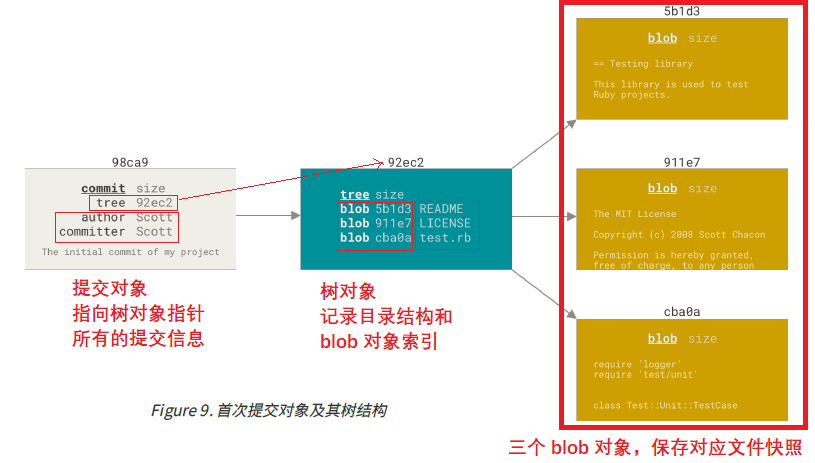

### 初始运行 Git 前的配置

每台计算机上只需要配置一次，程序升级时会保留配置信息。 你可以在任何时候再次通过运行命令来修改它们。

Git 自带一个 git config 的工具来帮助设置控制 Git 外观和行为的配置变量。 这些变量存储在三个不同的位
置：

- /etc/gitconfig 文件: 包含系统上每一个用户及他们仓库的通用配置（系统配置文件，需要管理员权限）。 **如果在执行 git config 时带上 `--system` 选项，那么它就会读写该文件中的配置变量**。 

- ~/.gitconfig 或 ~/.config/git/config 文件：只针对**当前用户**。 你可以传递 --global 选项让 Git
    读写此文件，这会对你系统上 **所有** 的仓库生效。

- 当前使用仓库的 Git 目录中的 config 文件（即 .git/config）：针对该仓库。 你可以传递 --local 选
    项让 Git 强制读写此文件，虽然默认情况下用的就是它。。 （当然，你需要进入某个 Git 仓库中才能让该选
    项生效。）
    每一个级别会覆盖上一级别的配置，所以 .git/config 的配置变量会覆盖 /etc/gitconfig 中的配置变量。
    在 Windows 系统中，Git 会查找 $HOME 目录下（一般情况下是 `C:\Users\$USER` ）的 .gitconfig 文件。
    Git 同样也会寻找 /etc/gitconfig 文件，但只限于 MSys 的根目录下，即安装 Git 时所选的目标位置。 如果
    你在 Windows 上使用 Git 2.x 以后的版本，那么还有一个系统级的配置文件，Windows XP 上在
    C:\Documents and Settings\All Users\Application Data\Git\config ，Windows Vista 及更新
    的版本在 C:\ProgramData\Git\config 。此文件只能以管理员权限通过 git config -f <file> 来修
    改。
    查看所有的配置以及它们所在的文件命令：`git config --list --show-origin`

    ```shell
    C:\Users\gjx16>git config --list --show-origin
    file:E:/Program/VersionControl/Git/etc/gitconfig        core.fscache=true
    .....
    file:C:/Users/gjx16/.gitconfig  user.name=GJXAIOU
    file:C:/Users/gjx16/.gitconfig  user.email=gjx1690048420@163.com
    ......
    file:.git/config        core.repositoryformatversion=0
     remote.leetcode.url=https://github.com/GJXAIOU/LeetCode.git
    file:.git/config        remote.leetcode.fetch=+refs/heads/*:refs/remotes/leetcode/*
    file:.git/config        remote.interviewexperience.url=https://github.com/GJXAIOU/InterviewExperience.git
    file:.git/config        remote.interviewexperience.fetch=+refs/heads/*:refs/remotes/interviewexperience/*
    ....
    ```

#### 设置用户信息

设置用户名和邮件地址，每一个 Git 提交都会使用这些信息，它们会写入到你的每一次提交中，不可更改：

```shell
git config --global user.name "GJXAIOU"
git config --global user.email gjxaiou@163.com
```

如果使用了 --global 选项，那么该命令只需要运行一次，因为之后无论你在该系统上做任何事情， Git 都会使用那些信息。 当你想针对特定项目使用不同的用户名称与邮件地址时，可以在那个项目目录下运
行没有 --global 选项的命令来配置。

#### 设置文本编辑器

配置默认文本编辑器了，当 Git 需要你输入信息时会调用它。 如果未配置，Git 会使用操作系统默认的文本编辑器。

`git config --global core.editor "完整的安装路径"`

#### 检查配置信息

如果想要检查你的配置，可以使用 git config --list 命令来列出所有 Git 当时能找到的配置。

你可能会看到重复的变量名，因为 Git 会从不同的文件中读取同一个配置（例如：/etc/gitconfig 与
~/.gitconfig）。 这种情况下，Git 会使用它找到的每一个变量的最后一个配置。如果想看是哪个文件修改了该值可以使用  `git config --show-origin <key>` 

```shell
$ git config --show-origin user.name
file:C:/Users/gjx16/.gitconfig  GJXAIOU
```


可以通过输入 git config <key>： 来检查 Git 的某一项配置

#### 获取帮助

`命令  help` 或者 `命令 -h`， 如 `git config -h`

### 二、Git 基础

#### 获取 Git 仓库

通常有两种获取 Git 项目仓库的方式：
- 将尚未进行版本控制的本地目录转换为 Git 仓库；（在已存在目录中初始化仓库）

    进入项目目录，然后执行 `git init`

    该命令将创建一个名为 .git 的子目录，这个子目录含有你初始化的 Git 仓库中所有的必须文件，这些文件是Git 仓库的骨干。 但是，在这个时候，我们仅仅是做了一个初始化的操作，你的项目里的文件还没有被跟踪。(参见 Git 内部原理 来了解更多关于到底 .git 文件夹中包含了哪些文件的信息。)

    如果在一个已存在文件的文件夹（而非空文件夹）中进行版本控制，你应该开始追踪这些文件并进行初始提交。
    可以通过 git add 命令来指定所需的文件来进行追踪，然后执行 git commit ：

    现在，你已经得到了一个存在被追踪文件与初始提交的 Git 仓库。

- 从其它服务器 克隆 一个已存在的 Git 仓库。

    使用 `git clone  <url>`命令，或者 `git clone <url> 新的名字` 设置保存在本地项目名称，Git 克隆的是该 Git 仓库服务器上的几乎**所有数据**，而不是仅仅复制完成你的工作所需要文件。 当你执行 git clone 命令的时候，默认配置下远程 Git 仓库中的**每一个文件的每一个版本**都将被拉取下来。

    这会在当前目录下创建一个名为 “libgit2” 的目录，并在这个目录下初始化一个 .git 文件夹， 从远程仓库拉取下所有数据放入 .git 文件夹，然后从中读取最新版本的文件的拷贝。 如果你进入到这个新建的 libgit2 文件夹，你会发现所有的项目文件已经在里面了，准备就绪等待后续的开发和使用。

    Git 支持多种数据传输协议。 上面的例子使用的是 https:// 协议，不过你也可以使用 git:// 协议或者使用
    SSH 传输协议，比如 user@server:path/to/repo.git 。

    两种方式都会在你的本地机器上得到一个工作就绪的 Git 仓库。

#### 记录每次更新到仓库

工作目录下的每一个文件只有两种状态：已跟踪 或 未跟踪。 已跟踪的文件是指那些被纳入了版本控制的文件，在上一次快照中有它们的记录，在工作一段时间后， 它们的状态可能是未修改，已修改或已放入暂存区。简而言之，已跟踪的文件就是 Git 已经知道的文件。

工作目录中除已跟踪文件外的其它所有文件都属于未跟踪文件，它们既不存在于上次快照的记录中，也没有被放入暂存区。 初次克隆某个仓库的时候，工作目录中的所有文件都属于已跟踪文件，并处于未修改状态，因为 Git 刚刚检出了它们， 而你尚未编辑过它们。

编辑过某些文件之后，由于自上次提交后你对它们做了修改，Git 将它们标记为已修改文件。 在工作时，你可以择性地将这些修改过的文件放入暂存区，然后提交所有已暂存的修改，如此反复。


#### 检查当前文件状态

使用命令 `git status` 会显示当前所在分支，「Untracked files」下面列出的文件就是未跟踪文件，即 Git 之前的快照（提交）中没有这些文件。「Changes to be committed」 下面表示为已暂存文件，如果此时提交，那么该文件在**你运行 git add 时的版本**将被留存在后续的历史记录中。

#### 跟踪新文件

使用 `git add 文件名称` 开始跟踪该文件，如果将文件名称改为文件路径，会递归跟踪该目录下的所有文件。

#### 暂存已修改文件

修改一个已被跟踪的文件，使用 `git status` 显示该文件处于 「Changes not staged for commit」 下面，即已追踪文件发生修改但是没有放到暂存区。如果要暂存该次更新，使用 git add。该命令可以用它开
始跟踪新文件，或者把已跟踪的文件放到暂存区，还能用于合并时把有冲突的文件标记为已解决状态等，总的来说就是：精确的将内容添加到下一次提交中。

**注意** ：提交的时候，提交文件的版本是最后一次运行 `git add` 时的版本，而不是运行 `git commit` 时当前工作目录中的当前版本，所以运行 `git add` 之后又修改了该文件，需要重新运行 `git add` 将最新版本文件重新暂存起来才行。

可以使用 `git status -s` 或者使用 `git status --short` 来简化输出结果。

新添加的未跟踪文件前面有 ?? 标记，新添加到暂存区中的文件前面有 A 标记，修改过的文件前面有 M 标记。 输出中有两栏，左栏指明了暂存区的状态，右栏指明了工作区的状态。

```shell
$ git status -s
M README
MM Rakefile
A lib/git.rb
M lib/simplegit.rb
?? LICENSE.txt
上面的状态报告显示： README 文件
在工作区已修改但尚未暂存，而 lib/simplegit.rb 文件已修改且已暂存。 Rakefile 文件已修，暂存后又
作了修改，因此该文件的修改中既有已暂存的部分，又有未暂存的部分。
```

#### 忽略文件

无需纳入 Git 管理并且不希望其出现在未跟踪文件列表中。

通过创建一个  `.gitignore` 文件，格式规划如下：

• 所有空行或者以 # 开头的行都会被 Git 忽略。
• 可以使用标准的 glob 模式匹配，它会递归地应用在整个工作区中。
• 匹配模式可以以（/）开头防止递归。
• 匹配模式可以以（/）结尾指定目录。
• 要忽略指定模式以外的文件或目录，可以在模式前加上叹号（!）取反。
所谓的 glob 模式是指 shell 所使用的简化了的正则表达式。 星号（*）匹配零个或多个任意字符；[abc] 匹配
任何一个列在方括号中的字符 （这个例子要么匹配一个 a，要么匹配一个 b，要么匹配一个 c）； 问号（?）只匹配一个任意字符；如果在方括号中使用短划线分隔两个字符， 表示所有在这两个字符范围内的都可以匹配（比如 [0-9] 表示匹配所有 0 到 9 的数字）。 使用两个星号（**）表示匹配任意中间目录，比如 a/**/z 可以匹配 a/z 、 a/b/z 或 a/b/c/z 等。

```shell
# 忽略所有的 .a 文件
*.a
# 但跟踪所有的 lib.a，即便你在前面忽略了 .a 文件
!lib.a
# 只忽略当前目录下的 TODO 文件，而不忽略 subdir/TODO
/TODO
# 忽略任何目录下名为 build 的文件夹
build/
# 忽略 doc/notes.txt，但不忽略 doc/server/arch.txt
doc/*.txt
# 忽略 doc/ 目录及其所有子目录下的 .pdf 文件
doc/**/*.pdf
```

各种语言推荐的 `.gitignore` 文件写法见 [Github](https://github.com/github/gitignore)。

#### 查看已暂存和未暂存的修改

git diff 命令用来解决这两个问题：当前做的哪些更新尚未暂存？ 有哪些更新已暂存并准备好下次提交？ 虽然 git status 已经通过在相应栏下列出文件名的方式回答了这个问题，但 git diff 能通过文件补丁的格式更加具体地**显示哪些行发生了改变**。

分别修改两个文件，一个使用`git add`暂存，一个不暂存。使用 status 查看就是一个在 「Changes to be committed」，一个在 「Changes not staged for commit」。

使用 `git diff` 比较工作目录中的当前文件和暂存区域快照之间的差异，即修改后还未暂存的变化内容。若要查看已暂存的将要添加到下次提交里的内容，可以用 git diff --staged 或者 `git diff --cached`命令。 这条命令将比对已暂存文件与最后一次提交的文件差异，**git diff 本身只显示尚未暂存的改动，而不是自上次提交以来所做的所有改动。**所以暂存之后在用就看不到差异了。

#### 提交更新

在每次提交之前使用 `git status` 查看是不是需要的文件都已经暂存了，然后在使用 `git commit`进行提交，这里会启动选择的文本编辑器进行提交说明。

提交之后会显示分支和本次提交的完整 SHA-1 完整校验和，有多少文件修改过，多少行添加和删除。

```shell
$ git commit -m "Feat:ProGit；增加 Git 笔记";
[refactor 51382d0] Feat:ProGit；增加 Git 笔记
 5 files changed, 235 insertions(+), 4 deletions(-)
```

#### 跳过使用暂存区域

使用 `git commit -a`，Git 会自动将所有已经跟踪过的文件暂存起来一并提交，从而跳过 `git add` 步骤。

#### 移除文件

如果要移除某个文件，需要从已跟踪的文件清单中移除（即从暂存区域移除），然后提交。使用 `git rm`操作的时候会连带从工作目录中删除指定的文件，则以后就不会出现在未跟踪文件清单中了。

如果手动使用 `rm` 将工作目录中文件删除，则使用 `git status` 则该文件就处于 「Changes not staged for  commit（未暂存清单）」中，则在使用 `git rm`删除该文件，则下一次提交的时候该文件就不再纳入版本管理了。如果要删除之前修改过或已经放到暂存区的文件，则必须使用
强制删除选项 -f（译注：即 force 的首字母）。 这是一种安全特性，用于防止误删尚未添加到快照的数据，这样的数据不能被 Git 恢复。

如果想将文件从 Git 仓库（包括暂存区）删除（不想让 Git 追踪），但是本地工作目录保留，使用 `git rum --cached`即可。同时 `git rm` 后面可以使用匹配模式。

#### 移动文件

命令为：`git mv 原File  新File`，想到于下面组合命令

```shell
mv 原File  新File
git rm 原File
git add 新File
```

#### 查看提交历史

使用 `git log` 按照时间顺序列出所有提交（最近更新在最上方），会列出每个提交的 SHA-1 校验和、作者名字、邮箱、提交时间和提交说明。

常用选项：`-p` 或者 `--patch`  会显示每次提交说引入的差异。

`-数目`显示最近的指定数目的提交，可以和上面组合使用。

`-stat` 会显示每次提交的简略统计信息。会显示被修改过的文件名、有多少文件被修改了以及被修改过
的文件的哪些行被移除或是添加了。 在每次提交的最后还有一个总结。

`--name-only`：仅在提交信息后显示已修改的文件清单。

`--name-status`：显示新增、修改、删除的文件清单。

`--pretty`通过选项定制展示的方式，选项包括 online、short、full、fuller 、format 选项。其中 online 和 format 示例如下：

```shell
$ git log --pretty=oneline
51382d027d19ce4658a92b5ab07224cf22cf7287 (HEAD -> refactor) Feat:ProGit；增加 Git 笔记
fcaa89440c0e2ace2c08d5ebd9eb13dc9da6f0f0 (notes/refactor) Feat:Add Bugs Modulee
a3aa83a89a8e4a285fe4de91162f860a5ebeda97 MySQL 笔记更新
```

format 通过占位符来表示，常用占位符如下：

| 选项 | 说明 |
| ---- | ---- |
|%H  | 提交的完整哈希值|
|%h  | 提交的简写哈希值|
|%T | 树的完整哈希值|
|%t | 树的简写哈希值|
|%P | 父提交的完整哈希值|
|%p | 父提交的简写哈希值|
|%an | 作者名字：作者就是实际坐车修改的人 |
|%ae | 作者的电子邮件地址|
|%ad | 作者修订日期（可以用 --date=选项 来定制格式）|
|%ar | 作者修订日期，按多久以前的方式显示|
|%cn | 提交者的名字：将工作提交到仓库的人 |
|%ce | 提交者的电子邮件地址|
|%cd | 提交日期|
|%cr | 提交日期（距今多长时间）|
|%s | 提交|

```shell
$ git log --pretty=format:"%h - %an, %ar  : %s"
51382d0 - GJXAIOU, 3 hours ago  : Feat:ProGit；增加 Git 笔记
fcaa894 - GJXAIOU, 9 days ago  : Feat:Add Bugs Modulee
a3aa83a - gaojixu, 6 weeks ago  : MySQL 笔记更新
```

上面的 online 和 format  可以在后面追加 `--graph` 使用，更加直观

#### 限制输出长度

仍然针对 `git log`

限定时间：`–-since` 和 `–-until`，后面时间可以是 “2020-02-12”即具体的一天，也可以是类似 “2 years 1 day 3 minutes ago”即相对日期。

`git log --since=2.weeks`

`–anthor`显示指定的作者提交，`--grep` 搜索提交说明中的关键字。这两个可以一次性指定多个，会任意匹配一个其中一个，如果都想匹配，再加上 `--all-match`。

`-S `接收一个字符串参数，即只显示那些添加或删除了该字符串的提交。

`git log -S  XXXXX`

指定只看某些文件或者某个目录的提交记录，在 `git log`所有选项最后加上 `  -- `然后加上路径名称或者文件名即可。

选项| 说明
---|----
-<n> |仅显示最近的 n 条提交。
--since, --after| 仅显示指定时间之后的提交。
--until, --before| 仅显示指定时间之前的提交。
--author |仅显示作者匹配指定字符串的提交。
--committer| 仅显示提交者匹配指定字符串的提交。
--grep |仅显示提交说明中包含指定字符串的提交。
-S |仅显示添加或删除内容匹配指定字符串的提交。


### 撤销操作

提交完了才发现漏掉了几个文件没有添加，或者提交信息写错了。 此时，可以运行带有 --amend 选
项的提交命令来重新提交：`git commit --amend`这个命令会将暂存区中的文件提交。 如果自上次提交以来你还未做任何修改（例如，在上次提交后马上执行了此命令）， 那么快照会保持不变，而你所修改的只是提交信息。

如果是忘记了暂存某些需要的修改，可以像如下操作，则最终只会有一个提交（第二个提交会代替第一个提交结果）

```shell
git commit -m "initial commit"
git add forgotten_file
git commit --amend
```

#### 取消暂存的文件 

已经通过 `git add` 暂存的问题怎么取消暂存：`git reset HEAD <File名称>`

#### 撤销对文件的修改

使用 `git checkout -- <File名称>` 来撤销之前所做的修改，「高危命令」，该命令会对文件在本地的任何修改都会消失，Git 会使用最近提交的版本覆盖掉它。

Git 中已提交的所有东西都可以恢复，甚至那些被删除的分支中的提交或使用 --amend 选项覆盖的提交也可以恢复。但是未提交的不行。


### 远程仓库的使用

使用 `git remote -v` 会显示需要读写远程仓库使用的 Git 保存的简写和对应的 URL，默认仓库名称为 origin

```shell
$ git remote -v
notes   https://github.com/GJXAIOU/Notes.git (fetch)
notes   https://github.com/GJXAIOU/Notes.git (push)
```

#### 添加远程仓库

`git remote add 自定义名称  仓库URL`，然后本地可以通过该「自定义名称」来代替「仓库 URL」。

#### 从远程仓库中抓取与拉取

使用 `git fetch 自定义名称或者仓库URL`，会访问远程仓库，从中拉取所有你还没有的数据。 执行完成后，你将会拥有那个远程仓库中所有分支的引用，可以随时合并或查看。

如果你使用 clone 命令克隆了一个仓库，命令会自动将其添加为远程仓库并默认以 “origin” 为简写。 所
以，git fetch origin 会抓取克隆（或上一次抓取）后新推送的所有工作。 必须注意 git fetch 命令只会
将数据下载到你的本地仓库——它并不会自动合并或修改你当前的工作。 当准备好时你必须手动将其合并入你的工作。
如果你的当前分支设置了跟踪远程分支（阅读下一节和 Git 分支 了解更多信息）， 那么可以用 git pull 命令
来自动抓取后合并该远程分支到当前分支。 这或许是个更加简单舒服的工作流程。默认情况下，git clone 命令会自动设置本地 master 分支跟踪克隆的远程仓库的 master 分支（或其它名字的默认分支）。 运行 git
pull 通常会从最初克隆的服务器上抓取数据并自动尝试合并到当前所在的分支。

#### 推送到远程仓库

`git push <remote> <branch>`，有克隆服务器的写入权限才能推动，同时需要先合并新提交的到本地才能提交自己的。

#### 查看某个远程仓库

`git remote show <remote>` 查看某一个远程仓库的更多信息。

```shell
$ git remote show notes;

* remote notes
  Fetch URL: https://github.com/GJXAIOU/Notes.git
  Push  URL: https://github.com/GJXAIOU/Notes.git
  HEAD branch: refactor
  Remote branches:
    master   tracked
    refactor tracked
  Local refs configured for 'git push':
    master   pushes to master   (up to date)
    refactor pushes to refactor (fast-forwardable)
```

#### 远程仓库重命名

`git remote rename 旧的名字  新的名字`，该操作也会修改你所有远程跟踪的分支名字，即 旧的名字/master 会变成 新的名字/master。

`git remote remove 分支名称`，移除一个仓库，会将该仓库相关的远程跟踪分支和所有配置信息一起删除。


### 打标签

#### 列出标签

`git tag`，可以加上 `--list`，结果是按照字母顺序显示，可以按照指定模式查找标签（该中必须加 `--list`），如查看 `v1.0` 系列，使用 `git tag --list "v1.0*"`。

#### 创建标签

支持两种标签：轻量级标签和附注标签。

- 轻量级标签像一个不会改变的分支——它只是某个特定提交的引用。轻量标签本质上是将提交校验和存储到一个文件中——没有保存任何其他信息【临时使用】
- 【推荐】附注标签是存储在 Git 数据库中的一个完整对象， 它们是可以被校验的，其中包含打标签者的名字、电子邮件地址、日期时间， 此外还有一个标签信息，并且可以使用 GNU Privacy Guard （GPG）签名并验证。

附注标签创建方式：`git tag -a `，同样可以使用 `-m` 选项来指定一条存储在标签中的信息。如

`git tag -a v1.0 -m "this is my version 1.4`

通过 `git show 标签名称`，查看该标签的详细信息。

轻量级标签创建方式： 直接使用 `git tag 标签`，通过上面的 show 命令看到信息比较简单。

#### 后期打标签

首先可以通过 `git log --pretty=oneline`查看提交历史，然后使用 `git tag -a 自定义版本名称  校验和（或者部分校验和）`，其中校验和就是提交历史每行第一部分内容。

#### 共享标签

默认的 `git push` 不会将标签推送到远程服务器，需要显示的推送 `git push 分支名称  标签名称`。多个标签可以使用 `git push 分支名称 --tags`将所有不在远程仓库的标签全部推上去。

#### 删除标签

删除本地仓库标签：`git tag -d 分支名称`，如果想删除远程仓库中该标签，需要再次加上 `git push 仓库名称 :refs/tags/分支名称`：含义就是将 `:`前面的空值推送到远程标签名，从而实现删除。或者使用 `git push 分支名 --delete 标签名称`

#### 检出标签

查看某个标签所指向的文件版本，使用 `git checkout 标签名称`，但是会使仓库处于「分离头指针」状态，该状态下如果做了某些更改然后提交他们，标签不会发生变化，但你的新的提交将不属于任何分支，并且无法访问，除非通过确切的提交哈希才能访问。因此，如果你需要进行更改，比如你要修复旧版本中的错误，那么通常需要创建一个新分支：`git checkout -b 新分支名称  标签名称`，如果在这之后又进行了一次提交，新分支就会因为这个改动向前移动， 此时它就会和该标签稍微有些不同，这时就要当心了。


### Git 别名

因为 Git 不会进行命令提示，所以可以通过 `git config`为命令设置别名。例如

```shell
git config --global alias.ci commit
git config --global alias.st status
git config --global alias.last  'log -1 HEAD'
```

则 `git commit` 可以使用 `git ci`替代，查找最后一次提交可以用 `git last`


## Git  分支

### 分支简介

Git 保存数据保存的不是文件的变化或者差异，而是一系列不同时刻的 **快照** 。在进行提交操作时，Git 会保存一个提交对象（commit object）。该提交对象会包含一个指向暂存内容快照的指针。该提交对象还包含了作者的姓名和邮箱、提交时输入的信息以及指向它的父对象的指针。 首次提交产生的提交对象没有父对象，普通提交操作产生的提交对象有一个父对象， 而由多个分支合并产生的提交对象有多个父对象，

我们假设现在有一个工作目录，里面包含了三个将要被暂存和提交的文件。 暂存操作会为每一个文件计算校验和（使用 SHA-1 哈希算法），然后会把当前版本的文件快照保存到 Git 仓库中 （Git 使用 blob 对象来保存它们），最终将校验和加入到暂存区域等待提交：

```shell
$ git add README test.rb LICENSE
$ git commit -m 'The initial commit of my project'
```

当使用 git commit 进行提交操作时，Git 会先计算每一个子目录（本例中只有项目根目录）的校验和， 然后
在 Git 仓库中这些校验和保存为树对象。随后，Git 便会创建一个提交对象， 它除了包含上面提到的那些信息外，还包含指向这个树对象（项目根目录）的指针。 如此一来，Git 就可以在需要的时候重现此次保存的快照。
现在，Git 仓库中有五个对象：三个 blob 对象（保存着文件快照）、一个 树 对象 （记录着目录结构和 blob 对象索引）以及一个 提交 对象（包含着指向前述树对象的指针和所有提交信息）。



做些修改后再次提交，那么这次产生的提交对象会包含一个指向上次提交对象（父对象）的指针。


**Git 分支本质上仅仅是指向提交对象的可变指针**。


#### 分支创建

创建分支本质是在**当前的提交对象上创建一个指针**，命令为：`git branch 新分支名称`。Git 通过 HAED 的特殊指针来确定当前在哪一个分支上，该指针指向当前所在的本地分支（可以将 HEAD 想象为当前分支的别名）。如果是在 master 分支上创建新的分支，则上面命令执行完成之后 HEAD 指针仍然指向 master 分支，因为只是创建了分支，并没有切换。


