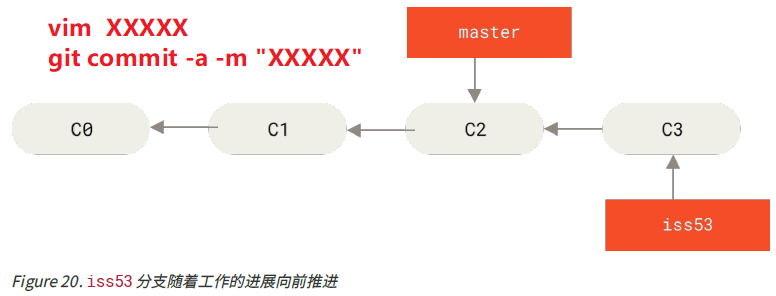
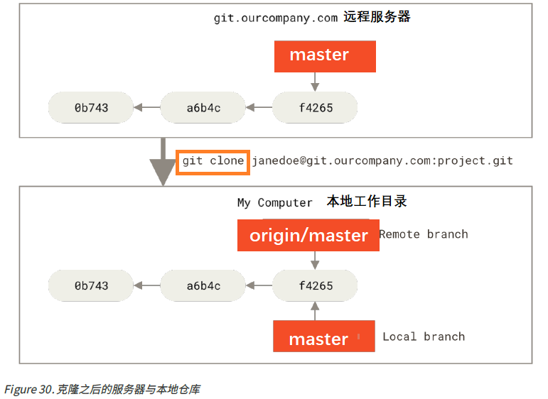
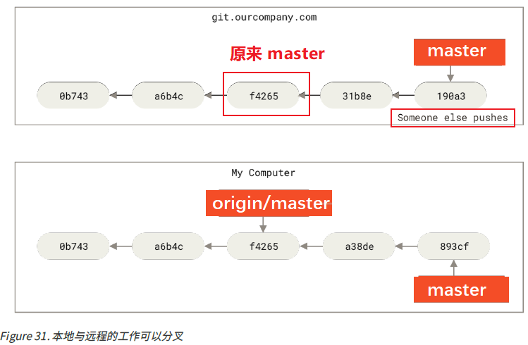
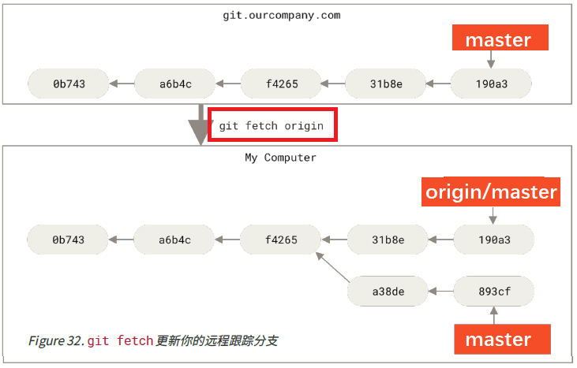

# ProGit

[TOC]

## 一、起步

### 初始运行 Git 前的配置

每台计算机上只需要配置一次，程序升级时会保留配置信息，可随时修改。

Git 自带一个 git config 的工具来帮助设置控制 Git 外观和行为的配置变量。 这些变量存储在三个不同的位
置：从下往上会：下一层级覆盖上一层级配置。

- `/etc/gitconfig` 文件: 包含系统上每一个用户及他们仓库的通用配置（是系统配置文件，需要管理员权限）。 **如果在执行 `git config` 时带上 `--system` 选项，那么它就会读写该文件中的配置变量**。 

- `~/.gitconfig` 或 `~/.config/git/config` 文件：只针对**当前用户**。 如果加上 `--global` 选项即对系统上 **所有** 的仓库生效。
  
- 当前使用仓库的 Git 目录中的 config 文件（即 `.git/config`）：针对该仓库。 你可以传递 `--local` 选项让 Git 强制读写此文件（默认使用）。 （需进入某个 Git 仓库中才能让该选项生效。）
    
    查看所有的配置以及它们所在的文件命令：`git config --list --show-origin`
    
    ```shell
    C:\Users\gjx16>git config --list --show-origin
    file:E:/Program/VersionControl/Git/etc/gitconfig        core.fscache=true
    .....
    file:C:/Users/gjx16/.gitconfig  user.name=GJXAIOU
    file:C:/Users/gjx16/.gitconfig  user.email=gjx1690048420@163.com
    ......
file:.git/config        core.repositoryformatversion=0
     remote.leetcode.url=https://github.com/GJXAIOU/LeetCode.git
    file:.git/config        remote.interviewexperience.fetch=+refs/heads/*:refs/remotes/interviewexperience/*
    ....
    ```

#### 设置用户信息

设置用户名和邮件地址，它们会写入到 Git 的每一次提交中，不可更改。不加 `--global` 为设置当前项目目录下的配置（实现各个项目配置信息可以都不同），加则是该系统上所有项目的配置。

```shell
git config --global user.name "GJXAIOU"
git config --global user.email gjxaiou@163.com
```

#### 设置文本编辑器

如果未配置，Git 会使用操作系统默认的文本编辑器来进行输入信息。

`git config --global core.editor "完整的安装路径"`

#### 检查配置信息

使用 `git config --list` 命令来列出所有 Git 当时能找到的配置。出现重复变量名因为可以在上述三个位置同时配置。 这种情况下，Git 会使用它找到的每一个变量的最后一个配置。如果想看是哪个文件修改了该值可以使用  `git config --show-origin <key>` 

```shell
$ git config --show-origin user.name
file:C:/Users/gjx16/.gitconfig  GJXAIOU
```

 `git config <key>`： 来检查 Git 的某一项配置值

#### 获取帮助

`命令  help` 或者 `命令 -h`， 如 `git config -h`

## 二、Git 基础

### 获取 Git 仓库

通常有两种获取 Git 项目仓库的方式：
- 将尚未进行版本控制的本地目录（已存在）转换为 Git 仓库：在项目目录下执行 `git init`。

    该命令将创建一个名为 .git 的子目录，这个子目录含有你初始化的 Git 仓库中所有的必须文件，这些文件是Git 仓库的骨干。 但这只是「初始化」，项目里的文件还没有被跟踪。

    如果在而非空文件夹中进行版本控制，应该使用 `git add`开始追踪这些文件并使用 `git commit `进行初始提交。

    现在，你已经得到了一个存在被追踪文件与初始提交的 Git 仓库。
    
- 从其它服务器 克隆 一个已存在的 Git 仓库。

    使用 `git clone  <url>`命令，或者 `git clone <url> 新的名字` 设置保存在本地项目名称，Git 克隆的是该 Git 仓库服务器上的几乎**所有数据**，默认配置下远程 Git 仓库中的**每一个文件的每一个版本**都将被拉取下来。


#### 记录每次更新到仓库

工作目录下的每一个文件只有两种状态：已跟踪 或 未跟踪。 已跟踪的文件是指那些被纳入了版本控制的文件，在上一次快照中有它们的记录，在工作一段时间后， 它们的状态可能是未修改，已修改或已放入暂存区。

工作目录中除已跟踪文件外的其它所有文件都属于未跟踪文件，它们既不存在于上次快照的记录中，也没有被放入暂存区。 初次克隆某个仓库的时候，工作目录中的所有文件都属于已跟踪文件，并处于未修改状态们。

编辑过某些文件之后，由于自上次提交后你对它们做了修改，Git 将它们标记为已修改文件。 在工作时，你可以择性地将这些修改过的文件放入暂存区，然后提交所有已暂存的修改，如此反复。


#### 检查当前文件状态

使用命令 `git status` 会显示当前所在分支，**「Untracked files」下面列出的文件就是未跟踪文件**，即 Git 之前的快照（提交）中没有这些文件。**「Changes to be committed」 下面表示为已暂存文件**，如果此时提交，那么该文件在**你运行 git add 时的版本**将被留存在后续的历史记录中。

#### 跟踪新文件

使用 `git add 文件名称` 开始跟踪该文件，如果将文件名称改为文件路径，会递归跟踪该目录下的所有文件。

#### 暂存已修改文件

修改一个已被跟踪的文件，使用 `git status` 显示该文件处于 「Changes not staged for commit」 下面，即已追踪文件发生修改但是没有放到暂存区。如果要暂存该次更新，使用 git add。该命令可以用它开
始跟踪新文件，或者把已跟踪的文件放到暂存区，还能用于合并时把有冲突的文件标记为已解决状态等，总的来说就是：精确的将内容添加到下一次提交中。

**注意** ：提交的时候，提交文件的版本是最后一次运行 `git add` 时的版本，而不是运行 `git commit` 时当前工作目录中的当前版本，所以运行 `git add` 之后又修改了该文件，需要重新运行 `git add` 将最新版本文件重新暂存起来才行。

可以使用 `git status -s` 或者使用 `git status --short` 来简化输出结果。

新添加的未跟踪文件前面有 ?? 标记，新添加到暂存区中的文件前面有 A 标记，修改过的文件前面有 M 标记。 输出中有两栏，左栏指明了暂存区的状态，右栏指明了工作区的状态。

```shell
$ git status -s
M README
MM Rakefile
A lib/git.rb
M lib/simplegit.rb
?? LICENSE.txt
上面的状态报告显示： README 文件
在工作区已修改但尚未暂存，而 lib/simplegit.rb 文件已修改且已暂存。 Rakefile 文件已修，暂存后又
作了修改，因此该文件的修改中既有已暂存的部分，又有未暂存的部分。
```

#### 忽略文件

无需纳入 Git 管理并且不希望其出现在未跟踪文件列表中。在创建的  `.gitignore` 文件，格式规划如下：

• 所有空行或者以 # 开头的行都会被 Git 忽略。
• 可以使用标准的 glob 模式匹配，它会递归地应用在整个工作区中。
• 匹配模式可以以（/）开头防止递归。
• 匹配模式可以以（/）结尾指定目录。
• 要忽略指定模式以外的文件或目录，可以在模式前加上叹号（!）取反。
所谓的 glob 模式是指 shell 所使用的简化了的正则表达式。 星号（*）匹配零个或多个任意字符；[abc] 匹配
任何一个列在方括号中的字符 （这个例子要么匹配一个 a，要么匹配一个 b，要么匹配一个 c）； 问号（?）只匹配一个任意字符；如果在方括号中使用短划线分隔两个字符， 表示所有在这两个字符范围内的都可以匹配（比如 [0-9] 表示匹配所有 0 到 9 的数字）。 使用两个星号（**）表示匹配任意中间目录，比如 a/**/z 可以匹配 a/z 、 a/b/z 或 a/b/c/z 等。

```shell
# 忽略所有的 .a 文件
*.a
# 但跟踪所有的 lib.a，即便你在前面忽略了 .a 文件
!lib.a
# 只忽略当前目录下的 TODO 文件，而不忽略 subdir/TODO
/TODO
# 忽略任何目录下名为 build 的文件夹
build/
# 忽略 doc/notes.txt，但不忽略 doc/server/arch.txt
doc/*.txt
# 忽略 doc/ 目录及其所有子目录下的 .pdf 文件
doc/**/*.pdf
```

各种语言推荐的 `.gitignore` 文件写法见 [Github](https://github.com/github/gitignore)。

#### 查看已暂存和未暂存的修改

git diff 命令用来解决这两个问题：当前做的哪些更新尚未暂存？ 有哪些更新已暂存并准备好下次提交？ 虽然 git status 已经通过在相应栏下列出文件名的方式回答了这个问题，但 git diff 能通过文件补丁的格式更加具体地**显示哪些行发生了改变**。

分别修改两个文件，一个使用`git add`暂存，一个不暂存。使用 status 查看就是一个在 「Changes to be committed」，一个在 「Changes not staged for commit」。

使用 `git diff` 比较工作目录中的当前文件和暂存区域快照之间的差异，即修改后还未暂存的变化内容。若要查看已暂存的将要添加到下次提交里的内容，可以用 git diff --staged 或者 `git diff --cached`命令。 这条命令将比对已暂存文件与最后一次提交的文件差异，**git diff 本身只显示尚未暂存的改动，而不是自上次提交以来所做的所有改动。**所以暂存之后在用就看不到差异了。

#### 提交更新

在每次提交之前使用 `git status` 查看是不是需要的文件都已经暂存了，然后在使用 `git commit`进行提交，这里会启动选择的文本编辑器进行提交说明。

提交之后会显示分支和本次提交的完整 SHA-1 完整校验和，有多少文件修改过，多少行添加和删除。

```shell
$ git commit -m "Feat:ProGit；增加 Git 笔记";
[refactor 51382d0] Feat:ProGit；增加 Git 笔记
 5 files changed, 235 insertions(+), 4 deletions(-)
```

#### 跳过使用暂存区域

使用 `git commit -a`，Git 会自动将所有已经跟踪过的文件暂存起来一并提交，从而跳过 `git add` 步骤。

#### 移除文件

如果要移除某个文件，需要从已跟踪的文件清单中移除（即从暂存区域移除），然后提交。使用 `git rm`操作的时候会连带从工作目录中删除指定的文件，则以后就不会出现在未跟踪文件清单中了。

如果手动使用 `rm` 将工作目录中文件删除，则使用 `git status` 则该文件就处于 「Changes not staged for  commit（未暂存清单）」中，则在使用 `git rm`删除该文件，则下一次提交的时候该文件就不再纳入版本管理了。如果要删除之前修改过或已经放到暂存区的文件，则必须使用
强制删除选项 -f（译注：即 force 的首字母）。 这是一种安全特性，用于防止误删尚未添加到快照的数据，这样的数据不能被 Git 恢复。

如果想将文件从 Git 仓库（包括暂存区）删除（不想让 Git 追踪），但是本地工作目录保留，使用 `git rm --cached`即可。同时 `git rm` 后面可以使用匹配模式。

#### 移动文件

命令为：`git mv 原File  新File`，想到于下面组合命令

```shell
mv 原File  新File
git rm 原File
git add 新File
```

### 查看提交历史

使用 `git log` 按照时间顺序列出所有提交（最近更新在最上方），会列出每个提交的 SHA-1 校验和、作者名字、邮箱、提交时间和提交说明。

常用选项：`-p` 或者 `--patch`  会显示每次提交说引入的差异。

`-数目`显示最近的指定数目的提交，可以和上面组合使用。

`-stat` 会显示每次提交的简略统计信息。会显示被修改过的文件名、有多少文件被修改了以及被修改过
的文件的哪些行被移除或是添加了。 在每次提交的最后还有一个总结。

`--name-only`：仅在提交信息后显示已修改的文件清单。

`--name-status`：显示新增、修改、删除的文件清单。

`--pretty`通过选项定制展示的方式，选项包括 online、short、full、fuller 、format 选项。其中 online 和 format 示例如下：

```shell
$ git log --pretty=oneline
51382d027d19ce4658a92b5ab07224cf22cf7287 (HEAD -> refactor) Feat:ProGit；增加 Git 笔记
fcaa89440c0e2ace2c08d5ebd9eb13dc9da6f0f0 (notes/refactor) Feat:Add Bugs Modulee
a3aa83a89a8e4a285fe4de91162f860a5ebeda97 MySQL 笔记更新
```

format 通过占位符来表示，常用占位符如下：

| 选项 | 说明 |
| ---- | ---- |
|%H  | 提交的完整哈希值|
|%h  | 提交的简写哈希值|
|%T | 树的完整哈希值|
|%t | 树的简写哈希值|
|%P | 父提交的完整哈希值|
|%p | 父提交的简写哈希值|
|%an | 作者名字：作者就是实际坐车修改的人 |
|%ae | 作者的电子邮件地址|
|%ad | 作者修订日期（可以用 --date=选项 来定制格式）|
|%ar | 作者修订日期，按多久以前的方式显示|
|%cn | 提交者的名字：将工作提交到仓库的人 |
|%ce | 提交者的电子邮件地址|
|%cd | 提交日期|
|%cr | 提交日期（距今多长时间）|
|%s | 提交|

```shell
$ git log --pretty=format:"%h - %an, %ar  : %s"
51382d0 - GJXAIOU, 3 hours ago  : Feat:ProGit；增加 Git 笔记
fcaa894 - GJXAIOU, 9 days ago  : Feat:Add Bugs Modulee
a3aa83a - gaojixu, 6 weeks ago  : MySQL 笔记更新
```

上面的 online 和 format  可以在后面追加 `--graph` 使用，更加直观

#### 限制日志输出长度

仍然针对 `git log`

限定时间：`–-since` 和 `–-until`，后面时间可以是 “2020-02-12”即具体的一天，也可以是类似 “2 years 1 day 3 minutes ago”即相对日期。例如`git log --since=2.weeks`

`–anthor`显示指定的作者提交，`--grep` 搜索提交说明中的关键字。这两个可以一次性指定多个，会任意匹配一个其中一个，如果都想匹配，再加上 `--all-match`。

`-S `接收一个字符串参数，即只显示那些添加或删除了该字符串的提交。如`git log -S  XXXXX`

指定只看某些文件或者某个目录的提交记录，在 `git log`所有选项最后加上 `  -- `然后加上路径名称或者文件名即可。

选项| 说明
---|----
-<n> |仅显示最近的 n 条提交。
--since, --after| 仅显示指定时间之后的提交。
--until, --before| 仅显示指定时间之前的提交。
--author |仅显示作者匹配指定字符串的提交。
--committer| 仅显示提交者匹配指定字符串的提交。
--grep |仅显示提交说明中包含指定字符串的提交。
-S |仅显示添加或删除内容匹配指定字符串的提交。

### 撤销操作

提交完了才发现漏掉了几个文件没有添加，或者提交信息写错了。 此时，可以运行带有 --amend 选
项的提交命令来重新提交：`git commit --amend`这个命令会将暂存区中的文件提交。 如果自上次提交以来你还未做任何修改（例如，在上次提交后马上执行了此命令）， 那么快照会保持不变，而你所修改的只是提交信息。

如果是忘记了暂存某些需要的修改，可以像如下操作，则最终只会有一个提交（第二个提交会代替第一个提交结果）

```shell
git commit -m "initial commit"
git add forgotten_file
git commit --amend
```

#### 取消暂存的文件 

已经通过 `git add` 暂存的问题怎么取消暂存：`git reset HEAD <File名称>`

#### 撤销对文件的修改

使用 `git checkout -- <File名称>` 来撤销之前所做的修改，「高危命令」，该命令会对文件在本地的任何修改都会消失，Git 会使用最近提交的版本覆盖掉它。

Git 中已提交的所有东西都可以恢复，甚至那些被删除的分支中的提交或使用 --amend 选项覆盖的提交也可以恢复。但是未提交的不行。

### 远程仓库的使用

使用 `git remote -v` 会显示需要读写远程仓库使用的 Git 保存的简写和对应的 URL，默认仓库名称为 origin

```shell
$ git remote -v
notes   https://github.com/GJXAIOU/Notes.git (fetch)
notes   https://github.com/GJXAIOU/Notes.git (push)
```

#### 添加远程仓库

`git remote add 自定义名称  仓库URL`，然后本地可以通过该「自定义名称」来代替「仓库 URL」。

#### 从远程仓库中抓取与拉取

使用 `git fetch 自定义名称或者仓库URL`，会访问远程仓库，从中拉取所有你还没有的数据。 执行完成后，你将会拥有那个远程仓库中所有分支的引用，可以随时合并或查看。

如果你使用 clone 命令克隆了一个仓库，命令会自动将其添加为远程仓库并默认以 “origin” 为简写。 所
以，git fetch origin 会抓取克隆（或上一次抓取）后新推送的所有工作。 必须注意 git fetch 命令只会
将数据下载到你的本地仓库——它并不会自动合并或修改你当前的工作。 当准备好时你必须手动将其合并入你的工作。
如果你的当前分支设置了跟踪远程分支（阅读下一节和 Git 分支 了解更多信息）， 那么可以用 git pull 命令
来自动抓取后合并该远程分支到当前分支。 这或许是个更加简单舒服的工作流程。默认情况下，git clone 命令会自动设置本地 master 分支跟踪克隆的远程仓库的 master 分支（或其它名字的默认分支）。 运行 git
pull 通常会从最初克隆的服务器上抓取数据并自动尝试合并到当前所在的分支。

#### 推送到远程仓库

`git push <remote> <branch>`，有克隆服务器的写入权限才能推动，同时需要先合并新提交的到本地才能提交自己的。

#### 查看某个远程仓库

`git remote show <remote>` 查看某一个远程仓库的更多信息。

```shell
$ git remote show notes;

* remote notes
  Fetch URL: https://github.com/GJXAIOU/Notes.git
  Push  URL: https://github.com/GJXAIOU/Notes.git
  HEAD branch: refactor
  Remote branches:
    master   tracked
    refactor tracked
  Local refs configured for 'git push':
    master   pushes to master   (up to date)
    refactor pushes to refactor (fast-forwardable)
```

#### 远程仓库重命名

`git remote rename 旧的名字  新的名字`，该操作也会修改你所有远程跟踪的分支名字，即 旧的名字/master 会变成 新的名字/master。

`git remote remove 分支名称`，移除一个仓库，会将该仓库相关的远程跟踪分支和所有配置信息一起删除。


### 打标签

#### 列出标签

`git tag`，可以加上 `--list`，结果是按照字母顺序显示，可以按照指定模式查找标签（该中必须加 `--list`），如查看 `v1.0` 系列，使用 `git tag --list "v1.0*"`。

#### 创建标签

支持两种标签：轻量级标签和附注标签。

- 轻量级标签像一个不会改变的分支——它只是某个特定提交的引用。轻量标签本质上是将提交校验和存储到一个文件中——没有保存任何其他信息【临时使用】

    轻量级标签创建方式： 直接使用 `git tag 标签`，同样通过下面的 show 命令看到信息比较简单。

- 【推荐】附注标签是存储在 Git 数据库中的一个完整对象（可被校验），其中包含打标签者的名字、电子邮件地址、日期时间， 此外还有一个标签信息，并且可以使用 GNU Privacy Guard （GPG）签名并验证。

    附注标签创建方式：`git tag -a `，同样可以加入 `-m` 选项来指定一条存储在标签中的信息。如`git tag -a v1.0 -m "this is my version 1.4"`

- 通过 `git show 标签名称`，查看指定标签的详细信息。

#### 后期补打标签

首先可以通过 `git log --pretty=oneline`查看提交历史，然后使用 `git tag -a 自定义标签名称  校验和（或者部分校验和）`，其中校验和就是提交历史每行第一部分内容。

#### 共享标签

默认的 `git push` 不会将标签推送到远程服务器，需要显示的推送 `git push <remote>  标签名称`。多个标签可以使用 `git push 分支名称 --tags`将所有不在远程仓库的标签全部推上去。

#### 删除标签

删除本地仓库标签：`git tag -d 分支名称`，如果想删除远程仓库中该标签，需要再次加上 `git push 仓库名称 :refs/tags/标签名称`：含义就是将 `:`前面的空值推送到远程标签名，从而实现删除。或者使用 `git push <remote> --delete 标签名称`

#### 检出标签

查看某个标签所指向的文件版本，使用 `git checkout 标签名称`，但是会使仓库处于「分离头指针」状态，该状态下如果做了某些更改然后提交他们，标签不会发生变化，但你的新的提交将不属于任何分支，并且无法访问，除非通过确切的提交哈希才能访问。因此，如果你需要进行更改，比如你要修复旧版本中的错误，那么通常需要创建一个新分支：`git checkout -b 新分支名称  标签名称`，如果在这之后又进行了一次提交，新分支就会因为这个改动向前移动， 此时它就会和该标签稍微有些不同，这时就要当心了。

### Git 别名

因为 Git 不会进行命令提示，所以可以通过 `git config`为命令设置别名。例如

```shell
git config --global alias.ci commit
git config --global alias.st status
git config --global alias.last  'log -1 HEAD'
```

则 `git commit` 可以使用 `git ci`替代，查找最后一次提交可以用 `git last`

## 三、Git  分支

### 分支简介

Git 保存数据保存的不是文件的变化或者差异，而是一系列不同时刻的**快照** 。

在进行提交操作时，Git 会保存一个**提交对象（commit object）**。该提交对象会包含一个指向暂存内容快照的指针、作者的姓名和箱、提交时输入的信息以及指向它的父对象的指针。 首次提交产生的提交对象没有父对象，普通提交操作产生的提交对象有一个父对象， **而由多个分支合并产生的提交对象有多个父对象**。

我们假设现在有一个工作目录，里面包含了三个将要被暂存和提交的文件。 暂存操作会为每一个文件计算校验和（使用 SHA-1 哈希算法），然后会**把当前版本的文件快照保存到 Git 仓库中 （Git 使用 blob 对象来保存它们）**，最终将校验和加入到暂存区域等待提交：

```shell
$ git add README test.rb LICENSE
$ git commit -m 'The initial commit of my project'
```

- 步骤一：当使用 `git commit` 进行提交操作时，Git 会先计算每一个子目录（本例中只有项目根目录）的校验和， 然后在 Git 仓库中将这些校验和保存为树对象。
- 步骤二：Git 创建一个提交对象， 它除了包含上面提到的那些信息外，还包含指向这个树对象（项目根目录）的指针。 因此 Git 就可以在需要的时候重现此次保存的快照。

此时 Git 仓库中有五个对象：三个 blob 对象（保存着文件快照）、一个 树 对象 （记录着目录结构和 blob 对象索引）以及一个 提交 对象（包含着指向前述树对象的指针和所有提交信息）。


做些修改后再次提交，那么这次产生的提交对象会包含一个指向上次提交对象（父对象）的指针。


**Git 分支本质上仅仅是指向提交对象的可变指针**。


#### 分支创建

创建分支本质是在**当前的提交对象上创建一个指针**，命令为：`git branch 新分支名称`。Git 通过 HAED 的特殊指针来确定当前在哪一个分支上，该指针指向当前所在的**本地分支**（可以将 HEAD 想象为当前分支的别名）。如果是在 master 分支上创建新的分支 testing，则上面命令执行完成之后 HEAD 指针仍然指向 master 分支，因为只是创建了分支，并没有切换。


可以使用 `git log --online(可选） --decorate`  查看每个分支当前所指的对象。

```shell
$ git log --oneline --decorate
f30ab (HEAD -> master, testing) add feature #32 - ability to add new
formats to the central interface
34ac2 Fixed bug #1328 - stack overflow under certain conditions
98ca9 The initial commit of my project
```

当前 master 和 testing 分支均指向校验和以 f30ab 开头的提交对象，HEAD 指针指向 master 分支。

如果想创建一个分支的同时切换过去使用 `git checkout -b 新分支名称`

#### 分支切换

使用 `git checkout 已存在分支名` 切换到一个已存在的分支，则 HEAD 指向切换后的分支。


如果修改文件之后再次使用 `git commit`进行提交之后，testing 分支向前移动，但是 master 分支没有移动，其仍然指向运行 git checkout 时所指的对象。


如果此时使用 `git checkout master` 切换为 master 分支之后，该命令首先使得 HEAD 指向了 master 分支，同时将工作目录恢复成 master 分支所指向的快照内容，即如果此时修改则项目开始于一个较旧的版本，即忽略 testing 分支的修改而向另一个方向修改。


如果此时修改某些文件并且提交了，相当于在 master 分支上进行了修改，两次改动是基于不同的分支的，形成了项目分叉。


使用 `git log --oneline --decorate --graph --all` 查看分叉历史，包括提交历史、各个分支指向以及项目的分支分叉情况。

```shell
$ git log --oneline --decorate --graph --all
* cb975df (HEAD -> refactor, notes/refactor) Feat:Git 基础知识
* 51382d0 Feat:ProGit；增加 Git 笔记
* 6790d6b Modify:修改 Dubbo 笔记
*   2c764c7 Refactor: 批量修改笔记结构
|\
| * 229de5e Refactor: RPC 笔记补充
| *   3142b8c Merge branch 'refactor' of https://github.com/GJXAIOU/Notes into refactor
| |\
| * | bb54c10 modify:Java8 新特性笔记修改完善
* | | f59a360 Refactor: 批量更新笔记结构
| |/
|/|
* | 6804154 Refactor:完成完善 Swagger 笔记
|/
* 2e3d476 Feat:Java8 修改
```

由于 **Git 的分支实质上仅是包含所指对象校验和（长度为 40 的 SHA-1 值字符串）的文件**，所以它的创建和销毁都异常高效。 创建一个新分支就相当于往一个文件中写入 41 个字节（40 个字符和 1 个换行符）。每次提交都会记录父对象。

### 分支的新建和合并

需求逻辑如下：

- 开发某个网站，为实现某个新的用户需求，创建一个分支。

- 在这个分支上开展工作。
- 正在此时，你突然接到一个电话说有个很严重的问题需要紧急修补。 你将按照如下方式来处理：
    - 切换到你的线上分支。
    - 为这个紧急任务新建一个分支，并在其中修复它。
    - 在测试通过之后，切换回线上分支，然后合并这个修补分支，最后将改动推送到线上分支。
    - 切换回你最初工作的分支上，继续工作。

实现步骤：

在 master 分支上做了一些修改，然后解决 #53 号问题需要新建并切换到该解决问题分支，然后在 #53 号问题上进行修改并且做了提交， 则 iss53 分支不断向前推进，即 HEAD 指针指向 iss53 分支。




现在需要解决一个线上突发问题，首先需要切换到 master 分支，但**切换前要留意你的工作目录和暂存区里那些还没有被提交的修改， 它可能会和你即将检出的分支产生冲突从而阻止 Git 切换到该分支**。 可以通过（暂存（stashing） 和 修补提交（commit amending），后续在「贮藏」和「清理」中介绍）解决。 

修改全部提交之后，使用 `git checkout master` 切换分支之后，此时工作目录和开始  #53 问题之前一样。因为当切换分支的时候， Git 会自动通过增删改重置工作目录，使其看起来像回到了你在那个分支上最后一次提交的样子。

创建新的分支 hotfix 并解决问题之后进行提交：


最后将该 hotfix 分支合并到 master 分支上从而部署到线上。

```shell
git checkout master
git merge hotfix
Updating f42c576..3a0874c
Fast-forward
index.html | 2 ++
1 file changed, 2 insertions(+)
```

合并结果中是「快进（Fast-forward）」 ：当合并两个分支时， 如果顺着一个分支走下去能够到达另一个分支，Git 直接将指针向前推进（指针右移）来实现合并【 hotfix 分支所指向的提交 C4 是提交 C2 的直接后继】，因为这种情况下的合并操作没有需要解决的分歧。此时最后的修改已经在 master 分支所指向的提交快照中。


修复紧急问题之后需要回到原来工作，首先删除   hotfix 分支（因为 master 分支已经指向同一位置，因此不在需要 hotfix 分支），然后切换到 iss53 继续修改。


你在 hotfix 分支上所做的工作并没有包含到 iss53 分支中。 如果你需要拉取 hotfix 所做的修改，你**可以使**
**用 git merge master 命令将 master 分支合并入 iss53 分支**，或者你也可以等到 iss53 分支完成其使命，
再将其合并回 master 分支。

#### 分支合并

将已经修正的 #53 号问题的 iss53 号分支合入  master 分支：

```shell
$ git checkout master
Switched to branch 'master'
$ git merge iss53
Merge made by the 'recursive' strategy.
index.html | 1 +
1 file changed, 1 insertion(+)
```

因为开发历史从一个更早的地方开始开叉（diverged），因此 master 分支所在的提交并不是 iss53 分支所在提交的直接祖先，**此时 Git 会使用两个分支末端所指的快照（C4 和 C5）以及这两个分支的公共祖先（C2）进行三方合并。**


和之前将分支指针向前推进所不同的是，Git 将此次三方合并的结果做了一个新的快照并且自动创建一个新的提交指向它。 这个被称作一次合并提交，它的特别之处在于他有不止一个父提交。同时因为修改已经合并进来了，所以可以使用 `git branch -d iss53`删除 iss53 分支。


#### 遇到冲突时的分支合并

即在两个分支中，对同一个文件的同一个部分进行了不同的修改，如 #53 号问题和 hotfix 分支的修改都涉及同一个文件的同一处，在合并它们的时候就出产生冲突。

```shell
$ git merge iss53
Auto-merging index.html
CONFLICT (content): Merge conflict in index.html
Automatic merge failed; fix conflicts and then commit the result.
```

此时 Git 做了合并，但是没有自动创建一个新的合并提交，Git 会暂停等待解决合并产生的冲突。使用 `git status` 命令来查看哪些因包含合并冲突而处于未合并（unmerged）状态的文件。

```shell
$ git status
On branch master
You have unmerged paths.
(fix conflicts and run "git commit")
Unmerged paths:
(use "git add <file>..." to mark resolution)
both modified: index.html
no changes added to commit (use "git add" and/or "git commit -a")
```

任何因包含合并冲突而有待解决的文件，都会以未合并状态标识出来。 Git 会在有冲突的文件中加入标准的冲突解决标记，这样你可以打开这些包含冲突的文件然后手动解决冲突。 出现冲突的文件会包含一些特殊区段，看起来像下面这个样子：

```shell
<<<<<<< HEAD:index.html
<div id="footer">contact : email.support@github.com</div>
=======
<div id="footer">
please contact us at support@github.com
</div>
>>>>>>> iss53:index.html
```

这表示 HEAD 所指示的版本（也就是你的 master 分支所在的位置，因为你在运行 merge 命令的时候已经检出到了这个分支）在这个区段的上半部分（`=======` 的上半部分），而 iss53 分支所指示的版本在 `=======` 的下半部分。 为了解决冲突，你必须选择使用由 `=======` 分割的两部分中的一个，或者你也可以自行合并这些内容。 例如，你可以通过把这段内容换成下面的样子来解决冲突：

```shell
<div id="footer">
please contact us at email.support@github.com
</div>
```

上述的冲突解决方案仅保留了其中一个分支的修改，并且 <<<<<<< , `=======` , 和 >>>>>>> 这些行被完全删除了。 在你解决了所有文件里的冲突之后，对每个文件使用 git add 命令来将其标记为冲突已解决。 一旦暂存这些原本有冲突的文件，Git 就会将它们标记为冲突已解决。

等你退出合并工具之后，Git 会询问刚才的合并是否成功。 如果你回答是，Git 会暂存那些文件以表明冲突已解决： 你可以再次运行 git status 来确认所有的合并冲突都已被解决：

如果你对结果感到满意，并且确定之前有冲突的的文件都已经暂存了，这时你可以输入 git commit 来完成合
并提交。 默认情况下提交信息看起来像下面这个样子：如果你觉得上述的信息不够充分，不能完全体现分支合并的过程，你可以修改上述信息， 添加一些细节给未来检视这个合并的读者一些帮助，告诉他们你是如何解决合并冲突的，以及理由是什么。

冲突的判断方式：https://segmentfault.com/a/1190000003966242

### 分支管理

直接运行 `git branch` 会得到当前所有分支列表。

```shell
$ git branch
  checkout
  master
* refactor   # 表示现在检出（HEAD 指针指向）的分支，如果有提交则该分支向前移动
```

查看每个分支的最后来一次提交信息使用 `git branch -v`。

- 选项一：`git branch --merged` 可以过滤上述列表中已经合并到当前分支的分支。

    查询结果中分支前面没有 `*`的分支通常可以删除，因为他们的工作已经整合到另一个分支中了。

- 选项二：`--no-merged` 可以过滤上述列表中尚未合并到当前分支的分支。

    因为该部分分支包含未提交的，所以只能通过 `-D` 来强制删除。

### 分支开发工作流

开发过程中不同分支具有不同的稳定性，当其具有一定的稳定性之后，再将其合并入具有更高级别稳定性的分支中。将其线性结构和流水线结构显示结果如下：


#### 主题分支

像上面的 iss53 和 hotfix 等为了一个小需求临时创建修改之后又删除的分支。

注意：新建和合并分支的时候，所有的操作都在本地 Git 版本库中，没有与服务器进行交互。

### 远程分支

远程引用是对远程仓库的引用（指针），包括分支、标签等等。可以使用 `git ls-remote <remote>` 或者 `git remote show <remote>` 来显式获取远程引用的完整列表和远程分支的更多信息。

远程跟踪分支是远程分支状态的引用。也是无法移动的本地引用，只有进行网络通信 Git 就会为用户移动他们以精确反映远程仓库的状态。可以将其看做书签，该分支在远程仓库中的位置就是你最后一次连接到他们的位置。

远程分支命名方式：`<remote>/<branch>` 。

示例：Git 的 clone 命令会自动将远程服务器命名为 origin，拉取它的所有数据， 创建一个指向它的 master 分支的指针（即本地名为 origin/master）。和指向同一个地方的本地 master 分支。



如本地 master 分支就行修改，在同一段时间内有其他人推送提交到远程服务器并更新了它的 master 分支，。**但是只要你保持不与 origin 服务器连接（并拉取数据），本地的 origin/master 指针就不会移动。**



使用 `git fetch <remote>` 与远程仓库同步数据，即从远程服务器中抓取本地没有的数据，并且更新本地数据库，然后移动 `<remote>/master`指针到更新之后的位置。



#### 推送

当你想要公开分享一个分支时（推送到远程仓库中），因为本地的分支不会自动与远程仓库同步（必须显式推送）。则可以把不愿意分享的内容放到私人分支上，而将需要和别人协作的内容推送到公开分支。

推送命令为：`git push <remote> <branch>`，如果本地和远程分支名称不同可以：`git push <remote> <localBranch>:<remoteBranch>`

> 如使用 `git push origin serverfix`， 则 Git 会自动将 `serverfix` 分支名称展开为 `refs/heads/serverfix:refs/heads/serverfix`，即推送本地的 `serverfix` 分支来更新远程仓库上的`serverfix` 分支。如果本地分支和远程名称不一致，可以使用 `git push origin serverfix:otherfix` 来将本地的 `serverfix` 分支推送作为远程的 `otherfix` 分支。

- 下一次其他协作者使用 `git fetch origin`从服务器上抓取数据时，他们会在本地生成一个远程分支 `origin/serverfix`，指向服务器的 `serverfix`分支的引用。但是本地不会自动生成一个新的 `serverfix` 分支，只有一个不可修改的 `origin/serverfix` 指针。【但是 master 会】。

- 如想将远程分支工作合到自己当前的分支：`git merge origin/serverfix`。

- 如自己也想有用于工作的 `serverfix` 分支，则使用 `git checkout -b serverfix  origin/serverfix`，并且起点位于 `origin/serverfix`。

#### 跟踪分支

从一个远程跟踪分支检出一个本地分支会自动创建所谓的“跟踪分支”（它跟踪的分支叫做“上游分支”）。
**跟踪分支是与远程分支有直接关系的本地分支**。 如果在一个跟踪分支上输入 `git pull`，Git 能自动地识别去哪个服务器上抓取、合并到哪个分支。

当克隆一个仓库时，它通常会自动地创建一个跟踪 origin/master 的 master 分支。当然可以自定义跟踪的仓库和分支：`git checkout -b <branch> <remote>/<branch>`  或者使用  `git checkout --track  <remote>/<branch>`。当然如果尝试检出的分支(a) 不存在且（b)刚好只有一个名字与之匹配的远程分支，则使用 `git checkout serverfix` 就会自动创建一个跟踪分支。如果本地分支和远程分支设置不同名称：`git checkout -b  localName  origin/serverfix`，则本地分支 localName 会自动从  origin/serverfix 拉取。

设置已有的本地分支跟踪一个刚刚拉取下来的远程分支，或者想要修改正在跟踪的上游分支， 你可以在任意时间使用 -u 或 --set-upstream-to 选项来显式地设置。`git branch -u origin/serverfix`

使用 `git branch -vv` 查看所有跟踪分支（本地分支）。包括每一个分支正在跟踪哪一个远程分支以及与本地分支是否有领先、落后或者都有。

```shell
$ git branch -vv
# iss53 在跟踪 origin/iss53， ahead 2 表示本地有 2 个提交还没有推送到服务器上
iss53 7e424c3 [origin/iss53: ahead 2] forgot the brackets
# 本地追踪远程，并且分支是最新的
master 1ae2a45 [origin/master] deploying index fix
# 领先 3 落后 1 即服务器上有 1 次提交没有合并并且本地有 3 次提交还没有推送。
* serverfix f8674d9 [teamone/server-fix-good: ahead 3, behind 1] this should do it
# testing 分支没有跟踪任何远程分支
testing 5ea463a trying something new
```

注：以上数据来源于从每个服务器上最后一次抓取数据，如果要获取最新先使用 `git fetch -all` 先拉取一下最新信息。

#### 拉取

`git fetch <remote>` 从远程主机服务器上拉取本地没有数据时候，**不会修改工作目录中的内容**。只会获取数据然后让用户自行合并。如果只想拉取某个特定分支数据：`get fetch <remote> <branchName>`。拉取下来之后可以通过 `git log -p FETCH_HEAD` 来查看拉取下来更新的数据信息，看有没有冲突。 但是 `git pull` 含义相当于 `git fetch` 加上 `git merge`，即查找当前分支所跟踪的服务器与分支，然后从服务器抓取数据之后尝试与本地指定分支合并。`git pull <remote>  <remoteBranch>:<localBranch>`，如果是与当前分支合并，则最后的 `:<localBranch>` 可以省略。


#### 删除远程分支

通常是通过远程分支已经完成所有合作功能并且将其合并到远程仓库的 master 之后，使用 `git push <remote> --delete  <分支名称>` 进行远程分支删除，该命令只是从服务器上移除这个指针，但是 Git  服务器通常保留数据一段时间直到垃圾回收，所以恢复较为容易。

### 变基（整合不同分支的修改方式之一）

整合来自不同分支的修改主要两种方法：`merge` 和 `rebase`。

#### 变基的基本操作

如果开发任务分叉到两个不同的分支，然后各自提交了更新，则在整合分支时候的方法：

- 方法一：使用 `merge`命令，会将两个分支的最新快照（C3）和 （C4）以及两者最近的共同祖先 C2 进行三方合并，合并的结果就是生成一个新的快照并提交。


- 方法二：**变基**：提取在 C4 中引入的补丁和修改，然后在 C3 的基础上应用一次。即使用 `rebase` 命令将提交到某一个分支上的所有修改都移至另一个分支上。

变基的实现步骤：首先将检出 `experiment` 分支，然后将其变基到 `master` 分支上。它的原理是首先找到这两个分支（即当前分支 experiment、变基操作的目标基底分支 master） 的最近共同祖先 C2，然后对比当前分支相对于该祖先的历次提交，提取相应的修改并存为临时文件， 然后将当前分支指向目标基底 C3, 最后以此将之前另存为临时文件的修改依序应用。最后切换为 master 分支，进行一次快进合并。


结果中 C4’ 指向的快照和之前 C5 指向的快照一样，但是经过变基的分支记录看起来是串行的，更加简洁。如向某个其他人维护的项目贡献代码时。 你首先在自己的分支里进行开发，当开发完成时你需要先将你的代码变基到origin/master 上，然后再向主项目提交修改。 这样的话，该项目的维护者就不再需要进行整合工作，只需要快进合并便可。

变基是将一系列提交按照原有次序依次应用到另一分支上，而合并是把最终结果合在一起。最终结果都一致。

#### 更有趣的变基例子。 P96 – 103


## 服务器上的 Git

架设公共的 git 服务器、选择服务器通讯协议，或者使用仓库托管服务器避免自己搭建和维护。

### 协议

#### 本地协议：Local

用于团队每个成员都可以访问一个共享的文件系统，其中远程版本就是同一台主机上的另一个目录。


## 分布式 Git （可以看一下）


## GitHub

### 账户的创建和配置

可以通过 https:// 协议访问，如果仅仅是 clone  甚至不需要注册。

如果使用  SSH 远程，需要配置一个公钥。

### 对项目作出贡献

首先对项目进行 Fork 进行派生，然后 GitHub 会在你的空间中创建一个完全属于你的项目副本，且你对其有推送权限。

通过这种方式，项目的管理者不再需要忙着把用户添加到贡献者列表并给予他们推送权限。 人们可以派生这个项目，将修改推送到派生出的项目副本中，并通过创建拉取请求（Pull Request，简称 PR）来让他们的改动进入源版本库。 创建了拉取请求后，就会开启一个可供审查代码的板块，项目的拥有者和贡献者可以在此讨论相关修改，直到项目拥有者对其感到满意，并且认为这些修改可以被合并到版本库。

流程通常如下：
1. 派生一个项目
2. 从 master 分支创建一个新分支
3. 提交一些修改来改进项目
4. 将这个分支推送到 GitHub 上
5. 创建一个拉取请求 Pull Request =》PR
6. 讨论，根据实际情况继续修改
7. 项目的拥有者合并或关闭你的拉取请求
8. 将更新后的 master 分支同步到你的派生中


### 保持项目最新

步骤一：切换到 master 分支上  `git checkout master`

步骤二：从原来克隆别人的仓库中拉取最新的  `git pull <remote>`

步骤三：将 master 分支推动到自己的远程仓库：`git push <remote> <branch>`

### 添加合作者

在 setting -> Collaborators 中输入用户名，使得别人拥有提交权限。


