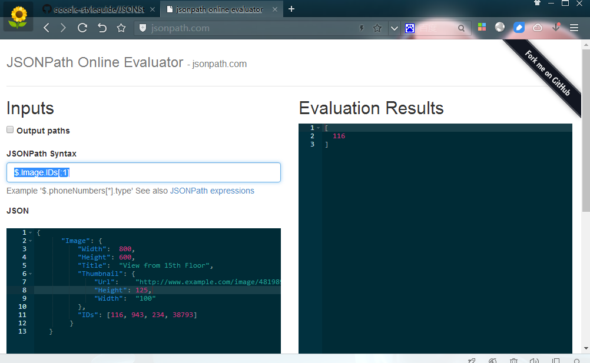
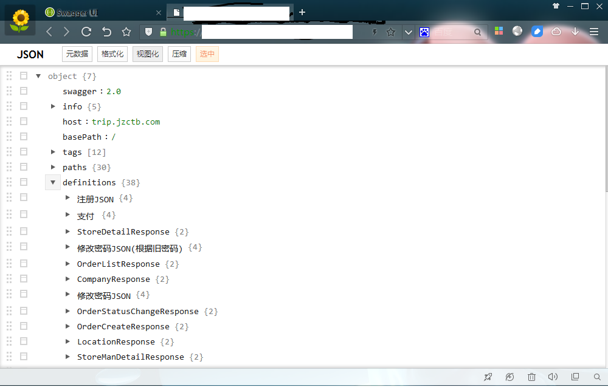
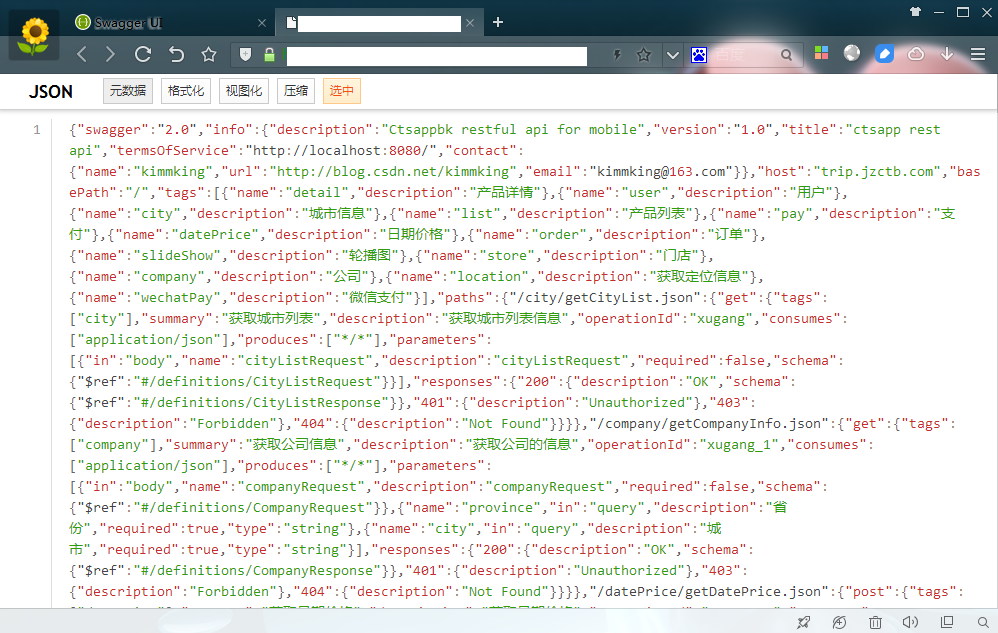
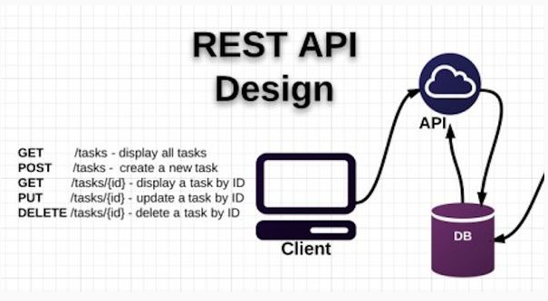
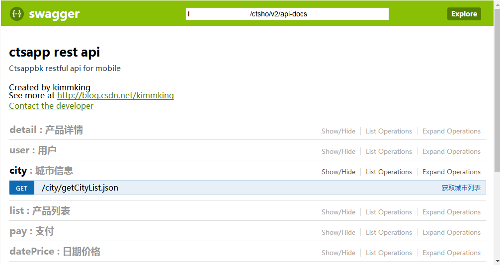

# 常见问题

## 新手指南

fastjson 是阿里巴巴的开源 JSON 解析库，它可以解析 JSON 格式的字符串，支持将 Java Bean 序列化为 JSON 字符串，也可以从JSON 字符串反序列化到 JavaBean。

### （一）fastjson 的优点

- 速度快

    fastjson 相对其他 JSON 库的特点是快，从 2011 年 fastjson 发布 1.1.x 版本之后，其性能从未被其他 Java 实现的 JSON 库超越。

- 使用广泛

    fastjson 在阿里巴巴大规模使用，在数万台服务器上部署，fastjson 在业界被广泛接受。在 2012 年被开源中国评选为最受欢迎的国产开源软件之一。

- 测试完备

    fastjson 有非常多的 testcase，在 1.2.11 版本中，testcase 超过 3321 个。每次发布都会进行回归测试，保证质量稳定。

- 使用简单

    fastjson 的 API 十分简洁。

    ```java
    String text = JSON.toJSONString(obj); //序列化
    VO vo = JSON.parseObject("{...}", VO.class); //反序列化
    ```

- 功能完备

    支持泛型，支持流处理超大文本，支持枚举，支持序列化和反序列化扩展。

### （二）下载和使用

- 方式一：直接下载 Jar 包

    Maven 仓库：https://repo1.maven.org/maven2/com/alibaba/fastjson/

- 方式二：配置 Maven 依赖

    ```xml
    <dependency>
        <groupId>com.alibaba</groupId>
        <artifactId>fastjson</artifactId>
        <version>x.x.x</version>
    </dependency>
    ```

### （三） android版本

fastjson 会不定期发布针对android版本优化的版本，android优化版本是去掉不必要的代码，减少体积，功能和标准版本基本一样。 已发布的android版本包括： http://repo1.maven.org/maven2/com/alibaba/fastjson/1.1.51.android/

## 一、常见问题

### （一）获得 fastjson

你可以通过如下地方下载fastjson:

- maven中央仓库: http://central.maven.org/maven2/com/alibaba/fastjson/
- Sourceforge.net : https://sourceforge.net/projects/fastjson/files/
- 在maven中如何配置fastjson依赖 fastjson最新版本都会发布到maven中央仓库，你可以直接依赖。

```xml
<dependency>
     <groupId>com.alibaba</groupId>
     <artifactId>fastjson</artifactId>
     <version> 1.2.76</version>
</dependency>
```

###  （二）fastjson主 要的 API 

fastjson入口类是 com.alibaba.fastjson.JSON，主要的 API 是 JSON.toJSONString 和 parseObject。

```java
package com.alibaba.fastjson;
public abstract class JSON {
      public static final String toJSONString(Object object);
      public static final <T> T parseObject(String text, Class<T> clazz, Feature... features);
}
```

序列化：

```java
String jsonString = JSON.toJSONString(obj);
```

反序列化：

```java
VO vo = JSON.parseObject("...", VO.class);
```

泛型反序列化：

```java
import com.alibaba.fastjson.TypeReference;

List<VO> list = JSON.parseObject("...", new TypeReference<List<VO>>() {});
```

### （三）fastjson的使用例子

fastjson的使用例子看这里：https://github.com/alibaba/fastjson/wiki/Samples-DataBind

### （四） fastjson 的性能

fastjson 是目前 java 语言中最快的 json 库，比自称最快的 jackson 速度要快，第三方独立测试结果看这里：https://github.com/eishay/jvm-serializers/wiki

自行做性能测试时，关闭循环引用检测的功能。

```
JSON.toJSONString(obj, SerializerFeature.DisableCircularReferenceDetect)
VO vo = JSON.parseObject("...", VO.class, Feature.DisableCircularReferenceDetect)
```

这里有jackson作者cowtowncoder等人对fastjson的性能评价：`https://groups.google.com/forum/#!searchin/java-serialization-benchmarking/fastjson|sort:date/java-serialization-benchmarking/uhUAOr1sqn0/5Y56nXKkpVIJ https://groups.google.com/forum/#!topic/java-serialization-benchmarking/8eS1KOquAhw`

fastjson 比 gson 快大约6倍，测试结果上这里：https://github.com/eishay/jvm-serializers/wiki/Staging-Results 。

### （五）fastjson可以运行在android上么？

fastjson有专门的for android版本，去掉不常用的功能。jar占的字节数更小。git branch地址是：https://github.com/alibaba/fastjson/tree/android 。

### （六） fastjson序列化的需要像json-lib一样配置java bean的序列化么？

不需要，fastjson的序列化和反序列化都不需要做特别配置，唯一的要求是，你序列化的类符合java bean规范。

### （七）fastjson如何处理日期

fastjson处理日期的API很简单，例如：

```java
JSON.toJSONStringWithDateFormat(date, "yyyy-MM-dd HH:mm:ss.SSS")
```

使用ISO-8601日期格式

```java
JSON.toJSONString(obj, SerializerFeature.UseISO8601DateFormat);
```

全局修改日期格式

```java
JSON.DEFFAULT_DATE_FORMAT = "yyyy-MM-dd";
JSON.toJSONString(obj, SerializerFeature.WriteDateUseDateFormat);
```

反序列化能够自动识别如下日期格式：

- ISO-8601日期格式
- yyyy-MM-dd
- yyyy-MM-dd HH:mm:ss
- yyyy-MM-dd HH:mm:ss.SSS
- 毫秒数字
- 毫秒数字字符串
- .NET JSON日期格式
- new Date(198293238)

### （八）如何定制序列化？

你可以使用SimplePrePropertyFilter过滤字段，详细看这里：[https://github.com/alibaba/fastjson/wiki/%E4%BD%BF%E7%94%A8SimplePropertyPreFilter%E8%BF%87%E6%BB%A4%E5%B1%9E%E6%80%A7](https://github.com/alibaba/fastjson/wiki/使用SimplePropertyPreFilter过滤属性)

关于定制序列化，详细的介绍看这里： [https://github.com/alibaba/fastjson/wiki/%E5%AE%9A%E5%88%B6%E5%BA%8F%E5%88%97%E5%8C%96](https://github.com/alibaba/fastjson/wiki/定制序列化)

### （九）当对象存在引用时，序列化后的结果浏览器不支持，怎么办？

使用SerializerFeature.DisableCircularReferenceDetect特性关闭引用检测和生成。例如：

```
String  jsonString = JSON.toJSONString(obj, SerializerFeature.DisableCircularReferenceDetect);
```

### （十） IE 6不支持JSON带中文字符串，要怎么处理？

fastjson提供了BrowserCompatible这个配置，打开之后，所有的中文都会序列化为\uXXXX这种格式，字节数会多一些，但是能兼容IE 6。

```
String  jsonString = JSON.toJSONString(obj, SerializerFeature.BrowserCompatible);
```

### （十一） fastjson 如何处理超大对象和超大JSON文本

fastjson提供了Stream API，详细看这里 https://github.com/alibaba/fastjson/wiki/Stream-api

### （十二）使用 @JSONField 定制序列化

fastjson提供了使用Annotation定制序列化和反序列化的功能。https://github.com/alibaba/fastjson/wiki/JSONField

### （十三） 将对象中的空值输出

缺省情况下fastjson不输出对象的空值的，如果你需要输出空值，看这里 https://github.com/alibaba/fastjson/wiki/WriteNull_cn

### （十四）返回较大整数 javascript 丢失精度问题

当返回的整数大于9007199254740991或者小于-9007199254740991时，在javascript中会丢失精度。此时使用SerializerFeature.BrowserCompatible能自动将数值变成字符串返回，解决精度问题。

## 三、最佳实践

### （一）JSON是什么

JSON 起源于 1999 年的[JS语言规范ECMA262的一个子集](http://javascript.crockford.com/)（即 15.12章节描述了格式与解析），后来2003年作为一个数据格式[ECMA404](http://www.ecma-international.org/publications/files/ECMA-ST/ECMA-404.pdf)发布。
2006年，作为[rfc4627](http://www.ietf.org/rfc/rfc4627.txt)发布，这时规范增加到 18 页，去掉没用的部分，十页不到。

JSON 的应用很广泛，这里有超过 100 种语言下的 JSON 库：[json.org](http://www.json.org/)。

更多的可以参考这里，[关于json的一切](https://github.com/burningtree/awesome-json)。

### （二）优缺点、标准与schema

#### 2.1 结构与类型

这估计是最简单标准规范之一：

- 只有两种结构：对象内的键值对集合结构和数组，对象用 `{}` 表示、内部是`"key":"value"`，数组用`[]`表示，不同值用逗号分开
- 基本数值有 7 个： false / null / true / object / array / number / string
- 再加上结构可以嵌套，进而可以用来表达复杂的数据
- 一个简单实例：

```json
{
   "Image": {
       "Width":  800,
       "Height": 600,
       "Title":  "View from 15th Floor",
       "Thumbnail": {
           "Url":    "http://www.example.com/image/481989943",
           "Height": 125,
           "Width":  "100"
       },
       "IDs": [116, 943, 234, 38793]
     }
}
```

#### 2.2 优点

- 基于纯文本，所以对于人类阅读是很友好的。
- 规范简单，所以容易处理，开箱即用，特别是 JS 类的 ECMA 脚本里是内建支持的，可以直接作为对象使用。
- 平台无关性，因为类型和结构都是平台无关的，而且好处理，容易实现不同语言的处理类库，可以作为多个不同异构系统之间的数据传输格式协议，特别是在 HTTP/REST 下的数据格式。

#### 2.3 缺点

缺点也很明显：

- 性能一般**，文本表示的数据一般来说比二进制大得多，在数据传输上和解析处理上都要更影响性能**。

- 缺乏 schema，跟同是文本数据格式的 XML 比，在类型的严格性和丰富性上要差很多。

    XML 可以借由 XSD 或 DTD 来定义复杂的格式，并由此来验证 XML 文档是否符合格式要求，甚至进一步的，可以基于 XSD 来生成具体语言的操作代码，例如 apache xmlbeans。并且这些工具组合到一起，形成一套庞大的生态，例如基于 XML 可以实现 SOAP 和 WSDL，一系列的 ws-* 规范。

    但是我们也可以看到 JSON 在缺乏规范的情况下，实际上有更大一些的灵活性，特别是近年来 REST 的快速发展，已经有一些schema 相关的发展(例如[理解JSON Schema](https://spacetelescope.github.io/understanding-json-schema/index.html)，[使用JSON Schema](http://usingjsonschema.com/downloads/)， [在线schema测试](http://azimi.me/json-schema-view/demo/demo.html))，也有类似于WSDL的[WADL](https://www.w3.org/Submission/wadl/)出现。

### （三）常用技术与工具

#### 3.1 相关技术以及与XML的关系

- 使用 JSON 实现 RPC（类似 XML-RPC）：[JSON-RPC](http://www.jsonrpc.org/)
- 使用 JSON 实现 path 查询操作（类似XML-PATH）：[JsonPATH](https://github.com/json-path/JsonPath)
- 在线查询工具：[JsonPATH](http://jsonpath.com/)

例如上面的示例 json，用表达式 `$.Image.IDs[:1]` 查询，得到 116：



我们看到 JSON 与 XML 是如此之像，实际上这两个格式可以看做一个是学院排，一个是平民派。一个对象从 POJO 转换成 XML与JSON 的过程，基本是一致的（绝大部分工作可以复用），10 年前我自己也做过一个基于 XML 的 RPC（http://code.google.com/p/rpcfx/），里面实现了 java 和 dotnet、JS 的 XML 序列化与反序列化，同时作为一个副产品，实现了JSON 序列化。

后来 thoughtsworks 公司出品的 XStream 就是同时做了 XML 与 JSON 的序列化。而创建 Jackson 库的组织本来叫 fasterxml，就是处理 xml 的。当然从这个角度来看，Fastjson 库，稍微改改也是一个高性能的 XML 序列化库。
只是 XML 有着更严格的结构，更丰富的工具生态，拿查询与操作来说，XML 还有 XQuery、XLST 等工具。处理方式上也有 DOM 方式与 SAX 流模式，这两个绝然不同的技术。

单从性能来考虑，XML更是有[VTD-XML](http://vtd-xml.sourceforge.net/)这种解决了DOM消耗太大内存与SAX只能单向每个节点读一次不能随机读的缺点的高性能处理方式。

#### 3.2 Java类库

- [Fastjson](https://github.com/alibaba/fastjson)
- [Jackson](http://wiki.fasterxml.com/JacksonHome)
- [Gson](https://github.com/google/gson)
- [Xstream](http://x-stream.github.io/)

#### 3.3 工具

- 格式化工具：[jsbeautifier](http://jsbeautifier.org/)
- chrome插件：[5个Json View插件](http://www.cnplugins.com/zhuanti/five-chrome-json-plugins.html)
- 在线Mock: [在线mock](https://www.easy-mock.com/)
- 其他Mock：[SoapUI](https://www.soapui.org/rest-testing-mocking/rest-service-mocking.html)可以支持，SwaggerUI也可以，[RestMock](https://github.com/andrzejchm/RESTMock)也可以。





### （四）JSON 编码指南

#### 4.1 Google JSON 风格指南

遵循好的设计与编码风格，能提前解决 80% 的问题:

- 英文版[Google JSON Style Guide](https://google.github.io/styleguide/jsoncstyleguide.xml)：https://google.github.io/styleguide/jsoncstyleguide.xml
- 中文版[Google JSON风格指南](https://github.com/darcyliu/google-styleguide/blob/master/JSONStyleGuide.md)：https://github.com/darcyliu/google-styleguide/blob/master/JSONStyleGuide.md

#### 4.2 使用JSON实现API

[JSON API](http://jsonapi.org.cn/format/)与 Google JSON 风格指南有很多可以相互参照之处。

[JSON API](http://jsonapi.org.cn/format/)是数据交互规范，用以定义客户端如何获取与修改资源，以及服务器如何响应对应请求。

JSON API 设计用来最小化请求的数量，以及客户端与服务器间传输的数据量。在高效实现的同时，无需牺牲可读性、灵活性和可发现性。

### （五） REST

todo list

- dubbox
- resteasy
- restlet
- jersey



### （六）SwaggerUI实现API文档管理与在线测试

todo list



### （七）JSON 使用场景分析

JSON 的使用，依据不同用途，有几个典型的场景：

- 内部后台系统之间的数据传输，此种情况下基于 HTTP 的 JSON 格式其实没有优势。

- 前后台之间的 API 调用，典型的是前端作为 React/VUE/AngularJS/ExtJS 等框架做的，前后端使用 JSON 交互。

    - 此时可以使用类似 Dubbox 之类的框架，或者原始一些 SpringMVC 的 Controller 上直接 @ResponseBody 或 @RestController。

    - 强烈建议在 Dubbox 之类的 rest 之上再加一个 Nginx 转发，这样一些策略的控制，比如同源的控制、简单的缓存策略、安全策略等都可以放到 Nginx 上来做，也利于多个机器时的负载均衡。

    - 建议使用 swaggerUI 来自动实现 API 文档和在线测试。功能很强大，操作简单，而且可以 mock 接口，在后台没有做好之前，前台就可以先开发了。

    - 可以使用 RestUnit 或 SoapUI 来实现自动化测试与压力测试。

- 提供给第三方的开发接口 API
    基本同上，可以参考 Google JSON 风格指南与 JSON API 章节。

### （八）JSON 的使用经验

最近在协助处理一些 Fastjson 的 bug 问题，发现最常见的其实是大家使用的不规范性，这样碰到各种坑的可能性就很大。根据我平时使用的经验，以及总结大家常见的问题，归纳如下：

#### 8.1 遵循 Java Beans 规范与 JSON 规范

实践告诉我们：遵循 beans 规范和 JSON 规范的方式，能减少大部分的问题，比如正确实现 setter、getter，用别名就加annotation。注意基本类型的匹配转换，比如在 fastjson 的 issue 见到试图把 `”{“a”:{}}”` 中的 a 转换成 List 的。

#### 8.2 使用正常的key

尽量不要使用数字等字符开头的 key，尽量使用符合 Java 的 class 或 property 命名规范的 key，这样会减少不必要的冲突。在jsonpath 或 js 里，`a.1` 可能会被解释成 `a[1]` 或 `a[“1”]`，这些都会带来不必要的麻烦。

#### 8.3 关于日期处理

如 Google JSON 风格指南所示，尽量使用标准的日期格式。或者序列化和反序列化里都是用同样的datePattern格式。

#### 8.4 自定义序列化与反序列化

对于新手来说，自定义序列化是一切罪恶的根源。

尽量不要使用自定义序列化，除非万不得已，优先考虑使用注解过滤，别名等方式，甚至是重新建一个 VO 类来组装实际需要的属性。使用自定义序列化时一切要小心，因为这样会导致两个问题：

- 改变了 `pojo <-> jsonstring` 的自然对应关系，从而不利于阅读代码和排查问题，你改变的关系无法简单的从 bean 和 json 上看出来了；
- 反序列化可能出错，因为对应不上原来的属性了。

如果只是序列化发出去（响应）的是 JSON 数据、传过来（请求）的数据格式跟 JSON 无关或者是标准的，此时自定义序列化就无所谓了，反正是要接收方来处理。

#### 8.5 JSONObject 的使用

JSONObject 是 JSON 字符串与 pojo 对象转换过程中的中间表达类型，实现了 Map 接口，可以看做是一个模拟 JSON 对象键值对再加上多层嵌套的数据集合，对象的每一个基本类型属性是 map 里的一个 key-value，一个非基本类型属性是一个嵌套的JSONObject 对象（key 是属性名称，value 是表示这个属性值的对象的 JSONObject）。如果以前用过 apache beanutils 里的DynamicBean 之类的，就知道 JSONObject 也是一种动态描述 Bean 的实现，相当于是拆解了 Bean 本身的结构与数据。这时候由于 JSONObject 里可能会没有记录全部的 Bean 类型数据，例如泛型的具体子类型之类的元数据，如果 JSONObject 与正常的 POJO混用，出现问题的概率较高。
下列方式尽量不要使用：

```java
public class TestBean{
    @Setter @Getter
    private TestBean1 testBean1;
    
    // 尽量不要在 POJO 里用 JSONObject
    @Setter @Getter
    private JSONObject testBean2; 
}
```

应该从设计上改为都用POJO比较合适：

```java
public class TestBean{
    @Setter @Getter
    private TestBean1 testBean1;
    
    // 使用 POJO
    @Setter @Getter
    private TestBean2 testBean2;
}
```

相对的，写一些临时性的测试代码，demo代码，可以直接全部用JSONObject先快速run起来。

同理，jsonstring 中嵌套 jsonstring 也尽量不要用，例如：

```javascript
{
    "name":"zhangsan",
    "score":"{\"math\":78,\"history\":82}"
}
```

应该改为全部都是JSON风格的结构：

```
{
    "name":"zhangsan",
    "score":{
        "math":78,
        "history":82
    }
}
```

另外，对于 jsonstring 转 POJO（或 POJO 转 jsonstring），尽量使用直接转的方式，而不是先转成 JSONObject 过渡的方式。特别是对于 Fastjson，由于性能优化的考虑，这两个执行的代码是不一样的，可能导致不一样的结果。

```java
String jsonstring = "{\"a\":12}";

// 不推荐这种方式
// 除非这里需要对jsonObject做一些简单处理
JSONObject jsonObject = JSON.parseObject(jsonstring);
A a = jsonObject.toJavaObject(A.class);

// 推荐方式
A a = JSON.parseObject(jsonstring, A.class);
```

#### 8.6 Hibernate相关问题

懒加载与级联，可能导致出现问题，例如hibernate，建议封装一层VO类型来序列化。使用VO类还有一个好处，就是可以去掉一些没用的属性，减少数据量，同时可以加上额外的属性。

#### 8.7 深层嵌套与泛型问题

尽量不要在使用过多的层次嵌套的同时使用泛型（List、Map等），可能导致类型丢失，而且问题比较难查。

#### 8.8 抽象类型与子类型问题

尽量不要在同一个Bean的层次结构里使用多个子类型对象，可能导致类型丢失，而且问题比较难查。当然我们可以通过代码显示的传递各种正确的类型，但是这样做引入了更多的不确定性。良好的做法应该是一开始设计时就避免出现这些问题。

#### 8.9 避免循环引用

尽量避免循环引用，这个虽然可以通过序列化特性禁掉，但是如果能避免则避免。

#### 8.10 注意编码和不可见字符

对于InputStream、OutputStream的处理，有时候会报一些奇怪的错误，not match之类的，这时候也许我们看日志里的json字符串可能很正常，但就是出错。

这时可能就是编码的问题了，可能是导致字符错乱，也可能是因为UTF-8文件的BOM头，这些潜在的问题可能在二进制数据转文本的时候，因为一些不可见字符无法显示，导致日志看起来只有正常字符而是正确的，问题很难排查。

处理办法就是按二进制的方式把Stream保存起来，然后按hex方式查看，看看是否有多余字符，或者其他错误。

### （九）fastjson的最佳实践

### 9.2 序列化一个对象成JSON字符串

```java
User user = new User();
user.setName("校长");
user.setAge(3);
user.setSalary(new BigDecimal("123456789.0123"));
String jsonString = JSON.toJSONString(user);
System.out.println(jsonString);
// 输出 {"age":3,"name":"校长","old":false,"salary":123456789.0123}
```

### 9.3 反序列化一个JSON字符串成Java对象

```java
String jsonString = "{\"age\":3,\"birthdate\":1496738822842,\"name\":\"校长\",\"old\":true,\"salary\":123456789.0123}";
User u = JSON.parseObject(jsonString ,User.class);
System.out.println(u.getName());
// 输出 校长

String jsonStringArray = "[{\"age\":3,\"birthdate\":1496738822842,\"name\":\"校长\",\"old\":true,\"salary\":123456789.0123}]";
List<User> userList = JSON.parseArray(jsonStringArray, User.class);
System.out.println(userList.size());
// 输出 1
```

### 9.4 日期格式处理

Fastjson 能识别下面这么多种日期格式的字符串：

```java
private final static String            defaultPatttern    = "yyyy-MM-dd HH:mm:ss";
private final static DateTimeFormatter defaultFormatter   = DateTimeFormatter.ofPattern(defaultPatttern);
private final static DateTimeFormatter formatter_dt19_tw  = DateTimeFormatter.ofPattern("yyyy/MM/dd HH:mm:ss");
private final static DateTimeFormatter formatter_dt19_cn  = DateTimeFormatter.ofPattern("yyyy年M月d日 HH:mm:ss");
private final static DateTimeFormatter formatter_dt19_cn_1  = DateTimeFormatter.ofPattern("yyyy年M月d日 H时m分s秒");
private final static DateTimeFormatter formatter_dt19_kr  = DateTimeFormatter.ofPattern("yyyy년M월d일 HH:mm:ss");
private final static DateTimeFormatter formatter_dt19_us  = DateTimeFormatter.ofPattern("MM/dd/yyyy HH:mm:ss");
private final static DateTimeFormatter formatter_dt19_eur = DateTimeFormatter.ofPattern("dd/MM/yyyy HH:mm:ss");
private final static DateTimeFormatter formatter_dt19_de  = DateTimeFormatter.ofPattern("dd.MM.yyyy HH:mm:ss");
private final static DateTimeFormatter formatter_dt19_in  = DateTimeFormatter.ofPattern("dd-MM-yyyy HH:mm:ss");

private final static DateTimeFormatter formatter_d8       = DateTimeFormatter.ofPattern("yyyyMMdd");
private final static DateTimeFormatter formatter_d10_tw   = DateTimeFormatter.ofPattern("yyyy/MM/dd");
private final static DateTimeFormatter formatter_d10_cn   = DateTimeFormatter.ofPattern("yyyy年M月d日");
private final static DateTimeFormatter formatter_d10_kr   = DateTimeFormatter.ofPattern("yyyy년M월d일");
private final static DateTimeFormatter formatter_d10_us   = DateTimeFormatter.ofPattern("MM/dd/yyyy");
private final static DateTimeFormatter formatter_d10_eur  = DateTimeFormatter.ofPattern("dd/MM/yyyy");
private final static DateTimeFormatter formatter_d10_de   = DateTimeFormatter.ofPattern("dd.MM.yyyy");
private final static DateTimeFormatter formatter_d10_in   = DateTimeFormatter.ofPattern("dd-MM-yyyy");

private final static DateTimeFormatter ISO_FIXED_FORMAT =
    DateTimeFormatter.ofPattern("yyyy-MM-dd HH:mm:ss").withZone(ZoneId.systemDefault());

private final static String formatter_iso8601_pattern     = "yyyy-MM-dd'T'HH:mm:ss";
private final static DateTimeFormatter formatter_iso8601  = DateTimeFormatter.ofPattern(formatter_iso8601_pattern);
```

默认序列化 Date 输出使用 `"yyyy-MM-dd HH:mm:ss"`格式，可以用 UseISO8601DateFormat 特性换成 `"yyyy-MM-dd’T’HH:mm:ss"`格式。

```java
JSON.defaultTimeZone = TimeZone.getTimeZone("Asia/Shanghai");
JSON.defaultLocale = Locale.US;

public static class Model {
    @JSONField(format = "MMM dd, yyyy h:mm:ss aa")
    private java.util.Date date;

    public java.util.Date getDate() {
        return date;
    }

    public void setDate(java.util.Date date) {
        this.date = date;
    }

    @JSONField(format = "MMM-dd-yyyy h:mm:ss aa")
    public java.sql.Date date2;
}
```

### 9.5 常见序列化特性的使用

Fastjson 的序列化特性定义在枚举类 `com\alibaba\fastjson\serializer\SerializerFeature.java` 中，目前正好有 30 项。
可以通过设置多个特性到 FastjsonConfig 中全局使用，也可以在某个具体的 `JSON.writeJSONString` 时作为参数使用。

- QuoteFieldNames, //key使用引号
- UseSingleQuotes, //使用单引号
- WriteMapNullValue, //输出Map的null值
- WriteEnumUsingToString, //枚举属性输出toString的结果
- WriteEnumUsingName, //枚举数据输出name
- UseISO8601DateFormat, //使用日期格式
- WriteNullListAsEmpty, //List为空则输出[]
- WriteNullStringAsEmpty, //String为空则输出””
- WriteNullNumberAsZero, //Number类型为空则输出0
- WriteNullBooleanAsFalse, //Boolean类型为空则输出false
- SkipTransientField,
- SortField, //排序字段
- WriteTabAsSpecial,
- PrettyFormat, // 格式化JSON缩进
- WriteClassName, // 输出类名
- DisableCircularReferenceDetect, // 禁止循环引用
- WriteSlashAsSpecial, // 对斜杠’/’进行转义
- BrowserCompatible,
- WriteDateUseDateFormat, // 全局修改日期格式,默认为false。JSON.DEFFAULT_DATE_FORMAT = “yyyy-MM-dd”;JSON.toJSONString(obj, SerializerFeature.WriteDateUseDateFormat);
- NotWriteRootClassName,
- DisableCheckSpecialChar,
- BeanToArray,
- WriteNonStringKeyAsString,
- NotWriteDefaultValue,
- BrowserSecure,
- IgnoreNonFieldGetter,
- WriteNonStringValueAsString,
- IgnoreErrorGetter,
- WriteBigDecimalAsPlain,
- MapSortField

使用示例如下（可以[参见此处](http://blog.csdn.net/u010246789/article/details/52539576)）：

```java
package com.gjxaiou.joda;

import com.alibaba.fastjson.JSON;
import com.alibaba.fastjson.serializer.SerializerFeature;
import lombok.Data;

import java.util.Date;

public class Demo {
    public static void main(String[] args) {
        Word word = new Word();
        word.setA("a");
        word.setB(2);
        word.setC(true);
        word.setD("d");
        word.setE("");
        word.setF(null);
        word.setDate(new Date());

        System.out.println(JSON.toJSONString(word));
        System.out.println(JSON.toJSONString(word, SerializerFeature.PrettyFormat,
                SerializerFeature.WriteMapNullValue, SerializerFeature.WriteNullStringAsEmpty,
                SerializerFeature.DisableCircularReferenceDetect,
                SerializerFeature.WriteNullListAsEmpty));
    }
}

@Data
class Word {
    String a;
    Integer b;
    Boolean c;
    String d;
    String e;
    String f;
    Date date;
}
```

输出结果：

```json
{"a":"a","b":2,"c":true,"d":"d","date":1637401180959,"e":""}
{
	"a":"a",
	"b":2,
	"c":true,
	"d":"d",
	"date":1637401180959,
	"e":"",
	"f":""
}
```

#### 9.6 Annotation 注解的使用

- JSONField

    可以配置在属性（setter、getter）和字段（必须是 public field）上。
    详情参见此处：[JSONField用法](https://github.com/alibaba/fastjson/wiki/JSONField)

```java
package com.alibaba.fastjson.annotation;

public @interface JSONField {
    // 配置序列化和反序列化的顺序，1.1.42版本之后才支持
    int ordinal() default 0;

     // 指定字段的名称
    String name() default "";

    // 指定字段的格式，对日期格式有用
    String format() default "";

    // 是否序列化
    boolean serialize() default true;

    // 是否反序列化
    boolean deserialize() default true;
}
@JSONField(name="ID")
public int getId() {return id;}

// 配置date序列化和反序列使用yyyyMMdd日期格式
@JSONField(format="yyyyMMdd")
public Date date1;  

 // 不序列化
 @JSONField(serialize=false)
 public Date date2;

 // 不反序列化
 @JSONField(deserialize=false)
 public Date date3;

 // 按ordinal排序
 @JSONField(ordinal = 2)
 private int f1;

 @JSONField(ordinal = 1)
 private int f2;
```

- JSONType

    - 自定义序列化：[ObjectSerializer](https://github.com/alibaba/fastjson/wiki/JSONType_serializer)

    - 子类型处理：[SeeAlso](https://github.com/alibaba/fastjson/wiki/JSONType_seeAlso_cn)

    - JSONType.alphabetic属性: fastjson缺省时会使用字母序序列化，如果你是希望按照java fields/getters的自然顺序序列化，可以配置JSONType.alphabetic，使用方法如下：

        ```java
        @JSONType(alphabetic = false)
        public static class B {
            public int f2;
            public int f1;
            public int f0;
        }
        ```

### 9.7 自定义序列化与反序列化

- 自定义序列化：只需要2步：[参见此处](https://github.com/alibaba/fastjson/wiki/ObjectSerializer_cn)

    - 实现 ObjectSerializer

        ```java
        public class CharacterSerializer implements ObjectSerializer {
            public void write(JSONSerializer serializer, 
                              Object object, 
                              Object fieldName, 
                              Type fieldType, 
                              int features) throws IOException {
                SerializeWriter out = serializer.out;
            
                Character value = (Character) object;
                if (value == null) {
                    out.writeString("");
                    return;
                }
            
                char c = value.charValue();
                if (c == 0) {
                    out.writeString("\u0000");
                } else {
                    out.writeString(value.toString());
                }
            }
        }
        ```

    - 注册ObjectSerializer

        `SerializeConfig.getGlobalInstance().put(Character.class, new CharacterSerializer());`

- 自定义反序列化：只需要2步：[参见此处](https://github.com/alibaba/fastjson/wiki/ObjectDeserializer_cn)

    - 自定义实现 ObjectDeserializer

        ```java
        public static enum OrderActionEnum {
            FAIL(1), SUCC(0);
        
            private int code;
        
            OrderActionEnum(int code){
                this.code = code;
            }
        }
        
        public static class Msg {
        
            public OrderActionEnum actionEnum;
            public String          body;
        }
        
        public static class OrderActionEnumDeser implements ObjectDeserializer {
        
            @SuppressWarnings("unchecked")
            @Override
            public <T> T deserialze(DefaultJSONParser parser, Type type, Object fieldName) {
                Integer intValue = parser.parseObject(int.class);
                if (intValue == 1) {
                    return (T) OrderActionEnum.FAIL;
                } else if (intValue == 0) {
                    return (T) OrderActionEnum.SUCC;
                }
                throw new IllegalStateException();
            }
        
            @Override
            public int getFastMatchToken() {
                return JSONToken.LITERAL_INT;
            }
        
        }
        ```

    - 注册并使用ObjectDeserializer

        ```java
        ParserConfig.getGlobalInstance().putDeserializer(OrderActionEnum.class, new OrderActionEnumDeser());
        
        {
            Msg msg = JSON.parseObject("{\"actionEnum\":1,\"body\":\"A\"}", Msg.class);
            Assert.assertEquals(msg.body, "A");
            Assert.assertEquals(msg.actionEnum, OrderActionEnum.FAIL);
        }
        {
            Msg msg = JSON.parseObject("{\"actionEnum\":0,\"body\":\"B\"}", Msg.class);
            Assert.assertEquals(msg.body, "B");
            Assert.assertEquals(msg.actionEnum, OrderActionEnum.SUCC);
        }
        ```

        

### 9.8 自定义序列化之过滤器

- 全局的过滤器：JSON.toJSONString方法的参数中可以配置处理所有类型的SerializeFilter
- 类级别过滤器：[Class_Level_SerializeFilter](https://github.com/alibaba/fastjson/wiki/Class_Level_SerializeFilter)
- 属性过滤器：[使用PropertyPreFilter过滤属性](https://github.com/alibaba/fastjson/wiki/使用SimplePropertyPreFilter过滤属性)
- 多余字段处理器：[ExtraProcessor 用于处理多余的字段、
    ExtraTypeProvider用于处理多余字段时提供类型信息](https://github.com/alibaba/fastjson/wiki/ParseProcess)
- 定制反序列化：[在fastjson-1.2.9版本后提供了ExtraProcessable接口，用于定制对象的反序列化功能](https://github.com/alibaba/fastjson/wiki/ExtraProcessable)，可用于添加没有的字段
- 标签过滤：[JSONField(label)，相当于分组](https://github.com/alibaba/fastjson/wiki/LabelFilter)
- 自动识别嵌套对象子类型：[FieldTypeResolver](https://github.com/alibaba/fastjson/wiki/FieldTypeResolver)

### 9.9 与Spring MVC的配合使用

FastJson 提供了Spring MVC HttpMessageConverter的实现，将POJO输出为JSONP，支持跨域数据访问。

FastJsonpHttpMessageConverter4 for Spring MVC 4.2+：

```
<mvc:annotation-driven>
    <mvc:message-converters>
        <bean
            class="com.alibaba.fastjson.support.spring.FastJsonpHttpMessageConverter4">
            <property name="supportedMediaTypes">
                <list>
                    <value>application/json;charset=UTF-8</value>
                </list>
            </property>
        </bean>
    </mvc:message-converters>
</mvc:annotation-driven>

<mvc:default-servlet-handler />

<bean id="fastJsonpResponseBodyAdvice" class="com.alibaba.fastjson.support.spring.FastJsonpResponseBodyAdvice">
    <constructor-arg>
        <list>
            <value>callback</value>
            <value>jsonp</value>
        </list>
    </constructor-arg>
</bean>
```

[详细配置参见此处](https://github.com/alibaba/fastjson/wiki/FastJsonpHttpMessageConverter4_CN)

### 9.10 与Spring Boot的集成使用

参见此处：[spring-boot-starter-fastjson](https://github.com/storezhang/utils/tree/master/spring-boot-starter-fastjson)

### 9.11 泛型处理

[在fastjson中提供了一个用于处理泛型反序列化的类TypeReference](https://github.com/alibaba/fastjson/wiki/Typ)eReference

### 9.12jaxrs支持

FastJson 提供了JAX-RS Provider的实现 [FastJsonProvider](https://github.com/alibaba/fastjson/wiki/FastJsonProvider_CN)

可用于在构建Restful服务时使用FastJson进行数据的Serialize and Deserialize

### 9.13 swagger支持

[增加对swagger的支持](https://github.com/alibaba/fastjson/pull/716)
[dubbox与swagger的集成](https://github.com/kimmking/kk/blob/master/technotes/dubbo-integration-swagger.md)

### 9.14 默认参数配置

1）序列化

```
public static int DEFAULT_GENERATE_FEATURE;
  static {
      int features = 0;
        features |= SerializerFeature.QuoteFieldNames.getMask(); // key用引号引起来
        features |= SerializerFeature.SkipTransientField.getMask(); // 忽略transient
        features |= SerializerFeature.WriteEnumUsingName.getMask(); // enum输出name
        features |= SerializerFeature.SortField.getMask();          // 字段排序

      {
          String featuresProperty = IOUtils.getStringProperty("fastjson.serializerFeatures.MapSortField");
          int mask = SerializerFeature.MapSortField.getMask();
          if ("true".equals(featuresProperty)) {
              features |= mask;
          } else if ("false".equals(featuresProperty)) {
              features &= ~mask;
          }
      }

      DEFAULT_GENERATE_FEATURE = features;
  }
```

2）反序列化

```
static {
        int features = 0;
        features |= Feature.AutoCloseSource.getMask();//检查json格式
        features |= Feature.InternFieldNames.getMask();//
        features |= Feature.UseBigDecimal.getMask(); //数值使用BigDecimal
        features |= Feature.AllowUnQuotedFieldNames.getMask();//支持key不用引号引起来
        features |= Feature.AllowSingleQuotes.getMask();//支持单引号
        features |= Feature.AllowArbitraryCommas.getMask();//支持连续多个逗号
        features |= Feature.SortFeidFastMatch.getMask();//排序后快速匹配
        features |= Feature.IgnoreNotMatch.getMask();//忽略不匹配的属性和字段
        DEFAULT_PARSER_FEATURE = features;
    }
```

更多功能 todo list

## 10.Fastjson的设计说明

todo list

1. 为什么fastjson这么快：[fastjson内幕](http://wenshao.iteye.com/blog/1142031/)
2. 代码是怎么样的：[源码分析](http://blog.csdn.net/swust_chenpeng/article/details/19617561)
3. fastjson里的各种对象：[概念分析](http://www.csdn.net/article/2014-09-25/2821866)
4. fastjson与安全：[fastjson远程代码执行漏洞技术分析与防护方案](http://blog.nsfocus.net/analysis-protection-fastjson-remote-code-execution-vulnerability/)，建议直接升级到1.2.28/1.2.29或者更新版本来保证系统安全
5. [json ref方式的讨论](http://wenshao.iteye.com/blog/1146897)
6. fastjson为什么这么有保障，答案是有3837个testcase： mvn test => Tests run: 3837, Failures: 0, Errors: 0, Skipped: 0