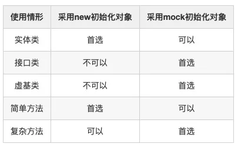

# Java单元测试技巧之JSON序列化

## **一 前言**

《论语》中孔子有言：“工欲善其事，必先利其器。”

今年7月，作者迎接更大的挑战，接手并维护了几个Java后端项目。在熟悉业务和代码的过程中，快速地对原有项目进行单元测试用例的补充，使其单元测试覆盖率达到70%+甚至于100%。有同事问我：“你写单元测试为什么这么快？”我微微一笑：“工欲善其事，必先利其器。而我快速编写Java单元测试用例的技巧就是——JSON序列化。”

是的，做任何事情，都要讲究方式方法；只要方式方法对了，就会事半功倍。这里，作者系统性地总结了JSON序列化在编写Java单元测试用例中的使用技巧，希望能够让大家“读有所得、得有所思、思有所获”。

## 1 冗长的单元测试代码

在编写单元测试用例的过程中，经常会出现以下冗长的单元测试代码。

### **冗长的数据模拟代码**

#### 1）模拟类属性值

在模拟类属性值时，会遇到以下的冗长代码：

```java
Map<Long, String> languageMap = new HashMap<>(MapHelper.DEFAULT);
languageMap.put(1L, "Java");
languageMap.put(2L, "C++");
languageMap.put(3L, "Python");
languageMap.put(4L, "JavaScript");
... // 约几十行
Whitebox.setInternalState(developmentService, "languageMap", languageMap);
```

#### 2）模拟方法参数值

在模拟方法参数值时，会遇到以下的冗长代码：

```java
List<UserCreateVO> userCreateList = new ArrayList<>();
UserCreateVO userCreate0 = new UserCreateVO();
userCreate0.setName("Changyi");
userCreate0.setTitle("Java Developer");
... // 约几十行
userCreateList.add(userCreate0);
UserCreateVO userCreate1 = new UserCreateVO();
userCreate1.setName("Tester");
userCreate1.setTitle("Java Tester");
... // 约几十行
userCreateList.add(userCreate1);
... // 约几十条
userService.batchCreate(userCreateList);
```

#### 3）模拟方法返回值

在模拟方法返回值时，会遇到以下的冗长代码：

```java
Long companyId = 1L;
List<UserDO> userList = new ArrayList<>();
UserDO user0 = new UserDO();
user0.setId(1L);
user0.setName("Changyi");
user0.setTitle("Java Developer");
... // 约几十行
userList.add(user0);
UserDO user1 = new UserDO();
user1.setId(2L);
user1.setName("Tester");
user1.setTitle("Java Tester");
... // 约几十行
userList.add(user1);
... // 约几十条
Mockito.doReturn(userList).when(userDAO).queryByCompanyId(companyId);
```

### **冗长的数据验证代码**

#### 1）验证方法返回值

在验证方法返回值时，会遇到以下的冗长代码：

```java
Long companyId = 1L;
List<UserVO> userList = userService.queryByCompanyId(companyId);
UserVO user0 = userList.get(0);
Assert.assertEquals("name不一致", "Changyi", user0.getName());
Assert.assertEquals("title不一致", "Java Developer", user0.getTitle());
... // 约几十行
UserVO user1 = userList.get(1);
Assert.assertEquals("name不一致", "Tester", user1.getName());
Assert.assertEquals("title不一致", "Java Tester", user1.getTitle());
... // 约几十行
... // 约几十条
```

#### 2）验证方法参数值

在验证方法参数值时，会遇到以下的冗长代码：

```java
ArgumentCaptor<List<UserDO>> userCreateListCaptor = CastUtils.cast(ArgumentCaptor.forClass(List.class));
Mockito.verify(userDAO).batchCreate(userCreateListCaptor.capture());
List<UserDO> userCreateList = userCreateListCaptor.getValue();
UserDO userCreate0 = userCreateList.get(0);
Assert.assertEquals("name不一致", "Changyi", userCreate0.getName());
Assert.assertEquals("title不一致", "Java Developer", userCreate0.getTitle());
... // 约几十行
UserDO userCreate1 = userCreateList.get(1);
Assert.assertEquals("name不一致", "Tester", userCreate1.getName());
Assert.assertEquals("title不一致", "Java Tester", userCreate1.getTitle());
... // 约几十行
... // 约几十条
```

## 2 采用JSON序列化简化

常言道：“眼见为实，耳听为虚。”下面，就通过JSON序列化来简化上面的单元测试用例代码，让大家先睹为快。

### **简化数据模拟代码**

对于数据模拟，首先需要先加载JSON资源文件为字符串，然后通过JSON反序列化字符串为数据对象，最后用于模拟类属性值、方法参数值和方法返回值。这样，就精简了原来冗长的赋值语句。

#### 1）模拟类属性值

利用JSON反序列化，简化模拟类属性值代码如下：

```java
String text = ResourceHelper.getResourceAsString(getClass(), path + "languageMap.json");
Map<Long, String> languageMap = JSON.parseObject(text, new TypeReference<Map<Long, String>>() {});
Whitebox.setInternalState(mobilePhoneService, "languageMap", languageMap);
```

其中，JSON资源文件languageMap.json的内容如下：

```java
{1:"Java",2:"C++",3:"Python",4:"JavaScript"...}
```


#### 2）模拟方法参数值

利用JSON反序列化，简化模拟方法参数值代码如下：

```java
String text = ResourceHelper.getResourceAsString(getClass(), path + "userCreateList.json");
List<UserCreateVO> userCreateList = JSON.parseArray(text, UserCreateVO.class);
userService.batchCreate(userCreateList);
```

其中，JSON资源文件userCreateList.json的内容如下：

```java
[{"name":"Changyi","title":"Java Developer"...},{"name":"Tester","title":"Java Tester"...},...]
```

#### 3）模拟方法返回值

利用JSON反序列化，简化模拟方法返回值代码如下：

```java
Long companyId = 1L;
String text = ResourceHelper.getResourceAsString(getClass(), path + "userList.json");
List<UserDO> userList = JSON.parseArray(text, UserDO.class);
Mockito.doReturn(userList).when(userDAO).queryByCompanyId(companyId);
```

其中，JSON资源文件userList.json的内容如下：

```java
[{"id":1,"name":"Changyi","title":"Java Developer"...},{"id":2,"name":"Tester","title":"Java Tester"...},...]
```

### **简化数据验证代码**

对于数据验证，首先需要先加载JSON资源文件为字符串，然后通过JSON序列化数据对象为字符串，最后验证两字符串是否一致。这样，就精简了原来冗长的验证语句。

#### 1）验证方法返回值

利用JSON序列化，简化验证方法返回值代码如下：

```java
Long companyId = 1L;
List<UserVO> userList = userService.queryByCompanyId(companyId);
String text = ResourceHelper.getResourceAsString(getClass(), path + "userList.json");
Assert.assertEquals("用户列表不一致", text, JSON.toJSONString(userList));
```

其中，JSON资源文件userList.json的内容如下：

```java
[{"name":"Changyi","title":"Java Developer"...},{"name":"Tester","title":"Java Tester"...},...]
```


#### 2）验证方法参数值

利用JSON序列化，简化验证方法参数值代码如下：

```java
ArgumentCaptor<List<UserDO>> userCreateListCaptor = CastUtils.cast(ArgumentCaptor.forClass(List.class));
Mockito.verify(userDAO).batchCreate(userCreateListCaptor.capture());
String text = ResourceHelper.getResourceAsString(getClass(), path + "userCreateList.json");
Assert.assertEquals("用户创建列表不一致", text, JSON.toJSONString(userCreateListCaptor.getValue()));
```

其中，JSON资源文件userCreateList.json的内容如下：

```
[{"name":"Changyi","title":"Java Developer"...},{"name":"Tester","title":"Java Tester"...},...]
```

## 3 测试用例及资源命名

俗话说：“没有规矩，不成方圆。”所以，为了更好地利用JSON序列化技巧，首先对测试用例和资源文件进行规范化命名。

### **测试类命名**

按照行业惯例，测试类的命名应以被测试类名开头并以Test结尾。比如：UserService(用户服务类)的测试类需要命名为UserServiceTest(用户服务测试类)。

单元测试类该放在被测试类的同一工程的"src/test/java"目录下，并且要放在被测试类的同一包下。注意，单元测试类不允许写在业务代码目录下，否则在编译时没法过滤这些测试用例。

### **测试方法命名**

按照行业规范，测试方法命名应以test开头并以被测试方法结尾。比如：batchCreate(批量创建)的测试方法需要命名为testBatchCreate(测试：批量创建)，queryByCompanyId(根据公司标识查询)的测试方法需要命名为testQueryByCompanyId(测试：根据公司标识查询)。

当一个方法对应多个测试用例时，就需要创建多个测试方法，原有测试方法命名已经不能满足需求了。有人建议在原有的测试方法命名的基础上，添加123等序号表示不同的用例。比如：testBatchCreate1(测试：批量创建1)、testBatchCreate2(测试：批量创建2)……但是，这种方法不能明确每个单元测试的用意。

这里，作者建议在原有的测试方法命名的基础上，添加”With+条件“来表达不同的测试用例方法。

1. 按照结果命名：

2. - testBatchCreateWithSuccess(测试：批量创建-成功)；
    - testBatchCreateWithFailure(测试：批量创建-失败)；
    - testBatchCreateWithException(测试：批量创建-异常)；

3. 按照参数命名：

4. - testBatchCreateWithListNull(测试：批量创建-列表为NULL)；
    - testBatchCreateWithListEmpty(测试：批量创建-列表为空)；
    - testBatchCreateWithListNotEmpty(测试：批量创建-列表不为空)；

5. 按照意图命名：

6. - testBatchCreateWithNormal(测试：批量创建-正常)；
    - testBatchCreateWithGray(测试：批量创建-灰度)；
    - testBatchCreateWithException(测试：批量创建-异常)；

当然，还有形成其它的测试方法命名方式，也可以把不同的测试方法命名方式混用，只要能清楚地表达出这个测试用例的涵义即可。

### **测试类资源目录命名**

这里，作者建议的资源目录命名方式为——以test开头且以被测试类名结尾。比如：UserService(用户服务类)的测试资源目录可以命名为testUserService。

那么，这个资源目录应该放在哪儿了？作者提供了2个选择：

1. 放在“src/test/java”目录下，跟测试类放在同一目录下——这是作者最喜欢的方式；
2. 放在“src/test/resources”目录下，跟测试类放在同一目录下——建议IDEA用户采用这种方式。

### **测试方法资源目录命名**

在前面的小节中，我们针对测试方法进行了规范命名。这里，我们可以直接拿来使用——即用测试方法名称来命名测试目录。当然，这些测试方法资源目录应该放在测试类资源目录下。比如：测试类UserServiceTest(用户服务测试类)的测试方法testBatchCreateWithSuccess(测试：批量创建-成功)的测试资源目录就是testUserService/testBatchCreateWithSuccess。

另外，也可以采用“测试方法名称”+“测试条件名称”二级目录的命名方式。比如：测试类UserServiceTest(用户服务测试类)的测试方法testBatchCreateWithSuccess(测试：批量创建-成功)的测试资源目录就是testUserService/testBatchCreate/success。

这里，作者首推的是第一种方式，因为测试方法名称和资源目录名称能够保持一致。

### **测试资源文件命名**

在被测试代码中，所有参数、变量都已经有了命名。所以，建议优先使用这些参数和变量的名称，并加后缀“.json”标识文件格式。如果这些资源文件名称冲突，可以添加前缀以示区分。比如：userCreateList的资源文件名称为"userCreateList.json"。

另外，在测试用例代码中，把这些测试资源文件加载后，反序列化为对应的数据对象，这些数据对象的变量名称也应该跟资源文件名称保持一致。

```java
String text = ResourceHelper.getResourceAsString(getClass(), path + "userCreateList.json");
List<UserCreateVO> userCreateList = JSON.parseArray(text, UserCreateVO.class);
userService.batchCreate(userCreateList);
```

### **测试资源文件存储**

在测试资源目录和名称定义好之后，就需要存入测试资源文件了。存储方式总结如下：

1. 如果是测试类下所有测试用例共用的资源文件，建议存储在测试类资源目录下，比如：testUserService；
2. 如果是测试用例独有的资源文件，建议存储在测试方法资源目录下，比如：testUserService/testBatchCreateWithSuccess；
3. 如果是某一被测方法所有的测试用例共用的资源文件，建议存储在不带任何修饰的测试方法资源目录下，比如：testUserService/testBatchCreate；
4. 如果测试类资源目录下只有一个测试方法资源目录，可以去掉这个测试方法资源目录，把所有资源文件存储在测试类资源目录下。

注意：这里的资源文件不光是JSON资源文件，但也可以是其它类型的资源文件。

### **Git文件名称过长**

由于资源目录名称较长（大概超过50个字符），可能会导致git检出代码时出现以下错误：

```java
git checkout develop
error: xxx/xxx: Filename too long
```

或者，在添加文件时出现以下错误：

```java
git add .
error: open("xxx/xxx"): Filename too long
error: unable to index file 'xxx/xxx'
fatal: adding files failed
```

可以通过以下git设置参数解决：

```java
git config --system core.longpaths true
```

当然，测试用例名称和资源目录名称没必要太长，可以进行一些精简使其小于等于50个字符。

### **JSON资源文件格式**

关于JSON资源文件是否格式化的建议：不要格式化JSON资源文件内容，否则会占用更多的代码行数，还会导致无法直接进行文本比较。

## 4 测试资源使用案例

在上一章中，讲了测试用例和资源的命名规则以及存放方式。但是，只是文字的描述，没有什么体感。所有，这一章将举例一个完整的案例来实际说明。

### **被测案例代码**

以UserService的createUser方法为例说明：

```java

/**
 * 用户服务类
 */
@Service
public class UserService {

    /** 服务相关 */
    /** 用户DAO */
    @Autowired
    private UserDAO userDAO;
    /** 标识生成器 */
    @Autowired
    private IdGenerator idGenerator;

    /** 参数相关 */
    /** 可以修改 */
    @Value("${userService.canModify}")
    private Boolean canModify;

    /**
     * 创建用户
     * 
     * @param userCreate 用户创建
     * @return 用户标识
     */
    public Long createUser(UserVO userCreate) {
        // 获取用户标识
        Long userId = userDAO.getIdByName(userCreate.getName());

        // 根据存在处理
        // 根据存在处理: 不存在则创建
        if (Objects.isNull(userId)) {
            userId = idGenerator.next();
            UserDO userCreateDO = new UserDO();
            userCreateDO.setId(userId);
            userCreateDO.setName(userCreate.getName());
            userDAO.create(userCreateDO);
        }
        // 根据存在处理: 已存在可修改
        else if (Boolean.TRUE.equals(canModify)) {
            UserDO userModifyDO = new UserDO();
            userModifyDO.setId(userId);
            userModifyDO.setName(userCreate.getName());
            userDAO.modify(userModifyDO);
        }
        // 根据存在处理: 已存在禁修改
        else {
            throw new UnsupportedOperationException("不支持修改");
        }

        // 返回用户标识
        return userId;
    }

}
```

### **测试用例代码**

编写完整的测试用例如下：

```java

/**
 * 用户服务测试类
 */
@RunWith(PowerMockRunner.class)
public class UserServiceTest {

    /** 模拟依赖对象 */
    /** 用户DAO */
    @Mock
    private UserDAO userDAO;
    /** 标识生成器 */
    @Mock
    private IdGenerator idGenerator;

    /** 定义测试对象 */
    /** 用户服务 */
    @InjectMocks
    private UserService userService;

    /** 定义静态常量 */
    /** 资源路径 */
    private static final String RESOURCE_PATH = "testUserService/";

    /**
     * 在测试之前
     */
    @Before
    public void beforeTest() {
        // 注入依赖对象
        Whitebox.setInternalState(userService, "canModify", Boolean.TRUE);
    }

    /**
     * 测试: 创建用户-创建
     */
    @Test
    public void testCreateUserWithCreate() {
        // 模拟依赖方法
        // 模拟依赖方法: userDAO.getByName
        Mockito.doReturn(null).when(userDAO).getIdByName(Mockito.anyString());
        // 模拟依赖方法: idGenerator.next
        Long userId = 1L;
        Mockito.doReturn(userId).when(idGenerator).next();

        // 调用测试方法
        String path = RESOURCE_PATH + "testCreateUserWithCreate/";
        String text = ResourceHelper.getResourceAsString(getClass(), path + "userCreateVO.json");
        UserVO userCreate = JSON.parseObject(text, UserVO.class);
        Assert.assertEquals("用户标识不一致", userId, userService.createUser(userCreate));

        // 验证依赖方法
        // 验证依赖方法: userDAO.getByName
        Mockito.verify(userDAO).getIdByName(userCreate.getName());
        // 验证依赖方法: idGenerator.next
        Mockito.verify(idGenerator).next();
        // 验证依赖方法: userDAO.create
        ArgumentCaptor<UserDO> userCreateCaptor = ArgumentCaptor.forClass(UserDO.class);
        Mockito.verify(userDAO).create(userCreateCaptor.capture());
        text = ResourceHelper.getResourceAsString(getClass(), path + "userCreateDO.json");
        Assert.assertEquals("用户创建不一致", text, JSON.toJSONString(userCreateCaptor.getValue()));

        // 验证依赖对象
        // 验证依赖对象: idGenerator, userDAO
        Mockito.verifyNoMoreInteractions(idGenerator, userDAO);
    }

    /**
     * 测试: 创建用户-修改
     */
    @Test
    public void testCreateUserWithModify() {
        // 模拟依赖方法
        // 模拟依赖方法: userDAO.getByName
        Long userId = 1L;
        Mockito.doReturn(userId).when(userDAO).getIdByName(Mockito.anyString());

        // 调用测试方法
        String path = RESOURCE_PATH + "testCreateUserWithModify/";
        String text = ResourceHelper.getResourceAsString(getClass(), path + "userCreateVO.json");
        UserVO userCreate = JSON.parseObject(text, UserVO.class);
        Assert.assertEquals("用户标识不一致", userId, userService.createUser(userCreate));

        // 验证依赖方法
        // 验证依赖方法: userDAO.getByName
        Mockito.verify(userDAO).getIdByName(userCreate.getName());
        // 验证依赖方法: userDAO.modify
        ArgumentCaptor<UserDO> userModifyCaptor = ArgumentCaptor.forClass(UserDO.class);
        Mockito.verify(userDAO).modify(userModifyCaptor.capture());
        text = ResourceHelper.getResourceAsString(getClass(), path + "userModifyDO.json");
        Assert.assertEquals("用户修改不一致", text, JSON.toJSONString(userModifyCaptor.getValue()));

        // 验证依赖对象
        // 验证依赖对象: idGenerator
        Mockito.verifyZeroInteractions(idGenerator);
        // 验证依赖对象: userDAO
        Mockito.verifyNoMoreInteractions(userDAO);
    }

    /**
     * 测试: 创建用户-异常
     */
    @Test
    public void testCreateUserWithException() {
        // 注入依赖对象
        Whitebox.setInternalState(userService, "canModify", Boolean.FALSE);

        // 模拟依赖方法
        // 模拟依赖方法: userDAO.getByName
        Long userId = 1L;
        Mockito.doReturn(userId).when(userDAO).getIdByName(Mockito.anyString());

        // 调用测试方法
        String path = RESOURCE_PATH + "testCreateUserWithException/";
        String text = ResourceHelper.getResourceAsString(getClass(), path + "userCreateVO.json");
        UserVO userCreate = JSON.parseObject(text, UserVO.class);
        UnsupportedOperationException exception = Assert.assertThrows("返回异常不一致",
            UnsupportedOperationException.class, () -> userService.createUser(userCreate));
        Assert.assertEquals("异常消息不一致", "不支持修改", exception.getMessage());

        // 验证依赖方法
        // 验证依赖方法: userDAO.getByName
        Mockito.verify(userDAO).getIdByName(userCreate.getName());

        // 验证依赖对象
        // 验证依赖对象: idGenerator
        Mockito.verifyZeroInteractions(idGenerator);
        // 验证依赖对象: userDAO
        Mockito.verifyNoMoreInteractions(userDAO);
    }

}
```

### **资源文件目录**

测试用例所涉及的资源文件目录如下：



其中，资源文件内容比较简单，这里就不再累述了。

### **POM文件配置**

根项目的pom.xml文件需要做以下配置：

```xml

<?xml version="1.0" encoding="UTF-8" ?>
<project xmlns="http://maven.apache.org/POM/4.0.0" xmlns:xsi="http://www.w3.org/2001/XMLSchema-instance"
    xsi:schemaLocation="http://maven.apache.org/POM/4.0.0 http://maven.apache.org/maven-v4_0_0.xsd">
    ...

    <!-- 属性管理 -->
    <properties>
        ...
        <junit.version>4.13.1</junit.version>
        <mockito.version>3.3.3</mockito.version>
        <powermock.version>2.0.9</powermock.version>
    </properties>

    <!-- 依赖管理 -->
    <dependencyManagement>
        <dependencies>
            ...
            <!-- PowerMock -->
            <dependency>
                <groupId>junit</groupId>
                <artifactId>junit</artifactId>
                <version>${junit.version}</version>
                <scope>test</scope>
            </dependency>
            <dependency>
                <groupId>org.mockito</groupId>
                <artifactId>mockito-core</artifactId>
                <version>${mockito.version}</version>
                <scope>test</scope>
            </dependency>
            <dependency>
                <groupId>org.powermock</groupId>
                <artifactId>powermock-module-junit4</artifactId>
                <version>${powermock.version}</version>
                <scope>test</scope>
            </dependency>
            <dependency>
                <groupId>org.powermock</groupId>
                <artifactId>powermock-api-mockito2</artifactId>
                <version>${powermock.version}</version>
                <scope>test</scope>
            </dependency>
        </dependencies>
    </dependencyManagement>

    <!-- 构建管理 -->
    <build>
        <pluginManagement>
            <plugins>
                ...
                <plugin>
                    <groupId>org.apache.maven.plugins</groupId>
                    <artifactId>maven-resources-plugin</artifactId>
                    <version>2.6</version>
                    <executions>
                        ...
                        <execution>
                            <id>copy-test-resources</id>
                            <phase>compile</phase>
                            <goals>
                                <goal>copy-resources</goal>
                            </goals>
                            <configuration>
                                <encoding>UTF-8</encoding>
                                <outputDirectory>${project.build.directory}/test-classes</outputDirectory>
                                <resources>
                                    <resource>
                                        <directory>src/test/java</directory>
                                        <includes>
                                            <include>**/*.txt</include>
                                            <include>**/*.csv</include>
                                            <include>**/*.json</include>
                                            <include>**/*.properties</include>
                                        </includes>
                                    </resource>
                                    <resource>
                                        <directory>src/test/resources</directory>
                                        <includes>
                                            <include>**/*.txt</include>
                                            <include>**/*.csv</include>
                                            <include>**/*.json</include>
                                            <include>**/*.properties</include>
                                        </includes>
                                    </resource>
                                </resources>
                            </configuration>
                        </execution>
                    </executions>
                </plugin>
            </plugins>
        </pluginManagement>
    </build>
</project>
```

简要说明如下：

- 在属性配置中，配置了单元测试所依赖的包版本；

- 在依赖配置中，配置了单元测试所依赖的包名称；

- 在构建配置中，配置了编译时需要拷贝目录下的资源文件（如果有其它的资源文件格式，需要在pom中配置添加）。

### **工具类代码**

在上面单元测试用例中，需要使用到一个工具类ResourceHelper（资源赋值类），代码如下：

```java
/**
 * 资源辅助类
 */
public final class ResourceHelper {

    /**
     * 构造方法
     */
    private ResourceHelper() {
        throw new UnsupportedOperationException();
    }

    /**
     * 以字符串方式获取资源
     * 
     * @param clazz 类
     * @param name 资源名称
     * @return 字符串
     */
    public static <T> String getResourceAsString(Class<T> clazz, String name) {
        try (InputStream is = clazz.getResourceAsStream(name)) {
            return IOUtils.toString(is, StandardCharsets.UTF_8);
        } catch (IOException e) {
            throw new RuntimeException(String.format("以字符串方式获取资源(%s)异常", name), e);
        }
    }
}
```

## 5 JSON资源文件的来源

JSON资源文件来源方式很多，作者根据实际操作经验，总结出以下几种以供大家参考。

### **来源于自己组装**

直接利用JSON编辑器或者纯文本编辑器，自己一个字段一个字段地编写JSON资源数据。

```java
[{"name":"Changyi","title":"Java Developer"...},{"name":"Tester","title":"Java Tester"...},...]
```

注意：这种方式容易出现JSON格式错误及字符串转义问题。

### **来源于代码生成**

做为程序员，能够用程序生成JSON资源数据，就绝不手工组装JSON资源数据。下面，便是利用Fastjson的JSON.toJSONString方法生成JSON资源数据。

```java
public static void main(String[] args) {
    List<UserCreateVO> userCreateList = new ArrayList<>();
    UserCreateVO userCreate0 = new UserCreateVO();
    userCreate0.setName("Changyi");
    userCreate0.setTitle("Java Developer");
    ... // 约几十行
    userCreateList.add(userCreate0);
    UserCreateVO userCreate1 = new UserCreateVO();
    userCreate1.setName("Tester");
    userCreate1.setTitle("Java Tester");
    ... // 约几十行
    userCreateList.add(userCreate1);
    ... // 约几十条
    System.out.println(JSON.toJSONString(userCreateList));
}
```

执行该程序后，生成的JSON资源数据如下：

```json
[{"name":"Changyi","title":"Java Developer"...},{"name":"Tester","title":"Java Tester"...},...]
```

注意：这种方式能够避免JSON格式错误及字符串转义问题。

### **来源于线上日志**

如果是事后补充单元测试，首先想到的就是利用线上日志。比如：

```json
2021-08-31 18:55:40,867 INFO [UserService.java:34] - 根据公司标识(1)查询所有用户:[{"id":1,"name":"Changyi","title":"Java Developer"...},{"id":2,"name":"Tester","title":"Java Tester"...},...]
```

从上面的日志中，我们可以得到方法userDAO.queryByCompanyId的请求参数companyId取值为"1"，返回结果为“[{"id":1,"name":"Changyi","title":"Java Developer"...},{"id":2,"name":"Tester","title":"Java Tester"...},...]”。

注意：要想得到现成的JSON资源数据，就必须输出完整的JSON数据内容。但是，由于JSON数据内容过大，一般不建议全部输出。所以，从线上日志中也不一定能够拿到现成的JSON资源数据。

### **来源于集成测试**

集成测试，就是把整个或部分项目环境运行起来，能够连接数据库、Redis、MetaQ、HSF等所依赖的第三方服务环境，然后测试某一个方法的功能是否能够达到预期。

```java
/**
 * 用户DAO测试类
 */
@Slf4j
@RunWith(PandoraBootRunner.class)
@DelegateTo(SpringJUnit4ClassRunner.class)
@SpringBootTest(classes = {ExampleApplication.class})
public class UserDaoTest {

    /** 用户DAO */
    @Resource
    private UserDAO userDAO;

    /**
     * 测试: 根据公司标识查询
     */
    @Test
    public void testQueryByCompanyId() {
        Long companyId = 1L;
        List<UserDO> userList = userDAO.queryByCompanyId(companyId);
        log.info("userList={}", JSON.toJSONString(userList));
    }
}
```

执行上面集成测试用例，输出的日志内容如下：

```
2021-08-31 18:55:40,867 INFO [UserDaoTest.java:24] - userList=[{"id":1,"name":"Changyi","title":"Java Developer"...},{"id":2,"name":"Tester","title":"Java Tester"...},...]
```

上面日志中，userList后面的就是我们需要的JSON资源数据。

我们也可以用集成测试得到方法内部的方法调用的参数值和返回值，具体方法如下：

1. 首先，在源代码中添加日志输出语句；
2. 然后，执行单元测试用例，得到对应的方法调用参数值和返回值；
3. 最后，删除源代码中日志输出语句，恢复源代码为原来的样子。

### **来源于测试过程**

有一些数据，是由被测方法生成的，比如：方法返回值和调用参数。针对这类数据，可以在测试过程中生成，然后逐一进行数据核对，最后整理成JSON资源文件。

被测方法：

```java
public void batchCreate(List<UserCreate> createList) {
    List<UserDO> userList = createList.stream()
        .map(UserService::convertUser).collect(Collectors.toList());
    userDAO.batchCreate(userList);
}
```

测试用例：

```java
@Test
public void testBatchCreate() {
    // 调用测试方法
    List<UserCreate> createList = ...;
    userService.batchCreate(createList);
    
    // 验证测试方法
    ArgumentCaptor<List<UserDO>> userListCaptor = CastUtils.cast(ArgumentCaptor.forClass(List.class));
    Mockito.verify(userDAO).batchCreate(userListCaptor.capture());
    Assert.assertEquals("用户列表不一致", "", JSON.toJSONString(userListCaptor.getValue()));
}
```

执行单元测试后，提示以下问题：

```
org.junit.ComparisonFailure: 用户列表不一致 expected:<[]> but was:<[[{"name":"Changyi","title":"Java Developer"...},{"name":"Tester","title":"Java Tester"...},...]]>
```

上面的错误信息中，后面括号中的就是我们需要需要的JSON资源数据。

注意：一定要进行数据核对，这有可能是错误代码生成的错误数据。用错误数据去验证生成它的代码，当然不会测试出其中的问题。

## 6 JSON序列化技巧

这里以Fastjson为例，介绍一些JSON序列化技巧。

### **序列化对象**

利用JSON.toJSONString方法序列化对象：

```java
UserVO user = ...;
String text = JSON.toJSONString(user);
```

### **序列化数组**

利用JSON.toJSONString方法序列化数组：

```
UserVO[] users = ...;
String text = JSON.toJSONString(users);
```

### **序列化集合**

利用JSON.toJSONString方法序列化集合（继承至Collection，比如List、Set等集合）：

```
List<UserVO> userList = ...;String text = JSON.toJSONString(userList);
```

### **序列化映射**

利用JSON.toJSONString方法序列化映射：

```java
Map<Long, UserVO> userMap = ...;
String text = JSON.toJSONString(userMap, SerializerFeature.MapSortField);
```

其中，为了保证每次序列化的映射字符串一致，需要指定序列化参数MapSortField进行排序。

### **序列化模板对象**

利用JSON.toJSONString方法序列化模板对象：

```java
Result<UserVO> result = ...;
String text = JSON.toJSONString(result);
```

### **序列化指定属性字段**

利用JSON.toJSONString方法序列化指定属性字段，主要通过设置属性预过滤器（SimplePropertyPreFilter）的包含属性字段列表（includes）实现。主要应用于只想验证某些字段的情况，比如只验证跟测试用例有关的字段。

#### 1）指定所有类的属性字段

利用JSON.toJSONString方法序列化指定所有类的属性字段：

```java
UserVO user = ...;
SimplePropertyPreFilter filter = new SimplePropertyPreFilter();
filter.getIncludes().addAll(Arrays.asList("id", "name"));
String text = JSON.toJSONString(user, filter);
```

#### 2）指定单个类的属性字段

利用JSON.toJSONString方法序列化指定单个类的属性字段：

```java
List<UserVO> userList = ...;
SimplePropertyPreFilter filter = new SimplePropertyPreFilter(UserVO.class);
filter.getIncludes().addAll(Arrays.asList("id", "name"));
String text = JSON.toJSONString(userList, filter);
```

#### 3）指定多个类的属性字段

利用JSON.toJSONString方法序列化指定多个类的属性字段：

```java
Pair<UserVO, CompanyVO> userCompanyPair = ...;
SimplePropertyPreFilter userFilter = new SimplePropertyPreFilter(UserVO.class);
userFilter.getUncludes().addAll(Arrays.asList("id", "name"));
SimplePropertyPreFilter companyFilter = new SimplePropertyPreFilter(CompanyVO.class);
companyFilter.getIncludes().addAll(Arrays.asList("id", "name"));
String text = JSON.toJSONString(userCompanyPair, new SerializeFilter[]{userFilter, companyFilter});
```

### **序列化字段排除属性字段**

利用JSON.toJSONString方法序列化过滤属性字段，主要通过设置属性预过滤器（SimplePropertyPreFilter）的排除属性字段列表（excludes）实现。主要应用于不想验证某些字段的情况，比如排除无法验证的随机属性字段。

#### 1）排除所有类的属性字段

利用JSON.toJSONString方法序列化排除所有类的属性字段：

#### 2）排除单个类的属性字段

利用JSON.toJSONString方法序列化排除单个类的属性字段：

```

List<UserVO> userList = ...;
SimplePropertyPreFilter filter = new SimplePropertyPreFilter(UserVO.class);
filter.getExcludes().addAll(Arrays.asList("gmtCreate", "gmtModified"));
String text = JSON.toJSONString(userList, filter);
```

#### 3）排除多个类的属性字段

利用JSON.toJSONString方法序列化排除多个类的属性字段：

```java
List<UserVO> userList = ...;
SimplePropertyPreFilter filter = new SimplePropertyPreFilter(UserVO.class);
filter.getExcludes().addAll(Arrays.asList("gmtCreate", "gmtModified"));
String text = JSON.toJSONString(userList, filter);
```

### **自定义序列化**

对应一些类对象，需要序列化为特殊格式文本，就必须自定义序列化器。比如：Geometry序列化文本，通常采用WKT(Well-known text)表示，便于用户快速阅读理解。

#### 1）全局配置序列化器

通过JSON序列化全局配置指定类序列化器：

```java
Geometry geometry = ...;
SerializeConfig.getGlobalInstance().put(Geometry.class, new GeometrySerializer());
String text = JSON.toJSONString(geometry);
```

注意：这种方式不支持类继承，必须指定到具体类。比如要序列化Point对象，就必须配置Point类的序列化器。

#### 2）特定配置序列化器

通过JSON序列化特定配置指定类序列化器：

```java
Geometry geometry = ...;
SerializeConfig config = new SerializeConfig();
config.put(Geometry.class, new GeometrySerializer());
String text = JSON.toJSONString(geometry, config);
```

注意：这种方式不支持类继承，必须指定到具体类。比如要序列化Point对象，就必须配置Point类的序列化器。

#### 3）注解配置序列化器

通过JSON序列化注解配置指定类序列化器：

```java
public class User {
    ...
    @JSONField(serializeUsing = GeometrySerializer.class)
    private Geometry location;
    ...
}

User user = ...;
String text = JSON.toJSONString(user);
```

其中：GeometrySerializer为自定义类，这里就不贴出具体实现了。

## 7 JSON反序列化技巧

这里以Fastjson为例，介绍一些JSON反序列化技巧。

### **反序列化对象**

利用JSON.parseObject方法反序列化对象：

```java
String text = ...;
UserVO user = JSON.parseObject(text, UserVO.class);
```

### **反序列化数组**

利用JSON.parseObject方法反序列化数组：

```java
String text = ...;
UserVO[] users = JSON.parseObject(text, UserVO[].class);
```

### **反序列化集合**

利用JSON.parseArray方法反序列化列表：

```java
String text = ...;
List<UserVO> userList = JSON.parseArray(text, UserVO.class);
```

利用JSON.parseObject方法反序列化集合：

```
String text = ...;Set<UserVO> userSet = JSON.parseObject(text, new TypeReference<Set<UserVO>>() {});
```

### **反序列化映射**

利用JSON.parseObject方法反序列化映射：

```java
String text = ...;
Map<Long, UserVO> userList = JSON.parseObject(text, new TypeReference<Map<Long, UserVO>>() {});
```

注意：如果映射的key是复杂类型，这种方法反序列会报格式错误，需要自定义反序列化器。

### **反序列化模板对象**

利用JSON.parseObject方法反序列化模板对象：

```java
String text = ...;
Result<UserVO> result = JSON.parseArray(text, new TypeReference<Result<UserVO>>() {});
```

### **反序列化非公有字段**

由于某些属性字段没有公有设置方法，或者以字段名称作为公有设置方法。当需要反序列化这些属性字段时，需要指定SupportNonPublicField（支持非公有字段）反序列化参数。

```java
String text = ...;
UserVO user = JSON.parseObject(text, UserVO.class, Feature.SupportNonPublicField);
```

### **反序列化Builder模式类**

有些同学喜欢用Builder模式，导致实体类并没有公有构造方法。当利用Fastjson反序列化这些类是，就会出现以下问题：

```java
com.alibaba.Fastjson.JSONException: default constructor not found. class com.example.User
```

只要对应的Builder类有默认构造方法，就可以采用下面的方式序列化。

```java
String text = ...;
User user = JSON.parseObject(text, User.UserBuilder.class, Feature.SupportNonPublicField).build();
```

首先通过JSON.parseObject方法+SupportNonPublicField参数反序列化Builder对象，然后通过Builder对象的build方法来构造实体对象。

如果对应的Builder类没有默认构造方法，或者需要反序列化模板对象时，需要自定义JSON反序列化器。

### **反序列化丢失字段值**

Fastjson支持没有默认构造方法的类的反序列化，但存在丢失字段值的问题。

```java
@Getter
@Setter
@ToString
class User {
    private Long id;
    private String name;
    public User(Long id) {
        this.id = id;
    }
}

String text = "{\"id\":123,\"name\":\"test\"}";
User user = JSON.parseObject(text, User.class); // 会丢失name值
```

咨询过Fastjson维护人员，目前还没有解决这个bug，有待后续版本中解决。如果要反序列化这种类，可以考虑添加默认构造方法或自定义反序列化器。

### **自定义反序列化器**

对应一些类对象，需要把特殊格式文本反序列化为对象，就必须自定义反序列化器。比如：Geometry序列化文本，通常采用WKT(Well-known text)表示，便于用户快速阅读理解。

#### 1）全局配置反序列化器

通过JSON序列化全局配置指定类反序列化器：

```java
String text = ...;
ParserConfig.getGlobalInstance().putDeserializer(Geometry.class, new GeometryDeserializer());
Geometry geometry = JSON.parseObject(text, Geometry.class);
```

注意：这种方式不支持类继承，必须指定到具体类。比如要序列化Point对象，就必须配置Point类的反序列化器。

#### 2）特定配置反序列化器

通过JSON序列化特定配置指定类反序列化器：

```java
String text = ...;
ParserConfig config = new ParserConfig();
config.putDeserializer(Geometry.class, new GeometryDeserializer());
Geometry geometry = JSON.parseObject(text, Geometry.class, config);
```

注意：这种方式不支持类继承，必须指定到具体类。比如要序列化Point对象，就必须配置Point类的反序列化器。

#### 3）注解配置反序列化器

通过JSON序列化注解配置指定类反序列化器：

```java
public class User {
    ...
    @JSONField(deserializeUsing = GeometryDeserializer.class)
    private Geometry location;
    ...
}

String text = ...;
User user = JSON.parseObject(text, User.class);
```

其中：GeometryDeserializer为自定义类，这里就不贴出具体实现了。

## 8 不必要的JSON序列化

以上章节，都是说JSON资源文件在单元测试中如何运用，如何利用JSON资源文件把单元测试编写得更优雅。有时候，任何手段都有两面性，过渡依赖JSON资源文件测试，也会把单元测试复杂化。这里，作者总结了几个例子以示说明。

### **完全透传的对象**

#### 1）完全透传的参数对象

在测试方法中，有些参数没有被任何修改，只是完全被透传而已。

被测方法：

```java
public void batchCreate(List<UserCreate> createList) {
    userDAO.batchCreate(createList);
}
```

测试用例：

```java
@Test
public void testBatchCreate() {
    // 调用测试方法
    List<UserCreate> createList = new ArrayList<>();
    userService.batchCreate(createList);
    
    // 验证测试方法
    Mockito.verify(userDAO).batchCreate(createList);
}
```

其中，不需要ArgumentCaptor去捕获userDAO.batchCreate的参数并验证参数值，这里只需要验证createList是不是同一个对象即可。

#### 2）完全透传的返回对象

在测试方法中，有些返回值没有被任何修改，只是完全被透传而已。

被测方法：

```java
public List<UserVO> queryByCompanyId(Long companyId) {
    return userDAO.queryByCompanyId(companyId);
}
```

测试用例：

```java
@Test
public void testQueryByCondition() {
    // 模拟依赖方法
    Long companyId = 1L;
    List<UserVO> userList = new ArrayList<>();
    Mockito.doReturn(userList).when(userDAO).queryByCompanyId(companyId);
    
    // 调用测试方法
    Assert.assertEquals("用户列表不一致", userList, userService.queryByCompanyId(companyId));
}
```

其中，userList对象不需要构造数据，只需要验证是不是同一个对象即可。

### **完全透传的属性**

#### 1）完全透传的参数值属性

在测试方法中，有些参数值属性没有被任何修改，只是完全被透传而已。

被测方法：

```java
public void handleResult(Result<UserVO> result) {
    if (!result.isSuccess()) {
        metaProducer.sendCouponMessage(result.getData());
    }
}
```

测试用例：

```java
@Test
public void testHandleResultWithSuccess() {
    // 调用测试方法
    UserVO user = new UserVO();
    Result<UserVO> result = Result.success(user);
    userService.handleResult(result);

    // 验证依赖方法
    Mockito.verify(metaProducer).sendCouponMessage(user);
}
```

其中，user对象不需要构造数据，只需要验证是不是同一个对象即可。

#### 2）完全透传的返回值属性

在测试方法中，有些返回值属性没有被任何修改，只是完全被透传而已。

被测方法：

```java
public UserVO get(Long userId) {
    Result<UserVO> result = userHsfService.get(userId);
    if (!result.isSuccess()) {
        throw new ExmapleException(String.format("获取用户(%s)失败:%s", userId, result.getMessage()));
    }
    return result.getData();
}
```

测试用例：

```java
@Test
public void testGetWithSuccess() {
    // 模拟依赖方法
    Long userId = 123L;
    UserVO user = UserVO();
    Mockito.doReturn(Result.success(user)).when(userHsfService).get(userId);
    
    // 调用测试方法
    Assert.assertEquals("用户信息不一致", user, userService.get(userId));
}
```

其中，user对象不需要构造数据，只需要验证是不是同一个对象即可。

### **仅用少数字段的对象**

#### 1）仅用少数字段的参数值对象

在测试方法中，有些参数值对象字段虽多，但只会用到其中少数字段。

被测方法：

```java
public void create(UserCreate userCreate) {
    Boolean exist = userDAO.existByName(userCreate.getName());
    if (Boolean.TRUE.equals(exist)) {
        throw new ExmapleException(String.format("用户(%s)已存在", userCreate.getName()));
    }
    userDAO.create(userCreate);
}
```

测试用例：

```java
@Test
public void testCreateWithException() {
    UserCreate userCreate = new UserCreate();
    userCreate.setName("changyi");
    ExmapleException exception = Assert.assertThrows("异常类型不一致", ExmapleException.class, () -> userService.create(userCreate));
    Assert.assertEquals("异常消息不一致", String.format("用户(%s)已存在", userCreate.getName()), exception.getMessage());
}
```

其中，不需要造参数值userCreate的所有属性字段，只需构造使用到的name属性字段即可。

#### 2）仅用少数字段的返回值对象

在测试方法中，有些返回值对象字段虽多，但只会用到其中少数字段。

被测方法：

```java
public boolean isVip(Long userId) {
    UserDO user = userDAO.get(userId);
    return VIP_ROLE_ID_SET.contains(user.getRoleId());
}
```

测试用例：

```java
@Test
public void testIsVipWithTrue() {
    // 模拟依赖方法
    Long userId = 123L;
    UserDO user = new UserDO();
    user.setRoleId(VIP_ROLE_ID);
    Mockito.doReturn(user).when(userDAO).get(userId);

    // 调用测试方法
    Assert.assertTrue("返回值不为真", userService.isVip());
}
```

其中，不需要构造返回值user的所有属性字段，只需构造使用到的roleId属性字段即可。

### **使用new还是mock初始化对象？**

在上面案例中，我们都采用new来初始化对象并采用set来模拟属性值的。有些同学会问，为什么不采用mock来初始化对象、用doReturn-when来模拟属性值？我想说，都是一样的效果，只是前者显得更简洁而已。

关于使用new还是mock初始化对象，这个问题在网上一直有争论，双方都各有自己的理由。

这里，按照作者的个人使用习惯，进行了简单的归纳总结如下：


## 9 JSON结合Mockito妙用

上面已经介绍过，JSON序列化在编写Java单元测试用例时最大的妙用有两点：

1. JSON反序列化字符串为数据对象，大大减少了数据对象的模拟代码；

2. JSON序列化数据对象为字符串，把数据对象验证简化为字符串验证，大大减少了数据对象的验证代码。

除此之外，JSON序列化结合Mockito，往往会起到意想不到的效果，能产生一些非常巧妙有效的用法。

### **模拟方法返回多个值**

当一个方法需要多次调用，但返回值跟输入参数无关，只跟调用顺序有关的时，可以用数组来模拟方法返回值。先加载一个列表JSON资源文件，通过JSON.parseObject方法转化为数组，然后利用Mockito的doReturn-when或when-thenReturn语法来模拟方法返回多个值。

```java
String text = ResourceHelper.getResourceAsString(getClass(), path + "recordList.json");
Record[] records = JSON.parseObject(text, Record[].class);
Mockito.doReturn(records[0], ArrayUtils.subarray(records, 1, records.length)).when(recordReader).read();
```

### **模拟方法返回对应值**

当一个方法需要多次调用，但返回值跟调用顺序有关，只能调输入参数有关的时，可以用映射来模拟方法返回值。先加载一个映射JSON资源文件，通过JSON.parseObject方法转化为映射，然后利用Mockito的doAnswer-when或when-thenAnswer语法来模拟方法返回对应值（根据指定参数返回映射中的对应值）。

```java
String text = ResourceHelper.getResourceAsString(getClass(), path + "roleMap.json");
Map<Long, String> roleIdMap = JSON.parseObject(text, new TypeReference<Map<Long, String>>() {});
Mockito.doAnswer(invocation -> userMap.get(invocation.getArgument(0))).when(roleService).get(roleId);
```

### **验证多次方法调用参数**

当验证一个方法调用参数时，需要用ArgumentCaptor来捕获这个参数，然后通过getValue方法验证这个参数。如果这个方法被多次调用，就没有必要依次验证了，可以通过getAllValues方法获取一个列表，然后通过JSON.toJSONString转化为JSON字符串，然后跟JSON资源文件进行统一验证。

```java
ArgumentCaptor<UserCreateVO> userCreateCaptor = ArgumentCaptor.forClass(UserCreateVO.class);
Mockito.verify(userDAO, Mockito.atLeastOnce()).create(userCreateCaptor.capture());
String text = ResourceHelper.getResourceAsString(getClass(), path + "userCreateList.json");
Assert.assertEquals("用户创建列表不一致", text, JSON.toJSONString(userCreateCaptor.getAllValues()));
```

当然，二者结合的妙用不仅限于此。

## 数据库核心概念

数据库，简而言之可视为电子化的文件柜——存储电子文件的处所，用户可以对文件中的数据运行新增、截取、更新、删除等操作。数据库管理系统（Database Management System，简称DBMS）是为管理数据库而设计的电脑软件系统，一般具有存储、截取、安全保障、备份等基础功能 要想学习数据库，需要了解SQL、索引、视图、锁等概念，本节课带你走进数据库。点击阅读原文查看详情！